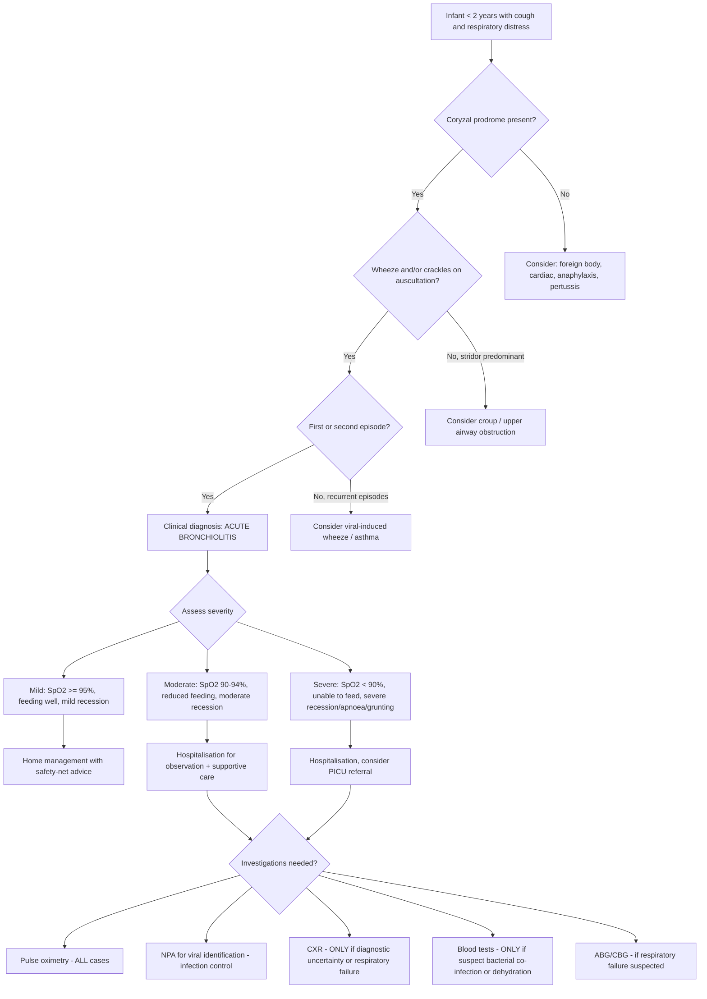

## Diagnosis of Bronchiolitis

### Diagnostic Criteria — A Clinical Diagnosis

This is the single most important concept to internalise: ***bronchiolitis is a clinical diagnosis*** [2]. There is no blood test, no CXR finding, and no viral PCR result that "makes" the diagnosis. You diagnose bronchiolitis at the bedside based on the history and examination.

The diagnostic criteria (as used in major guidelines — AAP 2014/reaffirmed 2023, NICE 2021, Australasian Bronchiolitis Guideline 2024) are:

| Criterion | Detail |
|---|---|
| **Age** | Infant or young child ***< 2 years of age*** [2] |
| **Clinical syndrome** | ***URTI symptoms (coryzal prodrome) followed by LRTI*** [2] |
| **Coryzal prodrome** | ***Fever (~70%), nasal congestion, nasal discharge*** — typically 1–3 days before LRTI onset [2] |
| **LRTI features** | ***Cough, breathlessness (SOB), wheezing and/or crackles on auscultation*** [2] |
| **± Respiratory distress** | Tachypnoea, recession, nasal flaring, grunting, feeding difficulty [2] |
| **Episode number** | First or second episode of viral-induced wheeze (recurrent episodes → consider asthma) |
| **Seasonality** | ***Most common in winter*** [2] — supports but does not confirm the diagnosis |

<Callout title="When Is Bronchiolitis NOT a Clinical Diagnosis?">
You only need investigations when:
1. The diagnosis is **uncertain** (atypical features, unusual age, atypical course)
2. The disease is **severe** (need to assess for respiratory failure, guide oxygen therapy)
3. You suspect a **complication** (secondary bacterial infection, respiratory failure)
4. You need to guide **infection control** (cohorting in hospital — viral identification helps prevent nosocomial spread)
</Callout>

---

### Why a Clinical Diagnosis? — Reasoning from First Principles

1. **No pathognomonic test exists**: RSV can cause simple URTI without bronchiolitis, and bronchiolitis can be caused by many different viruses. A positive RSV test does not confirm bronchiolitis, and a negative one does not exclude it.
2. **CXR is non-specific and often misleading**: CXR in bronchiolitis shows hyperinflation and peribronchial thickening, which overlaps heavily with viral pneumonia and asthma. More dangerously, patchy atelectasis in bronchiolitis is frequently **misinterpreted as consolidation**, leading to unnecessary antibiotic prescriptions.
3. **Blood tests do not help**: The viral aetiology means WBC is typically normal or shows mild lymphocytosis. CRP is usually low. These do not confirm or exclude the diagnosis.
4. **Clinical pattern recognition is reliable**: The combination of age < 2 years + coryzal prodrome + wheeze/crackles + respiratory distress during winter season has high positive predictive value.

---

### Diagnostic Algorithm

---

### Investigation Modalities — What, When, Why, and Key Findings

#### 1. Pulse Oximetry (SpO₂)

***Pulse oximetry*** is the single most important investigation in bronchiolitis [2].

| Aspect | Detail |
|---|---|
| **When** | **ALL cases** — part of initial assessment and ongoing monitoring |
| **Why** | Hypoxaemia from V/Q mismatch is the primary physiological derangement; SpO₂ guides oxygen therapy decisions |
| **How** | Paediatric probe on finger or toe (or preductal in neonates); ensure good waveform and accurate reading |
| **Key thresholds** | SpO₂ ≥ 95%: reassuring; SpO₂ 90–94%: supplemental oxygen likely needed; ***SpO₂ < 92%: indication for hospitalisation and oxygen therapy*** [2] |
| **Pitfalls** | Motion artefact (fussy baby), poor peripheral perfusion (cold extremities), and nail polish can give false readings. Continuous monitoring preferred over intermittent spot checks in hospitalised infants |

**Why SpO₂ is so important**: Remember from the pathophysiology that airway obstruction → air trapping + atelectasis → V/Q mismatch → hypoxaemia. SpO₂ tells you how well the lungs are gas-exchanging. An infant can have significant work of breathing but still maintain SpO₂ initially (compensating with tachypnoea); when SpO₂ drops, it means compensation is failing.

<Callout title="SpO₂ Threshold Debate" type="idea">
There is ongoing debate about whether to use SpO₂ < 90% or < 92% as the oxygen therapy threshold. NICE (2021) uses < 92% as the threshold for supplemental oxygen. AAP (2014) suggests considering < 90% as the threshold in otherwise stable infants to avoid overtreatment and prolonged hospitalisation. In **Hong Kong / QMH practice**, SpO₂ < 92% is generally used as the threshold for intervention [2]. For exams, know both cutoffs and state which guideline you are following.
</Callout>

---

#### 2. Nasopharyngeal Aspirate (NPA) / Nasopharyngeal Swab

***NPA for common viruses*** [1] is the standard method for identifying the causative organism.

| Aspect | Detail |
|---|---|
| **When** | Hospitalised patients — primarily for **infection control** (cohorting RSV-positive vs RSV-negative patients); NOT required to make the clinical diagnosis |
| **Why** | Viral identification allows: (1) cohorting to prevent nosocomial spread, (2) epidemiological surveillance, (3) guides prognosis (e.g., adenovirus → higher risk of bronchiolitis obliterans), (4) may avoid unnecessary antibiotics if viral aetiology confirmed |
| **Method** | NPA: gentle suction catheter into nasopharynx; NP swab: flocked swab inserted to nasopharynx |
| **Tests performed** | **Rapid antigen detection** (immunofluorescence or immunochromatographic rapid test) for RSV; **PCR panel** (multiplex respiratory viral PCR) for RSV, rhinovirus, HMPV, influenza, parainfluenza, adenovirus, coronavirus, bocavirus |
| **Key findings** | RSV positive in 50–80% of bronchiolitis cases [2]. Co-infection with ≥ 2 viruses found in 20–30% |
| **Turnaround** | Rapid antigen: ~30 minutes; PCR: 4–24 hours |

**Why not routinely test everyone?** In a typical presentation during RSV season, the diagnosis is clinical and management is entirely supportive regardless of the specific virus. NPA results do **not change treatment**. The main value is infection control in hospital settings — RSV-positive infants should be cohorted together and isolated from RSV-negative patients to prevent nosocomial outbreaks on the paediatric ward.

---

#### 3. Chest X-Ray (CXR)

***CXR should be considered in the presence of lower respiratory tract signs, relentlessly progressive cough (past the 2-week point), or haemoptysis*** [1]. In bronchiolitis specifically:

***CXR is NOT routinely indicated*** — it should only be performed ***if respiratory failure is suspected (± CXR/ABG if respiratory failure)*** [2] or if the **diagnosis is uncertain** (atypical features, possible pneumonia, possible foreign body, possible cardiac cause).

| Aspect | Detail |
|---|---|
| **When to order CXR** | (1) Diagnostic uncertainty — atypical features, unilateral signs, possible pneumonia; (2) ***Respiratory failure*** [2] — to assess complications; (3) Failure to improve as expected; (4) Suspected complications (pneumothorax, bacterial superinfection) |
| **When NOT to order** | Typical bronchiolitis with clear clinical picture — routine CXR adds no value and may cause harm (unnecessary antibiotics for misinterpreted atelectasis, radiation exposure, distress to infant) |

**Key CXR findings in bronchiolitis:**

| Finding | Explanation (Pathophysiology) |
|---|---|
| **Hyperinflation** | Air trapping from ball-valve mechanism → increased lung volume → flattened diaphragms (> 8 posterior ribs visible), increased anteroposterior diameter, widened intercostal spaces |
| **Peribronchial thickening** ("dirty lung fields", "peribronchial cuffing") | Oedema and inflammation around the bronchioles → thickened bronchial walls seen as ring shadows (end-on) or tram-lines (longitudinal) |
| **Patchy atelectasis / subsegmental collapse** | Complete obstruction of small airways → absorption of trapped air → collapse of distal lung segments. Appears as linear or patchy opacities, often in the right upper or middle lobe |
| **Flattened diaphragms** | Consequence of hyperinflation pushing the diaphragms down |
| **Normal or mildly increased perihilar markings** | Mild vascular congestion from increased pulmonary blood flow in areas of compensatory ventilation |

<Callout title="CXR Trap: Atelectasis vs Consolidation" type="error">
The most common trap with CXR in bronchiolitis is **misinterpreting patchy atelectasis as pneumonic consolidation**, which then triggers unnecessary antibiotic use. Studies show that obtaining a CXR in typical bronchiolitis leads to a **significant increase in antibiotic prescriptions** without any improvement in outcomes. This is why current guidelines strongly advise AGAINST routine CXR in bronchiolitis [1][2].

**How to distinguish**: Atelectasis in bronchiolitis is typically **bilateral, patchy, and subsegmental**, occurring in the context of **generalised hyperinflation**. Lobar consolidation with air bronchograms suggests true bacterial pneumonia. But in practice, this distinction on CXR is often difficult, especially in infants.
</Callout>

---

#### 4. Blood Gas Analysis (ABG / CBG / VBG)

***ABG is indicated if respiratory failure is suspected*** [2].

| Aspect | Detail |
|---|---|
| **When** | Severe respiratory distress, impending respiratory failure, SpO₂ < 90% despite supplemental O₂, apnoea, exhaustion, deteriorating consciousness |
| **Why** | Identifies **Type 1 respiratory failure** (hypoxaemia: PaO₂ < 8 kPa with normal/low PaCO₂) or **Type 2 respiratory failure** (hypoxaemia + hypercapnia: PaCO₂ > 6 kPa) |
| **Method in infants** | **Capillary blood gas (CBG)** is most commonly used in paediatrics (heel prick or finger); arterial sampling is painful and technically difficult in infants |
| **Key findings** | Early: **respiratory alkalosis** (hyperventilation → ↓PaCO₂ → ↑pH); Late/severe: **respiratory acidosis** (CO₂ retention → ↑PaCO₂ → ↓pH — indicates impending respiratory failure) |

**Interpretation guide:**

| Stage | PaO₂ | PaCO₂ | pH | Interpretation |
|---|---|---|---|---|
| Mild | Normal or slightly low | Low (hyperventilation) | High (alkalosis) | Compensating — increased RR blowing off CO₂ |
| Moderate | Low | Normal | Normal | Tiring — cannot maintain hyperventilation |
| Severe | Very low | **Elevated** | **Low (acidosis)** | **Respiratory failure** — urgent escalation needed |

<Callout title="Rising PaCO₂ = Danger" type="error">
In a tachypnoeic infant with bronchiolitis, a **normal or rising PaCO₂** is an ominous sign. It does NOT mean "all is well." It means the infant is tiring and can no longer hyperventilate to compensate. This infant needs immediate escalation of respiratory support (HFNC, CPAP, or intubation).
</Callout>

---

#### 5. Blood Tests (CBC, CRP, U&E, Blood Culture)

***Blood tests are NOT routinely indicated*** in bronchiolitis. They are reserved for specific clinical scenarios:

| Test | When to Order | Key Findings and Interpretation |
|---|---|---|
| ***CBC with differentials*** [1] | Suspected secondary bacterial infection; very unwell/toxic child; prolonged fever > 5 days | In typical bronchiolitis: **normal WBC or mild lymphocytosis** (viral pattern). Raised WBC with **neutrophilia** → suggests bacterial co-infection. **Marked lymphocytosis** (> 20 × 10⁹/L) → think pertussis |
| **CRP / PCT** | Suspected secondary bacterial infection | CRP typically low (< 20 mg/L) in uncomplicated bronchiolitis. CRP > 40–60 mg/L or procalcitonin > 0.5 ng/mL raises concern for bacterial infection |
| **U&E (Urea, Electrolytes, Creatinine)** | If requiring IV fluids — to guide fluid therapy and detect dehydration, SIADH | Bronchiolitis can cause **SIADH** (syndrome of inappropriate ADH secretion) → hyponatraemia. Also need to monitor electrolytes if on IV fluids |
| **Blood culture** | Suspected sepsis or bacterial pneumonia, especially in febrile neonates | ***Blood culture has a low detection rate even if bacterial aetiology*** [1]; still important in the septic-looking infant or neonate (where the pretest probability of bacterial infection is higher) |
| **Blood glucose** | Young infants (especially < 3 months), reduced feeding, lethargy | Infants have limited glycogen stores and are at risk of hypoglycaemia during illness with poor oral intake |

**Why SIADH occurs in bronchiolitis**: The pathophysiology is multifactorial — positive pressure ventilation (if on CPAP), intrathoracic pressure changes from air trapping and respiratory distress, and inflammatory cytokines all stimulate ADH release. This leads to water retention and dilutional hyponatraemia. Always check Na⁺ before starting IV fluids in a bronchiolitis patient.

---

#### 6. Viral Testing — Methods Compared

| Method | Sensitivity | Speed | Cost | Use |
|---|---|---|---|---|
| **Rapid antigen detection (immunochromatographic)** | Moderate (80–90% for RSV) | ~15–30 minutes | Low | Bedside / ED triage; rapid cohorting decision |
| **Direct immunofluorescence (DIF)** | Good (85–95%) | ~2–4 hours | Moderate | NPA sample; good for multiple viruses simultaneously |
| **Multiplex PCR** | Excellent (> 95%) | 4–24 hours | Higher | Gold standard for identification; detects multiple viruses including HMPV, bocavirus, rhinovirus |
| **Viral culture** | Variable | Days to weeks | High | Research / public health; rarely used clinically |

---

#### 7. Other Investigations — Reserved for Atypical Cases

These are NOT part of routine bronchiolitis workup but should be considered when the clinical picture is atypical or suggests an alternative/underlying diagnosis:

| Investigation | When to Consider | What You're Looking For |
|---|---|---|
| **Echocardiography** | Murmur on examination, cardiomegaly on CXR, failure to thrive, "recurrent bronchiolitis" that doesn't resolve | Congenital heart disease (VSD, PDA, AVSD) causing heart failure mimicking bronchiolitis |
| **Sweat test** | Recurrent lower respiratory infections, failure to thrive, steatorrhoea, meconium ileus history | Cystic fibrosis (Cl⁻ > 60 mmol/L diagnostic) |
| ***HRCT chest*** [9] | Persistent symptoms beyond 4–6 weeks, suspected bronchiolitis obliterans (especially post-adenovirus) | Mosaic attenuation, air trapping, bronchial wall thickening in bronchiolitis obliterans [9] |
| ***Nasal NO / Cilia study*** [9] | Recurrent LRTI, chronic wet cough, neonatal respiratory distress, situs inversus | Primary ciliary dyskinesia (nasal NO low; abnormal ciliary motility on high-speed video microscopy) |
| ***Immunoglobulin pattern*** [9] | Recurrent severe infections | Primary immunodeficiency (low IgG, IgA, IgM → antibody deficiency syndromes) |
| ***pH probe / impedance study*** [9] | Recurrent wheeze worse after feeds, poor weight gain, chronic cough | Gastro-oesophageal reflux disease (GORD) with aspiration |
| ***Bronchoscopy with BAL*** [9] | Persistent lobar collapse, recurrent pneumonia in same location, suspected foreign body | Foreign body retrieval; BAL for culture (lipid-laden macrophages in aspiration); airway anatomy (tracheomalacia, vascular compression) |
| ***Peak flow / Lung function study*** [9] | Older children (typically > 5–6 years) with recurrent wheeze | Reversible airflow obstruction → asthma (if FEV₁ improves > 12% post-bronchodilator) |
| **Mantoux test / IGRA** [9] | TB exposure risk, chronic cough > 4 weeks, failure to thrive, immigrant from endemic area | Tuberculosis |

<Callout title="The 'Chronic Cough' Investigation Panel" type="idea">
***The lecture slides list a comprehensive panel for investigating chronic cough in children*** [9]: CXR, peak flow ± lung function, CBC with differentials, Mantoux/PPD or IGRA for TB, sputum/gastric aspirate for TB, HRCT, nasal NO/cilia study/sweat test, immunoglobulin pattern, pH probe, video fluoroscopy, bronchoscopy with BAL. You would work through these systematically in a child with atypical or prolonged symptoms, NOT in typical acute bronchiolitis.
</Callout>

---

### Summary: Investigation Strategy by Severity

| Severity | Investigations Needed |
|---|---|
| **Mild (home management)** | **Pulse oximetry only** (± NPA if in ED for surveillance) |
| **Moderate (hospitalised)** | **Pulse oximetry** (continuous) + **NPA for viral identification** (infection control/cohorting) + **assess hydration** |
| **Severe (PICU referral)** | All of the above + ***CXR*** (assess for complications) + ***ABG/CBG*** (assess for respiratory failure) + **U&E** (guide IV fluids, check for SIADH) + **Blood glucose** + **consider blood culture** if toxic-looking |
| **Atypical / not improving** | All of the above + **CXR** (alternative diagnosis) + **CBC with differentials** + **CRP** + appropriate targeted investigations (echo, sweat test, HRCT, bronchoscopy etc.) depending on clinical suspicion |

---

### When to Suspect This Is NOT Bronchiolitis — Red Flags Prompting Investigation

| Red Flag | What to Investigate | Why |
|---|---|---|
| **Age < 1 month or > 24 months** | Full septic workup (neonate); consider asthma, foreign body (older child) | Age extremes are atypical for bronchiolitis |
| **Recurrent episodes (≥ 3)** | Echo, sweat test, immune workup, consider asthma | "Recurrent bronchiolitis" suggests an underlying structural, cardiac, immune, or chronic airway disease |
| **Unilateral signs** | CXR (inspiratory + expiratory), rigid bronchoscopy | Foreign body aspiration until proven otherwise |
| **High fever (> 39°C) or toxic-looking** | CBC, CRP, blood culture, CXR, urine culture | Bacterial co-infection or alternative bacterial diagnosis |
| **Failure to improve by day 7–10** | CXR, blood tests, consider echocardiography | Complication (secondary infection), wrong diagnosis (CHD, pertussis) |
| **Failure to thrive / poor growth** | Sweat test, echo, immune workup | CF, CHD, immunodeficiency |
| **Cardiac murmur** | Echocardiography | Congenital heart disease |
| **Apnoea in neonate** | Full septic screen, CBG, blood glucose, consider pertussis testing (NPA PCR for *B. pertussis*) | Neonatal bronchiolitis can present as apnoea, but so can sepsis, metabolic disease, and pertussis |

---

<Callout title="High Yield Summary">

**Diagnosis of Bronchiolitis — Must-Know Points:**

1. ***Bronchiolitis is a CLINICAL diagnosis*** [2] — made at the bedside from history + examination in an infant < 2 years with coryzal prodrome → wheeze/crackles ± respiratory distress
2. ***Pulse oximetry*** is the single most important investigation — performed in ALL cases [2]
3. ***CXR is NOT routinely indicated*** — only if respiratory failure, diagnostic uncertainty, or suspected complications [1][2]. Routine CXR leads to overdiagnosis of "pneumonia" and unnecessary antibiotics
4. ***NPA for viral identification*** is used for **infection control (cohorting)** in hospitalised patients, not to make the diagnosis [1]
5. ***ABG/CBG is reserved for suspected respiratory failure*** [2] — a normal or rising PaCO₂ in a tachypnoeic infant is an ominous sign
6. ***Blood tests are NOT routine*** — only if suspected bacterial co-infection, dehydration assessment, or SIADH screening [1]
7. ***Blood culture has a low detection rate*** even with bacterial aetiology [1]
8. In **atypical** or **recurrent** cases, think beyond bronchiolitis: order echo (CHD), sweat test (CF), immune workup, HRCT (bronchiolitis obliterans), or bronchoscopy (foreign body/structural) as appropriate
9. **Key CXR findings** (when performed): hyperinflation, peribronchial cuffing, patchy atelectasis (NOT consolidation), flattened diaphragms
10. Check **Na⁺** before IV fluids — bronchiolitis can cause **SIADH → hyponatraemia**

</Callout>

---

<ActiveRecallQuiz
  title="Active Recall - Diagnosis and Investigations of Bronchiolitis"
  items={[
    {
      question: "A 4-month-old presents in January with 2 days of coryza followed by wheeze, crackles, and tachypnoea. The SpO2 is 94% on room air. What is the diagnosis and what is the single most important investigation? Does this child need a CXR?",
      markscheme: "Diagnosis: Acute bronchiolitis (clinical diagnosis based on age < 2 years, coryzal prodrome, wheeze/crackles, respiratory distress). Most important investigation: Pulse oximetry (SpO2). This child does NOT need a routine CXR. CXR is only indicated if there is diagnostic uncertainty, suspected respiratory failure, or suspected complications."
    },
    {
      question: "Why do current guidelines recommend AGAINST routine CXR in bronchiolitis? What is the most common misinterpretation that leads to inappropriate management?",
      markscheme: "Routine CXR adds no diagnostic or therapeutic value in typical bronchiolitis. The most common misinterpretation is patchy atelectasis (from small airway obstruction) being read as pneumonic consolidation, which leads to unnecessary antibiotic prescriptions. Studies show CXR in bronchiolitis significantly increases antibiotic use without improving outcomes."
    },
    {
      question: "A hospitalised bronchiolitic infant on CPAP has a blood gas showing pH 7.28, PaCO2 7.5 kPa, PaO2 7.0 kPa. Interpret this result and state the type of respiratory failure and the appropriate next step.",
      markscheme: "Type 2 respiratory failure (hypoxaemia: PaO2 < 8 kPa, plus hypercapnia: PaCO2 > 6 kPa, with respiratory acidosis: pH < 7.35). This indicates the infant is tiring and cannot maintain ventilation. Next step: urgent escalation — consider intubation and mechanical ventilation or PICU transfer."
    },
    {
      question: "Name 3 clinical red flags in a child labelled as having bronchiolitis that should prompt further investigation beyond routine workup, and state what investigation you would order for each.",
      markscheme: "Any 3 of: (1) Recurrent episodes of wheeze (>= 3) — order echocardiogram, sweat test, immunoglobulin levels. (2) Unilateral wheeze or asymmetric air entry — CXR plus rigid bronchoscopy for foreign body. (3) Failure to thrive — sweat test for CF, echo for CHD, immune workup. (4) Cardiac murmur — echocardiography. (5) Apnoea in a neonate — full septic screen, CBG, pertussis PCR."
    },
    {
      question: "What is the purpose of performing NPA for viral identification in hospitalised bronchiolitis patients? Does a positive RSV result confirm the diagnosis of bronchiolitis?",
      markscheme: "Purpose: Infection control and cohorting — RSV-positive infants are isolated together to prevent nosocomial spread. Also useful for epidemiological surveillance and prognosis (e.g., adenovirus risk of bronchiolitis obliterans). A positive RSV result does NOT confirm bronchiolitis — RSV can cause simple URTI, and bronchiolitis is a clinical diagnosis made from the overall clinical picture."
    },
    {
      question: "Why should serum sodium be checked before starting IV fluids in a hospitalised infant with bronchiolitis?",
      markscheme: "Bronchiolitis can cause SIADH (syndrome of inappropriate ADH secretion) due to intrathoracic pressure changes from air trapping, positive pressure ventilation, and inflammatory cytokines stimulating ADH release. This leads to water retention and dilutional hyponatraemia. If hypotonic IV fluids are given without checking sodium, it can worsen hyponatraemia and potentially cause cerebral oedema and seizures."
    }
  ]}
/>

## References

[1] Lecture slides: GC 141. A child with cough acute and chronic cough in children.pdf (p14–15)
[2] Senior notes: Adrian Lui Pediatrics.pdf (p163, Acute Bronchiolitis section)
[9] Lecture slides: GC 141. A child with cough acute and chronic cough in children.pdf (p26, Investigations for chronic cough)
