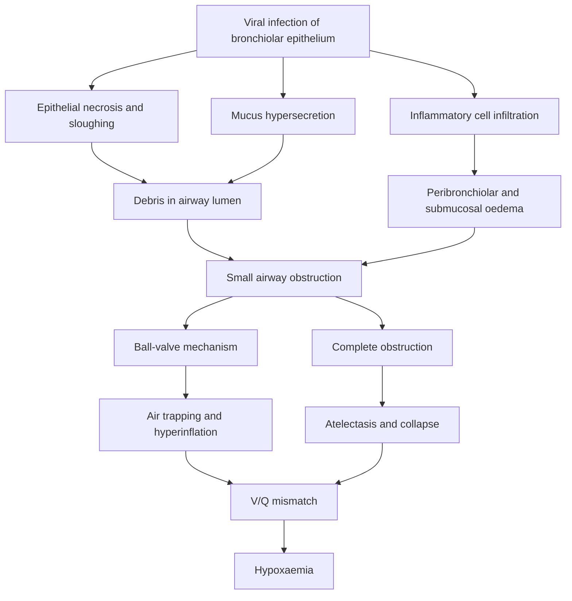
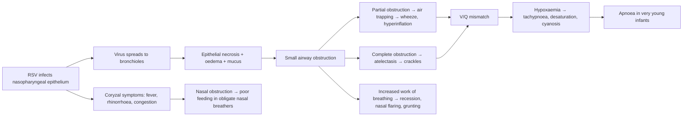

# Bronchiolitis in Children

## Definition

Bronchiolitis is an **acute inflammatory illness of the lower respiratory tract** characterised by **upper respiratory tract infection (URTI) symptoms followed by lower respiratory tract infection (LRTI) in children < 2 years of age** [1][2]. The name itself tells you the pathology: "bronchiol-" refers to the small airways (bronchioles), and "-itis" means inflammation. So this is inflammation of the bronchioles — the smallest conducting airways before you reach the alveoli.

Critically, this is a **clinical diagnosis** — you do not need a CXR or viral PCR to make the diagnosis in a typical case. The hallmark is a young infant presenting with coryzal prodrome followed by increasing respiratory distress with wheeze and/or crackles.

<Callout title="Key Distinction">
Bronchiolitis is NOT the same as "wheezy bronchitis" or asthma. Bronchiolitis refers specifically to the **first or second episode** of viral-induced wheezing/respiratory distress in infants < 2 years. Recurrent wheezing episodes in older children should prompt consideration of asthma or other diagnoses. Some guidelines use < 12 months as the cutoff (e.g., NICE), while others use < 24 months (e.g., AAP). For HKUMed purposes, use **< 2 years** as per the lecture material [1][2].
</Callout>

---

## Epidemiology

### Age Distribution
- ***Majority of cases occur in infants aged 1–9 months*** [1][2]
- Peak incidence at around **3–6 months of age**
- Almost all children will have been infected with RSV by age 2, but only ~20–30% develop lower respiratory tract disease (i.e., bronchiolitis)
- Neonates (< 1 month) can present atypically — see Clinical Features below

### Seasonality
- ***Most common in winter*** (in Hong Kong: typically November to March) [1][2]
- RSV epidemics occur annually in temperate climates; in Hong Kong (subtropical), there can be bimodal peaks (winter + summer/rainy season)
- The COVID-19 pandemic disrupted typical seasonal patterns; post-pandemic "rebound" RSV seasons have been observed globally

### Incidence and Burden
- Bronchiolitis is the **most common cause of hospitalisation in infants** in the first year of life
- Approximately 2–3% of all infants are hospitalised for bronchiolitis annually
- Global burden: estimated ~33 million episodes per year in children < 5, with ~3 million hospitalisations and ~60,000–200,000 deaths (predominantly in low-income settings)

### Hong Kong Context
- RSV is the dominant pathogen; Hong Kong also sees significant human metapneumovirus (HMPV) burden
- Hospital Authority data shows bronchiolitis as one of the top paediatric respiratory admissions during peak season
- Palivizumab is available in Hong Kong but usage is restricted due to cost (see Prevention)

---

## Risk Factors

Understanding risk factors helps you identify which infants are at risk of **severe disease** requiring hospitalisation or intensive care:

| Risk Factor | Why It Matters (Mechanism) |
|---|---|
| **Prematurity (< 37 weeks, especially < 32 weeks)** | Premature infants have smaller airways, less elastic recoil, reduced maternal antibody transfer (IgG crosses placenta predominantly in 3rd trimester), and immature immune responses |
| **Age < 3 months** | Smallest airway calibre; obligate nasal breathers; immature immune system; reduced ability to clear secretions |
| **Chronic lung disease / Bronchopulmonary dysplasia (BPD)** | Already compromised lung function and reduced respiratory reserve |
| **Congenital heart disease (especially haemodynamically significant)** | Cannot tolerate the increased work of breathing; pulmonary congestion exacerbates respiratory distress |
| **Immunodeficiency** | Impaired viral clearance → prolonged/more severe illness |
| **Neuromuscular disease** | Poor cough reflex, weak respiratory muscles → inability to clear secretions |
| **Exposure to tobacco smoke** | Impairs mucociliary clearance, increases airway reactivity, damages epithelium |
| **Lack of breastfeeding** | Breast milk provides secretory IgA and other immune factors that protect mucosal surfaces |
| **Crowded living conditions / daycare attendance** | Increased viral exposure |
| **Older siblings** | Major vector for bringing respiratory viruses home from school/daycare |
| **Low socioeconomic status** | Multifactorial: crowding, nutrition, access to care |
| **Male sex** | Males have slightly smaller airways relative to lung size in infancy |
| **Down syndrome** | Combination of smaller airways, hypotonia, congenital heart disease, and immune dysfunction |

<Callout title="High-Risk Infants" type="idea">
When assessing a baby with bronchiolitis, always screen for: prematurity, CHD, CLD/BPD, immunodeficiency, and neuromuscular disease. These are the children who may need closer monitoring, earlier escalation, and possibly prophylaxis with palivizumab or nirsevimab.
</Callout>

---

## Anatomy and Function: Why Small Airways Matter

To understand bronchiolitis, you need to appreciate **infant airway anatomy** and why it makes them vulnerable:

### Airway Anatomy
- **Bronchioles** are the small airways (< 1 mm diameter) that lack cartilage and are lined by ciliated columnar epithelium
- They are the last conducting airways before the respiratory zone (respiratory bronchioles → alveolar ducts → alveoli)
- In infants, bronchiolar diameter is already tiny — approximately **0.1–0.3 mm**

### Poiseuille's Law — The Key Physics
The resistance to airflow in a tube is governed by:

$$R = \frac{8 \eta L}{\pi r^4}$$

Where:
- R = resistance
- η = viscosity of the gas
- L = length of the airway
- **r = radius of the airway**

**Resistance is inversely proportional to the fourth power of the radius.** This means that even a small reduction in airway radius (e.g., 50% narrowing due to mucosal oedema and mucus plugging) causes a **16-fold increase** in resistance!

### Why Infants Are Particularly Vulnerable
1. **Smaller baseline airway calibre** → even minimal oedema causes proportionally greater narrowing
   - A 1 mm thick layer of oedema in a 4 mm infant bronchiole reduces the radius to 1 mm → resistance increases by (2/1)⁴ = 16-fold
   - The same 1 mm oedema in an 8 mm adult airway reduces the radius to 3 mm → resistance increases by only (4/3)⁴ ≈ 3-fold
2. **Higher airway compliance (floppy airways)** → airways collapse more easily during expiration
3. **Fewer collateral ventilation channels** (pores of Kohn and channels of Lambert are underdeveloped until ~3–4 years) → air trapping and atelectasis occur more readily
4. **Obligate nasal breathers** (up to ~4–6 months) → nasal congestion alone can cause significant respiratory distress
5. **Horizontal ribs and weak intercostal muscles** → less efficient respiratory mechanics; rely heavily on diaphragmatic breathing
6. **Higher metabolic rate** → higher oxygen consumption per kg → less reserve before desaturation

---

## Aetiology (Microbiology)

### Causative Organisms

***RSV accounts for 50–80% of bronchiolitis cases*** [1][2]. The remainder are caused by other respiratory viruses:

| Pathogen | Proportion | Key Notes |
|---|---|---|
| ***Respiratory Syncytial Virus (RSV)*** | ***50–80%*** | Most common cause; two subtypes (A and B); type A generally causes more severe disease |
| ***Rhinovirus*** | 10–20% | Second most common; associated with recurrent wheezing/asthma risk |
| ***Parainfluenza virus*** | 5–10% | Types 1–4; type 3 most associated with bronchiolitis (types 1&2 more associated with croup) |
| ***Adenovirus*** | ~5% | Can cause severe necrotising bronchiolitis → **bronchiolitis obliterans** (rare but important) |
| ***Influenza virus*** | ~5% | Seasonal; important to consider during flu season |
| ***Human Metapneumovirus (HMPV)*** | 5–10% | Paramyxovirus family; similar clinical picture to RSV; increasingly recognised in Hong Kong |
| Bocavirus, coronavirus, enterovirus | Rare | Co-infections common (~20–30% of cases) |

### About RSV
- **Family**: Paramyxoviridae → Genus: *Orthopneumovirus*
- **Structure**: Enveloped, single-stranded negative-sense RNA virus
- **Key surface proteins**:
  - **F (fusion) protein**: mediates viral entry by fusing viral envelope with host cell membrane → this is the target of palivizumab and nirsevimab
  - **G (attachment) protein**: mediates viral attachment to host cell
- **Transmission**: via **respiratory droplets and fomites** (RSV survives on surfaces for hours)
  - Incubation period: **4–6 days**
  - Shedding: typically 3–8 days, but can be prolonged (weeks) in young infants and immunocompromised patients
- **Immunity**: Infection does NOT produce lasting immunity → reinfection is common throughout life, though subsequent infections tend to be milder

<Callout title="Co-infections" type="idea">
Co-infection with two viruses (e.g., RSV + rhinovirus) is found in 20–30% of hospitalised bronchiolitis cases. The clinical significance of co-infection is debated; some studies suggest worse outcomes, others show no difference. Routine viral testing does not change management in most cases.
</Callout>

---

## Pathophysiology

Understanding the pathophysiology explains every clinical feature. Let's walk through what happens step by step:

### Step 1: Viral Inoculation and Spread
1. Virus enters via the **nasopharyngeal epithelium** (hence the coryzal prodrome)
2. Over 1–3 days, the virus spreads from the upper airway to the **lower respiratory tract** via aspiration of secretions and cell-to-cell spread
3. RSV preferentially infects **ciliated epithelial cells** of the bronchioles

### Step 2: Epithelial Damage and Inflammation
1. Viral replication causes **direct cytopathic damage** to bronchiolar epithelial cells → necrosis and sloughing of epithelium into the airway lumen
2. The innate immune response is triggered:
   - **Neutrophil infiltration** (predominant inflammatory cell)
   - **Macrophage activation**
   - Release of pro-inflammatory cytokines (IL-1, IL-6, IL-8, TNF-α) and chemokines
3. **Peribronchiolar oedema** develops from increased vascular permeability
4. **Submucosal oedema** and **mucus hypersecretion** from goblet cells

### Step 3: Airway Obstruction
The combination of:
- Sloughed epithelial cells + inflammatory debris
- Mucus plugging
- Submucosal and peribronchiolar oedema
- (± Smooth muscle bronchospasm — though this is a **minor** component in bronchiolitis, unlike asthma)

...causes **partial or complete obstruction** of the small airways.

### Step 4: Downstream Consequences

#### Ball-Valve Mechanism (Partial Obstruction)
- During **inspiration**: negative intrapleural pressure dilates airways, allowing air to pass the partial obstruction
- During **expiration**: positive intrapleural pressure compresses the already narrowed airways → air is trapped distally
- Result: **hyperinflation** and **air trapping** → flattened diaphragms on CXR, barrel chest clinically

#### Complete Obstruction
- If the airway is completely blocked by debris/mucus → no air enters or exits
- Trapped air is absorbed → **atelectasis** (collapse)
- In infants, this is more common because they lack collateral ventilation channels

#### V/Q Mismatch
- Both hyperinflation (increased dead space) and atelectasis (shunting) cause **ventilation-perfusion (V/Q) mismatch**
- This is the primary mechanism of **hypoxaemia** in bronchiolitis
- Unlike pneumonia where there is consolidation and true shunt, bronchiolitis hypoxaemia often responds well to supplemental oxygen (because the V/Q mismatch is not pure shunt)

<Callout title="Why Bronchodilators Don't Work Well" type="error">
A common mistake is treating bronchiolitis like asthma. In asthma, the primary mechanism of airway obstruction is **smooth muscle bronchospasm**, which responds to β₂-agonists. In bronchiolitis, the obstruction is caused by **mucosal oedema, mucus plugging, and epithelial debris** — smooth muscle spasm is a minor component. This is why bronchodilators provide at best modest, short-term benefit and do not change overall outcomes [1][2].
</Callout>

---

## Classification

Bronchiolitis can be classified by **severity** (most clinically useful) and by **aetiology**:

### By Severity

| Feature | Mild | Moderate | Severe |
|---|---|---|---|
| **Feeding** | Normal or slightly reduced | Reduced (< 50% of normal) | Unable to feed / requires NG or IV fluids |
| **Respiratory rate** | Mildly elevated | Moderately elevated (> 60/min) | > 70/min or apnoea |
| **Oxygen saturation** | ≥ 95% on room air | 90–94% on room air | < 90% on room air |
| **Work of breathing** | Mild subcostal recession | Moderate recession, nasal flaring | Severe recession, grunting, see-saw breathing |
| **Behaviour** | Alert, interactive | Irritable but consolable | Lethargic, exhausted, poorly responsive |
| **Management** | Can usually manage at home | Requires hospitalisation | May require PICU / respiratory support |

> **Note on age-appropriate respiratory rates (normal for age):**
> - Neonate (< 1 month): 30–60/min
> - 1–12 months: 25–50/min  
> - 1–3 years: 20–30/min
> 
> Tachypnoea in an infant < 12 months is generally defined as RR > 50/min, though some use > 60/min as the threshold for concern.

### By Aetiology
- **RSV bronchiolitis** (most common)
- **Non-RSV bronchiolitis** (rhinovirus, HMPV, parainfluenza, etc.)
- **Adenoviral bronchiolitis** — deserves special mention because of risk of **bronchiolitis obliterans** [1][2]

### Special Types
- **Bronchiolitis obliterans** (obliterans = "obliterating/destroying"): a rare but serious complication, particularly after ***adenovirus infection*** [1][2], where severe inflammation leads to **fibrotic obliteration** of the bronchioles → permanent obstructive lung disease. This is NOT typical bronchiolitis but a distinct pathological entity.

---

## Clinical Features

### Natural History and Timeline

***Clinical features are worst on day 2–3*** [1][2] of the lower respiratory phase. The typical timeline is:

1. **Day 0–2**: Coryzal prodrome (URTI symptoms)
2. **Day 2–5**: Peak of LRTI symptoms (worst respiratory distress)
3. **Day 5–10**: Gradual improvement
4. **Most recover within 2 weeks** [1][2], though cough may persist for 3–4 weeks
5. ***50% have recurrent wheezing episodes*** [1][2] in subsequent years

### Symptoms (What the Parent Reports)

| Symptom | Pathophysiological Basis |
|---|---|
| ***Preceding coryzal symptoms: fever (~70%), nasal congestion, nasal discharge*** [1][2] | Initial viral replication in the nasopharyngeal epithelium triggers local inflammation and pyrogenic cytokine release |
| ***Cough*** [1][2] | Irritation of airway epithelium and cough receptors by inflammation, debris, and mucus; initially dry, then wet/productive |
| ***Breathlessness (SOB)*** [1][2] | Increased airway resistance from oedema and mucus → increased work of breathing → perceived dyspnoea |
| Reduced feeding / poor feeding | Combination of nasal obstruction (infants are obligate nasal breathers — they can't breathe while feeding), tachypnoea (can't coordinate suck-swallow-breathe), and general malaise |
| Irritability | Hypoxia, discomfort from respiratory distress, general illness |
| **Apnoea** (particularly in premature infants and neonates < 1 month) | Likely multifactorial: immature central respiratory drive, vagal-mediated reflex from nasopharyngeal secretions, respiratory muscle fatigue. **Apnoea may be the presenting feature** in very young infants BEFORE other typical signs appear |

<Callout title="Apnoea Warning" type="error">
***Apnoea may be the presenting complaint in very young infants (< 6 weeks) with bronchiolitis, even BEFORE wheeze or respiratory distress develop.*** Always ask about apnoeic episodes and consider bronchiolitis in the differential of neonatal apnoea during RSV season. Risk factors for apnoea include: age < 2 months, history of prematurity, and history of apnoea of prematurity.
</Callout>

### Signs (What You Find on Examination)

| Sign | Pathophysiological Basis |
|---|---|
| **Low-grade fever** (typically < 39°C) | Pyrogenic cytokines (IL-1, IL-6, PGE₂) from the inflammatory response acting on the hypothalamic thermoregulatory centre. High fever (> 39°C) should raise suspicion of bacterial superinfection |
| **Nasal congestion and rhinorrhoea** | Mucosal inflammation and oedema in the nasal passages |
| **Tachypnoea** | Compensatory increase in respiratory rate to maintain minute ventilation in the face of increased dead space and V/Q mismatch |
| ***Wheezing*** [1][2] | High-pitched, polyphonic, predominantly **expiratory** — caused by turbulent airflow through narrowed small airways. The narrowing is worse during expiration (dynamic compression) → hence the expiratory predominance |
| ***Crackles (crepitations)*** [1][2] | Fine inspiratory crackles caused by the sudden opening of collapsed small airways and alveoli during inspiration (like "popping" open). Also from air bubbling through secretions/debris |
| ***Signs of respiratory distress*** [1][2] | Subcostal, intercostal, and suprasternal **recession** (retractions) — the highly compliant infant chest wall is "sucked in" by the large negative intrapleural pressures generated to overcome increased airway resistance |
| **Nasal flaring** | Reflex dilation of the nares to reduce nasal airway resistance and facilitate airflow |
| **Tracheal tug** | Visible descent of the trachea with each inspiration — indicates significant use of accessory muscles |
| **Head bobbing** (in infants) | Sternocleidomastoid contraction pulling the head forward with each breath — sign of severe respiratory effort |
| **Hyperinflation** (barrel chest, hyperresonance to percussion) | Air trapping due to ball-valve mechanism → increased FRC → thorax held in inspiration |
| **Palpable liver and spleen** | NOT hepatosplenomegaly — the hyperinflated lungs push the diaphragm down, displacing the liver and spleen below the costal margin. This is a common trap |
| **Grunting** | Expiration against a partially closed glottis — a physiological mechanism to generate auto-PEEP, maintaining alveolar patency and preventing collapse. **Grunting is a sign of severe disease** |
| **See-saw (paradoxical) breathing** | The compliant chest wall collapses inward while the abdomen protrudes during inspiration — suggests severe respiratory distress and potential impending respiratory failure |
| **Cyanosis** | Late sign — occurs when deoxyhaemoglobin > 5 g/dL. Indicates significant hypoxaemia and warrants urgent intervention |
| **Reduced SpO₂** | V/Q mismatch → inadequate oxygenation. SpO₂ < 92% on room air is generally an indication for supplemental oxygen |
| Dehydration signs (reduced urine output, dry mucous membranes, sunken fontanelle) | Reduced oral intake + increased insensible losses from fever and tachypnoea |

### Auscultation Findings — What You'll Hear

- **Bilateral, symmetrical wheeze** — typically high-pitched, expiratory
- **Fine crackles** — bilateral, end-inspiratory
- **Prolonged expiratory phase**
- In severe cases: **reduced air entry** (ominous sign — may indicate severe air trapping or impending respiratory failure; a "quiet chest" is dangerous)

<Callout title="Important: The 'Quiet Chest'" type="error">
A previously wheezy infant who becomes quiet with reduced air entry is NOT improving — they are deteriorating. This means air movement is so poor that there is insufficient flow to generate wheeze. This is an emergency requiring immediate escalation.
</Callout>

### Examination Checklist for Bronchiolitis

A systematic approach to examining a child with suspected bronchiolitis:

1. **General inspection**: Alert vs. irritable vs. lethargic? Feeding? Colour (pink vs. pale vs. cyanotic)?
2. **Vital signs**: Temperature, RR (count for a full 60 seconds), HR, SpO₂, BP (if indicated)
3. **Respiratory assessment**:
   - Work of breathing: recession, nasal flaring, grunting, head bobbing, tracheal tug, accessory muscle use
   - Chest shape: hyperinflation?
   - Auscultation: wheeze, crackles, air entry, symmetry
4. **Hydration status**: Fontanelle, mucous membranes, skin turgor, urine output (wet nappies)
5. **ENT**: Otoscopy (RSV bronchiolitis can have concurrent acute otitis media)
6. **Other systems**: Cardiac examination (murmur? Consider congenital heart disease as underlying risk factor or differential diagnosis)

### Age-Specific Considerations

| Age Group | Key Considerations |
|---|---|
| **Neonates (< 1 month)** | May present with **apnoea**, temperature instability (hypothermia or fever), poor feeding rather than typical wheeze; lower threshold for septic workup |
| **1–6 months** | Classical presentation; highest risk age group for severe disease |
| **6–12 months** | Still common; usually less severe than younger infants |
| **12–24 months** | Less common; consider alternative diagnoses (asthma, foreign body, pertussis) if presentation atypical |
| **> 2 years** | Bronchiolitis diagnosis becomes less likely; recurrent wheezing more suggestive of asthma |

---

## Summary of Pathophysiology → Clinical Features Correlation

---

<Callout title="High Yield Summary">

**Bronchiolitis — Key Points for Exams:**

1. **Definition**: Acute URTI followed by LRTI in children ***< 2 years*** — a **clinical diagnosis**
2. **Peak age**: ***1–9 months***; most common in ***winter***
3. **Aetiology**: ***RSV (50–80%)*** is dominant; other viruses include rhinovirus, parainfluenza, adenovirus, influenza, HMPV
4. **Pathophysiology**: Viral → epithelial necrosis + oedema + mucus → small airway obstruction → air trapping (ball-valve) + atelectasis → V/Q mismatch → hypoxaemia. Bronchospasm is a **minor** component (hence why bronchodilators don't really work)
5. **Clinical course**: ***Worst on day 2–3***; most ***recover within 2 weeks***; ***50% have recurrent wheezing***
6. **Key symptoms**: Coryzal prodrome (***fever ~70%***, nasal congestion, discharge) → ***cough, SOB, wheeze/crackles, ± respiratory distress***
7. **Danger signs**: Apnoea (especially < 6 weeks), grunting, cyanosis, poor feeding, lethargy, quiet chest
8. **Risk factors for severe disease**: Prematurity, age < 3 months, CHD, CLD/BPD, immunodeficiency, neuromuscular disease
9. **Why infants are vulnerable**: Poiseuille's law (R ∝ 1/r⁴) — small baseline airway calibre means even minimal oedema causes massive increase in resistance
10. **Adenovirus** can cause ***bronchiolitis obliterans*** (rare but permanent damage) [1][2]
11. ***Palivizumab***: monoclonal antibody against RSV F protein; ***IM injection Q1 month***; ***reduces hospitalisation but limited by cost and need for multiple injections*** [1][2]

</Callout>

---

<ActiveRecallQuiz
  title="Active Recall - Bronchiolitis (Definition, Epidemiology, Aetiology, Pathophysiology, Clinical Features)"
  items={[
    {
      question: "A 3-month-old infant presents in January with 2 days of coryza followed by increasing respiratory distress with wheeze and crackles. What is the most likely diagnosis, most likely causative organism, and what is the typical age range affected?",
      markscheme: "Diagnosis: Acute bronchiolitis. Most likely organism: RSV (50-80%). Age range: < 2 years, majority 1-9 months. Peak season: winter."
    },
    {
      question: "Explain using Poiseuille's law why infants are more vulnerable to airway obstruction in bronchiolitis than older children or adults.",
      markscheme: "Resistance is inversely proportional to the fourth power of the radius (R = 8etaL / pi r^4). Infants have much smaller baseline airway calibre, so even 1 mm of mucosal oedema causes a proportionally much greater reduction in radius and a massive (up to 16-fold) increase in airway resistance compared to adults."
    },
    {
      question: "What is the primary mechanism of hypoxaemia in bronchiolitis, and why do bronchodilators have limited efficacy?",
      markscheme: "Primary mechanism: V/Q mismatch from air trapping (ball-valve mechanism causing hyperinflation) and atelectasis (complete obstruction). Bronchodilators have limited efficacy because the obstruction is caused by mucosal oedema, mucus plugging, and epithelial debris, NOT smooth muscle bronchospasm (which is a minor component)."
    },
    {
      question: "A 3-week-old ex-premature infant is brought to ED with apnoeic episodes but no wheeze. It is RSV season. Could this be bronchiolitis? Explain why.",
      markscheme: "Yes. Apnoea may be the presenting feature of bronchiolitis in very young infants (< 6 weeks) and premature infants, BEFORE typical signs of wheeze and respiratory distress develop. Due to immature central respiratory drive and vagal-mediated reflex from nasopharyngeal secretions."
    },
    {
      question: "Name the specific adenovirus-related complication of bronchiolitis and explain what happens pathologically.",
      markscheme: "Bronchiolitis obliterans. Severe adenoviral infection causes necrotising inflammation leading to fibrotic obliteration of the bronchioles, resulting in permanent obstructive lung disease."
    },
    {
      question: "What is palivizumab? State its target, route, dosing frequency, efficacy, and the main limitation to its use.",
      markscheme: "Palivizumab is a monoclonal antibody against the RSV F (fusion) glycoprotein. Route: IM injection. Frequency: once monthly during RSV season. Efficacy: reduces hospitalisation rate. Main limitation: high cost and need for multiple monthly injections."
    }
  ]}
/>

---

## References

[1] Lecture slides: GC 141. A child with cough acute and chronic cough in children.pdf
[2] Senior notes: Adrian Lui Pediatrics.pdf (p163, Lower Respiratory Tract Infections section)
