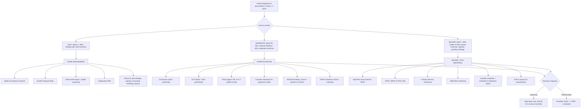

## Management of Bronchiolitis

### Core Principle: Supportive Care Is the Mainstay

Let me be very direct about this: ***supportive care is the mainstay of treatment*** for bronchiolitis [2]. This is one of the most important concepts in paediatric respiratory medicine and one that students frequently get wrong in exams by over-treating.

**Why is there no "magic bullet" for bronchiolitis?** The airway obstruction is caused by **mucosal oedema, epithelial debris, and mucus plugging** — none of which respond meaningfully to bronchodilators, steroids, or antibiotics. Unlike asthma (where bronchospasm is the primary mechanism and responds to β₂-agonists and steroids), the obstruction in bronchiolitis is mechanical and inflammatory at the epithelial level. The virus runs its course, the immune system clears it, the epithelium regenerates, and the child recovers. Our job is to **keep the child alive, hydrated, and oxygenated** while this natural process occurs.

---

### Management Algorithm

---

### Indications for Hospitalisation

***The following are indications for hospitalisation*** [2]:

| Indication | Rationale |
|---|---|
| ***History of apnoea*** | Risk of recurrent apnoea → respiratory arrest; needs continuous monitoring |
| ***RR > 60*** | Significant tachypnoea indicates substantial respiratory compromise |
| ***Severe respiratory distress*** | Marked recession, grunting, nasal flaring, see-saw breathing — suggests impending failure |
| ***SpO₂ < 92% in room air*** | Hypoxaemia requiring supplemental oxygen therapy |
| ***Difficulty feeding*** | Cannot coordinate suck-swallow-breathe; risk of aspiration and dehydration |
| ***< 50% usual fluid intake in 24 hours*** | Dehydration risk; likely to need NG or IV fluids |
| ***Uncertain diagnosis*** | Need observation and investigation to exclude alternative diagnoses (cardiac, foreign body etc.) |

**Additional risk factors that lower the threshold for admission** (even if the above criteria are not met):
- Age < 6 weeks (higher risk of apnoea)
- Prematurity (< 37 weeks, especially < 32 weeks)
- Known comorbidity: CHD, CLD/BPD, immunodeficiency, neuromuscular disease, Down syndrome
- Social factors: distance from hospital, parental ability to monitor, language barriers
- Inadequate caregiver understanding of safety-net advice

---

### Treatment Modalities — Detailed Breakdown

#### 1. Fluid Support

***Fluid support*** is a critical component of management [2].

***There is a higher fluid requirement due to fever, tachypnoea, reduced oral intake, and vomiting*** [2].

| Modality | When | How | Why |
|---|---|---|---|
| **Small, frequent oral feeds** | Mild disease; infant still able to feed | Offer breast/bottle feeds more frequently in smaller volumes | Tachypnoeic infants fatigue quickly during feeds; smaller volumes reduce aspiration risk and are easier to manage |
| **Nasogastric (NG) feeds** | Moderate disease; unable to take sufficient oral feeds but gut functioning | Insert NG tube; give breast milk or formula as bolus or continuous feeds | Preserves gut function (enteral feeding preferred over IV), reduces IV cannula-related complications. Use breast milk if breastfeeding to maintain supply |
| **Intravenous (IV) fluids** | Severe disease; unable to tolerate enteral feeds; significant dehydration; PICU setting | **Isotonic fluids** (0.9% NaCl + 5% dextrose) at **2/3 to 3/4 maintenance rate** | Full maintenance may cause fluid overload (SIADH risk). Use isotonic fluids to avoid worsening any existing hyponatraemia from SIADH |

**Why restrict fluids to 2/3–3/4 maintenance?** Bronchiolitis is associated with **SIADH** (syndrome of inappropriate ADH secretion) — ADH is released due to intrathoracic pressure changes from air trapping, positive pressure ventilation, and inflammatory cytokines. SIADH causes water retention → dilutional hyponatraemia. Full maintenance fluids would exacerbate this. Always **check serum Na⁺ before starting IV fluids** and monitor 12–24-hourly.

<Callout title="Fluid Choice in Paediatrics" type="error">
**Never** use hypotonic fluids (e.g., 0.18% NaCl, "one-fifth normal saline") as maintenance fluids in sick children. The risk of iatrogenic hyponatraemia is significant, especially with SIADH. Current paediatric guidelines (NICE, APLS) recommend **isotonic maintenance fluids** (0.9% NaCl ± dextrose) for ALL hospitalised children requiring IV fluids. This applies to bronchiolitis as much as any other condition.
</Callout>

---

#### 2. Oxygen Support — The Escalation Ladder

***Oxygen support*** is provided as a stepwise escalation — you start with the least invasive and escalate only if needed [2]:

***High flow O₂ ± CPAP, BiPAP*** [2]

| Level | Device | Flow / Settings | When to Use | Mechanism |
|---|---|---|---|---|
| **Step 1: Low-flow nasal prong O₂** | Nasal prongs/cannulae | 0.5–2 L/min (in infants) | SpO₂ < 92% on room air; mild-moderate hypoxaemia | Increases FiO₂ in inspired gas to overcome V/Q mismatch |
| **Step 2: High-flow nasal cannula (HFNC)** | Optiflow / Fisher & Paykel system | 2 L/kg/min (typical starting flow; max ~8 L/min for infants) | Persistent hypoxaemia or significant work of breathing despite low-flow O₂; moderate-severe disease | Delivers **heated, humidified** O₂ at high flow → provides a degree of **positive airway pressure (washout of dead space, small amount of CPAP effect)**, reduces work of breathing, improves mucociliary function via humidification |
| **Step 3: CPAP** | Nasal CPAP via prongs or mask | 5–8 cmH₂O, FiO₂ titrated to target SpO₂ | Failure of HFNC; significant respiratory distress; recurrent apnoea; SpO₂ < 92% on HFNC | **Continuous positive airway pressure** → splints open the small airways, prevents collapse during expiration, recruits atelectatic alveoli, reduces work of breathing |
| **Step 4: BiPAP** | Nasal BiPAP | IPAP 8–12 cmH₂O, EPAP 5–6 cmH₂O | Failure of CPAP; rising PaCO₂ with respiratory acidosis; need for additional ventilatory support | Bilevel pressure → EPAP keeps airways open (like CPAP) + IPAP assists inspiration → augments tidal volume and reduces work of breathing |
| **Step 5: Intubation + Mechanical ventilation** | Endotracheal tube + ventilator | Age-appropriate ETT size and ventilator settings | ***Respiratory failure*** despite non-invasive support; recurrent/prolonged apnoea; exhaustion; loss of consciousness | Full ventilatory support. Use **low-tidal-volume, longer expiratory time** strategy to avoid worsening air trapping |

**HFNC — Why it has transformed bronchiolitis management:**
HFNC has become the most important respiratory support tool in moderate-severe bronchiolitis. The mechanisms are:
1. **Dead space washout**: High-flow gas flushes expired CO₂ from the nasopharynx, reducing rebreathing
2. **Low-level CPAP effect**: The high flow generates ~2–5 cmH₂O of positive pressure, keeping small airways open
3. **Humidification**: Heated humidified gas improves mucociliary clearance and reduces airway drying
4. **Reduced metabolic cost**: Less energy spent heating and humidifying inspired air
5. **Better tolerated than CPAP/BiPAP** in infants (nasal prongs rather than a tight mask)

Multiple RCTs (including the landmark PARIS trial 2017) have shown HFNC reduces the need for CPAP/ICU escalation and is now first-line respiratory support for moderate bronchiolitis in most paediatric units globally, including Hong Kong.

**Target SpO₂ in bronchiolitis:**
- **≥ 92%** is the standard target in Hong Kong / NICE guidelines [2]
- AAP suggests **≥ 90%** may be acceptable in otherwise well infants (to avoid over-monitoring and prolonged hospitalisation)
- **Do not aim for 100%** — this leads to unnecessary oxygen administration and delayed discharge

**When to wean oxygen:**
- Trial off oxygen when SpO₂ consistently ≥ 92–95% for ≥ 4 hours (including during sleep and feeds)
- Monitor for 12–24 hours off oxygen before discharge

---

#### 3. Nebulised 3% Hypertonic Saline

***Nebulised 3% hypertonic saline: 1st line treatment in QMH, shown in meta-analysis to decrease hospitalisation rate*** [2]

| Aspect | Detail |
|---|---|
| **Dose** | 4 mL of 3% NaCl nebulised over 15–20 minutes, every 4–8 hours |
| **Mechanism** | (1) **Osmotic effect**: draws water into the airway lumen from the submucosa → thins mucus and rehydrates the airway surface liquid → makes secretions easier to clear. (2) **Improves mucociliary clearance** by enhancing ciliary beat frequency. (3) **Reduces mucosal oedema** by osmotic dehydration of the swollen submucosal tissue. (4) **May disrupt ionic bonds** in the mucus gel layer, reducing its viscosity |
| **Evidence** | Cochrane meta-analysis (Zhang et al. 2017) showed reduced length of hospitalisation by ~1 day in inpatients. Less clear benefit in ED-only use |
| **Indication** | Hospitalised infants with bronchiolitis — ***1st line treatment at QMH*** [2] |
| **Contraindications/Cautions** | May cause transient bronchospasm (consider pre-treatment with salbutamol or administering with salbutamol in high-risk patients); avoid in very severe cases where nebuliser mask may worsen distress |
| **Not recommended** | As sole treatment in ED for immediate discharge; not a substitute for supportive care |

<Callout title="Why Hypertonic Saline and Not Normal Saline?">
Normal saline (0.9%) is isotonic — it does not create an osmotic gradient. **Hypertonic** (3%) saline creates an osmotic gradient that draws water into the airway lumen, thinning secretions and pulling fluid out of the oedematous mucosa. Think of it as "de-swelling" the airway wall while simultaneously making the mucus easier to cough out. This is the same principle behind hypertonic saline use in CF patients.
</Callout>

---

#### 4. Inhaled Short-Acting Beta-Agonists (SABA)

***Inhaled SABA: may provide modest short-term improvement but no change in overall outcome*** [2]

| Aspect | Detail |
|---|---|
| **Drug** | Salbutamol (albuterol) |
| **Paediatric dose** | Nebulised: 2.5 mg (< 5 years) via nebuliser; MDI + spacer: 2–6 puffs via spacer with face mask |
| **Mechanism** | β₂-adrenergic receptor agonist → relaxes bronchial smooth muscle → bronchodilation |
| **Why it doesn't work well in bronchiolitis** | The predominant mechanism of obstruction is **mucosal oedema, mucus plugging, and epithelial debris**, NOT smooth muscle bronchospasm. Smooth muscle contraction is a **minor** component in bronchiolitis (unlike in asthma). Therefore, relaxing smooth muscle provides, at best, modest and transient improvement |
| **Evidence** | Multiple Cochrane reviews show no significant improvement in hospitalisation rates, length of stay, or clinically meaningful outcomes. May produce **short-term improvement in clinical scores** in some infants |
| **Current recommendations** | **NOT routinely recommended** by AAP (2014), NICE (2021), or Australasian guidelines (2024). May consider a **single therapeutic trial** in moderate-severe cases — if no objective improvement (assessed by SpO₂, RR, work of breathing), **discontinue** |
| **Side effects** | Tachycardia, tremor, hypokalaemia (rare at standard doses) |

<Callout title="The 'Therapeutic Trial' Approach" type="idea">
Some guidelines allow a **single trial dose** of salbutamol in hospitalised infants with moderate-severe bronchiolitis. The rationale: a small subset of infants (especially those > 6 months, those with family history of atopy, those with recurrent wheeze) may have a component of bronchospasm that responds. **If the infant objectively improves** (reduced RR, improved SpO₂, reduced work of breathing within 20 minutes), you can continue. **If there is no improvement, stop.** Do not continue salbutamol "just because."
</Callout>

---

#### 5. Treatments that are NOT Recommended

This is just as important as knowing what TO do — knowing what NOT to do prevents harm and scores marks:

| Treatment | Why NOT Recommended | Explanation |
|---|---|---|
| **Systemic corticosteroids (oral prednisolone, IV dexamethasone)** | No benefit proven; potential harm | Unlike asthma (where eosinophilic inflammation responds to steroids), bronchiolitis inflammation is **neutrophil-predominant** and involves epithelial necrosis — steroids do not help. Multiple large RCTs (including CANADIAN AVERY trial) show NO reduction in hospitalisation, length of stay, or clinical improvement. Steroids also have side effects (immunosuppression, hyperglycaemia) |
| **Inhaled corticosteroids** | No benefit in acute bronchiolitis or prevention of recurrent wheeze | Same reasoning as systemic steroids; the inflammatory profile does not respond to steroids |
| **Nebulised adrenaline (epinephrine)** | May provide transient improvement but no sustained benefit | α-adrenergic effect causes mucosal vasoconstriction → reduces oedema. Some short-term improvement in clinical scores, but no change in hospitalisation or length of stay. Not routinely recommended; may be considered in very severe cases as a rescue measure |
| ***Antibiotics*** | ***Only indicated if suspect secondary bacterial infection (e.g., pneumonia, otitis media, sinusitis)*** [2] | Bronchiolitis is VIRAL. Antibiotics have no antiviral activity. Routine antibiotic use in bronchiolitis drives antimicrobial resistance and adds cost and side effects without benefit |
| **Chest physiotherapy** | No benefit; may worsen distress | Vibration and percussion techniques do not improve mucus clearance in bronchiolitis and can agitate the infant, increasing oxygen demand. May be considered in specific situations (e.g., pre-existing neuromuscular disease with secretion retention) but NOT as routine |
| **Antitussives / mucolytics** | No evidence of benefit; potential harm | Cough is a protective mechanism for airway clearance. Suppressing it can worsen secretion retention. Mucolytics (e.g., acetylcysteine) are not proven effective and can cause bronchospasm |
| **Oral/nasal decongestants** | No benefit; potential harm in infants | Pseudoephedrine, phenylephrine etc. have no proven efficacy and carry risks of tachycardia, irritability, and seizures in young infants |

<Callout title="The 'Don't Do' List" type="error">
For exams, you MUST know that the following are **NOT recommended** in bronchiolitis:
- ❌ Systemic or inhaled corticosteroids
- ❌ Routine antibiotics (only if bacterial co-infection suspected)
- ❌ Routine bronchodilators (only a single trial if moderate-severe)
- ❌ Chest physiotherapy
- ❌ Antitussives / mucolytics / decongestants
- ❌ Nebulised adrenaline (not routine)

The evidence base for this is strong and is tested repeatedly in exams.
</Callout>

---

#### 6. Supportive Measures — The Practical Details

| Measure | Detail | Why |
|---|---|---|
| **Minimal handling** | Limit examinations and interventions; cluster cares | Agitation increases oxygen demand, heart rate, and respiratory distress. A sleeping baby with SpO₂ 93% is better than a screaming baby with SpO₂ 88% |
| **Position of comfort** | Head slightly elevated (15–30°); allow the child to find their own comfortable position, usually in the parent's arms | Reduces work of breathing; mild elevation reduces gastro-oesophageal reflux and improves diaphragmatic excursion |
| **Nasal suctioning** | Gentle bulb suction or suction catheter to clear nasal secretions BEFORE feeds and oxygen assessment | Infants are obligate nasal breathers (up to ~4–6 months). Nasal obstruction from secretions directly impairs breathing and feeding. Keep it **gentle** — overly aggressive or deep suctioning can cause mucosal oedema and worsen obstruction |
| **Nasal saline drops** | 1–2 drops of normal saline in each nostril before suctioning | Loosens thick secretions, making suctioning more effective |
| **Antipyretics** | Paracetamol 15 mg/kg/dose Q4–6H (max 4 doses/day) or ibuprofen 5–10 mg/kg/dose Q6–8H (> 3 months age and > 5 kg) | Fever increases metabolic demand and oxygen consumption. Treating fever reduces energy expenditure and improves comfort. **Note**: antipyretics are for comfort, not to treat the underlying disease |
| **Infection control** | Contact precautions: gown, gloves, hand hygiene. RSV-positive cohorted together. Strict hand hygiene for all contacts | RSV survives on surfaces for hours and is transmitted via droplets and fomites. Nosocomial RSV outbreaks on paediatric wards are well-documented and devastating |
| **Monitoring** | Continuous SpO₂, HR, RR. Regular clinical assessment of work of breathing, feeding, hydration | Disease peaks on ***day 2–3*** [2] — an infant admitted on day 1 may deteriorate before improving. Regular reassessment is essential |

---

#### 7. PICU Referral / Escalation Criteria

Consider PICU referral when:

| Criterion | Rationale |
|---|---|
| **Recurrent or prolonged apnoea** | Risk of respiratory arrest; needs continuous monitoring and possible intubation |
| **SpO₂ < 92% despite HFNC/CPAP** | Refractory hypoxaemia despite non-invasive support |
| **Rising PaCO₂ > 6–7 kPa with respiratory acidosis** | Impending Type 2 respiratory failure; may need intubation |
| **Exhaustion** — decreasing respiratory effort, lethargy | Respiratory muscle fatigue → sudden decompensation |
| **Need for intubation and mechanical ventilation** | By definition requires PICU-level care |
| **Cardiovascular instability** | Tachycardia, poor perfusion, hypotension — rare but serious |

---

#### 8. Prevention

***Palivizumab: monoclonal antibody against RSV glycoprotein*** [2]

| Aspect | Detail |
|---|---|
| **Drug class** | Humanised monoclonal antibody targeting the **F (fusion) protein** of RSV |
| **Name breakdown** | "palivi-" (derived from the target — RSV), "-zu-" (humanised antibody), "-mab" (monoclonal antibody) |
| ***Route*** | ***IM injection*** [2] |
| ***Dosing*** | ***Once monthly (Q1 month) during RSV season*** — typically 5 monthly doses [2] |
| **Dose** | 15 mg/kg IM per dose |
| ***Efficacy*** | ***Shown to decrease hospitalisation rate*** [2] — reduces RSV hospitalisation by ~50% in high-risk infants (IMpact trial) |
| ***Limitations*** | ***Limited use due to cost and multiple injections required*** [2] |
| **Indications** | High-risk infants: (1) Preterm < 29 weeks (< 12 months old at start of RSV season); (2) Chronic lung disease of prematurity (< 2 years); (3) Haemodynamically significant CHD (< 2 years); (4) Severe immunodeficiency |

**Nirsevimab (Beyfortus) — The Game-Changer (2023–2025)**

This is a **newer monoclonal antibody** approved by the FDA (2023) and EMA (2023) that has transformed RSV prevention:

| Aspect | Detail |
|---|---|
| **Drug class** | Long-acting monoclonal antibody targeting RSV F protein (same target as palivizumab but **extended half-life**) |
| **Name breakdown** | "nirsevu-" (RSV target), "-mab" (monoclonal antibody) |
| **Route** | **Single IM injection** |
| **Dosing** | **ONE dose** before the RSV season (cf. palivizumab's 5 monthly doses) |
| **Efficacy** | ~75–80% reduction in RSV-related LRTI hospitalisation; ~80% efficacy against RSV bronchiolitis |
| **Advantage over palivizumab** | Single dose vs. monthly injections; lower cost per course; can be given to ALL infants (not just high-risk) |
| **Current status** | Approved in EU, US, and several Asian countries. Being evaluated for inclusion in Hong Kong's HA programme. The AAP (2023–2024) now recommends nirsevimab for **all infants** in their first RSV season and for high-risk children in their second season |

**Maternal RSV Vaccine (Abrysvo — RSVpreF)**

| Aspect | Detail |
|---|---|
| **What** | Bivalent RSV prefusion F protein vaccine given to pregnant women |
| **Timing** | Single dose at 32–36 weeks gestation |
| **Mechanism** | Stimulates maternal RSV antibodies → transplacental transfer to fetus → passive immunity in the newborn for first ~6 months |
| **Efficacy** | ~57% efficacy against severe RSV LRTI in infants up to 6 months |
| **Status** | FDA-approved (September 2023); recommended as an alternative to nirsevimab (not both) |

**Other preventive measures:**
- **Hand hygiene** — the single most effective infection control measure
- **Avoiding exposure** to sick contacts during RSV season
- **Breastfeeding** — provides secretory IgA and other immune factors
- **Avoiding tobacco smoke exposure**
- **Avoiding crowded settings** during peak RSV season for high-risk infants

<Callout title="Palivizumab vs Nirsevimab" type="idea">
For exams in 2025–2026, know BOTH:
- **Palivizumab**: ***IM Q1 month × 5 doses; only for high-risk infants; shown to decrease hospitalisation; limited by cost and need for multiple injections*** [2]
- **Nirsevimab**: Single IM dose; for ALL infants entering first RSV season; superior convenience and wider applicability; now the preferred agent in AAP 2024 guidelines

The key conceptual difference: palivizumab is **passive immunoprophylaxis requiring repeated dosing** because of its shorter half-life; nirsevimab has an **engineered extended half-life** allowing single-dose protection for an entire RSV season.
</Callout>

---

### Discharge Criteria and Safety-Net Advice

#### Discharge Criteria (from hospital)
- SpO₂ consistently ≥ 92% on room air for ≥ 8–12 hours (including during sleep)
- Adequate oral intake (> 75% of usual feeds)
- No significant respiratory distress (mild recession acceptable)
- No apnoeic episodes for ≥ 24 hours
- Parents/caregivers educated and confident with safety-net advice
- Appropriate follow-up arranged (GP review in 2–3 days)
- Social circumstances adequate for safe home care

#### Safety-Net Advice (for parents)
- **Expected course**: Symptoms worst on ***day 2–3*** [2]; cough may persist for 3–4 weeks; ***most recover within 2 weeks*** [2]
- **Feeding**: Offer smaller, more frequent feeds; nasal saline drops before feeds
- **What to watch for** (return to ED if):
  - Taking less than half their usual fluids
  - Unusual sleepiness or difficulty waking
  - Breathing pauses (apnoea)
  - Worsening breathing difficulty (fast breathing, chest indrawing, grunting)
  - Looks pale or blue (cyanosis)
  - Fever > 38.5°C in infant < 3 months
- **No smoking** around the child
- **Hand hygiene** — all household members

---

### Summary Table: Evidence-Based Management of Bronchiolitis

| Intervention | Recommendation | Evidence Level |
|---|---|---|
| ***Supportive care (oxygen, fluids, monitoring)*** | **✅ RECOMMENDED — MAINSTAY** | Strong |
| ***Nebulised 3% hypertonic saline*** | **✅ Recommended (inpatient) — QMH 1st line** | Moderate (meta-analysis shows ↓LOS) |
| HFNC | ✅ First-line respiratory support for moderate-severe | Strong (PARIS trial 2017) |
| CPAP/BiPAP | ✅ If HFNC fails | Moderate |
| ***Inhaled SABA*** | **⚠️ Consider single trial; discontinue if no response** | Weak (no overall outcome benefit) |
| Nebulised adrenaline | ⚠️ Not routine; may consider in severe cases | Weak |
| Systemic corticosteroids | **❌ NOT recommended** | Strong (no benefit, potential harm) |
| ***Antibiotics*** | **❌ NOT routine; only if suspect 2° bacterial infection** | Strong |
| Chest physiotherapy | ❌ NOT recommended | Strong (no benefit) |
| Antitussives / mucolytics | ❌ NOT recommended | Strong (no benefit, potential harm) |

---

<Callout title="High Yield Summary">

**Management of Bronchiolitis — Key Exam Points:**

1. ***Supportive care is the MAINSTAY*** [2]: **fluids + oxygen + monitoring**
2. ***Fluid support*** [2]: Higher fluid requirement due to ***fever, tachypnoea, reduced oral intake, vomiting***. Use NG feeds before IV. If IV needed, use isotonic fluids at 2/3–3/4 maintenance. Check Na⁺ (risk of SIADH)
3. ***Oxygen support*** [2]: ***High flow O₂ ± CPAP, BiPAP***. Escalation ladder: nasal prongs → HFNC → CPAP → BiPAP → intubation. Target SpO₂ ≥ 92%
4. ***Nebulised 3% hypertonic saline*** [2]: ***1st line treatment in QMH; meta-analysis shows decreased hospitalisation rate***. Works by osmotic effect — thins mucus, reduces mucosal oedema
5. ***Inhaled SABA*** [2]: ***May provide modest short-term improvement but no change in overall outcome***. Not routine; consider single trial only
6. ***Antibiotics*** [2]: ***ONLY indicated if suspect secondary bacterial infection (e.g., pneumonia, otitis media, sinusitis)***. NOT routine
7. **NOT recommended**: systemic/inhaled steroids, routine antibiotics, chest physiotherapy, antitussives, mucolytics, decongestants
8. ***Palivizumab*** [2]: ***Monoclonal Ab against RSV glycoprotein; IM injection Q1 month; shown to decrease hospitalisation; limited by cost and multiple injections***
9. **Nirsevimab** (2023): Single IM dose; for ALL infants; extended half-life; now preferred agent in AAP 2024
10. ***Hospitalisation criteria*** [2]: ***apnoea, RR > 60, severe respiratory distress, SpO₂ < 92%, difficulty feeding, < 50% usual fluid intake, uncertain diagnosis***
11. ***Disease peaks day 2–3; most recover within 2 weeks; 50% have recurrent episodes*** [2]

</Callout>

---

<ActiveRecallQuiz
  title="Active Recall - Management of Bronchiolitis"
  items={[
    {
      question: "A 5-month-old with bronchiolitis is hospitalised with SpO2 91% on room air, moderate recession, and taking only 40% of usual feeds. Outline the key management steps.",
      markscheme: "1) Supplemental oxygen via nasal prongs to target SpO2 >= 92%. 2) Fluid support: NG feeds if able to tolerate enteral; if not, IV isotonic fluids at 2/3 to 3/4 maintenance rate, check serum Na+ first. 3) Nebulised 3% hypertonic saline (1st line at QMH). 4) Continuous SpO2 and cardiorespiratory monitoring. 5) Minimal handling, nasal saline drops and gentle suctioning. 6) NPA for viral identification and cohorting. 7) Reassess regularly for deterioration — escalate to HFNC if worsening."
    },
    {
      question: "The registrar prescribes oral prednisolone, nebulised salbutamol Q4H, and amoxicillin for this bronchiolitis case. Which of these, if any, are inappropriate and why?",
      markscheme: "Oral prednisolone is NOT recommended — bronchiolitis has neutrophil-predominant inflammation and epithelial necrosis, not eosinophilic/steroid-responsive inflammation. No RCT shows benefit. Nebulised salbutamol Q4H: NOT recommended as routine — at best, a single trial may be given, and if no objective improvement, it should be stopped. Amoxicillin (antibiotics) NOT recommended unless there is evidence of secondary bacterial infection. Bronchiolitis is viral."
    },
    {
      question: "Explain the mechanism by which nebulised 3% hypertonic saline works in bronchiolitis and why it is preferred over normal saline.",
      markscheme: "Hypertonic saline (3% NaCl) creates an osmotic gradient that: 1) draws water into the airway lumen, thinning mucus and making it easier to clear; 2) dehydrates the oedematous submucosa, reducing mucosal swelling; 3) enhances mucociliary clearance by increasing airway surface liquid. Normal saline (0.9%) is isotonic and does not create this osmotic gradient, so it does not have these therapeutic effects."
    },
    {
      question: "Name 4 indications for hospitalisation in bronchiolitis.",
      markscheme: "Any 4 of: (1) History of apnoea. (2) RR > 60. (3) Severe respiratory distress. (4) SpO2 < 92% on room air. (5) Difficulty feeding. (6) Less than 50% usual fluid intake in 24 hours. (7) Uncertain diagnosis. Also accept: age < 6 weeks, significant comorbidity (prematurity, CHD, CLD, immunodeficiency)."
    },
    {
      question: "Compare palivizumab and nirsevimab for RSV prevention: target, dosing schedule, indication, and the key advantage of the newer agent.",
      markscheme: "Both target RSV F (fusion) protein. Palivizumab: IM injection once monthly x5 doses during RSV season, only for high-risk infants (preterm, CHD, CLD), limited by cost and need for repeated injections. Nirsevimab: single IM injection before RSV season, can be given to ALL infants entering first RSV season. Key advantage of nirsevimab: single dose (extended half-life) vs monthly injections, wider applicability, better convenience and cost-effectiveness."
    },
    {
      question: "Why should IV fluids be restricted to 2/3 to 3/4 maintenance in hospitalised bronchiolitis, and what electrolyte must you check before starting?",
      markscheme: "Bronchiolitis is associated with SIADH (syndrome of inappropriate ADH secretion) caused by intrathoracic pressure changes from air trapping, positive pressure ventilation, and inflammatory cytokines. SIADH leads to water retention and dilutional hyponatraemia. Full maintenance fluids would worsen this. Must check serum sodium (Na+) before starting IV fluids and use isotonic fluids (0.9% NaCl + dextrose) to avoid worsening hyponatraemia."
    }
  ]}
/>

## References

[1] Lecture slides: GC 141. A child with cough acute and chronic cough in children.pdf (p14–15)
[2] Senior notes: Adrian Lui Pediatrics.pdf (p163, Acute Bronchiolitis section)
