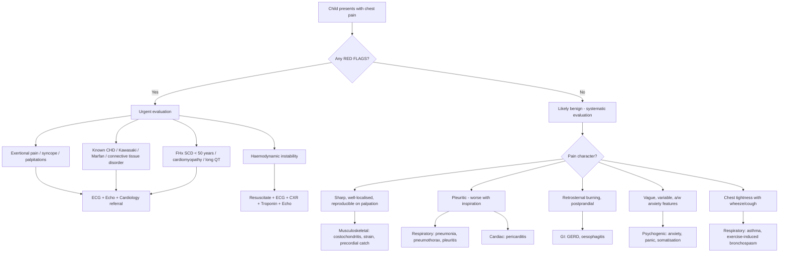

## Differential Diagnosis of Chest Pain in Paediatrics

### Guiding Principle

The differential diagnosis of chest pain in children is fundamentally different from adults. In an adult walking into the ED with chest pain, your reflex is "rule out ACS." In a child, ACS is vanishingly rare. Instead, you must think systematically through organ systems, prioritise by **frequency** (musculoskeletal > respiratory > GI > psychogenic > cardiac), but always **screen for the rare but lethal cardiac causes first** before reassuring the family [1][2].

The approach is: **common things commonly → but never miss the dangerous things**.

<Callout title="The Paediatric Chest Pain Rule" type="error">
Do NOT simply apply the adult differential diagnosis to children. The top 5 causes of acute chest pain in adults (ACS, PE, aortic dissection, pneumothorax, tamponade) are mostly irrelevant in paediatrics. Instead, costochondritis, asthma, and anxiety dominate. However, you must always screen for red flags before concluding "benign."
</Callout>

---

### Master Differential Diagnosis Table — Paediatric Chest Pain

Organised by organ system, with relative frequency in paediatric practice, key distinguishing features, and the pathophysiological rationale for each.

| System | Diagnosis | Relative Frequency | Key Differentiating Features | Pathophysiological Basis |
|---|---|---|---|---|
| **Musculoskeletal** | **Costochondritis** | Very common (15–30%) | Sharp, localised at costochondral junctions (2nd–5th), ***reproducible on palpation***, worsened by movement/breathing | Inflammation of costochondral junction → somatic nociceptor activation → well-localised pain |
| | Precordial catch syndrome | Very common in adolescents | Sudden sharp left-sided pain at rest, lasts seconds, worsened by inspiration, no exertional component | Thought to be localised pleural fold irritation or intercostal muscle spasm; completely benign |
| | Musculoskeletal strain / trauma | Common | History of injury/exertion, localised tenderness, reproducible on movement, may have bruising | Direct tissue injury → inflammatory mediators → nociceptor stimulation |
| | Tietze syndrome | Uncommon | Like costochondritis but with **visible swelling** at a single costochondral junction (usually 2nd or 3rd) | Local inflammation with oedema of costochondral cartilage |
| | Slipping rib syndrome | Uncommon | Lower chest/upper abdominal pain, "clicking" sensation, positive hooking manoeuvre | Hypermobility of ribs 8–10 (fibrous not bony attachment) → subluxation under rib above → intercostal nerve irritation |
| | ***Pectus excavatum / carinatum*** | Uncommon cause of pain | Visible chest wall deformity; pain from abnormal mechanics ± cardiac compression in severe pectus excavatum | Altered chest wall biomechanics; severe pectus excavatum may compress RV → reduced stroke volume on exertion |
| **Respiratory** | ***Asthma / exercise-induced bronchospasm*** | Common (10–20%) | Chest **tightness** (not sharp pain), wheeze, cough, worse with exercise/cold air/allergens, ***very common in Hong Kong*** | Bronchospasm → air trapping → hyperinflation → increased elastic recoil work → sensation of tightness. Child may describe this as "pain" |
| | Pneumonia | Common | Fever, productive cough, pleuritic pain, crackles on auscultation, may have referred shoulder pain | Infection → consolidation → parietal pleural inflammation → sharp somatic pleuritic pain |
| | ***Pneumothorax*** | Uncommon | ***Sudden onset unilateral pleuritic chest pain + SOB***; tall thin adolescent; decreased breath sounds + hyperresonance [3] | Air enters pleural space → loss of negative intrapleural pressure → lung collapse → parietal pleural irritation + impaired gas exchange |
| | Pleural effusion / pleuritis | Uncommon | Dull aching → sharp pleuritic; dullness to percussion, decreased breath sounds, fever if infective | Pleural inflammation irritates parietal pleura → sharp pain; effusion accumulation → compressive dyspnoea |
| | ***Foreign body aspiration*** | Important in < 3 years | Sudden onset cough/wheeze/stridor, unilateral decreased breath sounds, history of choking episode | Airway obstruction → distal air trapping or atelectasis; mechanical irritation of airway mucosa |
| **Cardiac** | ***Pericarditis / myopericarditis*** | Most common cardiac cause | Retrosternal pain ***worse lying flat, better leaning forward***; friction rub; may have fever; diffuse ST elevation on ECG | Parietal pericardial inflammation → irritation of phrenic nerve and intercostal nerve afferents; postural change alters heart–pericardium contact |
| | ***Myocarditis*** | Uncommon | Chest pain + signs of heart failure (tachycardia out of proportion, gallop, hepatomegaly, poor perfusion); preceding viral illness; ↑troponin | Viral myocyte invasion → necrosis → inflammatory infiltrate → impaired contractility → heart failure |
| | ***Arrhythmia (esp. SVT)*** | Uncommon | ***Palpitations*** described as "chest pain" (especially by younger children); sudden onset/offset; very fast heart rate | Re-entrant circuit → rapid rate → reduced diastolic filling → subendocardial ischaemia + conscious awareness of rapid beating perceived as "pain" |
| | ***Hypertrophic cardiomyopathy*** | Rare but dangerous | ***Exertional*** chest pain ± syncope; family history of SCD; harsh systolic murmur increasing with Valsalva; ***leading cause of SCD in young athletes*** [4] | Asymmetric septal hypertrophy → dynamic LVOT obstruction during exercise → decreased CO + subendocardial ischaemia (↑O₂ demand, compressed intramural vessels) |
| | ***Anomalous coronary artery*** | Rare but dangerous | ***Exertional*** chest pain or syncope; may be first presentation as SCD; often normal exam between episodes | Aberrant coronary (e.g., ALCA from right sinus) passes between aorta and PA → compressed during exercise when great vessels dilate → myocardial ischaemia |
| | ***ALCAPA*** | Rare, presents in infancy | Irritability/crying during feeds, diaphoresis, poor feeding, heart failure in infant 2–4 months; deep Q waves in I, aVL, V5–V6 | Left coronary arises from PA → after birth, pulmonary pressure drops → inadequate coronary perfusion → myocardial ischaemia; feeding = exertion equivalent in infants |
| | ***Aortic stenosis*** | Uncommon | ***Exertional chest pain, syncope, heart failure*** (classic triad of severe AS [4]); ejection systolic murmur radiating to carotids; ejection click | Fixed outflow obstruction → LV pressure overload → LV hypertrophy → ↑O₂ demand with limited supply → exertional ischaemia |
| | ***Kawasaki disease sequelae*** | Important in HK | History of Kawasaki disease in early childhood; exertional chest pain years later; coronary artery aneurysms on echo/CT | Coronary vasculitis → aneurysms → stenosis or thrombosis → myocardial ischaemia (one of the few causes of true MI in children) |
| | ***Aortic dissection*** | Very rare in children | Consider in Marfan/Turner/Loeys-Dietz/Ehlers-Danlos; ***sudden onset, tearing pain radiating to back, maximal at onset***; pulse deficit, wide mediastinum on CXR [5] | Connective tissue disorder → weakened aortic media → intimal tear → blood dissects into media → false lumen expansion |
| | ***Pulmonary hypertension*** | Rare | Exertional chest pain + syncope + progressive dyspnoea; loud P2, RV heave; signs of RV failure | ↑RV wall stress + ↑O₂ demand → subendocardial ischaemia; inadequate ↑CO during exercise → syncope [3] |
| | ***Pulmonary embolism*** | Very rare in children | ***Acute onset pleuritic chest pain + dyspnoea ± haemoptysis***; risk factors (immobilisation, OCP in adolescents, thrombophilia, malignancy, nephrotic syndrome, central line) [6] | Thrombus obstructs pulmonary vasculature → V/Q mismatch → hypoxaemia; pulmonary infarction → parietal pleural inflammation → pleuritic pain |
| | MIS-C (post-COVID) | Emerging | Fever ≥ 3 days + multisystem involvement (GI, mucocutaneous, cardiac) in child with recent SARS-CoV-2; coronary changes, myocarditis, shock | Post-infectious hyperinflammatory state → myocardial inflammation, coronary artery dilation/aneurysm |
| **GI** | ***GERD*** | Common (5–10%) | ***Retrosternal burning***, worse postprandially, worse lying down, relieved by antacids; may have cough, hoarseness [7] | Transient LES relaxation → acid reflux → oesophageal mucosal irritation; oesophageal afferents share T1–T5 spinal segments with cardiac afferents → pain mimics cardiac |
| | Oesophageal spasm | Rare in children | Episodic retrosternal chest pain ± dysphagia; ***may mimic angina*** [7] | Uncoordinated oesophageal smooth muscle contractions → visceral pain via vagal and sympathetic afferents |
| | Eosinophilic oesophagitis | Emerging | Dysphagia, food impaction, chest pain in child with atopic history | Eosinophilic infiltration → oesophageal inflammation and dysmotility → pain |
| | ***Foreign body ingestion*** | Important in < 5 years | Retrosternal pain, drooling, dysphagia; EMERGENCY if button battery | Mechanical impaction → mucosal pressure necrosis; button battery → alkaline burn → perforation risk |
| **Psychogenic** | ***Anxiety / panic disorder*** | Common in adolescents (5–15%) | Vague, variable pain; ***hyperventilation features (perioral/digital paraesthesia, light-headedness)***; panic attacks with palpitations, SOB, sense of doom [8][9] | Sympathetic activation → tachycardia, chest tightness; hyperventilation → respiratory alkalosis → ↓ionised Ca²⁺ → paraesthesiae; interoceptive hypersensitivity |
| | ***Somatic symptom disorder*** | Uncommon | Chronic/recurrent pain, excessive health-related thoughts/behaviours, doctor-shopping, multiple negative investigations [10] | Central sensitisation + amplification of normal physiological signals; psychosocial stressors lower pain threshold |
| | Depression | Uncommon but important | Chest pain as somatic complaint; associated low mood, anhedonia, sleep/appetite change, poor school performance | Somatisation of depressive symptoms; altered central pain processing |
| **Other** | ***Breast development (thelarche/gynaecomastia)*** | Common in early adolescence | Tender breast bud (girls) or subareolar tender disc (boys); no systemic features | Oestrogen-mediated breast tissue proliferation → capsular stretch → local tenderness interpreted as "chest pain" |
| | Herpes zoster | Rare in immunocompetent children | ***Unilateral dermatomal burning pain ± vesicular rash*** [2] | VZV reactivation in dorsal root ganglion → travels along intercostal nerve → dermatomal pain (may precede rash by days) |
| | Sickle cell acute chest syndrome | Rare in HK Chinese, consider in South Asian/African populations | Chest pain + fever + new CXR infiltrate + ↓SpO₂; history of SCD | Vaso-occlusion in pulmonary vasculature + fat embolism from marrow → pulmonary infarction → pain |
| | Mediastinal mass (lymphoma) | Rare | Persistent chest pain/pressure, cough, SVC syndrome (facial swelling, plethora), respiratory distress especially supine | Mass effect → compression of airways, vessels, nerves; Hodgkin lymphoma peaks in adolescence |

---

### Systematic Approach: How to Narrow the Differential

The mermaid diagram below illustrates a clinical reasoning algorithm for approaching the differential of chest pain in a paediatric patient. The key branching points are: **(1) Are there red flags? → (2) What is the pain character? → (3) What system does it point to?**

---

### Age-Based Differential Prioritisation

Different aetiologies dominate at different ages. This is a crucial concept in paediatrics—always think about the **developmental context**.

| Age Group | Top Differentials | Rationale |
|---|---|---|
| **Neonate / Infant ( < 1 year)** | ALCAPA, myocarditis, MIS-C, congenital heart disease with heart failure | Cannot verbalise; "chest pain" presents as irritability, poor feeding, diaphoresis; structural cardiac disease manifests early as pulmonary vascular resistance drops |
| **Toddler (1–3 years)** | Foreign body (aspiration or ingestion), myocarditis, Kawasaki disease, pneumonia | Exploring age → puts objects in mouth; Kawasaki disease peak incidence < 5 years |
| **Pre-school / Early school (4–8 years)** | Asthma, pneumonia, costochondritis, Kawasaki sequelae | Asthma often presents in this age group; costochondritis begins to appear; prior Kawasaki complications may become symptomatic |
| **Adolescent (9–18 years)** | Costochondritis, precordial catch, asthma, psychogenic/anxiety, GERD, HOCM, anomalous coronary, SVT, pectus deformity, gynaecomastia/thelarche | Musculoskeletal dominates; psychogenic very common in HK exam stress culture; cardiac screening important for athletes; substance use (cocaine, vaping) enters differential |

---

### How to Differentiate: Key Clinical Discriminators

#### 1. Reproducibility on Palpation
- If you press on the chest wall and reproduce the **exact** pain → **musculoskeletal** (almost 100% specific)
- **Why?** The pain generator is the chest wall. External pressure directly stimulates the inflamed/injured tissue. Visceral pain (cardiac, GI) cannot be reproduced by chest wall palpation because the pain source is deep.

#### 2. Relationship to Exercise
- Pain **during** exercise → think cardiac: HOCM, anomalous coronary, AS, pulmonary hypertension, arrhythmia
- Pain **after** exercise → more likely musculoskeletal or psychogenic [1][2]
- Chest **tightness** with exercise + wheeze/cough → exercise-induced bronchospasm

#### 3. Positional Component
- ***Worse lying flat, better leaning forward*** → **pericarditis** (heart falls away from inflamed posterior pericardium)
- Worse lying flat, postprandial → **GERD** (gravity no longer keeps gastric acid in stomach)
- No positional component → less likely pericarditis or GERD

#### 4. Duration
- Seconds → precordial catch (benign)
- Minutes ( < 10 min) → angina equivalent (cardiac), oesophageal spasm
- Hours → pericarditis, musculoskeletal, pneumonia
- Days to weeks → costochondritis, psychogenic, mediastinal mass

#### 5. Associated Features

| Associated Feature | Points Towards | Why |
|---|---|---|
| ***Syncope / near-syncope*** | Cardiac (HOCM, AS, arrhythmia, anomalous coronary) | Inadequate cardiac output → cerebral hypoperfusion |
| ***Palpitations*** | Arrhythmia (SVT, VT), anxiety/panic | Re-entrant tachycardia or sympathetic overdrive |
| Fever | Infectious (pneumonia, pericarditis, myocarditis) | Systemic inflammatory response |
| Cough / wheeze | Respiratory (asthma, pneumonia, foreign body) | Airway inflammation or obstruction |
| ***Diaphoresis*** | Cardiac (myocardial ischaemia in infants), anxiety | Sympathetic activation from ischaemia or panic |
| ***Hyperventilation, paraesthesiae*** | Psychogenic / panic [9] | Respiratory alkalosis → ↓ionised Ca²⁺ → neuromuscular excitability |
| Dysphagia / food impaction | Oesophageal (EoE, foreign body, stricture) | Oesophageal obstruction or inflammation |
| Vesicular rash | Herpes zoster | VZV reactivation in dermatomal distribution |
| Marfanoid habitus | Aortic dissection, mitral valve prolapse, pneumothorax | Connective tissue fragility |

---

### Differentiating Cardiac from Non-Cardiac Chest Pain in Children

This is the **crux of the clinical question** in paediatric chest pain. The table below summarises the key features:

| Feature | Likely CARDIAC | Likely NON-CARDIAC |
|---|---|---|
| Relationship to exertion | ***Pain specifically with exertion*** | Pain at rest, after exertion, or random |
| Associated syncope | Yes | No |
| Associated palpitations | Yes (especially sudden onset/offset) | Variable (anxiety can cause) |
| ***FHx of SCD < 50 years*** | High concern | Low concern |
| Known CHD / Kawasaki / connective tissue disorder | High concern | Low concern |
| Reproducible on palpation | No (deep visceral source) | Yes (superficial musculoskeletal source) |
| ***Abnormal cardiac exam*** (murmur, gallop, rub, heave) | High concern | Normal cardiac exam expected |
| ECG abnormalities | High concern | Normal ECG expected |
| Chronicity ( > 6 months, unchanged) | Less likely cardiac | Likely musculoskeletal, psychogenic, or idiopathic |

<Callout title="Clinical Pearl" type="idea">
A child with **chronic, recurrent chest pain over months, normal growth, normal exam, and no red flags** almost certainly does NOT have a cardiac cause. The longer the duration without progression, the more benign the aetiology. Cardiac causes tend to be progressive or episodic with exertion, not stable and chronic.
</Callout>

---

### Differential Diagnosis of Chest Pain by Pain Character (OPQRST Framework — Paediatric Adaptation)

This ties the pain quality directly to the differential, building on the adult OPQRST framework [1][2] but **adapted for children**:

| Quality of Pain | Differential | Why This Quality? |
|---|---|---|
| ***Sharp, stabbing, worse with inspiration (pleuritic)*** | Pneumothorax, pneumonia, PE, pericarditis [3] | Parietal pleural or pericardial inflammation → somatic nociceptors activated by respiratory movement |
| ***Dull, constricting, pressure, "heavy"*** | Angina (rare in children: HOCM, coronary anomaly, AS) [1] | Myocardial ischaemia → metabolite accumulation → stimulation of cardiac sympathetic afferents → referred, poorly localised visceral pain |
| ***Retrosternal burning*** | GERD, oesophagitis [7] | Acid damage to oesophageal squamous epithelium → visceral afferents (T1–T5) |
| Sharp, well-localised, fleeting (seconds) | Precordial catch | Brief pleural fold irritation or intercostal spasm |
| ***Tearing, severe, radiating to back*** | Aortic dissection (Marfan, Turner) [5] | Intimal tear → blood dissecting through aortic media → intense somatic pain from adventitial nociceptors |
| Vague, diffuse, variable, "can't quite describe" | Psychogenic, idiopathic | Central pain processing amplification, not from a peripheral nociceptive source |
| Tight, band-like, "can't breathe" | Asthma | Bronchospasm → hyperinflation → chest wall stretch → mechanoreceptor activation |

---

### Important "Mimics" and Traps

<Callout title="Don't Fall Into These Traps" type="error">

1. **Asthma presenting as chest pain alone**: A child may have exercise-induced bronchospasm without audible wheeze. They describe "chest pain" or "tightness" during exercise. Always consider a trial of bronchodilator or exercise challenge testing.

2. **SVT in a young child described as "chest pain"**: Young children lack the vocabulary for "palpitations." They may say "my chest hurts" or "my heart feels funny." Always check a resting ECG (look for delta waves of WPW, short PR).

3. **GERD mimicking cardiac pain**: Oesophageal and cardiac afferents share T1–T5 segments. Even in children, GERD can produce chest pain indistinguishable from cardiac pain on history alone [7].

4. **Anxiety coexisting with organic disease**: The presence of anxiety does NOT rule out an organic cause. A child may be anxious **because** they have real symptoms [9]. Always complete a thorough evaluation before attributing pain to anxiety.

5. **Kawasaki disease history**: Any child with a history of Kawasaki disease who presents with chest pain **must** be evaluated for coronary artery complications, regardless of how many years have passed.
</Callout>

---

### Summary of the "Must-Not-Miss" Diagnoses (Paediatric Chest Pain Emergencies)

| Diagnosis | Mechanism of Death if Missed | Key Clue |
|---|---|---|
| ***Tension pneumothorax*** | Mediastinal shift → obstructive shock → cardiac arrest | Tracheal deviation, absent breath sounds, haemodynamic collapse |
| ***Cardiac tamponade*** | Pericardial fluid → restricted diastolic filling → obstructive shock | ***Beck's triad*** (hypotension, muffled sounds, ↑JVP); pulsus paradoxus |
| ***Myocarditis with cardiogenic shock*** | Severe myocardial dysfunction → cardiogenic shock | Tachycardia out of proportion, gallop, hepatomegaly, poor perfusion |
| ***Arrhythmia (VT, SVT with haemodynamic compromise)*** | VF/pulseless VT → cardiac arrest | Very rapid rate, altered consciousness, poor perfusion |
| ***Aortic dissection (connective tissue disorder)*** | Rupture → haemorrhagic shock; coronary malperfusion → MI | Marfanoid, sudden tearing pain to back, pulse deficit, wide mediastinum |
| ***HOCM / anomalous coronary (exertional SCD)*** | VF triggered by ischaemia during exercise | Exertional syncope, FHx SCD, murmur changing with Valsalva |
| ***Massive PE*** | RV failure → obstructive shock | Sudden collapse, pleuritic pain, tachycardia, S1Q3T3 on ECG |
| ***Foreign body airway obstruction (young child)*** | Complete airway obstruction → asphyxia | Choking history, stridor, unilateral decreased breath sounds |

---

> **High Yield Exam Point**: When presented with a child with chest pain in an exam, the examiners want to see that you can (1) systematically consider the differential, (2) identify red flags that point to cardiac causes, (3) explain why each feature points where it does, and (4) NOT over-investigate benign presentations but also NOT under-investigate red flag presentations. The key discriminator is: **Is this exertional? Is there syncope? Is there a concerning family history? Is the cardiac exam abnormal?**

---

<ActiveRecallQuiz
  title="Active Recall - Differential Diagnosis of Paediatric Chest Pain"
  items={[
    {
      question: "A 15-year-old competitive swimmer collapses with chest pain during a race and is brought to the ED. He recovers consciousness. What are the top 3 cardiac differentials and what single investigation is most urgent?",
      markscheme: "Top 3: (1) Hypertrophic cardiomyopathy - dynamic LVOT obstruction during exercise, (2) Anomalous coronary artery - compression between aorta and PA during exercise, (3) Arrhythmia such as long QT or WPW with SVT/VF. Most urgent investigation: 12-lead ECG (look for LVH, pre-excitation delta wave, prolonged QTc, ST changes).",
    },
    {
      question: "Name 5 features that distinguish musculoskeletal chest pain from cardiac chest pain in a child.",
      markscheme: "(1) Reproducible on palpation (musculoskeletal) vs not reproducible (cardiac), (2) Worse with movement/position change (MSK) vs worse with exertion (cardiac), (3) No syncope (MSK) vs syncope possible (cardiac), (4) No palpitations (MSK) vs palpitations (cardiac), (5) Normal cardiac exam (MSK) vs abnormal murmur/gallop/rub (cardiac). Also acceptable: chronic unchanging course (MSK) vs progressive (cardiac).",
    },
    {
      question: "A 3-year-old presents with sudden onset cough, right-sided decreased breath sounds, and mild chest discomfort while playing with small toys. What is the most likely diagnosis and why might the CXR appear normal initially?",
      markscheme: "Foreign body aspiration. CXR may appear normal if the foreign body is radiolucent (e.g., food, plastic) and has not yet caused significant air trapping or atelectasis. Inspiratory/expiratory films or lateral decubitus films may reveal air trapping on the affected side. Bronchoscopy is both diagnostic and therapeutic.",
    },
    {
      question: "A 13-year-old girl in Hong Kong presents with recurrent chest pain for 6 months. She describes vague central chest discomfort that comes and goes, is not related to exertion, and is associated with perioral tingling and light-headedness. Cardiac exam is normal. What is the most likely diagnosis and what is the mechanism of perioral tingling?",
      markscheme: "Psychogenic chest pain / anxiety / panic disorder. Perioral tingling is caused by hyperventilation leading to respiratory alkalosis, which decreases ionised calcium levels, increasing neuromuscular excitability and causing paraesthesiae in the perioral and acral distribution.",
    },
    {
      question: "Why is Kawasaki disease history particularly important when evaluating a child with chest pain in Hong Kong?",
      markscheme: "Kawasaki disease has a higher incidence in East Asian populations (70-100/100,000 children under 5 in HK/Japan). It causes coronary artery vasculitis leading to coronary aneurysms in up to 25% if untreated. These aneurysms can cause coronary stenosis or thrombosis years later, leading to myocardial ischaemia - one of the few causes of true MI in children. Any child with a history of Kawasaki disease presenting with chest pain must be evaluated for coronary complications.",
    },
  ]}
/>

## References

[1] Senior notes: Ryan Ho Cardiology.pdf (p54–58)
[2] Senior notes: Ryan Ho Fundamentals.pdf (p199–203)
[3] Senior notes: Ryan Ho Respiratory.pdf (p133, p151–152)
[4] Lecture slides: GC 147. Heart failure and cyanosis in children acyanotic and cyanotic congenital heart disease - Part 1.pdf
[5] Senior notes: felixlai.md (Aortic Dissection section)
[6] Senior notes: Ryan Ho Haemtology.pdf (p131)
[7] Senior notes: Ryan Ho GI.pdf (p56–57, p68)
[8] Senior notes: Ryan Ho Psychiatry.pdf (p178–179)
[9] Senior notes: Ryan Ho Psychiatry.pdf (p178); Ryan Ho Respiratory.pdf (p20)
[10] Senior notes: Ryan Ho Psychiatry.pdf (p199, p203)
