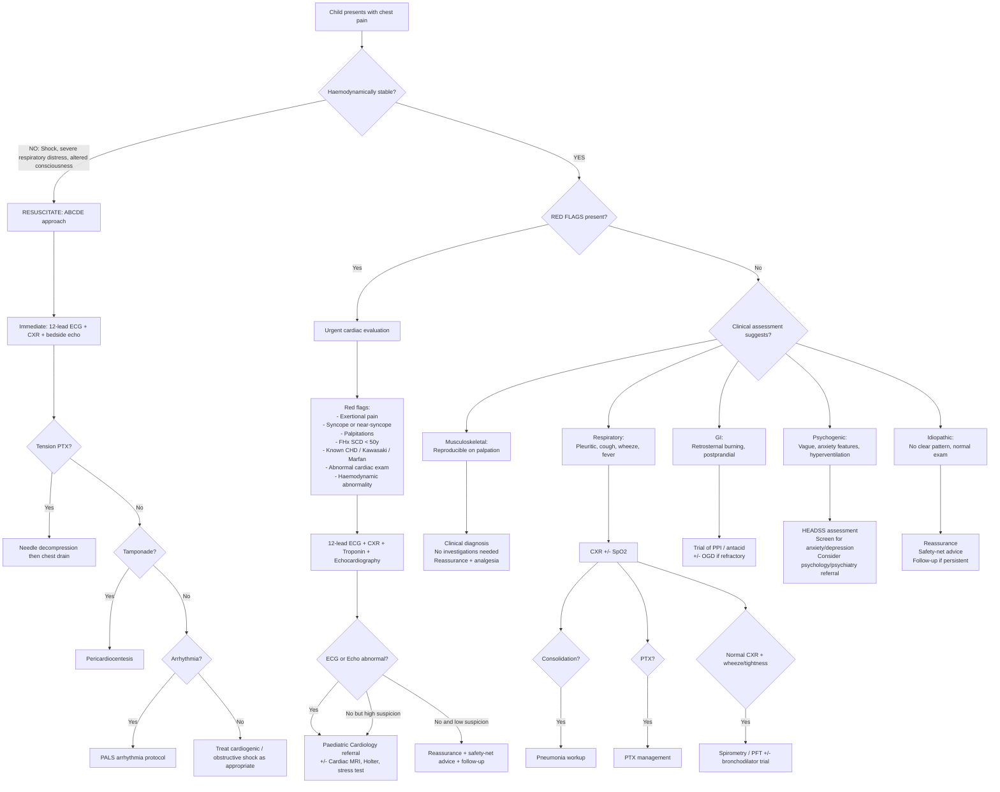

## Diagnostic Criteria, Diagnostic Algorithm, and Investigation Modalities for Paediatric Chest Pain

### Overarching Diagnostic Philosophy in Paediatric Chest Pain

Unlike many conditions in medicine, there is **no single validated "diagnostic criteria" set** for paediatric chest pain itself—because chest pain is a **symptom, not a diagnosis**. The task is to identify the *underlying cause*. The diagnostic approach is therefore a systematic process of:

1. **Clinical assessment** (history + physical examination) to stratify risk
2. **Targeted investigations** guided by clinical suspicion
3. **Arriving at a specific diagnosis** or, in the majority, confidently diagnosing a benign/idiopathic cause

The critical decision point is: **Does this child need any investigations at all, or can I diagnose clinically and reassure?** For the vast majority ( > 80%), history and examination alone are sufficient. Investigations are reserved for red flag features or diagnostic uncertainty.

<Callout title="Paediatric Principle: Investigate Less, Think More">
In adult chest pain, a "rule-out ACS" protocol (serial ECG, serial troponin, CXR) is near-universal. In paediatric chest pain, **most children need NO investigations**. Over-investigation creates unnecessary anxiety for the family, radiation exposure, and costs. The history and physical examination are the most powerful diagnostic tools. Investigate only when there is a specific clinical indication.
</Callout>

---

### Diagnostic Criteria for Specific Paediatric Chest Pain Aetiologies

Since chest pain itself has no criteria, we must know the diagnostic criteria for the specific conditions it may represent. Below are the key ones relevant to paediatrics:

#### A. Pericarditis (Most Common Cardiac Cause of Chest Pain in Children)

Diagnosis requires **at least 2 of 4 criteria** (ESC 2015 guidelines, applicable to paediatrics):

| Criterion | Detail | Pathophysiological Rationale |
|---|---|---|
| 1. ***Characteristic chest pain*** | Retrosternal, sharp, ***worse lying flat, better leaning forward*** | Inflamed parietal pericardium rubbed by the beating heart → positional modulation |
| 2. ***Pericardial friction rub*** | Scratchy, best heard at left sternal border with diaphragm, patient leaning forward at end-expiration | Roughened inflamed pericardial surfaces rub together → audible sound [3] |
| 3. ***ECG changes*** | Diffuse ST elevation (concave upward) + PR depression; may evolve through 4 stages | Superficial myocardial inflammation extending from epicardium → current of injury → ST vector directed towards most leads |
| 4. ***New or worsening pericardial effusion*** | On echocardiography | Inflammatory exudate accumulates in pericardial space |

**Supporting features** (not required for diagnosis): Elevated inflammatory markers (CRP, ESR), evidence of pericardial inflammation on CT or cardiac MRI (late gadolinium enhancement of pericardium).

> **Why is diffuse ST elevation "concave upward" and not "convex" as in STEMI?** In pericarditis, the inflammation is superficial (epicardial surface) and widespread—so the injury current is low amplitude and diffuse. In STEMI, the injury is transmural and regional—producing regional convex ("tombstone") ST elevation with reciprocal depression. Pericarditis also classically has PR depression (because the atrial epicardium is inflamed, creating an atrial injury current).

#### B. Myocarditis

No single universally accepted diagnostic criteria, but the diagnosis is based on a **combination of clinical, biochemical, imaging, and sometimes histopathological features**:

- **Clinical**: Chest pain, heart failure symptoms, arrhythmia, often preceded by viral illness
- **Biochemical**: ***Elevated troponin*** (cTnI or cTnT)—indicates myocyte necrosis; ↑BNP/NT-proBNP—indicates myocardial wall stress
- **ECG**: Non-specific ST-T changes, low voltage, arrhythmias; may mimic STEMI pattern
- ***Echocardiography***: Global or regional wall motion abnormalities, ↓LV systolic function (↓EF), pericardial effusion
- ***Cardiac MRI (Lake Louise criteria)***: The gold standard non-invasive test
  - Myocardial oedema (T2-weighted)
  - Hyperaemia/capillary leak (early gadolinium enhancement)
  - ***Necrosis/fibrosis (late gadolinium enhancement, typically epicardial/mid-wall, NON-coronary distribution)***
  - Updated 2018 Lake Louise criteria: ≥1 T2-based criterion (oedema) + ≥1 T1-based criterion (necrosis/fibrosis) = diagnostic
- **Endomyocardial biopsy (EMB)**: Definitive (Dallas criteria: inflammatory infiltrate + myocyte necrosis), but rarely performed in children due to invasiveness; reserved for fulminant or refractory cases

#### C. Myocardial Infarction (Rare in Children, but Criteria Apply)

The ***4th Universal Definition of Myocardial Infarction*** (2018, adapted from adult criteria but applicable to children with coronary artery disease, e.g., Kawasaki sequelae, ALCAPA, anomalous coronary) [1]:

**Type 1 MI**: Detection of rise and/or fall of cardiac biomarker (preferably cTn) with ≥1 value above the 99th percentile upper reference limit (URL), **plus** ≥1 of:
1. Symptoms of ischaemia
2. New significant ST-T changes or new LBBB
3. Development of pathological Q waves
4. Imaging evidence of new loss of viable myocardium or new regional wall motion abnormality
5. Identification of intracoronary thrombus [1]

<Callout title="Paediatric Caveat: Troponin Reference Ranges" type="error">
Neonates and young infants have **physiologically higher troponin levels** than older children and adults (due to relative myocardial stress during birth and adaptation). Always use **age-appropriate reference ranges** when interpreting troponin in neonates and infants. A "positive" troponin in a neonate may be normal.
</Callout>

#### D. Pneumothorax

Diagnosis is **clinical + radiological**:
- ***Clinical***: Sudden onset unilateral pleuritic chest pain + SOB; decreased breath sounds + hyperresonance on the affected side [3]
- **CXR** (erect inspiratory PA): Visible visceral pleural line with absent lung markings beyond it
- **Tension pneumothorax**: A **clinical diagnosis** (do NOT wait for CXR)—tracheal deviation away, haemodynamic compromise, distended neck veins → immediate needle decompression [3]

#### E. Pulmonary Embolism (Rare in Children)

***Modified Wells score*** is validated in adults [6][11]; **no paediatric-specific scoring system** is widely validated. Clinical suspicion is based on risk factors (immobilisation, central line, thrombophilia, nephrotic syndrome, OCP use in adolescents, malignancy).

| Wells Score Component | Points |
|---|---|
| Clinical symptoms of DVT | 3.0 |
| PE more likely than alternative diagnosis | 3.0 |
| Immobilisation ≥ 3 days or surgery in past 4 weeks | 1.5 |
| Previous DVT/PE | 1.5 |
| Tachycardia (HR > 100) | 1.5 |
| Haemoptysis | 1.0 |
| Malignancy | 1.0 |

**Interpretation** (two-level): PE likely > 4; PE unlikely ≤ 4 [6][11]

In children, clinical judgement often supersedes formal scoring. D-dimer is useful to **rule out** PE when clinical suspicion is low (high sensitivity, poor specificity). ***CTPA is the first-line definitive diagnostic test*** [12][3].

#### F. Panic Disorder (DSM-5 Criteria) — Important in Adolescents

***Recurrent unexpected panic attacks*** (abrupt surge of intense fear peaking within minutes) with ***≥4 of 13 symptoms*** (including **chest pain**, palpitations, SOB, sweating, trembling, dizziness, paraesthesiae, nausea, derealization, fear of dying, fear of losing control) [8]; followed by ≥1 month of persistent worry about future attacks or maladaptive behavioural change; not attributable to substance or another medical condition [8].

---

### Comprehensive Diagnostic Algorithm for Paediatric Chest Pain

The following algorithm guides the clinician through the systematic evaluation of a child presenting with chest pain. The key decision nodes are: **(1) Is the child haemodynamically stable? → (2) Are there red flags? → (3) What does the clinical assessment suggest? → (4) Targeted investigations.**

---

### Investigation Modalities: What, When, Why, and Key Findings

#### Tier 1: Bedside / Immediate Investigations (For Red Flag or Acute Presentations)

##### 1. 12-Lead Electrocardiogram (ECG)

**When to order**: Any child with red flag features (exertional pain, syncope, palpitations, FHx SCD, abnormal cardiac exam), any acutely unwell child with chest pain, and any child where cardiac cause is being considered.

**Why it matters**: The ECG is rapid, non-invasive, painless, and provides immediate information about myocardial ischaemia, pericarditis, arrhythmia, and structural abnormalities. ***In the adult approach, a stat ECG is the first investigation in acute chest pain*** [1][2]—in paediatrics, it is only done when there is clinical suspicion of cardiac pathology, not routinely for every child with chest pain.

**Paediatric ECG interpretation nuances**: The paediatric ECG differs from the adult ECG because of age-related changes in cardiac anatomy and physiology:
- **Neonates**: Right axis deviation (RAD) is normal (RV dominance in utero). T waves may be upright in V1 in the first 48h then invert and remain inverted until ~8–12 years (persistent upright T in V1 after 3 days of age may indicate RV hypertrophy).
- **Heart rate**: Faster in younger children (use age-appropriate normals).
- **PR interval**: Shorter in younger children (~0.10s in infants vs 0.12–0.20s in adults).
- **QTc**: Corrected QT (Bazett's formula: QTc = QT / √RR). Normal QTc < 0.44s in infants, < 0.46s (female) / < 0.45s (male) in older children. ***Prolonged QTc > 0.47s is concerning for Long QT Syndrome.***

**Key ECG findings and their interpretation in paediatric chest pain:**

| ECG Finding | Interpretation | Condition |
|---|---|---|
| ***Diffuse concave ST elevation + PR depression*** | Pericardial inflammation | ***Pericarditis*** |
| ***ST elevation in territorial distribution*** (e.g., anterior V1-V4, lateral I/aVL/V5-V6) + reciprocal depression | Regional transmural ischaemia/infarction | MI (Kawasaki sequelae, anomalous coronary) — very rare in children |
| ***Deep Q waves in I, aVL, V5-V6*** | Anterolateral myocardial infarction/ischaemia | ***ALCAPA*** (in infancy) |
| ***LV hypertrophy*** (↑R in V5-V6, ↑S in V1, ↑voltage criteria for age) | LV pressure or volume overload | ***HOCM, aortic stenosis*** |
| ***Pre-excitation (delta wave + short PR)*** | Accessory pathway | ***Wolff-Parkinson-White*** (risk of SVT → perceived as "chest pain") |
| ***Prolonged QTc*** ( > 0.47s) | Delayed repolarisation → risk of torsades de pointes | ***Long QT syndrome*** |
| ***Low voltage + electrical alternans*** | Pericardial effusion with swinging heart | ***Cardiac tamponade*** |
| ***S1Q3T3 + RBBB + right axis deviation*** | RV strain | ***Massive PE*** (rare in children) [3][11] |
| ***SVT*** (narrow complex, regular, rate > 220 in infant / > 180 in child) | Re-entrant tachycardia | SVT (child may perceive as "chest pain") |
| Sinus tachycardia with non-specific ST-T changes | Non-specific; may indicate myocarditis, anxiety, pain, fever | Needs clinical correlation |
| Normal ECG | Reassuring; makes cardiac cause less likely | Most children with chest pain |

> **Why do we look for "diffuse" vs "territorial" ST elevation?** Pericarditis involves the entire pericardial surface → diffuse changes in almost all leads (except aVR and V1 which show reciprocal depression). MI involves a specific coronary territory → changes localised to leads overlying that territory with reciprocal depression in opposing leads. This distinction is crucial even in paediatrics when considering Kawasaki coronary disease.

##### 2. Chest X-Ray (CXR)

**When to order**: Respiratory symptoms (cough, fever, dyspnoea, pleuritic pain), concern for pneumothorax, possible mediastinal mass, concern for heart failure (cardiomegaly, pulmonary oedema), suspected foreign body aspiration.

**NOT needed**: Typical costochondritis, precordial catch, obvious musculoskeletal cause with normal exam.

**Key CXR findings in paediatric chest pain:**

| CXR Finding | Interpretation | Condition |
|---|---|---|
| **Lobar consolidation ± air bronchograms** | Airspace filling with inflammatory exudate | Pneumonia |
| **Visceral pleural line with absent lung markings** | Air in pleural space | ***Pneumothorax*** |
| **Mediastinal shift** (away from affected side) | Large PTX or effusion pushing mediastinum | Tension PTX, massive effusion |
| **Meniscus sign / blunted costophrenic angle** | Pleural fluid accumulation | Pleural effusion |
| ***Cardiomegaly*** (cardiothoracic ratio > 0.60 in infants, > 0.55 in children > 1 year) | Dilated chambers or pericardial effusion | Myocarditis, pericardial effusion, DCM, ALCAPA |
| **"Boot-shaped" heart** (coeur en sabot) | RV hypertrophy with upturned apex | Tetralogy of Fallot (unlikely to present primarily with chest pain) |
| ***Widened mediastinum*** | Concern for aortic pathology or mass | Aortic dissection (Marfan), lymphoma [5][11] |
| **Anterior mediastinal mass** | Solid tissue in anterior mediastinum | ***Lymphoma*** (Hodgkin peaks in adolescence) |
| **Unilateral hyperinflation / atelectasis** | Air trapping or collapse distal to obstruction | ***Foreign body aspiration*** (inspiratory/expiratory films or lateral decubitus may be needed) |
| **Upper lobe venous distension / "bat-wing" opacity** | Pulmonary venous congestion / oedema | Heart failure (myocarditis, DCM) |
| ***"Sail sign"*** (normal thymic shadow) | Normal thymus in young infant | Do NOT mistake for mediastinal mass |

**Paediatric CXR nuance**: The thymus can be prominent in infants and young children, creating a wide mediastinal silhouette that may mimic a mediastinal mass. The "thymic wave sign" (undulation of the thymic border) is characteristic of a normal thymus. If uncertain, lateral CXR or ultrasound can help differentiate.

##### 3. Pulse Oximetry (SpO₂)

- Should be measured in **every** child presenting with acute chest pain
- ↓SpO₂ suggests respiratory or cardiac pathology (pneumonia, pneumothorax, PE, heart failure, cyanotic CHD)
- Normal SpO₂ ( ≥ 95%) is reassuring but does not completely exclude pathology

##### 4. Vital Signs (Age-Appropriate!)

- Heart rate, respiratory rate, blood pressure (including **4-limb BP** if coarctation suspected), temperature
- Always interpret against age-appropriate reference ranges

---

#### Tier 2: Laboratory Investigations (When Cardiac, Inflammatory, or Systemic Cause Suspected)

##### 5. Cardiac Biomarkers

**a. Troponin (cTnI or cTnT)**

**When to order**: Suspected myocarditis, pericarditis with myocardial involvement (myopericarditis), suspected MI (Kawasaki sequelae, ALCAPA, anomalous coronary), MIS-C, after cardiotoxic drug exposure.

- ***Troponin is the gold standard biomarker for myocardial injury/necrosis*** [1][5]
- "Troponin" = regulatory protein complex on the actin filament of cardiac muscle. When myocytes are damaged, troponin is released into the bloodstream.
- **Rise**: Begins 3–6 hours after injury, peaks at 12–24 hours, remains elevated for 7–14 days (cTnI) or up to 21 days (cTnT)
- **Interpretation**: Any value above the 99th percentile URL for the assay used = abnormal → indicates myocardial necrosis

<Callout title="High-Sensitivity Troponin in Children" type="error">
High-sensitivity troponin (hs-cTn) assays used in adult chest pain protocols detect very low levels of troponin. In children, **age-specific reference ranges are essential**—neonates and young infants have physiologically higher hs-cTn values. Use of adult cutoffs will cause false-positive results in neonates. Also, hs-cTn can be elevated in non-cardiac conditions: sepsis, renal failure, pulmonary embolism, and after intense exercise.
</Callout>

- If first troponin is normal but clinical suspicion remains, ***repeat troponin 6–12 hours later*** (to catch the rising limb) [1][2]

**b. BNP / NT-proBNP**

- "Brain Natriuretic Peptide" (actually from the ventricles, misnamed) → released when ventricular myocardium is stretched (volume or pressure overload)
- **When to order**: Suspected heart failure (myocarditis, DCM), assessment of severity in myocarditis
- **Elevated in**: Heart failure, myocarditis, significant pericardial effusion, pulmonary hypertension, post-cardiac surgery
- **Normal values are age-dependent**: Higher in neonates (up to ~1000 pg/mL for NT-proBNP in the first few days of life), declining over infancy

**c. CK-MB**

- Less specific than troponin (also found in skeletal muscle) → largely superseded by troponin in modern practice [5]
- May still appear in some hospital protocols

##### 6. Inflammatory Markers

- **CRP, ESR**: Elevated in pericarditis, myocarditis, pneumonia, MIS-C, rheumatic fever
- **Procalcitonin**: More specific for bacterial infection (helps differentiate bacterial from viral pneumonia)
- **Ferritin, LDH, fibrinogen, D-dimer, IL-6**: Part of the MIS-C / hyperinflammatory workup

##### 7. Blood Gas (VBG or ABG)

- **When**: Significant respiratory distress, ↓SpO₂, haemodynamic instability
- **Key findings**:
  - Type 1 respiratory failure (↓PaO₂, normal/↓PaCO₂ with ↑A-a gradient): PE, pneumonia, pneumothorax [3]
  - Metabolic acidosis with ↑lactate: Shock from any cause (cardiogenic, obstructive)
  - Respiratory alkalosis (↓PaCO₂, ↑pH): Hyperventilation in anxiety/panic

##### 8. Complete Blood Count (CBC)

- **When**: Suspected infection, MIS-C, sickle cell, anaemia as exacerbating factor
- **Key findings**: Leucocytosis/left shift (infection), lymphopenia (viral), anaemia (chronic disease, sickle cell), thrombocytosis (Kawasaki, inflammation), thrombocytopenia (MIS-C, DIC)

##### 9. D-dimer

- **When**: Suspected PE (rare in children; use when clinical suspicion present)
- **Interpretation**: ***Highly sensitive but not specific*** [3][11] → Normal D-dimer in a low-probability patient effectively rules out PE. Elevated D-dimer requires further imaging (CTPA).
- Elevated non-specifically in: inflammation, infection, malignancy, post-surgery, DIC, pregnancy

##### 10. Other Blood Tests

- **Lipid profile, glucose**: If familial hyperlipidaemia or DM suspected (rare paediatric MI)
- **RFT**: Baseline before contrast imaging; renal dysfunction affects prognosis
- **LFT**: Hepatic congestion from right heart failure
- **Coagulation profile (PT/aPTT)**: Baseline before anticoagulation if PE or thrombosis suspected
- **Autoimmune screen (ANA, anti-dsDNA, complement)**: If SLE pericarditis/pleuritis suspected
- **Toxicology screen**: In adolescents with suspected drug-related chest pain (cocaine, amphetamines)

---

#### Tier 3: Cardiac Imaging (When Cardiac Cause Suspected)

##### 11. Transthoracic Echocardiography (TTE)

***The single most important cardiac investigation in paediatrics.*** Non-invasive, no radiation, readily available, and can be performed at the bedside.

**When to order**: Any child with suspected cardiac cause of chest pain (red flag features), abnormal ECG, cardiomegaly on CXR, known CHD, suspected myocarditis/pericarditis, Kawasaki disease evaluation.

**Key echocardiographic findings:**

| Finding | Interpretation | Condition |
|---|---|---|
| ***Pericardial effusion*** | Fluid in pericardial space | Pericarditis, tamponade |
| ***↓LV ejection fraction*** (normal > 55%) | Impaired systolic function | Myocarditis, DCM, ALCAPA |
| ***Regional wall motion abnormality*** | Localised myocardial dysfunction | Coronary ischaemia (Kawasaki sequelae, anomalous coronary) |
| ***Coronary artery dilation/aneurysm*** | Z-score > 2.5 for body surface area | ***Kawasaki disease***, MIS-C |
| ***Asymmetric septal hypertrophy*** (septal:posterior wall ratio > 1.3) | Hypertrophic cardiomyopathy | ***HOCM*** |
| ***Systolic anterior motion of mitral valve*** (SAM) | Dynamic LVOT obstruction | HOCM |
| ***Aortic valve pathology*** (bicuspid, stenosis) + ***post-stenotic dilation*** | Fixed outflow obstruction | Congenital aortic stenosis |
| ***↑Estimated RV systolic pressure*** | Pulmonary hypertension | Eisenmenger, idiopathic PAH, chronic PE |
| ***Dilated cardiac chambers*** | Volume overload or cardiomyopathy | DCM, large L→R shunts |
| ***Aortic root dilation*** | Connective tissue disorder, risk of dissection | Marfan syndrome, Loeys-Dietz |
| ***Anomalous coronary origin*** | Coronary arising from wrong sinus or PA | Anomalous coronary artery, ALCAPA |

**Coronary artery assessment in Kawasaki disease**: Echocardiography is the primary modality. Coronary artery dimensions are assessed using **Z-scores** (number of standard deviations from the mean for body surface area):
- Z-score < 2: Normal
- Z-score 2–2.5: Dilation
- Z-score 2.5–5: Small aneurysm
- Z-score 5–10: Medium aneurysm
- Z-score ≥ 10 or ≥ 8mm: Giant aneurysm

##### 12. Cardiac MRI (CMR)

**When to order**: Suspected myocarditis (gold standard non-invasive test), characterisation of cardiomyopathy, anomalous coronary artery mapping, assessment of viability in ischaemic injury, post-Kawasaki coronary assessment when echo is limited.

**Key CMR findings** (Lake Louise criteria for myocarditis, updated 2018):
- ***T2-weighted sequences***: Myocardial oedema (bright signal) → indicates acute inflammation
- ***T1 mapping / ECV*** (extracellular volume): Elevated → indicates oedema or fibrosis
- ***Late gadolinium enhancement (LGE)***: Indicates necrosis/fibrosis
  - ***Epicardial or mid-wall, non-coronary distribution*** → Myocarditis
  - Subendocardial or transmural, coronary distribution → Ischaemic injury (MI)

**Paediatric caveat**: Young children (typically < 6–8 years) may require general anaesthesia or deep sedation for CMR due to the need for prolonged breath-holding and immobility. This must be weighed against the diagnostic value.

##### 13. CT Angiography (CTA)

**When to order**: ***Suspected PE*** (CTPA — CT pulmonary angiography [3][12]), ***suspected aortic dissection*** (in connective tissue disorder) [5], coronary artery evaluation when echo is inadequate, mediastinal mass characterisation.

- ***CTPA***: First-line definitive test for PE. Contrast timed to highlight pulmonary arteries; PE visible as filling defects [3][12]
- ***CT coronary angiography***: Can define anomalous coronary anatomy when echo is equivocal
- ***CT aorta***: Identifies true and false lumens in aortic dissection; ***compressed true lumen is the key finding*** [5]

**Paediatric considerations**: Radiation exposure—always apply ALARA (As Low As Reasonably Achievable). Use lowest possible dose protocols. Requires IV contrast → check renal function and allergy history. Young children may need sedation.

---

#### Tier 4: Specialised Cardiac Investigations (Referred, Not First-Line)

##### 14. Holter Monitor (24–72h Ambulatory ECG)

- **When**: Episodic palpitations or chest pain suggesting arrhythmia but standard ECG is normal
- **What it detects**: Paroxysmal SVT, non-sustained VT, frequent PVCs, conduction abnormalities, ST changes correlating with symptoms
- Child/adolescent keeps a symptom diary to correlate events with rhythm

##### 15. Exercise Stress Testing (Exercise Tolerance Test / ETT)

- **When**: Exertional chest pain in an older child/adolescent with normal resting ECG and echo; to provoke ischaemia, arrhythmia, or exercise-induced bronchospasm
- **Protocol**: Treadmill or cycle ergometer with continuous ECG and BP monitoring
- **Positive test for ischaemia**: ***≥1mm horizontal or downsloping ST depression 80ms after J-point*** [1]
- **Also evaluates**: Exercise capacity, BP response, arrhythmia provocation
- **Contraindicated if**: Known severe AS, HOCM with high gradient, acute myocarditis, unstable arrhythmia
- **Paediatric note**: Requires cooperation; generally feasible from ~7–8 years of age

##### 16. Event Recorder / Implantable Loop Recorder

- For infrequent but concerning symptoms (e.g., monthly exertional chest pain with near-syncope) when Holter monitoring has not captured an event
- Event recorder: Patient-activated device worn for weeks
- Implantable loop recorder: Subcutaneous device providing continuous monitoring for up to 3 years

##### 17. Invasive Coronary Angiography / Cardiac Catheterisation

- **When**: Definitive assessment of coronary anatomy when non-invasive imaging is insufficient; haemodynamic assessment (e.g., pulmonary hypertension); interventional procedures
- Rarely needed in paediatric chest pain workup
- Indicated in: Post-Kawasaki with suspected coronary stenosis, planning intervention for anomalous coronary, assessment of transplant vasculopathy

---

#### Tier 5: Non-Cardiac Specific Investigations

##### 18. Pulmonary Function Tests (Spirometry / PFT)

- **When**: Suspected asthma / exercise-induced bronchospasm
- **Key findings**:
  - ↓FEV₁/FVC ratio ( ≤ 90% in children) → obstructive pattern
  - ***≥12% improvement in FEV₁ post-bronchodilator*** → confirms reversible airflow obstruction (asthma) [3]
  - Exercise challenge: ≥10% drop in FEV₁ post-exercise → exercise-induced bronchospasm
- **Fractional exhaled NO (FeNO)**: > 35 ppb in children → eosinophilic airway inflammation; supports asthma diagnosis and predicts ICS response

##### 19. Upper GI Endoscopy (OGD) / pH Monitoring

- **When**: Suspected GERD not responding to empirical PPI trial, suspected eosinophilic oesophagitis (need biopsies), dysphagia, foreign body retrieval
- **pH monitoring/impedance study**: Quantifies acid and non-acid reflux episodes; useful when GERD diagnosis is uncertain

##### 20. Psychometric Assessment

- **When**: Suspected psychogenic chest pain, anxiety, somatisation
- HEADSS assessment in adolescents
- Validated screening tools: GAD-7, PHQ-A (adolescent depression screen), SCARED (Screen for Child Anxiety Related Disorders)
- Formal psychology/psychiatry referral for cognitive behavioural therapy if indicated

---

### Summary: When to Investigate vs When to Reassure

| Scenario | Investigate? | What to do? |
|---|---|---|
| Typical costochondritis (reproducible on palpation, no red flags, normal exam) | **NO** | Clinical diagnosis. Reassure. NSAIDs PRN. |
| Precordial catch (brief, sharp, at rest, seconds, normal exam) | **NO** | Clinical diagnosis. Reassure. |
| Exertional chest pain with syncope in adolescent athlete | **YES — URGENTLY** | ***ECG + Echo immediately. Restrict from sports until cleared.*** Cardiology referral. |
| Chest pain + fever + respiratory signs | **YES** | CXR + SpO₂ + bloods (CBC, CRP) |
| Retrosternal burning, postprandial, no red flags | **Maybe** | Trial of PPI. OGD only if refractory. |
| Vague pain + hyperventilation + perioral tingling in stressed adolescent | **Consider ECG** (to definitively reassure) | If ECG normal → reassurance + psychology referral |
| Known Kawasaki history + exertional chest pain | **YES — URGENTLY** | ***ECG + Troponin + Echo + Cardiology referral*** |
| Marfanoid habitus + sudden tearing pain to back | **YES — EMERGENTLY** | ***CXR + CT aorta + Echo + Vascular surgery*** [5] |

<Callout title="High Yield Summary">

**1. No single diagnostic criteria exist for "paediatric chest pain" — the diagnosis is of the underlying cause, not the symptom.**

**2. Most children with chest pain need NO investigations. History and exam are diagnostic in > 80%.**

**3. When cardiac suspicion exists, the minimum workup is: 12-lead ECG + Echocardiography ± Troponin.**

**4. Key ECG findings to know: Diffuse ST elevation + PR depression = pericarditis; Territorial ST elevation = MI (Kawasaki/coronary anomaly); Deep Q waves lateral leads in infant = ALCAPA; Pre-excitation = WPW; Prolonged QTc = Long QT syndrome; S1Q3T3 = PE; LVH = HOCM/AS.**

**5. Echocardiography is the most important cardiac imaging modality in paediatrics — assesses structure, function, pericardial effusion, coronary arteries, and valvular disease.**

**6. Cardiac MRI with Lake Louise criteria is the gold standard for non-invasive diagnosis of myocarditis (epicardial/mid-wall late gadolinium enhancement in non-coronary distribution).**

**7. Troponin interpretation requires age-appropriate reference ranges — neonates have physiologically higher levels.**

**8. CXR is NOT needed for obvious musculoskeletal chest pain but IS needed for respiratory symptoms, suspected pneumothorax, possible mediastinal mass, or suspected heart failure.**

**9. CTPA is the first-line definitive test for PE; D-dimer is used to rule out PE in low-probability cases.**

**10. Spirometry with bronchodilator reversibility testing or exercise challenge is diagnostic for asthma/exercise-induced bronchospasm — an important and common mimic of cardiac chest pain in children.**
</Callout>

---

<ActiveRecallQuiz
  title="Active Recall - Diagnosis of Paediatric Chest Pain"
  items={[
    {
      question: "A 10-year-old presents with chest pain, fever, and a scratchy sound heard at the left sternal border. ECG shows diffuse concave ST elevation and PR depression. What are the 4 diagnostic criteria for pericarditis? How many must be present?",
      markscheme: "At least 2 of 4: (1) Characteristic chest pain (retrosternal, worse lying flat, better leaning forward), (2) Pericardial friction rub, (3) ECG changes (diffuse ST elevation + PR depression), (4) New or worsening pericardial effusion on echocardiography. This child has 3 of 4 (pain, rub, ECG changes).",
    },
    {
      question: "A 14-year-old athlete collapses during a football match with chest pain. Resting ECG shows LV hypertrophy with deep T wave inversions. What is the most likely diagnosis, and what echocardiographic findings would you expect?",
      markscheme: "Hypertrophic cardiomyopathy (HCM/HOCM). Echo findings: asymmetric septal hypertrophy (septal:posterior wall ratio > 1.3), systolic anterior motion of the mitral valve (SAM), dynamic LVOT obstruction with increased gradient on Valsalva. May also see small LV cavity. In HK, apical variant is more common (25-30% vs 1-2% elsewhere).",
    },
    {
      question: "Explain the difference between the pattern of late gadolinium enhancement on cardiac MRI in myocarditis versus myocardial infarction.",
      markscheme: "Myocarditis: epicardial or mid-wall late gadolinium enhancement in a NON-coronary distribution (because inflammation starts from the epicardial surface and is not limited to a single coronary territory). MI: subendocardial or transmural late gadolinium enhancement in a CORONARY distribution (because ischaemia progresses from subendocardium outward within the territory of the occluded artery).",
    },
    {
      question: "A 3-month-old infant presents with poor feeding, diaphoresis, and irritability. ECG shows deep Q waves in leads I, aVL, V5-V6. CXR shows cardiomegaly. What is the most likely diagnosis, and what is the key echocardiographic finding to look for?",
      markscheme: "ALCAPA (Anomalous Left Coronary Artery from Pulmonary Artery). Key echo findings: (1) Origin of left coronary from the pulmonary artery, (2) Retrograde flow in the left coronary artery toward the PA (coronary steal), (3) Decreased LV systolic function with regional wall motion abnormality in the anterolateral wall, (4) Mitral regurgitation from papillary muscle ischaemia/dysfunction.",
    },
    {
      question: "List 3 situations where a child with chest pain does NOT need any investigations and explain why for each.",
      markscheme: "(1) Costochondritis with reproducible tenderness, no red flags, normal exam — pain source is definitively identified as chest wall by palpation; cardiac/visceral pain cannot be reproduced externally. (2) Precordial catch syndrome — brief, sharp, at rest, resolves in seconds, classic history is diagnostic; no structural abnormality to detect. (3) Breast tenderness in early puberty (thelarche/gynaecomastia) — physiological process; tender breast bud on exam explains the symptom directly.",
    },
    {
      question: "When interpreting troponin in a neonate with suspected myocarditis, what important caveat must you remember?",
      markscheme: "Neonates have physiologically higher troponin levels than older children and adults (due to relative myocardial stress during birth and postnatal adaptation). Must use age-appropriate reference ranges. Using adult cutoffs will produce false-positive results. A 'positive' troponin in a neonate may be physiologically normal and does not necessarily indicate myocardial injury.",
    },
  ]}
/>

## References

[1] Senior notes: Ryan Ho Cardiology.pdf (p54–58, p116–117, p127–128)
[2] Senior notes: Ryan Ho Fundamentals.pdf (p199–203)
[3] Senior notes: Ryan Ho Respiratory.pdf (p15, p21, p63, p98, p134–136)
[5] Senior notes: felixlai.md (Aortic Dissection section, p904)
[6] Senior notes: felixlai.md (PE section, Wells score, p963–964)
[8] Senior notes: Ryan Ho Psychiatry.pdf (p178–179)
[11] Senior notes: Ryan Ho Critical Care.pdf (p17); Ryan Ho Haemtology.pdf (p131)
[12] Senior notes: Ryan Ho Diagnostic Radiology.pdf (p36, p43)
