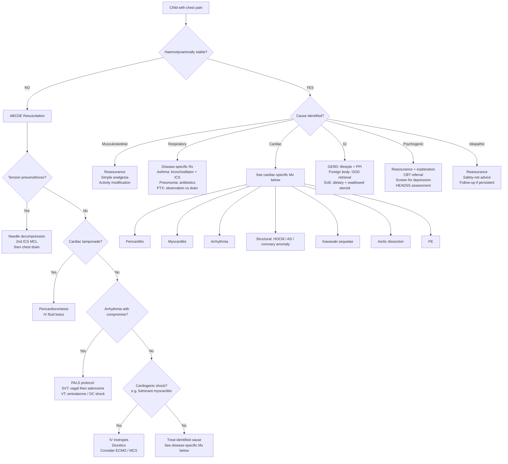

## Management of Paediatric Chest Pain

### Management Philosophy: Treat the Cause, Not Just the Symptom

The management of chest pain in a child is **entirely driven by the underlying diagnosis**. There is no "generic chest pain protocol" in paediatrics the way there is an ACS protocol in adult medicine. The vast majority of children need nothing more than a clear explanation and reassurance. For the minority with a serious underlying cause, management is disease-specific.

The overarching framework is:

1. **Stabilise** (if haemodynamically unstable) — ABCDE approach
2. **Identify the cause** — through the diagnostic workup described previously
3. **Treat the cause** — specific management for the identified aetiology
4. **Address the family** — explanation, reassurance, safety-netting, and follow-up

<Callout title="The Most Common 'Treatment' for Paediatric Chest Pain Is Reassurance">
In > 80% of cases, the diagnosis will be benign (musculoskeletal, idiopathic, precordial catch). The most therapeutic intervention is a clear, empathic explanation to the child and family about what is causing the pain, why it is not dangerous, and what to expect. This is not "doing nothing" — it is actively treating anxiety, which often accompanies chest pain in children and their parents.
</Callout>

---

### Master Management Algorithm

---

### Disease-Specific Management

#### A. Musculoskeletal Causes (Costochondritis, Precordial Catch, Strain)

**This is the most common management scenario — and the management is straightforward.**

| Component | Detail | Rationale |
|---|---|---|
| **Reassurance** | Explain to child and parents: "The pain is coming from the chest wall muscles/cartilage. It is not from the heart. It is not dangerous." | Parental anxiety about "heart problems" is often the primary concern driving the ED visit. Naming the diagnosis reduces anxiety dramatically. |
| **Simple analgesia** | ***Paracetamol*** (acetaminophen): 15 mg/kg/dose PO q4–6h (max 75 mg/kg/day or 4g/day in adolescents). ***Ibuprofen***: 5–10 mg/kg/dose PO q6–8h (max 40 mg/kg/day) | Paracetamol: central COX inhibition → antipyretic + analgesic. Ibuprofen: peripheral COX-1/2 inhibition → anti-inflammatory + analgesic. NSAIDs are particularly useful in costochondritis (anti-inflammatory). |
| **Topical measures** | Heat packs, gentle stretching | Local vasodilation → improved blood flow → reduced muscle spasm |
| **Activity modification** | Temporary reduction in activities that provoke pain; gradual return | Avoids repeated microtrauma to inflamed costochondral junctions |
| **Follow-up** | Only if pain persists > 2–4 weeks or new features develop | Safety-netting |

**Contraindications for NSAIDs in children**: Active GI bleeding, renal impairment, aspirin-sensitive asthma, dehydration (risk of renal injury), concomitant anticoagulation. In dengue-endemic areas (relevant to HK), avoid NSAIDs if dengue is suspected (↑bleeding risk).

For **precordial catch syndrome**: Reassurance alone is sufficient. No medication needed. Explain to the adolescent: "This is a completely harmless phenomenon. It will go away on its own. If you take a deep breath and it 'pops,' it will resolve immediately."

---

#### B. Respiratory Causes

##### 1. Asthma / Exercise-Induced Bronchospasm

***Very common in Hong Kong.*** Management follows GINA guidelines adapted for children.

| Scenario | Management | Mechanism |
|---|---|---|
| **Acute wheezing/tightness** | ***Inhaled salbutamol*** (SABA): 2–6 puffs via MDI + spacer, repeat q20min x3 if needed. Add ***ipratropium bromide*** if poor response. Oral prednisolone 1–2 mg/kg (max 40 mg) if moderate-severe. | Salbutamol = β₂-agonist → bronchial smooth muscle relaxation → bronchodilation. Ipratropium = anticholinergic → blocks vagal-mediated bronchoconstriction. Prednisolone → ↓airway inflammation. |
| **Chronic maintenance** | ***Low-dose ICS*** (e.g., fluticasone 50–100 μg BD or budesonide 100–200 μg BD) as Step 2. Step up as needed per GINA. | ICS → ↓eosinophilic inflammation, ↓airway hyperreactivity, ↓mucus production |
| **Exercise-induced** | Pre-exercise SABA (2 puffs 15 min before exercise). If frequent, consider daily ICS. | Pre-emptive bronchodilation prevents exercise-triggered bronchospasm |

**Paediatric formulation note**: Children < 5 years should use MDI + spacer with face mask. Children ≥ 5 years can use MDI + spacer with mouthpiece. DPIs (dry powder inhalers) require adequate inspiratory flow → generally suitable from ~6–8 years.

##### 2. Pneumonia

- **Antibiotics**: Empiric based on age and severity
  - < 5 years: ***Amoxicillin*** (high dose: 80–90 mg/kg/day PO in 2 divided doses) — covers *S. pneumoniae*
  - ≥ 5 years: ***Amoxicillin*** OR ***macrolide*** (e.g., azithromycin 10 mg/kg day 1 then 5 mg/kg days 2–5) — to cover *Mycoplasma pneumoniae*
  - Severe/hospitalised: IV ***amoxicillin-clavulanate*** or ***ceftriaxone*** ± macrolide
- **Supportive**: Supplemental O₂ if SpO₂ < 92%, IV fluids if dehydrated, antipyretics for fever

##### 3. Pneumothorax

| Size / Severity | Management | Rationale |
|---|---|---|
| **Small primary spontaneous PTX, minimal symptoms** | Observation + supplemental O₂ (high-flow if tolerated). Repeat CXR in 4–6 hours. | Small PTX reabsorbs spontaneously (~1.25% of hemithorax volume per day). Supplemental O₂ creates a nitrogen gradient favouring pleural air reabsorption. |
| **Large PTX or significant symptoms** | ***Chest drain*** (intercostal drain/chest tube) — 4th–5th ICS, anterior axillary line, safe triangle. Or needle aspiration first (2nd ICS MCL) for primary spontaneous PTX in adolescents. | Removes air from pleural space → re-establishes negative intrapleural pressure → lung re-expansion |
| ***Tension PTX*** | ***Immediate needle decompression*** (2nd ICS, MCL, affected side) using large-bore cannula, then chest drain. **Do NOT wait for CXR.** | Converts tension (positive pressure) to simple (atmospheric) PTX → relieves mediastinal shift and haemodynamic compromise [3] |

**Paediatric drain size**: Use smaller chest tubes than adults (e.g., 12–16 Fr for adolescents, 8–12 Fr for younger children). Pigtail catheters (Seldinger technique) are increasingly preferred for primary spontaneous PTX as they are less invasive.

---

#### C. Cardiac Causes — Disease-Specific Management

##### 1. Pericarditis

***The most common cardiac cause of chest pain in children.***

***Management of paediatric pericarditis*** follows ESC guidelines adapted for children:

| Phase | Treatment | Dose / Detail | Mechanism / Rationale |
|---|---|---|---|
| **First-line** | ***NSAIDs*** (ibuprofen preferred in children) + ***Colchicine*** | Ibuprofen: 5–10 mg/kg/dose TDS (max 2.4g/day in adolescents) for 1–2 weeks then taper over 2–4 weeks. Colchicine: 0.5 mg OD (weight < 70 kg) or 0.5 mg BD (weight ≥ 70 kg) for 3 months. | Ibuprofen: COX inhibition → ↓prostaglandin synthesis → ↓pericardial inflammation. Colchicine: "colchicum" = meadow saffron plant; inhibits microtubule polymerisation → ↓neutrophil migration and inflammasome activation → ↓recurrence (NNT ~4 for preventing recurrent pericarditis). |
| **Adjunct** | **Gastroprotection** | PPI (e.g., omeprazole 1 mg/kg/day) while on NSAIDs | Protect gastric mucosa from NSAID-induced damage |
| **Activity restriction** | Restrict from competitive sports and strenuous exercise until symptoms resolved AND inflammatory markers (CRP) normalised AND echo shows no effusion | | Exercise during active pericarditis → risk of haemodynamic compromise if effusion worsens |
| **Corticosteroids** | ***AVOID as first-line*** (paradoxically ↑ recurrence rate). Use only if: contraindication to NSAIDs, autoimmune aetiology (SLE), incomplete response to NSAIDs + colchicine | Low-dose prednisolone 0.25–0.5 mg/kg/day, very slow taper over months | Steroids suppress inflammation but when withdrawn, rebound inflammation occurs → ↑recurrence. This is why colchicine is preferred for recurrence prevention. |
| **Refractory / recurrent** | ***Colchicine*** (continued longer course), ± anakinra (IL-1 receptor antagonist) in colchicine-refractory cases | Anakinra: 2 mg/kg/day SC (max 100 mg) | Anakinra blocks IL-1β → key cytokine in autoinflammatory pericarditis loop |

<Callout title="Why NOT Aspirin in Children with Pericarditis?" type="error">
In adults, aspirin (or ibuprofen) is first-line for pericarditis. In children, ***ibuprofen is preferred over aspirin*** because of the risk of ***Reye syndrome*** — a rare but potentially fatal hepatic encephalopathy associated with aspirin use in children with viral infections. Since most paediatric pericarditis is post-viral, aspirin poses an unnecessary risk. The only exception is pericarditis in the context of acute rheumatic fever or Kawasaki disease, where aspirin is specifically indicated.
</Callout>

**Management of cardiac tamponade** (complicating pericarditis):
- ***Pericardiocentesis*** — urgent, life-saving
- IV fluid bolus (to maintain preload while awaiting drainage)
- Avoid diuretics and vasodilators (they reduce preload, worsening tamponade physiology)
- Surgical pericardial window if recurrent

##### 2. Myocarditis

***A potentially life-threatening condition requiring inpatient management.***

| Phase | Treatment | Detail | Rationale |
|---|---|---|---|
| **Monitoring** | ***Admit to PICU/CCU*** with continuous cardiac monitoring | Arrhythmia risk (VT/VF), risk of rapid decompensation | Myocarditis can progress to fulminant heart failure or fatal arrhythmia within hours |
| **Supportive** | Bed rest, fluid restriction, supplemental O₂ | | ↓myocardial oxygen demand; avoid fluid overload in failing heart |
| **Heart failure management** | ***Diuretics*** (furosemide 1–2 mg/kg/dose IV), ***ACE inhibitors*** (captopril or enalapril), ***β-blockers*** (carvedilol — start at low dose once haemodynamically stable) [13] | | Furosemide: loop diuretic → ↓preload → ↓pulmonary congestion. ACEi: ↓afterload + neurohormonal modulation + ↓remodelling. β-blocker: ↓HR → ↓myocardial O₂ demand + antiarrhythmic + ↓remodelling. |
| ***Inotropic support*** | ***IV milrinone*** (preferred in paediatric acute HF) or ***dobutamine*** | Milrinone: 0.25–0.75 μg/kg/min. Dobutamine: 5–20 μg/kg/min | Milrinone = PDE3 inhibitor → ↑cAMP → inotrope + vasodilator ("ino-dilator") → ↑contractility without ↑afterload. Preferred in paediatrics because it reduces afterload (beneficial in failing heart). Dobutamine = β₁-agonist → ↑contractility but ↑HR and ↑O₂ demand. |
| **Arrhythmia** | Treat according to PALS protocols. Amiodarone for VT. External pacing for complete heart block. | | Myocardial inflammation → re-entry circuits and automaticity → arrhythmia |
| ***Mechanical circulatory support*** | ***ECMO*** (extracorporeal membrane oxygenation) or ***VAD*** (ventricular assist device) for fulminant myocarditis with refractory cardiogenic shock [13] | | Bridge to recovery (myocarditis is often reversible) or bridge to transplant. Paediatric myocarditis has ~60–80% recovery rate if supported through the acute phase. |
| **Immunomodulation** | ***IVIG*** (2 g/kg IV over 12–24h) — used in practice though evidence is limited. Avoid immunosuppressants in the acute viral phase. | | IVIG may modulate immune response and neutralise viral particles. Immunosuppression (steroids, azathioprine) is reserved for biopsy-proven autoimmune/giant cell myocarditis, NOT routine viral myocarditis. |
| **Anticoagulation** | Consider LMWH if severely impaired LV function (EF < 30%) | | Dilated, poorly contracting ventricle → stasis → risk of intracardiac thrombus → systemic embolisation |

> **Why is milrinone preferred over dobutamine in paediatric acute heart failure?** Milrinone is a phosphodiesterase 3 (PDE3) inhibitor. "Phosphodiesterase" breaks down cAMP. By inhibiting PDE3, milrinone increases intracellular cAMP in both cardiomyocytes (→ ↑contractility) and vascular smooth muscle (→ vasodilation). This dual "inodilator" effect is ideal for the failing heart: it increases output while reducing afterload, without increasing heart rate as much as dobutamine does. Dobutamine, being a β₁-agonist, increases contractility but at the cost of increased heart rate and myocardial oxygen demand — not ideal in an already ischaemic/inflamed myocardium.

##### 3. Arrhythmia (SVT, VT)

| Arrhythmia | Acute Management | Chronic Management |
|---|---|---|
| ***SVT (haemodynamically stable)*** | **Vagal manoeuvres first** (ice to face in infants, Valsalva/carotid massage in older children) → If fails: ***IV adenosine*** (rapid push via proximal IV + saline flush): 0.1 mg/kg (max 6 mg), repeat at 0.2 mg/kg (max 12 mg) if needed | Observation if infrequent. Oral propranolol or flecainide for recurrent SVT. Catheter ablation for recurrent/drug-refractory SVT (usually deferred to > 15 kg / > 4 years unless medically refractory). |
| ***SVT (haemodynamically unstable)*** | ***Synchronised DC cardioversion*** at 1 J/kg, then 2 J/kg if needed | As above |
| ***VT (with pulses, stable)*** | ***IV amiodarone*** 5 mg/kg over 20–60 min | Correct underlying cause. ICD consideration in channelopathies. |
| ***VT/VF (pulseless)*** | ***Defibrillation*** 4 J/kg + CPR + adrenaline per PALS | ICD, treat underlying cause |

**Why adenosine for SVT?** Adenosine (adeno = gland, -sine = nucleoside) acts on A₁ receptors at the AV node → transiently blocks AV conduction → interrupts the re-entrant circuit that maintains SVT. Its half-life is < 10 seconds (broken down by red cell adenosine deaminase), so it must be given as a rapid IV push with an immediate saline flush to reach the heart before degradation.

**Paediatric adenosine dose**: 0.1 mg/kg (max 6 mg first dose), can escalate to 0.2 mg/kg (max 12 mg). Always given via the most proximal IV access available, followed by rapid 5–10 mL saline flush.

##### 4. Structural Heart Disease (HOCM, Aortic Stenosis, Anomalous Coronary Artery)

| Condition | Management | Key Points |
|---|---|---|
| ***HOCM*** | **Activity restriction** (no competitive sports until risk-stratified). ***β-blocker*** (propranolol or atenolol) as first-line to ↓HR, ↓contractility → ↓dynamic LVOT obstruction. Consider ***ICD*** if high SCD risk (FHx SCD, massive hypertrophy, unexplained syncope, non-sustained VT). Surgical myectomy or alcohol septal ablation for refractory obstruction. | β-blockers ↓HR → longer diastolic filling time → ↑LV volume → ↓obstruction. Also ↓contractility → ↓Venturi effect in LVOT. **AVOID**: digoxin (↑contractility → ↑obstruction), diuretics (↓preload → ↑obstruction), vasodilators (↓afterload → ↑obstruction), strenuous exercise. |
| ***Aortic stenosis*** | Mild-moderate: observation with serial echo. Severe/symptomatic: ***balloon valvuloplasty*** (catheter-based, preferred in children as bridge) or ***surgical valvotomy/valve replacement***. Ross procedure (autograft pulmonary valve to aortic position + pulmonary homograft) in children who need valve replacement (avoids lifelong anticoagulation). | Balloon valvuloplasty in children: effective for congenital AS because the pathology is usually commissural fusion (not calcification as in adults). Inflating a balloon across the fused commissures → splits them open. |
| ***Anomalous coronary artery*** | ***Surgical repair*** — reimplantation of anomalous coronary into the correct aortic sinus, or unroofing procedure. This is **definitive**. | Even asymptomatic patients with ALCA from right sinus (intramural/interarterial course) should be offered surgery because of SCD risk. |
| ***ALCAPA*** | ***Urgent surgical repair*** — reimplantation of left coronary from PA to aorta. Supportive heart failure management pre-operatively (diuretics, ACEi, milrinone). | Without surgery, mortality in infancy is ~90% in the first year. With surgery, long-term outcomes are excellent. |

##### 5. Kawasaki Disease Coronary Sequelae

Management depends on the coronary artery status (determined by serial echocardiography):

| Coronary Status | Long-Term Management |
|---|---|
| **No coronary involvement (Z-score < 2)** | Low-dose aspirin for 6–8 weeks after acute illness, then stop. No long-term antiplatelet needed. |
| **Coronary dilation (Z-score 2–2.5)** | Low-dose aspirin until normalisation. Serial echo follow-up. |
| **Small-medium aneurysm (Z-score 2.5–10)** | ***Low-dose aspirin*** indefinitely ± ***clopidogrel***. Serial echo and stress testing. Restrict from contact sports. |
| **Giant aneurysm (Z-score ≥ 10 or ≥ 8mm)** | ***Low-dose aspirin + anticoagulation*** (warfarin, target INR 2–2.5, or LMWH in younger children). Serial echo + CT/MR angiography. Cardiology follow-up lifelong. Consider coronary revascularisation (CABG) if significant stenosis with ischaemia. |

**Why aspirin is specifically indicated in Kawasaki disease (unlike other paediatric conditions)**: In Kawasaki disease, the anti-platelet and anti-inflammatory properties of aspirin are specifically needed to reduce coronary artery thrombosis risk and ongoing vasculitis. The risk-benefit ratio here favours aspirin use even in children, because the risk of coronary thrombosis/MI far outweighs the small risk of Reye syndrome (which is primarily associated with aspirin use during influenza or varicella, not Kawasaki disease).

##### 6. Aortic Dissection (Marfan / Connective Tissue Disorders)

- **Emergency**: This is a surgical emergency in children just as in adults [5]
- ***Control heart rate and blood pressure***: IV esmolol (β-blocker: 500 μg/kg loading then 50–200 μg/kg/min) ± IV sodium nitroprusside (if BP remains elevated after rate control). Target HR < 60 bpm, SBP < 120 mmHg (or age-appropriate targets in children).
  - **Why rate control BEFORE BP reduction?** Reducing BP with vasodilators alone → reflex tachycardia → increased dP/dt (rate of rise of aortic pressure) → increased shear stress on the dissection flap → propagation. β-blockers ↓HR and ↓dP/dt first → safer to then add vasodilators.
- ***Type A dissection (involves ascending aorta)***: Urgent surgical repair (interposition graft ± aortic root replacement)
- ***Type B dissection (descending aorta only)***: Medical management with anti-impulse therapy; surgery only if complicated (malperfusion, rupture, refractory pain)
- **Long-term**: Lifelong β-blocker, regular surveillance imaging, genetic counselling, activity restriction (no contact sports, no isometric exercise, no competitive sports)

##### 7. Pulmonary Embolism (Rare in Children)

- **Anticoagulation**: ***LMWH*** (enoxaparin) is preferred in paediatrics
  - Paediatric dosing: 1.5 mg/kg SC q12h for infants < 2 months; 1 mg/kg SC q12h for children ≥ 2 months
  - Monitor anti-Xa levels (target 0.5–1.0 IU/mL)
  - Duration: typically 3–6 months, longer if ongoing risk factors (thrombophilia, active malignancy)
- **Massive PE with haemodynamic compromise**: Consider ***systemic thrombolysis*** (tPA: alteplase 0.1–0.6 mg/kg/h over 6 hours, max 100 mg) or ***catheter-directed thrombolysis*** or ***surgical embolectomy***
- **Supportive**: Supplemental O₂, IV fluid (cautious — avoid overloading a failing RV), vasopressors if hypotensive

---

#### D. Gastrointestinal Causes

##### 1. GERD

| Component | Treatment | Rationale |
|---|---|---|
| ***Lifestyle modifications*** | Elevate head of bed, avoid eating 2–3 hours before sleep, avoid trigger foods (fatty, acidic, chocolate, caffeine), weight loss if obese | ↓Frequency and severity of reflux episodes by reducing intra-abdominal pressure and keeping gastric acid in the stomach by gravity |
| ***Antacid / alginate*** | Gaviscon (alginate + antacid) PRN | Alginates form a raft on top of gastric contents, creating a physical barrier against reflux |
| ***PPI trial*** | ***Omeprazole***: 1 mg/kg/day (max 20–40 mg) for 4–8 weeks | PPIs irreversibly inhibit H⁺/K⁺-ATPase (proton pump) on parietal cells → ↓gastric acid secretion → ↓acid damage to oesophageal mucosa. If chest pain resolves with PPI → supports GERD diagnosis. |
| **Refractory** | OGD with biopsies → rule out eosinophilic oesophagitis, Barrett's | [7] |

##### 2. Eosinophilic Oesophagitis (EoE)

- ***Swallowed topical corticosteroid*** (fluticasone MDI swallowed, or budesonide viscous slurry): ↓oesophageal eosinophilic inflammation
- ***Elimination diet*** (empiric 6-food elimination or targeted based on allergy testing)
- ***PPI*** (some EoE is PPI-responsive)
- OGD with biopsies for diagnosis and monitoring

##### 3. Foreign Body Ingestion

- **Button battery in oesophagus**: ***EMERGENCY removal by OGD within 2 hours*** (caustic alkaline burn → perforation risk)
- **Coin in oesophagus**: OGD removal if not passed spontaneously within 24 hours
- **Airway foreign body**: ***Rigid bronchoscopy*** for retrieval (both diagnostic and therapeutic)

---

#### E. Psychogenic / Functional Causes

This is a critical management area because if handled poorly, the child develops chronic pain behaviour, school avoidance, and escalating healthcare utilisation.

| Component | Approach | Rationale |
|---|---|---|
| ***Validation*** | "I believe your pain is real. The good news is that your heart and lungs are healthy." | Dismissing the pain ("it's all in your head") is counterproductive and destroys therapeutic alliance. The pain IS real — it's the interpretation and amplification that is disproportionate. |
| ***Explanation*** | "Sometimes when we are stressed or worried, our body produces real physical sensations like chest pain. This is very common and not dangerous." | Normalises the experience, introduces the mind-body connection without being dismissive |
| ***Functional rehabilitation*** | Encourage return to normal activities including school. Do NOT allow prolonged rest or school avoidance. | Prolonged rest reinforces illness behaviour and deconditioning |
| ***CBT referral*** | ***Cognitive behavioural therapy*** — gold standard for functional somatic symptoms and anxiety in adolescents | CBT addresses catastrophic thinking, avoidance behaviour, and teaches coping strategies |
| ***Screen for depression/anxiety*** | HEADSS assessment, GAD-7, PHQ-A | Treat underlying psychiatric comorbidity if present |
| ***Medication*** (if indicated) | SSRIs (e.g., fluoxetine or sertraline) for significant anxiety or depression | Fluoxetine is the best-studied SSRI in adolescent depression. Start low, go slow. Monitor for suicidality (black box warning in < 25 years). |
| ***Family involvement*** | Include parents in management plan. Address parental anxiety. | Parental anxiety amplifies child's anxiety and pain behaviour |

<Callout title="Avoid the 'Diagnosis of Exclusion' Trap" type="error">
Do NOT say "we've done all the tests and everything is normal, so it must be stress." This implies the diagnosis is arrived at by failure rather than by positive clinical reasoning. Instead, **positively diagnose** the functional/psychogenic aetiology based on the clinical features (vague pain, associated anxiety, hyperventilation features, psychosocial stressors) and communicate this as a real diagnosis with a real treatment plan.
</Callout>

---

#### F. Idiopathic Chest Pain

For the 20–45% of cases where no specific cause is identified despite thorough evaluation:

- **Reassurance**: "We have carefully evaluated your child. There is no sign of any heart, lung, or other serious problem. This type of chest pain is very common in children and usually resolves on its own."
- **Simple analgesia PRN**: Paracetamol or ibuprofen
- **Safety-net advice**: "Return if the pain becomes much worse, if it occurs specifically during exercise, if your child faints, or if there are any new symptoms."
- **Follow-up**: Review in 2–4 weeks. Most cases resolve spontaneously. If persistent (> 3–6 months), consider further evaluation or psychology referral.

---

### Heart Failure Management Framework (When Chest Pain Is Part of HF Presentation)

***Management of Paediatric Heart Failure*** [13]:

***Identification of the cause and precipitating factors*** → ***Tackling of precipitating factors*** → ***General supportive management*** → ***Medical therapy of heart failure (diuretics, digoxin, ACEI, carvedilol)*** → ***Treatment of underlying cause, if possible, by surgical or catheter intervention*** → ***Mechanical circulatory support and heart transplantation*** [13]

| Stage | Treatment | Agents / Detail |
|---|---|---|
| **Stage A** (at risk, no symptoms) | ***No specific treatment***. Control risk factors. | Healthy lifestyle, treat underlying conditions |
| **Stage B** (structural disease, no symptoms) | ***ACEI/ARB + β-blocker*** | Enalapril 0.1 mg/kg/dose BD (titrate to 0.5 mg/kg/dose). Carvedilol 0.05 mg/kg/dose BD (titrate up slowly). |
| **Stage C** (structural disease + symptoms) | ***ACEI/ARB + β-blocker + MRA ± diuretics*** for fluid overload | Add spironolactone 1–2 mg/kg/day. Furosemide 1–2 mg/kg/dose for fluid overload. |
| **Stage D** (refractory HF) | Above + ***IV inotropes***, diuretics, non-drug therapies | ***IV milrinone or dobutamine***. Consider ECMO, LVAD, heart transplantation. [13] |

**Other potentially useful drugs** [13]:
- ***Vasodilators***: IV nitroprusside, nitroglycerine → ↓afterload in acute decompensated HF
- ***Inodilators***: amrinone, milrinone → ↑contractility + ↓afterload (as above)
- ***Digoxin***: seldom used due to narrow therapeutic index; may still be used in specific situations (e.g., SVT with HF, chronic HF refractory to standard therapy)

**General supportive measures** [13]:
- ***Bed rest with elevation of bed head*** → improve lung function
- ***Nutritional support***: high-caloric diet due to ↑metabolic demand (children with CHF are often in a hypermetabolic state → failure to thrive)
- ***Fluid restriction***
- ***O₂***: caution in large L-to-R shunt (↑PAO₂ → pulmonary vasodilation → ↓PVR → ↑shunting) [13]
- Exercise and activity: balance basic physical activity vs risk from exercise

---

### Communication and Family-Centred Care in Management

| Aspect | Approach |
|---|---|
| **Explaining the diagnosis** | Use simple language: "The pain is coming from the muscles and cartilage between the ribs. It's like a cramp. It is NOT from the heart." Use diagrams. |
| **Addressing parental anxiety** | Acknowledge: "I understand you were worried this might be a heart problem. That's a very natural concern." Explain: "We have checked and there is no sign of any heart problem." |
| **When further cardiac evaluation is needed** | Explain the rationale honestly: "Your child's pain has some features that make me want to check the heart more carefully. This doesn't mean there IS a heart problem — it means I want to make absolutely sure." |
| **Activity restrictions** | For benign causes: "Your child can continue all normal activities including sport." For cardiac causes (HOCM, anomalous coronary): "We need to restrict competitive sports until we've completed the evaluation. I'll explain exactly what's safe." |
| **Safety-netting** | Always give clear return criteria: "Come back if the pain happens during exercise, if your child faints, if the pain is much worse, or if you notice anything new." |
| **Consent/assent** | For investigations (ECG, echo, blood tests): explain to the child in age-appropriate terms. For adolescents: involve them in decision-making. For young children: distraction techniques during blood draws, use topical anaesthetic cream (EMLA) for cannulation. |

---

### Pharmacological Summary Table (Paediatric Dosing)

| Drug | Indication | Paediatric Dose | Key Contraindications / Cautions |
|---|---|---|---|
| ***Paracetamol*** | Musculoskeletal pain | 15 mg/kg/dose PO q4-6h (max 75 mg/kg/day) | Hepatic impairment |
| ***Ibuprofen*** | Costochondritis, pericarditis | 5–10 mg/kg/dose PO q6-8h (max 40 mg/kg/day) | Renal impairment, GI bleeding, dehydration, aspirin-sensitive asthma |
| ***Colchicine*** | Pericarditis (adjunct) | 0.5 mg OD ( < 70 kg) or 0.5 mg BD (≥ 70 kg) for 3 months | GI intolerance (diarrhoea), renal/hepatic impairment |
| ***Salbutamol*** | Asthma/bronchospasm | 2–6 puffs MDI + spacer q20min PRN acute; 2 puffs PRN chronic | Tachycardia, hypokalaemia with excessive use |
| ***Omeprazole*** | GERD | 1 mg/kg/day PO (max 20–40 mg) | Long-term: ↓Mg, ↓Ca absorption, ↑infection risk |
| ***Adenosine*** | SVT | 0.1 mg/kg IV rapid push (max 6 mg), can repeat at 0.2 mg/kg (max 12 mg) | Heart transplant patients (↑sensitivity), asthma (may cause bronchospasm), 2nd/3rd degree heart block |
| ***Enalapril*** | Heart failure | 0.1 mg/kg/dose PO BD, titrate to 0.5 mg/kg/dose | Hypotension, renal artery stenosis, hyperkalaemia, pregnancy (teratogenic) |
| ***Carvedilol*** | Heart failure, HOCM | 0.05 mg/kg/dose PO BD, titrate slowly | Acute decompensated HF (start only when haemodynamically stable), severe asthma, heart block |
| ***Furosemide*** | Fluid overload in HF | 1–2 mg/kg/dose PO/IV q6-12h | Hypokalaemia, hyponatraemia, ototoxicity (high doses) |
| ***Milrinone*** | Acute HF, cardiogenic shock | 0.25–0.75 μg/kg/min IV infusion | Hypotension (vasodilatory), arrhythmia |
| ***Enoxaparin*** | PE, thrombosis | < 2 months: 1.5 mg/kg SC q12h. ≥ 2 months: 1 mg/kg SC q12h | Bleeding risk, renal impairment (accumulation), HIT |

---

<Callout title="High Yield Summary">

**1. > 80% of paediatric chest pain requires only REASSURANCE + SIMPLE ANALGESIA. The most important "treatment" is a clear explanation to child and family.**

**2. Management is entirely cause-specific — there is no "generic chest pain protocol" for children.**

**3. For pericarditis: NSAIDs (ibuprofen, NOT aspirin in children) + colchicine. Avoid steroids first-line (↑recurrence). Activity restriction until CRP normalised + echo clear.**

**4. For myocarditis: admit PICU, cardiac monitoring, heart failure management (diuretics, ACEi, milrinone), ECMO for fulminant cases. IVIG may be considered. Avoid immunosuppressants in acute viral phase.**

**5. For SVT: vagal manoeuvres → adenosine → cardioversion. Adenosine dose in children: 0.1 mg/kg rapid push (max 6 mg).**

**6. For HOCM: β-blockers, activity restriction, avoid inotropes/diuretics/vasodilators. ICD if high SCD risk.**

**7. Kawasaki sequelae: aspirin ± clopidogrel ± anticoagulation depending on coronary Z-score. Giant aneurysms need anticoagulation.**

**8. Paediatric HF: staged management — Stage B: ACEI + BB; Stage C: add MRA + diuretics; Stage D: IV inotropes + consider ECMO/VAD/transplant.**

**9. Milrinone is preferred over dobutamine in paediatric acute HF (inodilator — ↑contractility + ↓afterload without ↑HR).**

**10. For psychogenic chest pain: validate the pain, positively diagnose the condition, refer for CBT, screen for anxiety/depression, encourage return to normal activities. Do NOT dismiss or over-investigate.**

**11. Tension pneumothorax: immediate needle decompression (2nd ICS MCL) — do NOT wait for CXR.**

**12. Aspirin is AVOIDED in most paediatric conditions (Reye syndrome risk) EXCEPT Kawasaki disease and acute rheumatic fever where it is specifically indicated.**
</Callout>

---

<ActiveRecallQuiz
  title="Active Recall - Management of Paediatric Chest Pain"
  items={[
    {
      question: "A 12-year-old presents with pericarditis. What is the first-line treatment regimen, and why should corticosteroids be avoided as initial therapy?",
      markscheme: "First-line: Ibuprofen (5-10 mg/kg TDS for 1-2 weeks then taper) + Colchicine (0.5 mg OD if under 70 kg, for 3 months). Corticosteroids are avoided because they paradoxically increase the recurrence rate of pericarditis — when steroids are tapered, rebound inflammation occurs. Colchicine is preferred for recurrence prevention (inhibits microtubule polymerisation, reduces neutrophil migration and inflammasome activation).",
    },
    {
      question: "A 6-month-old infant is in SVT with a heart rate of 260 bpm and is haemodynamically stable. Describe the stepwise management.",
      markscheme: "Step 1: Vagal manoeuvres — apply ice pack to face for 15-30 seconds (diving reflex stimulates vagal tone). Step 2: If fails, IV adenosine 0.1 mg/kg rapid push via most proximal IV access with immediate 5-10 mL saline flush (max 6 mg). Step 3: If fails, repeat adenosine at 0.2 mg/kg (max 12 mg). Step 4: If fails and becomes haemodynamically unstable, synchronised DC cardioversion at 1 J/kg then 2 J/kg.",
    },
    {
      question: "Explain why milrinone is preferred over dobutamine in paediatric acute heart failure.",
      markscheme: "Milrinone is a PDE3 inhibitor — it increases intracellular cAMP in both cardiomyocytes (increasing contractility) and vascular smooth muscle (causing vasodilation). This dual inotrope + vasodilator effect increases cardiac output while reducing afterload, without significantly increasing heart rate or myocardial oxygen demand. Dobutamine is a beta-1 agonist that increases contractility but also increases HR and myocardial oxygen demand, which is disadvantageous in an already compromised myocardium.",
    },
    {
      question: "A child with known HOCM presents with exertional chest pain. Name 3 drug classes that are CONTRAINDICATED and explain why for each.",
      markscheme: "(1) Digoxin/positive inotropes — increase contractility which worsens dynamic LVOT obstruction. (2) Diuretics — reduce preload, decreasing LV volume, which worsens obstruction (less blood to push the septum away from the outflow tract). (3) Vasodilators — reduce afterload, increasing the pressure gradient across the LVOT obstruction and worsening forward flow obstruction. The correct treatment is a beta-blocker (slows HR, reduces contractility, increases diastolic filling time).",
    },
    {
      question: "A parent brings their 14-year-old daughter to the ED with recurrent vague chest pain associated with perioral tingling and light-headedness during exam periods. ECG is normal. How would you manage this?",
      markscheme: "(1) Validate the pain — it is real. (2) Explain the mind-body connection: stress causes hyperventilation, which causes respiratory alkalosis and decreased ionised calcium, causing perioral tingling. (3) Reassure that ECG and heart are normal. (4) HEADSS psychosocial assessment. (5) Screen for anxiety/depression using validated tools. (6) Refer for CBT. (7) Encourage return to normal activities including school. (8) Safety-net advice. (9) Consider SSRI if significant anxiety/depression identified. Do NOT over-investigate or dismiss.",
    },
    {
      question: "Why is aspirin specifically used in Kawasaki disease but generally avoided in other paediatric conditions?",
      markscheme: "Aspirin is generally avoided in children because of the risk of Reye syndrome (hepatic encephalopathy associated with aspirin use during viral infections). However, in Kawasaki disease, aspirin is specifically indicated because: (1) its anti-platelet effect reduces the risk of coronary artery thrombosis in inflamed/aneurysmal coronary arteries, and (2) at high doses it has anti-inflammatory properties beneficial in the acute vasculitis phase. The risk of coronary thrombosis/MI far outweighs the small risk of Reye syndrome, especially since Kawasaki disease is not a typical viral infection.",
    },
  ]}
/>

## References

[1] Senior notes: Ryan Ho Cardiology.pdf (p54–58, p116–117, p127–128, p142)
[2] Senior notes: Ryan Ho Fundamentals.pdf (p199–203)
[3] Senior notes: Ryan Ho Respiratory.pdf (p63, p98, p134–136, p149–152)
[5] Senior notes: felixlai.md (Aortic Dissection section, p904)
[7] Senior notes: Ryan Ho GI.pdf (p56–57)
[8] Senior notes: Ryan Ho Psychiatry.pdf (p178–179)
[11] Senior notes: Ryan Ho Critical Care.pdf (p17, p22); Ryan Ho Haemtology.pdf (p131–132)
[13] Lecture slides: GC 147. Heart failure and cyanosis in children acyanotic and cyanotic congenital heart disease - Part 1.pdf (p36); Senior notes: Adrian Lui Pediatrics.pdf (p200)
