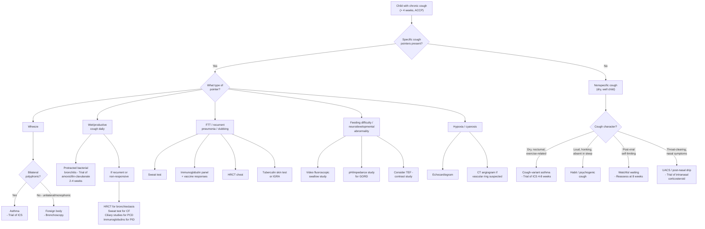

## Differential Diagnosis of Chronic Cough in Children

### Guiding Principles

Before diving into the differential, let's establish the thinking framework. ***Causes of cough in children may be different from adults*** [1]. ***Manifestations may be different from adults*** [1]. The classic adult triad (post-nasal drip, asthma, GORD) does **not** map neatly onto children. In paediatrics, we must think by **age**, by **cough character** (dry vs wet), and by the presence or absence of **specific cough pointers** (red flags).

The overarching question at the bedside is: ***Is this an acute exacerbation of a chronic respiratory disorder?*** — look for ***failure to thrive, finger clubbing, chest deformity, features of atopy*** [1].

---

### Systematic Differential by Anatomical Origin (Adapted for Paediatrics)

The cough reflex can be triggered anywhere from the pharynx to the lung parenchyma [2][3]. Each origin produces cough with distinguishable features:

| Anatomical Origin | Differential Diagnosis | Key Differentiating Features (Paediatric Focus) |
|---|---|---|
| **Pharynx** | Upper airway cough syndrome / post-nasal drip | ***Throat-clearing type cough; history of URTI, allergic rhinitis, or GERD*** [2][3]. Cobblestoning of posterior pharynx, allergic shiners, nasal crease. Very common in HK children (allergic rhinitis prevalence ~40%). |
| | Acid reflux (GORD) | ***History of URTI or GERD*** [2][3]. Cough worse when supine; infants: irritability, feeding refusal, Sandifer posturing. |
| **Larynx** | Croup / recurrent spasmodic croup | ***Barking, harsh cough; associated with hoarseness, stridor*** [2][3]. Typically 6 months–6 years, peak at 2 years [4]. Recurrent croup → suspect subglottic stenosis or haemangioma. |
| | Pertussis (whooping cough) | Paroxysmal cough spasms → inspiratory whoop → post-tussive vomiting. Three phases: catarrhal → paroxysmal → convalescent [4]. Consider even in vaccinated children (waning immunity). |
| | Laryngomalacia / subglottic pathology | Chronic stridor from birth, worse with feeding/crying. Inspiratory stridor because extrathoracic airway collapses during inspiration (subatmospheric intraluminal pressure) [4]. |
| **Trachea** | Tracheitis (bacterial) | ***Acute, painful cough; associated with raw retrosternal pain*** [2][3]. High fever, toxic-appearing child, does not respond to nebulised adrenaline (unlike croup). |
| | Tracheomalacia | Brassy/barking cough from infancy; worsens with crying, feeding, URTIs. Due to inadequate tracheal cartilage → dynamic collapse during expiration. |
| | Vascular ring compression | Chronic cough + stridor + dysphagia. Double aortic arch or aberrant right subclavian artery compresses trachea externally [4]. |
| **Bronchi** | ***Asthma / cough-variant asthma*** | ***Intermittent, worse at night or when exposed to allergens; sometimes productive with mucoid sputum; associated with long history of episodic SOB but relatively asymptomatic in between episodes*** [2][3]. ***May be the only manifestation in cough-variant asthma*** [2][3]. |
| | Protracted bacterial bronchitis (PBB) | Chronic **wet** cough > 4 weeks in a preschooler; responds to 2–4 weeks amoxicillin-clavulanate. Most common cause of chronic wet cough in children < 6 years. |
| | Foreign body aspiration | ***Wheeze → intrathoracic airway lesion (e.g., asthma, foreign body)*** [1]. Unilateral wheeze, history of choking episode (often unwitnessed in toddlers), recurrent same-lobe pneumonia. Peak age 1–3 years. |
| | Bronchiectasis | ***Chronic, very productive with blood; increased yellow foul-smelling sputum in postural changes; halitosis, chronic SOBOE and wasting*** [2][3]. ***Diagnosed by CXR/HRCT demonstrating airway dilatation ('tram-line' appearance)*** [5][6]. |
| **Lung parenchyma** | Pneumonia / recurrent pneumonia | ***Initially dry, later productive with purulent symptoms; associated with fever, SOB, chest pain*** [2][3]. ***Recurrent pneumonia → immunodeficiency, congenital lung abnormalities, tracheo-oesophageal H fistula*** [1]. |
| | Tuberculosis | ***Long history of productive cough, often with blood; associated with low-grade fever and constitutional symptoms*** [2][3]. Hilar lymphadenopathy → bronchial compression. Always consider in HK. |
| | Interstitial lung disease (ILD) | ***Dry and distressing; associated with long history of progressive SOBOE*** [2][3]. Rare in children but includes surfactant protein mutations (infants), hypersensitivity pneumonitis, sarcoidosis (adolescents). |
| | Cystic fibrosis | ***Persistent wet cough, copious purulent sputum ± haemoptysis; PE: clubbing, chest hyperinflation, coarse inspiratory crackles ± expiratory wheeze*** [7]. Classical triad: ↑ sweat Cl⁻ + recurrent lung infections + pancreatic insufficiency [7]. |
| | Primary ciliary dyskinesia (PCD) | Chronic wet cough from birth, neonatal respiratory distress, chronic rhinosinusitis, recurrent otitis media, situs inversus in ~50%. |
| **Heart** | Heart failure (congenital heart disease) | ***Cough worse when supine or at night; sometimes with pink, frothy sputum*** [2][3]. In children: large left-to-right shunts (VSD, PDA) → pulmonary overcirculation → pulmonary oedema → cough. Also consider dilated cardiomyopathy in older children. ***Hypoxia/cyanosis → cardiac disease*** [1]. |
| **Others** | ACE inhibitors | ***Dry cough occurring 1–2 weeks after initiation of therapy; due to decreased breakdown of bradykinin by ACE*** [2][3]. Less common in paediatrics but used in children with hypertension, proteinuria, or heart failure. |
| | Psychogenic / habit cough | ***Variable, prolonged symptoms; usually mild*** [2][3]. Loud, honking/barking, repetitive, **absent during sleep** (pathognomonic). School-age children/adolescents, often stress-related. Diagnosis of exclusion. |
| | Eosinophilic oesophagitis | Chronic cough + dysphagia + food impaction. Th2-driven oesophageal inflammation → vagal-mediated cough. Increasing in HK. |

---

### Age-Stratified Differential (High Yield)

This is how you should think on the ward — **the age of the child completely changes your differential**:

| Age Group | Most Likely Diagnoses | Key Clues |
|---|---|---|
| **Neonates (0–28 days)** | Congenital anomalies (tracheo-oesophageal fistula, laryngeal cleft), PCD, congenital infection, congenital heart disease | Cough from birth, respiratory distress at delivery, situs inversus, cyanosis with feeding |
| **Infants (1–12 months)** | GORD-related aspiration, post-bronchiolitis cough, tracheomalacia, CF, aspiration (swallowing dysfunction), congenital heart disease | Cough with feeds, failure to thrive, recurrent wheeze, steatorrhoea |
| **Toddlers (1–3 years)** | **Foreign body aspiration** (peak age!), PBB, recurrent viral-induced wheeze, post-infectious cough, CF | History of choking episode, chronic wet cough responding to antibiotics |
| **Preschool (3–5 years)** | PBB, asthma, post-infectious cough, bronchiectasis (if recurrent PBB untreated) | Wet vs dry cough distinction critical |
| **School-age (5–12 years)** | **Asthma** (most common), UACS/post-nasal drip, habit/psychogenic cough, bronchiectasis, TB | Atopic history, diurnal variation, absent during sleep (habit) |
| **Adolescents (12–18 years)** | Asthma, UACS, GORD, psychogenic cough, smoking/vaping-related, TB | As for adults but still think about PCD/CF if not previously diagnosed |

<Callout title="Exam Pearl: Foreign Body vs Asthma" type="error">
Both can present with wheeze and cough. The crucial differentiators:
- Foreign body → **unilateral** wheeze (monophonic), sudden onset with choking episode, same-lobe recurrent pneumonia
- Asthma → **bilateral** polyphonic wheeze, episodic, family/personal atopic history, responds to bronchodilators

***A child with wheeze may have a foreign body*** [1]. Always ask about a choking episode — it may have been weeks or months ago and forgotten by caregivers.
</Callout>

---

### Approach to Differentiating: Specific vs Nonspecific Cough

***The BTS subdivides chronic cough into specific cough (cough with signs and symptoms suggestive of an associated problem) and nonspecific cough (dry cough in absence of an identifiable respiratory disease of known aetiology)*** [1].

This distinction is the first branch point in your clinical reasoning:

**Specific cough pointers** (any one of these pushes you toward active investigation):

| ***Pointer*** | ***Implication / Differential*** |
|---|---|
| ***Wheeze*** | ***Intrathoracic airway lesion (e.g., asthma, foreign body)*** [1] |
| ***Crepitations*** | ***Parenchymal disease*** [1] — pneumonia, bronchiectasis, ILD, CF |
| ***Chest pain*** | ***Arrhythmia, asthma, increased respiratory distress (parenchymal disease)*** [1] |
| ***Chest wall deformity*** | ***Chronic airway or parenchymal disease*** [1] — long-standing poorly controlled asthma, CF, bronchiectasis |
| ***Digital clubbing*** | ***Chronic suppurative lung disease*** [1] — CF, bronchiectasis, empyema, ILD |
| ***Daily moist/productive cough*** | ***Suppurative lung disease*** [1] — PBB, bronchiectasis, CF, PCD |
| ***Failure to thrive*** | ***Serious systemic including pulmonary illness*** [1] — CF, immunodeficiency, TB |
| ***Feeding difficulties*** | ***Serious systemic including pulmonary illness, aspiration*** [1] |
| ***Hypoxia/cyanosis*** | ***Airway or parenchymal disease, cardiac disease*** [1] |
| ***Neurodevelopmental abnormality*** | ***Aspiration lung disease*** [1] |
| ***Recurrent pneumonia*** | ***Immunodeficiency, congenital lung abnormalities, tracheo-oesophageal H fistula*** [1] |

If **none** of these are present → nonspecific cough → consider post-viral cough, cough-variant asthma (trial of ICS), habit cough, or "watch and wait" with close follow-up.

---

### Approach to Acute Cough (for Completeness and Exam Questions)

***The lecture approach to arriving at a specific diagnosis for acute cough*** [1]:

| ***Question*** | ***Features*** | ***Likely Common Diagnosis*** |
|---|---|---|
| ***Is this an acute URI?*** | ***Coryzal symptoms, fever, sore throat*** | ***URI*** |
| ***Is this a croup syndrome?*** | ***Stridor, 'barking' or 'croupy cough', hoarseness, ± fever*** | ***Viral croup, recurrent spasmodic croup, bacterial tracheitis*** |
| ***Is this a lower respiratory tract illness?*** | ***Tachypnoea (> 60 for < 2 months, > 50 for 2–12 months, > 40 for > 1 year), respiratory distress with increased work of breathing, chest signs (crepitations or wheeze/rhonchi), fever*** | ***Acute bronchiolitis, pneumonia (viral, bacterial), asthma*** |
| ***Is this an allergic/atopic illness?*** | ***Seasonal and diurnal variation, association with rhinitis, posture, 'clearing of throat', triggers (dust, pollutant, pollen etc.)*** | ***Post-nasal drip from allergic rhinitis, reactive airway/asthma*** |
| ***Is this an acute exacerbation of a chronic respiratory disorder?*** | ***Failure to thrive, finger clubbing, chest deformity, features of atopy*** | ***To be continued (chronic cough workup)*** |

> Note the age-specific tachypnoea thresholds — these are WHO criteria and are **essential** for paediatric assessment: RR > 60 for < 2 months, > 50 for 2–12 months, > 40 for > 1 year [1].

---

### Differential Diagnosis Algorithm (Mermaid Diagram)

---

### Key Differentiating Features — Side-by-Side Comparison of Common Paediatric Differentials

| Feature | Asthma | PBB | Foreign Body | CF | PCD | Habit Cough |
|---|---|---|---|---|---|---|
| **Cough type** | Dry (or mucoid) | Wet | Variable (initially dry → wet) | Wet, productive | Wet from birth | Dry, honking |
| **Timing** | Nocturnal, exercise | Persistent, daily | Persistent after choking episode | Persistent, progressive | Persistent from birth | Daytime only |
| **Sleep** | May wake child | No specific pattern | No specific pattern | No specific pattern | No specific pattern | **Absent in sleep** |
| **Wheeze** | Bilateral, polyphonic | Usually absent | Unilateral, monophonic | ± bilateral | Usually absent | Absent |
| **Clubbing** | No (unless severe chronic) | No | No | **Yes** | **Yes** (late) | No |
| **FTT** | Uncommon | Uncommon | No | **Yes** | Variable | No |
| **Situs inversus** | No | No | No | No | **50%** | No |
| **Response to ICS** | **Yes** | No | No | No | No | No |
| **Response to antibiotics** | No | **Yes** (2–4 weeks) | No | Partial | Partial | No |
| **Key investigation** | Spirometry + BDR | Clinical response to antibiotics | Bronchoscopy | **Sweat test** | Nasal NO + ciliary EM | Exclusion |

---

### Less Common but Important Differentials (Don't Forget!)

1. **Bronchiolitis obliterans**: Post-infectious (adenovirus, Mycoplasma) or post-transplant → fixed airway obstruction → chronic cough with progressive dyspnoea + air trapping on HRCT. ***Bronchiolitis obliterans: mild SOBOE + dry cough progressing to decreased exercise tolerance, significant hypoxaemia*** [8]. Occurs in post-HSCT patients as a manifestation of chronic GVHD [8].

2. **Eosinophilic oesophagitis**: Increasingly recognised in atopic children; presents with chronic cough + dysphagia/food refusal + vomiting. Diagnosis by oesophageal biopsy showing > 15 eosinophils/HPF.

3. **Mediastinal mass**: Lymphoma (especially in adolescents) or neuroblastoma (in younger children) can compress airways → chronic cough + stridor or wheeze. ***Central airway obstruction: due to luminal or extraluminal masses compressing onto central airways; associated with exertional dyspnoea ± monophonic wheezes; flow volume loop is characteristic for upper airway obstruction (expiratory plateau)*** [5][6].

4. **Pulmonary haemosiderosis (idiopathic)**: Rare; recurrent alveolar haemorrhage → chronic cough + haemoptysis + iron-deficiency anaemia + diffuse infiltrates on CXR. Mostly young children.

5. **Congenital heart disease with pulmonary overcirculation**: Large VSD, AVSD, PDA → ↑ pulmonary blood flow → pulmonary oedema → chronic cough + tachypnoea + failure to thrive + hepatomegaly. ***Heart failure (acute or chronic): cough worse when supine or at night; sometimes with pink, frothy sputum*** [2][3].

6. **Sjögren syndrome** (very rare in paediatrics): ***Xerotrachea: chronic bronchitis*** → chronic dry cough [9]. Consider in adolescents with dry eyes, dry mouth, and recurrent parotid swelling.

---

### Mnemonic for the Differential of Chronic Cough in Children

**"CRASHING COUGH"**:

| Letter | Diagnosis |
|---|---|
| **C** | Cystic fibrosis |
| **R** | Reflux (GORD) / Recurrent aspiration |
| **A** | Asthma / Atopic disease |
| **S** | Suppurative lung disease (PBB, bronchiectasis) |
| **H** | Habit (psychogenic) cough |
| **I** | Immunodeficiency (primary) |
| **N** | Non-CF bronchiectasis / Neurodevelopmental (aspiration) |
| **G** | Genetic (PCD, CF) |
| **C** | Congenital anomalies (TEF, vascular ring, tracheomalacia) |
| **O** | Obstruction (foreign body) |
| **U** | Upper airway cough syndrome (post-nasal drip) |
| **G** | Granulomatous disease (TB) |
| **H** | Heart failure (congenital heart disease) |

---

<Callout title="High Yield Summary">

**First branch point**: Specific cough (red flag pointers present) vs Nonspecific cough (isolated dry cough in well child).

**Specific cough pointers** (from lecture): wheeze, crepitations, chest pain, chest wall deformity, digital clubbing, daily moist cough, FTT, feeding difficulties, hypoxia/cyanosis, neurodevelopmental abnormality, recurrent pneumonia.

**Age is everything**: Toddler with unilateral wheeze → foreign body until proven otherwise. Preschooler with chronic wet cough → PBB. School-age with dry nocturnal cough + atopy → asthma.

**Acute cough approach** (lecture): systematic questioning — URI? → Croup? → LRTI? → Allergic/atopic? → Exacerbation of chronic disorder?

**Tachypnoea thresholds** (WHO): RR > 60 (< 2 months), > 50 (2–12 months), > 40 (> 1 year).

**Key differentiators**: Bilateral polyphonic wheeze = asthma; Unilateral monophonic = foreign body/mass. Cough absent during sleep = habit cough. Cough from birth + situs inversus = PCD. Wet cough + FTT + steatorrhoea = CF.

**Treatment principle**: ***Cough treatment should be based on aetiology. No evidence to support medicine for symptomatic relief*** in children.

</Callout>

---

<ActiveRecallQuiz
  title="Active Recall - Differential Diagnosis of Chronic Cough in Children"
  items={[
    {
      question: "A 3-year-old presents with chronic wet cough for 6 weeks. No fever, no FTT, no clubbing, normal CXR. What is the most likely diagnosis and how do you confirm it?",
      markscheme: "Protracted bacterial bronchitis (PBB). Confirmed by resolution of cough after 2-4 weeks of appropriate antibiotics (amoxicillin-clavulanate). Common pathogens: non-typeable H. influenzae, S. pneumoniae, M. catarrhalis. If recurrent, investigate for underlying cause (CF, PCD, immunodeficiency, bronchiectasis)."
    },
    {
      question: "Name 3 specific cough pointers from the lecture that indicate a child's chronic cough is likely due to serious underlying disease, and give one example diagnosis for each.",
      markscheme: "Any 3 of: (1) Digital clubbing - CF, bronchiectasis; (2) Failure to thrive - CF, immunodeficiency, TB; (3) Daily moist/productive cough - suppurative lung disease; (4) Recurrent pneumonia - immunodeficiency, congenital anomaly, TEF; (5) Hypoxia/cyanosis - parenchymal or cardiac disease; (6) Neurodevelopmental abnormality - aspiration lung disease; (7) Feeding difficulties - aspiration, serious systemic illness."
    },
    {
      question: "How do you differentiate foreign body aspiration from asthma in a wheezing child?",
      markscheme: "Foreign body: unilateral/monophonic wheeze, sudden onset with choking episode, recurrent same-lobe pneumonia, does not respond to bronchodilators. Asthma: bilateral polyphonic wheeze, episodic with diurnal variation, personal/family atopic history, responds to bronchodilators/ICS. Foreign body is more likely in toddlers aged 1-3 years."
    },
    {
      question: "What is the pathognomonic clinical feature that distinguishes habit/psychogenic cough from organic causes of cough?",
      markscheme: "Habit cough is characteristically ABSENT DURING SLEEP. It is loud, honking/barking, repetitive, dry, and present only when the child is awake because it is cortically mediated. It disappears during sleep when cortical input is suppressed. Diagnosis of exclusion in school-age children and adolescents."
    },
    {
      question: "Outline the systematic approach to a child presenting with acute cough as described in the lecture slides.",
      markscheme: "5-step approach: (1) Is this an acute URI? - coryzal symptoms, fever, sore throat; (2) Is this a croup syndrome? - stridor, barking cough, hoarseness; (3) Is this a lower respiratory tract illness? - tachypnoea (age-specific thresholds), respiratory distress, crepitations/wheeze, fever; (4) Is this an allergic/atopic illness? - seasonal/diurnal variation, rhinitis, triggers; (5) Is this an acute exacerbation of a chronic respiratory disorder? - FTT, clubbing, chest deformity, atopy."
    }
  ]}
/>

---

## References

[1] Lecture slides: GC 141. A child with cough acute and chronic cough in children.pdf (p15, p16, p20, p37)
[2] Senior notes: Ryan Ho Fundamentals.pdf (p220 — Cough section)
[3] Senior notes: Ryan Ho Respiratory.pdf (p17 — Cough section)
[4] Senior notes: Adrian Lui Pediatrics.pdf (p154–156, p161 — URTI, croup sections)
[5] Senior notes: Adrian Lui Pediatrics.pdf (p172 — Asthma D/dx section)
[6] Senior notes: Ryan Ho Respiratory.pdf (p98 — Asthma diagnosis and D/dx section)
[7] Senior notes: Adrian Lui Pediatrics.pdf (p181–182 — Cystic Fibrosis section)
[8] Senior notes: Ryan Ho Haemtology.pdf (p158 — Chronic GVHD section)
[9] Senior notes: Ryan Ho Rheumatology.pdf (p88 — Sjögren's Syndrome section)
