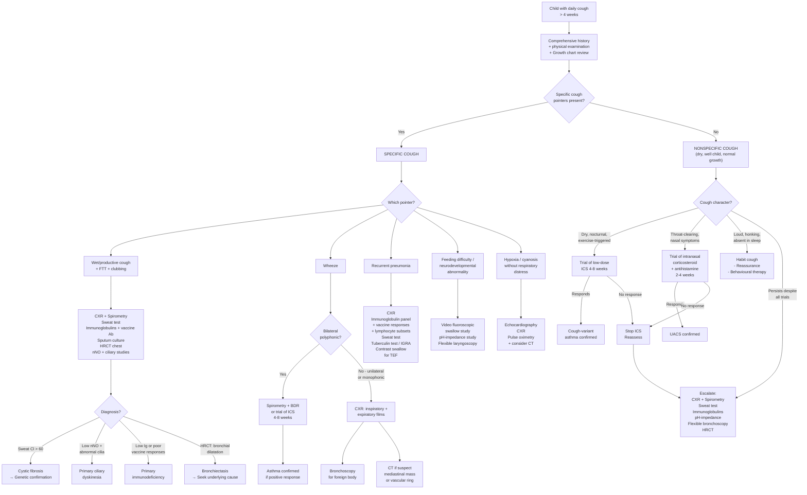

## Diagnostic Criteria for Chronic Cough in Children

### The Core Challenge

There is **no single diagnostic criterion** or scoring system for "chronic cough" itself in paediatrics — unlike, say, the Jones criteria for rheumatic fever. Instead, chronic cough is a **presenting symptom** that demands a **systematic algorithmic approach** to identify the underlying aetiology. The diagnosis of chronic cough is therefore the diagnosis of its **cause**.

That said, there are two critical definitional thresholds and one key classification that serve as entry criteria into the diagnostic pathway:

### Definitional Criteria

| Guideline | Criterion | Notes |
|---|---|---|
| ***ACCP (Chest 2006)*** | ***Daily cough lasting > 4 weeks in a child < 15 years*** [1] | Most widely used in paediatric practice; chosen because most post-viral coughs resolve within 1–3 weeks |
| ***BTS (Thorax 2007)*** | ***Cough lasting > 8 weeks*** [1] | Recognises a ***'grey' area of 'subacute cough' between 2–8 weeks*** |

### Classification Criteria (First Branch Point)

***The BTS subdivides chronic cough into*** [1]:
- ***Specific cough***: cough with signs and symptoms suggestive of an associated problem
- ***Nonspecific cough***: dry cough in absence of an identifiable respiratory disease of known aetiology

This classification is the **single most important branch point** in the diagnostic algorithm. It determines whether the child needs immediate targeted investigation or can be managed with watchful waiting ± empirical trials.

### Diagnostic Criteria for Specific Aetiologies

Since "chronic cough" is a symptom, each underlying diagnosis has its own diagnostic criteria. Here are the key ones you must know:

#### 1. Protracted Bacterial Bronchitis (PBB)

PBB is a **clinical diagnosis** — there is no blood test or imaging finding that confirms it. The diagnostic criteria (Chang et al., updated 2017–2024) are:

| Criterion | Details |
|---|---|
| Chronic wet cough | > 4 weeks duration |
| Absence of specific cough pointers | No FTT, clubbing, chest deformity, recurrent pneumonia, etc. |
| Resolution with antibiotics | Cough resolves with **2–4 weeks of appropriate oral antibiotics** (amoxicillin-clavulanate) |

- **Why is antibiotic response part of the criteria?** Because there is no readily available non-invasive test to confirm lower airway bacterial infection in children. Bronchoalveolar lavage (BAL) showing > 10⁴ CFU/mL of a single pathogen is the gold standard, but this is invasive and not routinely performed. The antibiotic response serves as a pragmatic diagnostic–therapeutic trial.
- **Recurrent PBB** ( > 3 episodes/year) should trigger investigation for underlying predisposing conditions (CF, PCD, immunodeficiency, bronchiectasis).

#### 2. Asthma / Cough-Variant Asthma

***Predominantly clinical diagnosis based on compatible history ± physical examination*** [6]:
- ***History: variable symptoms of wheezes, cough, chest tightness, SOB, especially worse at night/waking and triggered by exercise, laughter, allergens, cold air and viral infections*** [6]
- ***Physical examination: characteristic widespread, polyphonic wheezes during attacks, but normal finding between attacks*** [6]

***Confirmed by variable expiratory airflow limitation*** [6]:
- ***≥1 instance of reduced FEV1/FVC, i.e. ≤75% in adults, ≤90% in children*** [6]
- ***Excessive variability in lung function*** [6]:
  - *** > 12% and 200 mL increase in FEV1 after bronchodilator*** [6]
  - *** > 10% diurnal variability in twice-daily PEF over 2 weeks*** [6]
  - *** > 10% and > 200 mL decrease in FEV1 after exercise*** [6]

For **cough-variant asthma** specifically:
- Cough as the sole/predominant symptom, spirometry may be normal between episodes
- **Therapeutic trial of ICS** (4–8 weeks) with resolution of cough supports the diagnosis
- If old enough for testing: positive bronchial provocation test (methacholine challenge) with ≥ 20% fall in FEV1

<Callout title="Spirometry in Young Children" type="error">
Spirometry is generally **not reliably performable until age 5–6 years**. In younger children, the diagnosis of asthma is largely clinical — based on pattern recognition (episodic wheeze with triggers, atopic background, diurnal variation, response to bronchodilators). In children aged 2–5 years, the Asthma Predictive Index (API) can help predict which wheezing preschoolers will develop persistent asthma: 1 major criterion (parental asthma or eczema) or 2 minor criteria (allergic rhinitis, wheezing apart from colds, eosinophilia ≥ 4%) in a child with ≥ 3 wheezing episodes.
</Callout>

#### 3. Cystic Fibrosis (CF)

***Diagnostic approach*** [7]:
- ***Newborn blood test for screening: positive if elevated immunoreactive trypsinogen (IRT) → proceed to genetic test*** [7]
- ***Sweat test: gold standard*** [7]
  - ***Procedure: apply low voltage current and pilocarpine to skin → collect sweat*** [7]
  - ***Positive: elevated sweat chloride concentration ( > 60 mmol/L)*** [7]
- ***Genetic test for CFTR mutation*** [7]

The diagnosis requires **clinical features consistent with CF** plus **at least one** of:
- Sweat chloride ≥ 60 mmol/L on two occasions
- Two disease-causing CFTR mutations identified
- Abnormal nasal potential difference measurement

#### 4. Primary Ciliary Dyskinesia (PCD)

Diagnosis is challenging and often delayed (mean diagnostic age ~5 years). The European Respiratory Society (ERS) diagnostic guideline uses a **combination** of:
- Clinical phenotype (chronic wet cough from neonatal period, neonatal respiratory distress in a term infant, situs abnormality, chronic rhinosinusitis, recurrent otitis media)
- **Nasal nitric oxide (nNO)**: Characteristically **very low** ( < 77 nL/min) — screening test. Why? Normal ciliated epithelium produces NO via constitutive NOS in paranasal sinuses; dysmotile cilia → impaired sinus ventilation → trapped NO → paradoxically low nasal NO levels.
- **High-speed video microscopy (HSVM)**: Visualises ciliary beat pattern and frequency from nasal brushing
- **Transmission electron microscopy (TEM)**: Demonstrates ultrastructural ciliary defects (absent outer/inner dynein arms, radial spoke defects) — but ~30% of PCD patients have normal ultrastructure
- **Genetic testing**: Identifies biallelic pathogenic variants in PCD-associated genes (e.g., DNAH5, DNAI1)

#### 5. Habit/Psychogenic Cough

Diagnosis of **exclusion** — no specific test. Key diagnostic criteria:
- Loud, barking/honking, repetitive dry cough
- **Completely absent during sleep** (pathognomonic)
- Normal examination and investigations
- Not responsive to bronchodilators, ICS, or antibiotics
- Often in school-age children, may be stress-related

---

## Diagnostic Algorithm

### Step-by-Step Approach

***All children with chronic cough should have thorough clinical review to identify possible underlying respiratory and/or systemic illness*** [1].

***Importance of history and physical examination*** [1].

The algorithm proceeds in a logical sequence:

**Step 1**: Confirm chronicity — is cough truly > 4 weeks?

**Step 2**: Take a **comprehensive history and examination** to classify as specific vs nonspecific cough.

**Step 3**: If specific cough pointers present → targeted investigations based on the pointer.

**Step 4**: If nonspecific cough → consider empirical trials (ICS for suspected cough-variant asthma, intranasal corticosteroid for UACS) → if no response, escalate investigations.

**Step 5**: ***Cough treatment should be based on aetiology*** [1].

### Mermaid Diagnostic Algorithm

---

## Investigation Modalities: Key Findings and Interpretations

### Baseline Investigations (For ALL Children with Chronic Cough)

***Most children with cough due to a simple URI do not need any investigations*** [10]. However, once cough is chronic ( > 4 weeks), a **minimum workup** is warranted.

#### 1. Chest X-Ray (CXR)

***A CXR should be considered in the presence of*** [10]:
- ***Lower respiratory tract signs*** [10]
- ***Relentlessly progressive cough (e.g., past 2-week point)*** [10]
- ***Haemoptysis*** [10]
- ***An undiagnosed chronic respiratory disorder*** [10]

**Why CXR?** It is cheap, widely available, and low radiation. It serves primarily to **exclude** serious pathology rather than to make a specific diagnosis.

| Finding | Interpretation | Points Towards |
|---|---|---|
| Normal | Reassuring but does not exclude asthma, PBB, UACS, early CF, PCD | Nonspecific cough pathway |
| ***Hyperinflation*** | Air trapping — ↑ lung volume, flattened diaphragms, > 6 anterior ribs visible above diaphragm | Asthma, CF, foreign body (if unilateral — compare inspiratory and expiratory films!) |
| ***Lobar collapse*** | ***Secondary to mucus obstruction*** [5] or foreign body → complete bronchial obstruction → reabsorption atelectasis | Asthma (mucus plug), foreign body, endobronchial lesion |
| Consolidation (recurrent, same lobe) | Persistent or recurrent infection in one anatomical location | Foreign body (lodged in bronchus), congenital anomaly (sequestration, CPAM), bronchiectasis |
| Consolidation (recurrent, different lobes) | Impaired host defence or aspiration | Immunodeficiency, aspiration syndrome |
| ***Tram-line shadows / ring shadows*** | ***Dilated bronchi seen on side (tram-lines) or end-on (ring shadows)*** [6][11] | Bronchiectasis |
| Perihilar lymphadenopathy | Hilar/mediastinal lymph node enlargement | TB (primary complex), lymphoma, sarcoidosis |
| Cardiomegaly / pulmonary plethora | ↑ cardiothoracic ratio; ↑ pulmonary vascular markings (upper lobe diversion) | Congenital heart disease with left-to-right shunt, heart failure [12] |
| Dextrocardia | Heart apex on right | PCD (Kartagener syndrome) — if situs inversus totalis |
| Mediastinal widening | Mediastinal mass | Lymphoma, neuroblastoma, thymoma |

<Callout title="Inspiratory vs Expiratory Films for Foreign Body" type="idea">
In a cooperative child ( > 2–3 years), request **paired inspiratory and expiratory CXR**. On expiration, the normal lung deflates while the obstructed lung remains hyperinflated (ball-valve mechanism) → mediastinal shift **away** from the affected side on expiration. In infants/toddlers who cannot cooperate, **bilateral decubitus films** can substitute: the dependent (down) lung normally deflates; if it stays hyperinflated, suspect foreign body obstruction on that side.
</Callout>

#### 2. Blood Tests

***Other investigations depending on your differential diagnosis, e.g.,*** [10]:
- ***CBC and differentials*** [10]

| Test | Key Findings | Interpretation |
|---|---|---|
| ***CBC with differentials*** | Eosinophilia ( > 4% or > 0.4 × 10⁹/L) | Atopic disease (asthma, allergic rhinitis), parasitic infection, eosinophilic oesophagitis |
| | Lymphopenia | Combined immunodeficiency (SCID in infants), HIV |
| | Neutropenia | Congenital neutropenia, cyclical neutropenia → recurrent bacterial infections |
| | Anaemia (microcytic, iron-deficiency) | Pulmonary haemosiderosis (chronic alveolar haemorrhage → iron loss) |
| | Thrombocytosis | Reactive — chronic infection/inflammation |
| **Total IgE** | Elevated for age | Atopy (supports asthma diagnosis but not specific) |
| **Specific IgE / Skin prick test** | Positive to aeroallergens (house dust mite, cat, dog, cockroach, Alternaria) | Identifies allergic sensitisation — relevant for asthma and allergic rhinitis management |
| **Immunoglobulin panel (IgG, IgA, IgM, IgG subclasses)** | Low IgG, IgA, or IgM; low IgG subclasses | Primary immunodeficiency (CVID, X-linked agammaglobulinaemia, IgA deficiency) |
| **Vaccine antibody responses** | Poor response to protein (tetanus) or polysaccharide (pneumococcal) antigens despite vaccination | Specific antibody deficiency or broader humoral immunodeficiency |
| **Lymphocyte subsets** (CD3, CD4, CD8, CD19, CD16/56) | Low T cells, B cells, or NK cells | Combined immunodeficiency, DiGeorge syndrome |

#### 3. Microbiological Investigations

***Nasopharyngeal aspirates for common viruses and Mycoplasma*** [10].
***Sputum for Gram stain and culture if old enough*** [10].
***Blood culture has low detection rate even if bacterial aetiology*** [10].

| Test | Method | Key Findings | Interpretation |
|---|---|---|---|
| NPA for respiratory viruses | Immunofluorescence or PCR multiplex panel | RSV, rhinovirus, influenza, parainfluenza, adenovirus, HMPV, bocavirus | Identifies post-viral aetiology; adenovirus → risk of bronchiolitis obliterans |
| NPA / sputum for *Bordetella pertussis* | Culture (gold standard but slow) or PCR (rapid, preferred) | Positive PCR or culture | Pertussis — even in vaccinated children (waning immunity) |
| Sputum culture | Standard culture + sensitivity | *H. influenzae*, *S. pneumoniae*, *M. catarrhalis*, *S. aureus*, *P. aeruginosa* | PBB (non-typeable *H. influenzae* commonest); *S. aureus* and *P. aeruginosa* raise concern for CF |
| Induced sputum for AFB | ZN stain + mycobacterial culture ± PCR (GeneXpert) | AFB positive; *Mycobacterium tuberculosis* on culture | TB — always consider in Hong Kong; **gastric aspirate** (3 early morning samples) preferred in young children who cannot expectorate |
| ***Mycoplasma*** serology or PCR | IgM antibodies or NPA PCR | Positive | *Mycoplasma pneumoniae* — common cause of prolonged cough in school-age children |

---

### Targeted Investigations (Guided by Clinical Suspicion)

#### 4. Spirometry and Lung Function Tests

- Reliably performable from **age 5–6 years** onwards (some children can cooperate from age 4 with coaching).
- ***Confirmed variable expiratory airflow limitation*** [6]:
  - ***≥1 instance of FEV1/FVC ≤90% in children*** (note: paediatric cut-off is higher than adult 75%) [6]
  - ***Bronchodilator reversibility (BDR): > 12% and > 200 mL increase in FEV1 after inhaled SABA*** [6]

| Test | Key Findings | Interpretation |
|---|---|---|
| **Spirometry** (pre- and post-bronchodilator) | ↓ FEV1/FVC with positive BDR | Asthma — variable airflow obstruction |
| | ↓ FEV1/FVC **without** significant BDR | Fixed obstruction — bronchiectasis, bronchiolitis obliterans, CF |
| | Normal spirometry | Does not exclude asthma (may be normal between episodes); consider bronchial provocation test |
| ***Flow-volume loop*** | ***'Scooped out' concave expiratory limb*** [5] | ***Diffuse intrathoracic airflow obstruction*** — asthma, COPD |
| | Flattened inspiratory limb (expiratory plateau) | ***Upper airway obstruction*** — variable extrathoracic (e.g., vocal cord dysfunction) [5] |
| | Fixed truncation of both loops | Fixed large airway obstruction (e.g., tracheal stenosis, vascular ring) |
| **Peak expiratory flow (PEF) diary** | *** > 10% diurnal variability over 2 weeks*** [6] | Supports asthma diagnosis |
| **Bronchial provocation test** (methacholine, exercise, mannitol) | *** ≥20% fall in FEV1 post-methacholine*** [6]; *** > 10% and > 200 mL fall in FEV1 post-exercise*** [6] | Airway hyper-responsiveness — asthma. ***Not routinely done (only when lung function at rest is normal)*** [6] |

<Callout title="Why FEV1/FVC ≤ 90% in Children vs ≤ 75% in Adults?">
Children have highly elastic airways and a very efficient lung recoil system. A normal child can exhale most of their FVC in the first second. Therefore, the normal FEV1/FVC ratio in children is higher (~85–90%) than in adults (~75–80%). Using the adult cut-off of 75% would miss many children with genuine obstructive airways disease. Always use **age-appropriate reference equations** (e.g., GLI-2012 z-scores).
</Callout>

#### 5. Airway Inflammation Markers

| Test | Key Findings | Interpretation |
|---|---|---|
| ***Exhaled breath NO concentration (FENO)*** | *** > 35 ppb in children (ATS cut-off)*** suggests eosinophilic airway inflammation [5] | Supports atopic/eosinophilic asthma; ***associated with good short-term response to ICS*** (FENO > 50 ppb in adults) [6]. Can be performed from age ~5–6 years. |
| ***Sputum eosinophil count*** | *** > 2–3%*** [5] | Eosinophilic airway inflammation — supports asthma diagnosis |

- **Why is FENO useful in chronic cough workup?** FENO reflects Th2-driven eosinophilic inflammation in the airways. An elevated FENO in a child with chronic dry cough predicts response to ICS, effectively identifying cough-variant asthma non-invasively.
- **Pitfall**: FENO is lowered by recent corticosteroid use, smoking (irrelevant in children but relevant in adolescents), and certain foods. It is elevated in atopic individuals even without asthma.

#### 6. Sweat Test (for CF)

- ***Gold standard for CF diagnosis*** [7].
- ***Procedure: apply low voltage current and pilocarpine to skin → collect sweat via pilocarpine iontophoresis*** [7].
- **Interpretation**:

| Sweat Chloride (mmol/L) | Interpretation |
|---|---|
| < 30 | CF unlikely |
| 30–59 | Intermediate/borderline — requires further evaluation (CFTR genetic testing, repeat sweat test) |
| *** ≥60*** | ***Positive — diagnostic of CF*** [7] |

- Minimum sweat weight: ≥ 75 mg (or ≥ 15 μL) required for a valid test. In neonates, sweat may be insufficient — repeat at 2 weeks of age if initially inadequate.
- **Why pilocarpine?** Pilocarpine is a muscarinic cholinergic agonist that stimulates sweat glands. The iontophoresis drives the drug into the skin using a small electrical current. In CF, defective CFTR chloride channels in sweat duct epithelium fail to reabsorb chloride from sweat → elevated sweat chloride.

#### 7. Nasal Nitric Oxide (nNO) — Screening for PCD

- Nasal NO is measured during a breath-hold manoeuvre or tidal breathing using a chemiluminescence analyser.
- **Normal**: typically > 77 nL/min
- **PCD**: characteristically **very low** ( < 77 nL/min, often < 30 nL/min)
- **Why is nNO low in PCD?** NO is produced by constitutive NOS in the paranasal sinus epithelium. Normal ciliary function ventilates the sinuses → NO is continuously swept into the nasal cavity → high nNO. In PCD, dysmotile/absent cilia → impaired sinus ventilation → NO is trapped → paradoxically low nNO at the naris.
- **Limitations**: Also low in CF (blocked sinuses), acute sinusitis, and in young children who cannot perform the breath-hold. Therefore, nNO is a screening test — definitive diagnosis requires HSVM ± TEM ± genetics.

#### 8. High-Resolution CT Chest (HRCT)

Not a first-line investigation but essential when bronchiectasis, ILD, or structural anomaly is suspected.

| Finding | Interpretation |
|---|---|
| ***Bronchial dilatation (airway diameter > adjacent pulmonary artery — "signet ring sign"); tram-line shadows*** [6][11] | Bronchiectasis |
| Mucus plugging (tree-in-bud pattern) | Small airway disease — PBB, bronchiectasis, CF, PCD |
| Mosaic attenuation pattern on expiratory images | Air trapping — small airway disease (bronchiolitis obliterans, asthma) |
| Ground-glass opacification | Alveolar disease — pulmonary haemosiderosis, hypersensitivity pneumonitis, infection |
| Situs inversus + bronchiectasis | Kartagener syndrome (PCD) |

#### 9. Flexible Bronchoscopy ± Bronchoalveolar Lavage (BAL)

Indications in paediatric chronic cough:
- Suspected **foreign body** (rigid bronchoscopy preferred — both diagnostic AND therapeutic)
- Persistent/recurrent symptoms not responding to standard therapy
- Need for **BAL** microbiology (quantitative cultures — significant if > 10⁴ CFU/mL) and cytology (lipid-laden macrophages → aspiration; haemosiderin-laden macrophages → pulmonary haemosiderosis; eosinophils → eosinophilic lung disease)
- Assessment of **airway anatomy** (tracheomalacia, bronchomalacia, external compression)

| BAL Finding | Interpretation |
|---|---|
| Neutrophilic inflammation + positive bacterial culture > 10⁴ CFU/mL | Confirmed lower airway bacterial infection (PBB, bronchiectasis) |
| Lipid-laden macrophage index (LLMI) > 100 | Chronic aspiration |
| Haemosiderin-laden macrophages (positive Prussian blue stain) | Pulmonary haemosiderosis |
| Eosinophils > 1% of total cells | Eosinophilic airway disease |

#### 10. pH-Impedance Study / Upper GI Contrast

For suspected GORD-related cough:
- ***24-hour oesophageal pH monitoring: gold standard for acid reflux*** [13]. In children, a **combined pH-multichannel intraluminal impedance (pH-MII)** study is preferred because it detects both acid and non-acid reflux events and can correlate reflux episodes with cough events (symptom association probability).
- **Interpretation**: Reflux index (% time pH < 4) > 7% in infants or > 6% in older children suggests pathological acid reflux.
- **Upper GI contrast study**: Not for diagnosing GORD per se, but to exclude **structural anomalies** (malrotation, H-type TEF, vascular ring compressing oesophagus, hiatus hernia).

#### 11. Video Fluoroscopic Swallow Study (VFSS)

- Gold standard for assessing **swallowing function** in children with suspected aspiration.
- Involves feeding the child barium-containing liquid/food of varying consistencies under fluoroscopy.
- **Findings**: Penetration (material enters the laryngeal vestibule but stays above the vocal cords) vs aspiration (material passes below the vocal cords into the trachea). **Silent aspiration** (aspiration without cough reflex) occurs in up to 90% of aspirating children with neurodevelopmental abnormalities — this is why clinical observation of feeding alone is insufficient.

#### 12. Echocardiography

- Indicated if cough is associated with ***hypoxia/cyanosis → cardiac disease*** [1], heart murmur, failure to thrive, or CXR showing cardiomegaly/pulmonary plethora.
- Assesses for congenital heart defects (VSD, AVSD, PDA), pulmonary hypertension, and ventricular function.

#### 13. Tuberculin Skin Test (TST / Mantoux) or Interferon-Gamma Release Assay (IGRA)

- **TST**: Intradermal injection of 2 TU PPD-RT23 (or 5 TU PPD-S); read induration at 48–72 hours.
  - Positive: ≥ 5 mm (immunocompromised/close contact), ≥ 10 mm (high-risk groups including HK children), ≥ 15 mm (low-risk)
- **IGRA** (QuantiFERON-TB Gold, T-SPOT.TB): Measures IFN-γ release from T cells stimulated by TB-specific antigens (ESAT-6, CFP-10). Not affected by BCG vaccination — advantage over TST in BCG-vaccinated HK children.
- Neither test distinguishes latent from active TB — always combine with CXR and clinical assessment.

---

### Summary Table: Investigation by Suspected Aetiology

| Suspected Aetiology | First-Line Investigation | Second-Line / Confirmatory |
|---|---|---|
| **Asthma** | Spirometry + BDR; FENO; trial of ICS | Bronchial provocation test; allergy testing |
| **PBB** | Trial of amoxicillin-clavulanate 2–4 weeks | BAL if recurrent |
| **Foreign body** | CXR (inspiratory + expiratory) | Rigid bronchoscopy (diagnostic + therapeutic) |
| **CF** | Sweat test | CFTR genetic testing |
| **PCD** | Nasal NO | HSVM + TEM + genetic testing |
| **Immunodeficiency** | Immunoglobulins + vaccine responses + lymphocyte subsets | Specialist immunology workup |
| **GORD** | Empirical PPI trial (older children); pH-MII study | Upper GI contrast (exclude structural anomaly) |
| **Aspiration** | VFSS | Flexible laryngoscopy; BAL (LLMI) |
| **TB** | TST or IGRA + CXR | Gastric aspirate/induced sputum for AFB culture + GeneXpert |
| **Bronchiectasis** | HRCT chest | Investigate underlying cause (CF, PCD, PID) |
| **Habit cough** | Clinical diagnosis (absent in sleep) | Normal CXR, spirometry; exclusion of other causes |

---

<Callout title="High Yield Summary">

**No single diagnostic test for "chronic cough"** — the diagnosis is of the underlying cause.

**Every child with chronic cough needs at minimum**: thorough history and examination + growth chart review. ***CXR should be considered if lower respiratory tract signs, progressive cough, haemoptysis, or undiagnosed chronic respiratory disorder*** [10].

**First branch point**: Specific cough (red flags) → targeted investigations vs Nonspecific cough → empirical trials (ICS for asthma, antibiotics for PBB, intranasal steroid for UACS).

**Key diagnostic tests to know**:
- **Spirometry + BDR**: Asthma (FEV1/FVC ≤ 90% in children; > 12% reversibility)
- **Sweat test**: CF (Cl⁻ ≥ 60 mmol/L = diagnostic)
- **Nasal NO**: PCD screening ( < 77 nL/min)
- **FENO**: Eosinophilic airway inflammation ( > 35 ppb in children → predicts ICS response)
- **HRCT**: Bronchiectasis (signet ring sign, tram-lines)
- **Rigid bronchoscopy**: Foreign body (diagnostic AND therapeutic)
- **BAL**: Quantitative cultures > 10⁴ CFU/mL; lipid-laden macrophages (aspiration); haemosiderin-laden macrophages (pulmonary haemosiderosis)

**Age-specific considerations**: Spirometry from ~5–6 years. Sweat test valid from 2 weeks of age. Nasal NO requires cooperative child (usually > 5 years). In young children, clinical diagnosis predominates.

</Callout>

---

<ActiveRecallQuiz
  title="Active Recall - Diagnosis of Chronic Cough in Children"
  items={[
    {
      question: "What are the three diagnostic criteria for protracted bacterial bronchitis (PBB)?",
      markscheme: "(1) Chronic wet cough > 4 weeks, (2) Absence of specific cough pointers (no FTT, clubbing, etc.), (3) Resolution of cough with 2-4 weeks of appropriate oral antibiotics (amoxicillin-clavulanate). Common pathogens: non-typeable H. influenzae, S. pneumoniae, M. catarrhalis."
    },
    {
      question: "A child's spirometry shows FEV1/FVC of 85%. Is this normal? What cut-off is used in children vs adults?",
      markscheme: "In children, FEV1/FVC should be > 90% (higher than adults where > 75% is normal). FEV1/FVC of 85% in a child suggests obstructive airway disease. This is because children have highly elastic airways and efficient lung recoil, so normal ratio is higher. Use age-appropriate reference equations (GLI-2012 z-scores)."
    },
    {
      question: "What is the gold standard investigation for CF and what constitutes a positive result?",
      markscheme: "Sweat test (pilocarpine iontophoresis). Positive: sweat chloride >= 60 mmol/L. Intermediate: 30-59 mmol/L (needs further evaluation with CFTR genetic testing). Negative: < 30 mmol/L. Minimum sweat weight >= 75 mg for valid test. In CF, defective CFTR fails to reabsorb Cl- from sweat duct."
    },
    {
      question: "Why is nasal nitric oxide characteristically LOW in primary ciliary dyskinesia? What is the screening cut-off?",
      markscheme: "NO is produced by constitutive NOS in paranasal sinus epithelium. Normal cilia ventilate sinuses, sweeping NO into nasal cavity (high nNO). In PCD, dysmotile cilia impair sinus ventilation, trapping NO, so nNO measured at naris is paradoxically low. Screening cut-off: < 77 nL/min. Also low in CF and acute sinusitis (limitation)."
    },
    {
      question: "When should a CXR be performed in a child with cough, according to the lecture slides?",
      markscheme: "CXR should be considered in presence of: (1) lower respiratory tract signs, (2) relentlessly progressive cough (e.g., past 2-week point), (3) haemoptysis, (4) an undiagnosed chronic respiratory disorder. Most children with simple URI cough do NOT need investigations."
    },
    {
      question: "How do you use inspiratory and expiratory CXR films to diagnose foreign body aspiration in a child?",
      markscheme: "On expiration, the normal lung deflates but the obstructed lung remains hyperinflated due to ball-valve mechanism (air enters past FB on inspiration when bronchus dilates, but cannot escape on expiration). This causes mediastinal shift AWAY from the affected side on expiratory film. In infants who cannot cooperate, use bilateral lateral decubitus films instead (dependent lung should normally deflate; failure to deflate suggests ipsilateral obstruction)."
    }
  ]}
/>

## References

[1] Lecture slides: GC 141. A child with cough acute and chronic cough in children.pdf (p16, p20, p37)
[5] Senior notes: Adrian Lui Pediatrics.pdf (p172 — Asthma diagnosis and D/dx)
[6] Senior notes: Ryan Ho Respiratory.pdf (p98 — Asthma diagnosis; p109–110 — COPD approach)
[7] Senior notes: Adrian Lui Pediatrics.pdf (p182 — Cystic Fibrosis diagnosis)
[10] Lecture slides: GC 141. A child with cough acute and chronic cough in children.pdf (p14)
[11] Senior notes: Ryan Ho Respiratory.pdf (p46 — Bronchiectasis CXR/HRCT features); Ryan Ho Fundamentals.pdf (p239)
[12] Senior notes: Ryan Ho Cardiology.pdf (p73 — Acute decompensated HF CXR)
[13] Senior notes: felixlai.md (GERD diagnosis — ambulatory pH monitoring)
