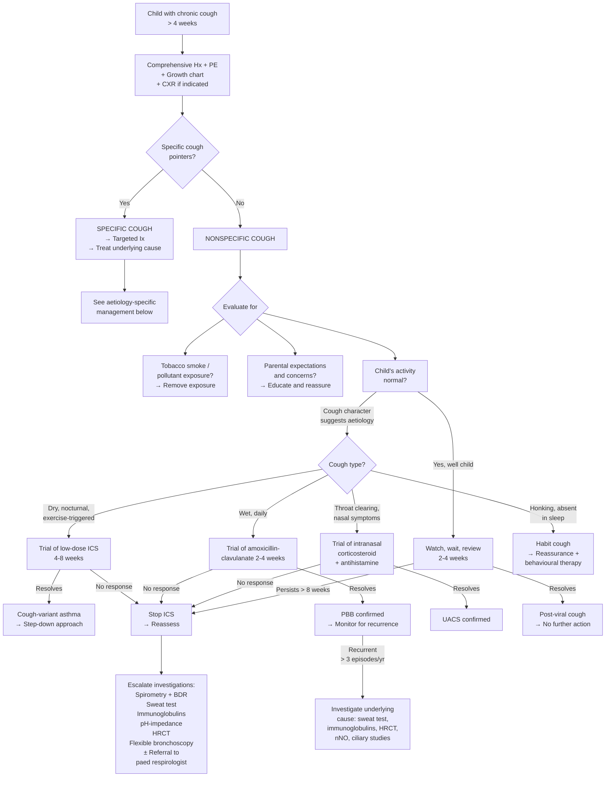

## Management of Chronic Cough in Children

### Overarching Principles

Before any treatment decision, these core principles from the lecture must be front and centre:

1. ***Cough is a symptom telling you something is wrong*** [1].
2. ***Find the cause*** [1].
3. ***Treat the underlying cause if indicated*** [1].
4. ***Cough treatment should be based on aetiology*** [1].
5. ***No evidence to support medicine for symptomatic relief*** [1].

This means the management of chronic cough in children is **not** about giving cough suppressants — it is about **diagnosing and treating the underlying condition**. The management algorithm is therefore an extension of the diagnostic algorithm: once you identify the cause, the treatment flows logically from the pathophysiology.

<Callout title="Critical Safety Point" type="error">
***The American Academy of Pediatrics (1997) issued recommendations*** [1]:
- ***There are no well-controlled scientific studies to support efficacy of codeine-containing and dextromethorphan-containing antitussives in children and indications for use have not been established*** [1].
- ***Suppression of cough in many pulmonary diseases may be hazardous and contraindicated. Cough due to acute viral infection is short-lived and can be treated with fluids and humidity*** [1].
- ***Dosages for children are extrapolated from adult data. Adverse effects and overdosage in children are reported*** [1].
- ***Education of parents about lack of proven effects and potential risks is needed*** [1].

***In 2006, the American College of Chest Physicians advised doctors to refrain from recommending cough suppressants and other 'over-the-counter' cough medications for young children*** [1].

**Codeine is contraindicated in children < 12 years** (FDA black box warning, updated 2013–2017) due to variable CYP2D6 metabolism — ultra-rapid metabolisers can convert codeine to morphine at dangerously high rates → fatal respiratory depression.
</Callout>

---

### Management Algorithm (Mermaid)

---

### General Management Measures (All Children)

These apply regardless of the underlying aetiology:

#### 1. Environmental Modification

- ***Evaluate for tobacco smoke and other pollutants*** [1].
- ***Prevalence of chronic cough in children < 11 years with 2 smoking parents is 50%*** [1] — this is a staggering statistic that underscores the importance of parental smoking cessation counselling.
- Remove/reduce indoor allergens (house dust mite covers, reduce humidity, remove carpets, cockroach control) — particularly relevant in Hong Kong's humid climate.
- Avoid known triggers (cold air, strong fumes, incense burning).

#### 2. Parental Education and Expectation Management

- ***Importance of education*** [1].
- ***Evaluate parental expectations and concerns*** [1].
- ***Educate parents about lack of proven effects and potential risks*** of OTC cough medicines [1].
- Explain that cough is a **protective reflex** — suppressing it can be harmful.
- Explain that young children have 6–8 URTIs per year, each with cough lasting 1–3 weeks → children in childcare may appear to cough continuously through winter.
- ***Cough due to acute viral infection is short-lived and can be treated with fluids and humidity*** [1].

#### 3. Watch, Wait, and Review

- ***Watch, wait and review: likely resolve without specific treatment*** [1].
- ***Absence of specific cough pointers*** → this approach is appropriate [1].
- Re-evaluate at 2–4 weeks. If cough persists beyond 8 weeks total or new features emerge, escalate.

---

### Aetiology-Specific Management

***Very diverse treatment: bronchodilator, surgery, antibiotics, anti-TB, anti-fungal, stop smoking etc.*** [1].

#### 1. Asthma / Cough-Variant Asthma

This is the most common cause of chronic cough in school-age children in Hong Kong and the condition with the most detailed stepwise management.

**A. Aims of Asthma Management** [5]:
- ***Complete control*** [5]:
  - ***No attacks, A&E visits, hospitalisation*** [5]
  - ***No or minimal symptoms*** [5]
  - ***No limitation of activity*** [5]
  - ***Normal or near-normal lung function*** [5]

**B. Assessment of Asthma Control** [5]:
- ***Two domains*** [5]:
  - ***Symptom control: daytime asthma symptoms and reliever use ≤ 2×/week + no night waking + no activity limitation*** [5]
  - ***Risk assessment: based on risk factors for exacerbation, fixed airflow limitation and medication side effects*** [5]

**C. Stepwise Management (GINA 2024, Adapted for Children 6–11 Years)**

| Step | Controller | Reliever | Indications |
|---|---|---|---|
| **Step 1** | As-needed low-dose ICS-formoterol **OR** low-dose ICS whenever SABA taken | SABA as needed (or ICS-formoterol as needed) | Symptoms < 2×/month |
| **Step 2** | **Daily low-dose ICS** | SABA as needed (or ICS-formoterol as needed) | Symptoms ≥ 2×/month but < daily |
| **Step 3** | **Low-dose ICS + LABA** (or medium-dose ICS) | SABA as needed | Daily symptoms or waking ≥ 1×/week |
| **Step 4** | **Medium-dose ICS + LABA** (± add-on: LTRA, tiotropium) | SABA as needed | Persistent symptoms on Step 3 |
| **Step 5** | Refer to specialist: **High-dose ICS + LABA** ± add-on (tiotropium, anti-IgE [omalizumab], anti-IL5 [mepolizumab], low-dose OCS) | SABA as needed | Severe uncontrolled asthma |

- ***Severity of asthma is assessed retrospectively from the level of treatment required to control symptoms and exacerbation*** [5]:
  - ***Mild asthma: well-controlled with Steps 1 or 2*** [5]
  - ***Moderate asthma: well-controlled with Step 3*** [5]
  - ***Severe asthma: well- or poorly controlled with Steps 4 or 5*** [5]

**Key Paediatric Considerations**:
- **Children ≤ 5 years**: Use low-dose ICS via **metered-dose inhaler (MDI) + spacer + face mask** (remove face mask once child can seal lips around mouthpiece, usually ~4 years). LABA not licensed < 4 years in many jurisdictions.
- **ICS dosing in children (6–11 years)**: Low dose = budesonide 100–200 μg/day or fluticasone propionate 50–100 μg/day. These are **half** the adult doses.
- **Why ICS?** Inhaled corticosteroids are the **most effective anti-inflammatory therapy** for asthma. They suppress Th2-mediated eosinophilic inflammation, reduce mucosal oedema, decrease mucus production, and reverse airway remodelling. "Cortico-" = cortex (adrenal), "steroid" = cholesterol-derived ring structure.
- **Why LABA as add-on?** Long-Acting Beta-2 Agonists (β₂ = type of adrenergic receptor on bronchial smooth muscle) → cAMP ↑ → smooth muscle relaxation → bronchodilation lasting 12 hours. LABA should **never** be used as monotherapy (without ICS) in asthma — this increases risk of asthma-related death. The combination ICS-LABA is synergistic: LABA enhances glucocorticoid receptor nuclear translocation, and ICS upregulates β₂-receptor expression.
- **LTRA (Leukotriene Receptor Antagonist)**: Montelukast ("monte" = mountain, named for Montreal where leukotrienes were discovered at a "mont" research institute). Blocks CysLT1 receptor → reduces bronchoconstriction, mucus secretion, and eosinophil recruitment. Useful as add-on or alternative to low-dose ICS in mild asthma. Paediatric formulation: 4 mg chewable tablet (2–5 years), 5 mg (6–14 years).
  - **FDA warning (2020)**: Serious neuropsychiatric events (agitation, depression, suicidality) reported → discuss with families, use only if benefits outweigh risks.

**D. Cough-Variant Asthma — Specific Management**:
- **Diagnostic-therapeutic trial**: Low-dose ICS for 4–8 weeks.
- If cough resolves → diagnosis confirmed → continue ICS at lowest effective dose, reassess in 3 months, consider step-down.
- If cough does not resolve → stop ICS, reconsider diagnosis.

**E. Acute Asthma Exacerbation in Children** [14]:
- **Oxygen**: to maintain SpO₂ 94–98%.
- **Salbutamol (SABA)**: nebulised 2.5 mg (< 5 years) or 5 mg (≥ 5 years) driven by oxygen, every 20 min for first hour.
- **Ipratropium bromide**: nebulised 250 μg (< 5 years) or 500 μg (≥ 5 years) every 20 min for first hour — add if poor response to SABA. Why? Ipratropium is an antimuscarinic (blocks M3 receptors on bronchial smooth muscle → prevents acetylcholine-mediated bronchoconstriction). It works via a different pathway to SABA → additive bronchodilation.
- **Systemic corticosteroids**: **Prednisolone 1–2 mg/kg/day (max 40 mg)** PO for 3–5 days, or IV hydrocortisone if unable to take PO. Why early steroids? They take 4–6 hours to take effect (genomic mechanism: enter nucleus → alter gene transcription → ↓ inflammatory mediator synthesis). Starting early shortens the exacerbation.
- **IV magnesium sulphate**: 40 mg/kg (max 2 g) over 20 min — for severe/life-threatening exacerbations not responding to initial therapy. MoA: smooth muscle relaxation via calcium antagonism + inhibition of acetylcholine release from nerve terminals.
- **Aminophylline IV**: Rarely used, only in PICU setting for life-threatening asthma unresponsive to above.

#### 2. Protracted Bacterial Bronchitis (PBB)

| Aspect | Details |
|---|---|
| **First-line treatment** | **Amoxicillin-clavulanate** (amoxicillin 40–50 mg/kg/day divided BD-TDS) for **2–4 weeks** |
| **Why amoxicillin-clavulanate?** | Covers the three commonest PBB pathogens (non-typeable *H. influenzae*, *S. pneumoniae*, *M. catarrhalis*) including β-lactamase producers. Clavulanate is a β-lactamase inhibitor → prevents enzymatic degradation of amoxicillin. |
| **Expected response** | Cough should resolve within 2 weeks of starting antibiotics |
| **If incomplete response** | Extend course to 4 weeks |
| **Recurrent PBB (> 3 episodes/year)** | Must investigate for underlying predisposing condition: sweat test (CF), immunoglobulins + vaccine responses (immunodeficiency), HRCT (bronchiectasis), nNO + ciliary studies (PCD) |
| **Why does PBB matter?** | Untreated PBB can progress to bronchiectasis — the "PBB-to-bronchiectasis" continuum. Early treatment may prevent irreversible airway damage. |
| **Contraindications** | Amoxicillin-clavulanate: penicillin allergy (use azithromycin or co-trimoxazole as alternatives). High-dose clavulanate → GI side effects (diarrhoea — explain to parents). |

#### 3. Upper Airway Cough Syndrome (UACS) / Post-Nasal Drip

| Aspect | Details |
|---|---|
| **Allergic rhinitis** (most common underlying cause in HK) | **Intranasal corticosteroid** (mometasone or fluticasone furoate, 1 spray each nostril daily from age 2+) + **non-sedating antihistamine** (cetirizine 5 mg/day for 2–5 years, 10 mg/day for ≥ 6 years). Allergen avoidance measures. |
| **Why intranasal steroid?** | Directly suppresses mucosal Th2 inflammation in the nasal cavity → ↓ mucus production → ↓ post-nasal drip → ↓ cough receptor stimulation. |
| **Chronic rhinosinusitis** | Prolonged course of intranasal corticosteroids (≥ 12 weeks) ± saline nasal irrigation. Antibiotics only if acute bacterial exacerbation. |
| **Expected response** | Cough should improve within 2–4 weeks of starting treatment |

#### 4. Gastro-Oesophageal Reflux Disease (GORD)

| Age Group | Management |
|---|---|
| **Infants** | Lifestyle: upright positioning after feeds (30 minutes), smaller but more frequent feeds, thickened feeds. Anti-regurgitation formula (contains pre-gelatinised starch or carob bean gum). If not responsive: trial of **alginate** (Gaviscon Infant — forms a raft on top of gastric contents, reducing reflux). PPI/H2RA only if confirmed oesophagitis or significant complications. |
| **Older children and adolescents** | Lifestyle: weight management if obese, avoid late-night eating, elevate head of bed. **Trial of PPI** (omeprazole 1 mg/kg/day, max 20 mg, for 4–8 weeks) if GORD-related cough suspected. |
| **Why PPI?** | Proton Pump Inhibitor irreversibly blocks H⁺/K⁺-ATPase (the "proton pump") on gastric parietal cells → ↓ gastric acid production → ↓ acid reflux → ↓ stimulation of oesophageal vagal afferents → ↓ cough. |
| **Caution with PPI in children** | Long-term PPI use associated with ↑ risk of Clostridioides difficile infection, community-acquired pneumonia, and potentially ↓ calcium/magnesium absorption. Use the lowest effective dose for the shortest duration. |
| **Surgical (fundoplication)** | Rarely indicated in children. Reserved for severe GORD unresponsive to maximal medical therapy, especially in neurologically impaired children with chronic aspiration. Laparoscopic Nissen (360°) or Toupet (posterior 270°) fundoplication [15]. |

#### 5. Foreign Body Aspiration

| Aspect | Details |
|---|---|
| **Treatment** | ***Surgery*** [1] — specifically, **rigid bronchoscopy under general anaesthesia** for retrieval. This is both diagnostic AND therapeutic. |
| **Why rigid (not flexible) bronchoscopy?** | Rigid bronchoscopy provides a larger working channel → ability to pass grasping forceps, optical forceps, or baskets to extract the foreign body. It also secures the airway during the procedure. Flexible bronchoscopy is used for diagnosis in ambiguous cases but is less effective for extraction. |
| **Timing** | Urgent but not necessarily emergent (unless acute respiratory distress). Should be performed as soon as experienced paediatric anaesthetist and ENT/respiratory surgeon are available. |
| **Post-extraction** | Repeat CXR to confirm resolution. Short course of antibiotics if secondary infection. Follow-up spirometry if old enough. |
| **Contraindications to delay** | Complete airway obstruction → emergent bronchoscopy. If child is asymptomatic/stable → can plan for elective bronchoscopy. |

#### 6. Cystic Fibrosis (CF)

***Management of CF is multidisciplinary and lifelong*** [7]:

| Domain | Treatment | Details |
|---|---|---|
| **Respiratory** | ***Chest physiotherapy twice daily*** [7] | ***Postural drainage, controlled deep breathing exercise*** [7]. Aim: mobilise thick secretions from distal to proximal airways. Even infants benefit from modified physiotherapy. |
| | ***Nebulised mucolytics*** [7] | ***DNase (dornase alfa), hypertonic saline*** [7]. DNase breaks down extracellular DNA from degraded neutrophils in sputum → ↓ sputum viscosity. "Dornase" = DNA + -ase (enzyme). Hypertonic saline (7%) draws water osmotically into airway lumen → rehydrates airway surface liquid → improves mucociliary clearance. |
| | ***Bronchodilator*** [7] | SABA pre-physiotherapy or pre-hypertonic saline to prevent bronchoconstriction. |
| | ***Oral/IV antibiotics for respiratory infections*** [7] | Guided by regular sputum cultures. Early infections: anti-staphylococcal (flucloxacillin prophylaxis in some centres). Late colonisation: anti-pseudomonal (ciprofloxacin PO, or IV piperacillin-tazobactam + tobramycin for exacerbations). |
| | ***Bilateral lung transplant for end-stage lung disease*** [7] | When FEV₁ < 30% predicted and rapidly declining despite maximal therapy. |
| **Nutrition** | ***Pancreatic enzyme replacement therapy*** [7] | ***Oral enteric-coated (e.g., Creon)*** [7] — taken with every meal and snack. Dose titrated to fat content of meals. Enteric coating protects enzymes from gastric acid → released in duodenum. |
| | ***Fat-soluble vitamin supplementation*** [7] | ***Vitamins A, D, E, K*** [7]. Why? Pancreatic insufficiency → fat malabsorption → deficiency of fat-soluble vitamins (they dissolve in dietary fat for absorption). |
| | ***Nutritional support ± gastrostomy feeding*** [7] | High-calorie diet (120–150% of normal requirements) because of ↑ metabolic demand from chronic infection + malabsorption. Gastrostomy if unable to meet caloric goals orally. |
| **CFTR Modulators** [7] | ***Potentiator: ivacaftor*** [7] | ***Enables CFTR protein at cell surface to function more effectively as chloride channel*** [7]. For gating mutations (e.g., G551D). |
| | ***Correctors: lumacaftor, tezacaftor, elexacaftor*** [7] | ***Help CFTR protein fold correctly and get to cell surface*** [7]. For the commonest mutation Phe508del. |
| | ***Triple therapy (2 correctors + 1 potentiator)*** [7] | ***Recent studies show excellent results*** [7]. **Elexacaftor-tezacaftor-ivacaftor (Trikafta/Kaftrio)**: transformational therapy, licensed from age 2 years for at least one Phe508del allele. Dramatically improves FEV₁, BMI, sweat chloride, and quality of life. |
| **General** | ***Avoid contact between CF patients*** [7] | ***To prevent cross-infection*** [7] — particularly with *Burkholderia cepacia* complex and multi-drug resistant *P. aeruginosa*. |
| | ***Monitor for complications*** [7] | CF-related diabetes (annual OGTT from age 10), liver disease, nasal polyps, DIOS, bone disease. |

#### 7. Primary Ciliary Dyskinesia (PCD)

| Aspect | Details |
|---|---|
| **Airway clearance** | Daily chest physiotherapy (similar principles to CF). No specific mucolytic has strong evidence in PCD, but hypertonic saline is often trialled. |
| **Antibiotics** | Aggressive treatment of lower respiratory infections to prevent bronchiectasis progression. Many centres use rotating or prophylactic oral antibiotics (e.g., azithromycin) similarly to bronchiectasis management [16]. |
| **ENT** | Chronic rhinosinusitis: saline nasal irrigation + intranasal steroids. Hearing aids for conductive hearing loss from chronic otitis media with effusion. Grommets (ventilation tubes) are **controversial** in PCD — some ENT surgeons avoid them because of persistent otorrhoea due to underlying mucociliary dysfunction. |
| **Monitoring** | Regular spirometry, sputum cultures, HRCT (to track bronchiectasis progression). |

#### 8. Bronchiectasis (Non-CF)

***Long-term management follows similar principles to CF respiratory management*** [16]:

| Component | Details |
|---|---|
| **Airway clearance** | Daily physiotherapy: postural drainage, active cycle of breathing, oscillating positive expiratory pressure devices (e.g., Flutter, Acapella). ***At least 10 min and up to 30 min or until 2 clear non-productive cough/huffs*** [16]. |
| **Long-term antibiotics** | ***Indication: usually ≥ 3 exacerbations per year*** [16]. ***Oral macrolides: first-line for non-Pseudomonas colonisers*** [16]. Azithromycin 10 mg/kg 3×/week (immunomodulatory dose). ***Inhaled antibiotics: first-line for Pseudomonas coloniser*** [16] — inhaled colistin or tobramycin (28 days on, 28 days off). |
| **Mucoactive agents** | Trial of nebulised hypertonic saline (7%) or DNase if difficulty with sputum clearance. |
| **Bronchodilators** | ***For patients with obstructive pattern on lung function test*** [16]. |
| **Vaccination** | Annual influenza + pneumococcal vaccination. |
| **Treat underlying cause** | CF, PCD, immunodeficiency, etc. |
| **Surgical** | Lobectomy considered if bronchiectasis is localised to one lobe and refractory to medical therapy, with significant symptom burden. Rarely needed in children. |

#### 9. Tuberculosis

- Paediatric TB treatment follows the same drug regimen as adults but with **weight-based dosing**:
  - **Intensive phase (2 months)**: Isoniazid (H) 10 mg/kg + Rifampicin (R) 15 mg/kg + Pyrazinamide (Z) 35 mg/kg + Ethambutol (E) 20 mg/kg (use E only if resistance suspected or HIV co-infection).
  - **Continuation phase (4 months)**: Isoniazid + Rifampicin.
- **Why 4 drugs?** Different drugs kill different TB subpopulations: H kills rapidly dividing bacilli, R kills semi-dormant "persisters" (sterilising activity), Z kills bacilli in acidic environments (within macrophages), E prevents resistance emergence.
- **Paediatric formulations**: Fixed-dose combination (FDC) tablets now available (WHO-endorsed child-friendly formulations with appropriate ratios). Dispersible tablets in water — much easier than crushing adult tablets.
- **Pyridoxine (vitamin B6) supplementation**: Give with isoniazid (especially in malnourished children, HIV co-infection, adolescents) — INH inhibits pyridoxine metabolism → risk of peripheral neuropathy.
- **Contact tracing**: Mandatory in Hong Kong. All household contacts of a TB case must be screened.

#### 10. Immunodeficiency

- **Specific management depends on the type of immunodeficiency** — refer to paediatric immunologist.
- **General principles**:
  - **Immunoglobulin replacement therapy** (IV or subcutaneous) for antibody deficiency (CVID, XLA, specific antibody deficiency) — typically every 3–4 weeks, targeting trough IgG > 5–8 g/L.
  - **Prophylactic antibiotics** (e.g., co-trimoxazole for PCP prophylaxis in T-cell deficiency).
  - **Haematopoietic stem cell transplantation (HSCT)**: Curative for severe combined immunodeficiency (SCID), chronic granulomatous disease, Wiskott-Aldrich syndrome, and other severe PIDs.
  - **Avoid live vaccines** in significant immunodeficiency (BCG, MMR, OPV, varicella, rotavirus, live influenza nasal spray).
  - **Aggressive treatment of infections** — lower threshold for antibiotics, cultures before treatment.

#### 11. Aspiration Syndromes

| Cause | Management |
|---|---|
| **Swallowing dysfunction (neurodevelopmental)** | Speech and language therapy assessment → modified diet textures (thickened fluids, pureed solids). Positioning during feeds (upright, chin tuck). Nasogastric or gastrostomy feeding if aspiration is severe/unsafe to feed orally. |
| **GORD-related aspiration** | As per GORD management above + consider fundoplication in neurologically impaired children with refractory aspiration. |
| **H-type tracheo-oesophageal fistula** | Surgical repair (thoracotomy or thoracoscopic division of fistula). |
| **Laryngeal cleft** | Endoscopic injection laryngoplasty (mild) or open surgical repair (severe). |

#### 12. Habit/Psychogenic Cough

| Aspect | Details |
|---|---|
| **Reassurance** | Explain to child and family that there is no serious underlying lung disease. The cough is real but not dangerous. |
| **Education** | Explain the concept of habit cough — like a nervous tic that has become self-perpetuating after the initial viral infection resolved. |
| **Behavioural therapy** | Suggestion therapy (e.g., "I am confident that your cough will stop within the next few days"), distraction techniques, cough suppression exercises (sip water when urge to cough arises), breathing retraining. |
| **Psychology/psychiatry referral** | If stress, anxiety, or school avoidance is a significant contributing factor. ***CBT: to target underlying health beliefs and expectations*** [17]. |
| **Medications** | ***Generally NOT indicated***. No role for cough suppressants, bronchodilators, ICS, or antibiotics. |

---

### What NOT to Do — Medications to Avoid

| Medication | Why NOT in Children |
|---|---|
| **Codeine** | ***Dosages for children are extrapolated from adult data. Adverse effects and overdosage in children are reported*** [1]. CYP2D6 ultra-rapid metabolisers → fatal respiratory depression. **Contraindicated < 12 years** (FDA, EMA). |
| **Dextromethorphan** | ***No well-controlled scientific studies to support efficacy*** [1]. Risk of serotonin syndrome, respiratory depression. |
| **OTC cough & cold medicines** | ***ACCP 2006 advised doctors to refrain from recommending cough suppressants and other 'over-the-counter' cough medications for young children*** [1]. These contain combinations of antihistamines, decongestants, and antitussives that are unproven in children and have caused fatalities. |
| **Honey** | Some evidence of mild symptomatic benefit in acute cough in children > 1 year — but **contraindicated in infants < 1 year** due to risk of infant botulism (*Clostridium botulinum* spores). |

---

### Summary: Treatment by Aetiology

| Aetiology | Key Treatment | Key Drug/Dose | Contraindications/Cautions |
|---|---|---|---|
| **Cough-variant asthma** | Trial of low-dose ICS 4–8 weeks | Fluticasone MDI 50 μg BD via spacer (children 5–11 y) | Oral candidiasis (rinse mouth after ICS), growth suppression with high doses |
| **PBB** | Amoxicillin-clavulanate 2–4 weeks | 40–50 mg/kg/day (amoxicillin component) BD–TDS | Penicillin allergy |
| **UACS** | Intranasal corticosteroid + antihistamine | Mometasone 50 μg 1 spray/nostril OD; cetirizine 5–10 mg OD | Epistaxis with nasal steroids |
| **GORD** | Lifestyle + PPI trial | Omeprazole 1 mg/kg/day (max 20 mg) 4–8 weeks | Long-term PPI: C. difficile, pneumonia risk |
| **Foreign body** | Rigid bronchoscopy | — | Do not delay if symptomatic |
| **CF** | Chest physio + mucolytics + enzymes + CFTR modulators | Elexacaftor-tezacaftor-ivacaftor (from age 2 y with ≥ 1 F508del) | Hepatotoxicity (monitor LFTs), drug interactions with CYP3A |
| **PCD** | Chest physio + aggressive antibiotics + ENT care | Azithromycin 10 mg/kg 3×/week for macrolide prophylaxis | Exclude NTM before starting macrolides |
| **TB** | HRZE (2 months) → HR (4 months) | Weight-based dosing with paediatric FDCs | Hepatotoxicity (all), optic neuritis (E — baseline visual acuity), hyperuricaemia (Z) |
| **Habit cough** | Reassurance + behavioural therapy | No medication | Do NOT give codeine/dextromethorphan |

---

<Callout title="High Yield Summary">

***Core principles***: Cough is a symptom → find the cause → treat the cause. No evidence for symptomatic cough medicines in children. Codeine and OTC cough medicines are contraindicated in young children.

**Nonspecific cough management**: Evaluate for smoke/pollutant exposure, educate parents, watch-wait-review. If persists: empirical trial of ICS (if dry/nocturnal → asthma), antibiotics (if wet → PBB), or intranasal steroid (if nasal symptoms → UACS).

**Asthma stepwise management**: Low-dose ICS is the cornerstone. Step up if uncontrolled (add LABA at Step 3). Step down after 3 months of good control. Severity classified retrospectively by treatment step needed.

**PBB**: Amoxicillin-clavulanate 2–4 weeks. If recurrent ( > 3/year) → investigate for CF, PCD, immunodeficiency.

**CF**: CFTR modulators (Trikafta/Kaftrio) are transformational. Plus daily chest physio, mucolytics (DNase, hypertonic saline), pancreatic enzymes, fat-soluble vitamins.

**Foreign body**: Rigid bronchoscopy under GA — diagnostic AND therapeutic.

**Habit cough**: Reassurance + behavioural therapy. No medications.

**Environmental**: Parental smoking cessation is critical — ***50% of children with 2 smoking parents have chronic cough***.

</Callout>

---

<ActiveRecallQuiz
  title="Active Recall - Management of Chronic Cough in Children"
  items={[
    {
      question: "Why are codeine-containing cough suppressants contraindicated in children under 12 years?",
      markscheme: "No well-controlled scientific studies support efficacy. Dosages extrapolated from adult data. CYP2D6 ultra-rapid metabolisers convert codeine to morphine at dangerously high rates causing fatal respiratory depression. FDA black box warning. AAP 1997 and ACCP 2006 guidelines advise against use."
    },
    {
      question: "Outline the stepwise management of asthma in a child aged 6-11 years. What defines asthma severity?",
      markscheme: "Step 1: As-needed low-dose ICS-formoterol or ICS when SABA taken. Step 2: Daily low-dose ICS. Step 3: Low-dose ICS + LABA or medium-dose ICS. Step 4: Medium-dose ICS + LABA plus add-ons (LTRA, tiotropium). Step 5: High-dose ICS + LABA plus specialist add-ons (anti-IgE, anti-IL5, low-dose OCS). Severity is assessed RETROSPECTIVELY from treatment step needed: mild = Step 1-2, moderate = Step 3, severe = Step 4-5."
    },
    {
      question: "A 3-year-old with chronic wet cough for 6 weeks is treated with amoxicillin-clavulanate for 2 weeks and the cough resolves. What is the diagnosis? What happens if this recurs more than 3 times per year?",
      markscheme: "Diagnosis: Protracted bacterial bronchitis (PBB). If recurrent (> 3 episodes/year), must investigate for underlying predisposing condition: sweat test (CF), immunoglobulins + vaccine responses (immunodeficiency), HRCT (bronchiectasis), nasal NO + ciliary studies (PCD). Untreated PBB can progress to bronchiectasis."
    },
    {
      question: "Name the three classes of CFTR modulators and give one example of each. What is the transformational triple therapy?",
      markscheme: "Potentiator: ivacaftor (enables CFTR protein at cell surface to function as chloride channel). Correctors: lumacaftor, tezacaftor, elexacaftor (help CFTR protein fold correctly and reach cell surface). Triple therapy: elexacaftor-tezacaftor-ivacaftor (Trikafta/Kaftrio) - 2 correctors + 1 potentiator. Licensed from age 2 years for at least one Phe508del allele."
    },
    {
      question: "What is the management approach for nonspecific cough in an otherwise well child with no specific cough pointers?",
      markscheme: "Evaluate for tobacco smoke and other pollutant exposure (prevalence of chronic cough 50% in children with 2 smoking parents). Assess child's activity level and parental expectations/concerns. Educate parents about natural history of cough and lack of evidence for OTC medicines. Watch, wait, and review - likely to resolve without specific treatment. If persists beyond 8 weeks, escalate with targeted empirical trials (ICS for suspected asthma, antibiotics for PBB, intranasal steroid for UACS) or further investigations."
    }
  ]}
/>

---

## References

[1] Lecture slides: GC 141. A child with cough acute and chronic cough in children.pdf (p16, p24, p28, p34, p37)
[5] Senior notes: Adrian Lui Pediatrics.pdf (p172 — Asthma assessment and management)
[7] Senior notes: Adrian Lui Pediatrics.pdf (p182 — Cystic Fibrosis management)
[14] Senior notes: Ryan Ho Critical Care.pdf (p13 — Acute severe asthma management)
[15] Senior notes: maxim.md (GERD surgical treatment — fundoplication)
[16] Senior notes: Ryan Ho Respiratory.pdf (p131–132 — Bronchiectasis long-term treatment)
[17] Senior notes: Ryan Ho Psychiatry.pdf (p204 — CBT for somatic symptom disorders)
