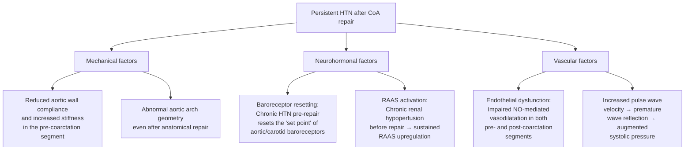

# Complications of Coarctation of the Aorta in Paediatrics

Complications of CoA can be divided into three main categories:

1. **Acute complications of the untreated/unrepaired CoA** (including complications of critical neonatal CoA)
2. **Complications of surgical or catheter-based intervention** (perioperative)
3. **Long-term complications** (even after successful repair)

Understanding these requires revisiting the pathophysiology: CoA is a mechanical obstruction that creates proximal hypertension and distal hypoperfusion. Even after the obstruction is relieved, the vascular damage from years of abnormal haemodynamics may be irreversible. This is why ***10-year survival is generally > 90%*** [2][3] but patients are never truly "cured" — they require **lifelong cardiovascular surveillance**.

---

## A. Acute Complications of Untreated/Unrepaired CoA

These arise from the direct haemodynamic consequences of the obstruction and are most dramatic in the neonatal period when the ductus closes.

### 1. Acute Heart Failure and Cardiogenic Shock (Neonatal)

| Feature | Pathophysiological Basis |
|---|---|
| ***Duct closure → acute ↑LV pressure → acute HF with shock + renal failure*** [2][3] | When the PDA closes, the LV suddenly faces an enormous afterload increase (the entire lower-body vascular resistance is concentrated at the coarctation). The neonatal LV, which has not had time to hypertrophy, cannot cope → acute decompensation with biventricular failure |
| Pulmonary oedema | Acute LV failure → elevated LV end-diastolic pressure → elevated LA pressure → elevated pulmonary venous pressure → fluid transudation into alveoli |
| Hepatomegaly | Back-pressure from LV failure → RV failure → hepatic venous congestion |

> ***Death within ≤1 week if tight stenosis*** and untreated [2][3]. This is the most feared acute complication and the reason critical CoA is a paediatric emergency.

### 2. Acute Kidney Injury (AKI)

| Feature | Pathophysiological Basis |
|---|---|
| ***Oliguria/anuria and rising creatinine*** | Kidneys lie distal to the CoA → acute renal hypoperfusion upon duct closure → pre-renal AKI → if prolonged, intrinsic renal injury (acute tubular necrosis) |
| ***Severe metabolic acidosis*** | ***Due to ischaemic colitis and AKI upon duct closure*** [2][3]. Both the gut and kidneys are hypoperfused → lactic acidosis from anaerobic metabolism in ischaemic tissues + impaired renal acid excretion |

### 3. Ischaemic Colitis / Necrotising Enterocolitis (NEC)

| Feature | Pathophysiological Basis |
|---|---|
| Abdominal distension, bloody stools, feeding intolerance | The mesenteric circulation is distal to the CoA → gut ischaemia upon duct closure. In severe cases this can progress to NEC (mucosal necrosis, pneumatosis intestinalis, perforation). This is a recognised neonatal complication of critical CoA |

### 4. Multi-Organ Failure

If untreated, the combination of cardiogenic shock, AKI, gut ischaemia, and metabolic acidosis leads rapidly to multi-organ failure and death.

---

## B. Complications of Intervention (Perioperative)

### Surgical Complications

| Complication | Mechanism | Incidence / Notes |
|---|---|---|
| **Paradoxical (post-coarctectomy) hypertension** | After relief of the obstruction, blood flow to the previously underperfused mesenteric vascular bed increases acutely → mesenteric arteritis. Simultaneously, baroreceptor resetting and sympathetic/RAAS activation cause a catecholamine surge → acute severe hypertension in the first 24–72 hours post-operatively | Common (seen in up to 50–80% in the immediate post-op period). Treated with short-acting IV antihypertensives (esmolol, nitroprusside). Can cause **abdominal pain** ("post-coarctectomy syndrome") |
| **Post-coarctectomy syndrome** | A specific manifestation of paradoxical HTN → acute mesenteric arteritis from sudden reperfusion of the mesenteric bed → abdominal pain, ileus, bowel wall oedema. Rarely progresses to bowel infarction | Typically resolves with BP control and bowel rest. More common after repair of severe, long-standing coarctation |
| **Recurrent laryngeal nerve palsy** | The left recurrent laryngeal nerve loops around the aortic arch/ligamentum arteriosum — it is at risk of injury during dissection of the coarctation site | Presents with hoarseness, weak cry in neonates, risk of aspiration. Usually temporary; permanent injury is rare |
| **Phrenic nerve injury** | The phrenic nerve runs along the mediastinum and can be injured during surgical dissection | Ipsilateral diaphragmatic paralysis → respiratory compromise, especially significant in neonates who are diaphragm-dependent breathers |
| **Chylothorax** | Injury to the thoracic duct (which runs in the posterior mediastinum near the aortic arch) during surgery → lymphatic fluid leaks into the pleural space | Presents as milky pleural effusion post-operatively. Managed with chest drainage, medium-chain triglyceride diet (bypasses lymphatic absorption), and rarely surgical thoracic duct ligation |
| **Spinal cord ischaemia (paraplegia)** | During aortic cross-clamping, the intercostal arteries that feed the anterior spinal artery (artery of Adamkiewicz, typically T9–T12) are temporarily occluded → spinal cord ischaemia | Very rare (< 0.5%) in paediatric CoA repair. Risk increases with prolonged cross-clamp time. Lower risk in neonates (shorter aorta, shorter clamp time). Patients with well-developed collaterals are relatively protected |
| **Wound infection / bleeding** | Standard surgical risks | Low incidence in experienced centres |

### Balloon Angioplasty / Stent Complications

| Complication | Mechanism |
|---|---|
| **Femoral artery injury** | Vascular access complications — the femoral artery in children is small and prone to spasm, dissection, or thrombosis. More common in younger/smaller patients |
| **Aortic wall dissection** | Balloon inflation may extend beyond the intima/media → aortic dissection at the intervention site |
| **Aneurysm formation at dilatation site** | Controlled tearing of the aortic wall by the balloon can weaken the wall → pseudoaneurysm or true aneurysm. Reported in 5–10% after balloon angioplasty. Requires long-term imaging surveillance |
| **Stent migration or fracture** | Mechanical failure of the stent over time, especially with growth and repeated dilatation |
| **In-stent restenosis** | Neointimal hyperplasia within the stent → recurrent narrowing |

---

## C. Long-Term Complications (Even After Successful Repair)

This is the most important section for clinical practice and exams. Even after "successful" repair with no residual gradient, patients with CoA are **not cured**. They carry lifelong risks that necessitate ongoing surveillance.

### ***Long-term outcome: 10-year survival generally > 90%*** [2][3]

### 1. ***Re-Coarctation*** [2][3]

| Feature | Detail |
|---|---|
| Definition | Recurrence of haemodynamically significant narrowing at or near the original coarctation/repair site |
| ***Incidence*** | ***Restenosis 5–15% after surgery; 40% (young infants) vs 8% (adolescents) after balloon angioplasty*** [2][3] |
| Mechanism | Scar tissue formation and fibrosis at the anastomotic site; residual ductal tissue; growth mismatch (the repaired segment may not grow proportionally with the child) |
| Detection | Regular echo follow-up; exercise testing may unmask a gradient not apparent at rest; MRI for definitive assessment |
| Treatment | ***Balloon angioplasty ± stent*** is the preferred first-line for re-coarctation [2][3]. Re-do surgery is reserved for failed catheter intervention or complex anatomy |

> **Why is re-coarctation more common in young infants?** (1) The aortic tissue in neonates is immature and more prone to elastic recoil and fibrosis. (2) Small vessel calibre means proportionally greater scar formation relative to lumen size. (3) Growth may outpace the repaired segment. (4) If repair involved ductal tissue, residual ductal tissue may constrict.

### 2. ***Persistent Hypertension*** [2][3]

| Feature | Detail |
|---|---|
| Definition | Systemic hypertension persisting or developing de novo after successful repair with no residual gradient |
| ***Incidence*** | ***Up to 25–30% of patients*** develop late/recurrent hypertension [2][3] |
| ***Mechanism*** | ***Systolic HTN may persist despite repair due to permanent alteration of arterial mechanics and physiology*** [2][3]. Specifically: |

The mechanisms of persistent hypertension deserve detailed explanation because they are commonly tested:

| Mechanism Category | Explanation |
|---|---|
| **Arterial wall stiffness** | The ascending aorta and arch were exposed to chronic supranormal pressures before repair → structural remodelling with increased collagen deposition and reduced elastin → permanent reduction in compliance. This increases pulse wave velocity and augments systolic pressure |
| **Baroreceptor resetting** | The carotid and aortic baroreceptors were chronically exposed to high BP → their "set point" for triggering sympatholytic responses shifts upward. Even after the mechanical obstruction is relieved, the baroreceptors continue to "accept" a higher BP as normal |
| **RAAS activation** | Chronic renal hypoperfusion (kidneys are distal to the CoA) → juxtaglomerular apparatus upregulation → sustained renin-angiotensin-aldosterone system activation. This may not fully reverse after repair |
| **Endothelial dysfunction** | Abnormal shear stress patterns both proximal and distal to the CoA cause chronic endothelial damage → impaired production of nitric oxide (the key endothelium-derived vasodilator) → impaired vasodilatory reserve |

> **Clinical implication**: Persistent hypertension is the **single biggest long-term risk factor** for cardiovascular morbidity and mortality in repaired CoA patients. It drives the development of premature atherosclerosis, LVH, heart failure, stroke, and aortic complications. Aggressive BP management is essential.

### 3. ***Aortic Aneurysm and Dissection*** [2][3]

| Feature | Detail |
|---|---|
| ***Sites*** | (1) At the repair site (especially after patch aortoplasty — now largely abandoned for this reason). (2) Ascending aorta (due to intrinsic aortopathy — the same connective tissue abnormality that caused the CoA affects the entire aortic wall) |
| ***Mechanism*** | - At repair site: weakening of the aortic wall from surgery or balloon dilatation → progressive dilatation → aneurysm → risk of dissection/rupture - Ascending aorta: the aortic wall has abnormal structure (deficient elastic fibres, increased collagen) → cystic medial necrosis-like changes → dilatation and dissection risk. This is worsened by chronic hypertension |
| ***Detection*** | Cardiac MRI is the gold standard for surveillance; should be performed every 3–5 years lifelong |
| ***Risk is higher in*** | Patients with ***bicuspid aortic valve*** (shared aortopathy), those with ***persistent hypertension***, and those who had patch aortoplasty |

<Callout title="Aortopathy in CoA – An Intrinsic Problem" type="idea">
CoA is not just a "local narrowing" — it is a manifestation of a **generalised aortopathy**. The entire aortic wall has abnormal histology (similar to that seen in bicuspid aortic valve aortopathy). This is why:
1. Aneurysms can form even in segments of the aorta that were never narrowed or surgically touched
2. The risk persists lifelong regardless of the quality of repair
3. Patients with CoA + BAV have additive risk
This concept is critical for understanding why lifelong surveillance is mandatory.
</Callout>

### 4. ***Ischaemic Heart Disease (IHD) and Stroke*** [2][3]

| Feature | Detail |
|---|---|
| ***Mechanism*** | ***Persistent hypertension → accelerated atherosclerosis*** → premature coronary artery disease and cerebrovascular disease. The chronic endothelial dysfunction and arterial stiffness in CoA patients further accelerate this process |
| ***Clinical relevance*** | Patients with repaired CoA have a significantly higher risk of cardiovascular events compared to the general population, even decades after repair. This is one of the leading causes of late mortality |
| ***Prevention*** | Aggressive BP control, lipid management, healthy lifestyle counselling (important even in adolescence) |

### 5. ***Berry Aneurysms with Rupture*** [2][3][4]

| Feature | Detail |
|---|---|
| ***Association*** | ***CoA is a known risk factor for intracranial (berry) aneurysms*** [2][3][4] |
| ***Mechanism*** | The same connective tissue/vascular wall abnormality that causes CoA predisposes to aneurysm formation at arterial bifurcations within the circle of Willis. Additionally, ***chronic upper-body hypertension increases haemodynamic stress on intracranial vessels*** → promotes aneurysm growth and rupture |
| ***Presentation*** | ***Subarachnoid haemorrhage (SAH) when ruptured*** [4] — sudden-onset severe headache ("thunderclap headache"), meningism, reduced consciousness |
| ***Screening*** | MRA of the head should be considered in older children, adolescents, and adults with CoA, particularly those with longstanding or poorly controlled hypertension |

> ***Berry aneurysms are usually at arterial bifurcations, majority along the circle of Willis, 90% in the anterior circulation*** [4]. Risk of rupture is related to aneurysm size and hypertension.

### 6. ***Arrhythmia*** [2][3]

| Feature | Detail |
|---|---|
| ***Types*** | Atrial fibrillation, atrial flutter, ventricular arrhythmias |
| ***Mechanism*** | (1) LVH from chronic pressure overload → myocardial fibrosis → arrhythmogenic substrate. (2) Surgical scarring in the aortic region may disrupt conduction pathways. (3) Persistent HTN → atrial dilatation → predisposes to atrial arrhythmias |
| ***Clinical relevance*** | May present with palpitations, syncope, or sudden cardiac death in extreme cases |

### 7. Infective Endocarditis (IE)

| Feature | Detail |
|---|---|
| Mechanism | Turbulent blood flow at the coarctation site (or residual jet post-repair) damages the endothelium → nidus for bacterial adhesion and vegetation formation. Associated bicuspid aortic valve further increases IE risk |
| Clinical relevance | Antibiotic prophylaxis is **no longer routinely recommended** for isolated CoA (per current AHA/ESC guidelines) unless there is a prosthetic valve, prior IE, or unrepaired cyanotic CHD. However, good dental hygiene should be emphasised |

### 8. Bicuspid Aortic Valve Progression

| Feature | Detail |
|---|---|
| Association | Present in up to 50–80% of CoA patients [2][3] |
| Complications | The BAV may progressively develop: (1) **Aortic stenosis** (fibrocalcific degeneration — though this is usually an adult complication, it can begin in adolescence), (2) **Aortic regurgitation** (prolapse of a bicuspid leaflet), (3) **Ascending aortic dilatation** (BAV aortopathy) |
| Surveillance | Echo assessment of the aortic valve at every follow-up |

---

## D. Summary Table: Complications of CoA by Category

| Category | ***Complications*** | Key Mechanism |
|---|---|---|
| **Acute (untreated neonatal CoA)** | HF with cardiogenic shock, AKI, ischaemic colitis/NEC, metabolic acidosis, multi-organ failure, death | Duct closure → acute lower-body hypoperfusion |
| **Perioperative (surgical)** | Paradoxical HTN, post-coarctectomy syndrome, recurrent laryngeal nerve palsy, phrenic nerve injury, chylothorax, spinal cord ischaemia (rare) | Surgical manipulation of aortic arch structures; reperfusion injury |
| **Perioperative (catheter)** | Femoral artery injury, aortic dissection, aneurysm at dilatation site, stent complications | Mechanical disruption of vessel wall |
| ***Long-term*** | ***Re-coarctation (5–15% surgery, 40%/8% balloon), persistent HTN, aortic aneurysm/dissection, IHD/stroke, berry aneurysm rupture, arrhythmia*** [2][3] | Residual aortopathy, vascular remodelling, RAAS activation, endothelial dysfunction |

---

## E. Impact on Growth, Development, and Quality of Life (Paediatric-Specific)

| Aspect | Detail |
|---|---|
| **Growth** | Neonates with critical CoA and prolonged shock may have growth faltering. After successful repair, catch-up growth is expected. Persistent HTN and heart failure impair growth |
| **Exercise** | Children with successfully repaired CoA and no residual obstruction or significant HTN can generally participate in most physical activities. Those with residual gradient, HTN, or aneurysm may need exercise restriction (avoid heavy isometric exercise which acutely raises systemic BP) |
| **Neurodevelopment** | Neonates who experienced prolonged shock or required prolonged NICU stay may have neurodevelopmental sequelae. Developmental follow-up is recommended |
| **Psychosocial** | Living with a lifelong cardiac condition requires ongoing family-centred support, age-appropriate education about the condition, and transition planning to adult cardiology services |
| **Pregnancy counselling (adolescents)** | Female adolescents with repaired CoA should receive pre-conception counselling — pregnancy increases cardiovascular demands; risk of aortic dissection during pregnancy, especially if there is residual CoA, aneurysm, or uncontrolled HTN. Contraception counselling is also appropriate |

<Callout title="Lifelong Disease – Not a One-Time Fix" type="error">
A common misconception among families (and sometimes clinicians) is that surgical repair of CoA is a "cure." ***CoA is a lifelong cardiovascular condition***. Even after technically perfect repair with no residual gradient:
- 25–30% develop persistent hypertension
- 5–15% develop re-coarctation
- Risk of aneurysm, dissection, premature atherosclerosis, and berry aneurysm rupture persists lifelong
- All patients need lifelong cardiology follow-up with regular BP monitoring, echo, and periodic MRI

Communicate this clearly to families in an age-appropriate and supportive manner.
</Callout>

---

<Callout title="High Yield Summary – Complications of CoA">

**Acute complications of untreated critical CoA:**
- ***HF with cardiogenic shock upon duct closure (day 2) → death within ≤1 week*** [2][3]
- ***Severe metabolic acidosis from ischaemic colitis and AKI*** [2][3]

**Perioperative complications:**
- Paradoxical hypertension and post-coarctectomy syndrome (mesenteric arteritis)
- Recurrent laryngeal nerve palsy, phrenic nerve injury, chylothorax
- Spinal cord ischaemia (rare, < 0.5%)
- Balloon/stent: femoral artery injury, aortic dissection, aneurysm at site

**Long-term complications** (even after successful repair) [2][3]:
- ***Re-coarctation***: 5–15% surgery; 40% young infants vs 8% adolescents after balloon
- ***Persistent hypertension***: ~25–30%; due to altered arterial mechanics, baroreceptor resetting, RAAS activation, endothelial dysfunction
- ***Aortic aneurysm/dissection***: at repair site or ascending aorta (generalised aortopathy)
- ***IHD and stroke***: from premature atherosclerosis driven by persistent HTN
- ***Berry aneurysm rupture (SAH)***: intrinsic association + chronic upper-body HTN
- ***Arrhythmia***: from LVH, fibrosis, surgical scarring

**Key message**: CoA is a **lifelong cardiovascular condition** requiring lifelong surveillance even after successful repair.

</Callout>

---

<ActiveRecallQuiz
  title="Active Recall - Complications of Coarctation of the Aorta"
  items={[
    {
      question: "Explain the four main mechanisms by which hypertension persists after successful CoA repair with no residual gradient.",
      markscheme: "1. Arterial wall stiffness: chronic exposure of proximal aorta to high pressure causes structural remodelling with increased collagen and reduced elastin, reducing compliance and increasing pulse wave velocity. 2. Baroreceptor resetting: carotid and aortic baroreceptors chronically exposed to high BP shift their set point upward, accepting a higher BP as normal. 3. RAAS activation: chronic renal hypoperfusion before repair causes sustained upregulation of renin-angiotensin-aldosterone system that may not fully reverse. 4. Endothelial dysfunction: abnormal shear stress patterns cause chronic endothelial damage with impaired nitric oxide production and vasodilatory reserve."
    },
    {
      question: "What is post-coarctectomy syndrome? Describe its mechanism and management.",
      markscheme: "Post-coarctectomy syndrome is acute mesenteric arteritis occurring in the first 24-72 hours after CoA repair. Mechanism: sudden reperfusion of the previously underperfused mesenteric vascular bed after relief of the obstruction causes acute arteritis and bowel wall oedema. Compounded by paradoxical hypertension from baroreceptor resetting, sympathetic surge, and RAAS activation. Presents with abdominal pain, ileus, and occasionally bloody stools. Management: strict BP control with short-acting IV antihypertensives (esmolol, nitroprusside), bowel rest, monitoring for bowel necrosis."
    },
    {
      question: "Why are patients with repaired CoA at risk of berry aneurysm rupture, and how would you screen for this?",
      markscheme: "Two reasons: 1. Intrinsic association — the same connective tissue/vascular wall abnormality that causes CoA predisposes to aneurysm formation at arterial bifurcations in the circle of Willis. 2. Chronic upper-body hypertension (persistent even after repair) increases haemodynamic stress on intracranial vessels, promoting aneurysm growth and rupture risk. Screening: MRA of the head should be considered in older children, adolescents, and adults with CoA, particularly those with poorly controlled or longstanding hypertension."
    },
    {
      question: "Compare the re-coarctation rates after surgical repair versus balloon angioplasty, and explain why young infants have higher restenosis rates with balloon angioplasty.",
      markscheme: "Restenosis rates: Surgery 5-15%; Balloon angioplasty 40% in young infants vs 8% in adolescents. Young infants have higher rates because: 1. Ductal tissue forming the coarctation is elastic and tends to recoil after dilatation. 2. Small vessel calibre means less effective dilatation. 3. Intimal proliferation and fibrosis at the site of controlled tear is proportionally greater. 4. Growth of the child may outpace the dilated segment."
    },
    {
      question: "A family asks you whether their child is cured after successful surgical repair of CoA. What key points would you communicate?",
      markscheme: "Key points: 1. CoA is a lifelong cardiovascular condition, not a one-time fix. 2. Even after successful repair, 25-30% develop persistent hypertension requiring medication. 3. Re-coarctation occurs in 5-15% and may need further intervention. 4. Risk of aortic aneurysm/dissection persists lifelong due to underlying aortopathy. 5. Increased risk of premature IHD, stroke, and berry aneurysm rupture. 6. Lifelong cardiology follow-up is mandatory with regular BP checks, echo, and periodic MRI. 7. Most children can lead normal active lives with appropriate monitoring and management. 8. 10-year survival is excellent at over 90%."
    }
  ]}
/>

## References

[1] Lecture slides: GC 147. Heart failure and cyanosis in children acyanotic and cyanotic congenital heart disease - Part 1.pdf (p36, p37)
[2] Senior notes: Adrian Lui Pediatrics.pdf (p193, p210, p211)
[3] Senior notes: Ryan Ho Cardiology.pdf (p190, p191)
[4] Senior notes: Ryan Ho Neurology.pdf (p87)
