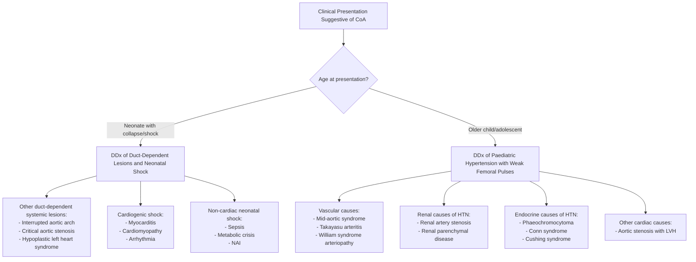

# Differential Diagnosis of Coarctation of the Aorta in Paediatrics

The differential diagnosis of CoA depends on the **clinical presentation**. Because CoA can present in two fundamentally different ways — (1) a **collapsed neonate** (critical/duct-dependent CoA) or (2) an **older child with hypertension and/or weak femoral pulses** — the differential diagnosis must be structured around each presentation separately. Let's work through this systematically from first principles.

---

## Conceptual Framework: What Are We Actually Differentiating?

When you see a child with features suggestive of CoA, you are really asking:

1. **In a neonate with shock/collapse**: "What causes acute circulatory failure in the first week of life?"
2. **In an older child**: "What causes upper-limb hypertension with weak femoral pulses and/or a murmur?"

The key clinical features that trigger the differential are:
- Weak or absent femoral pulses
- Upper-lower limb BP discrepancy
- Neonatal shock/heart failure
- Systemic hypertension in a child
- Ejection systolic murmur at the LUSB/back

---

## Differential Diagnosis Mermaid Diagram

---

## Part A: Differential Diagnosis in the Neonate with Shock/Collapse

When a neonate presents with ***collapse, shock, and oliguria after ductal closure*** [2][3], the critical question is: **is this a duct-dependent cardiac lesion, or is there another cause of neonatal shock?**

### 1. Other Duct-Dependent Systemic Circulation Lesions

These are the conditions that, like critical CoA, depend on the ductus arteriosus to maintain lower-body (systemic) blood flow. When the duct closes, they present with the same picture of acute cardiovascular collapse.

#### a) ***Interrupted Aortic Arch (IAA)*** [2]

| Feature | Detail |
|---|---|
| Definition | Complete discontinuity (not just narrowing) of the aortic arch |
| Pathophysiology | ***Duct-dependent systemic circulation → neonatal HF with shock on day 2*** — identical mechanism to critical CoA. The descending aorta is supplied entirely through the PDA from the RV [2] |
| ***Associations*** | ***DiGeorge syndrome (22q11.2 deletion) — especially Type B***, VSD [2] |
| Key distinguishing features | - ***Absence of thymus on CXR*** (suggestive of DiGeorge → Type B) [2] — this is a critical radiological clue - ***Differential cyanosis: SpO₂ in RUL higher than lower limbs*** [2] - Type classification differs from CoA (Type A/B/C based on site of interruption) [2] - ***Weak/absent femoral pulses with changes to UL/carotid pulses*** depending on type [2]: &nbsp;&nbsp;• Type A (distal to left subclavian): equally strong UL pulses &nbsp;&nbsp;• Type B (between left common carotid and left subclavian): weak LEFT upper limb pulse &nbsp;&nbsp;• Type C (between innominate and left common carotid): weak LEFT upper limb + LEFT carotid pulses |
| How to differentiate from CoA | Echocardiography shows **complete absence** of a segment of the arch (vs. narrowing in CoA). IAA + DiGeorge features (hypocalcaemia, lymphopenia, absent thymus) strongly favours IAA Type B |

> **Why is this the closest mimic?** Because IAA is essentially "the most extreme form of CoA" — instead of a narrowing, there is a complete interruption. The clinical presentation is virtually identical. Only echocardiography can reliably distinguish them.

<Callout title="IAA Type B and DiGeorge – High Yield" type="idea">
***Absence of thymus on CXR should prompt investigation for DiGeorge syndrome (CBC for lymphopenia, calcium/phosphate for hypocalcaemia, chromosomal study for 22q11.2 deletion)*** [2]. DiGeorge syndrome is remembered by the mnemonic **CATCH-22**:
- **C**ardiac abnormalities (conotruncal: IAA, truncus arteriosus, TOF)
- **A**bnormal facies
- **T**hymic hypo/aplasia
- **C**left palate
- **H**ypocalcaemia
- Chromosome **22**q11.2 deletion
</Callout>

#### b) Critical Aortic Stenosis (Critical AS)

| Feature | Detail |
|---|---|
| Definition | Severe obstruction at the aortic valve level in the neonate |
| Pathophysiology | Severe AS → LV cannot generate enough forward flow → duct-dependent systemic circulation (similar to CoA but the obstruction is at the valve, not the aorta) |
| Key distinguishing features | - Harsh ESM at RUSB (aortic area), not LUSB/back - Thrill at suprasternal notch and RUSB - LV is often dilated and poorly functioning (vs. CoA where LV function may be relatively preserved initially) - Echocardiography shows thickened, restricted aortic valve leaflets with a small valve orifice |
| How to differentiate from CoA | Murmur location (RUSB vs. LUSB/back), echocardiography shows valve-level obstruction with post-stenotic dilation of ascending aorta |

#### c) Hypoplastic Left Heart Syndrome (HLHS)

| Feature | Detail |
|---|---|
| Definition | Spectrum of underdevelopment of left-sided cardiac structures: small LV, hypoplastic/atretic mitral valve, hypoplastic/atretic aortic valve, hypoplastic ascending aorta and arch |
| Pathophysiology | The LV is essentially non-functional. ALL systemic blood flow depends on: (1) R→L shunt at atrial level (foramen ovale), (2) RV pumping through PA → PDA → descending aorta AND retrograde flow through the hypoplastic arch to supply coronaries and brain. When the duct closes → complete circulatory collapse |
| Key distinguishing features | - More severe presentation than CoA — often profound cyanosis, shock, and acidosis - Single S2 (absent aortic component) - Often no murmur at all (no flow through the aortic valve) - Echocardiography diagnostic: tiny LV cavity, atretic/severely hypoplastic mitral and aortic valves |
| How to differentiate from CoA | HLHS presents more severely and earlier. Echocardiography is definitive — the LV cavity is hypoplastic in HLHS (vs. relatively normal-sized in CoA) |

### 2. Cardiogenic Shock from Non-Structural Causes

These present with neonatal shock but **without duct-dependence** — the shock is from myocardial dysfunction rather than obstruction.

#### a) Neonatal Myocarditis

| Feature | Detail |
|---|---|
| Cause | Viral (Coxsackie B, enterovirus, adenovirus) — can be acquired transplacentally or perinatally |
| Pathophysiology | Viral invasion of myocardium → inflammation → myocyte necrosis → pump failure → cardiogenic shock |
| Key distinguishing features | - History of maternal viral illness, PROM, or neonatal infection - ***Features of cardiogenic shock: diffuse lung crackles, hepatomegaly, gallop rhythm*** [5] - Femoral pulses equally weak (all pulses diminished, not just lower limbs) - ECG: diffuse ST/T changes, low voltages, arrhythmias - Echocardiography: globally dilated, poorly contracting LV with NO structural obstruction |
| How to differentiate from CoA | In CoA, **femoral pulses are selectively weak** compared to upper-limb pulses. In myocarditis, **all pulses are equally weak**. Echocardiography distinguishes definitively |

#### b) Supraventricular Tachycardia (SVT) with Heart Failure

| Feature | Detail |
|---|---|
| Pathophysiology | Sustained rapid heart rate (typically > 220 bpm in neonates) → inadequate diastolic filling → reduced cardiac output → heart failure and shock |
| Key distinguishing features | - ***Heart rate very high (> 220 bpm)***, often > 250 bpm - Regular, narrow-complex tachycardia on ECG - May present with irritability, poor feeding, then acute collapse - Femoral pulses equally weak |
| How to differentiate from CoA | ECG is diagnostic: fixed, very rapid HR with narrow QRS. CoA does not cause extreme tachycardia as a primary feature |

### 3. Non-Cardiac Causes of Neonatal Shock

#### a) Neonatal Sepsis

| Feature | Detail |
|---|---|
| Pathophysiology | Bacterial infection → systemic inflammatory response → distributive shock (vasodilatation, capillary leak, myocardial depression) |
| Key distinguishing features | - Risk factors: PROM, maternal GBS, prematurity, chorioamnionitis - Fever or hypothermia, poor feeding, lethargy - Warm peripheries initially (distributive shock) → then cold shock - Raised inflammatory markers (CRP, procalcitonin, WCC) - Femoral pulses equally diminished - No upper-lower limb BP gradient |
| How to differentiate from CoA | Femoral pulses are not selectively weak. Blood cultures positive. No structural heart lesion on echo. However, **sepsis and critical CoA can coexist** — a collapsed neonate with presumed sepsis who does not respond to antibiotics and fluid resuscitation should have femoral pulses checked and an urgent echocardiogram |

<Callout title="Critical Teaching Point – Sepsis vs. CoA" type="error">
***A collapsed neonate initially treated for sepsis who fails to improve should ALWAYS have femoral pulses palpated and an echocardiogram performed to rule out critical CoA or other duct-dependent lesions*** [2][3]. These two conditions can look almost identical in the first hours, and delayed diagnosis of CoA is catastrophic. Remember: **weak femoral pulses is the only reliable sign of CoA before the ductus closes** [2][3].
</Callout>

#### b) Inborn Errors of Metabolism (Metabolic Crisis)

| Feature | Detail |
|---|---|
| Examples | Organic acidaemias (methylmalonic, propionic), urea cycle defects, fatty acid oxidation defects |
| Pathophysiology | Accumulation of toxic metabolites → encephalopathy, metabolic acidosis, myocardial depression → shock |
| Key distinguishing features | - Often presents after initiation of feeds (protein load) - Severe metabolic acidosis with elevated ammonia and/or lactate - Encephalopathy (seizures, lethargy, hypotonia) - No selective femoral pulse weakness |
| How to differentiate from CoA | Blood gas shows severe metabolic acidosis (can also occur in CoA), but ammonia/organic acids/acylcarnitine profile is abnormal. No structural heart lesion on echo |

#### c) Non-Accidental Injury (NAI) / Abusive Head Trauma

| Feature | Detail |
|---|---|
| Relevance | A collapsed infant may have suffered abusive head trauma |
| Key distinguishing features | Unexplained encephalopathy, retinal haemorrhages, subdural haematoma, bruising in non-mobile infant |
| How to differentiate from CoA | Neuroimaging findings, ophthalmological examination, skeletal survey. No cardiac structural lesion |

---

## Part B: Differential Diagnosis in the Older Child/Adolescent

In an older child, CoA typically presents with ***asymptomatic hypertension, incidental murmur, weak femoral pulses, or upper-lower limb BP gradient*** [2][3]. The differential here centres on **causes of secondary hypertension in children** and **conditions mimicking the vascular signs of CoA**.

### 1. Vascular Causes (Mimicking CoA's Vascular Findings)

#### a) Mid-Aortic Syndrome (MAS)

| Feature | Detail |
|---|---|
| Definition | Narrowing of the abdominal aorta (suprarenal or infrarenal), rather than the thoracic aorta |
| Causes | Takayasu arteritis, neurofibromatosis type 1 (NF1), Williams syndrome, fibromuscular dysplasia, or idiopathic |
| Pathophysiology | Abdominal aortic narrowing → upper-body hypertension, reduced lower-limb perfusion (identical haemodynamic principle to thoracic CoA) |
| Key distinguishing features | - Abdominal bruit (vs. interscapular murmur in CoA) - Echocardiography of the thoracic aorta is normal - CT/MR angiography shows abdominal aortic narrowing |
| How to differentiate from CoA | Echocardiography of thoracic aorta is normal; cross-sectional imaging (CTA/MRA) localises the narrowing to the abdominal aorta |

#### b) ***Takayasu Arteritis*** [6]

| Feature | Detail |
|---|---|
| Definition | Large-vessel vasculitis causing stenosis of the aorta and its branches |
| Epidemiology | ***Uncommon, usually affects females of reproductive age (10–40 years), especially in Asians*** [6] — but can rarely present in older paediatric patients |
| Pathophysiology | ***Granulomatous inflammation of aortic arch and abdominal aorta → stenosis*** [6] |
| Key distinguishing features | - ***Constitutional symptoms: weight loss, low-grade fever, fatigue*** [6] - ***Bruits (80%), limb claudication (70%), absent/weak pulses (60%)*** [6] - ***Asymmetric BP (50%), HTN (> 50%)*** [6] - Raised ESR/CRP - Vascular imaging (MRA/CTA) shows vessel wall thickening and stenoses in a pattern not typical of congenital CoA |
| How to differentiate from CoA | Takayasu is **acquired** (not congenital), presents with systemic inflammation, and typically involves **multiple** aortic branch vessels (not just the isthmus). CTA/MRA pattern is diffuse, not discrete |

#### c) ***Williams Syndrome Arteriopathy*** [2]

| Feature | Detail |
|---|---|
| Definition | ***Williams syndrome (7q11.23 deletion including elastin gene) causes stenosis of the arterial system*** [2] |
| Cardiac lesions | ***Supravalvular aortic stenosis (most characteristic), peripheral pulmonary artery stenosis, renal artery stenosis, coronary artery ostial stenosis*** [2] |
| Clinical features | ***Intellectual disability, elfin facies (full cheeks, flat nasal bridge, anteverted nostrils, long philtrum, prominent lips with open mouth), hypercalcaemia*** [2] |
| How to differentiate from CoA | The stenosis in Williams syndrome is **supravalvular** (above the aortic valve, in the ascending aorta) rather than at the isthmus. The dysmorphic features and hypercalcaemia are distinctive. Echocardiography localises the obstruction |

#### d) ***PHACE Syndrome*** [7]

| Feature | Detail |
|---|---|
| Definition | ***Posterior fossa malformations, Haemangiomas, Arterial anomalies, Coarctation of aorta/Cardiac anomalies, Eye abnormalities*** [7] |
| Relevance | ***CoA can occur as part of PHACE syndrome*** — large facial/cervical haemangiomas should prompt cardiac screening including assessment for CoA [7] |
| How to differentiate | Not truly a "differential" but rather an **associated syndrome**. The presence of a large segmental facial haemangioma in an infant should trigger echocardiographic screening for CoA |

### 2. Renal Causes of Paediatric Hypertension

Renal disease is the **most common cause of secondary hypertension in children**. These conditions cause hypertension but do NOT cause selective femoral pulse weakness or upper-lower limb BP gradient (unless renal artery stenosis is bilateral and severe enough to mimic aortic disease).

#### a) Renal Parenchymal Disease

| Feature | Detail |
|---|---|
| Examples | Glomerulonephritis (post-streptococcal, IgA nephropathy, lupus nephritis), reflux nephropathy, polycystic kidney disease, chronic kidney disease |
| Pathophysiology | Reduced renal function → sodium/water retention + RAAS activation → hypertension |
| How to differentiate from CoA | Normal femoral pulses, no upper-lower limb BP gradient, abnormal urinalysis (haematuria, proteinuria), abnormal renal function, abnormal renal ultrasound |

#### b) Renal Artery Stenosis (RAS)

| Feature | Detail |
|---|---|
| Causes in children | Fibromuscular dysplasia (most common paediatric cause), NF1, Williams syndrome, Takayasu arteritis, post-umbilical artery catheterisation (neonatal) |
| Pathophysiology | Stenosis of one or both renal arteries → renal hypoperfusion → RAAS activation → renovascular hypertension |
| How to differentiate from CoA | Femoral pulses are NORMAL (the aorta itself is not narrowed). Renal Doppler ultrasound shows asymmetric renal size and abnormal renal artery flow. CTA/MRA confirms renal artery stenosis |

### 3. Endocrine Causes of Paediatric Hypertension

#### a) ***Phaeochromocytoma / Paraganglioma*** [8][9]

| Feature | Detail |
|---|---|
| Definition | Catecholamine-secreting tumour from adrenal medulla chromaffin cells (phaeochromocytoma) or extra-adrenal sympathetic chain (paraganglioma) |
| ***Clinical features*** | ***Paroxysmal hypertension, classical triad of headache + sweating + palpitation*** [8][9] |
| Paediatric context | Rare in children but included in differential of secondary HTN; 10% occur in children [9] |
| How to differentiate from CoA | Paroxysmal nature, normal femoral pulses, no BP gradient. Diagnosed by 24h urine or plasma fractionated metanephrines [8][9] |

#### b) Other Endocrine Causes

| Condition | Key Feature | How to Differentiate |
|---|---|---|
| Cushing syndrome | Moon face, central obesity, striae, growth failure | Normal femoral pulses, elevated cortisol, no BP gradient |
| Hyperthyroidism | Tachycardia, tremor, weight loss, exophthalmos | Normal femoral pulses, elevated fT4/suppressed TSH |
| Congenital adrenal hyperplasia (11β-hydroxylase deficiency) | Virilisation + hypertension | Elevated 11-deoxycortisol, normal femoral pulses |
| Primary hyperaldosteronism | Hypertension + hypokalaemia | Normal femoral pulses, elevated aldosterone:renin ratio |

### 4. Other Cardiac Causes

#### a) Aortic Stenosis (Valvular)

| Feature | Detail |
|---|---|
| Pathophysiology | Obstruction at the valve level → LV pressure overload → LVH → systolic HTN |
| Key distinguishing features | ESM at RUSB (not LUSB/back), radiates to carotids, ejection click if bicuspid valve. Femoral pulses may be low-volume but NOT selectively weaker than upper-limb pulses |
| How to differentiate from CoA | No upper-lower limb BP gradient. Echocardiography localises the obstruction to the valve |

#### b) ***Turner Syndrome with Multiple Cardiac Lesions*** [2]

| Feature | Detail |
|---|---|
| Relevance | ***Turner syndrome is associated with left-sided cardiac lesions: CoA, bicuspid aortic valve, valvular AS, idiopathic aortic dilatation (risk of dissection/aneurysm), MVP, hypoplastic left heart syndrome*** [2] |
| Clinical implication | In any girl with one left-sided cardiac lesion, screen for others. CoA may coexist with AS, and the clinical picture may be mixed |

---

## Summary Table: Key Differentiating Features

| Condition | Femoral Pulses | UL-LL BP Gradient | Murmur Location | Key Distinguishing Feature |
|---|---|---|---|---|
| **Coarctation of aorta** | Weak/absent | Present ( > 20 mmHg) | LUSB → back | Discrete narrowing at isthmus on echo |
| **Interrupted aortic arch** | Weak/absent | Present | Variable | Complete discontinuity on echo; DiGeorge features |
| **Critical aortic stenosis** | Equally weak | Absent | RUSB → carotids | Valve-level obstruction on echo |
| **HLHS** | Equally weak | Absent | Often no murmur | Hypoplastic LV on echo |
| **Neonatal sepsis** | Equally weak | Absent | None | Positive blood cultures, raised inflammatory markers |
| **Myocarditis** | Equally weak | Absent | Gallop rhythm | Global LV dysfunction on echo, raised troponin |
| **Mid-aortic syndrome** | Weak | Present | Abdominal bruit | Abdominal aortic narrowing on CTA/MRA |
| **Takayasu arteritis** | Asymmetric | May be present | Bruits over multiple vessels | Raised ESR/CRP, diffuse arterial involvement on CTA |
| **Renal artery stenosis** | Normal | Absent | Renal bruit | Abnormal renal Doppler, CTA confirms |
| **Phaeochromocytoma** | Normal | Absent | None | Paroxysmal HTN, elevated metanephrines |

---

## The "Can't-Miss" Approach: When to Think CoA

> ***ALWAYS check femoral pulses in:***
> - Every newborn examination
> - Any collapsed neonate (especially day 2–7)
> - Any child with unexplained hypertension
> - Any child with a murmur
>
> ***MUST be palpated as it is the ONLY sign of coarctation*** [2]
>
> ***Delay (radiofemoral delay) is usually NOT detectable in neonates due to (1) short aorta length and (2) rapid HR*** [2] — rely on **pulse volume** comparison, not timing.

<Callout title="High Yield Summary – Differential Diagnosis of CoA">

**In the collapsed neonate (duct-dependent presentation):**
- Closest mimics: ***Interrupted aortic arch*** (especially Type B with DiGeorge), critical aortic stenosis, HLHS
- Non-structural cardiac: myocarditis, SVT with HF
- Non-cardiac: sepsis (most important to exclude concurrently), metabolic crisis, NAI
- **Key differentiator**: Selective femoral pulse weakness (present in CoA and IAA; absent in myocarditis, sepsis, and metabolic crises)

**In the older child with hypertension:**
- Vascular: mid-aortic syndrome, Takayasu arteritis, Williams syndrome arteriopathy
- Renal (most common paediatric HTN cause): renal parenchymal disease, renal artery stenosis
- Endocrine: phaeochromocytoma, Cushing, CAH (11β-hydroxylase), primary hyperaldosteronism
- **Key differentiator**: Upper-lower limb BP gradient > 20 mmHg is virtually pathognomonic of aortic obstruction (CoA or mid-aortic syndrome)

**Golden rule**: A neonate treated for sepsis who fails to improve → check femoral pulses and get an echocardiogram!

</Callout>

---

<ActiveRecallQuiz
  title="Active Recall - Differential Diagnosis of CoA"
  items={[
    {
      question: "A neonate collapses on day 2 of life with shock and absent femoral pulses. CXR shows absent thymic shadow. What is the most likely diagnosis and what syndrome should you investigate?",
      markscheme: "Interrupted aortic arch (likely Type B) with DiGeorge syndrome (22q11.2 deletion). Investigate with: karyotype/FISH for 22q11.2, serum calcium (hypocalcaemia), CBC (lymphopenia), echocardiography to define the arch anatomy."
    },
    {
      question: "How do you differentiate neonatal sepsis from critical CoA at the bedside?",
      markscheme: "Check femoral pulses — selectively weak/absent femoral pulses with preserved upper limb pulses suggests CoA. In sepsis, all pulses are equally diminished. An upper-lower limb BP gradient is present in CoA but absent in sepsis. Echocardiography is definitive. Key teaching point: any collapsed neonate not responding to sepsis treatment should have femoral pulses checked and echo performed."
    },
    {
      question: "Name three vascular conditions that can mimic CoA in an older child presenting with hypertension and weak femoral pulses.",
      markscheme: "1. Mid-aortic syndrome (abdominal aortic narrowing from Takayasu, NF1, FMD, or idiopathic). 2. Takayasu arteritis (large vessel vasculitis with multifocal stenoses). 3. Williams syndrome arteriopathy (supravalvular AS, peripheral pulmonary stenosis, renal artery stenosis). Key: these all cause aortic/arterial narrowing but at different locations or with different patterns than classic juxtaductal CoA."
    },
    {
      question: "What is the most common overall cause of secondary hypertension in children, and how does it differ from CoA on examination?",
      markscheme: "Renal parenchymal disease (e.g. glomerulonephritis, reflux nephropathy, CKD). Differs from CoA because: femoral pulses are normal, there is no upper-lower limb BP gradient, and urinalysis/renal function tests are abnormal."
    },
    {
      question: "What is PHACE syndrome and why is it relevant to CoA?",
      markscheme: "PHACE = Posterior fossa malformations, Haemangiomas (large segmental, head/neck), Arterial anomalies, Coarctation of aorta or Cardiac anomalies, Eye abnormalities. Relevant because CoA can be a component — any infant with a large facial haemangioma should have echocardiographic screening for CoA and aortic arch anomalies."
    }
  ]}
/>

## References

[1] Lecture slides: GC 147. Heart failure and cyanosis in children acyanotic and cyanotic congenital heart disease - Part 1.pdf (p17–18)
[2] Senior notes: Adrian Lui Pediatrics.pdf (p184, p185, p210, p212)
[3] Senior notes: Ryan Ho Cardiology.pdf (p190)
[4] Senior notes: Ryan Ho Neurology.pdf (p87)
[5] Senior notes: Ryan Ho Critical Care.pdf (p16)
[6] Senior notes: Ryan Ho Rheumatology.pdf (p96)
[7] Senior notes: Ryan Ho Rheumatology.pdf (p176)
[8] Senior notes: Ryan Ho Endocrine.pdf (p66)
[9] Senior notes: maxim.md (p435)
