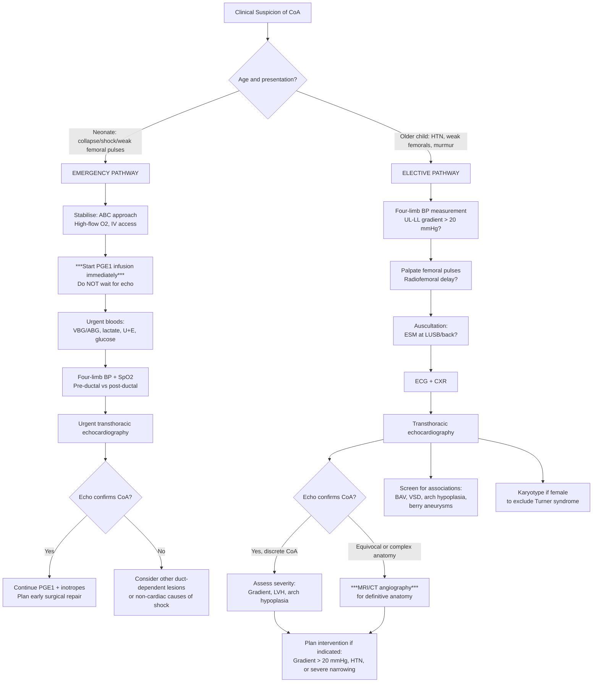

# Diagnosis of Coarctation of the Aorta in Paediatrics

## Diagnostic Criteria

There is **no single universally agreed "diagnostic criteria" checklist** for CoA (unlike, say, Kawasaki disease or rheumatic fever). Instead, diagnosis is made by **combining clinical suspicion with confirmatory imaging**. Let's break this down from first principles.

### What Constitutes a Diagnosis of CoA?

The diagnosis requires **demonstration of a discrete narrowing of the aorta** (usually at the isthmus) on imaging, in a clinical context consistent with the haemodynamic consequences of that narrowing.

In practice, the "diagnostic standard" depends on the clinical setting:

| Setting | Diagnostic Standard |
|---|---|
| **Fetal/Antenatal** | Fetal echocardiography showing size discrepancy between right and left heart structures, small aortic isthmus, or direct visualisation of narrowing (sensitivity is limited — ~50% detection rate antenatally for isolated CoA) |
| **Neonate (critical CoA)** | Clinical findings (***weak LL pulses, shock on day 2, oliguria*** [2][3]) + **transthoracic echocardiography** confirming the site and severity of narrowing and measuring the pressure gradient |
| **Older child/adolescent** | Clinical findings (***weak femoral pulses, radiofemoral delay, upper-lower limb BP gradient > 20 mmHg, ESM at LUSB/back*** [2][3]) + **echocardiography** ± **MRI/CT angiography** for definitive anatomical assessment |

### Haemodynamic Criteria for Significance

A CoA is considered **haemodynamically significant** (i.e., warrants intervention) when:

- ***Systolic pressure gradient > 20 mmHg*** across the coarctation site (measured by echocardiography Doppler or catheterisation) [2][3]
- ***Proximal (upper-limb) hypertension*** [2][3]
- ***Severe CoA on imaging studies*** (significant narrowing of lumen diameter relative to normal aorta) [2][3]
- Evidence of LV pressure overload (LVH on ECG/echo)

<Callout title="Important Caveat – Gradient Can Be Misleading">
A low measured gradient does NOT always mean mild CoA. In two situations the gradient may be falsely low:
1. **Severe LV dysfunction** — a failing LV cannot generate enough pressure to create a large gradient across the narrowing
2. **Well-developed collaterals** — in older children, extensive collateral vessels bypass the coarctation, reducing the measured gradient across the lesion itself while maintaining downstream flow

Always interpret the gradient in the context of LV function and collateral development.
</Callout>

---

## Diagnostic Algorithm

The approach differs based on the clinical scenario. Here is a comprehensive algorithm covering both neonatal and older-child presentations:

---

## Investigation Modalities: Detailed Findings and Interpretation

### 1. Bedside Investigations

#### a) Four-Limb Blood Pressure Measurement

This is the **single most important bedside diagnostic manoeuvre** in the older child and should be performed in any neonate with weak femoral pulses.

| Detail | Explanation |
|---|---|
| **Technique** | Measure systolic BP in the **right arm** (pre-ductal — always above the CoA) and **either leg** (post-ductal — below the CoA). In older children, measure both arms and one leg |
| **Normal finding** | Lower-limb systolic BP should be **equal to or 10–20 mmHg higher** than upper-limb BP (due to pulse wave amplification in the longer arterial tree to the legs) |
| **Abnormal finding in CoA** | ***Upper-limb systolic BP > lower-limb systolic BP, with gradient > 20 mmHg*** [2][3] |
| **Why right arm?** | The right subclavian artery arises from the brachiocephalic trunk, which is always proximal to any coarctation. The left subclavian may occasionally arise at or near the CoA, giving a falsely low left-arm reading |
| **Paediatric cuff size** | Must use age-appropriate cuff (bladder width = 40% of arm circumference). An undersized cuff overestimates BP; an oversized cuff underestimates it |

> **Teaching point**: In a neonate in whom you cannot easily measure leg BP, simply comparing the **volume of the femoral pulse with the brachial pulse** is the clinical equivalent. ***Weak LL pulses is the only reliable sign of this condition before the ductus closes*** [2][3].

#### b) Pulse Oximetry (Pre-ductal vs. Post-ductal)

| Detail | Explanation |
|---|---|
| **Technique** | Right hand (pre-ductal) vs. either foot (post-ductal) |
| **Finding in critical CoA with R→L PDA shunt** | Post-ductal SpO₂ (foot) may be **lower** than pre-ductal SpO₂ (right hand) by ≥ 3% |
| **Limitation** | CoA may NOT show a SpO₂ difference if there is no significant R→L shunting through the PDA (e.g., if PDA flow is predominantly L→R or the PDA is already closed). Pulse oximetry screening misses a significant proportion of CoA cases |

#### c) Femoral Pulse Palpation

***MUST be palpated as it is the ONLY sign of coarctation*** [2].

| Detail | Explanation |
|---|---|
| **In neonates** | ***Radiofemoral delay is usually NOT detectable due to (1) short aorta length and (2) rapid heart rate*** [2]. Rely on **pulse volume** — compare the "strength" of the brachial and femoral pulse simultaneously |
| **In older children** | Radiofemoral delay becomes detectable (the longer aorta allows the time difference to be appreciated, and the slower heart rate gives more time per cardiac cycle) |

<Callout title="Exam Tip – Femoral Pulse Palpation" type="error">
Many students and even junior doctors forget to palpate femoral pulses in the newborn examination. This is the most commonly missed sign leading to delayed diagnosis of CoA. ***In neonates, delay is NOT detectable — compare pulse VOLUME, not timing*** [2]. Practice this skill on every newborn you examine.
</Callout>

---

### 2. Blood Investigations

#### a) ***Bloods: Severe Metabolic Acidosis*** [2][3]

| Test | Finding in Critical CoA | Pathophysiological Basis |
|---|---|---|
| ***Arterial/venous blood gas*** | ***Severe metabolic acidosis (low pH, low HCO₃⁻, raised lactate)*** | ***Due to ischaemic colitis and AKI upon duct closure*** [2][3] — gut and kidneys are distal to the CoA and become acutely ischaemic when the PDA closes |
| **Lactate** | Raised (often > 5 mmol/L) | Tissue hypoperfusion → anaerobic metabolism → lactic acid accumulation |
| **Urea and creatinine** | Raised | Acute kidney injury from renal hypoperfusion |
| **Electrolytes** | May show hyperkalaemia | AKI → reduced renal K⁺ excretion |
| **Glucose** | May be low or high | Stress response; neonates have limited glycogen stores |
| **CBC** | Non-specific; may show leucocytosis | Stress response. Important to rule out sepsis as a concurrent or alternative diagnosis |

#### b) Additional Bloods (Association Screening)

| Test | Indication | Why |
|---|---|---|
| **Karyotype (or FISH/microarray)** | Any female with CoA | Screen for ***Turner syndrome (45,X)*** [2][3] |
| **22q11.2 deletion study** | If thymus absent on CXR, or if IAA suspected | DiGeorge syndrome [2] |
| **Calcium, phosphate** | If DiGeorge suspected | Hypoparathyroidism → ***hypocalcaemia*** [2] |
| **Lymphocyte subsets** | If DiGeorge suspected | Thymic aplasia/hypoplasia → ***lymphopenia (T-cell deficiency)*** [2] |

---

### 3. Chest X-Ray (CXR)

The CXR is a **first-line investigation** that provides indirect evidence of CoA and its haemodynamic consequences. It is NOT diagnostic on its own but provides important clues.

#### CXR Findings by Clinical Scenario

##### ***In neonates/infants with heart failure*** [2][3]:

| Finding | Pathophysiological Basis |
|---|---|
| ***Cardiomegaly*** | ***LV failure → LV dilatation; or RV dilatation if RV is supporting systemic circulation via PDA*** |
| ***Increased pulmonary vascular markings*** | ***Pulmonary venous congestion from elevated LA pressure (back-pressure from LV failure)*** [2][3] |

##### ***In older children (non-duct-dependent)*** [2][3]:

| Finding | Pathophysiological Basis |
|---|---|
| ***'Figure 3 sign' (or 'reverse E sign')*** | ***The aortic knob shows a characteristic indentation at the site of coarctation, with pre-stenotic dilatation of the left subclavian artery above and post-stenotic dilatation of the descending aorta below*** [2][3]. On barium swallow, this produces an **'E sign'** (mirror image = figure 3 on plain CXR) |
| ***Rib notching (undersurface of posterior ribs)*** | ***Erosion by enlarged, pulsatile intercostal arteries serving as collaterals*** [2][3]. Affects ribs 3–8 (ribs 1–2 spared because their intercostals arise proximal to the CoA). Takes years to develop — NOT seen in neonates or infants |

<Callout title="High Yield – CXR 'Figure 3 Sign'" type="idea">
The ***'figure 3 sign'*** is the classic CXR appearance of CoA in older children [2][3]. Imagine the number "3" lying on its side along the left mediastinal border:
- Top curve = dilated left subclavian artery or proximal aortic arch
- Indentation = the coarctation site itself
- Bottom curve = post-stenotic dilatation of the descending aorta

When barium is given, the oesophagus is indented by the aorta in a mirror-image pattern → **'reverse 3' or 'E sign'** on barium swallow.
</Callout>

---

### 4. Electrocardiogram (ECG)

The ECG reflects the **haemodynamic burden on the ventricles** and differs by age of presentation.

| Clinical Scenario | ***ECG Finding*** | Pathophysiological Basis |
|---|---|---|
| ***Neonatal HF (critical CoA)*** | ***RVH (right axis deviation, dominant R waves in V1, upright T in V1 beyond day 7)*** [2][3] | The RV is supporting the systemic circulation via the PDA → RV pressure overload. Also, the LV has not yet developed compensatory hypertrophy |
| ***Older child (non-duct-dependent)*** | ***LVH (tall R waves in V5–V6, deep S waves in V1, ± LV strain pattern with ST depression/T inversion in lateral leads)*** [2][3] | Chronic LV pressure overload from pumping against the obstruction → compensatory concentric LVH |

> **Why RVH in neonates but LVH in older children?** In critical neonatal CoA, the ductus is still open (or has just closed) and the RV has been supporting systemic circulation. The LV has not had time to hypertrophy. In chronic non-critical CoA, the LV has been working against the obstruction for months to years, so LVH develops.

**Normal neonatal ECG considerations:**
- Right axis deviation and RV dominance are NORMAL in the first days of life (due to fetal RV dominance)
- RVH is suggested if the pattern persists beyond the expected neonatal transition or is exaggerated
- Always use age-appropriate ECG reference values when interpreting paediatric ECGs

---

### 5. Echocardiography (Echo)

***Echocardiography is the primary diagnostic imaging modality for CoA*** [2][3]. It is non-invasive, widely available, radiation-free, and can be performed at the bedside — ideal for both the critically ill neonate and the ambulatory child.

#### What Echo Demonstrates

| Feature | Detail |
|---|---|
| ***Site of coarctation*** | Direct visualisation of the narrowing at the aortic isthmus from the suprasternal notch view [2][3] |
| ***Severity of coarctation*** | Measured by: (1) anatomical narrowing (luminal diameter), (2) ***systolic pressure gradient across the coarctation by continuous-wave Doppler*** [2][3] |
| **Doppler pattern** | Elevated peak systolic velocity at the coarctation site (typically > 3 m/s). In severe CoA, there is **diastolic flow continuation** ("diastolic tail") — flow persists through the narrowing even in diastole because the pressure gradient is maintained throughout the cardiac cycle |
| **Associated lesions** | ***Bicuspid aortic valve, VSD, aortic arch hypoplasia, mitral valve abnormalities*** [2][3] — all must be systematically assessed |
| **LV function** | LV contractility (fractional shortening, ejection fraction), LV wall thickness (to document LVH), LV dimensions |
| **Aortic arch anatomy** | Whether the arch is hypoplastic, presence of tubular narrowing, transverse arch dimensions (Z-scores) |
| **PDA status** | Is the ductus still open? Direction and size of PDA flow |

#### Doppler Gradient Interpretation

| Finding | Interpretation |
|---|---|
| Peak gradient > 20 mmHg | Haemodynamically significant CoA |
| Peak gradient > 40 mmHg | Severe CoA |
| Low gradient with LV dysfunction | Does NOT mean mild CoA — the LV cannot generate sufficient pressure |
| Low gradient with extensive collaterals | Collaterals bypass the coarctation, reducing the measured gradient despite significant narrowing |

<Callout title="Echo Limitations in CoA" type="error">
Echocardiography has limitations:
1. **Acoustic windows** may be suboptimal in older/larger children and adolescents
2. The **suprasternal notch view** can be technically difficult
3. **Transverse arch hypoplasia** may be underestimated
4. **Collateral vessels** are not well visualised by echo
5. **Post-operative anatomy** can be challenging to assess

When echo is equivocal or anatomy is complex → proceed to **MRI or CT angiography**.
</Callout>

---

### 6. ***Cardiac MRI (CMR)*** [2][3]

***MRI demonstrates the length and severity of coarctation*** [2][3] and is considered the **gold standard** for anatomical delineation in older children, adolescents, and for pre-operative/post-operative assessment.

| Feature | Detail |
|---|---|
| **Advantages** | No ionising radiation (critical in paediatrics), excellent soft tissue contrast, 3D reconstruction of arch anatomy, can assess collaterals, can measure flow and gradients using phase-contrast MRI |
| **What it shows** | - Precise site, length, and degree of narrowing - Transverse arch dimensions - Collateral vessel development - Post-repair assessment (re-coarctation, aneurysm at repair site) - LV mass and function (superior to echo for quantification) |
| **Limitations** | - Requires general anaesthesia or deep sedation in young children (long acquisition time, patient must stay still) - Not suitable for haemodynamically unstable neonates - Contraindicated with certain metallic implants |
| **When to use** | - Complex anatomy not fully delineated by echo - Pre-operative planning for surgical or catheter-based intervention - Post-operative surveillance (preferred modality for long-term follow-up) |

---

### 7. CT Angiography (CTA)

| Feature | Detail |
|---|---|
| **Advantages** | Very fast acquisition (no sedation needed in many cases), excellent spatial resolution, 3D reconstruction |
| **What it shows** | Same anatomical information as MRI — site, length, severity of narrowing, arch anatomy, collaterals |
| **Limitations** | - **Ionising radiation** — significant concern in children (cumulative lifetime cancer risk). Use only when MRI is not feasible or in emergency situations - IV contrast required (risk of contrast reaction, nephrotoxicity — particularly concerning if there is AKI from the CoA itself) - Less information about flow haemodynamics compared to MRI |
| **When to use** | - Emergency situations where rapid anatomical delineation is needed and echo is equivocal - Patients with contraindications to MRI - Post-operative assessment when MRI is not feasible |

---

### 8. Cardiac Catheterisation and Angiography

| Feature | Detail |
|---|---|
| **Role** | Historically the gold standard for diagnosis; now primarily used as a **therapeutic** (interventional) tool rather than purely diagnostic |
| **What it provides** | - Direct measurement of pressure gradient across CoA (most accurate haemodynamic assessment) - Angiographic visualisation of the coarctation and arch - Simultaneous intervention (balloon angioplasty ± stenting) |
| **When used diagnostically** | - When non-invasive imaging is inconclusive - Pre-intervention assessment combined with planned catheter-based intervention |
| **Limitations** | Invasive, requires sedation/GA, radiation exposure, vascular access complications (especially in neonates/small children), risk of vessel injury |

---

### 9. Screening Investigations for Associated Conditions

These are not for diagnosing the CoA itself, but for detecting the well-known associated conditions that impact management.

| Investigation | Condition Screened | Rationale |
|---|---|---|
| **Karyotype / chromosomal microarray** | ***Turner syndrome (45,X)*** | Any female with CoA [2][3] |
| **Echocardiographic assessment of aortic valve** | ***Bicuspid aortic valve*** | Present in up to 50–80% of CoA [2][3] |
| **Echo assessment of interventricular septum** | ***VSD*** | Common association [2][3] |
| **Echo assessment of transverse arch** | ***Aortic arch hypoplasia*** | Affects surgical planning [2][3] |
| **MRA of head** (in older children/adolescents) | ***Berry aneurysms*** | ***Associated with CoA; risk of subarachnoid haemorrhage***, especially with longstanding hypertension [2][3][4] |
| **Renal ultrasound** | Renal anomalies | Horseshoe kidney and other renal anomalies are associated with CoA |
| **Thyroid function, calcium** | Turner syndrome endocrine complications | If Turner confirmed |

---

## Summary: Investigation Findings at a Glance

| Investigation | Neonate (Critical CoA) | Older Child (Non-Critical CoA) |
|---|---|---|
| **4-limb BP** | May not be feasible in shock; focus on pulse volume | ***UL-LL gradient > 20 mmHg*** |
| **Pulse oximetry** | Pre-post ductal SpO₂ difference possible | Usually normal |
| **Bloods** | ***Severe metabolic acidosis, raised lactate, AKI*** [2][3] | Usually normal |
| **CXR** | ***Cardiomegaly + ↑pulmonary vascular markings*** [2][3] | ***Figure 3 sign, rib notching*** [2][3] |
| **ECG** | ***RVH*** [2][3] | ***LVH*** [2][3] |
| **Echo** | ***Site and severity of CoA, pressure gradient, PDA status, associated lesions*** [2][3] | Same + assess LVH, collaterals |
| **MRI** | Not in acute setting (too unstable) | ***Gold standard for anatomy: length and severity*** [2][3] |
| **CTA** | Only if echo equivocal and MRI not feasible | Alternative to MRI |
| **Catheterisation** | Rarely purely diagnostic; therapeutic role | Combined diagnostic + therapeutic |

---

<Callout title="High Yield Summary – Diagnosis of CoA">

**Diagnostic approach:**
1. **Clinical suspicion** → weak femoral pulses, upper-lower limb BP gradient > 20 mmHg, murmur at LUSB/back
2. **First-line investigation** → ***Transthoracic echocardiography*** (demonstrates site, severity, gradient, associated lesions) [2][3]
3. **Second-line/definitive anatomy** → ***Cardiac MRI*** (gold standard for length and severity, especially pre-operative and for follow-up) [2][3]

**Key investigation findings:**
- **Bloods (critical CoA)**: ***Severe metabolic acidosis from ischaemic colitis and AKI*** [2][3]
- **CXR**: ***Cardiomegaly + ↑pulmonary vascular markings (neonate)***; ***Figure 3 sign + rib notching (older child)*** [2][3]
- **ECG**: ***RVH in neonatal HF; LVH in older children*** [2][3]
- **Echo**: Primary diagnostic modality — site, severity, gradient, associated lesions
- **MRI**: ***Demonstrates length and severity of coarctation*** [2][3]

**Don't forget associations**: Screen for Turner syndrome (karyotype in females), BAV, VSD, arch hypoplasia, berry aneurysms.

**Haemodynamic significance**: ***Gradient > 20 mmHg, proximal HTN, or severe narrowing on imaging*** [2][3]

</Callout>

---

<ActiveRecallQuiz
  title="Active Recall - Diagnosis of Coarctation of the Aorta"
  items={[
    {
      question: "What are the three classic CXR findings of CoA in an older child, and what is the pathophysiological basis of each?",
      markscheme: "1. Figure 3 sign: pre-stenotic dilatation of left subclavian/proximal arch, indentation at CoA site, and post-stenotic dilatation of descending aorta. 2. Rib notching: erosion of undersurface of posterior ribs 3-8 by enlarged intercostal artery collaterals. 3. Cardiomegaly with or without increased pulmonary vascular markings if LV failure is present. Ribs 1-2 spared because their intercostals arise from the costocervical trunk proximal to the CoA."
    },
    {
      question: "Why does the ECG show RVH in a neonate with critical CoA but LVH in an older child with non-critical CoA?",
      markscheme: "In critical neonatal CoA, the RV supports systemic circulation via the PDA, causing RV pressure overload and RVH. The LV has not had time to hypertrophy. In non-critical CoA, the LV chronically pumps against the aortic obstruction, leading to compensatory concentric LVH over months to years."
    },
    {
      question: "A neonate with suspected critical CoA has an echocardiographic Doppler gradient of only 15 mmHg across the isthmus. Does this exclude significant CoA? Explain why or why not.",
      markscheme: "No, this does not exclude significant CoA. The gradient may be falsely low for two reasons: 1. Severe LV dysfunction means the LV cannot generate enough pressure to create a large gradient. 2. A large PDA may still be providing parallel flow to the lower body, reducing the pressure differential across the CoA. Always interpret gradient in the context of LV function and PDA status."
    },
    {
      question: "What is the gold standard imaging modality for delineating the anatomy of CoA in an older child, and what are its advantages over echocardiography?",
      markscheme: "Cardiac MRI is the gold standard. Advantages over echo: 1. Superior delineation of the length and severity of narrowing. 2. Accurate assessment of transverse arch hypoplasia. 3. Visualisation of collateral vessels. 4. Quantification of LV mass and function. 5. 3D reconstruction for surgical planning. 6. No ionising radiation (important in paediatrics). 7. Better acoustic window-independent imaging in older/larger patients."
    },
    {
      question: "Name four associated conditions that should be screened for in any child diagnosed with CoA, and the investigation used for each.",
      markscheme: "1. Turner syndrome: karyotype or chromosomal microarray (in any female). 2. Bicuspid aortic valve: echocardiography. 3. VSD: echocardiography. 4. Berry aneurysms: MRA of head (in older children/adolescents, especially with longstanding HTN). Also acceptable: aortic arch hypoplasia (echo/MRI), renal anomalies (renal ultrasound)."
    },
    {
      question: "Why is radiofemoral delay not detectable in neonates, and what should you assess instead?",
      markscheme: "Radiofemoral delay is not detectable in neonates because: 1. The aorta is very short, so the time difference between the radial and femoral pulse wave arrival is negligible. 2. The rapid heart rate reduces the time per cardiac cycle, making subtle timing differences undetectable. Instead, compare the VOLUME of the brachial and femoral pulses simultaneously. Weak femoral pulse volume compared to brachial is the key finding."
    }
  ]}
/>

## References

[1] Lecture slides: GC 147. Heart failure and cyanosis in children acyanotic and cyanotic congenital heart disease - Part 1.pdf (p17)
[2] Senior notes: Adrian Lui Pediatrics.pdf (p185, p209, p210, p211, p212)
[3] Senior notes: Ryan Ho Cardiology.pdf (p190, p191)
[4] Senior notes: Ryan Ho Neurology.pdf (p87)
