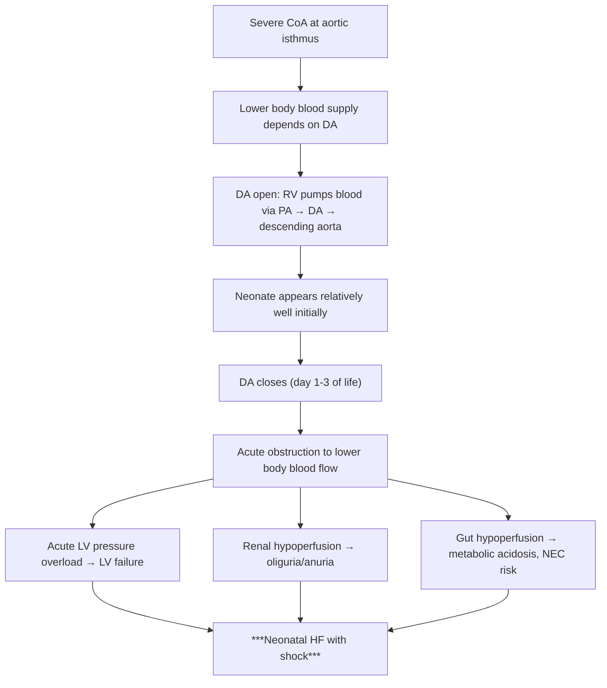
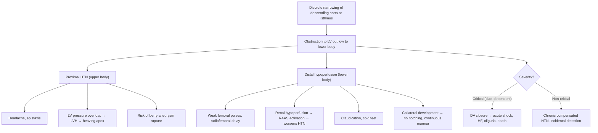

# Coarctation of the Aorta (CoA) in Paediatrics

## Definition

**Coarctation of the aorta** (CoA; Latin: *coarctare* = "to press together, to narrow") is a **discrete narrowing of the descending thoracic aorta**, typically located at or just distal to the insertion of the **ductus arteriosus** (juxtaductal position), creating a mechanical obstruction to left ventricular outflow and systemic blood flow to the lower body [1][2][3].

Less commonly, CoA may present as a **long-segment narrowing** or **tubular hypoplasia of the aortic arch** rather than a discrete shelf [2][3].

<Callout title="Breaking Down the Name">
"Co-" = together; "arctare" = to narrow. Coarctation literally means "a narrowing together" — the aorta is pinched at one point. Think of it as putting a kink in a garden hose: pressure builds up proximal to the kink (upper body hypertension) and flow drops distally (weak lower-limb pulses).
</Callout>

---

## Epidemiology

| Feature | Detail |
|---|---|
| ***Proportion of all CHD*** | ***~4–9% of congenital heart disease*** [2][3] |
| ***Incidence*** | ***~4 per 10,000 live births*** [2][3] |
| ***Sex ratio*** | ***M > F (approximately 59:41, i.e., ~1.5:1 male predominance)*** [2][3] |
| Familial recurrence | Majority sporadic; may display **familial clustering** [2][3] |
| Geographic note (HK) | No specific ethnic predilection; incidence consistent with global figures. Turner syndrome screening relevant in any female with CoA in Hong Kong |

### Key Associations

- ***Turner syndrome (45,X)*** — CoA is the **most characteristic cardiac lesion** of Turner syndrome (~10–15% of Turner patients). Any girl or adolescent diagnosed with CoA should be evaluated for Turner syndrome [2][3].
- ***Bicuspid aortic valve (BAV)*** — present in **up to 50–80%** of patients with CoA. The embryological link is defective neural crest cell migration, which contributes to both the aortic valve and the aortic isthmus [2][3].
- ***Hypoplasia of the transverse aortic arch*** [2][3]
- ***Ventricular septal defect (VSD)*** [2][3]
- ***Berry (intracranial) aneurysms*** — increased risk of subarachnoid haemorrhage in later life, relevant even in adolescents [2][3][4]
- Other: mitral valve abnormalities (parachute mitral valve), subaortic stenosis → these can coexist in the **Shone complex** (multilevel left heart obstruction)

<Callout title="High Yield – Turner Syndrome Link" type="idea">
Every female neonate/child/adolescent diagnosed with CoA should be karyotyped to exclude Turner syndrome (45,X). Conversely, every girl with Turner syndrome should have echocardiographic screening for CoA and BAV.
</Callout>

---

## Anatomy and Normal Function

### Normal Aortic Arch Anatomy (Paediatric Context)

The aortic arch gives off three great vessels in sequence:
1. **Brachiocephalic (innominate) artery** → right subclavian + right common carotid
2. **Left common carotid artery**
3. **Left subclavian artery**

Just distal to the left subclavian artery origin is the **aortic isthmus** — the segment between the left subclavian artery and the insertion of the ductus arteriosus. This is the classic site of coarctation.

### The Ductus Arteriosus — Why It Matters

- In fetal life, the **ductus arteriosus** (DA) connects the pulmonary artery to the descending aorta, shunting oxygenated placental blood away from the high-resistance, fluid-filled fetal lungs.
- At birth, rising PaO₂ and falling prostaglandin E₂ (PGE₂) levels trigger **functional closure** of the DA within 10–15 hours; **anatomical closure** (forming the ligamentum arteriosum) occurs by 2–3 weeks.
- In severe CoA, the lower body depends on the DA remaining open (duct-dependent systemic circulation). When the duct closes, catastrophic circulatory failure ensues.

### Why the Isthmus?

The aortic isthmus is **relatively narrow in utero** because it carries only ~10% of combined cardiac output (most blood bypasses via the DA). The isthmus contains **ductal tissue** (smooth muscle responsive to PGE₂/O₂). After birth, contraction of this ductal tissue within the aortic wall contributes to the narrowing, explaining the classic juxtaductal location and why presentation often coincides with DA closure.

---

## Aetiology (Focus on Hong Kong Context)

### Cause

***Majority sporadic*** [2][3]. The precise aetiology is multifactorial:

1. **Abnormal neural crest cell migration** — Neural crest cells contribute to the great vessels, aortic arch, and semilunar valves. Defective migration explains the co-occurrence of CoA with BAV and arch hypoplasia.

2. **Hemodynamic (flow) theory** — Reduced antegrade flow through the fetal aortic isthmus (e.g., due to VSD shunting blood away, or left-sided obstructive lesions) leads to underdevelopment of the isthmus.

3. **Ductal tissue theory** — Ectopic ductal smooth muscle tissue extends into the aortic wall at the isthmus. Postnatal contraction of this tissue (as the DA closes) causes the discrete narrowing. This is supported by the observation that CoA often worsens or becomes clinically apparent when the DA closes.

4. **Genetic factors:**
   - ***Turner syndrome (45,X)*** — strongest single-gene association [2][3]
   - ***Familial clustering*** — recurrence risk ~2–6% in first-degree relatives [2][3]
   - Associated loci: *NOTCH1*, *GATA5*, *NKX2.5* mutations (research-level, not routinely tested in HK clinical practice)

### Risk Factors

| Risk Factor | Mechanism |
|---|---|
| Turner syndrome | Defective lymphatic/vascular development; haploinsufficiency of X-chromosome genes involved in vascular development |
| Male sex | ~1.5× more common in males; reason unclear but may relate to hormonal influence on ductal tissue |
| Family history of CHD | Polygenic inheritance pattern |
| Maternal factors | Less well-defined than for some other CHDs; some association with maternal diabetes and teratogen exposure |

In **Hong Kong**, CoA diagnosis may be made:
- Prenatally via fetal echocardiography (increasingly detected at the anomaly scan at 18–22 weeks, though isolated CoA can be difficult to detect antenatally)
- Postnatally in the neonatal period (critical CoA) or incidentally in childhood (non-critical CoA with hypertension)

---

## Pathophysiology

This is the heart of understanding CoA. Let's build it from first principles.

### The Fundamental Problem

A mechanical obstruction in the aorta divides the circulation into two compartments:
- **Proximal to the coarctation** (ascending aorta, aortic arch, head/neck/upper limbs) → **high pressure**
- **Distal to the coarctation** (descending aorta, abdominal organs, lower limbs) → **low pressure and reduced flow**

The downstream consequences depend on the **severity of narrowing** and the **status of the ductus arteriosus**.

### Presentation Pattern 1: ***Severe/Critical CoA — Duct-Dependent Systemic Circulation*** [1][2][3]

**Key pathophysiology points:**

- ***RV supplies descending aorta via persistent arterial duct*** — In severe CoA, the RV effectively sustains the lower-body circulation through the DA. This is why pre-ductal closure, the neonate may appear deceptively well [2][3].
- ***Duct closure → acute ↑LV pressure → acute HF with shock + renal failure*** [2][3]
- ***Classical presentation: Day 2 neonatal HF with shock and oliguria*** [2][3]
- ***Death within ≤1 week if tight stenosis*** and the DA closes completely without intervention [3]

> Why does it present on day 2? Because functional DA closure begins 10–15 hours after birth and is usually significant by 24–48 hours. As long as the duct is open, the baby compensates.

- **RV impulse** is palpable because the RV is supporting the systemic circulation via the DA [2][3]
- **Differential cyanosis** may occur: lower body may be cyanotic (deoxygenated blood from RV via DA) while upper body is pink (oxygenated blood from LV). However, this is often subtle and not always clinically evident.

### Presentation Pattern 2: ***Less Severe (Non-Duct-Dependent) CoA*** [2][3]

In milder coarctation, the DA closes normally and the LV can generate enough pressure to push blood past the narrowing. Over time:

1. ***Chronic pressure overload of LV → compensatory LVH*** [2][3]
   - The LV faces increased afterload (like chronically squeezing against a narrowed pipe)
   - Concentric LVH develops as an adaptive response
   - Eventually can lead to LV diastolic dysfunction and heart failure

2. ***Systolic hypertension in the upper limbs due to outflow obstruction*** [2][3]
   - Blood pressure proximal to the coarctation is elevated
   - BP in the upper limbs is high; BP in the lower limbs is low → **upper-lower limb BP gradient > 20 mmHg** is a classic finding

3. ***Systemic arterial insufficiency → enlargement of intercostal arteries as collaterals with rib notching*** [2][3]
   - The body tries to bypass the obstruction by developing collateral vessels
   - Internal mammary arteries → intercostal arteries → descending aorta (below the CoA)
   - Enlarged, pulsatile intercostal arteries erode the undersurface of the ribs → **rib notching** on CXR (typically ribs 3–8; NOT ribs 1–2 because the first two intercostal arteries arise above the coarctation)
   - Rib notching is **not seen in neonates/infants** — it takes years to develop and is typically a finding in **older children and adolescents**

4. ***Systolic HTN may persist despite repair due to permanent alteration of arterial mechanics and physiology*** [2][3]
   - Even after successful repair, ~25–30% of patients develop late/recurrent hypertension
   - Mechanisms: abnormal aortic wall compliance, resetting of baroreceptors, activation of the renin-angiotensin-aldosterone system (RAAS) due to chronic renal hypoperfusion, endothelial dysfunction
   - This is why long-term cardiovascular follow-up is essential

<Callout title="Why Does CoA Cause Hypertension?" type="idea">
Two mechanisms:
1. **Mechanical**: Obstruction increases resistance → pressure builds up proximal to the narrowing (simple physics: Pressure = Flow × Resistance)
2. **Neurohormonal**: Chronic renal hypoperfusion (kidneys are distal to the coarctation) activates RAAS → angiotensin II → vasoconstriction + aldosterone → sodium/water retention → hypertension. This is why hypertension can persist even after surgical repair.
</Callout>

### Associated Lesion Pathophysiology

- **Bicuspid aortic valve (BAV)**: May cause aortic stenosis or regurgitation over time. Shared neural crest origin with the aortic isthmus explains the association.
- **VSD**: If large, can cause volume overload and pulmonary over-circulation. Combined CoA + VSD is a more severe phenotype — the VSD allows left-to-right shunting, further reducing antegrade flow through the aortic isthmus during fetal life.
- ***Berry aneurysms***: Present in the circle of Willis. The same connective tissue/vascular wall abnormality that causes CoA predisposes to aneurysm formation. Risk of subarachnoid haemorrhage, especially relevant in untreated adolescents/adults with longstanding hypertension [2][3][4].

---

## Classification

### By Anatomy (Historical vs. Modern)

| Classification | Description | Notes |
|---|---|---|
| **Preductal (Infantile type)** | Narrowing proximal to the DA insertion | Historically associated with long-segment hypoplasia; often severe; presents in neonatal period |
| **Juxtaductal** | Narrowing at the level of the DA | **Most common type**; the discrete shelf of posterior aortic wall tissue |
| **Postductal (Adult type)** | Narrowing distal to the DA | Historically described as the "adult" form with collateral development |

> **Modern understanding**: The preductal/postductal classification is somewhat outdated. Most CoA is **juxtaductal**, and the clinical presentation depends more on the severity of narrowing and the presence of associated lesions than on exact anatomical position relative to the ductus.

### By Clinical Presentation (More Clinically Useful)

| Type | Presentation | Age Group |
|---|---|---|
| ***Critical/Severe (Duct-dependent)*** | Neonatal shock, HF, oliguria upon DA closure | ***Neonate (day 1–14 of life)*** |
| ***Non-critical (Non-duct-dependent)*** | Asymptomatic hypertension, murmur, weak femoral pulses | ***Infant, child, adolescent*** |

### By Associated Lesions

- **Simple CoA**: Isolated discrete narrowing
- **Complex CoA**: CoA with associated intracardiac defects (VSD, BAV, mitral valve abnormalities, arch hypoplasia) — this group has worse prognosis and often presents earlier

---

## Clinical Features

### Symptoms

The symptoms depend entirely on severity and timing of presentation.

#### A. ***Severe/Critical CoA (Duct-Dependent) — Neonatal Presentation*** [2][3]

| Symptom | Pathophysiological Basis |
|---|---|
| ***Initially appears well (day 0–1)*** | DA is still open, allowing RV to supply lower body via the ductus |
| ***Acute deterioration on day 2–3*** | DA closure → sudden obstruction to lower-body blood flow and acute LV pressure overload |
| Poor feeding / lethargy | Reduced cardiac output and tissue perfusion; metabolic acidosis |
| ***Tachypnoea / respiratory distress*** | Pulmonary oedema from acute LV failure (increased LV end-diastolic pressure → increased LA pressure → increased pulmonary venous pressure → fluid transudation into alveoli) |
| ***Oliguria/anuria*** | Renal hypoperfusion distal to CoA → acute kidney injury [2][3] |
| Pallor / mottling / grey appearance | Peripheral vasoconstriction due to poor cardiac output and shock |
| ***Cardiovascular collapse / shock*** | Cardiogenic shock from acute LV failure + obstructive shock from CoA itself [2][3] |

<Callout title="Classical Presentation – Don't Miss This!" type="error">
***Day 2 neonatal HF with shock and oliguria in severe CoA with duct-dependent systemic circulation → death ≤1 week if tight stenosis*** [2][3]. This is the classic exam scenario: a neonate who was well at birth and then collapses on day 2–3 when the ductus closes. Always check femoral pulses in any collapsed neonate!
</Callout>

#### B. ***Non-Critical CoA (Non-Duct-Dependent) — Older Infant/Child/Adolescent*** [2][3]

| Symptom | Pathophysiological Basis |
|---|---|
| ***Asymptomatic (most common presentation!)*** | Gradual LVH compensates for the pressure load; collaterals develop |
| ***Incidental finding of murmur or systemic HTN*** | ***Even if narrowing is moderate/severe*** [2][3] |
| Headache | Upper-body hypertension |
| Epistaxis | Upper-body hypertension → capillary fragility in nasal mucosa |
| Leg cramps / claudication on exercise | Lower-body hypoperfusion during exertion when demand exceeds collateral supply |
| Exercise intolerance | LV cannot increase output sufficiently to meet demand across the obstruction |
| Cold feet | Reduced lower-limb perfusion |

> **Important**: Many children with non-critical CoA are **completely asymptomatic**, and the diagnosis is made incidentally when hypertension or a murmur is detected during a routine check-up. This is why checking four-limb blood pressures and femoral pulses is a fundamental part of the paediatric cardiovascular examination.

---

### Signs

#### A. ***Duct-Dependent (Critical CoA) Signs*** [2][3]

| Sign | Pathophysiological Basis |
|---|---|
| ***Weak lower-limb (LL) pulses: only reliable sign of this condition before ductus closes*** | Reduced flow to the descending aorta. This is the SINGLE most important clinical clue [2][3] |
| ***RV impulse (parasternal heave)*** | ***Systemic circulation is supported by RV*** pumping through the DA [2][3] |
| ***Inaudible or soft ejection systolic murmur (ESM) at LUSB*** | The narrowing is so tight that minimal flow crosses it → little turbulence → quiet murmur [2][3] |
| ***Collapse, shock, oliguria after ductal closure*** | Acute loss of lower-body perfusion + acute LV failure [2][3] |
| Hepatomegaly | Right heart failure secondary to LV failure (back-pressure transmitted to pulmonary veins → pulmonary arteries → RV) |
| Metabolic acidosis (on blood gas) | Lactic acidosis from poor tissue perfusion |
| Differential cyanosis (if DA has R→L shunt) | Desaturated blood from RV through DA reaches lower body; oxygenated blood from LV reaches upper body |

<Callout title="Weak Femoral Pulses – The Key Sign" type="error">
***Weak LL pulses is the only reliable sign of CoA before the ductus closes*** [2][3]. ALWAYS palpate femoral pulses in every newborn examination. If femoral pulses are absent or weak, think CoA until proven otherwise. This is a lifesaving clinical skill.
</Callout>

#### B. ***Non-Duct-Dependent (Older Child/Adolescent) Signs*** [2][3]

| Sign | Pathophysiological Basis |
|---|---|
| ***Weak LL pulse with radiofemoral delay*** | Blood reaches the femoral arteries late (via collaterals or through the narrow segment) compared to the radial pulse [2][3] |
| ***LV impulse (heaving apex beat)*** | ***Compensatory LVH*** from chronic pressure overload [2][3] |
| ***ESM at LUSB radiating to left interscapular region at the back*** | Turbulent flow across the narrowed aortic segment; the jet radiates posteriorly because the CoA is at the posterior aortic wall near the spine [2][3] |
| ***± Soft continuous murmur throughout chest in older children with well-developed collaterals*** | Continuous flow through tortuous, dilated collateral vessels (intercostal arteries). The murmur is continuous because flow is present in both systole and diastole through these low-resistance collateral channels [2][3] |
| ***Upper limb hypertension*** | Mechanical obstruction raises pressure proximal to CoA |
| Upper-lower limb BP gradient > 20 mmHg | Direct consequence of the obstruction |
| Palpable collateral vessels (intercostal/scapular) | Dilated intercostal and internal mammary arteries can sometimes be felt along the chest wall, especially over the back |
| Systolic thrill at suprasternal notch | Turbulent flow in the aortic arch |
| Apical ejection click ± ESM (if associated BAV) | BAV produces a click from restricted leaflet opening; flow across a stenotic bicuspid valve creates an ESM |

### Four-Limb Blood Pressure — The Diagnostic Manoeuvre

| Measurement | Expected Finding in CoA |
|---|---|
| Right arm BP | HIGH (proximal to CoA) |
| Left arm BP | Usually HIGH (left subclavian usually arises proximal to CoA) but may be low if CoA involves left subclavian origin |
| Lower limb BP | LOW (distal to CoA) |
| Gradient | **> 20 mmHg** upper-to-lower limb systolic BP difference is diagnostic |

> **Normal in children**: Lower-limb systolic BP should be **equal to or slightly higher** (by ~10 mmHg) than upper-limb BP (due to pulse wave amplification). If the lower-limb BP is lower, this is abnormal and suggests CoA.

> **Important paediatric note**: Use age-appropriate BP cuff sizes. In neonates, measure BP in the right arm (pre-ductal) and either leg. In older children, measure in both arms and one leg.

### Pulse Oximetry Screening

- **Pre-ductal SpO₂** (right hand) vs **post-ductal SpO₂** (either foot)
- In critical CoA with R→L shunting through DA: post-ductal SpO₂ may be lower than pre-ductal
- This is the basis of **neonatal pulse oximetry screening** programmes (now implemented in many Hong Kong hospitals)
- However, CoA may NOT always be detected by pulse oximetry screening (the gradient may be in BP rather than oxygen saturation, especially if there is no R→L shunt through the DA)

<Callout title="Why CoA Can Be Missed on Newborn Screening">
CoA is one of the most commonly missed congenital heart defects because:
1. The ductus may still be open at the time of the newborn exam → femoral pulses feel normal
2. Pulse oximetry may be normal if there is no significant R→L shunt
3. The baby appears well initially
This is why a **thorough clinical examination with femoral pulse palpation** remains essential and should not be replaced by oximetry screening alone.
</Callout>

---

## Summary of Pathophysiology → Clinical Features Connection

---

> **Key teaching point from lecture slides**: ***Coarctation of the aorta is classified as an acyanotic congenital heart disease with left-to-right shunt dynamics or obstructive lesion. It is a cause of heart failure and shock in the neonatal period (duct-dependent systemic circulation) and of systemic hypertension in older children*** [1].

---

<Callout title="High Yield Summary">

**Definition**: Discrete narrowing of the descending aorta at the aortic isthmus (juxtaductal), near the ductus arteriosus insertion.

**Epidemiology**: ***4–9% of CHD, 4/10,000 live births, M > F (59:41)*** [2][3].

**Associations**: ***Turner syndrome, bicuspid aortic valve, VSD, aortic arch hypoplasia, berry aneurysms*** [2][3].

**Pathophysiology**:
- Severe: ***duct-dependent systemic circulation → DA closure → acute LV failure, shock, oliguria, death within 1 week*** [2][3]
- Less severe: ***chronic LV pressure overload → LVH, upper-body HTN, collateral formation (rib notching)*** [2][3]
- ***HTN may persist post-repair due to altered arterial mechanics and RAAS activation*** [2][3]

**Clinical Features**:
- Critical (neonate): ***weak LL pulses (only reliable sign before ductus closes), RV impulse, soft/absent ESM at LUSB, collapse after DA closure*** [2][3]
- Non-critical (older child): ***weak LL pulses with radiofemoral delay, heaving apex (LVH), ESM at LUSB → left interscapular back, continuous murmur from collaterals, upper-lower limb BP gradient > 20 mmHg*** [2][3]

**Must-do in every newborn exam**: Palpate femoral pulses!

</Callout>

---

<ActiveRecallQuiz
  title="Active Recall - Coarctation of the Aorta (Clinical Features & Pathophysiology)"
  items={[
    {
      question: "A neonate appears well at birth but collapses on day 2 with shock, weak femoral pulses, and oliguria. What is the most likely diagnosis and what is the pathophysiological mechanism?",
      markscheme: "Critical coarctation of the aorta with duct-dependent systemic circulation. The ductus arteriosus closes on day 2, removing the only route for blood to reach the lower body. This causes acute LV pressure overload leading to heart failure, shock, and renal failure from lower-body hypoperfusion."
    },
    {
      question: "Name four conditions associated with coarctation of the aorta.",
      markscheme: "1. Turner syndrome (45,X). 2. Bicuspid aortic valve. 3. VSD. 4. Berry (intracranial) aneurysms. Also accept: transverse aortic arch hypoplasia, mitral valve abnormalities (Shone complex)."
    },
    {
      question: "Why does rib notching develop in older children with CoA, and why are ribs 1-2 spared?",
      markscheme: "Collateral blood flow develops via internal mammary arteries to intercostal arteries to bypass the coarctation. Enlarged pulsatile intercostal arteries erode the undersurface of ribs 3-8. Ribs 1-2 are spared because their intercostal arteries arise from the costocervical trunk (proximal to the CoA), not from the descending aorta."
    },
    {
      question: "What is the only reliable clinical sign of critical CoA before the ductus arteriosus closes?",
      markscheme: "Weak lower-limb (femoral) pulses. This is because lower body blood flow is reduced even with the DA patent, as flow through the DA from RV is not as pulsatile as normal LV-driven aortic flow."
    },
    {
      question: "Why may systemic hypertension persist even after successful surgical repair of CoA?",
      markscheme: "Due to permanent alteration of arterial wall mechanics (reduced compliance/stiffness), resetting of baroreceptors, chronic RAAS activation from prior renal hypoperfusion, and endothelial dysfunction. These changes do not reverse with mechanical relief of the obstruction."
    },
    {
      question: "Explain the murmur findings in non-duct-dependent CoA in an older child.",
      markscheme: "ESM at the left upper sternal border (LUSB) radiating to the left interscapular region posteriorly — due to turbulent flow across the narrowed aortic segment. A soft continuous murmur may be heard throughout the chest from well-developed collateral vessels (intercostal arteries), present in both systole and diastole due to persistent flow through low-resistance collateral channels."
    }
  ]}
/>

---

## References

[1] Lecture slides: GC 147. Heart failure and cyanosis in children acyanotic and cyanotic congenital heart disease - Part 1.pdf (p17–18)
[2] Senior notes: Adrian Lui Pediatrics.pdf (p210)
[3] Senior notes: Ryan Ho Cardiology.pdf (p190)
[4] Senior notes: Ryan Ho Neurology.pdf (p87)
