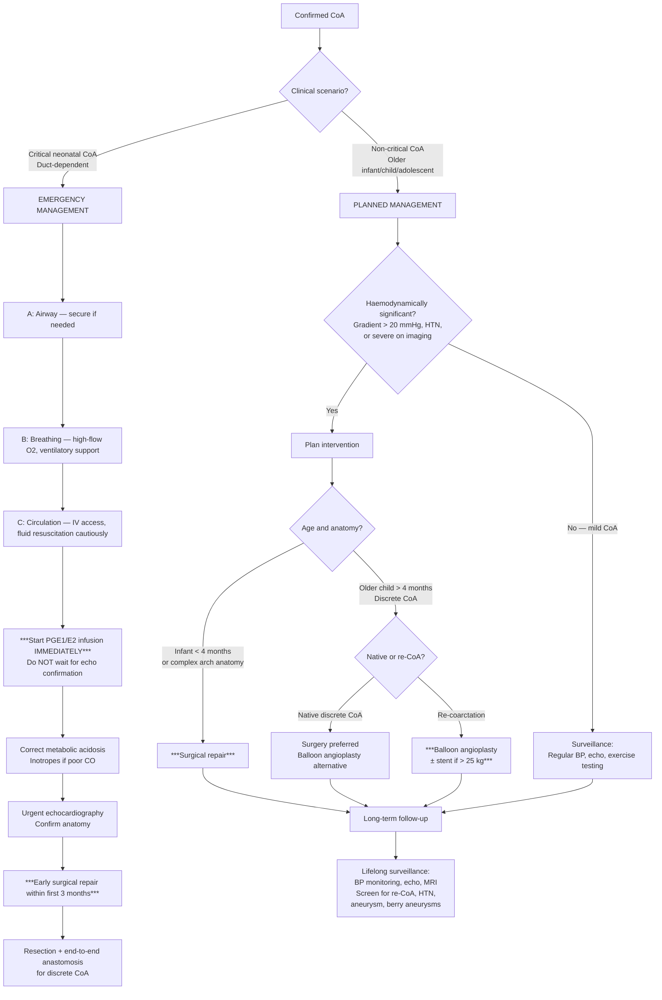

# Management of Coarctation of the Aorta in Paediatrics

## Management Overview

The management of CoA is fundamentally about **relieving the mechanical obstruction** — you cannot "treat away" a physical narrowing with medications alone. However, the approach differs dramatically based on the clinical scenario:

1. **Critical neonatal CoA** → emergency medical stabilisation followed by urgent surgical repair
2. **Non-critical CoA in older children** → planned intervention (surgical or catheter-based) if haemodynamically significant
3. **Long-term follow-up** → lifelong surveillance for re-coarctation, hypertension, and associated complications

Let me walk through each component systematically, explaining the *why* behind every intervention.

---

## Management Algorithm

---

## A. Emergency Management of Critical Neonatal CoA

This is a **paediatric cardiac emergency**. The neonate presents in shock when the ductus arteriosus closes (typically day 2–3 of life). Without intervention, ***death occurs within ≤1 week if tight stenosis*** [2][3].

### Step 1: Resuscitation (ABC Approach)

| Step | Action | Rationale |
|---|---|---|
| **Airway** | Secure airway; intubate if needed | A shocked neonate may have reduced consciousness and inadequate airway protection |
| **Breathing** | High-flow O₂ initially; mechanical ventilation if respiratory failure | Pulmonary oedema from acute LV failure impairs gas exchange. However, see O₂ caveat below |
| **Circulation** | IV access (consider umbilical venous catheter in neonates), judicious fluid bolus (10 mL/kg 0.9% NaCl) | Restore preload — but be cautious as the LV is failing; excessive fluid worsens pulmonary oedema |

<Callout title="Oxygen Caveat in CoA" type="error">
While O₂ is given for immediate resuscitation, be aware that ***supplemental O₂ can accelerate ductal closure*** (the ductus constricts in response to rising PaO₂). In a duct-dependent lesion, this could worsen the obstruction. Once PGE1 infusion is started, titrate O₂ to maintain SpO₂ in the low-to-mid 90s rather than aiming for 100%. The priority is to **re-open the ductus with PGE1** rather than to maximise oxygen delivery [2].
</Callout>

### Step 2: ***PGE1 (Prostaglandin E1) Infusion — The Lifesaving Drug*** [1][2][3]

This is the single most important intervention in the acute management of critical CoA.

| Feature | Detail |
|---|---|
| **Drug** | ***Prostaglandin E1 (alprostadil) IV infusion*** [1][2][3]. Some centres use ***PGE2 (dinoprostone)*** — both work [2] |
| **Mechanism** | PGE1 acts on smooth muscle in the ductus arteriosus wall → **relaxes ductal smooth muscle → re-opens (or maintains patency of) the ductus arteriosus** → restores blood flow from PA via PDA to the descending aorta → rescues lower-body perfusion |
| **Dose** | Start at **0.05 μg/kg/min** IV (some protocols: 0.01–0.1 μg/kg/min). Can increase to 0.1 μg/kg/min if no response. Once duct is open, titrate down to the lowest effective dose (typically 0.01–0.03 μg/kg/min) to minimise side effects |
| **Route** | Continuous IV infusion via central or peripheral line. Must NEVER be given as a bolus |
| ***When to start*** | ***Immediately upon clinical suspicion — do NOT wait for echocardiographic confirmation*** [1][2][3] |
| **Monitoring** | Continuous cardiorespiratory monitoring in NICU/PICU. Monitor SpO₂, heart rate, BP, temperature, respiratory status |

> **Why PGE1 works from first principles**: The ductus arteriosus closes postnatally because (1) rising PaO₂ causes smooth muscle constriction and (2) falling circulating PGE₂ (which was produced by the placenta) removes the tonic vasodilatory stimulus. PGE1 infusion replaces this lost prostaglandin → reverses ductal constriction → the ductus re-opens. Simple.

#### ***PGE1 Side Effects*** — Must Know for Exams

| Side Effect | Mechanism | Clinical Implication |
|---|---|---|
| ***Apnoea (up to 12%)*** | PGE1 acts on brainstem respiratory centres → respiratory depression | **Must have intubation equipment at bedside**. Many centres electively intubate before starting PGE1, especially for inter-hospital transfer |
| Hypotension | Systemic vasodilatation (PGE1 is a vasodilator) | Monitor BP closely; may need concurrent inotrope support |
| Fever | Prostaglandin-mediated pyrexia (PGE acts on hypothalamic thermoregulation) | Can mimic sepsis — important to distinguish |
| Flushing | Cutaneous vasodilatation | Usually benign |
| Jitteriness / seizure-like activity | CNS effects (rare at standard doses) | Reduce dose if occurs |
| Cortical periosteal hyperostosis | Prolonged use (> 2 weeks) → periosteal new bone formation | Relevant only for long-term use awaiting surgery |

<Callout title="PGE1 = Apnoea Risk → Prepare for Intubation">
***PGE1 infusion causes apnoea in up to 12% of neonates***. ALWAYS have intubation equipment immediately available before starting the infusion. In practice, many transport teams intubate the neonate prophylactically before transfer to a surgical centre. This is a favourite exam question.
</Callout>

### Step 3: ***Inotropic Support*** [1][2][3]

| Feature | Detail |
|---|---|
| ***Indication*** | ***To maintain cardiac output*** [2][3] in the setting of acute LV failure |
| **Drug of choice** | **Dopamine** (5–10 μg/kg/min) or **dobutamine** (5–20 μg/kg/min) IV infusion |
| **Mechanism** | Dopamine: dose-dependent β₁-adrenergic stimulation → ↑contractility and ↑heart rate. Dobutamine: β₁-selective → ↑contractility with less tachycardia and less vasoconstriction than dopamine |
| **Milrinone** | Phosphodiesterase-3 inhibitor (= "inodilator": ↑contractility + vasodilation). Useful as adjunct, especially if high afterload is an issue |

### Step 4: Correct Metabolic Derangements

| Derangement | Treatment | Rationale |
|---|---|---|
| ***Severe metabolic acidosis*** | Sodium bicarbonate IV (only if pH < 7.1 and not improving with resuscitation) | Acidosis impairs myocardial contractility and reduces response to catecholamines. However, NaHCO₃ has risks (hyperosmolality, paradoxical intracellular acidosis) — correct the underlying cause (restore perfusion) first |
| Hypoglycaemia | IV dextrose (2 mL/kg of 10% dextrose bolus, then 10% dextrose maintenance) | Neonates have limited glycogen stores; hypoglycaemia worsens neurological injury |
| Hyperkalaemia | If K⁺ > 6.5 mmol/L: calcium gluconate (cardioprotection), salbutamol nebuliser, insulin-dextrose | AKI from renal hypoperfusion → reduced K⁺ excretion |
| AKI | Fluid management, diuretics if fluid overloaded after duct is reopened | Restoring renal perfusion via PGE1 is the primary treatment |

### Step 5: ***Early Surgical Repair*** [1][2][3]

| Feature | Detail |
|---|---|
| ***Timing*** | ***Early surgical repair, ideally within the first 3 months of life*** [2][3]. In practice, surgery is performed once the neonate is stabilised (often within days of presentation) |
| ***Procedure*** | ***Resection with end-to-end anastomosis*** for discrete CoA [2][3] — see Surgical Repair section below |

> **From the lecture slides**: ***Management of severe left ventricular outflow obstruction: (1) initial stabilisation by PGE1/E2, (2) corrective surgery or catheter intervention, (3) surgical repair of aortic coarctation/interruption*** [1].

---

## B. Planned Management of Non-Critical CoA (Older Infant/Child/Adolescent)

### Indications for Intervention

***Repair is indicated in selected patients*** with [2][3]:

| ***Indication*** | Explanation |
|---|---|
| ***Proximal (upper-limb) hypertension*** | Evidence that the CoA is causing clinically significant haemodynamic compromise [2][3] |
| ***Pressure gradient > 20 mmHg*** across the coarctation (measured by echo Doppler or catheterisation) [2][3] | Indicates haemodynamically significant obstruction |
| ***Severe CoA on imaging studies*** (significant anatomical narrowing) [2][3] | Even if the gradient is not impressively high (may be due to collaterals or LV dysfunction) |

If none of these criteria are met (mild CoA), the child is managed with **surveillance**: regular BP monitoring, periodic echocardiography, and exercise testing.

### Treatment Modalities

There are three main options: (1) surgical repair, (2) balloon angioplasty, and (3) stent placement. The choice depends on the **age, weight, anatomy, and whether this is a native or recurrent coarctation**.

---

### Modality 1: ***Surgical Repair*** [2][3]

Surgery is the **gold standard** for treatment of CoA, especially in neonates and infants.

#### Surgical Techniques

| ***Technique*** | ***Indication*** | How It Works |
|---|---|---|
| ***Resection with end-to-end anastomosis*** | ***Discrete CoA (most common)*** [2][3] | The narrowed segment is excised and the two free ends of the aorta are directly sutured together. This is the simplest and most widely used technique. It removes the abnormal ductal tissue completely |
| **Extended end-to-end anastomosis** | Discrete CoA with some isthmus/arch hypoplasia | Similar to above but the incision is extended along the underside of the aortic arch, allowing a wider anastomosis. Preferred when there is mild associated arch hypoplasia |
| ***Subclavian flap aortoplasty*** | ***Long-segment CoA*** [2][3] | The left subclavian artery is divided, opened longitudinally, and folded down as a patch to widen the narrow aortic segment. ***Now largely obsolete*** [2] because it sacrifices the left subclavian artery → risk of left arm growth discrepancy and ischaemia |
| ***Bypass graft across coarctation*** | ***Long-segment CoA too long for primary anastomosis*** [2][3] | A prosthetic or homograft conduit is placed to bypass the narrowed segment. Used when the coarctation is too extensive for resection |
| **Patch aortoplasty** | Historical technique | The narrowed segment is opened longitudinally and a patch (synthetic or pericardial) is sewn in to widen it. **Largely abandoned** due to high rate of late aneurysm formation at the patch site |

#### Surgical Timing

| Age Group | Timing |
|---|---|
| **Neonate (critical CoA)** | ***Urgent, within days of presentation, certainly < 3 months*** [2][3] |
| **Older infant/child** | Elective repair, ideally before school age (3–5 years) if criteria for intervention are met. Earlier if significant HTN or symptoms |

#### Surgical Outcomes

| Outcome | Detail |
|---|---|
| ***Restenosis rate*** | ***5–15% after surgery*** [2][3] |
| Operative mortality | Very low (< 1–2% in experienced centres) for isolated CoA |
| Complications | Recurrent laryngeal nerve palsy (hoarseness), phrenic nerve injury, chylothorax, wound infection, paradoxical hypertension (see below), spinal cord ischaemia (rare — < 0.5%) |

> **Why is spinal cord ischaemia a risk?** During surgical repair, the aorta is cross-clamped proximal and distal to the coarctation. This interrupts blood flow to the intercostal arteries that supply the anterior spinal artery (artery of Adamkiewicz). In children with well-developed collaterals, this risk is very low because collaterals maintain spinal cord perfusion. In neonates without collaterals, the cross-clamp time must be kept short.

> **What is paradoxical hypertension?** After successful CoA repair, some children develop **acute severe hypertension** in the first 24–72 hours postoperatively, even though the obstruction has been relieved. This is caused by: (1) acute increase in blood flow to a previously underperfused vascular bed → mesenteric arteritis, (2) activation of sympathetic nervous system and RAAS (baroreceptor resetting), (3) catecholamine surge. It can cause **abdominal pain** (mesenteric arteritis — "post-coarctectomy syndrome") and is treated with short-acting antihypertensives (e.g., IV esmolol, sodium nitroprusside).

---

### Modality 2: ***Balloon Angioplasty*** [2][3]

Balloon angioplasty is a **catheter-based (interventional cardiology) approach** — less invasive than surgery.

| Feature | Detail |
|---|---|
| **Technique** | A balloon catheter is advanced (usually via the femoral artery) to the coarctation site, and the balloon is inflated to dilate the narrowed segment. The mechanism involves controlled tearing of the intima and media of the aortic wall at the coarctation |
| ***Indication*** | ***In children > 4 months old with discrete coarctation*** [2][3]. Also indicated for ***re-coarctation*** (recurrence after previous surgical repair) — where it is the preferred first-line approach [2][3] |
| ***Age restriction*** | ***Generally not used for those < 4 months due to small vessel size → poor results*** [2][3] |
| **Contraindications** | Long-segment coarctation (poor response), very young neonates (vessel too small), associated arch hypoplasia requiring surgical reconstruction |
| ***Outcomes*** | ***Restenosis rate: 40% in young infants vs. 8% in adolescents*** [2][3] — this is why balloon angioplasty is preferred in older children and for re-coarctation rather than for native CoA in neonates |
| **Complications** | Femoral artery injury (especially in small children), aortic wall dissection, aneurysm formation at the dilatation site, residual gradient, re-coarctation |

> **Why does balloon angioplasty have higher restenosis in young infants?** Several reasons: (1) The ductal tissue that forms the coarctation is elastic and tends to recoil after balloon dilatation. (2) Small vessel calibre means less effective dilatation. (3) Growth of the child may outpace the dilated segment. (4) Intimal proliferation and fibrosis at the site of controlled tear.

<Callout title="Native CoA vs. Re-Coarctation — Different Preferred Approaches" type="idea">
- **Native CoA in neonates/young infants**: **Surgery** is preferred (balloon angioplasty has high restenosis)
- **Re-coarctation after previous surgery**: ***Balloon angioplasty is preferred*** [2][3] — the scar tissue at the surgical site responds better to balloon dilatation and has lower recoil than native ductal tissue
- **Native CoA in older children/adolescents**: Either surgery or balloon angioplasty ± stent can be offered
</Callout>

---

### Modality 3: ***Stent Placement*** [2][3]

| Feature | Detail |
|---|---|
| **Technique** | A metallic stent (expandable mesh tube) is deployed at the coarctation site during catheterisation, holding the vessel open |
| ***Indication*** | ***Generally indicated after surgical repair or angioplasty for those ≥ 25 kg*** [2][3]. Also increasingly used as a primary intervention in adolescents and larger children |
| **Weight threshold** | ***≥ 25 kg*** [2][3] — this is because the stent needs to be large enough to accommodate future growth to adult aortic dimensions. In smaller children, the stent would need to be re-dilated or exchanged multiple times |
| ***Pros*** | ***Improve luminal diameter, ↓residual gradient*** [2][3] |
| ***Cons*** | ***Often require repeated planned re-intervention as the stent needs to be dilated as the child grows*** [2][3]. Stent fracture, in-stent restenosis, need for lifelong imaging follow-up |
| **Types** | Bare metal stents (most common); covered stents (useful if there is risk of aortic wall injury or aneurysm) |
| **Contraindications** | Small children < 25 kg (stent cannot accommodate growth to adult size), very young infants, long-segment CoA, associated arch hypoplasia requiring reconstruction |

> **Why the ≥ 25 kg threshold?** An adult descending aorta is approximately 20–25 mm in diameter. A stent placed in a small child would need to be dilated multiple times as the child grows, eventually reaching adult dimensions. If the initial stent is too small, it may not be expandable to the required final diameter. At ≥ 25 kg, the aorta is large enough that a stent can be placed at near-adult dimensions, minimising future re-interventions.

---

## C. ***Medical Therapy for Heart Failure*** [1]

From the lecture slides, the ***management of paediatric heart failure*** follows a stepwise approach [1]:

> ***Identification of the cause and precipitating factors → Tackling of precipitating factors → General supportive management → Medical therapy of heart failure (diuretics, digoxin, ACEI, carvedilol) → Treatment of underlying cause by surgical or catheter intervention → Mechanical circulatory support and heart transplantation*** [1]

In the context of CoA, medical therapy is used as a **bridge** — to stabilise the child before definitive repair — not as a long-term solution, because the underlying problem is mechanical obstruction.

### Medical Therapy for CoA-Related Heart Failure

| Drug Class | Drug | Mechanism | Role in CoA |
|---|---|---|---|
| ***PGE1*** | Alprostadil | Relaxes ductal smooth muscle → reopens PDA | ***Lifesaving bridge in critical neonatal CoA*** [1][2][3] |
| ***Inotropes*** | Dopamine, dobutamine | β₁-agonist → ↑contractility | ***Maintain cardiac output in acute LV failure*** [2][3] |
| **Diuretics** | Furosemide (1 mg/kg IV) | Loop diuretic → ↓preload by promoting natriuresis | Relieve pulmonary congestion from acute LV failure |
| **ACE inhibitors** | Captopril, enalapril | Block RAAS → ↓afterload + ↓aldosterone | Useful in chronic HF management; also used for post-repair hypertension |
| **Beta-blockers** | Carvedilol | β-blockade + α-blockade → ↓HR, ↓afterload | Chronic HF management; NOT in acute decompensated HF |
| **Digoxin** | Digoxin | Na⁺/K⁺-ATPase inhibition → ↑intracellular Ca²⁺ → ↑contractility | ***Seldom used due to narrow therapeutic index*** [2]; role is limited in CoA |

<Callout title="Medical Therapy ≠ Definitive Treatment in CoA" type="error">
Unlike dilated cardiomyopathy where medical therapy (ACEI + BB + diuretics) is the mainstay, in CoA the problem is a **fixed mechanical obstruction**. No drug will "open up" the narrowing. Medical therapy is a **bridge to surgery/intervention**. Prolonged medical management without definitive repair is inappropriate and dangerous.
</Callout>

---

## D. Antihypertensive Therapy (Pre- and Post-Repair)

### Pre-Repair Hypertension

In older children with non-critical CoA and significant hypertension awaiting intervention:

| Drug | Paediatric Dose | Notes |
|---|---|---|
| **ACE inhibitor** (enalapril) | 0.08–0.5 mg/kg/day in 1–2 doses | First-line; reduces afterload and counteracts RAAS activation |
| **Beta-blocker** (atenolol) | 0.5–2 mg/kg/day | If ACEI insufficient; reduces cardiac output and renin secretion |
| **Amlodipine** (Ca²⁺ channel blocker) | 0.1–0.3 mg/kg/day | Alternative or add-on if BP not controlled |

### ***Post-Repair Persistent Hypertension*** [2][3]

***Systolic hypertension may persist despite repair due to permanent alteration of arterial mechanics and physiology*** [2][3]. Up to 25–30% of patients develop late hypertension even after successful repair.

Management:
- **Lifestyle modifications** (age-appropriate exercise, dietary salt restriction)
- **Antihypertensive pharmacotherapy** (ACEI or ARB as first-line; add beta-blocker or CCB as needed)
- **Regular BP monitoring** — ambulatory BP monitoring (ABPM) is increasingly used in paediatrics to detect masked hypertension

---

## E. Long-Term Follow-Up and Surveillance

ALL patients with CoA — whether repaired or not — require **lifelong cardiovascular follow-up**. This is a key concept that distinguishes CoA from many other surgical conditions.

### ***Long-term Outcome: 10-year survival generally > 90%*** [2][3]

### Surveillance Protocol

| Surveillance Component | Frequency | What to Look For |
|---|---|---|
| **Clinical examination** | Every 6–12 months (more frequent initially post-repair) | BP in both arms and one leg, femoral pulses, cardiac auscultation |
| **Blood pressure monitoring** | Every visit; consider ABPM | ***Persistent HTN*** (even after repair) [2][3] |
| **Echocardiography** | Annually (or more frequently if concerns) | Re-coarctation (peak gradient at repair site), arch hypoplasia, LV function, LVH regression, BAV progression |
| **Cardiac MRI** | Every 3–5 years (or as clinically indicated) | Repair site anatomy, aneurysm formation at repair site, arch dimensions |
| **Exercise testing** | In older children/adolescents | Exaggerated hypertensive response to exercise (may unmask haemodynamically significant re-CoA not apparent at rest) |
| **MRA of head** | Consider in older patients with longstanding HTN | ***Berry aneurysm screening*** [2][3][4] |

---

## F. Summary Table: Treatment Selection by Clinical Scenario

| Clinical Scenario | First-Line Treatment | Alternative | Key Points |
|---|---|---|---|
| ***Critical neonatal CoA*** | ***PGE1 infusion → surgical repair (resection + end-to-end anastomosis) within first 3 months*** [1][2][3] | — | Start PGE1 immediately; don't wait for echo |
| ***Non-critical CoA, infant < 4 months*** | ***Surgical repair*** [2][3] | — | Balloon angioplasty has poor results at this age |
| ***Non-critical CoA, child > 4 months, discrete*** | ***Surgical repair*** or ***balloon angioplasty*** [2][3] | Stent if ≥ 25 kg | Surgery and balloon are both reasonable; individualise |
| ***Non-critical CoA, long-segment*** | ***Surgical repair (bypass graft)*** [2][3] | — | Balloon/stent inappropriate for long-segment disease |
| ***Re-coarctation*** | ***Balloon angioplasty ± stent*** [2][3] | Re-do surgery | Balloon is preferred first-line for re-CoA |
| ***Residual HTN post-repair*** | ***Antihypertensives (ACEI/ARB ± BB)*** [2][3] | — | Lifelong monitoring; HTN may persist despite successful repair |

---

<Callout title="High Yield Summary – Management of CoA">

***Emergency (Critical Neonatal CoA)*** [1][2][3]:
1. **ABC resuscitation**
2. ***PGE1/E2 infusion immediately*** — reopens ductus, restores lower-body perfusion. Watch for apnoea.
3. ***Inotropes to maintain cardiac output***
4. ***Early surgical repair < 3 months*** — resection with end-to-end anastomosis for discrete CoA

***Planned (Non-Critical CoA)*** [2][3]:
- ***Indications for intervention: proximal HTN, gradient > 20 mmHg, severe CoA on imaging***
- ***Surgical repair***: gold standard; restenosis 5–15%
- ***Balloon angioplasty***: for > 4 months, discrete CoA or re-coarctation; restenosis 40% in young infants vs. 8% in adolescents
- ***Stent placement***: for ≥ 25 kg; improves lumen but requires re-intervention as child grows

***Key Lecture Slide Points*** [1]:
- ***Management of paediatric HF: identify cause → tackle precipitating factors → general supportive → medical therapy → surgical/catheter intervention → mechanical support/transplant***
- ***Management of severe LVOT obstruction: PGE1/E2 stabilisation → corrective surgery or catheter intervention → surgical repair of aortic coarctation/interruption***

***Long-Term*** [2][3]:
- ***10-year survival > 90%***
- ***Lifelong follow-up*** for re-CoA, persistent HTN, aneurysm, berry aneurysms
- ***HTN may persist post-repair*** due to altered arterial mechanics

</Callout>

---

<ActiveRecallQuiz
  title="Active Recall - Management of Coarctation of the Aorta"
  items={[
    {
      question: "A day-2 neonate presents with shock, absent femoral pulses, and severe metabolic acidosis. Echocardiography confirms critical CoA with closing ductus. Outline the immediate management steps in order.",
      markscheme: "1. ABC resuscitation: secure airway, high-flow O2 (but avoid hyperoxia which accelerates ductal closure), IV access. 2. Start PGE1 infusion immediately (0.05 mcg/kg/min IV) to reopen/maintain ductal patency — have intubation equipment ready as PGE1 causes apnoea in up to 12%. 3. Inotropes (dopamine or dobutamine) to support cardiac output. 4. Correct metabolic acidosis (fluid resuscitation, NaHCO3 if pH < 7.1). 5. Urgent echocardiography to confirm anatomy. 6. Plan early surgical repair (resection with end-to-end anastomosis) within first 3 months of life."
    },
    {
      question: "Why is balloon angioplasty generally not used for CoA in infants less than 4 months old?",
      markscheme: "Three reasons: 1. Small vessel calibre leads to suboptimal dilatation and technical difficulty. 2. Ductal tissue forming the coarctation is elastic and tends to recoil after balloon dilatation. 3. Very high restenosis rate — up to 40% in young infants compared to only 8% in adolescents. Therefore, surgical repair is preferred in this age group."
    },
    {
      question: "A 12-year-old boy underwent successful CoA repair at age 3. He now has normal femoral pulses and no residual gradient on echo. However, his ambulatory BP monitoring shows persistent hypertension. Explain why and how you would manage this.",
      markscheme: "Why: Systolic HTN may persist despite successful repair due to: 1. Permanent alteration of arterial wall mechanics (reduced compliance/stiffness). 2. Resetting of baroreceptors during years of pre-repair hypertension. 3. Chronic RAAS activation from prior renal hypoperfusion. 4. Endothelial dysfunction. Management: 1. Lifestyle modifications (exercise, salt restriction). 2. Pharmacotherapy with ACE inhibitor or ARB as first-line. 3. Add beta-blocker or CCB if needed. 4. Continue lifelong BP monitoring."
    },
    {
      question: "What are the indications for stent placement in CoA, and why is there a weight threshold of 25 kg?",
      markscheme: "Indications: Generally after surgical repair or balloon angioplasty for residual/recurrent CoA in patients at least 25 kg. Also used as primary intervention in adolescents. Weight threshold rationale: The adult descending aorta is approximately 20-25 mm diameter. A stent must be expandable to near-adult dimensions to avoid multiple re-interventions. Below 25 kg, the aorta is too small for an adequately-sized stent, and multiple serial dilations would be needed as the child grows."
    },
    {
      question: "List the key components of lifelong surveillance after CoA repair and explain the rationale for each.",
      markscheme: "1. BP monitoring (every visit, consider ABPM): persistent HTN occurs in 25-30% despite repair. 2. Echocardiography (annually): detect re-coarctation, LVH, BAV progression, LV function. 3. Cardiac MRI (every 3-5 years): assess repair site for aneurysm, re-narrowing, arch anatomy. 4. Exercise testing (older children): unmask exercise-induced HTN or haemodynamically significant re-CoA not apparent at rest. 5. MRA of head (consider in older patients): screen for berry aneurysms associated with CoA, risk of SAH with longstanding HTN."
    },
    {
      question: "From the lecture slides, outline the stepwise approach to management of paediatric heart failure as it applies to CoA.",
      markscheme: "1. Identify the cause (CoA) and precipitating factors (ductal closure, infection). 2. Tackle precipitating factors (PGE1 to reopen duct). 3. General supportive management (bed rest, nutritional support, fluid restriction, O2). 4. Medical therapy (diuretics, digoxin, ACEI, carvedilol). 5. Treatment of underlying cause by surgical or catheter intervention (resection + end-to-end anastomosis or balloon angioplasty). 6. Mechanical circulatory support and heart transplantation if refractory."
    }
  ]}
/>

## References

[1] Lecture slides: GC 147. Heart failure and cyanosis in children acyanotic and cyanotic congenital heart disease - Part 1.pdf (p36, p37)
[2] Senior notes: Adrian Lui Pediatrics.pdf (p200, p211)
[3] Senior notes: Ryan Ho Cardiology.pdf (p191)
[4] Senior notes: Ryan Ho Neurology.pdf (p87)
