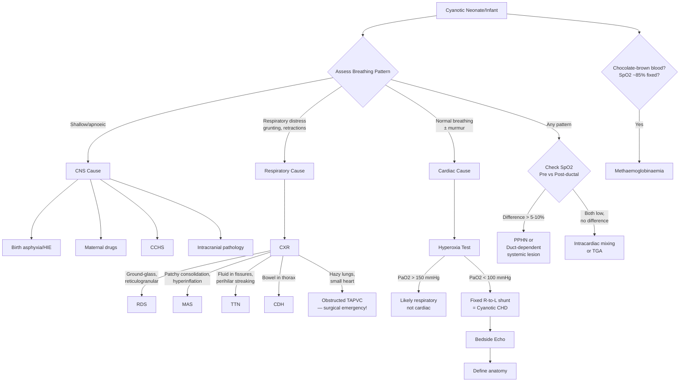

## Differential Diagnosis of Neonatal/Infant Cyanosis

The differential diagnosis of a cyanosed neonate or infant is one of the most important clinical exercises in paediatrics. The key skill is **rapid categorisation by system** — because management diverges completely depending on whether the cause is in the lungs, the heart, the brain, or the blood. Let me walk you through this systematically.

### Guiding Principle: Think in Systems

When you see a blue baby, your brain should immediately sort into four buckets:

1. **Respiratory** — the lungs cannot oxygenate the blood
2. **Cardiovascular** — oxygenated and deoxygenated blood mix, or deoxygenated blood bypasses the lungs
3. **Neurological** — the brain fails to drive adequate ventilation
4. **Haematological/Metabolic** — the haemoglobin itself is dysfunctional, or a metabolic derangement causes secondary cyanosis

The reasoning is based on the oxygen cascade: atmospheric O₂ must travel from the air → through the airways → across the alveolar membrane → into the blood → carried by haemoglobin → delivered to tissues. A block at **any** point causes cyanosis, and each point maps to a different system.

---

### Systematic Differential Diagnosis by Category

#### A. Respiratory Causes (Most Common Overall)

These are the **most frequent** causes of neonatal cyanosis because the transition from a fluid-filled to an air-filled lung is the single most precarious physiological event at birth. The common pathway is **impaired gas exchange** — whether from V/Q mismatch, intrapulmonary shunting, diffusion impairment, or mechanical obstruction [2][6].

| Condition | Age Group | Key Distinguishing Features | Why Cyanosis? |
|---|---|---|---|
| ***Transient tachypnoea of the newborn (TTN)*** | Term, especially ***elective C/S*** | Most common respiratory disease of term infants. Tachypnoea > 60/min most prominent. ***Usu resolves in 12–72h***. CXR: fluid in fissures, perihilar streaking, hyperinflation [2] | Retained fetal lung fluid → ↓compliance + V/Q mismatch → mild hypoxaemia |
| ***Respiratory distress syndrome (RDS)*** | ***Preterm < 32 weeks*** | Onset ≤4–6h. Expiratory grunting (auto-PEEP). CXR: ***ground-glass, reticulogranular pattern, air bronchograms*** [2] | Surfactant deficiency → atelectasis → intrapulmonary shunting + ↓diffusion surface area |
| ***Meconium aspiration syndrome (MAS)*** | Term/post-term | Meconium-stained liquor. CXR: patchy consolidation, hyperinflation, pneumothorax | Mechanical obstruction + chemical pneumonitis + surfactant inactivation + secondary PPHN |
| ***Congenital pneumonia*** | Any (early-onset GBS, E. coli, Listeria) | Risk factors: PROM, maternal fever, GBS colonisation. CXR may mimic RDS. Positive blood/ET cultures | Alveolar exudate → intrapulmonary shunting |
| ***Congenital diaphragmatic hernia (CDH)*** | Neonatal | ***Scaphoid abdomen***, absent breath sounds on affected side, bowel sounds in chest. CXR: bowel gas in thorax [6] | Pulmonary hypoplasia (fewer alveoli + abnormal vasculature) + PPHN component |
| ***Pneumothorax / pulmonary air leak*** | Any | Sudden deterioration, unilateral ↓AE, hyperresonance, mediastinal shift | Lung collapse → ↓ventilated surface area |
| **Choanal atresia** | Neonatal | Obligate nasal breathers → cyclical cyanosis relieved by crying (opens mouth). Cannot pass NG tube through nares | Complete upper airway obstruction at rest (neonates are obligate nasal breathers) |
| ***Pulmonary haemorrhage*** | Preterm, SGA | Bloody ET secretions, sudden deterioration | Alveolar flooding → intrapulmonary shunting |
| **Upper airway obstruction** (laryngomalacia, subglottic stenosis, vascular ring, tracheomalacia) | Neonatal/infant | Stridor (inspiratory = supraglottic; biphasic = glottic/subglottic), positional variation | Airway obstruction → inadequate ventilation → hypoxaemia + hypercapnia |
| ***Oesophageal atresia / tracheo-oesophageal fistula (OA/TOF)*** | Neonatal | Polyhydramnios, excessive drooling, choking with first feed, inability to pass NG tube [2] | Aspiration of saliva/feeds through fistula → chemical pneumonitis + atelectasis |

<Callout title="TTN vs RDS — How to Tell Them Apart" type="idea">
Both present with tachypnoea and cyanosis in a newborn. Key differences:
- **TTN**: Term infant, C/S delivery, onset within 2h, mild course, CXR shows fluid in fissures/perihilar streaking, ***resolves in 12–72h*** [2]
- **RDS**: Preterm infant, onset ≤ 4–6h, progressive worsening over 48h, CXR shows ***ground-glass reticulogranular pattern with air bronchograms***, needs surfactant [2]
</Callout>

#### B. Cardiovascular Causes

***Cardiac causes of central cyanosis involve systemic venous blood bypassing the lung*** [1]. The hallmark clinical clue is ***cyanosis with a normal breathing pattern (± murmurs)*** — the baby is blue but not in respiratory distress (at least initially) [2]. Another classic feature is cyanosis that ***does NOT improve significantly with supplemental O₂*** (because the problem is a fixed R-to-L shunt, not inadequate alveolar O₂).

##### Classification of Cyanotic CHD [2][4]

| Mechanism | Lesion | Key Features | Age of Presentation |
|---|---|---|---|
| ***RVOT obstruction + R-to-L shunt at ventricular level*** | ***Tetralogy of Fallot (TOF)*** | ***Most common cause of cyanosis at 1 year*** [4]. ESM at LUSB (from PS, NOT VSD). Boot-shaped heart on CXR. Tet spells. | Progressive cyanosis in infancy (or neonatal if severe RVOT obstruction) |
| | ***Pulmonary atresia with VSD (PAVSD)*** | No antegrade pulmonary flow → entirely duct-dependent pulmonary circulation. No P2. Continuous murmur from PDA/MAPCAs. | Neonatal (duct closure → crisis) |
| ***RVOT obstruction + R-to-L shunt at atrial level*** | ***Pulmonary atresia with intact ventricular septum (PAIVS)*** | Hypoplastic RV. Cyanosis at birth. Duct-dependent. | Neonatal |
| | **Critical pulmonary stenosis** | Severe valvar PS. Duct-dependent if near-atretic. | Neonatal |
| ***Common mixing at atrial/venous level*** | ***Totally anomalous pulmonary venous connection (TAPVC)*** | All PVs drain anomalously. ***Obstructed TAPVC: CXR shows hazy lung fields + small heart (mimics RDS — classic trap!)*** [2]. Unobstructed: plethoric lungs + "snowman" sign. | Neonatal emergency (obstructed) or weeks–months (unobstructed) |
| ***Common mixing at ventricular level*** | ***Univentricular heart*** (single ventricle, DORV, etc.) | Single functional ventricle. Degree of cyanosis depends on pulmonary flow (PS → more cyanosis; no PS → less cyanosis + HF) | Variable |
| ***Common mixing at arterial level*** | ***Persistent truncus arteriosus*** | Single great artery overriding a VSD. Associated with 22q11 deletion. | Neonatal/early infancy |
| ***Transposition physiology*** | ***d-TGA*** | ***Parallel circuits. Severe cyanosis soon after birth*** [7]. "Egg-on-a-string" CXR. ***Loud and single S2*** [7]. ***NO murmur or non-specific ESM/PSM*** [7]. | ***Hours after birth*** (especially with intact septum) |
| ***Other*** | ***Ebstein anomaly*** | Apical displacement of tricuspid valve → massive RA dilatation. Severe TR → functional pulmonary atresia. "Wall-to-wall" heart on CXR. | Neonatal if severe; later if mild |
| | ***Hypoplastic left heart syndrome (HLHS)*** | Duct-dependent systemic circulation. Presents with shock + mild cyanosis on day 2 when duct closes. Single S2. | Neonatal day 2–3 |

> ***Duct-dependent pulmonary circulation lesions*** (pulmonary atresia, critical PS, severe TOF): Present with cyanosis that worsens as duct closes.
> ***Duct-dependent systemic circulation lesions*** (critical CoA, HLHS, interrupted aortic arch [8]): Present with ***shock + oliguria on day 2*** when duct closes — cyanosis may be mild but there is ***differential cyanosis*** (lower body more cyanosed) [8].

##### How d-TGA Differs from Other Cyanotic CHDs

***d-TGA produces profound cyanosis from birth because of parallel (not series) circulation*** [7]. Key distinguishing features:
- ***Cyanosis soon after birth*** determined by amount of mixing [7]
- ***Inadequate mixing (intact ventricular septum) → severe cyanosis in neonatal period → high risk of neonatal hypoxia and death when PDA closes*** [7]
- ***Adequate mixing (large VSD) → minimal cyanosis with heart failure symptoms*** [7]
- ***CXR: "Egg-on-side" appearance*** — narrow mediastinum (great arteries parallel, not crossed) + ***increased pulmonary vascular markings*** (stronger LV supplies the lungs) [7]
- ***ECG: typically normal for age*** [7]

<Callout title="The 5 T's of Cyanotic CHD" type="idea">
A classic mnemonic for cyanotic heart disease:
1. **T**etralogy of Fallot
2. **T**ransposition of the great arteries
3. **T**runcus arteriosus
4. **T**otal anomalous pulmonary venous connection
5. **T**ricuspid atresia

(Some add Hypoplastic Left Heart Syndrome as the "sixth T" — it doesn't start with T but it's duct-dependent and critical.)
</Callout>

#### C. Persistent Pulmonary Hypertension of the Newborn (PPHN)

PPHN bridges respiratory and cardiovascular categories — it is a **failure of the normal postnatal decrease in PVR**, leading to persistent R-to-L shunting at the ductal and/or atrial levels [2].

| Feature | Details |
|---|---|
| **Associations** | MAS, CDH, RDS, sepsis, perinatal asphyxia, maternal SSRI use |
| **Key clinical clue** | ***Labile hypoxaemia*** — SpO₂ fluctuates dramatically. **Pre-post ductal SpO₂ difference > 5–10%** (pre-ductal higher) |
| **Why it mimics cyanotic CHD** | Fixed R-to-L shunting → poor response to O₂. But echocardiography shows structurally normal heart with elevated PA pressures and ductal/atrial level shunting |
| **How to differentiate from cyanotic CHD** | ***Bedside echocardiography*** — directly visualises normal cardiac anatomy in PPHN vs structural defect in CHD [2] |

#### D. Neurological Causes

The mechanism here is **inadequate respiratory drive → hypoventilation → hypercapnia + hypoxaemia → cyanosis**. The breathing pattern is the giveaway: ***shallow breathing and apnoea → CNS cause*** [2].

| Condition | Mechanism | Distinguishing Features |
|---|---|---|
| ***Birth asphyxia / HIE*** | Hypoxic injury to brainstem respiratory centres → apnoea/irregular breathing | History of perinatal compromise (low Apgar, need for resuscitation), encephalopathy signs (altered tone, seizures, poor reflexes) |
| ***Congenital central hypoventilation syndrome (CCHS)*** | ***PHOX2B*** mutation → absent central chemosensitivity to CO₂ | "Ondine's curse." Worse during sleep. Adequate breathing when awake/crying. |
| ***Maternal drugs*** (pethidine, opioids, benzodiazepines, magnesium sulphate) | Cross placenta → neonatal CNS/respiratory depression | Drug history. Pethidine/opioids: reversed by naloxone. |
| ***Intracranial pathology*** (IVH, cerebral oedema, seizures) | Direct brainstem compression or seizure-related apnoea | Preterm (IVH), traumatic delivery, focal neurological signs |
| **Neuromuscular disease** (SMA type I, congenital myopathy, neonatal myasthenia) | Weak respiratory muscles → hypoventilation | Generalised hypotonia, weak cry, poor suck, absent reflexes |

#### E. Haematological/Metabolic Causes

| Condition | Mechanism | Key Features |
|---|---|---|
| ***Congenital methaemoglobinaemia*** | Fe³⁺ haem cannot bind O₂ → functional anaemia + ↑O₂ affinity of remaining haem (L-shifted ODC) → impaired O₂ delivery [5] | ***Brownish*** ("chocolate") blood. SpO₂ reads ~85% regardless of O₂. Does NOT improve with O₂. Treat with methylene blue (CI in G6PD deficiency) [5] |
| **Acquired methaemoglobinaemia** | Drug/chemical exposure (dapsone, prilocaine, nitrates) | History of exposure. Same chocolate-brown blood. |
| ***Polycythaemia*** | ↑total Hb → easier to reach 3–5 g/dL deoxyHb threshold even at relatively normal saturation [1] | Plethoric, ruddy baby. Venous Hct > 65%. Common in SGA, infant of diabetic mother, delayed cord clamping, twin-twin transfusion (recipient) |
| ***Severe anaemia*** (masked cyanosis) | ↓total Hb → clinical cyanosis may be absent despite severe hypoxaemia → ***presents as pallor, not cyanosis*** [1] | Pale baby. Tachycardia. Causes: fetomaternal haemorrhage, Rh/ABO haemolytic disease, twin-twin transfusion (donor) |
| ***Septicaemia*** | Distributive shock → tissue hypoperfusion → ↑O₂ extraction → peripheral cyanosis ± direct myocardial depression → ↓CO → mixed central/peripheral cyanosis | Temperature instability, poor feeding, lethargy, hypotension, DIC |
| ***Hypoglycaemia*** | ↓CNS glucose supply → impaired brainstem function → apnoea/hypoventilation → cyanosis [2] | Jitteriness, poor feeding, seizures, lethargy. Blood glucose < 2.6 mmol/L |
| ***Severe metabolic acidosis*** (IEM, organic acidaemias) | Compensatory hyperventilation may fail → cyanosis. Also, acidosis shifts ODC right → ↑O₂ unloading peripherally, but severe acidosis → cardiovascular collapse | Tachypnoea (Kussmaul-type), poor feeding, vomiting, lethargy, raised anion gap |

---

### Clinical Differentiation Algorithm

***The differentiation between causes uses a combination of clinical features, CXR, hyperoxia test, and bedside echocardiography*** [2]:

<Callout title="The Obstructed TAPVC Trap" type="error">
***Obstructed TAPVC (especially infracardiac type) mimics respiratory disease on CXR*** — hazy lung fields from pulmonary venous congestion look just like RDS or pneumonia. But the heart is typically small (not enlarged), and the baby does not respond to surfactant or O₂. This is a ***surgical cardiac emergency***. If a term baby has "RDS" that doesn't respond to treatment — think TAPVC [2].
</Callout>

---

### Differential by Timing of Presentation

The age of onset is one of the most powerful discriminators:

| Timing | Most Likely Diagnoses | Why This Timing? |
|---|---|---|
| **Minutes after birth** | d-TGA (intact septum), severe TOF/PAIVS, PPHN, birth asphyxia | Parallel circuits (TGA) or absent pulmonary flow require immediate mixing. Asphyxia presents immediately. |
| **Hours after birth (< 24h)** | RDS, MAS, TTN, congenital pneumonia, CDH | Respiratory transition fails within hours. |
| ***Day 2–3*** | ***Duct-dependent lesions*** (critical CoA, HLHS, IAA, PAIVS, critical PS) | ***Duct closure*** occurs at 10–15h functionally, complete by 2–3 days [4]. Loss of ductal flow → catastrophic cyanosis or shock. |
| **Weeks to months** | TOF (progressive infundibular hypertrophy), large VSD with Eisenmenger (rare, late), unobstructed TAPVC | Progressive RVOT obstruction in TOF typically worsens over months [4]. Pulmonary vascular remodelling takes weeks. |
| **Variable** | Sepsis, metabolic disease, methaemoglobinaemia, BRUE | Can present at any age depending on trigger/exposure. |

> ***Day 2 shock + oliguria = think duct-dependent systemic lesion (CoA, HLHS, IAA) until proven otherwise*** [8]. Start PGE₁ immediately.

---

### Differential by CXR Appearance

This is a rapid visual discriminator and frequently tested:

| CXR Pattern | Pulmonary Blood Flow | Heart Size | Diagnosis |
|---|---|---|---|
| ***Boot-shaped heart, oligaemic lungs*** | ↓ | Normal/slightly large | ***TOF*** (upturned apex from RVH + concave PA segment) |
| ***"Egg-on-a-string", plethoric lungs*** | ↑ | Mild cardiomegaly | ***d-TGA*** [7] |
| ***"Snowman" / figure-of-8, plethoric lungs*** | ↑ | Large | ***Supracardiac TAPVC*** (unobstructed) |
| ***Hazy lungs, small heart*** | — (venous congestion) | Small/normal | ***Obstructed TAPVC*** [2] |
| ***"Wall-to-wall" cardiomegaly*** | ↓ | Massive | ***Ebstein anomaly*** (huge atrialised RV) |
| ***Ground-glass, ↓volume*** | — | Normal | ***RDS*** [2] |
| ***Bowel gas in thorax*** | — | Shifted | ***CDH*** |
| **Patchy consolidation ± hyperinflation** | — | Normal | **MAS or pneumonia** |

---

### Differential by Response to Supplemental O₂

| Response to 100% O₂ | Interpretation | Typical Diagnoses |
|---|---|---|
| ***PaO₂ rises > 150 mmHg (> 20 kPa)*** | Parenchymal lung disease (O₂ reaches alveoli → diffuses into blood) [2] | RDS, TTN, pneumonia |
| ***PaO₂ remains < 100 mmHg (< 15 kPa)*** | Fixed R-to-L shunt (O₂ cannot reach blood that bypasses lungs) [2] | Cyanotic CHD |
| **PaO₂ intermediate / fluctuating** | Partly responsive → mixing lesion or PPHN | PPHN, TAPVC (unobstructed), univentricular heart |
| **SpO₂ fixed at ~85% regardless of FiO₂** | Haemoglobin cannot carry O₂ | ***Methaemoglobinaemia*** [5] |

---

### Important "Mimics" and Pitfalls

| Mimic | What It Looks Like | How to Tell Apart |
|---|---|---|
| ***Acrocyanosis*** (peripheral cyanosis of hands/feet) | "Blue baby" | Trunk and tongue are **pink**. Extremities blue. Resolves with warming. Normal in first 48h of life. |
| ***'Traumatic' cyanosis*** [1] | Central cyanosis of face/scalp | Localised to presenting part after difficult delivery. Ecchymotic, not true desaturation. SpO₂ normal. |
| **Polycythaemia** | Appears cyanosed | ***Confounding influence of polycythaemia*** — ↑total Hb → easier to reach 3–5 g/dL deoxyHb threshold [1]. Check Hct. SpO₂ may be normal or mildly low. |
| **Severe anaemia** | Expected to be cyanosed but is **pale** | Cannot reach 3–5 g/dL deoxyHb threshold despite severe hypoxaemia → pallor, not cyanosis [1] |

<Callout title="Key Clinical Pearl — Cyanosis Without Respiratory Distress" type="idea">
***Cyanosis + no respiratory distress → strongly suggestive of cyanotic CHD*** [3]. This is because the lungs are normal — the problem is that blood is bypassing them. The baby breathes comfortably but is blue. In contrast, respiratory causes produce both cyanosis AND respiratory distress (grunting, retracting, tachypnoea).
</Callout>

---

### Summary Table: Putting It All Together

| Feature | Respiratory | Cardiac | PPHN | CNS | MetHb |
|---|---|---|---|---|---|
| **Breathing** | ***Distressed*** | ***Normal ± murmur*** | Variable, labile | ***Shallow/apnoeic*** | Normal |
| **Response to O₂** | Good (PaO₂ > 150) | Poor (PaO₂ < 100) | Variable, labile | Intermediate | None (SpO₂ ~85%) |
| **Pre-post ductal diff** | None/minimal | Variable | ***> 5–10%*** | None | None |
| **CXR** | Parenchymal disease | Oligaemic or specific pattern | Normal or underlying cause | Normal | Normal |
| **Echo** | Normal heart | ***Structural defect*** | Normal structure, ↑PA pressure | Normal | Normal |
| **Blood colour** | Dark (deoxyHb) | Dark (deoxyHb) | Dark (deoxyHb) | Dark (deoxyHb) | ***Chocolate brown*** [5] |

---

<Callout title="High Yield Summary — Differential Diagnosis">

1. **Most common overall cause of neonatal cyanosis** = respiratory (TTN, RDS, MAS, pneumonia)
2. **Cyanosis + no respiratory distress** = think cyanotic CHD until proven otherwise
3. **Day 2 collapse + shock + oliguria** = duct-dependent systemic circulation (CoA, HLHS, IAA) — start PGE₁
4. **Profound cyanosis hours after birth + normal CXR or "egg-on-string"** = d-TGA
5. **"Hazy lungs + small heart" in a term baby** = obstructed TAPVC (NOT RDS) — surgical emergency
6. **Labile SpO₂ + pre-post ductal difference** = PPHN
7. **SpO₂ fixed at ~85% + chocolate-brown blood** = methaemoglobinaemia
8. **Polycythaemia exaggerates cyanosis; anaemia masks it** — always check Hb/Hct
9. **TOF** = most common cyanotic CHD presenting in infancy; progressive cyanosis, boot-shaped heart
10. **The hyperoxia test** differentiates lung (responds) from heart (doesn't) — but risks ductal closure
</Callout>

---

<ActiveRecallQuiz
  title="Active Recall - DDx of Neonatal/Infant Cyanosis"
  items={[
    {
      question: "A term neonate born by elective C-section presents at 2 hours of life with tachypnoea of 70/min, mild cyanosis, and clear breath sounds. CXR shows fluid in the fissures and perihilar streaking. What is the most likely diagnosis and expected course?",
      markscheme: "Transient tachypnoea of the newborn (TTN). Caused by failure of clearance of fetal lung fluid, more common after C-section due to lack of thoracic squeeze and catecholamine surge. Expected to resolve within 12-72 hours. Diagnosis of exclusion."
    },
    {
      question: "A 3-day-old neonate presents with sudden cardiovascular collapse, weak femoral pulses, oliguria, and metabolic acidosis. Pre-ductal SpO2 is 98% and post-ductal is 75%. What is the most likely category of diagnosis? Name two specific lesions and the emergency treatment.",
      markscheme: "Duct-dependent systemic circulation lesion. Examples: critical coarctation of the aorta, hypoplastic left heart syndrome, interrupted aortic arch. The ductus arteriosus has closed, removing the RV supply to the lower body. Emergency: IV prostaglandin E1 (alprostadil) to reopen the ductus."
    },
    {
      question: "Explain why a baby with severe anaemia (Hb 6 g/dL) may NOT appear cyanosed despite having an SpO2 of 70%.",
      markscheme: "Cyanosis requires 3-5 g/dL of deoxyhaemoglobin in superficial capillaries. With total Hb of 6 g/dL, even at 70% saturation the deoxyHb is only about 1.8 g/dL, which is below the threshold for visible cyanosis. The baby appears pale rather than blue."
    },
    {
      question: "A term neonate has severe cyanosis from birth, SpO2 55%, no murmur, and a loud single S2. CXR shows an egg-on-a-string appearance with increased pulmonary vascular markings. What is the diagnosis and what emergency procedure improves mixing?",
      markscheme: "d-Transposition of the great arteries (d-TGA) with intact ventricular septum. The loud single S2 is due to the anteriorly positioned aortic valve. Emergency: Rashkind balloon atrial septostomy to create/enlarge the ASD and improve intercirculatory mixing. Also start PGE1 to keep ductus open."
    },
    {
      question: "A term neonate presents with cyanosis and respiratory distress. CXR shows hazy bilateral lung fields and a small heart. The neonatologist suspects RDS, but the baby is term. What critical cardiac diagnosis must be excluded, and why does its CXR mimic RDS?",
      markscheme: "Obstructed TAPVC (especially infracardiac type). The hazy lung fields are due to pulmonary venous congestion from obstructed pulmonary venous drainage, not surfactant deficiency. The heart is small because there is inadequate return to the left heart. This is a surgical emergency requiring urgent operative repair."
    }
  ]}
/>

## References

[1] Lecture slides: GC 147. Heart failure and cyanosis in children acyanotic and cyanotic congenital heart disease - Part 2.pdf (pp. 2, 4, 8)
[2] Senior notes: Adrian Lui Pediatrics.pdf (pp. 32, 52, 195)
[3] Senior notes: Adrian Lui Pediatrics.pdf (p. 185)
[4] Senior notes: Ryan Ho Cardiology.pdf (pp. 187–190)
[5] Senior notes: Ryan Ho Chemical Path.pdf (p. 38)
[6] Senior notes: maxim.md (section on CDH)
[7] Senior notes: Adrian Lui Pediatrics.pdf (p. 219)
[8] Senior notes: Adrian Lui Pediatrics.pdf (p. 212)
