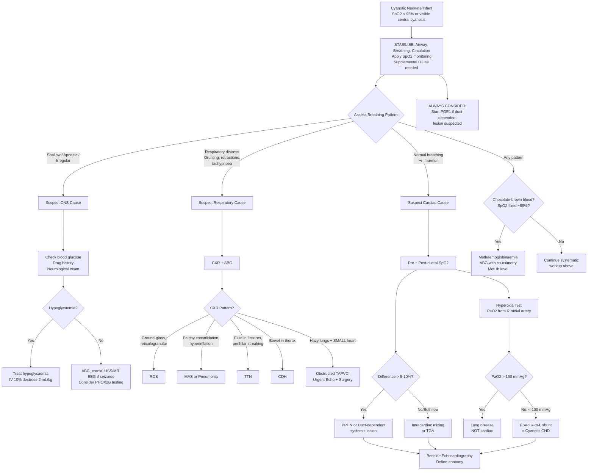

## Diagnostic Criteria, Algorithm, and Investigations for Neonatal/Infant Cyanosis

### Why There Is No Single "Diagnostic Criterion" for Cyanosis

Unlike conditions such as Kawasaki disease or rheumatic fever, neonatal cyanosis is not a diagnosis — it is a **clinical sign** that demands aetiological workup. There is no single validated diagnostic criterion set that says "this is cyanosis." Instead, we use:

1. **Clinical recognition** — visual detection of blue discolouration (central: tongue and mucosa)
2. **Objective confirmation** — pulse oximetry (SpO₂) and arterial blood gas (ABG)
3. **Systematic investigation** — to identify the underlying cause (respiratory vs cardiac vs CNS vs haematological/metabolic)

The closest thing to a formal "diagnostic threshold" in neonatal practice is the **critical congenital heart disease (CCHD) newborn pulse oximetry screening protocol**, which has specific cut-offs (discussed below).

---

### Pulse Oximetry Screening for Critical CHD (Neonates)

This is the standardised screening tool for detecting cyanotic CHD before clinical deterioration, now part of routine neonatal care in many centres including Hong Kong [1][2].

**Protocol (AAP/AHA recommended, adopted in HK)**:
- **Timing**: After 24 hours of age OR before discharge (whichever is first)
- **Site**: ***Right hand (pre-ductal)*** + ***either foot (post-ductal)***
- **Equipment**: Motion-tolerant pulse oximeter

**Interpretation**:

| Result | Interpretation | Action |
|---|---|---|
| **SpO₂ ≥ 95% in either extremity AND ≤ 3% difference** | **Pass (negative screen)** | No further cardiac workup for CCHD |
| **SpO₂ 90–94% in both extremities OR > 3% difference** | **Borderline** | Repeat in 1 hour. If still borderline after 3 screens → **positive** |
| **SpO₂ < 90% in either extremity** | **Immediate positive screen** | Urgent evaluation — do NOT repeat; proceed directly to ***bedside echocardiography*** and clinical assessment [2] |

> The screening targets **7 critical CHDs**: HLHS, pulmonary atresia, TOF, TAPVC, d-TGA, truncus arteriosus, tricuspid atresia. Sensitivity ~76–78% overall; higher for d-TGA and HLHS. Specificity > 99.9%.

<Callout title="Why Screen at > 24 Hours?" type="idea">
In the first hours of life, transitional circulation means many healthy neonates have SpO₂ in the low 90s. Screening too early leads to high false-positive rates. By 24 hours, the normal transition is largely complete, and persistent desaturation is more specific for pathology.
</Callout>

<Callout title="Limitations of Pulse Oximetry" type="error">
- ***MetHb and COHb lead to factitious SpO₂*** — methaemoglobinaemia reads ~85% regardless of true saturation; carboxyhaemoglobin reads ~100% [9][10]. If the clinical picture and SpO₂ don't match, get an ABG with co-oximetry.
- Pulse oximetry **cannot detect pCO₂** — a neonate with type 2 respiratory failure and adequate SpO₂ on O₂ will still have dangerous hypercapnia that only ABG reveals [9].
- Poor perfusion (shock, hypothermia) → unreliable signal. Motion artefact in a crying neonate → false readings.
- Left-sided obstructive lesions (CoA, IAA) may have **normal** pre-ductal SpO₂ and only mildly low post-ductal SpO₂ → lower sensitivity for these lesions.
</Callout>

---

### Clinical Differentiation — The Bedside Framework

***The differentiation between respiratory, cardiovascular, and CNS causes uses clinical assessment, CXR, hyperoxia test, and bedside echocardiography*** [2]:

| Tool | What It Tells You | Key Findings |
|---|---|---|
| ***Clinical assessment (breathing pattern)*** | System involved | ***Shallow/apnoeic → CNS; Respiratory distress → Lung; Normal breathing ± murmur → Heart*** [2] |
| ***CXR*** | Lung parenchyma, heart size, pulmonary blood flow | ***Hazy lungs → respiratory disease OR obstructed TAPVC; Dark oligaemic lungs → cyanotic CHD with ↓pulmonary flow*** [2] |
| ***Hyperoxia (nitrogen washout) test*** | Fixed R-to-L shunt vs parenchymal lung disease | ***PaO₂ > 150 mmHg (> 20 kPa) → lungs; PaO₂ < 100 mmHg (< 15 kPa) → cyanotic CHD*** [2] |
| ***Bedside echocardiography*** | Cardiac anatomy directly | ***Directly visualise cardiac defects if any*** [2] |

---

### The Hyperoxia Test — Detailed Protocol and Interpretation

This deserves its own section because it is a classic exam topic and clinically pivotal.

**Why it works**: If cyanosis is due to lung disease, increasing the alveolar O₂ concentration to ~100% will overcome V/Q mismatch and diffusion impairment — dissolved O₂ bypasses the need for haemoglobin and PaO₂ rises dramatically. If cyanosis is due to a fixed R-to-L intracardiac shunt, the blood that bypasses the lungs never contacts the high alveolar O₂ — so PaO₂ barely changes [2].

**Protocol**:
- ***Method: 100% O₂ × 10 min → monitor PaO₂ from right radial artery*** [2]
  - Why right radial? It is **pre-ductal** (supplied by the ascending aorta before the DA insertion) → avoids confounding by ductal-level shunting
  - Use an ABG, not pulse oximetry — SpO₂ plateaus at ~100% once PaO₂ > 80 mmHg and cannot distinguish PaO₂ of 100 vs 500 mmHg
- Some protocols also simultaneously measure **post-ductal PaO₂** (umbilical artery catheter or left radial/pedal artery) to assess ductal shunting

**Interpretation (neonatal values)**:

| PaO₂ Response (in 100% O₂) | Interpretation | Likely Category |
|---|---|---|
| ***PaO₂ > 150 mmHg (> 20 kPa)*** | O₂ reaches alveoli and diffuses into blood → parenchymal disease responds | ***Lung pathology*** (RDS, TTN, pneumonia, MAS) [2] |
| **PaO₂ 100–150 mmHg** | Intermediate response | Possible PPHN, mixing lesion (TAPVC unobstructed, univentricular), or severe lung disease |
| ***PaO₂ < 100 mmHg (< 15 kPa)*** | Fixed R-to-L shunt — O₂ cannot reach blood that bypasses lungs | ***Cyanotic CHD*** [2] |
| **PaO₂ unchanged at ~40–50 mmHg** | Complete mixing or parallel circuits | d-TGA (especially with intact septum), severe RVOT obstruction |

**Pre-ductal vs post-ductal PaO₂ comparison during hyperoxia test**:

| Pattern | Meaning |
|---|---|
| **Pre-ductal PaO₂ high, post-ductal low** | R-to-L ductal shunt → PPHN or duct-dependent systemic lesion |
| **Both low, no difference** | Intracardiac mixing or transposition (shunting proximal to ductus) |
| **Both high** | Lung disease (no intracardiac or ductal shunt) |

<Callout title="DANGER: Hyperoxia Test and Duct-Dependent Circulation" type="error">
***↑FiO₂ can promote ductal closure in duct-dependent circulation → potentially dangerous!*** [2] High PaO₂ is the most potent stimulus for DA smooth muscle constriction. In a neonate with duct-dependent pulmonary circulation (e.g., pulmonary atresia), ductal closure = cardiovascular catastrophe. **Always have PGE₁ (alprostadil) drawn up and ready before performing the hyperoxia test.** Many modern centres now prefer ***bedside echocardiography*** as the first-line tool to ***directly visualise cardiac defects*** without the risk of ductal closure [2].
</Callout>

---

### Comprehensive Diagnostic Algorithm

---

### Investigation Modalities — Detailed

Now let us go through each investigation in detail, explaining **what it measures**, **why we order it**, and **how to interpret it** in the context of a cyanosed neonate/infant.

#### 1. Pulse Oximetry (SpO₂)

**What it measures**: Functional oxygen saturation of arterial haemoglobin (SpO₂ = OxyHb / [OxyHb + DeoxyHb] × 100%).

**How it works**: Two wavelengths of light (red 660 nm and infrared 940 nm) pass through a pulsatile tissue bed (finger, toe, ear). OxyHb and deoxyHb absorb these wavelengths differently → the ratio of absorption is calibrated to saturation.

**Key paediatric/neonatal considerations**:
- **Placement**: Right hand (pre-ductal) and either foot (post-ductal). In neonates, the sensor wraps around the palm/sole.
- **Normal values**: Term neonate SpO₂ should be ≥ 95% by 10 minutes of life. In the delivery room, SpO₂ rises gradually: ~60% at 1 min → ~90% by 5 min → ≥ 95% by 10 min.

**Interpretation pitfalls**:

| Pitfall | Explanation |
|---|---|
| ***MetHb → SpO₂ reads ~85%*** | MetHb absorbs both wavelengths equally → ratio approaches 1:1 → calibrated as ~85% regardless of true saturation [9][10] |
| ***COHb → SpO₂ reads ~100%*** | COHb absorbs at 660 nm similarly to OxyHb → oximeter cannot distinguish them → falsely high [9][10] |
| **Severe anaemia** | Low Hb → adequate SpO₂ but inadequate O₂ content (CaO₂ = 1.34 × Hb × SaO₂ + 0.003 × PaO₂) → SpO₂ looks fine but tissue hypoxia persists |
| **Poor perfusion / motion artefact** | Unreliable signal → always correlate with clinical assessment |
| **Fetal haemoglobin (HbF)** | HbF has a left-shifted ODC (higher O₂ affinity) — SpO₂ may read slightly higher for a given PaO₂ compared with adult Hb. Modern oximeters are calibrated to account for this, but awareness is important. |

#### 2. Arterial Blood Gas (ABG)

**What it measures**: pH, PaO₂, PaCO₂, HCO₃⁻, base excess (BE), lactate. With co-oximetry: total Hb, OxyHb%, DeoxyHb%, MetHb%, COHb%.

**Why we order it**: SpO₂ alone cannot tell you about ventilation (CO₂), acid-base status, or abnormal haemoglobins. ABG is the gold standard for assessing oxygenation and ventilation.

**Site in neonates**:
- **Right radial artery** (pre-ductal) — preferred for hyperoxia test
- **Umbilical artery catheter (UAC)** — post-ductal (the UAC tip sits in the descending aorta below the DA insertion)
- **Capillary blood gas (CBG)** — from a warmed heel prick; approximates venous/mixed values, useful for pH and pCO₂ but **unreliable for PaO₂** (typically lower than arterial)

**Interpretation framework in a cyanotic neonate**:

| ABG Finding | Interpretation | Think... |
|---|---|---|
| **↓PaO₂ + normal/↓PaCO₂** | Type 1 respiratory failure — V/Q mismatch or shunting | Parenchymal lung disease (RDS, pneumonia), cyanotic CHD |
| **↓PaO₂ + ↑PaCO₂** | Type 2 respiratory failure — global hypoventilation | CNS depression, neuromuscular disease, severe airway obstruction, late-stage respiratory disease [9] |
| **Metabolic acidosis (↓pH, ↓HCO₃⁻, ↑lactate)** | Tissue hypoperfusion / anaerobic metabolism | Shock (duct closure in HLHS/CoA), sepsis, severe hypoxaemia |
| **MetHb% > 1.5%** | Methaemoglobinaemia confirmed | Check for oxidant exposure, consider congenital MetHb reductase deficiency |
| **Normal ABG but clinically cyanosed** | Pseudocyanosis or peripheral cyanosis | Polycythaemia, acrocyanosis, traumatic cyanosis |

**Alveolar-arterial (A-a) gradient** — useful in older infants/children, less commonly calculated in neonates because of the complexity of transitional circulation. Normal A-a gradient in neonates is <20 mmHg on room air.

> A-a gradient = PAO₂ − PaO₂, where PAO₂ = FiO₂ × (Patm − PH₂O) − PaCO₂/R ≈ 0.21 × (760 − 47) − PaCO₂/0.8

- **Normal A-a gradient** with ↓PaO₂ → hypoventilation (CNS cause)
- **↑A-a gradient** with ↓PaO₂ → V/Q mismatch, shunt, or diffusion impairment (lung or cardiac cause) [9]

#### 3. Chest X-Ray (CXR)

The **single most informative first-line imaging** in a cyanotic neonate. A systematic approach:

**Technique**: AP view (neonates are supine). Ideally during inspiration (6 posterior rib interspaces visible above the diaphragm = adequate inspiration). Include the abdomen to assess situs.

**Systematic reading — "ABCDEFGH" approach adapted for neonatal cyanosis**:

| Component | What to Look For | Significance |
|---|---|---|
| **A — Airway** | Tracheal position, ET tube position if intubated | Mediastinal shift (CDH, pneumothorax, effusion) |
| **B — Bones** | Rib anomalies, vertebral anomalies | VACTERL association (if OA/TOF suspected) |
| **C — Cardiac silhouette** | Size (cardiothoracic ratio > 0.6 in neonates = cardiomegaly), shape, position | Boot-shaped (TOF), egg-on-string (TGA), snowman (TAPVC), wall-to-wall (Ebstein) |
| **D — Diaphragm** | Position, integrity | Elevated/absent (CDH), eventration |
| **E — Effusion / Extra-pulmonary** | Pleural fluid, pneumothorax, pneumomediastinum | Air leak (RDS, MAS), chylothorax |
| **F — Fields (Lung parenchyma)** | ***Hazy → respiratory parenchymal disease OR obstructed TAPVC*** [2]. ***Dark/oligaemic → cyanotic CHD with ↓pulmonary flow*** [2]. Plethoric → L-to-R shunt or mixing lesion with ↑pulmonary flow | See pattern recognition below |
| **G — Gastric bubble / Gut** | Situs (left-sided gastric bubble = normal), bowel gas pattern | Situs inversus (a/w complex CHD), bowel gas in thorax (CDH) |
| **H — Hardware** | Lines, tubes (UAC, UVC, ETT, chest drain positions) | Verify position |

**CXR Pattern Recognition — High-Yield for Exams**:

| CXR Pattern | Pulmonary Vascularity | Heart | Diagnosis |
|---|---|---|---|
| ***Ground-glass, reticulogranular, air bronchograms, ↓lung volume*** | — | Normal | ***RDS*** [2] |
| ***Hazy lung fields + small/normal heart*** | Venous congestion | Small | ***Obstructed TAPVC*** (classic trap — mimics RDS!) [2] |
| ***"Boot-shaped" heart (coeur en sabot)*** | ***Oligaemic (dark lungs)*** | Upturned apex, concave PA segment | ***TOF*** [4] |
| ***"Egg on a side/string" + narrow mediastinum*** | ***Plethoric (↑vascular markings)*** | Oval silhouette | ***d-TGA*** [7] |
| ***"Snowman" / figure-of-8*** | Plethoric | Large (dilated vertical vein + SVC) | ***Supracardiac TAPVC (unobstructed)*** |
| ***"Wall-to-wall" cardiomegaly*** | Oligaemic | Massive | ***Ebstein anomaly*** |
| **Cardiomegaly + ↑vascular markings** | Plethoric | Large | Large VSD, PDA with HF, HLHS (before duct closure) [4] |
| **Bowel gas loops in left hemithorax** | — | Shifted rightward | **CDH** |
| **Patchy consolidation + hyperinflation** | — | Normal | **MAS** |
| **Absent thymus** | Variable | Variable | **DiGeorge syndrome** (22q11 deletion — think conotruncal defects: TOF, truncus, IAA type B) [8] |

#### 4. Echocardiography

***Bedside echocardiography directly visualises cardiac defects if any*** [2]. It is the **definitive non-invasive investigation** for identifying cardiac causes of cyanosis and is increasingly used as the **first-line** test (replacing the hyperoxia test in many centres) because it carries no risk of ductal closure.

**What echocardiography provides**:

| Parameter | Clinical Relevance |
|---|---|
| **Structural anatomy** | Identifies specific CHD lesion — chamber sizes, septal defects, valve morphology, great artery connections, venous drainage |
| **Haemodynamic assessment** | Direction and velocity of shunts (Doppler), pressure gradients across stenotic valves, estimation of PA pressure |
| **Ductal status** | Is the PDA open/closing? What direction is the shunt? Size? |
| **Ventricular function** | Ejection fraction, wall motion, presence of myocardial dysfunction |
| **Pulmonary venous drainage** | Essential for TAPVC diagnosis — where do the pulmonary veins drain? |

**Key findings for specific lesions**:

| Lesion | Echo Findings |
|---|---|
| **TOF** | Large perimembranous/malalignment VSD, overriding aorta, infundibular and/or valvar PS, RVH [4] |
| **d-TGA** | Aorta anterior and rightward arising from RV, PA posterior arising from LV, parallel great arteries. Assess size of ASD/VSD/PDA for adequacy of mixing [7] |
| **TAPVC** | No pulmonary veins draining into LA. Identify the anomalous drainage site (SVC, coronary sinus, IVC). Assess for obstruction. |
| **Pulmonary atresia** | No antegrade flow across pulmonary valve. Assess VSD (present in PAVSD vs absent in PAIVS), PDA, RV size, coronary artery pattern (critical in PAIVS — RV-dependent coronary circulation contraindicates RV decompression) |
| **HLHS** | Hypoplastic LV, mitral stenosis/atresia, aortic stenosis/atresia, hypoplastic ascending aorta. R-to-L atrial shunt, PDA supplying descending aorta [4] |
| **CoA** | Narrowing of descending aorta at DA insertion. Doppler shows diastolic run-off (continuous forward flow). Assess associated lesions (bicuspid AV, VSD) [4] |
| **PPHN** | Structurally normal heart. Elevated PA pressure. R-to-L or bidirectional shunting at DA and/or PFO level. TR jet velocity allows PA pressure estimation. |
| ***Univentricular heart*** | ***Demonstrate intracardiac anatomy, arterial relationship with the heart, systemic/pulmonary venous return*** [11] |

#### 5. Electrocardiogram (ECG)

The ECG in a cyanotic neonate must be interpreted in the context of **normal neonatal ECG changes** — RV dominance is normal at birth (RV provides most of the combined ventricular output in utero).

**Normal neonatal ECG features**:
- Heart rate 100–170 bpm
- Right axis deviation (RAD) — normal in neonates (+90° to +180°)
- RV dominance: dominant R wave in V1 (tall R), dominant S in V6
- T wave upright in V1 for the first 3–7 days of life → then inverts (if T remains upright in V1 after 7 days → suggests RVH)

**ECG findings in specific lesions**:

| Lesion | ECG Pattern | Why |
|---|---|---|
| **TOF** | RAD, RVH, right atrial enlargement (RAE, tall peaked P in II) | RV pressure overload from RVOT obstruction |
| **d-TGA** | ***Typically normal for age*** [7] (RV dominance looks normal in a neonate — this is a trap!) | RV is the systemic ventricle but neonatal ECG normally shows RV dominance → ECG is unhelpful for TGA diagnosis |
| **TAPVC** | RAD, RVH, RAE | RV volume overload (all venous return enters RA/RV) |
| **HLHS** | RAD, RVH, absent LV forces | Hypoplastic LV generates no significant electrical vector |
| **Ebstein** | RAE (massive P waves — "Himalayan P"), RBBB, WPW pattern (25% have accessory pathway), low-voltage QRS | Massive RA dilatation from atrialised RV, associated accessory pathways |
| **CoA (neonatal)** | ***RVH*** [4] (because RV is the dominant ventricle supporting systemic circulation via PDA) | |
| **Large VSD / PDA with HF** | LVH ± LAE, ± biventricular hypertrophy if pHTN | LV volume overload from L-to-R shunting |

<Callout title="The d-TGA ECG Trap" type="error">
***In d-TGA, the ECG is typically normal for age*** [7]. A neonate normally has RV dominance — and in TGA, the RV IS the systemic ventricle, so it looks just like a normal neonatal ECG. Do not be falsely reassured by a "normal" ECG in a profoundly cyanosed neonate!
</Callout>

#### 6. Blood Investigations

| Investigation | Purpose | Key Findings |
|---|---|---|
| **Full blood count (FBC/CBC)** | Assess Hb (anaemia vs polycythaemia), WBC (infection), platelet count (DIC, sepsis) | Hct > 65% = polycythaemia (can cause apparent cyanosis); low Hb = anaemia (masks cyanosis) [1] |
| **Blood gas with co-oximetry** | PaO₂, PaCO₂, pH, MetHb%, COHb%, lactate | See ABG section above. MetHb > 1.5% diagnostic of methaemoglobinaemia [5] |
| **Blood glucose** | Exclude hypoglycaemia (causes apnoea/CNS depression → cyanosis) | < 2.6 mmol/L in neonates → treat [2] |
| **Blood culture** | Sepsis workup | Positive in neonatal sepsis (GBS, E. coli, Listeria) |
| **CRP / Procalcitonin** | Inflammatory markers for sepsis/pneumonia | ↑ in infection (CRP rises later; PCT rises earlier) |
| **Serum lactate** | Tissue perfusion marker | ↑ in shock (duct closure), severe hypoxaemia, sepsis |
| **Renal function (Cr, urea, electrolytes)** | Assess end-organ perfusion | ***Severe metabolic acidosis due to ischaemic colitis and AKI upon duct closure*** in CoA/HLHS [4] |
| **Liver function tests** | Hepatic congestion (R heart failure), shock liver | ↑ALT/AST in hepatic congestion or hypoxic liver injury |
| **Coagulation screen** | DIC in sepsis or severe hypoxia | ↑PT/APTT, ↓fibrinogen, ↑D-dimer |
| **G6PD assay** | Relevant in HK (4.5% males) — affects choice of drugs and management of jaundice-related complications | Deficient → avoid oxidants; methylene blue contraindicated for MetHb treatment |

**For suspected IEM (if metabolic cause considered)** [12]:
- Basic: ABG, glucose, lactate, ammonia, urine/blood ketones, electrolytes (anion gap)
- Special: acylcarnitine on dried blood spots, plasma amino acids, urinary organic acids
- Always **store frozen plasma and urine** for further testing if the infant deteriorates or dies [12]

#### 7. Additional Imaging / Advanced Investigations

| Investigation | When to Use | What It Shows |
|---|---|---|
| **Cranial ultrasound** | CNS cause suspected (preterm — IVH; term — HIE) | Intraventricular haemorrhage, periventricular leukomalacia, cerebral oedema |
| **MRI brain** | HIE assessment, structural CNS anomalies | Diffusion restriction in acute HIE, structural malformations (Chiari, Dandy-Walker) |
| **CT angiography / MR angiography** | Complex CHD pre-surgical planning, aortic arch anatomy (CoA, IAA) | 3D anatomy of great vessels, aortic arch, pulmonary arteries, collaterals |
| **Cardiac catheterisation** | Haemodynamic assessment, interventional procedures | Pressures, saturations in each chamber, Qp:Qs calculation; **Rashkind balloon atrial septostomy** for d-TGA; **balloon valvuloplasty** for critical PS |
| **EEG** | Seizures, encephalopathy | Seizure activity (subtle seizures may present as apnoea → cyanosis) |
| **Genetic testing** | Syndromic features, family history | 22q11.2 deletion (DiGeorge — conotruncal defects), chromosomal microarray, PHOX2B (CCHS), trisomies |
| **Endotracheal aspirate culture** | Congenital pneumonia suspected | Identifies organism |
| **EHIDA scan / cholescintigraphy** | Not for cyanosis workup — included for completeness as part of jaundice workup if conjugated hyperbilirubinaemia [13] | Biliary atresia vs neonatal hepatitis |

---

### Putting It All Together: The Stepwise Diagnostic Approach

Let me crystallise the sequence as a senior would teach it on a ward round:

**Step 1 — Recognise and stabilise**
- See the blue baby → ABC (airway, breathing, circulation)
- Apply SpO₂ monitor (pre- and post-ductal)
- Start supplemental O₂ (but cautiously if duct-dependent lesion suspected)
- ***If duct-dependent circulation suspected → start PGE₁ infusion immediately — do NOT wait for echo*** [2][4]

**Step 2 — Rapid clinical assessment**
- Breathing pattern? (distressed → lungs; normal → heart; apnoeic → CNS) [2]
- Pre-post ductal SpO₂ difference? (> 5% → PPHN or ductal shunting)
- Murmur? Absent femoral pulses? Scaphoid abdomen?
- Blood glucose? (rapid bedside check)

**Step 3 — First-line investigations**
- **ABG (right radial)** — with co-oximetry if MetHb suspected
- **CXR** — lung fields + heart size/shape + situs + hardware
- **Bedside echocardiography** — structural cardiac anatomy

**Step 4 — Hyperoxia test (if echo not immediately available)**
- ***100% O₂ × 10 min → PaO₂ from right radial artery*** [2]
- Have PGE₁ ready
- Interpret: > 150 mmHg = lungs; < 100 mmHg = cardiac [2]

**Step 5 — Targeted investigations based on working diagnosis**
- Cardiac → detailed echo, ECG, consider catheterisation
- Respiratory → further imaging (CT if CDH complex), cultures, surfactant trial for RDS
- CNS → cranial USS, MRI, EEG, drug levels, PHOX2B testing
- MetHb → co-oximetry, MetHb level, G6PD assay before methylene blue
- Sepsis → blood culture, CRP/PCT, LP if indicated, antibiotics
- Metabolic → ammonia, lactate, amino acids, organic acids, acylcarnitine [12]

---

<Callout title="High Yield Summary — Diagnostics">

1. **Pulse oximetry screening**: SpO₂ < 90% = immediate positive; 90–94% or > 3% pre-post ductal difference = borderline → repeat; ≥ 95% and ≤ 3% difference = pass
2. ***Hyperoxia test***: 100% O₂ × 10 min via right radial ABG. PaO₂ > 150 = lungs; < 100 = cardiac. DANGER: can close the ductus [2]
3. ***Bedside echo directly visualises cardiac defects*** — increasingly first-line over hyperoxia test [2]
4. **CXR is your best friend**: boot-shaped = TOF; egg-on-string = TGA; snowman = TAPVC; hazy lungs + small heart = obstructed TAPVC; wall-to-wall = Ebstein
5. **ECG trap**: d-TGA has a ***normal ECG for age*** — don't be falsely reassured [7]
6. **MetHb**: SpO₂ reads ~85% regardless of FiO₂ → get ABG with co-oximetry [9]
7. **ABG co-oximetry** is the only way to definitively diagnose MetHb and COHb
8. **Always check blood glucose** — hypoglycaemia causes CNS depression → apnoea → cyanosis
9. **Store frozen plasma and urine** if IEM suspected — critical for posthumous diagnosis [12]
10. **Start PGE₁ BEFORE echo** if duct-dependent lesion suspected clinically
</Callout>

---

<ActiveRecallQuiz
  title="Active Recall - Diagnostics for Neonatal/Infant Cyanosis"
  items={[
    {
      question: "In the newborn pulse oximetry screening for critical CHD, what are the criteria for a positive screen and what action should follow?",
      markscheme: "Positive screen: SpO2 < 90% in either extremity at any time = immediate positive, OR SpO2 90-94% in both extremities or > 3% pre-post ductal difference on three screens one hour apart. Action: urgent clinical evaluation and bedside echocardiography to identify structural cardiac defects."
    },
    {
      question: "A cyanosed neonate has a pulse oximetry reading of 85% that does not change despite 100% supplemental oxygen. ABG shows PaO2 of 60 mmHg. What is the most likely explanation for the SpO2 reading, and what specific blood test confirms it?",
      markscheme: "Methaemoglobinaemia. MetHb absorbs both red and infrared wavelengths equally, causing the oximeter to read a fixed value around 85% regardless of true saturation. Confirmed by ABG with co-oximetry showing elevated MetHb percentage (normally < 1.5%). The actual PaO2 may be much higher than the SpO2 suggests because PaO2 reflects dissolved O2, not haemoglobin binding."
    },
    {
      question: "Explain why the ECG is unhelpful for diagnosing d-TGA in a neonate, and what investigation is definitive.",
      markscheme: "In d-TGA, the RV is the systemic ventricle and is under high pressure, producing right ventricular dominance on ECG. However, all normal neonates have RV dominance because the RV was the dominant ventricle in utero. Therefore the TGA ECG looks normal for age and is not diagnostically useful. Echocardiography is definitive, showing the aorta arising anteriorly from the RV and the PA posteriorly from the LV."
    },
    {
      question: "A term neonate presents with cyanosis and respiratory distress. CXR shows bilateral hazy lung fields and a normal-to-small heart size. The neonatology team diagnoses RDS and gives surfactant, but there is no improvement. What diagnosis should you now consider, and how do you confirm it?",
      markscheme: "Obstructed TAPVC, especially the infracardiac type. The hazy lung fields are due to pulmonary venous congestion from obstructed drainage, not surfactant deficiency, which is why surfactant does not help. Also the baby is term, making RDS unlikely. Confirm with bedside echocardiography showing no pulmonary veins draining into the left atrium and anomalous drainage with evidence of obstruction. This is a surgical emergency."
    },
    {
      question: "During a hyperoxia test, PaO2 from the right radial artery is 180 mmHg while PaO2 from the umbilical artery catheter is 45 mmHg. What does this pattern indicate?",
      markscheme: "Pre-ductal PaO2 is high (responding to O2) but post-ductal PaO2 is low. This indicates right-to-left shunting at the level of the ductus arteriosus. The most likely diagnoses are PPHN or a duct-dependent systemic circulation lesion (e.g., critical coarctation, interrupted aortic arch). The lungs can oxygenate blood normally (hence high pre-ductal PaO2) but deoxygenated blood from the PA enters the descending aorta via the PDA."
    }
  ]}
/>

## References

[1] Lecture slides: GC 147. Heart failure and cyanosis in children acyanotic and cyanotic congenital heart disease - Part 2.pdf (pp. 2, 4)
[2] Senior notes: Adrian Lui Pediatrics.pdf (p. 195)
[4] Senior notes: Ryan Ho Cardiology.pdf (pp. 187–191)
[5] Senior notes: Ryan Ho Chemical Path.pdf (p. 38)
[7] Senior notes: Adrian Lui Pediatrics.pdf (p. 219)
[8] Senior notes: Adrian Lui Pediatrics.pdf (p. 212)
[9] Senior notes: Ryan Ho Fundamentals.pdf (pp. 230, 232)
[10] Senior notes: Ryan Ho Respiratory.pdf (pp. 5, 31)
[11] Senior notes: Adrian Lui Pediatrics.pdf (p. 222)
[12] Senior notes: Ryan Ho Chemical Path.pdf (p. 56)
[13] Senior notes: Ryan Ho Diagnostic Radiology.pdf (p. 64)
