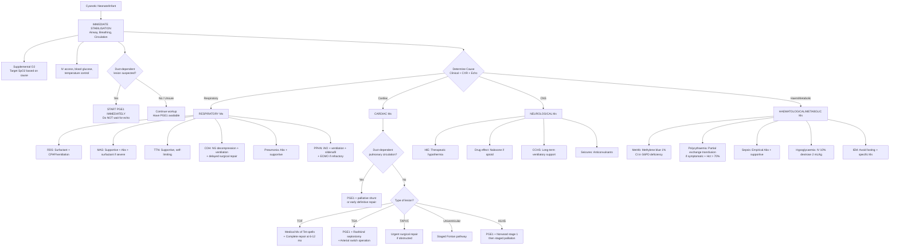

## Management of Neonatal/Infant Cyanosis

### Management Philosophy — First Principles

Managing a cyanotic neonate is not about treating "the blue colour." Cyanosis is a sign — the management is entirely directed at the **underlying cause**. However, there are universal stabilisation principles that apply to every cyanotic baby regardless of aetiology, and then cause-specific definitive treatments.

The overarching framework from the lecture slides [1]:

> ***Identification of the cause and precipitating factors → Tackling of precipitating factors → General supportive management → Medical therapy → Treatment of underlying cause by surgical or catheter intervention → Mechanical circulatory support and heart transplantation*** [1]

---

### Master Management Algorithm

---

### Phase 1: Immediate Stabilisation (All Causes)

This is a paediatric emergency — the first minutes determine outcome. Use the **ABCDE framework** [14]:

#### A — Airway
- Position: neutral ("sniffing") position in neonates (avoid neck hyperextension — the large occiput naturally flexes the neck)
- Suction oropharynx if secretions/meconium
- In CDH: **immediate intubation** — avoid bag-mask ventilation (inflates bowel in thorax → worsens lung compression)
- In choanal atresia: oral airway or intubation (neonates are obligate nasal breathers)

#### B — Breathing
- **Supplemental O₂**: Start with appropriate FiO₂ for the clinical context
  - **Respiratory cause**: FiO₂ titrated to SpO₂ 91–95% (preterm) or 95%+ (term)
  - **Cardiac cause (suspected duct-dependent)**: ***Caution with high FiO₂*** — supplemental O₂ is a potent stimulus for ductal closure → ***↑FiO₂ can promote ductal closure in duct-dependent circulation → potentially dangerous!*** [2]. Target SpO₂ 75–85% in known duct-dependent pulmonary lesions (just enough to prevent severe tissue hypoxia without provoking ductal constriction)
  - **PPHN**: Higher FiO₂ acceptable (pulmonary vasodilation is desired)
- **CPAP** (continuous positive airway pressure): First-line respiratory support for RDS, TTN
- **Mechanical ventilation**: If CPAP fails, severe respiratory distress, apnoea, or CDH

<Callout title="O₂ — Friend or Foe?" type="error">
***In large L-to-R shunts: O₂ caution — ↑PAO₂ → pulmonary vasodilation → ↓PVR → ↑shunting*** [15]. In duct-dependent pulmonary lesions: high O₂ can close the ductus. The correct response is **NOT** to blast every blue baby with 100% O₂ — you must think about the pathophysiology first. When in doubt, start moderate O₂ and have PGE₁ ready.
</Callout>

#### C — Circulation
- **IV access**: Preferably two lines (one for PGE₁ if needed, one for fluids/drugs)
- **Volume status**: 10 mL/kg 0.9% NaCl bolus if signs of hypovolaemia/shock (use cautiously if cardiac cause — excess fluid worsens heart failure)
- **Blood glucose**: Rapid bedside check → if < 2.6 mmol/L → **IV 10% dextrose 2 mL/kg bolus** then maintenance
- **Temperature**: Maintain normothermia (36.5–37.5°C). Hypothermia worsens acidosis and increases oxygen consumption. Exception: therapeutic hypothermia for HIE (target 33.5°C).

#### D — Disability
- Brief neurological assessment: tone, fontanelle, pupillary responses, seizure activity
- If seizures → phenobarbital 20 mg/kg IV loading dose (first-line neonatal anticonvulsant)

#### E — Exposure
- Full examination for syndromic features (DiGeorge, Down), dysmorphism, scaphoid abdomen (CDH)

---

### Phase 2: The Critical Decision — Prostaglandin E₁ (PGE₁ / Alprostadil)

This is the single most important pharmacological intervention in neonatal cyanosis of cardiac origin.

#### Why PGE₁ Works

The ductus arteriosus (DA) is kept patent in fetal life by low PaO₂ and circulating PGE₂. After birth, ↑PaO₂ + ↓PGE₂ trigger ductal closure. PGE₁ (alprostadil) is a synthetic prostaglandin that **reverses this closure** by relaxing ductal smooth muscle via EP₄ receptors → cAMP-mediated smooth muscle relaxation [4].

#### Indications

***IV PGE₁ with early shunting in neonates with profound obstruction presenting with cyanosis*** [3][4]:

| Indication | Examples | Mechanism of Benefit |
|---|---|---|
| **Duct-dependent pulmonary circulation** | Pulmonary atresia (PAIVS, PAVSD), critical PS, severe TOF | Maintains PDA → allows aortic blood to flow L-to-R into PA → maintains pulmonary blood flow |
| **Duct-dependent systemic circulation** | Critical CoA, HLHS, interrupted aortic arch (IAA) | Maintains PDA → allows RV blood to flow R-to-L into descending aorta → maintains systemic perfusion to lower body [4][8] |
| **Transposition physiology** | d-TGA (especially with intact septum) | Maintains PDA → provides an additional site for intercirculatory mixing |

#### Dosing (Paediatric)

| Parameter | Details |
|---|---|
| **Drug** | Alprostadil (prostaglandin E₁) |
| **Route** | Continuous IV infusion (central line preferred; can use peripheral while awaiting central access) |
| **Starting dose** | **0.01–0.05 mcg/kg/min** (start low if baby is stable) |
| **Rescue dose** | Up to **0.1 mcg/kg/min** if no response (higher doses rarely needed and increase side effects) |
| **Maintenance** | Once duct is confirmed open on echo, wean to lowest effective dose (often 0.01 mcg/kg/min) |

#### Side Effects (Must Know)

| Side Effect | Mechanism | Management |
|---|---|---|
| ***Apnoea*** (12%) | PGE₁ acts on brainstem respiratory centres → ↓respiratory drive | **Have intubation equipment ready at bedside**. Elective intubation if transferring baby. |
| **Hypotension** | Systemic vasodilation (PGE₁ is a vasodilator) | Volume expansion, ↓infusion rate, vasopressors if needed |
| **Fever** | Prostaglandin-mediated thermoregulatory effect | Monitor temperature; rarely requires specific treatment |
| **Flushing** | Cutaneous vasodilation | Benign |
| **Jitteriness/seizures** | Rare; CNS effect | Anticonvulsants if prolonged |
| **Platelet dysfunction** | PGE₁ inhibits platelet aggregation | Monitor for bleeding |
| **Cortical hyperostosis** | Long-term PGE₁ use (> 3–4 weeks) → periosteal proliferation | Seen only with prolonged infusion; wean ASAP |

<Callout title="PGE₁ — The Golden Rule" type="error">
**If you suspect a duct-dependent lesion, START PGE₁ FIRST, then confirm with echo.** A baby dying from ductal closure will not survive long enough for the echo to be done. The side effects (mainly apnoea) are manageable; ductal closure in these lesions is fatal. ***Always have intubation equipment ready when starting PGE₁.***
</Callout>

#### Contraindications / Cautions

- **Not indicated** in babies with clearly respiratory-only pathology (e.g., TTN, isolated pneumonia without PPHN)
- **Relative caution** in babies where increased pulmonary blood flow is harmful (e.g., unobstructed TAPVC — PGE₁ may worsen pulmonary congestion). However, the benefit of maintaining systemic output often outweighs this risk.

---

### Phase 3: Cause-Specific Definitive Management

#### A. Respiratory Causes

| Condition | Management | Key Details |
|---|---|---|
| **TTN** | ***Supportive, self-limiting*** [2]. O₂ as needed, ± CPAP, fluid restriction if severe. | ***Usu resolves in 12–72h*** [2]. Consider pneumonia if tachypnoea persists > 4–6h [16] |
| **RDS** | **Surfactant replacement** (natural surfactant via ETT, e.g., poractant alfa / beractant) + **CPAP** (first-line) or mechanical ventilation | Surfactant ↓surface tension → re-expands atelectatic alveoli → ↑gas exchange. Antenatal corticosteroids (betamethasone 12 mg IM × 2 doses 24h apart to mother) accelerate fetal lung maturity if preterm delivery anticipated [2] |
| **MAS** | ***Supportive: O₂, ventilation, airway suction, fluid resuscitation*** [16]. ***Empirical Abx*** (difficult to d/dx from pneumonia). ***Surfactant: only when severe respiratory failure*** [16] | ***No routine suction/intubation for those with MSL → treat those with symptoms only*** [16]. If severe → may develop PPHN → treat with iNO/ECMO |
| **Congenital pneumonia** | Empirical antibiotics: **ampicillin + gentamicin** (covers GBS + gram-negatives) ± specific Abx based on culture. Supportive O₂/ventilation. | Duration guided by culture results and clinical response (typically 7–14 days) |
| **CDH** | ***NG tube suction: ↓distension of intrathoracic bowel*** [16]. Gentle ventilation (avoid high pressures). **Correct PPHN** (iNO, inotropes). **Delayed surgical repair** (only after stabilisation — usually 24–72h). | Surgery: direct repair of diaphragmatic defect ± muscle flap for large defects [6]. ECMO if refractory hypoxaemia. Antenatal: ***FETO procedure (foetal endoscopic tracheal occlusion)*** in severe cases [6] |
| **Pneumothorax** | Small/asymptomatic: observation + high-flow O₂ ("nitrogen washout" to resorb air). Tension/symptomatic: **needle thoracocentesis** (2nd ICS MCL) then **chest drain** | In neonates use a 22G butterfly needle for emergent decompression; chest drain 8–12 Fr |

#### B. Cardiovascular Causes — Specific Lesion Management

##### Tetralogy of Fallot (TOF)

**The management depends on the degree of RVOT obstruction** [3][4]:

| Scenario | Management |
|---|---|
| **Neonatal with profound RVOT obstruction** | ***IV PGE₁ with early shunting*** [3][4] |
| ***Severe cyanosis or uncontrolled Tet spells in neonates*** | ***Palliative: Modified Blalock-Taussig shunt (mBTS)*** — ***synthetic graft from innominate/subclavian to ipsilateral PA → allows L-to-R shunting → provides adequate pulmonary flow*** [3][4]. ***Transcatheter ductal/RVOT stenting in some centres*** [3][4]. ***Always listen for shunt murmur on F/U → blocked B-T shunt can kill*** [3][4] |
| **Mild RVOT obstruction ("pink Fallot" with HF)** | ***Medical Mx of HF*** — diuretics, digoxin, nutritional support. ***Avoid ACEI/ARB → ↓SVR → trigger Tet spells*** [3][4] |
| ***Complete repair: usually at 6–12 months (ideal)*** | ***VSD patch closure + enlargement of RVOT*** by resecting infundibular and subinfundibular muscle bundles ***± transannular patch*** [3][4] |
| **Long-term complication** | ***Pulmonary regurgitation as principal late complication*** (especially if transannular patch → ***obligatory PR***). Mx: ***pulmonary valve replacement*** if (1) ***MRI shows RVH + > 25% regurgitant fraction*** or (2) ***symptomatic (RV failure, arrhythmia)*** [3][4] |

***Prognosis: good after complete repair — 93% 25-year survival*** [3][4]

**Management of Hypercyanotic (Tet) Spells** — this is an acute emergency:

| Step | Action | Mechanism |
|---|---|---|
| 1 | **Knee-chest position** (infant held against parent's chest with knees tucked up) | ↑SVR (kinks femoral arteries) → ↓R-to-L shunting. ↑venous return → ↑preload → ↑pulmonary flow |
| 2 | **Calm the infant** (minimise crying/distress) | Crying ↑intrathoracic pressure → worsens dynamic RVOT obstruction |
| 3 | **O₂ by face mask** | ↓hypoxaemia (modest benefit given the fixed shunt, but ↑alveolar O₂ helps whatever pulmonary flow remains) |
| 4 | **IV morphine 0.1 mg/kg** | Sedation (↓catecholamines → ↓infundibular spasm), mild venoconstriction (↑preload) |
| 5 | **IV fluid bolus 10–20 mL/kg 0.9% NaCl** | ↑preload → ↑RV filling → ↑pulmonary flow |
| 6 | **IV phenylephrine 5–10 mcg/kg** (α-agonist) | ↑SVR → ↓R-to-L shunting across VSD |
| 7 | **IV propranolol 0.01–0.1 mg/kg** (given slowly) | Relaxes infundibular muscle spasm. Also ↓HR → ↑diastolic filling time |
| 8 | **IV sodium bicarbonate** (1–2 mEq/kg) if acidotic | Corrects metabolic acidosis (acidosis ↑PVR → worsens shunting) |
| 9 | **Emergency surgery** (mBTS or complete repair) if refractory | Definitive relief of RVOT obstruction |

<Callout title="Tet Spell — Why the Murmur Disappears" type="idea">
During a Tet spell, near-complete RVOT obstruction occurs → almost no blood crosses the RVOT → the ESM from PS becomes softer or vanishes. ***Unlike valvar PS, ↑obstruction → ↑shunting → ↓pulmonary flow → ↓murmur*** [4]. If the murmur returns, the spell is breaking. If it doesn't — the baby is in serious trouble.
</Callout>

##### d-Transposition of Great Arteries (d-TGA)

| Phase | Management |
|---|---|
| **Immediate** | **PGE₁** to maintain PDA and provide mixing |
| **Emergency** | ***Rashkind balloon atrial septostomy*** — catheter-based tearing of the atrial septum to create/enlarge the ASD → improves intercirculatory mixing. Done at bedside under echo guidance. |
| ***Definitive surgery*** | ***Arterial switch operation (ASO / Jatene)*** — ideally within the ***first 2 weeks of life*** (before the LV involutes — in TGA, the LV pumps against low-resistance pulmonary circulation and loses muscle mass rapidly). Procedure: great arteries are transected and reconnected to the correct ventricles + coronary artery reimplantation. |
| **d-TGA with VSD** | ASO can be delayed slightly (VSD maintains LV pressure → LV remains conditioned) but still ideally within 4–6 weeks |

##### Totally Anomalous Pulmonary Venous Connection (TAPVC)

| Type | Management |
|---|---|
| ***Obstructed TAPVC*** | ***Surgical emergency*** — urgent surgical repair (reconnect pulmonary veins to LA). No benefit from PGE₁ (may worsen pulmonary congestion). No medical temporisation works — this baby needs an operating theatre. |
| **Unobstructed TAPVC** | Semi-urgent surgical repair (within weeks). Medical stabilisation with diuretics and O₂ if needed. |

##### Hypoplastic Left Heart Syndrome (HLHS)

| Phase | Management |
|---|---|
| **Immediate** | ***PGE₁*** (duct-dependent systemic circulation). Avoid supplemental O₂ (↓PVR → steals blood from systemic circuit via PDA). Target SpO₂ 75–85%. |
| **Stage 1: Norwood procedure** (neonatal) | Reconstruction of aortic arch using PA tissue, creation of reliable source of pulmonary blood flow (mBTS or Sano shunt = RV-to-PA conduit), atrial septectomy |
| **Stage 2: Glenn / hemi-Fontan** (4–6 months) | Superior cavopulmonary anastomosis: SVC connected directly to PA. Removes volume load from single ventricle. |
| **Stage 3: Fontan completion** (2–4 years) | Total cavopulmonary connection: IVC flow also directed to PA via extracardiac conduit. All systemic venous return now flows passively to lungs without a pumping ventricle. |
| **Alternative** | Heart transplantation (limited by donor availability in neonates) |

##### Univentricular Heart

***Management follows the staged Fontan pathway*** [11]:

| Phase | Procedure | Goal |
|---|---|---|
| **Neonatal** | ***Pre-Fontan palliative procedure to ensure adequate but not excessive pulmonary flow*** [11] | Balance Qp:Qs |
| | ***Modified Blalock-Taussig shunt*** — for inadequate pulmonary flow (cyanosis) [11] | ↑Pulmonary flow |
| | ***Pulmonary arterial banding*** — for excessive pulmonary flow (heart failure) [11] | ↓Pulmonary flow |
| **4–6 months** | Bidirectional Glenn (superior cavopulmonary anastomosis) | Offload volume from single ventricle |
| **2–4 years** | Fontan completion (total cavopulmonary connection) | Definitive palliation — passive pulmonary flow |

***mBTS indications*** [11]:
- ***Pre-repair TOF with severe cyanosis or uncontrolled Tet spell***
- ***PAVSD with duct dependence***
- ***PAIVS before Fontan operation***
- ***Univentricular heart with inadequate pulmonary flow***

***PA banding indications*** [11]:
- ***Multiple muscular VSD with significant L-to-R shunt***
- Univentricular heart with excessive pulmonary flow

##### Critical Coarctation of Aorta (CoA)

***Urgent PGE₁ infusion + inotropes (to maintain CO) in critical CoA followed by early surgical repair ( < 3 months)*** [4]:

| Modality | Details |
|---|---|
| **Surgical repair** | ***Resection with end-to-end anastomosis*** for discrete CoA. ***Subclavian flap aortoplasty*** for long-segment. ***Bypass graft*** if too long for primary anastomosis [4] |
| **Balloon angioplasty** | ***Generally not used for those < 4 months due to small size → poor results*** [4]. Used for re-coarctation or older children with discrete CoA |
| **Stent placement** | ***Generally indicated after surgical repair or angioplasty for those ≥ 25 kg*** [4]. Requires repeated re-intervention as child grows |

##### Ebstein Anomaly

***Short course IV PGE₁ infusion for those with severe neonatal cyanosis when PVR is high*** [17]. As PVR naturally drops over the first weeks, pulmonary flow improves and cyanosis may lessen.

- **Mild**: No surgery, medical follow-up
- ***Biventricular repair***: ***Majority of patients when there is significant cyanosis or HF*** — includes ***TV repair or replacement, RA reduction surgery, closure of ASD/PFO, ablation of accessory pathways*** [17]
- ***Univentricular repair***: ***When not compatible with biventricular physiology*** — ***neonates/infants with extremely severe TV malformation*** → ***closure of TV → enlargement of atrial communication → systemic-pulmonary shunt → staged Fontan*** [17]

##### Truncus Arteriosus

***Cyanosis usually mild. Heart failure symptoms predominate as pulmonary vascular resistance decreases after birth*** [1]. Management: surgical repair in the neonatal period (separation of PA from truncal root, VSD closure, RV-to-PA conduit).

#### C. PPHN

***Management*** [16]:
- ***Supportive care: O₂, intubation, ventilation, circulatory support***
- ***Treat underlying lung condition: e.g., surfactant for RDS***
- ***Pulmonary vasodilators for severe cases: inhaled nitric oxide (iNO, 1st line), enteral sildenafil***
- ***ECMO: for severe cases refractory to iNO*** (~40% severe cases remain hypoxaemic on iNO + max ventilation) [16]

**Why iNO works**: NO activates guanylate cyclase in pulmonary vascular smooth muscle → ↑cGMP → smooth muscle relaxation → ↓PVR. Being inhaled, it acts selectively on ventilated lung regions → improves V/Q matching. It is rapidly inactivated by Hb in the bloodstream → minimal systemic vasodilation.

**Why sildenafil**: PDE-5 inhibitor → prevents breakdown of cGMP → potentiates NO effect → sustained pulmonary vasodilation. Name breakdown: "sildenafil" — a PDE-5 inhibitor originally developed for angina/HTN, repurposed for pulmonary hypertension.

#### D. Neurological Causes

| Condition | Management |
|---|---|
| **HIE** | **Therapeutic hypothermia** (whole-body cooling to 33.5°C for 72h, started within 6h of birth) → ↓cerebral metabolic rate, ↓excitotoxicity, ↓apoptosis. Supportive: ventilation, seizure control, normoglycaemia, avoid hyperthermia. |
| **Maternal opioids/pethidine** | **Naloxone 0.1 mg/kg IV/IM** — opioid antagonist. Monitor for recurrence (naloxone half-life shorter than most opioids). Ventilatory support as needed. |
| **CCHS** | Long-term ventilatory support (usually during sleep — these children breathe adequately while awake). Home ventilation via tracheostomy + ventilator, or diaphragm pacing. Genetic counselling (PHOX2B). |
| **Seizures** | Phenobarbital 20 mg/kg IV (first-line neonatal anticonvulsant). Second-line: phenytoin/fosphenytoin 20 mg/kg, or levetiracetam. Treat underlying cause. |

#### E. Haematological/Metabolic Causes

| Condition | Management | Key Points |
|---|---|---|
| **Methaemoglobinaemia** | **IV 1% methylene blue 1–2 mg/kg** over 5 min. Repeat once if needed. Supplemental O₂. | Methylene blue is an electron carrier → accepts electrons from NADPH (generated via G6PD pathway) → reduces MetHb (Fe³⁺) back to Hb (Fe²⁺). ***Contraindicated in G6PD deficiency*** — no NADPH → methylene blue cannot function AND may itself cause oxidative haemolysis. Alternative in G6PD deficiency: **ascorbic acid** (less effective, slow). |
| **Polycythaemia (symptomatic)** | **Partial exchange transfusion** with 0.9% NaCl (isovolaemic haemodilution) if venous Hct > 70% with symptoms (cyanosis, poor feeding, jitteriness, hypoglycaemia) | Volume to exchange = blood volume × (observed Hct − desired Hct) / observed Hct. Target Hct ~55–60%. |
| **Neonatal sepsis** | **Empirical antibiotics**: ampicillin + gentamicin (early-onset) or vancomycin + gentamicin/cefotaxime (late-onset). Volume resuscitation. Inotropes for shock. | Blood culture BEFORE antibiotics. LP if clinically stable enough. |
| **Hypoglycaemia** | **IV 10% dextrose 2 mL/kg bolus** then maintenance infusion (glucose infusion rate 6–8 mg/kg/min). Frequent monitoring. | If refractory: investigate for hyperinsulinism, GH deficiency, cortisol deficiency, IEM |
| **IEM** | ***Avoid fasting*** [18]. Ensure sufficient energy supply. Specific treatment depending on diagnosis (e.g., special diet, cofactors, ERT). ***Sick day management: special attention in minor ailments*** [18] | ***Store frozen plasma and urine*** for further investigation [12] |

---

### Paediatric Heart Failure Medical Therapy (Applicable When HF Accompanies Cyanosis)

***Management of paediatric heart failure*** [1][15]:

| Stage | Treatment |
|---|---|
| ***Stage A*** (at risk, no symptoms) | ***No specific treatment*** [15] |
| ***Stage B*** (structural disease, no symptoms) | ***ACEI/ARB + beta-blocker (e.g., carvedilol)*** [15] |
| ***Stage C*** (symptomatic HF) | ***ACEI/ARB + BB + MRA ± diuretics for fluid overload*** [15] |
| ***Stage D*** (refractory HF) | ***Above + IV inotropes (e.g., dobutamine), diuretics, non-drug Tx*** [15] |

***Other potentially useful drugs*** [15]:
- ***Vasodilators: IV nitroprusside, nitroglycerin***
- ***Inodilators (inotrope + dilator): amrinone, milrinone*** — milrinone is widely used in paediatric cardiac ICU; PDE-3 inhibitor → ↑cAMP → ↑contractility + vasodilation
- ***Digoxin: seldom used due to narrow therapeutic index*** [15]

***General supportive measures for paediatric HF*** [15]:
- ***Bed rest with elevation of bed head → improve lung function***
- ***Nutritional support: high caloric diet due to ↑metabolic demand***
- ***Fluid restriction***
- ***O₂: caution in large L-to-R shunt*** (↑PAO₂ → pulmonary vasodilation → ↓PVR → ↑shunting) [15]
- ***Exercise and activity: balance basic physical activity vs risk*** [15]

***For refractory cases*** [15]:
- ***Mechanical circulatory support (e.g., IABP, LVAD, ECMO) for potentially reversible pump dysfunction***
  - ***Indications: myocarditis, post-cardiopulmonary bypass myocardial dysfunction*** [15]
- ***Non-pharmacological Tx for advanced HF: NIV, CRT, heart transplantation*** [15]

---

### Summary of Surgical/Interventional Procedures

| Procedure | Description | Indications |
|---|---|---|
| ***Modified Blalock-Taussig shunt (mBTS)*** | Synthetic graft from innominate/subclavian artery to ipsilateral PA | Duct-dependent pulmonary circulation, severe TOF, PAVSD, PAIVS, univentricular heart with ↓pulmonary flow [3][4][11] |
| ***Pulmonary artery banding*** | Restrictive band around PA to limit excessive pulmonary flow | Multiple muscular VSDs, univentricular heart with excessive pulmonary flow [11] |
| ***Rashkind balloon atrial septostomy*** | Catheter-based creation/enlargement of ASD | d-TGA (to improve intercirculatory mixing) |
| ***Arterial switch operation (Jatene)*** | Transection and reconnection of great arteries to correct ventricles + coronary reimplantation | d-TGA (definitive repair within first 2 weeks) |
| ***Norwood procedure*** | Arch reconstruction, atrial septectomy, systemic-to-pulmonary shunt | HLHS (stage 1 neonatal palliation) |
| ***Glenn procedure*** | SVC-to-PA anastomosis | Stage 2 single ventricle palliation (4–6 months) |
| ***Fontan completion*** | IVC-to-PA conduit (total cavopulmonary connection) | Stage 3 single ventricle palliation (2–4 years) |
| ***Complete TOF repair*** | VSD patch closure + RVOT resection ± transannular patch | ***Usually at 6–12 months (ideal)*** [3][4] |
| **TAPVC repair** | Reconnection of pulmonary veins to LA | Obstructed TAPVC (emergency), unobstructed (semi-urgent) |
| ***Neonatal balloon valvuloplasty*** | Catheter-based dilation of stenotic valve | ***Critical PS, critical AS*** [19] |
| ***PGE₁ infusion*** | Pharmacological maintenance of PDA patency | All duct-dependent lesions |

---

### Family-Centred Care and Communication

- **Explain the diagnosis simply**: "Your baby's heart has a problem with how the blood flows, which means not enough oxygen is getting around the body. We are giving a medicine through the drip to keep an important blood vessel open while we plan the next steps."
- **Consent**: All surgical/catheter interventions require informed parental consent. In emergencies (e.g., Rashkind septostomy for d-TGA with profound cyanosis), proceed under emergency provisions and inform parents as soon as possible.
- **Involve parents**: Encourage skin-to-skin contact when haemodynamically stable. Express breast milk for NG/oral feeds. Allow parents to be present during procedures when safe.
- **Psychosocial support**: Social worker referral for families of babies with complex CHD (long hospitalisations, multiple surgeries). Support groups. Screen for postnatal depression.
- **Developmental follow-up**: Babies with cyanotic CHD are at high risk for neurodevelopmental delay — ensure referral to developmental paediatrics and early intervention programmes.

---

<Callout title="High Yield Summary — Management">

1. ***Start PGE₁ immediately if duct-dependent lesion suspected*** — do NOT wait for echo. Have intubation equipment ready (apnoea risk). Dose: 0.01–0.05 mcg/kg/min IV.
2. ***Avoid high FiO₂ in duct-dependent pulmonary lesions*** (promotes ductal closure) and in ***large L-to-R shunts*** (↓PVR → ↑shunting).
3. **TOF management**: PGE₁ if neonatal/severe → mBTS if needed → complete repair at 6–12 months. ***Avoid ACEI/ARB → ↓SVR → triggers Tet spells.***
4. **Tet spell**: Knee-chest position → calm → O₂ → morphine → IV fluids → phenylephrine → propranolol → sodium bicarbonate → emergency surgery if refractory.
5. **d-TGA**: PGE₁ → Rashkind septostomy → arterial switch operation within 2 weeks.
6. **Obstructed TAPVC**: Immediate surgical repair — no medical temporisation works.
7. **HLHS**: PGE₁ → Norwood → Glenn → Fontan (staged single-ventricle pathway).
8. **PPHN**: iNO (first-line) → sildenafil → ECMO if refractory.
9. **MetHb**: IV methylene blue 1–2 mg/kg — CI in G6PD deficiency.
10. **Paediatric HF**: staged medical therapy (ACEI/ARB + BB + MRA + diuretics). Milrinone for acute decompensation. ***Digoxin seldom used due to narrow TI.***
</Callout>

---

<ActiveRecallQuiz
  title="Active Recall - Management of Neonatal/Infant Cyanosis"
  items={[
    {
      question: "A neonate with suspected duct-dependent pulmonary circulation is started on PGE1. Name the most important side effect to anticipate and the specific preparation required at bedside.",
      markscheme: "Apnoea (occurs in approximately 12% of neonates on PGE1 due to effect on brainstem respiratory centres). Must have intubation equipment ready at bedside and personnel trained in neonatal intubation. If transferring the baby, elective intubation before transport is recommended."
    },
    {
      question: "A 3-month-old infant with known TOF develops sudden profound cyanosis, becomes limp, and the previously audible ESM at LUSB disappears. Outline the stepwise emergency management.",
      markscheme: "This is a hypercyanotic Tet spell. Steps: (1) Knee-chest position, (2) Calm the infant and minimise stimulation, (3) O2 by face mask, (4) IV morphine 0.1 mg/kg for sedation and to reduce infundibular spasm, (5) IV fluid bolus 10-20 mL/kg NS to increase preload, (6) IV phenylephrine 5-10 mcg/kg to increase SVR and reduce R-to-L shunting, (7) IV propranolol slowly to relax infundibular spasm, (8) Sodium bicarbonate if acidotic, (9) Emergency surgery (mBTS or complete repair) if refractory."
    },
    {
      question: "Why should ACEI/ARBs be avoided in a child with TOF, and why is this different from their use in typical paediatric heart failure?",
      markscheme: "ACEI/ARBs lower SVR (systemic vasodilation). In TOF, the shunt direction across the VSD depends on the balance between SVR and RVOT obstruction. Lowering SVR tips the balance toward more R-to-L shunting (RV pressure now exceeds reduced LV/aortic pressure), worsening cyanosis and potentially triggering a Tet spell. In typical HF without R-to-L shunting, ACEI/ARBs are beneficial because afterload reduction improves forward cardiac output."
    },
    {
      question: "A term neonate with d-TGA and intact ventricular septum has profound cyanosis at 4 hours of life. Outline the three key management steps in chronological order before definitive surgery.",
      markscheme: "(1) Start IV PGE1 immediately to maintain PDA patency and provide some intercirculatory mixing. (2) Emergency Rashkind balloon atrial septostomy to create/enlarge the ASD, improving bidirectional atrial-level mixing. (3) Stabilise and plan for arterial switch operation (Jatene procedure) within the first 2 weeks of life before the LV involutes."
    },
    {
      question: "Why is methylene blue contraindicated in G6PD deficiency for treating methaemoglobinaemia? What is the alternative?",
      markscheme: "Methylene blue works by being reduced to leucomethylene blue by NADPH-MetHb reductase, then leucomethylene blue reduces MetHb (Fe3+) back to Hb (Fe2+). This pathway requires NADPH, which is generated by the G6PD-dependent hexose monophosphate shunt. In G6PD deficiency, NADPH is insufficient, so methylene blue cannot function. Additionally, methylene blue can itself act as an oxidant and worsen haemolysis in G6PD-deficient red cells. Alternative: IV ascorbic acid (slow, less effective) and supportive measures including blood transfusion if severe."
    },
    {
      question: "In the staged Fontan pathway for univentricular heart, name the three stages, their approximate timing, and the physiological goal of the final stage.",
      markscheme: "Stage 1 (neonatal): Palliative procedure to balance pulmonary flow - mBTS if insufficient pulmonary flow, PA banding if excessive. Stage 2 (4-6 months): Bidirectional Glenn or hemi-Fontan - SVC anastomosed to PA to offload volume from the single ventricle. Stage 3 (2-4 years): Fontan completion - total cavopulmonary connection with IVC-to-PA conduit. Goal of final stage: all systemic venous return flows passively to the lungs without a subpulmonary ventricle, achieving complete separation of systemic and pulmonary circulations."
    }
  ]}
/>

## References

[1] Lecture slides: GC 147. Heart failure and cyanosis in children acyanotic and cyanotic congenital heart disease - Part 2.pdf (pp. 5, 6, 8, 33, 40)
[2] Senior notes: Adrian Lui Pediatrics.pdf (p. 195)
[3] Senior notes: Adrian Lui Pediatrics.pdf (p. 214)
[4] Senior notes: Ryan Ho Cardiology.pdf (pp. 188, 191)
[6] Senior notes: maxim.md (CDH section)
[8] Senior notes: Adrian Lui Pediatrics.pdf (p. 212)
[11] Senior notes: Adrian Lui Pediatrics.pdf (p. 222)
[12] Senior notes: Ryan Ho Chemical Path.pdf (p. 56)
[14] Senior notes: Ryan Ho Critical Care.pdf (p. 4)
[15] Senior notes: Adrian Lui Pediatrics.pdf (p. 200)
[16] Senior notes: Adrian Lui Pediatrics.pdf (pp. 53–54)
[17] Senior notes: Adrian Lui Pediatrics.pdf (p. 227)
[18] Senior notes: Ryan Ho Chemical Path.pdf (p. 57)
[19] Senior notes: Adrian Lui Pediatrics.pdf (p. 209)
[1] Lecture slides: GC 147. Heart failure and cyanosis in children acyanotic and cyanotic congenital heart disease - Part 1.pdf (pp. 36, 43)
