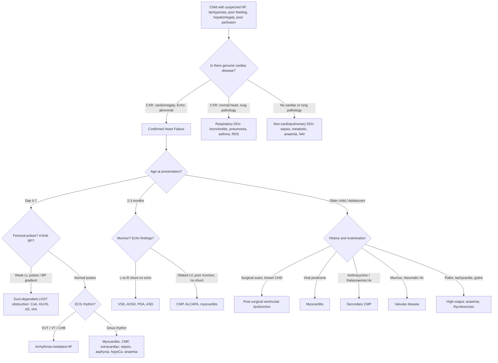

## Differential Diagnosis of Heart Failure in Children

### Why Is the Differential Diagnosis Important?

***Clinical features of heart failure in children are very non-specific*** [1][2]. An infant with tachypnoea, poor feeding, and hepatomegaly could have heart failure — or could have bronchiolitis, sepsis, or a metabolic disorder. An older child with exercise intolerance and wheeze might have asthma rather than cardiac disease. The differential diagnosis is therefore critical because **getting the wrong diagnosis means missing a potentially lethal but treatable cardiac lesion**.

The approach to the differential has two layers:

1. **What is mimicking heart failure?** — conditions that present similarly but are NOT cardiac in origin.
2. **What is causing the heart failure?** — once you've established the child genuinely has HF, what is the underlying aetiology?

We will address both systematically.

---

### Layer 1: Conditions That Mimic Heart Failure in Children

The key clinical features of paediatric HF — **respiratory distress, poor feeding/FTT, hepatomegaly, tachycardia, and poor perfusion** — overlap with many non-cardiac conditions. The differential depends heavily on **age at presentation** [2].

#### Differential by Presenting Feature

| Presenting Feature | Cardiac (HF) | Non-Cardiac Mimics | How to Distinguish |
|---|---|---|---|
| **Respiratory distress in a neonate** | Duct-dependent CHD, large L→R shunt (after PVR falls), myocarditis | ***Neonatal: TTNB, RDS, MAS, CDH, pulmonary hypoplasia*** [2] | CXR (cardiomegaly vs lung pathology), hyperoxia test (fails in cyanotic CHD), echo |
| **Respiratory distress in an infant/child** | L→R shunt with pulmonary overcirculation, LV failure | ***Acquired: pneumothorax, pneumonia, bronchiolitis, asthma*** [2] | Cardiomegaly on CXR, hepatomegaly, murmur, echo |
| **Failure to thrive** | Chronic HF (any cause) | ***Inadequate intake: feeding issues, neglect, impaired suck/swallow, anorexia of chronic disease*** [2] | Cardiac examination, CXR, echo |
| | | ***Inadequate retention: vomiting, diarrhoea*** [2] | GI history |
| | | ***Malabsorption: short gut syndrome, post-NEC*** [2] | Stool studies, nutritional markers |
| | | ***Utilization: syndromes, chromosomal disorder, metabolic disorder*** [2] | Dysmorphic features, metabolic screen |
| | | ***↑Requirement: thyrotoxicosis, chronic infection, chronic renal failure, malignancy*** [2] | TFTs, infection screen, RFTs, tumour markers |
| **Wheezing in an infant** | "Cardiac asthma" from pulmonary venous congestion | Bronchiolitis (RSV), viral-induced wheeze, asthma (older child) | Failure to respond to bronchodilators, cardiomegaly, hepatomegaly |
| **Hepatomegaly** | RHF (systemic venous congestion) | Infection (hepatitis), storage disease (glycogen storage, Gaucher), haematological infiltration (leukaemia, neuroblastoma), biliary atresia [8] | Liver texture (smooth and tender in HF vs hard/nodular in infiltration), associated cardiac signs |
| **Shock in a neonate** | Duct-dependent CHD (CoA, HLHS, critical AS, IAA) | Sepsis, inborn errors of metabolism, adrenal crisis (congenital adrenal hyperplasia), severe anaemia, NAI | ***Weak LL pulses = only reliable sign of coarctation*** [3]; 4-limb BP, blood glucose, ammonia, 17-OHP, septic screen |
| **Tachycardia** | Compensatory in HF; primary arrhythmia (SVT) causing HF | Fever, pain, hypovolaemia, anaemia, thyrotoxicosis, anxiety | ECG (SVT has rates > 220 bpm in infants with narrow complex; sinus tachycardia has rate-appropriate for fever/distress) |

<Callout title="The Neonate in Shock: A Critical DDx" type="error">

A neonate presenting with shock in the first week of life has a narrow but deadly differential. ***Heart failure in CHD is more likely due to structural defects → excessive volume/pressure load instead of myocardial dysfunction*** [3]. Always check **four-limb blood pressures** and **femoral pulses** — ***weak femoral pulses is the ONLY reliable sign of coarctation of aorta before the ductus closes*** [3][6]. Missing this diagnosis is catastrophic. The top differentials for neonatal shock are: duct-dependent CHD, sepsis, metabolic crisis, and adrenal crisis.

</Callout>

---

### Layer 2: Aetiological Differential of Heart Failure (Once HF Is Confirmed)

Once you have confirmed that the child genuinely has heart failure (by clinical assessment, CXR showing cardiomegaly, and echocardiography), you need to determine **why**. The aetiological differential is best organised by **age** and by **mechanism** (preserved vs impaired contractility) [1][2].

#### Differential Organised by Age

```mermaid
graph TD
    A["Child with confirmed Heart Failure"] --> B["Neonate (0-28 days)"]
    A --> C["Infant (1-3 months)"]
    A --> D["Older child / Adolescent"]

    B --> B1["Preserved contractility"]
    B --> B2["Impaired contractility"]
    B1 --> B1a["Duct-dependent CHD: CoA, HLHS, critical AS, IAA"]
    B1 --> B1b["PDA in premature infants"]
    B2 --> B2a["Myocarditis"]
    B2 --> B2b["Transient myocardial ischaemia"]
    B2 --> B2c["Cardiomyopathy"]
    B2 --> B2d["Arrhythmias: CHB, SVT, VT"]
    B2 --> B2e["Extracardiac: sepsis, asphyxia, hypoCa, anaemia"]

    C --> C1["Preserved contractility"]
    C --> C2["Impaired contractility"]
    C1 --> C1a["Large L-to-R shunt: VSD, AVSD, PDA, ASD"]
    C2 --> C2a["Cardiomyopathy"]
    C2 --> C2b["MI: Kawasaki, ALCAPA"]
    C2 --> C2c["Arrhythmias: SVT, VT"]

    D --> D1["Preserved contractility"]
    D --> D2["Impaired contractility"]
    D1 --> D1a["Unoperated CHD, valvular insufficiency"]
    D1 --> D1b["High-output: anaemia, thyrotoxicosis, AV fistula"]
    D1 --> D1c["Fluid overload"]
    D2 --> D2a["Myocarditis, cardiomyopathy"]
    D2 --> D2b["Post-chemo, Fe overload, neuromuscular disease"]
    D2 --> D2c["Operated CHD with late ventricular dysfunction"]
```

#### Detailed Aetiological Differential by Age Group

##### Neonatal Period (Day 0–28)

| Category | Condition | Why It Causes HF at This Age | Key Distinguishing Feature |
|---|---|---|---|
| ***Duct-dependent LVOT obstruction*** | ***Critical CoA*** | DA closes → acute loss of descending aortic flow → shock + HF [2][3] | ***Weak LL pulses, radiofemoral delay, BP gradient UL > LL*** [3][6] |
| | ***HLHS*** | Entire systemic circulation depends on DA + ASD; DA closure → no systemic output [2] | Single S2 (loud P2, absent A2), RV impulse, weak pulses, no specific murmur |
| | ***Critical AS*** | Severe obstruction → LV cannot eject → DA supplies systemic circulation [2] | Harsh ESM at RUSB, weak pulses after DA closure |
| | ***IAA (interrupted aortic arch)*** | Complete discontinuity of aortic arch → lower body entirely duct-dependent [2] | Similar to CoA but more severe; often a/w DiGeorge syndrome (22q11 deletion) [5] |
| ***PDA in preterm*** | PDA | Premature infant fails to close DA → large L→R shunt → pulmonary overcirculation even in first days (because PVR is already low in preterms) [4] | Continuous murmur at LUSB, bounding pulses, wide pulse pressure |
| ***Myocarditis*** | Viral myocarditis | Direct myocyte destruction → ↓contractility → ↓CO [2] | Preceding viral illness, globally impaired LV function on echo, elevated troponin |
| ***Transient myocardial ischaemia*** | Perinatal asphyxia | Subendocardial ischaemia from birth asphyxia → ↓contractility [2] | History of birth asphyxia, ↑troponin, ECG changes, echo: regional wall motion abnormality |
| ***Cardiomyopathy*** | Metabolic CMP (mitochondrial, glycogen storage), familial DCMP | Intrinsic myocardial disease → ↓contractility [2] | Metabolic acidosis, hypoglycaemia, family history; echo: dilated LV with ↓EF |
| ***Arrhythmias*** | ***Congenital heart block*** | Maternal anti-Ro/La → damage to foetal conduction system → very slow ventricular rate → ↓CO [2] | Maternal SLE/Sjögren, bradycardia (rate 40–60 bpm), AV dissociation on ECG |
| | ***SVT (may be WPW-related)*** | Sustained rate > 220 bpm → insufficient diastolic filling → ↓CO → HF [2] | Narrow complex tachycardia > 220 bpm, abrupt onset/offset |
| ***Extracardiac*** | ***Sepsis*** | Distributive shock → ↓SVR → high-output failure; myocardial depression from inflammatory mediators [2] | Fever, poor perfusion, ↑inflammatory markers, positive cultures |
| | ***Hypocalcaemia (in low BW)*** | Ca²⁺ is essential for excitation-contraction coupling; ↓Ca → ↓contractility [2] | Low serum ionised calcium, QTc prolongation on ECG |
| | ***Anaemia (e.g. fetomaternal transfusion)*** | ↓Hb → ↓oxygen delivery → compensatory ↑CO → high-output failure [2] | Pallor, low Hb, reticulocytosis ± positive Kleihauer-Betke test |

##### Infant Period (2–3 Months)

| Category | Condition | Why It Causes HF at This Age | Key Distinguishing Feature |
|---|---|---|---|
| ***Large L→R shunt*** | ***VSD*** (most common CHD) | PVR falls at 6–8 weeks → ↑L→R shunting → pulmonary overcirculation → LV volume overload [2][4] | PSM at LLSB ± thrill; large VSD: displaced thrusting apex, tachypnoea, FTT |
| | ***AVSD*** | Same mechanism as VSD; particularly common in Down syndrome [5] | Fixed split S2, superior axis on ECG, features of trisomy 21 |
| | ***PDA*** | Same mechanism; also L→R shunt increasing with falling PVR [4] | Continuous "machinery" murmur at LUSB, bounding pulses, wide pulse pressure |
| | ***ASD (rarely)*** | ASD alone rarely causes infant HF (well-tolerated for decades); only with very large defects or associated anomalies [4] | Wide fixed split S2, ESM at LUSB |
| ***ALCAPA*** | Anomalous left coronary from PA | As PVR falls → PA pressure falls → coronary perfusion pressure falls → LV ischaemia → "coronary steal" → HF at 2–3 months [2] | Irritability during feeds (angina equivalent), ECG: anterolateral infarction pattern, echo: regional wall motion abnormality, dilated LV |
| ***Kawasaki disease*** | Coronary artery aneurysm → MI | Inflammatory vasculitis → coronary aneurysm → thrombosis → MI → ↓contractility [2] | Prolonged fever > 5 days, conjunctivitis, rash, desquamation, ↑inflammatory markers |
| ***Cardiomyopathy*** | DCMP (genetic, metabolic) | Intrinsic myocardial disease [2] | Dilated LV with ↓EF on echo, no structural defect |
| ***SVT*** | Tachycardia-mediated CMP | Sustained SVT → myocardial energy depletion → reversible ventricular dysfunction [2] | Rate > 220 bpm, narrow complex, often intermittent |

##### ***Older Children and Adolescents*** [1]

| Category | Condition | Why It Causes HF at This Age | Key Distinguishing Feature |
|---|---|---|---|
| ***Myocardial disease*** | ***Myocarditis*** [1] | Viral or autoimmune inflammation → myocyte necrosis → ↓contractility | Preceding viral illness, ↑troponin, global LV dysfunction on echo |
| | ***Cardiomyopathy (primary)*** [1] | DCMP, HCMP, RCMP, ARVC — genetic or idiopathic [7] | Family history, specific echo/MRI patterns |
| | ***Cardiomyopathy (secondary)*** [1] | ***Fe overload*** (thalassaemia major — very HK-relevant), ***post-chemotherapy*** (anthracyclines), ***neuromuscular disease*** (Duchenne/Becker) [2] | Iron studies / ferritin (Fe overload), anthracycline exposure history, Gowers sign / pseudohypertrophy (Duchenne) [9] |
| | ***Premature MI*** | ***Homozygous familial hypercholesterolaemia*** [2] | Xanthomata, family history of premature CVD, extremely high LDL |
| ***Structural*** | ***Unoperated CHD*** [1] | Late-presenting or neglected structural disease | Murmur, echo findings |
| | ***Certain repaired or palliated CHD*** [1] | Post-Fontan (single ventricle physiology), post-Mustard/Senning (systemic RV failure), post-TOF repair (RV dilatation from PR) | Surgical history, specific echo/MRI findings |
| ***Valvular*** | ***MR, AR, TR, PR*** [2] | Volume overload from regurgitant lesions → ventricular dilatation → HF | Specific murmurs on auscultation, echo confirmation |
| ***Rheumatic heart disease*** | Post-rheumatic valvular disease | Repeated ARF attacks → progressive valvular fibrosis → MS, MR, AR [10] | History of sore throat / ARF, Jones criteria fulfilled, echo: thickened valves |
| ***High-output failure*** | ***Anaemia, thyrotoxicosis, AV fistula*** [2] | ↑Demand exceeds even normal/elevated CO | Pallor/low Hb (anaemia), tremor/tachycardia/goitre (thyrotoxicosis), bruit over fistula |
| ***Fluid overload*** [2] | Iatrogenic, renal failure | Excessive preload → past optimal point on Starling curve → ↓CO | History of IV fluids, oliguria, ↑creatinine |
| ***Arrhythmia*** | SVT, VT, CHB | Tachycardia-mediated CMP or bradycardia with ↓CO | ECG, Holter monitoring |
| ***Endomyocarditis*** | Infective endocarditis with myocardial involvement [2] | Infection → valve destruction + myocardial inflammation → ↓contractility + valvular regurgitation | Fever, new/changing murmur, embolic phenomena (splinter haemorrhages, Osler nodes, Janeway lesions), positive blood cultures [6] |

---

### Systematic Approach to Narrowing the Differential

The following algorithm summarises how to approach a child presenting with suspected heart failure, incorporating the differential at each decision point:

---

### Key Differentiating Features: Cardiac vs Respiratory Causes of Tachypnoea

This is one of the **most common clinical dilemmas** in paediatric emergency medicine — is this baby breathless from the lungs or the heart?

| Feature | Cardiac Cause (HF) | Respiratory Cause |
|---|---|---|
| **Cardiomegaly on CXR** | Present (CTR ≥ 0.6 in infants) [2] | Absent (may have hyperinflation) |
| **Hepatomegaly** | Present (systemic venous congestion) | Absent (unless liver pushed down by hyperinflated lungs — but this is a different mechanism and the liver edge is soft/non-tender) |
| **Murmur** | Often present (depends on lesion) | Absent |
| **Femoral pulses** | May be weak/absent (CoA) or bounding (PDA) | Normal |
| **Sweating during feeds** | Characteristic of HF | Not typical |
| **Response to bronchodilators** | No improvement (cardiac "asthma" from peribronchial oedema) | Improvement (true bronchospasm) |
| **Hyperoxia test** | Fails to normalise SpO₂ if cyanotic CHD | SpO₂ improves with O₂ in respiratory disease |
| **CXR lung fields** | Pulmonary plethora (overcirculation) or hazy venous congestion [2] | Hyperinflation, consolidation, atelectasis |

<Callout title="Exam Pitfall: Cardiac Wheeze Misdiagnosed as Asthma/Bronchiolitis" type="error">

An infant with "recurrent wheeze not responding to bronchodilators" must have heart failure excluded. The wheeze in HF is caused by peribronchial oedema from pulmonary venous congestion, not bronchospasm. Look for cardiomegaly on CXR and hepatomegaly on examination — these are the giveaways [2].

</Callout>

---

### Syndromic Associations — High-Yield for the DDx

When a child with heart failure also has **dysmorphic features**, the underlying CHD can often be predicted based on the syndrome [5]:

| ***Syndrome*** | ***Dysmorphic Features*** | ***Cardiac Defects*** |
|---|---|---|
| ***Down syndrome (Trisomy 21)*** | Hypotonia, upslanting palpebral fissures, flat nasal bridge, single palmar crease | ***AVSD*** (most characteristic), VSD, ASD, PDA, TOF [5] |
| ***Turner syndrome (45,X)*** | Short stature, webbed neck, wide-spaced nipples, cubitus valgus | ***CoA, bicuspid AV, valvular AS, HLHS*** [5] |
| ***DiGeorge syndrome (22q11 deletion)*** | Abnormal facies, thymic hypoplasia, cleft palate, hypocalcaemia (mnemonic: **CATCH-22** — Cardiac, Abnormal facies, Thymic hypoplasia, Cleft palate, Hypocalcaemia, 22q11) | ***Conotruncal anomalies: IAA, truncus arteriosus, TOF*** [5] |
| ***Williams syndrome*** | Elfin facies, mental retardation, hypercalcaemia | ***Supravalvular AS, peripheral PA stenosis*** [5] |
| ***Noonan syndrome*** | Turner-like features, ptosis, downslanting palpebral fissures, cryptorchidism | ***Valvular PS (dysplastic cusps), HCMP, ASD*** [5] |
| ***Marfan syndrome*** | Tall stature, arachnodactyly, high-arched palate, lens subluxation | AR (aortic root dilatation), MR (MVP) |

> **Why does this matter for the DDx?** If you see a child with HF + flat nasal bridge + single palmar crease → think Trisomy 21 → most likely AVSD. If you see HF + short stature + webbed neck → Turner → CoA. The dysmorphic features narrow your differential instantly [5].

---

### Differential by Mechanism: A Summary Framework

| Mechanism | Pathophysiology | Common Paediatric Causes |
|---|---|---|
| **↓Preload** | ↓Venous return or impaired filling → ↓CO [11] | Constrictive pericarditis, cardiac tamponade, RCMP |
| **↑↑Preload (volume overload)** | ↑↑Preload beyond Starling optimum → ↓CO [11] | VSD, PDA, ASD, AVSD, MR, AR, anaemia, fluid overload |
| **↑Afterload (pressure overload)** | ↑Resistance to ejection → ↓CO [11] | AS, CoA, systemic HTN, PS, pulmonary HTN |
| **↓Contractility** | Impaired myocardial contraction → ↓CO [11] | Myocarditis, DCMP, ischaemia (ALCAPA, Kawasaki), iron overload, anthracycline toxicity |
| **Arrhythmia** | Loss of coordinated contraction or inadequate rate → ↓CO [11] | SVT, VT, congenital heart block |
| **High-output** | Normal/↑CO but ↓SVR/↓Hb → inadequate tissue perfusion [11] | Severe anaemia, thyrotoxicosis, AV fistula |

---

### Special Hong Kong Considerations

- **Thalassaemia major** is prevalent in Southeast Asia and Hong Kong. Children requiring chronic transfusions develop **iron overload cardiomyopathy** (secondary DCMP), which is a major cause of cardiac death in this population. Iron deposits in myocardium → free radical generation → myocyte damage → dilated cardiomyopathy → HF [2].
- **Kawasaki disease** has a relatively high incidence in East Asian populations (~100–200 per 100,000 children < 5 years in Hong Kong/Japan). Coronary artery aneurysms can lead to MI and HF in infants/young children [2].
- **Rheumatic heart disease**: while declining, still occasionally seen in immigrant populations in Hong Kong [10].

---

<Callout title="High Yield Summary — Differential Diagnosis of Paediatric HF">

1. **Two layers of DDx**: (a) Is it really HF or a mimic? (b) If HF, what is the cause?
2. **Respiratory mimics** are the most common trap: bronchiolitis, pneumonia, asthma all cause tachypnoea in infants. Look for **cardiomegaly** on CXR and **hepatomegaly** on exam to distinguish.
3. ***Neonatal shock DDx***: duct-dependent CHD (CoA, HLHS, critical AS, IAA), sepsis, metabolic crisis, adrenal crisis. **Always check femoral pulses and 4-limb BP.**
4. ***Infant HF (2–3 months)***: large L→R shunts (VSD, AVSD, PDA) are overwhelmingly the most common cause — PVR has fallen by this age.
5. ***Older children***: myocarditis, cardiomyopathy (primary and secondary — especially **iron overload** in HK and **post-anthracycline**), repaired/palliated CHD with late ventricular dysfunction, valvular disease.
6. **Syndromic clues** narrow the differential rapidly: Down → AVSD; Turner → CoA; DiGeorge → conotruncal anomalies; Williams → supravalvular AS; Noonan → PS/HCMP.
7. **High-output HF**: don't forget anaemia, thyrotoxicosis, and AV fistula as causes of HF with preserved or increased CO.

</Callout>

---

<ActiveRecallQuiz
  title="Active Recall - Differential Diagnosis of Paediatric Heart Failure"
  items={[
    {
      question: "A 3-month-old infant presents with tachypnoea, hepatomegaly, and a pansystolic murmur at the LLSB. What is the most likely diagnosis, and why does it present at this age rather than at birth?",
      markscheme: "Large VSD with L-to-R shunt. Presents at 2-3 months because PVR gradually falls over 6-8 weeks after birth, allowing progressive L-to-R shunting and pulmonary overcirculation leading to LV volume overload and HF."
    },
    {
      question: "Name three non-cardiac conditions that can mimic heart failure in a neonate presenting with respiratory distress.",
      markscheme: "Any three of: transient tachypnoea of the newborn (TTNB), respiratory distress syndrome (RDS), meconium aspiration syndrome (MAS), congenital diaphragmatic hernia (CDH), pulmonary hypoplasia, sepsis, metabolic disease."
    },
    {
      question: "A neonate presents with shock on day 2 of life. Femoral pulses are absent and upper limb BP is significantly higher than lower limb BP. What is the most likely diagnosis and what is the pathophysiology?",
      markscheme: "Critical coarctation of the aorta with duct-dependent systemic circulation. The descending aorta is severely narrowed at the ductus insertion site. After birth the DA closes, cutting off blood supply to the lower body, causing acute LV pressure overload, shock, and oliguria."
    },
    {
      question: "A child with Trisomy 21 is found to have heart failure at 2 months of age. What congenital heart defect is most characteristically associated with Down syndrome?",
      markscheme: "Atrioventricular septal defect (AVSD). Other associations include VSD, ASD, PDA, and TOF, but AVSD is the most characteristic."
    },
    {
      question: "How would you differentiate cardiac-related tachypnoea from respiratory-related tachypnoea in an infant?",
      markscheme: "Cardiac: cardiomegaly on CXR (CTR >= 0.6 in infants), hepatomegaly, murmur, sweating during feeds, pulmonary plethora on CXR, no response to bronchodilators. Respiratory: normal heart size, lung pathology on CXR (hyperinflation, consolidation), no hepatomegaly, responds to bronchodilators."
    },
    {
      question: "Name two causes of secondary cardiomyopathy particularly relevant to the Hong Kong paediatric population, and explain the mechanism for each.",
      markscheme: "1. Iron overload cardiomyopathy from thalassaemia major: chronic transfusions cause iron deposition in myocardium, catalysing free radical formation via Fenton reaction, causing myocyte damage and DCMP. 2. Kawasaki disease: coronary artery vasculitis leading to coronary aneurysms, thrombosis, and myocardial infarction with impaired contractility."
    }
  ]}
/>

## References

[1] Lecture slides: GC 147. Heart failure and cyanosis in children acyanotic and cyanotic congenital heart disease - Part 1.pdf (p7, p35)
[2] Senior notes: Adrian Lui Pediatrics.pdf (p197–198, p200)
[3] Senior notes: Adrian Lui Pediatrics.pdf (p194, p210)
[4] Senior notes: Ryan Ho Cardiology.pdf (p189, p192–193)
[5] Senior notes: Ryan Ho Cardiology.pdf (p185)
[6] Senior notes: Adrian Lui Pediatrics.pdf (p185)
[7] Senior notes: Ryan Ho Cardiology.pdf (p171)
[8] Senior notes: Ryan Ho GI.pdf (p21)
[9] Senior notes: Ryan Ho Neurology.pdf (p191)
[10] Senior notes: Ryan Ho Cardiology.pdf (p146)
[11] Senior notes: Ryan Ho Cardiology.pdf (p70)
