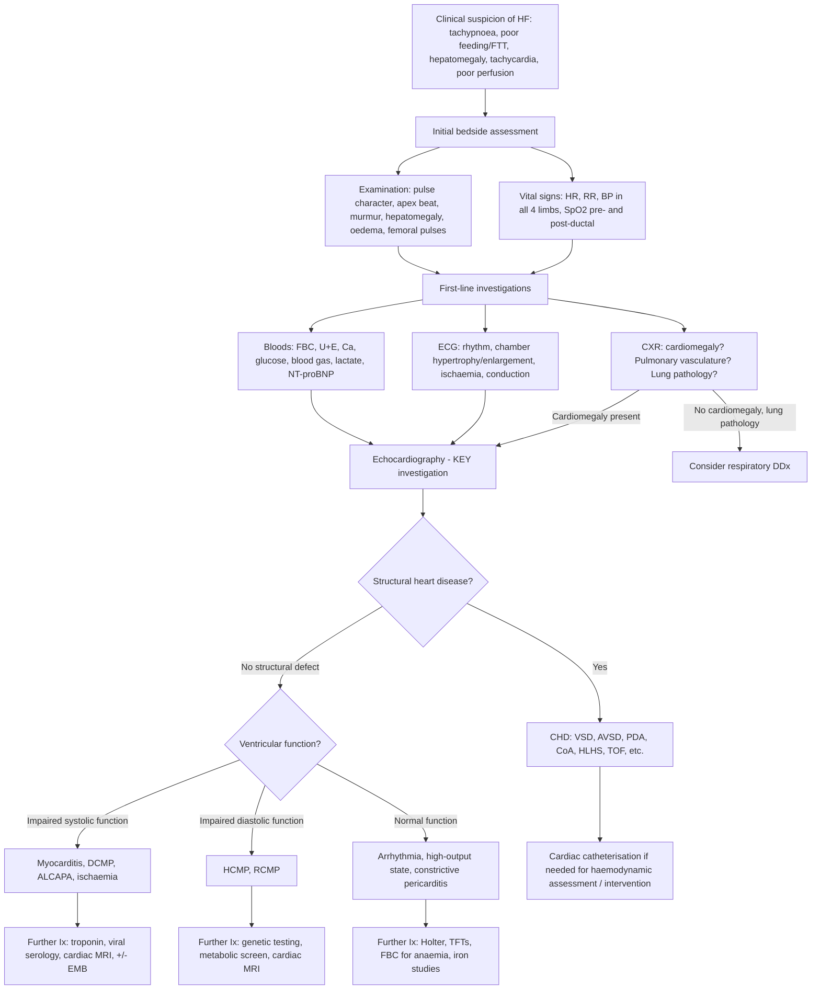

## Diagnosis of Heart Failure in Children

### Fundamental Principle: HF Is a Clinical Diagnosis

Heart failure in children — just like in adults — is fundamentally a **clinical diagnosis** supported by investigations. There is no single "gold-standard" blood test or imaging modality that diagnoses HF on its own. Instead, you integrate:

1. **Clinical assessment** (history + examination → covered in prior sections)
2. **Radiographic findings** (CXR)
3. **Echocardiography** (the single most important investigation)
4. **Laboratory findings** (biomarkers, bloods)
5. **Electrocardiography** (ECG)
6. **Additional investigations** as needed to establish the aetiology

***Diagnosis and evaluation: based on clinical, radiographic, echo and laboratory findings*** [2].

<Callout title="No Framingham Criteria for Children" type="error">

Unlike adult HF where the **Framingham criteria** (≥2 major or 1 major + 2 minor criteria) are widely used [12], there are **no validated equivalent diagnostic criteria** for paediatric HF. The diagnosis relies on the clinician recognising the constellation of symptoms, signs, and supportive investigations described below. The **Ross classification** grades severity, not diagnosis [2].

</Callout>

---

### Diagnostic Criteria / Framework for Paediatric HF

While there is no single universally adopted "diagnostic criteria" set for paediatric HF equivalent to the adult Framingham or ESC criteria, the **International Society for Heart and Lung Transplantation (ISHLT) 2014 guidelines** and the **AHA Scientific Statement on Paediatric Heart Failure (2024 update)** provide a working framework. Diagnosis requires **all three** of the following:

| Component | What You Need | Paediatric-Specific Considerations |
|---|---|---|
| **1. Compatible clinical syndrome** | Symptoms and/or signs of HF (age-appropriate) | Infants: poor feeding, tachypnoea, diaphoresis, FTT. Older children: exercise intolerance, dyspnoea, oedema [2] |
| **2. Evidence of cardiac dysfunction** | Structural or functional abnormality on echocardiography OR elevated natriuretic peptides | Echo is the cornerstone. NT-proBNP supports but does not diagnose alone [2][12] |
| **3. Identifiable cause or precipitant** | The underlying aetiology should be sought | CHD (structural), myocarditis, cardiomyopathy, arrhythmia, extracardiac causes [2] |

Additionally, **staging** (A–D) classifies where the child sits on the HF continuum, and **Ross classification** (I–IV) grades functional severity — both discussed in the prior section.

> In practice, the bedside diagnosis is often straightforward: an infant with tachypnoea, hepatomegaly, and cardiomegaly on CXR has HF until proven otherwise. The harder question is **why** — and that is where echocardiography is indispensable.

---

### Diagnostic Algorithm

The following algorithm shows the step-by-step approach from clinical suspicion to confirmed diagnosis and aetiological work-up:

---

### Investigation Modalities — Detailed Interpretation

#### 1. Chest X-Ray (CXR)

The CXR is always the **first imaging investigation** in a child with suspected HF. It is quick, widely available, and provides critical information. Think of the CXR as answering four questions simultaneously [2]:

##### Question 1: Is the heart big? (Cardiomegaly)

- ***Cardiothoracic ratio (CTR): ≥ 0.50 in children/adults vs ≥ 0.60 in infants*** [2]
- **Why different for infants?** The infant thymus sits in the anterior mediastinum and overlaps the cardiac silhouette, making the heart appear larger. A CTR of 0.55 in a neonate is normal; in a 10-year-old it is abnormal.
- ***Note that thymus in infants/young children can simulate cardiomegaly → diagnostic difficulty*** [2]. The thymus has a characteristic "sail sign" (triangular opacity) and "wave sign" (scalloped edge from rib impressions) that help differentiate it from true cardiomegaly.
- **Cardiomegaly implies**: volume overload (dilated chambers) or pericardial effusion. Pressure overload alone (e.g. isolated LVH from AS) may NOT cause cardiomegaly on CXR.

##### Question 2: What is the cardiac contour telling us? (Chamber enlargement)

| ***CXR finding*** | ***Chamber involved*** | ***Mechanism*** | ***Associated conditions*** |
|---|---|---|---|
| ***Right heart border more convex + bulge into right lung*** [2] | ***RAE (right atrial enlargement)*** | ↑RA pressure/volume | ASD, Ebstein anomaly, TR |
| ***Small bulge on left cardiac border (3rd mogul sign) inferior to main PA shadow*** [2] | ***LAE (left atrial enlargement)*** | ↑LA pressure/volume | MS, large VSD, PDA (from ↑pulmonary venous return) |
| ***↑CTR + cardiac apex tilts upward and displaces laterally → 'boot-shaped heart'*** [2] | ***RVE (right ventricular enlargement)*** | RV dilatation | TOF (classic boot shape), large ASD, Eisenmenger |
| ***Apex extends laterally and points downward*** [2] | ***LVE (left ventricular enlargement)*** | LV dilatation (volume overload) | Large VSD, PDA, DCMP, AR, MR |

> ***RVH (right ventricular hypertrophy): only uptilting of apex WITHOUT ↑CTR and lateral displacement*** — contrast with RVE [2]. Similarly, ***LVH: NO CXR abnormalities*** [2] — pure hypertrophy thickens the wall inward without enlarging the silhouette.

##### Question 3: What do the lung fields show? (Pulmonary vasculature)

This is extremely high-yield. The pulmonary vascular markings tell you about pulmonary blood flow and pulmonary venous pressure [2]:

| ***CXR Pattern*** | ***Interpretation*** | ***Mechanism*** | ***Examples*** |
|---|---|---|---|
| ***Pulmonary plethora + cardiomegaly*** [2] | ***L→R shunt with volume overload*** | ↑Pulmonary arterial flow from shunting + ↑pulmonary venous return → chamber dilatation | ***VSD, PDA, AVSD*** |
| ***Pulmonary plethora + hazy venous markings + no cardiomegaly*** [2] | ***Pulmonary venous congestion*** | ↑Pulmonary venous pressure (e.g. from obstruction to LA inflow/outflow) without volume overload of the heart itself | ***MS, total anomalous pulmonary venous return (TAPVR) with obstruction, cor triatriatum*** |
| ***Pulmonary oligaemia*** (decreased vascular markings) [2] | ***Pulmonary outflow obstruction*** | ↓Blood reaching the lungs due to RVOT obstruction or pulmonary atresia | ***TOF, pulmonary atresia, critical PS, Eisenmenger (late)*** |
| **Upper lobe venous diversion** | **Pulmonary venous hypertension** | Basal vessels compressed by oedema → blood redistributed to upper lobes | Less common in children than adults; seen in chronic LV failure |

##### Question 4: Where is the heart? (Situs)

- ***Dextrocardia: when associated with left or central liver/stomach → likely only the heart is displaced to the right side*** [2]. This is called **situs solitus with dextrocardia** (isolated dextrocardia).
- ***90% of isolated dextrocardia is associated with severe cardiac defects*** [2].
- If the liver, stomach, and heart are all mirrored → **situs inversus totalis** → cardiac defects are uncommon (unless associated with ciliary dyskinesia / Kartagener syndrome).

<Callout title="CXR Interpretation Summary for Paediatric HF">

Always systematically assess: (1) CTR → cardiomegaly? (2) Cardiac contour → which chambers are enlarged? (3) Pulmonary vasculature → plethora, oligaemia, or venous congestion? (4) Situs → is the heart where it should be? These four questions will narrow your differential dramatically before you even get the echo report.

</Callout>

---

#### 2. Electrocardiogram (ECG)

The ECG does not diagnose HF, but it provides essential information about **rhythm, chamber hypertrophy/enlargement, ischaemia, and conduction abnormalities** that point towards the underlying aetiology [12][13].

**Paediatric-specific ECG considerations**:
- Normal values change dramatically with age (e.g. right axis deviation and RV dominance are normal in neonates; transition to LV dominance occurs by 6 months).
- Always use **age-appropriate normal ranges** for axis, intervals, and voltages.
- The neonatal ECG shows dominant R waves in V1 (RV dominant) → progressive transition to dominant S in V1 and dominant R in V5–6 (LV dominant) by 6 months.

| ECG Finding | Suggests | Mechanism | Conditions |
|---|---|---|---|
| **RVH** (tall R in V1, deep S in V5–6, right axis deviation) | RV pressure or volume overload | Hypertrophied RV generates greater rightward forces | TOF, PS, pulmonary HTN, large ASD |
| **LVH** (tall R in V5–6, deep S in V1, left axis deviation) | LV pressure or volume overload | Hypertrophied or dilated LV generates greater leftward forces | VSD, PDA, AS, CoA, DCMP |
| **RAE** (tall peaked P waves > 2.5 mm in lead II — "P pulmonale") | RA dilatation/pressure | Larger RA → larger P-wave voltage | ASD, Ebstein, PS, pulmonary HTN |
| **LAE** (wide bifid P waves > 0.08s in lead II — "P mitrale") | LA dilatation/pressure | Larger LA → prolonged left atrial depolarisation component | MS, VSD, PDA, MR |
| **Superior axis / left axis deviation** | Primum ASD, AVSD | Abnormal position of the AV conduction axis due to defect in AV septum | Down syndrome + AVSD (classic combination) |
| **SVT** (narrow complex, rate > 220 bpm in infants) | Tachyarrhythmia as cause of HF | Re-entrant circuit (often WPW) → sustained tachycardia → ↓diastolic filling → ↓CO | WPW syndrome, concealed pathways |
| **Complete heart block** (AV dissociation, rate 40–60 bpm) | Bradyarrhythmia as cause of HF | Conduction system damaged by maternal anti-Ro/La antibodies or post-surgical | Congenital CHB (maternal SLE), post-cardiac surgery |
| **ST/T-wave changes** | Ischaemia or myocarditis | Myocardial injury → repolarisation abnormalities | ALCAPA (anterolateral ischaemia pattern), Kawasaki MI, myocarditis (diffuse ST changes) |
| **Low-voltage QRS** | Pericardial effusion or myocarditis | Fluid around heart attenuates electrical signal; inflamed/oedematous myocardium → ↓voltage | Pericardial effusion, severe myocarditis |
| **Pre-excitation (delta wave, short PR)** | WPW syndrome | Accessory pathway bypasses AV node → early ventricular activation (delta wave) | WPW — important cause of SVT in infants |

---

#### 3. Echocardiography (Echo) — The Cornerstone Investigation

***Echocardiography is the single most important investigation in paediatric HF*** [2][12]. It answers two critical questions simultaneously:

1. **What is the structural anatomy?** → Is there a congenital heart defect?
2. **How is the heart functioning?** → Is there systolic or diastolic dysfunction?

##### Key Echo Assessments and Findings

| Assessment | What It Tells You | Key Findings in HF |
|---|---|---|
| **Structural anatomy** | Presence and type of CHD | VSD location and size, AVSD, PDA, CoA (suprasternal view), valve morphology, great vessel relationship |
| **Chamber dimensions** | Volume overload vs pressure overload | Dilated LV (VSD, PDA, DCMP, MR); dilated RV (ASD, PR, pHTN); dilated LA (MS, large L→R shunt) |
| **LV systolic function (LVEF / FS)** | Contractility — HFrEF vs HFpEF | Normal LVEF in children ≥ 55% (by biplane Simpson's). **Fractional shortening (FS)** normal ≥ 28–44%. ↓LVEF/FS = systolic dysfunction (myocarditis, DCMP, ALCAPA) |
| **Diastolic function** | LV compliance and filling pressures | E/A ratio, tissue Doppler (E/e'), deceleration time. Abnormal diastolic parameters → HCMP, RCMP |
| **Valve function** | Regurgitation or stenosis | Colour Doppler: MR, AR (from VSD), TR. Continuous wave Doppler: gradients across stenotic valves (AS, PS, CoA) |
| **Shunt assessment (Qp:Qs)** | Severity of L→R shunting | Qp:Qs > 1.5:1 = haemodynamically significant shunt. Qp:Qs > 2:1 usually requires intervention |
| **Estimated PA pressure** | Pulmonary hypertension? | Tricuspid regurgitation jet velocity → estimated RVSP (RVSP = 4V² + RAP). Normal PASP < 25 mmHg in children |
| **Pericardial effusion** | Tamponade, myocarditis, post-surgical | Pericardial fluid around heart; RA/RV diastolic collapse if haemodynamically significant |
| **Coronary artery origins** | ALCAPA, Kawasaki aneurysms | Anomalous origin of LCA from PA (ALCAPA); coronary dilatation/aneurysm (Kawasaki) |
| **Wall thickness** | Hypertrophic cardiomyopathy | Asymmetric septal hypertrophy (ASH), systolic anterior motion of MV (SAM) in HCMP [14] |

##### Specific Echo Findings by Aetiology

| Condition | Classic Echo Finding |
|---|---|
| **VSD** | Defect in interventricular septum with L→R colour jet; LV dilatation proportional to shunt size |
| **PDA** | Continuous flow from descending aorta to PA on colour Doppler; LV dilatation |
| **AVSD** | Common AV valve, primum ASD, inlet VSD; LV/RV dilatation |
| **CoA** | Narrowing at aortic isthmus on suprasternal view; Doppler shows diastolic tail (continuous flow pattern) across coarctation; LVH |
| **HLHS** | Hypoplastic LV, atretic/stenotic MV and AV, diminutive ascending aorta, dilated RV/PA [2] |
| **DCMP** | Dilated LV with ↓LVEF, diffuse hypokinesis, ± functional MR from annular dilatation |
| **ALCAPA** | LCA arising from PA; dilated LV with regional wall motion abnormality (anterolateral); ↓LVEF; retrograde flow in LCA on colour Doppler |
| **HCMP** | Asymmetric septal hypertrophy (≥ 15 mm or Z-score > +2), SAM of MV, dynamic LVOT gradient [14] |
| **Myocarditis** | Globally dilated LV with ↓LVEF; ± pericardial effusion; no structural defect |
| **Kawasaki** | Coronary artery dilatation/aneurysm (Z-score based classification); ± impaired LV function if MI |

---

#### 4. Laboratory Investigations (Bloods)

| Investigation | What It Tells You | Paediatric-Specific Points |
|---|---|---|
| **NT-proBNP / BNP** | Myocardial wall stress; supports diagnosis of HF and monitors response to treatment [12] | ↑ in HF (both systolic and diastolic). **Caveat**: levels are physiologically elevated in neonates (first 48–72 hours) and must be interpreted with age-specific reference ranges. NT-proBNP > 300 pg/mL in children (outside neonatal period) is suggestive of HF. Also ↑ in sepsis, renal failure. Used to **support** diagnosis, not make it |
| **Troponin (cTnI / cTnT)** | Myocardial injury / necrosis | ↑ in myocarditis, ALCAPA, Kawasaki MI, severe HF with subendocardial ischaemia. High-sensitivity troponin has improved detection |
| **Full blood count (FBC)** | Anaemia as cause or consequence of HF | Severe anaemia → high-output HF. Polycythaemia → chronic cyanosis. Leukocytosis → sepsis/infection |
| **Arterial blood gas (ABG) / VBG** | Acid-base status, oxygenation | ***Severe metabolic acidosis*** in neonatal duct-dependent shock (lactic acidosis from tissue hypoperfusion) [3]. Respiratory alkalosis from tachypnoea in compensated HF |
| **Lactate** | Tissue perfusion adequacy | ↑ Lactate = inadequate tissue oxygen delivery → anaerobic metabolism. A rising lactate in a child with HF is a red flag for decompensation / cardiogenic shock [13] |
| **Renal function (U+E, creatinine)** | Renal perfusion, electrolyte disturbances | ↑Creatinine/↑urea: prerenal AKI from ↓CO. ***Oliguria and renal failure*** in duct-dependent CoA after ductal closure [4]. HypoNa (dilutional from RAAS activation). HypoK or hyperK (from diuretics or renal failure) |
| **Calcium (ionised)** | Hypocalcaemia as a cause of HF in neonates | ***HypoCa in low birth weight babies*** → ↓contractility (Ca²⁺ essential for excitation-contraction coupling) [2]. Also check in DiGeorge syndrome (22q11 deletion → hypoparathyroidism → hypocalcaemia) |
| **Glucose** | Hypoglycaemia | Neonates in shock may become hypoglycaemic rapidly due to limited glycogen stores |
| **Liver function tests (LFTs)** | Hepatic congestion / cardiac hepatopathy | ↑Transaminases (ALT, AST) from hepatic venous congestion ("shock liver"). ↑Bilirubin if severe/chronic |
| **Thyroid function tests (TFTs)** | Thyrotoxicosis as cause of high-output HF | Especially in adolescents with unexplained tachycardia, HF, and weight loss |
| **Iron studies / ferritin** | Iron overload cardiomyopathy | Critical in thalassaemia major patients in HK: ↑↑ferritin (> 1000–2500 μg/L) indicates significant iron loading. Cardiac T2* MRI is more specific for myocardial iron [2] |
| **Inflammatory markers (CRP/ESR)** | Infection, myocarditis, rheumatic fever | ↑CRP in myocarditis, infective endocarditis, sepsis. ↑ESR in rheumatic fever, Kawasaki |
| **Viral serology / PCR** | Viral myocarditis | Enterovirus, adenovirus, parvovirus B19, CMV, EBV — PCR of blood or myocardial tissue |
| **Autoantibodies** | Autoimmune myocarditis, maternal SLE | Anti-Ro/La (maternal → neonatal CHB). ANA, dsDNA (if SLE-associated myocarditis suspected) |
| **Metabolic screen** | Inborn errors of metabolism | Urine organic acids, plasma amino acids, acylcarnitine profile — especially in neonatal/infantile CMP with unexplained aetiology |

---

#### 5. Hyperoxia Test (Neonates)

This is used specifically in **neonates** to differentiate cyanotic CHD from respiratory disease:

- **Method**: Place neonate on 100% FiO₂ for 10 minutes, then measure PaO₂ from a right radial (preductal) ABG.
- **Interpretation**:
  - **PaO₂ > 150 mmHg** (> 20 kPa): Likely respiratory disease (O₂ crosses into blood via functioning lungs).
  - **PaO₂ < 100 mmHg** (< 13.3 kPa): Likely cyanotic CHD (fixed R→L shunt that O₂ cannot overcome).
  - **PaO₂ 100–150 mmHg**: Indeterminate — could be either.
- **Why it works**: In respiratory disease, supplemental O₂ increases alveolar PO₂ → more O₂ crosses into blood. In cyanotic CHD with a fixed R→L shunt, deoxygenated blood bypasses the lungs entirely → PaO₂ cannot rise significantly regardless of FiO₂.

> The hyperoxia test does NOT specifically diagnose HF, but it helps differentiate **cyanotic CHD** (which may present with HF, e.g. HLHS) from lung disease.

---

#### 6. Four-Limb Blood Pressure and Pre-/Post-Ductal SpO₂

| Test | Technique | Key Finding | Significance |
|---|---|---|---|
| **Four-limb BP** | Measure BP in both arms and one leg using appropriately sized cuffs | ***Systolic BP gradient > 20 mmHg between upper and lower limbs*** | Coarctation of aorta [3][4] — the narrowing impedes flow to the lower body |
| **Pre- and post-ductal SpO₂** | Right hand (preductal) vs either foot (postductal) | **SpO₂ difference > 3%** (lower in foot) | Suggests R→L shunting through the DA (e.g. PPHN, duct-dependent lesion with differential cyanosis) |

<Callout title="Must-Do in Every Neonate with Suspected HF" type="idea">

***Always palpate femoral pulses and measure four-limb blood pressures in any neonate presenting with shock or HF.*** Coarctation of aorta ***is only associated with soft and non-specific murmurs → look hard for soft/absent femoral pulses*** [3]. Missing this is the classic paediatric cardiology pitfall.

</Callout>

---

#### 7. Cardiac MRI

Cardiac MRI is not a first-line investigation but provides detailed information when echo is inconclusive or for specific indications:

| Indication | What MRI Adds |
|---|---|
| **Myocarditis** | Late gadolinium enhancement (LGE) in a non-coronary distribution confirms myocardial inflammation/fibrosis. T2-weighted oedema mapping detects acute inflammation. Lake Louise criteria: ≥ 2 of oedema, hyperaemia, necrosis/fibrosis [15] |
| **Cardiomyopathy** | Precise volumetric assessment of both ventricles; myocardial fibrosis pattern (mid-wall LGE in DCMP, patchy in HCMP). T2* mapping for **myocardial iron loading** in thalassaemia (T2* < 20 ms = iron overload; < 10 ms = severe, high risk of HF) |
| **Complex CHD** | 3D anatomy for surgical planning; particularly useful for great vessel anomalies, CoA (post-repair assessment), and pulmonary artery anatomy |
| **ARVC** | RV dilatation, regional dyskinesia, fatty infiltration (though rare in young children) [7] |
| **Post-surgical assessment** | RV volumes and function (e.g. after TOF repair with PR); conduit stenosis; baffle obstruction (Mustard/Senning) |

---

#### 8. Cardiac Catheterisation

In the era of high-quality echocardiography and MRI, diagnostic cardiac catheterisation is much less common. However, it remains important for:

| Indication | What It Provides |
|---|---|
| **Haemodynamic assessment** | Direct measurement of pressures (RA, RV, PA, PCWP, LV, aorta), oxygen saturations in each chamber, cardiac output (Fick principle or thermodilution). Enables calculation of Qp:Qs, PVR, and SVR |
| **Assessment of pulmonary vascular reactivity** | In children with pulmonary hypertension from large L→R shunts: test response to inhaled nitric oxide or O₂ to determine operability (can the shunt be closed, or has irreversible Eisenmenger developed?) |
| **Interventional procedures** | Balloon atrial septostomy (Rashkind procedure for TGA), device closure of ASD/VSD/PDA, balloon valvuloplasty (PS, AS), coarctation stenting |
| **Endomyocardial biopsy** | Gold standard for myocarditis (Dallas criteria: cellular infiltrates + myocyte necrosis) [15]. Reserved for cases where biopsy will change management (e.g. giant cell myocarditis, eosinophilic myocarditis). Risk of cardiac perforation (~1%) |

---

#### 9. Additional Targeted Investigations

| Investigation | When to Order | What It Tells You |
|---|---|---|
| **Holter monitor (24h ECG)** | Suspected arrhythmia-mediated HF | Detects intermittent SVT, VT, heart block, bradycardia that may not be captured on a standard 12-lead ECG |
| **Genetic testing** | Family history of cardiomyopathy/SCD, syndromic features, unexplained CMP | Identifies pathogenic variants in sarcomeric genes (HCMP), cytoskeletal genes (DCMP), desmosomal genes (ARVC). Important for family screening |
| **Metabolic screen** | Unexplained neonatal/infantile CMP | Urine organic acids, plasma amino acids, acylcarnitine profile, urine GAGs (mucopolysaccharidoses), white cell enzymes (Pompe disease / GSD II). Pompe disease is a treatable cause of infantile HCMP |
| **Chest CT / CT angiography** | Complex aortic arch anatomy, vascular rings | Complements echo and MRI for extracardiac vascular anatomy |
| **Exercise testing** | Older children with chronic HF or post-surgical | Objective assessment of functional capacity, exercise-induced arrhythmias, chronotropic response |

---

### Summary: Investigations at a Glance

| Investigation | Role | Key Finding in HF |
|---|---|---|
| **CXR** | Screen for cardiomegaly and pulmonary vasculature | CTR ≥ 0.6 (infant) / ≥ 0.5 (child); plethora or venous congestion |
| **ECG** | Rhythm, hypertrophy, ischaemia, conduction | Arrhythmias, chamber hypertrophy, ST/T changes |
| **Echo** | **Cornerstone**: anatomy + function | Structural defects, LVEF, shunt quantification, valve pathology, PA pressure |
| **NT-proBNP** | Support diagnosis, monitor treatment | ↑ in HF (age-specific cut-offs) |
| **ABG/Lactate** | Acid-base, tissue perfusion | Metabolic acidosis, ↑lactate in cardiogenic shock |
| **4-limb BP** | Detect CoA | UL-LL gradient > 20 mmHg |
| **Hyperoxia test** | Cyanotic CHD vs respiratory (neonates) | PaO₂ < 100 mmHg on 100% O₂ = CHD |
| **Cardiac MRI** | Myocarditis confirmation, CMP characterisation, iron loading, complex anatomy | LGE, T2*, volumetrics |
| **Catheterisation** | Haemodynamics, PVR assessment, intervention, biopsy | Direct pressures, Qp:Qs, PVR, biopsy (Dallas criteria) |

---

<Callout title="High Yield Summary — Diagnosis of Paediatric HF">

1. **Paediatric HF is a clinical diagnosis** supported by CXR, ECG, echo, and bloods. There are no validated Framingham-equivalent criteria for children [2][12].
2. ***CXR: look for cardiomegaly (CTR ≥ 0.5 children, ≥ 0.6 infants), cardiac contour, pulmonary vasculature, and situs*** [2]. Thymus can mimic cardiomegaly in infants.
3. ***CXR pulmonary vasculature patterns***: plethora + cardiomegaly = L→R shunt; plethora + hazy markings without cardiomegaly = pulmonary venous congestion; oligaemia = RVOT obstruction [2].
4. **Echo is the cornerstone investigation** — defines anatomy, quantifies function (LVEF, FS), assesses shunts (Qp:Qs), estimates PA pressure, and identifies coronary anomalies.
5. **NT-proBNP supports but does not diagnose HF** — use age-specific ranges (physiologically elevated in neonates).
6. ***Four-limb BP and femoral pulse palpation are mandatory in all neonates with HF/shock*** — CoA has only soft, non-specific murmurs [3].
7. **Hyperoxia test**: PaO₂ < 100 mmHg on 100% O₂ = cyanotic CHD. Useful in neonates to differentiate cardiac from respiratory causes.
8. **Cardiac MRI**: second-line for myocarditis (Lake Louise criteria), cardiomyopathy characterisation, and T2* for myocardial iron in thalassaemia.
9. **Cardiac catheterisation**: reserved for haemodynamic assessment, PVR testing, intervention, or endomyocardial biopsy.

</Callout>

---

<ActiveRecallQuiz
  title="Active Recall - Diagnosis of Paediatric Heart Failure"
  items={[
    {
      question: "What is the normal cardiothoracic ratio cut-off for cardiomegaly in infants vs older children on CXR, and why is it different?",
      markscheme: "Infants: CTR >= 0.60; older children: CTR >= 0.50. The infant thymus overlies the cardiac silhouette and makes the mediastinal shadow appear wider, so a higher cut-off is used to avoid false-positive diagnosis of cardiomegaly."
    },
    {
      question: "On CXR, how would you differentiate the pulmonary vascular pattern of a large VSD from that of Tetralogy of Fallot?",
      markscheme: "Large VSD: pulmonary plethora (increased vascular markings) plus cardiomegaly due to L-to-R shunting with volume overload. TOF: pulmonary oligaemia (decreased vascular markings) due to RVOT obstruction reducing pulmonary blood flow, plus boot-shaped heart from RV enlargement."
    },
    {
      question: "What is the single most important investigation for diagnosing the cause and assessing the severity of paediatric heart failure?",
      markscheme: "Echocardiography. It defines structural anatomy (CHD), quantifies ventricular function (LVEF, fractional shortening), assesses valve pathology, estimates pulmonary artery pressure via TR jet velocity, and quantifies shunt magnitude (Qp:Qs)."
    },
    {
      question: "A neonate has a PaO2 of 45 mmHg on 100% FiO2 during a hyperoxia test. What does this indicate and why?",
      markscheme: "PaO2 less than 100 mmHg on 100% O2 indicates cyanotic congenital heart disease. A fixed right-to-left shunt allows deoxygenated blood to bypass the lungs entirely, so increasing FiO2 cannot significantly raise PaO2 regardless of oxygen supplementation. PaO2 of 45 is well below the 100 cut-off, strongly suggesting cyanotic CHD."
    },
    {
      question: "Name three specific indications for cardiac catheterisation in a child with heart failure in 2025 practice.",
      markscheme: "Any three of: (1) Haemodynamic assessment with direct measurement of pressures and Qp:Qs. (2) Pulmonary vascular reactivity testing to determine operability in pulmonary hypertension. (3) Interventional procedures such as balloon septostomy, device closure, or balloon valvuloplasty. (4) Endomyocardial biopsy when diagnosis will change management (e.g. giant cell myocarditis)."
    },
    {
      question: "Why might NT-proBNP be misleading in a 1-day-old neonate and how should you account for this?",
      markscheme: "NT-proBNP is physiologically elevated in the first 48-72 hours of life due to the haemodynamic transition from foetal to neonatal circulation (volume shifts, increased ventricular wall stress). Therefore, age-specific reference ranges must be used. A moderately elevated NT-proBNP in a neonate does not necessarily indicate heart failure."
    }
  ]}
/>

## References

[2] Senior notes: Adrian Lui Pediatrics.pdf (p197–198, p228)
[3] Senior notes: Adrian Lui Pediatrics.pdf (p194)
[4] Senior notes: Ryan Ho Cardiology.pdf (p190)
[7] Senior notes: Ryan Ho Cardiology.pdf (p171)
[12] Senior notes: Ryan Ho Cardiology.pdf (p70, p72)
[13] Senior notes: Ryan Ho Critical Care.pdf (p22)
[14] Senior notes: Ryan Ho Cardiology.pdf (p167)
[15] Senior notes: Ryan Ho Cardiology.pdf (p165)
