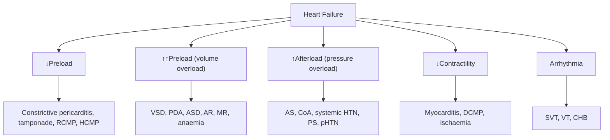

# Heart Failure in Children

## Definition

Heart failure (HF) in children is a clinical syndrome in which the heart is unable to deliver sufficient cardiac output to meet the metabolic demands of the body — or can only do so at the cost of abnormally elevated filling pressures [1][2].

Break it down: **"failure"** here does not mean the heart has stopped; it means a **mismatch** between what the body needs and what the heart can supply. Think of it as a supply-demand problem.

<Callout title="Paediatric HF ≠ Adult HF" type="error">

***In adults, heart failure is overwhelmingly due to dysfunction of the heart itself (ischaemic heart disease, cardiomyopathy). In children, the most common cause is overloading of a structurally or functionally normal heart — i.e., preserved contractility with volume or pressure overload from congenital heart disease (CHD).*** [1] This is a fundamental conceptual difference that changes the entire approach.

</Callout>

***'Heart Failure Syndrome': In adults → dysfunction of the heart. In children → overloading of the heart (much more common than dysfunction).*** [1]

---

## Epidemiology

### Global and Hong Kong Context

- **Congenital heart disease** is the leading cause of HF in children worldwide and in Hong Kong.
  - Incidence of CHD: approximately **8–10 per 1,000 live births** globally; similar in Hong Kong [2][3].
  - Of these, roughly **25–30%** will develop haemodynamically significant disease that can lead to HF.
- **Cardiomyopathy** (dilated, hypertrophic, restrictive): incidence approximately **1–1.7 per 100,000 children** per year.
- **Myocarditis**: incidence difficult to determine (many subclinical cases), estimated at 1–2 per 100,000 children per year.
- **Rheumatic heart disease**: declining in Hong Kong due to excellent antibiotic access, but still seen occasionally in immigrant populations and must be considered [4].
- **Age distribution of HF presentation** is bimodal:
  - **Neonates/early infants**: duct-dependent lesions, large L→R shunts as PVR falls.
  - **Older children/adolescents**: cardiomyopathies, post-surgical sequelae, acquired valve disease.

### Mortality and Prognosis

- Prognosis depends entirely on aetiology: surgically correctable CHD has an excellent prognosis, whereas end-stage cardiomyopathy in children who are not transplant candidates has a grave prognosis.
- 5-year survival for paediatric dilated cardiomyopathy without transplantation: ~50–60%.

---

## Risk Factors

| Category | Specific Risk Factors |
|---|---|
| **Genetic / Syndromic** | Trisomy 21 (AVSD), Turner syndrome (CoA, bicuspid AV), DiGeorge/22q11 deletion (conotruncal anomalies), Noonan syndrome (PS, HCMP), Williams syndrome (supravalvar AS), Marfan syndrome (AR, MR) |
| **Maternal / Perinatal** | Maternal rubella (PDA, PS), maternal diabetes (HCMP, VSD), maternal SLE with anti-Ro/La antibodies (congenital heart block), prematurity (PDA), birth asphyxia, perinatal infections |
| **Acquired** | Kawasaki disease (coronary artery aneurysms → MI), rheumatic fever (valvular disease), viral myocarditis, iron overload (thalassaemia major — very relevant in HK), chemotherapy (anthracyclines), neuromuscular disease (Duchenne muscular dystrophy) |
| **Metabolic** | Hypocalcaemia (especially low-birth-weight neonates), severe anaemia, thyrotoxicosis |

---

## Relevant Anatomy and Physiology

### Foetal Circulation — Why It Matters

Understanding HF in neonates requires understanding the **foetal-to-neonatal cardiovascular transition**:

1. **In utero**: The placenta is the gas-exchange organ. Pulmonary vascular resistance (PVR) is extremely high (lungs are fluid-filled, hypoxic vasoconstriction). Systemic vascular resistance (SVR) is low (placenta is a low-resistance bed).
   - **Right-to-left shunts** exist physiologically:
     - **Foramen ovale**: oxygenated blood from IVC (via ductus venosus from placenta) → RA → LA → LV → ascending aorta → brain and upper body.
     - **Ductus arteriosus**: RV output → pulmonary trunk → DA → descending aorta → lower body and placenta. Only ~10% of RV output actually goes to the lungs.
   - The **ductus arteriosus** is kept patent by **low PaO₂** and **circulating prostaglandin E₂ (PGE₂)** from the placenta [2].

2. **At birth**:
   - First breath → lung expansion → dramatic fall in PVR.
   - Cord clamping → loss of placenta → dramatic rise in SVR.
   - ↑PaO₂ + ↓circulating PGE₂ → **ductal constriction** (functional closure in 10–15 hours, anatomical closure by 2–3 weeks) [2].
   - ↑LA pressure (from increased pulmonary venous return) → functional closure of foramen ovale.
   - PVR continues to fall progressively over **6–8 weeks** (this is why L→R shunts become symptomatic at 2–3 months, not at birth).

### Frank-Starling Mechanism in Children

The Frank-Starling law applies equally to children: cardiac output is determined by **preload** (end-diastolic volume), **afterload** (resistance the ventricle must overcome to eject), and **contractility** (intrinsic force of contraction) [2][5].

However, the **neonatal myocardium** differs from the mature myocardium:
- **Fewer and more disorganised myofibrils** → less contractile reserve.
- **Stiffer (less compliant) ventricle** → operates near the top of the Starling curve → very sensitive to volume overload.
- **Higher resting heart rate** → limited ability to increase cardiac output by increasing heart rate (already near maximum).
- **Greater dependence on heart rate** (rather than stroke volume) for cardiac output → tachycardia is an early and important compensatory sign.

### Normal Cardiovascular Parameters by Age

| Parameter | Neonate | Infant (1–12 mo) | Child (1–10 y) | Adolescent |
|---|---|---|---|---|
| Heart rate (bpm) | 120–160 | 100–140 | 70–120 | 60–100 |
| Systolic BP (mmHg) | 60–90 | 80–100 | 90–110 | 100–120 |
| Respiratory rate | 30–60 | 25–40 | 18–30 | 12–20 |
| CTR on CXR (normal) | < 0.60 | < 0.55 | < 0.50 | < 0.50 |

> A cardiothoracic ratio (CTR) ≥ 0.6 in infants or ≥ 0.5 in older children suggests cardiomegaly [2].

---

## Aetiology

***The causes of paediatric heart failure differ fundamentally from those in adults.*** The table below is organised by **age group** and by **mechanism** (preserved contractility vs impaired contractility), as emphasised in the lecture slides and senior notes [1][2][3].

<Callout title="Key Concept: Preserved vs Impaired Contractility">

***Preserved contractility (volume/pressure overload of a structurally normal myocardium) is much more common than impaired contractility in paediatric HF.*** [1][2] This is because CHD is the dominant cause, and in most CHD the ventricle contracts well — it is simply overwhelmed.

</Callout>

### Neonatal Heart Failure

| Mechanism | Causes | Notes |
|---|---|---|
| ***Impaired contractility*** | ***Myocarditis*** | Viral (enterovirus, adenovirus, parvovirus B19); often fulminant in neonates |
| | ***Transient myocardial ischaemia*** | Perinatal asphyxia → subendocardial injury |
| | ***Cardiomyopathy*** | Metabolic (mitochondrial, glycogen storage), familial DCMP |
| | ***Arrhythmias*** | ***Congenital heart block*** (maternal anti-Ro/La); ***SVT, VT*** (may be ***WPW-related***) [2] |
| | ***Extracardiac causes*** | ***Sepsis, asphyxia, hypocalcaemia (in low birth weight babies), anaemia (e.g. fetomaternal transfusion)*** [2] |
| ***Preserved contractility*** | ***Duct-dependent CHD*** | ***LVOT obstruction: AS, CoA, IAA (interrupted aortic arch), HLHS*** [2] |
| | ***PDA in premature infants*** | Premature infants fail to close the ductus → volume overload |

**Why does duct-dependent CHD cause HF specifically in neonates?** Because the systemic circulation depends on the DA remaining open. When the DA closes at 10–15 hours to days of life, the infant loses its systemic blood supply → acute circulatory collapse, shock, and HF [2][3].

### Infant Heart Failure (2–3 months)

| Mechanism | Causes | Notes |
|---|---|---|
| ***Impaired contractility*** | ***Cardiomyopathy*** | As above |
| | ***MI due to Kawasaki disease or anomalous origin of left coronary artery from the pulmonary artery (ALCAPA)*** [2] | ALCAPA: as PVR falls → coronary perfusion pressure falls → myocardial ischaemia |
| | ***Arrhythmias*** | ***SVT, VT*** [2] |
| ***Preserved contractility (large L→R shunt)*** | ***VSD, AVSD, PDA, ASD (rarely)*** [1][2] | These become symptomatic at 2–3 months because PVR takes 6–8 weeks to fall to adult levels → progressive ↑L→R shunting → pulmonary overcirculation → LV volume overload → HF |

**Why 2–3 months?** In utero, PVR is very high → minimal shunting across L→R defects. After birth, PVR gradually falls. By 6–8 weeks, PVR is low enough that a large VSD or PDA allows massive L→R shunting → pulmonary overcirculation, pulmonary oedema, and LV volume overload [2].

### ***Heart Failure in Older Children and Adolescents*** [1]

| Mechanism | Causes | Notes |
|---|---|---|
| ***Myocardial disease*** | ***Myocarditis*** [1] | Viral (coxsackie B, adenovirus, parvovirus B19), autoimmune |
| | ***Cardiomyopathy (primary, secondary)*** [1] | **Primary**: DCMP, HCMP, RCMP, ARVC. **Secondary**: ***iron overload*** (thalassaemia major — **very important in HK**), ***post-chemotherapy*** (anthracyclines), ***neuromuscular disease*** (Duchenne/Becker) [2] |
| | ***Endomyocarditis*** | Infective endocarditis with myocardial involvement |
| | Premature MI | e.g. ***homozygous familial hypercholesterolaemia*** [2] |
| ***Structural*** | ***Unoperated structural heart defects*** [1] | Children who present late or are from underserved populations |
| | ***Certain repaired or palliated congenital heart defects*** [1] | Late ventricular dysfunction after Fontan, Mustard/Senning, or tetralogy repair |
| ***Valvular*** | ***MR, AR, TR, PR*** [2] | Rheumatic, post-surgical, degenerative |
| ***Other*** | ***High-output failure***: anaemia, thyrotoxicosis, AV fistula [2] | |
| | ***Fluid overload*** [2] | Iatrogenic (aggressive IV fluids), renal failure |
| ***Arrhythmias*** | SVT, VT, complete heart block | Tachycardia-mediated cardiomyopathy |

---

## Pathophysiology

### The Core Problem: Mismatch Between Supply and Demand

***Heart failure = cardiac output cannot meet demand → a mismatch!*** [1][2]

This mismatch can arise from:

### Compensatory Mechanisms

When cardiac output falls, the body activates several compensatory mechanisms. These are **initially adaptive** but become **maladaptive** with chronicity:

| Mechanism | How It Works | Initially Helpful? | Maladaptive Consequence |
|---|---|---|---|
| **Sympathetic nervous system activation** | ↑catecholamines → ↑HR, ↑contractility, ↑SVR | Yes — maintains BP and CO | ↑Myocardial oxygen demand, direct myocyte toxicity, downregulation of β-receptors, arrhythmias |
| **Renin-angiotensin-aldosterone system (RAAS)** | ↓Renal perfusion → renin → angiotensin II → aldosterone → Na⁺/H₂O retention + vasoconstriction | Yes — maintains circulating volume and BP | ↑Preload (congestion), ↑afterload, cardiac fibrosis, ventricular remodelling |
| **Natriuretic peptides (ANP, BNP)** | Released from stretched atria/ventricles → natriuresis, vasodilation | Yes — counteracts RAAS | Overwhelmed in advanced HF; levels used as biomarkers (NT-proBNP) |
| **Ventricular remodelling** | Eccentric hypertrophy (volume overload) or concentric hypertrophy (pressure overload) | Yes — normalises wall stress (Laplace's law) | Fibrosis, ↓compliance, ↓contractility over time, ↑arrhythmia risk |
| **Frank-Starling mechanism** | ↑Preload → ↑sarcomere stretch → ↑contractile force | Yes — up to a point | Past the optimal point on the Starling curve → pulmonary/systemic congestion with no further increase in CO |

### Pathophysiology by Specific Mechanism

#### Volume Overload (L→R Shunts: VSD, PDA, AVSD)

1. Defect allows blood to flow from high-pressure left side to lower-pressure right side.
2. **At birth**: PVR is high → minimal shunting → asymptomatic.
3. **By 6–8 weeks**: PVR falls → progressive ↑L→R shunting → **pulmonary overcirculation**.
4. ↑Pulmonary blood flow → ↑pulmonary venous return → **LV volume overload** (eccentric dilatation).
5. The LV dilates to accommodate the increased volume (Frank-Starling), but eventually the myocardium cannot keep up → **heart failure symptoms emerge at ~2–3 months**.
6. Excessive pulmonary blood flow → interstitial pulmonary oedema → ↑work of breathing → **tachypnoea, subcostal recession, feeding difficulties**.
7. ↑Metabolic demand (from increased work of breathing + sympathetic activation) + ↓caloric intake (poor feeding) → **failure to thrive**.

> **Important nuance**: In a VSD, the RV is NOT volume-overloaded in early stages — it merely acts as a conduit for blood flowing from LV → RV → PA. The RV preload is not increased because the blood passes straight through. It is the **LV that is volume-overloaded** from increased pulmonary venous return [2][3].

#### Pressure Overload (Duct-Dependent Systemic Circulation: CoA, HLHS, Critical AS)

1. Severe LVOT obstruction → the LV cannot pump adequate blood into the systemic circulation.
2. **In utero**: The DA allows the RV to supply the descending aorta → foetus is well.
3. **After birth**: DA closes → sudden loss of systemic blood supply → **acute circulatory collapse, shock** [2][3].
4. ***Day 2 neonatal HF with shock and oliguria (classical)*** [3].
5. Key concept: The RV is effectively supporting the systemic circulation through the DA → **RV impulse** is present (not LV) [3].

#### Impaired Contractility (Myocarditis, Cardiomyopathy)

1. Direct myocyte damage (viral, toxic, genetic) → ↓contractility → ↓CO.
2. Compensatory mechanisms activate: ↑SNS, ↑RAAS → fluid retention, vasoconstriction.
3. Ventricular dilatation (eccentric remodelling) → ↑wall stress → further ↓contractility (vicious cycle).
4. LV dilatation → mitral annular dilatation → **functional MR** → further volume overload.

#### Arrhythmia-Mediated HF

- **SVT** in infants: sustained rates > 220 bpm → insufficient diastolic filling time → ↓CO.
- **Congenital heart block**: very slow ventricular rate → ↓CO despite normal stroke volume.
- **Tachycardia-mediated cardiomyopathy**: prolonged tachycardia (even moderate rates) → myocardial energy depletion → reversible ventricular dysfunction.

### High-Output Heart Failure

In high-output HF, the cardiac output is actually normal or elevated, but peripheral demands exceed even this increased output:
- **Severe anaemia**: ↓oxygen-carrying capacity → compensatory ↑CO, but tissues still hypoxic → HF symptoms.
- **Thyrotoxicosis**: ↑metabolic rate → ↑CO demand.
- **Arteriovenous fistula/malformation**: low-resistance pathway → blood "steals" from systemic circulation → heart must pump more to compensate.

---

## Classification

### By Mechanism [1][2][5]

| Category | Examples |
|---|---|
| **Preserved contractility** (overloading) — ***more common in children*** | L→R shunts (VSD, PDA, ASD, AVSD), valvular regurgitation (MR, AR), high-output states |
| **Impaired contractility** — ***less common in children*** | Myocarditis, cardiomyopathy, arrhythmias, post-surgical ventricular dysfunction |

### By Cardiac Output [5]

| Type | Pathophysiology | Causes |
|---|---|---|
| **Low-output HF** | ↓CO + ↑filling pressures | Most structural and myocardial causes |
| **High-output HF** | Normal/↑CO but ↓SVR or ↓Hb → inadequate tissue perfusion | Anaemia, thyrotoxicosis, AV fistula, beriberi |

### By Laterality [5]

| Type | Pathophysiology | Clinical Picture |
|---|---|---|
| **Left HF** | ↓LV output → ↑LA pressure → pulmonary venous congestion | Tachypnoea, respiratory distress, pulmonary oedema |
| **Right HF** | ↓RV output → ↑RA pressure → systemic venous congestion | Hepatomegaly, peripheral oedema, ascites, raised JVP (difficult to see in infants) |
| **Biventricular HF** | Both sides affected | Combined features; common in advanced disease |

**Why does right HF cause hepatomegaly and ascites?** Because ↑RA pressure transmits backward through the IVC and hepatic veins → hydrostatic back-pressure in the hepatic sinusoids → hepatomegaly. Prolonged congestion → transudation of fluid into the peritoneum → ascites [5].

### ***Paediatric HF Staging*** [2]

This is analogous to the ACC/AHA staging system for adult HF but adapted for children:

| Stage | Definition | Examples |
|---|---|---|
| **A** | At risk for HF but no structural disease or symptoms | Family history of cardiomyopathy, previous anthracycline exposure, single ventricle physiology (pre-surgical) |
| **B** | Structural or functional heart disease but no HF symptoms | Asymptomatic VSD, mild ventricular dysfunction on echo, asymptomatic cardiomyopathy |
| **C** | Structural/functional heart disease with current or past HF symptoms | Symptomatic VSD with HF, dilated cardiomyopathy with symptoms |
| **D** | Advanced/refractory HF requiring specialised interventions | HF despite maximal medical therapy, requiring IV inotropes, mechanical support, or transplant |

### ***Ross Classification*** (Functional Severity) [2]

The Ross classification is the **paediatric equivalent of the NYHA classification** and is designed for **infants** (since infants cannot describe symptoms):

| Class | Description |
|---|---|
| **I** | Asymptomatic |
| **II** | Mild tachypnoea or diaphoresis with feeding (infants); dyspnoea on exertion (older children) |
| **III** | Marked tachypnoea or diaphoresis with feeding; prolonged feeding times; growth failure |
| **IV** | Symptomatic at rest: tachypnoea, retractions, grunting, or diaphoresis at rest |

> For **older children**, the modified Ross classification maps onto NYHA: Class I = asymptomatic; Class II = mild exercise intolerance; Class III = marked exercise intolerance; Class IV = symptoms at rest.

---

## Clinical Features

<Callout title="Clinical features are very non-specific in paediatric HF" type="error">

***Clinical features of HF in children are very non-specific*** [2] — they overlap with respiratory disease, sepsis, metabolic disease, and feeding difficulties. A high index of suspicion is needed. The younger the child, the more subtle the signs.

</Callout>

### Symptoms (by Age Group)

#### ***Infants*** [2]

| Symptom | Pathophysiological Basis |
|---|---|
| ***Poor feeding*** | ↑work of breathing → dyspnoea during feeding (which requires coordinated suck-swallow-breathe); sympathetic activation → splanchnic vasoconstriction → ↓GI motility; fatigue from ↓CO |
| ***Tachypnoea / diaphoresis during feeds*** | Feeding increases metabolic demand (equivalent to exercise in infants) → a failing heart cannot meet this demand → dyspnoea and sympathetic-mediated sweating |
| ***↓Volume of feeding*** | Dyspnoea interrupts feeding → infant takes smaller volumes and tires quickly |
| ***Failure to thrive (FTT)*** | Triple hit: (1) ↓caloric intake (poor feeding), (2) ↑metabolic demand (from ↑work of breathing, ↑sympathetic drive, ↑myocardial work), (3) ↓nutrient absorption (GI venous congestion) |
| ***Easy fatiguability / irritability*** | ↓CO → inadequate tissue perfusion → reduced energy for normal activity; irritability may be the infant equivalent of "discomfort" |
| ***±Delayed motor milestones*** | Chronic ↓CO + poor nutrition → reduced muscle mass and energy for motor development [2] |
| ***Excessive sweating*** | Sympathetic nervous system activation → diaphoresis, especially during the exertion of feeding |
| ***Shortness of breath (especially on exertion/feeding)*** | Pulmonary venous congestion → interstitial oedema → ↓lung compliance → ↑work of breathing |
| ***Recurrent lower respiratory tract infections*** | Pulmonary overcirculation (in L→R shunts) → boggy, oedematous airways → impaired mucociliary clearance → predisposition to RTIs [2] |

#### ***Young Children*** [2]

| Symptom | Pathophysiological Basis |
|---|---|
| ***GI symptoms (abdominal pain, nausea/vomiting, ↓appetite)*** | Hepatic congestion (RHF) → hepatomegaly → capsular stretch → pain; gut congestion → ↓absorption, nausea |
| ***Failure to thrive*** | As above |
| ***Easy fatiguability*** | ↓CO → inadequate muscle perfusion |
| ***Recurrent or chronic cough with wheezing*** | Pulmonary venous congestion → peribronchial oedema → airway narrowing → wheezing (often misdiagnosed as "asthma") |

#### ***Older Children and Adolescents*** [2]

| Symptom | Pathophysiological Basis |
|---|---|
| ***Exercise intolerance*** | ↓CO reserve → inability to augment output during exercise |
| ***Anorexia*** | Hepatic and GI congestion; neurohormonal activation (↑TNF-α, cachexia pathways) |
| ***Abdominal pain*** | Hepatic capsular stretch from congestion |
| ***Wheezing*** | Peribronchial oedema (cardiac "asthma") |
| ***Dyspnoea*** | Pulmonary congestion → ↓compliance → ↑work of breathing |
| ***Oedema*** | RAAS activation → Na⁺/H₂O retention + ↑hydrostatic pressure in systemic veins |
| ***Palpitation*** | Compensatory tachycardia; arrhythmias (atrial or ventricular) |
| ***Chest pain*** | Myocardial ischaemia (↑demand vs ↓supply); chest wall discomfort from increased work of breathing |
| ***Syncope*** | ↓CO → inadequate cerebral perfusion, especially on exertion; arrhythmias |
| ***Malaise, SOB on exertion*** [2] | General manifestations of ↓CO and pulmonary congestion |
| ***Weight gain (fluid retention)*** [2] | RAAS activation → fluid retention |
| ***Orthopnoea (rare in children)*** [2] | Supine position → ↑venous return → ↑pulmonary congestion; rare because children adapt posturally without articulating it |

### Signs (Organised by Pathophysiological Mechanism)

#### ***Compensatory Mechanisms*** [2]

| Sign | Mechanism |
|---|---|
| ***Tachycardia*** | Sympathetic activation → ↑HR to compensate for ↓SV. This is often the **earliest sign** of HF in infants (because neonatal hearts are highly rate-dependent for CO) |
| ***Cardiomegaly*** | Ventricular dilatation (volume overload) and/or hypertrophy (pressure overload) → enlarged cardiac silhouette on CXR; palpable as a displaced, diffuse apex beat |
| ***Precordial bulge*** | Chronic cardiomegaly in infants (whose chest wall is compliant) → visible and palpable chest wall deformity |

#### ***Pulmonary Venous Congestion (Left HF)*** [2]

| Sign | Mechanism |
|---|---|
| ***Tachypnoea*** | ↑LA pressure → ↑pulmonary venous pressure → interstitial oedema → ↓lung compliance → body compensates by increasing respiratory rate to maintain minute ventilation |
| ***Subcostal/intercostal recession ("insucking")*** | ↓Lung compliance from pulmonary oedema → greater negative intrapleural pressure needed → visible retraction of soft tissues |
| ***Laboured breathing*** | ↑Work of breathing from stiff, oedematous lungs |
| ***Wheezing (especially in infants)*** | Peribronchial oedema → extrinsic compression of small airways → expiratory wheeze. This is why HF in infants is frequently misdiagnosed as bronchiolitis or asthma [2] |
| ***Fine crepitations (bibasal)*** | Alveolar transudation → fluid in alveoli → crepitations on auscultation (more common in older children; difficult to appreciate in infants) |

<Callout title="Cardiac Asthma in Children" type="idea">

Wheezing in infants with HF is due to peribronchial oedema from pulmonary venous congestion, not bronchospasm. This is called "cardiac asthma." It is a common exam pitfall — an infant with "recurrent wheeze not responding to bronchodilators" should raise suspicion for HF.

</Callout>

#### ***Systemic Venous Congestion (Right HF)*** [2]

| Sign | Mechanism |
|---|---|
| ***Hepatomegaly*** | ↑RA pressure → ↑IVC pressure → hepatic venous congestion → liver enlargement. **The most reliable sign of systemic venous congestion in infants** (because JVP is very difficult to assess). The liver edge descends below the costal margin; it is tender due to capsular stretch |
| ***Distension of neck veins (JVP)*** | ↑RA pressure → distended jugular veins. ***Difficult to assess in infants*** [2] due to short, fat necks and difficulty with cooperation |
| ***Facial puffiness*** | Fluid retention + ↑venous pressure → oedema in dependent areas. ***In infants, facial/periorbital puffiness is more common than ankle oedema*** [2] because infants are usually supine → face is the most dependent area |
| ***Peripheral oedema*** | Na⁺/H₂O retention + ↑venous hydrostatic pressure → transudation into interstitium. Ankle oedema in ambulatory older children; sacral oedema in bed-bound patients |

#### ***↓Cardiac Output*** [2]

| Sign | Mechanism |
|---|---|
| ***Cool extremities*** | ↓CO → compensatory peripheral vasoconstriction (sympathetic) → reduced skin perfusion |
| ***Decreased pulse volume*** | ↓Stroke volume → reduced pulse pressure → weak, thready pulses |
| ***Prolonged capillary refill (> 3 seconds in children)*** | Peripheral vasoconstriction → sluggish microcirculation |
| ***Pallor*** | Peripheral vasoconstriction → reduced cutaneous blood flow |
| ***Oliguria*** | ↓Renal perfusion → ↓GFR → reduced urine output; also RAAS-mediated Na⁺/H₂O reabsorption |
| ***Altered consciousness / irritability*** | ↓Cerebral perfusion → altered sensorium |

#### Auscultatory Signs (Depend on Underlying Cause)

| Sign | Mechanism |
|---|---|
| **Gallop rhythm (S3)** | Rapid ventricular filling into a dilated, volume-overloaded ventricle → S3 (heard in early diastole). Indicates volume overload |
| **S4** | Atrial contraction into a stiff, non-compliant ventricle → S4 (heard in late diastole). Indicates diastolic dysfunction / pressure overload |
| **Murmurs** | Depend on the underlying lesion: PSM of VSD, continuous murmur of PDA, ESM of AS or PS, MDM of mitral flow (large L→R shunt), etc. Functional MR/TR murmurs from ventricular dilatation |

### Summary Table: Symptoms and Signs by Age Group

| | **Infants** | **Older Children / Adolescents** |
|---|---|---|
| **Symptoms** | ***Poor feeding, FTT, SOB (esp on exertion/feeding), excessive sweating, recurrent LRTI*** | ***Malaise, SOB on exertion, ↓exercise tolerance, weight gain (fluid retention), orthopnoea (rare)*** [2] |
| **Compensatory** | ***Tachycardia, cardiomegaly*** | ***Tachycardia, cardiomegaly*** |
| **Pulmonary congestion** | ***Tachypnoea, subcostal insucking, laboured breathing, wheezing*** | ***Dyspnoea, cough, crepitations*** |
| **Systemic congestion** | ***Hepatomegaly, facial puffiness*** (JVP difficult) | ***Hepatomegaly, JVP distension, peripheral oedema*** |
| **↓CO** | ***Cool extremities, ↓pulse volume, prolonged CRT*** | ***Cool extremities, ↓pulse volume, prolonged CRT*** |

### Age-Specific Presentation Patterns Worth Knowing

| Age at Presentation | Think About... | Why? |
|---|---|---|
| **Day 1–3** | ***Duct-dependent lesions*** (HLHS, critical CoA, critical AS, IAA) | DA closing → loss of systemic blood supply → shock |
| **Day 1–7** | ***Arrhythmias*** (SVT, congenital heart block) | Sustained tachycardia or bradycardia → ↓CO |
| **Day 1–7** | ***Transient myocardial ischaemia***, asphyxia, sepsis | Perinatal insults |
| **2–3 months** | ***Large L→R shunts*** (VSD, AVSD, PDA) | PVR falls → ↑shunting → overcirculation → HF |
| **3–6 months** | ***ALCAPA*** | PVR falls → coronary steal → myocardial ischaemia |
| **Childhood** | ***Myocarditis, cardiomyopathy*** | Viral infection, genetic |
| **Adolescence** | ***Rheumatic heart disease, DCMP, post-surgical*** | Late-presenting acquired or previously repaired CHD |

---

## Special Considerations in the Paediatric Setting

### Family-Centred Care

- Parents/caregivers are essential informants — they notice subtle changes (feeding pattern, activity level, colour changes) before clinical signs are obvious.
- Communication should be empathetic, avoiding jargon. Explain "heart failure" carefully — families may interpret "failure" as meaning the heart has stopped.

### Consent and Assent

- **Neonates/infants**: parental consent for all investigations and treatments.
- **School-age children**: explain procedures in age-appropriate language; seek assent where possible.
- **Adolescents (Gillick competent)**: may give their own consent if they demonstrate sufficient understanding.

### Growth and Development Monitoring

- Growth failure is both a **symptom and a consequence** of chronic HF → serial plotting on growth charts is essential.
- Delayed motor milestones may be seen in infants with chronic HF due to ↓energy and poor nutrition.
- Neurodevelopmental screening should be part of follow-up, especially in children with complex CHD.

---

<Callout title="High Yield Summary">

1. ***Heart failure in children is most commonly due to overloading of a heart with preserved contractility (CHD), NOT impaired contractility (which dominates in adults).*** [1]
2. **Neonatal HF**: Think duct-dependent lesions (HLHS, CoA, critical AS) → presents in first days of life when DA closes; also arrhythmias, sepsis, asphyxia, hypocalcaemia.
3. **Infant HF (2–3 months)**: Think large L→R shunts (VSD, AVSD, PDA) → PVR falls → ↑shunting → pulmonary overcirculation → LV volume overload.
4. ***Older children***: ***Myocarditis, cardiomyopathy (primary and secondary including iron overload and post-chemo), unoperated CHD, repaired CHD with late ventricular dysfunction.*** [1]
5. ***Clinical features are very non-specific.*** Infants: poor feeding, FTT, tachypnoea, diaphoresis during feeds, hepatomegaly. Older children: exercise intolerance, dyspnoea, oedema.
6. **Key signs by mechanism**: Compensatory (tachycardia, cardiomegaly) → Pulmonary congestion (tachypnoea, recession, wheeze) → Systemic congestion (hepatomegaly, facial puffiness in infants, JVP/oedema in older children) → ↓CO (cool extremities, weak pulses, prolonged CRT).
7. **Ross classification** = paediatric NYHA. **Paediatric HF staging** = A (at risk) → B (structural, asymptomatic) → C (symptomatic) → D (refractory).
8. **CTR**: ≥ 0.6 in infants, ≥ 0.5 in children = cardiomegaly on CXR.
9. ***Management principles***: ***Identify cause and precipitating factors → tackle precipitants → general supportive measures → medical therapy (diuretics, digoxin, ACEI, carvedilol) → treat underlying cause (surgical/catheter intervention) → mechanical support / transplant.*** [1]

</Callout>

---

<ActiveRecallQuiz
  title="Active Recall - Heart Failure in Children"
  items={[
    {
      question: "Why do large L-to-R shunts (e.g. VSD) typically present with heart failure at 2-3 months of age rather than at birth?",
      markscheme: "In utero PVR is very high so minimal shunting occurs. After birth, PVR gradually falls over 6-8 weeks. By 2-3 months PVR is low enough to allow significant L-to-R shunting causing pulmonary overcirculation and LV volume overload leading to HF symptoms."
    },
    {
      question: "In paediatric HF, what is the fundamental difference in the most common mechanism compared to adult HF?",
      markscheme: "In children, HF is most commonly due to overloading (volume or pressure) of a heart with preserved contractility (e.g. CHD). In adults, HF is most commonly due to impaired contractility (e.g. ischaemic heart disease, cardiomyopathy)."
    },
    {
      question: "A neonate presents with shock on day 2 of life. Name three duct-dependent lesions that cause neonatal HF with shock when the ductus arteriosus closes.",
      markscheme: "Hypoplastic left heart syndrome (HLHS), coarctation of aorta (CoA), critical aortic stenosis (AS), interrupted aortic arch (IAA). Any three acceptable."
    },
    {
      question: "Why is hepatomegaly a more reliable sign of systemic venous congestion than JVP in infants with heart failure?",
      markscheme: "Infants have short and fat necks making JVP assessment very difficult. Hepatomegaly from hepatic venous congestion due to raised RA pressure is more readily palpable and is the most reliable sign of right-sided congestion in this age group."
    },
    {
      question: "Explain why infants with heart failure develop facial puffiness rather than ankle oedema.",
      markscheme: "Infants are predominantly supine so the most dependent area is the face and periorbital region. Fluid retention and raised venous pressure lead to transudation in dependent areas, hence facial puffiness rather than ankle oedema (which is seen in ambulatory older children)."
    },
    {
      question: "What are the four stages of the paediatric heart failure staging system, and what management is appropriate for Stage C?",
      markscheme: "Stage A: at risk, no structural disease (no specific Tx). Stage B: structural/functional disease, asymptomatic (ACEI/ARB plus BB). Stage C: structural disease with current/past HF symptoms (ACEI/ARB plus BB plus MRA plus diuretics for fluid overload). Stage D: refractory HF (above plus IV inotropes, mechanical support, transplant)."
    }
  ]}
/>

---

## References

[1] Lecture slides: GC 147. Heart failure and cyanosis in children acyanotic and cyanotic congenital heart disease - Part 1.pdf (p6, p11, p35, p36)
[2] Senior notes: Adrian Lui Pediatrics.pdf (p197–201)
[3] Senior notes: Ryan Ho Cardiology.pdf (p187–194)
[4] Senior notes: Ryan Ho Cardiology.pdf (p146)
[5] Senior notes: Ryan Ho Fundamentals.pdf (p214–215)
