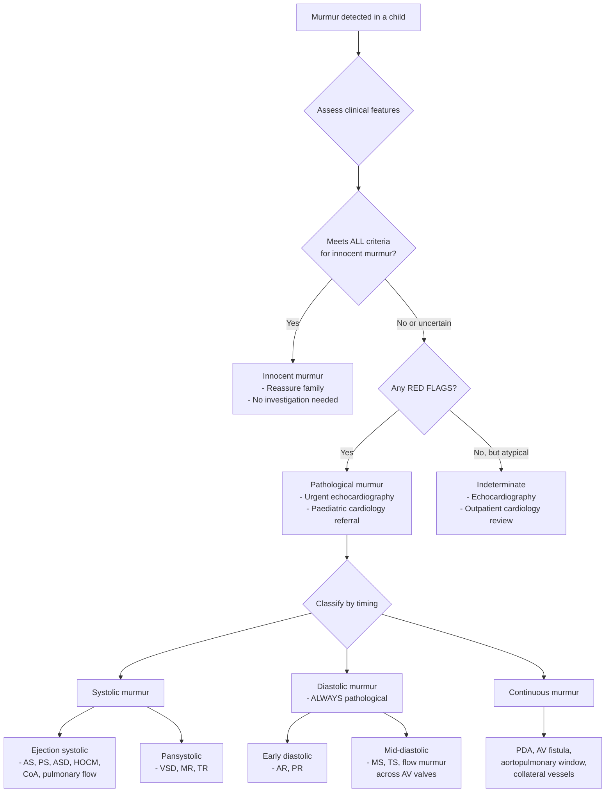
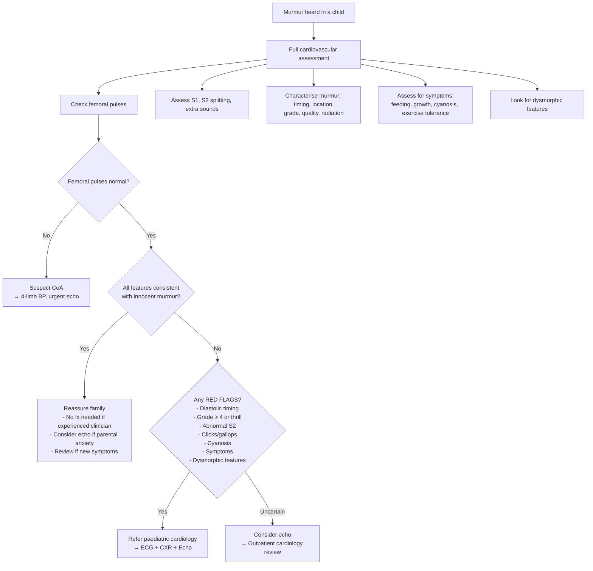

## Differential Diagnosis of a Heart Murmur in a Child

When you hear a murmur in a child, your clinical task is to determine: **Is this innocent or pathological?** And if pathological, **what is the underlying lesion?** This section walks through the systematic differential diagnosis, starting from first principles.

---

### The Fundamental Question: Innocent vs Pathological

Before listing specific diagnoses, recall that the differential for any paediatric murmur splits into two broad camps:

1. **Innocent murmur** (50–80% of all childhood murmurs) — normal heart, normal haemodynamics
2. **Pathological murmur** — structural or functional cardiac abnormality

The clinical features discussed in the previous section (the "7 S's," positional variation, normal S2, no thrill, no extra sounds, asymptomatic child with normal growth and pulses) allow experienced clinicians to distinguish these at the bedside in most cases [1][2].

However, when features are equivocal or concerning, you must systematically consider the pathological causes. These are organised below by timing, character, and clinical context.

---

### Approach to the Differential: Organising Framework

The most logical way to think through the differential is to **start with the murmur characteristics** (timing, location, character) and then overlay clinical context (age, symptoms, associated findings).

---

### Differential Diagnosis by Murmur Timing

#### A. Systolic Murmurs

Systolic murmurs are the most common in children. They can be **ejection** (crescendo-decrescendo, with a gap after S1) or **pansystolic** (uniform intensity from S1 to S2, no gap after S1). This distinction is critical.

##### 1. Ejection Systolic Murmur (ESM) — Crescendo-Decrescendo

These are produced by blood being ejected across a semilunar valve (aortic or pulmonary) or through a narrowed outflow tract.

| Condition | Location | Key Features | Why This Murmur Occurs |
|-----------|----------|-------------|----------------------|
| ***Innocent Still's murmur*** | LLSB | Musical/vibratory, Grade ≤ 3, changes with position, asymptomatic | Normal flow vibrations of cardiac structures (chordae, LVOT) in a thin-chested child with vigorous circulation |
| ***Innocent pulmonary flow murmur*** | LUSB | Soft blowing, Grade ≤ 2, changes with position | Normal turbulence across the pulmonic valve with high CO relative to body size |
| ***Innocent peripheral pulmonary stenosis*** | LUSB → axillae and back | Neonates, radiates bilaterally, resolves by 6 months | Relative disproportion between main PA and branch PAs in neonates |
| **Pulmonary valve stenosis (PS)** | LUSB | ***Ejection click*** (heard best on expiration — unique to PS), harsh ESM, ***wide splitting of S2*** with soft P2, RV heave if severe | Thickened/domed pulmonary valve → obstruction to RV outflow → turbulent jet across narrowed orifice. Click = halting of domed valve opening. Wide S2 split because RV takes longer to empty [1][2] |
| **Aortic valve stenosis (AS)** | RUSB → carotids | ***Ejection click*** (does NOT vary with respiration — because aortic valve opening pressure does not change with respiration), harsh ESM radiating to neck, ***narrow pulse pressure***, ***delayed carotid upstroke***, may have paradoxically split S2 | Thickened/bicuspid aortic valve → obstruction to LV outflow → slow ejection → delayed A2 closure. In severe AS, the murmur peaks later in systole ("late peaking") [2][3] |
| ***Atrial septal defect (ASD)*** | LUSB | ***Fixed splitting of S2*** (the hallmark — does NOT vary with respiration), soft ESM at LUSB (NOT from the ASD itself, but from ↑flow across the pulmonic valve due to L-to-R shunt), ± mid-diastolic rumble at tricuspid area if large shunt | ASD allows L-to-R shunting → ↑RV volume → ↑flow across the normal pulmonic valve → relative "flow" ESM. Fixed splitting because atrial communication equalises filling pressures of both ventricles regardless of respiration [1][2] |
| **Hypertrophic obstructive cardiomyopathy (HOCM)** | LLSB / apex | ESM that ***increases with Valsalva and standing*** (opposite to most murmurs), ± MR murmur, ± S4. **Family history of sudden death** | Asymmetric septal hypertrophy → dynamic LVOT obstruction. Valsalva/standing ↓preload → ↓LV cavity size → septum and mitral leaflet (SAM) more easily approximate → MORE obstruction → LOUDER murmur. This is the OPPOSITE of innocent murmurs which get softer on standing [3] |
| **Coarctation of aorta (CoA)** | Left infraclavicular / interscapular (back) | ***Weak/absent femoral pulses***, ***radio-femoral delay***, ***upper limb hypertension***, ***4-limb BP gradient > 20 mmHg***. Murmur is often soft and non-specific | Narrowing of aortic isthmus (usually near ductus arteriosus) → obstruction to flow → turbulence at coarctation site. Murmur may be ejection or continuous (if collaterals develop). ***Note: coarctation is only associated with soft and non-specific murmurs → look hard for soft/absent femoral pulses*** [1] |

<Callout title="HOCM vs Innocent Murmur: The Valsalva Trap" type="error">
This is a **classic exam question**. Both HOCM and innocent murmurs produce ejection systolic murmurs at the LLSB. BUT:
- **Innocent murmur**: Gets SOFTER with Valsalva/standing (↓preload → ↓CO → less turbulence)
- **HOCM**: Gets LOUDER with Valsalva/standing (↓preload → ↓LV cavity → more dynamic obstruction)

If a murmur gets louder when the child stands up → think HOCM, NOT innocent. Ask about family history of sudden cardiac death.
</Callout>

##### 2. Pansystolic Murmur (PSM) — Uniform Intensity, S1 to S2

These are produced by blood flowing from a high-pressure to a low-pressure chamber **throughout systole** via an abnormal communication or incompetent valve. A pansystolic murmur is **never innocent** [1][2].

| Condition | Location | Key Features | Why This Murmur Occurs |
|-----------|----------|-------------|----------------------|
| ***Ventricular septal defect (VSD)*** | ***LLSB*** (perimembranous/muscular), ***LUSB*** (subarterial) | ***PSM at LLSB, widely radiating, often with thrill***. Small VSD: loud murmur, asymptomatic ("maladie de Roger"). Large VSD: softer murmur (less pressure gradient), ± signs of HF, ± MDM at apex (from ↑mitral flow) [2][3] | Defect in interventricular septum → L-to-R shunt throughout systole (LV pressure > RV pressure during entire systole). Small VSD = large pressure gradient = loud murmur = paradoxically less haemodynamic compromise. Large VSD = smaller pressure gradient (pressures equalise) = quieter murmur but more shunting |
| **Mitral regurgitation (MR)** | Apex → axilla | PSM best at apex radiating to axilla, ± displaced/thrusting apex, ± S3 | Incompetent mitral valve → backward leak from LV to LA throughout systole. In children: rheumatic heart disease (in HK, now rare), congenital MV anomaly, MVP, myocarditis |
| **Tricuspid regurgitation (TR)** | LLSB / tricuspid area | PSM that ***increases with inspiration*** (Carvallo's sign — ↑venous return → ↑RV filling → ↑regurgitant volume), ± elevated JVP with prominent v-waves | Incompetent tricuspid valve → backward leak from RV to RA throughout systole |

<Callout title="Small VSD: The Loudest Innocent-Sounding Pathological Murmur">
A **small restrictive VSD** produces a ***loud PSM*** (often Grade 4–5/6 with a thrill) because the large pressure gradient between LV and RV drives blood forcefully through a tiny hole. Despite the dramatic murmur, the child is usually **asymptomatic** with normal growth — 75% close spontaneously by age 2 [2][3]. This is NOT an innocent murmur (it is structural), but the child does well. Conversely, a **large VSD** has a **softer** murmur because pressures equalise, but the child is sicker.

**Key teaching point**: Louder murmur ≠ sicker child. In VSD, the opposite is often true.
</Callout>

##### 3. Late Systolic Murmur

| Condition | Location | Key Features | Why This Murmur Occurs |
|-----------|----------|-------------|----------------------|
| **Mitral valve prolapse (MVP)** | Apex | ***Mid-systolic click*** followed by a late systolic murmur. Click moves earlier in systole with standing (↓preload → ↓LV volume → valve prolapses earlier). Associated with Marfan syndrome, Ehlers-Danlos, connective tissue disorders [4] | Myxomatous degeneration of mitral valve leaflets → leaflet billows back into LA during mid-late systole → click (sudden tensing of chordae) followed by regurgitant murmur |

---

#### B. Diastolic Murmurs

> ***A diastolic murmur is NEVER innocent.*** Any diastolic murmur in a child warrants investigation [1][2].

| Timing | Condition | Location | Key Features | Pathophysiology |
|--------|-----------|----------|-------------|----------------|
| **Early diastolic** (decrescendo) | **Aortic regurgitation (AR)** | LSB (lean forward, end-expiration) | High-pitched, blowing, decrescendo. In children: may be secondary to bicuspid aortic valve, rheumatic heart disease, subarterial VSD with cusp prolapse [3] | Incompetent aortic valve → backward leak from aorta to LV during diastole. Blood rushes back as aortic pressure > LV pressure immediately after valve closure → loudest at start, fades as gradient decreases |
| **Early diastolic** | **Pulmonary regurgitation (PR)** | LUSB | Graham Steell murmur — suggests pulmonary HTN. Increases with inspiration | Incompetent pulmonic valve, usually secondary to pulmonary HTN → regurgitation during diastole |
| **Mid-diastolic** (rumble) | **Mitral stenosis (MS)** | Apex (left lateral decubitus) | Low-pitched rumble, ± opening snap, loud S1. Rare in children unless rheumatic. In large VSD or ASD with significant L-to-R shunt, a "relative" mid-diastolic flow rumble may be heard at the apex or tricuspid area (from ↑flow across normal AV valves) [2][3] | Stenotic mitral valve → obstruction to LA emptying during diastole → turbulence as blood is forced through narrow orifice |

<Callout title="Flow Murmurs Across AV Valves in Large Shunts" type="idea">
In a ***large VSD***, the massive L-to-R shunt means ↑↑ pulmonary venous return to the LA → ↑ flow across a normal mitral valve → ***mid-diastolic murmur (MDM) at the apex***. This does NOT mean the mitral valve is stenotic — it is a "relative" stenosis from excessive flow. Similarly, in a ***large ASD***, ↑ flow across the tricuspid valve → MDM at the tricuspid area. These flow murmurs indicate a haemodynamically significant shunt [2][3].
</Callout>

---

#### C. Continuous Murmurs

A continuous murmur spans systole AND diastole without interruption. The only common innocent continuous murmur is the **venous hum**.

| Condition | Location | Key Features | Pathophysiology |
|-----------|----------|-------------|----------------|
| ***Innocent venous hum*** | Supraclavicular (R > L) | ***Disappears supine, with head turning, with jugular compression***. Low-pitched humming | Turbulence in jugular veins at the confluence with brachiocephalic/SVC |
| ***Patent ductus arteriosus (PDA)*** | ***Left infraclavicular / LUSB*** | ***"Machinery" murmur with systolic accentuation***, does NOT change with position/head turning. ***Bounding pulses*** (wide pulse pressure — systolic run-off into PA lowers diastolic BP), ± signs of HF if large [1][2] | Persistent communication between aorta and PA → blood flows continuously from high-pressure aorta to lower-pressure PA throughout cardiac cycle. Loudest in systole because aorto-pulmonary gradient is maximal |
| **Aortopulmonary window** | LUSB | Similar to PDA but rare. Usually presents with HF in infancy | Congenital defect between ascending aorta and main PA → large L-to-R shunt |
| **Coronary AV fistula** | Variable | Continuous murmur, site depends on fistula location | Abnormal connection between coronary artery and a cardiac chamber/great vessel → continuous flow |
| **Surgical shunts** (e.g., Blalock-Taussig) | Beneath clavicle | Continuous murmur, context of prior surgery | Surgical anastomosis creating permanent arterio-venous or systemic-to-pulmonary connection |
| **Collateral vessels in coarctation** | Back (interscapular) | Continuous murmur heard posteriorly, associated with rib notching on CXR in older children | Extensive collateral circulation develops to bypass the coarctation → continuous flow through tortuous intercostal arteries |

---

### Differential Diagnosis by Age

Age is one of the most powerful discriminators in paediatric cardiology, because different lesions present at characteristic time points based on haemodynamic changes during the fetal-to-neonatal transition and subsequent growth [1][2].

| Age | Likely Innocent Murmur | Pathological Conditions to Consider | Why At This Age? |
|-----|----------------------|-----------------------------------|-----------------|
| **Neonate (0–28 days)** | Peripheral pulmonary stenosis | ***Duct-dependent lesions*** (critical AS, critical PS, CoA, HLHS, TGA, pulmonary atresia), large VSD (but often silent until PVR falls at 6–8 weeks), PDA | Duct-dependent lesions present when PDA closes (12–72h). ***Neonatal HF implies duct-dependent systemic circulation*** → HF with closure of duct, may present with acute shock, weak LL pulses, oliguria and severe metabolic acidosis in 1st week of life [1] |
| **Infant (1–12 months)** | Peripheral PS (resolving) | ***VSD, AVSD, large PDA*** — present at 6–12 weeks as PVR falls and L-to-R shunting increases. CoA if missed neonatally | ***↓postnatal PVR at 2–3 months → ↑↑ L-to-R shunting with ↑ pulmonary flow*** → HF symptoms (tachypnoea, poor feeding, FTT) [1][2] |
| **Toddler/Preschool (2–6 years)** | Still's murmur, Venous hum | ASD (often clinically silent until preschool age), small VSD (often heard earlier), PS, AS | ASD produces subtle findings (no thrill, soft ESM, fixed split S2) that are easily missed in younger infants |
| **School-age (6–12 years)** | Still's murmur, Pulmonary flow murmur | ***Rheumatic heart disease*** (post-streptococcal, typically MS/MR — still relevant in HK though declining), bicuspid aortic valve, HOCM, MVP | Rheumatic fever occurs 2–4 weeks after untreated Group A streptococcal pharyngitis, peak age 5–15 years |
| **Adolescent** | Pulmonary flow murmur, Supraclavicular bruit | HOCM (may present with exertional symptoms or sudden death), MVP, bicuspid aortic valve with progressive AS/AR | HOCM may be unmasked during competitive sports → importance of pre-participation screening |

---

### Differential Diagnosis by Associated Clinical Findings

Certain clinical features immediately narrow the differential away from an innocent murmur:

| Clinical Finding | Differential to Consider | Why |
|-----------------|------------------------|-----|
| ***Absent/weak femoral pulses*** | ***Coarctation of aorta*** | Narrowing of aortic isthmus → reduced perfusion below the obstruction → weak lower limb pulses. ***"If you check nothing else, check femoral pulses"*** [1] |
| **Cyanosis** | Cyanotic CHD: ***TOF, TGA, tricuspid atresia, TAPVR, truncus arteriosus, Ebstein's anomaly*** | R-to-L shunting → deoxygenated blood enters systemic circulation → cyanosis |
| ***Fixed splitting of S2*** | ***ASD*** | Equalised atrial pressures → both ventricles receive similar volumes regardless of respiration → pulmonic valve always closes at the same delay relative to aortic valve [1][2] |
| **Loud P2** | ***Pulmonary hypertension*** (from large L-to-R shunts, Eisenmenger) | ↑PA pressure → forceful closure of pulmonic valve → loud P2 component |
| **Ejection click** | ***Bicuspid aortic valve, pulmonary valve stenosis*** | Click = sudden halting of a domed/stenotic valve during opening. Aortic click does not vary with respiration; pulmonary click decreases with inspiration |
| ***Thrill*** | Any pathological murmur ≥ Grade 4/6: ***VSD, AS, PS*** | Palpable vibration requires significant turbulence → structural pathology. Never innocent [1][2] |
| **Hepatomegaly** | **Heart failure** from any significant lesion (large VSD, large PDA, AVSD, CoA, myocarditis) | ↑RA pressure → hepatic venous congestion → liver enlargement |
| ***Dysmorphic features*** | Specific CHD associations: Down syndrome → ***AVSD***; Turner → ***CoA, bicuspid AV***; Williams → ***supravalvular AS, peripheral PS***; Noonan → ***PS***; Marfan → ***MVP, aortic root dilatation*** [4] | Genetic syndromes have well-established cardiac associations |
| **FTT / poor feeding** | Haemodynamically significant lesion causing HF | ↑metabolic demands + ↓forward cardiac output → inability to grow |

---

### Approach Algorithm: What to Do When You Hear a Murmur

---

### Special Considerations in Hong Kong

- ***Rheumatic heart disease***: While declining globally, it remains relevant in Hong Kong's paediatric population, particularly among recent immigrants from mainland China and Southeast Asia. Any new murmur in a child with recent pharyngitis or joint symptoms should prompt consideration of acute rheumatic fever (Jones criteria) [2]
- **Congenital heart disease prevalence**: ~8/1000 live births. Common lesions in HK follow global patterns — ***VSD is the commonest CHD*** [2][3]
- **Neonatal pulse oximetry screening**: Increasingly adopted in HK for universal screening of critical CHD in apparently well neonates (pre- and post-ductal SpO₂ at 24–48 hours of life)
- ***Kawasaki disease***: Important acquired cardiac condition in HK/East Asia. While it does not typically present with a murmur, coronary artery aneurysms can lead to MR or myocardial dysfunction → new murmur in a child with prolonged fever

---

### Summary: Key Differentiating Features

| Feature | Innocent Murmur | VSD | ASD | PS | AS | PDA | CoA |
|---------|----------------|-----|-----|----|----|-----|-----|
| Timing | Systolic (ejection) | PSM | ESM | ESM | ESM | Continuous | ESM / continuous |
| Grade | ≤ 3, no thrill | Often ≥ 3 + thrill | Usually ≤ 3 | Variable | Variable | Variable | Often soft |
| Location | LLSB or LUSB | LLSB | LUSB | LUSB | RUSB | L infraclavicular | L infraclavicular / back |
| S2 | Normal split | ± loud P2 | ***Fixed split*** | Wide split, soft P2 | ± paradoxical split | Normal | Normal |
| Extra sounds | None | None | None | ***Ejection click*** | ***Ejection click*** | None | None |
| Position change | Yes | No | No | No | No | No | No |
| Femoral pulses | Normal | Normal | Normal | Normal | Normal | ***Bounding*** | ***Weak/absent*** |
| Symptoms | None | HF if large | Usually none | Variable | Variable | HF if large | HF in neonates |

---

<Callout title="High Yield Summary — Differential Diagnosis of Innocent Murmur">

1. **First step**: Distinguish innocent from pathological by clinical assessment — the "7 S's"
2. **Red flags that exclude innocence**: Diastolic timing, thrill, abnormal S2, clicks/gallops, cyanosis, symptoms, dysmorphic features, absent femoral pulses
3. **Most important bedside test**: ***Palpate femoral pulses*** — missing coarctation is dangerous
4. **Systolic murmurs**: Differential includes innocent (Still's, pulmonary flow, PPS), VSD (PSM at LLSB), ASD (ESM at LUSB with fixed split S2), PS, AS, HOCM, CoA
5. **Diastolic murmurs**: ALWAYS pathological — AR, PR, MS, or flow murmurs from large shunts
6. **Continuous murmurs**: Venous hum (innocent — disappears supine) vs PDA (pathological — does NOT disappear)
7. **Age determines differential**: Neonatal → duct-dependent lesions; Infant → L-to-R shunts as PVR falls; Older child → acquired (rheumatic), HOCM, ASD
8. **Loud murmur ≠ sick child**: Small VSD = loud murmur, well child. Large VSD = soft murmur, sick child
9. **HOCM is the dangerous mimic**: ESM at LLSB that gets LOUDER with standing/Valsalva (opposite to innocent)

</Callout>

---

<ActiveRecallQuiz
  title="Active Recall - Differential Diagnosis of Innocent Murmur"
  items={[
    {
      question: "A 5-year-old has a Grade 2 ESM at the LUSB with fixed splitting of S2 on auscultation. She is asymptomatic. What is the most likely diagnosis and why is the S2 split fixed?",
      markscheme: "ASD (atrial septal defect). The ESM is from increased flow across the normal pulmonic valve due to L-to-R shunting. S2 is fixed because the inter-atrial communication equalises filling pressures of both ventricles, so RV ejection time does not change with respiration — pulmonic valve closure is consistently delayed regardless of respiratory phase.",
    },
    {
      question: "How does the murmur of HOCM change with Valsalva manoeuvre, and why? How does this differ from an innocent murmur?",
      markscheme: "HOCM murmur gets LOUDER with Valsalva because decreased venous return reduces LV cavity size, worsening dynamic LVOT obstruction (septum and mitral leaflet approximate more easily). Innocent murmurs get SOFTER with Valsalva because decreased venous return reduces cardiac output and flow velocity, producing less turbulence.",
    },
    {
      question: "List 3 conditions that cause a continuous murmur in a child and state one clinical feature that distinguishes each from an innocent venous hum.",
      markscheme: "1. PDA — machinery murmur at L infraclavicular area, bounding pulses, does NOT disappear supine. 2. Aortopulmonary window — presents with HF in infancy, fixed anatomical defect. 3. Collateral vessels in coarctation — heard posteriorly over the back with weak femoral pulses and upper limb hypertension. Venous hum disappears supine, with head turning, and with jugular compression.",
    },
    {
      question: "A neonate presents at day 5 of life with acute shock, weak lower limb pulses, oliguria, and severe metabolic acidosis. A soft non-specific murmur is heard. What is the most likely diagnosis and what is the pathophysiology?",
      markscheme: "Coarctation of the aorta (or other duct-dependent systemic circulation lesion such as interrupted aortic arch or critical AS). As the PDA closes in the first days of life, the systemic circulation distal to the obstruction loses its ductal supply leading to acute cardiovascular collapse. The murmur is soft and non-specific — the key finding is absent or weak femoral pulses. Immediate treatment: IV prostaglandin E1 to reopen the duct.",
    },
    {
      question: "Why is a large VSD often quieter than a small VSD, despite causing more haemodynamic compromise?",
      markscheme: "In a small VSD, there is a large pressure gradient between LV and RV driving blood forcefully through a tiny defect, producing intense turbulence and a loud murmur. In a large VSD, the defect is so big that LV and RV pressures tend to equalise — the pressure gradient is small, so despite large volume shunting, there is less turbulence and a softer murmur. The haemodynamic compromise is from volume overload, not the pressure gradient.",
    },
    {
      question: "Name 4 genetic syndromes with known congenital heart disease associations relevant to the differential diagnosis of a murmur in a child.",
      markscheme: "1. Down syndrome (trisomy 21) — AVSD (atrioventricular septal defect). 2. Turner syndrome (45,X) — coarctation of aorta, bicuspid aortic valve. 3. Williams syndrome (7q11.23 deletion) — supravalvular aortic stenosis, peripheral pulmonary stenosis. 4. Noonan syndrome (RAS/MAPK pathway) — pulmonary valve stenosis, HOCM. Also acceptable: Marfan syndrome — MVP, aortic root dilatation; DiGeorge/22q11 deletion — interrupted aortic arch, truncus arteriosus, TOF.",
    },
  ]}
/>

---

## References

[1] Lecture slides: GC 147. Heart failure and cyanosis in children acyanotic and cyanotic congenital heart disease - Part 1.pdf
[2] Lecture slides: GC 147. Heart failure and cyanosis in children acyanotic and cyanotic congenital heart disease - Part 2.pdf
[3] Senior notes: Ryan Ho Cardiology.pdf
[4] Lecture slides: GC 151. The malformed child hereditary syndromes and anomalies.pdf
[5] Senior notes: Adrian Lui Pediatrics.pdf
