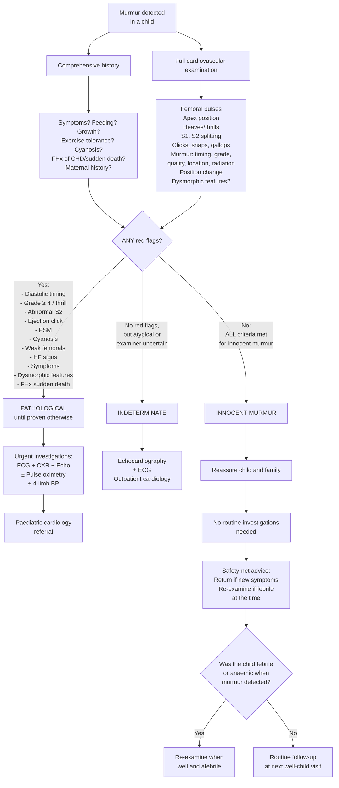
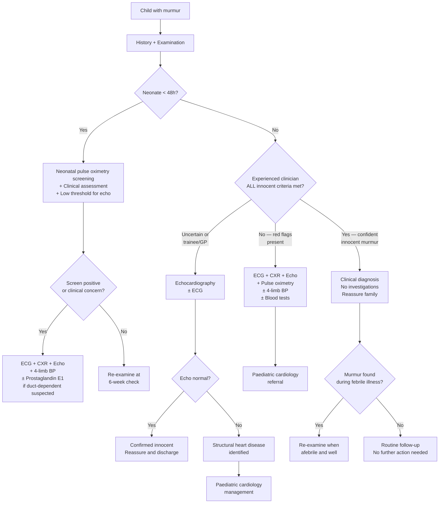

## Diagnostic Criteria and Approach to Innocent Murmur in Children

### Diagnostic Criteria for Innocent Murmur

There is no single, universally codified "diagnostic criteria" set for innocent murmurs in the way that, say, the Jones criteria exist for rheumatic fever. Instead, the diagnosis rests on a **constellation of clinical features** that must ALL be present simultaneously. If any single criterion is violated, the murmur cannot be called innocent and requires further investigation [1][5].

#### The Clinical Criteria — ALL Must Be Met

Think of this as a **checklist where every box must be ticked**. One "No" and you investigate.

| Criterion | Required Finding | Pathophysiological Rationale |
|-----------|-----------------|------------------------------|
| **1. Asymptomatic child** | No dyspnoea, no exercise intolerance, no syncope, no chest pain, no poor feeding (infants), no diaphoresis during feeds | Symptoms imply haemodynamic compromise — a structurally normal heart generating an innocent murmur has normal cardiac output and does not cause symptoms |
| **2. Normal growth and development** | Weight, height, and head circumference on appropriate centiles; developmental milestones met | Haemodynamically significant CHD → ↑metabolic demand + ↓nutrient delivery → failure to thrive. Normal growth = normal haemodynamics |
| **3. Normal cardiovascular examination (apart from the murmur)** | Normal femoral pulses, no cyanosis, no clubbing, normal apex position, no parasternal heave, **no thrill**, normal S1, ***normal physiological splitting of S2***, no ejection clicks, no opening snaps, no S3/S4 gallop | Each of these abnormal findings points to a specific structural lesion (see DDx section). Their absence collectively supports normal cardiac structure |
| **4. Murmur characteristics** | ***Soft (Grade ≤ 3/6)***, ***systolic*** (ejection) or ***continuous only if venous hum***, short duration, ***musical/vibratory (Still's) or soft blowing (flow)***, localised (limited radiation) | High-grade murmurs with thrills require significant turbulence from structural pathology. Diastolic murmurs always indicate valve disease. Harsh quality suggests fixed obstruction |
| **5. Positional variability** | Murmur ***changes with position*** (most ↓ with sitting/standing; venous hum ↓ supine) | Innocent murmurs are flow-dependent — they respond to changes in venous return and cardiac output. Structural lesions (fixed obstruction, septal defects) produce murmurs that are relatively position-independent |
| **6. No associated syndromic features** | No dysmorphic features suggestive of Down syndrome, Turner, Williams, Noonan, Marfan, DiGeorge etc. | These syndromes carry high rates of associated CHD — any murmur in their context warrants echocardiography regardless of auscultatory features |

> **The mnemonic from the lecture notes: Features of inno*S*ent murmur → a*S*ymptomatic, *S*oft blowing, *S*ystolic, Lt *S*ternal edge** [5]

<Callout title="The Diagnosis Is Clinical — But Know When To Investigate">
In experienced hands (paediatric cardiologist), clinical assessment alone has a **sensitivity of ~96% and specificity of ~95%** for distinguishing innocent from pathological murmurs. However, for general paediatricians and trainees, the threshold for echocardiography should be LOW. When in doubt, get an echo — it is non-invasive, radiation-free, and definitive. The cost of missing a CHD far outweighs the cost of an "unnecessary" echocardiogram [1][5].
</Callout>

<Callout title="Must-Know Absolute Exclusion Criteria" type="error">
The following features **absolutely exclude** an innocent murmur — if ANY is present, the murmur is pathological until proven otherwise:

1. ***Diastolic murmur*** — NEVER innocent
2. ***Grade ≥ 4/6 (with thrill)*** — NEVER innocent
3. ***Abnormal S2*** (fixed splitting, absent splitting, loud P2, single S2)
4. ***Ejection click or opening snap***
5. ***Pansystolic murmur*** (uniform S1-to-S2, no crescendo-decrescendo)
6. ***Cyanosis***
7. ***Absent or weak femoral pulses***
8. ***Signs of heart failure*** (tachypnoea, hepatomegaly, oedema, gallop rhythm)
</Callout>

---

### Diagnostic Algorithm

The following algorithm represents the systematic approach when a murmur is detected in a child. It integrates clinical assessment, red flag identification, and the decision of whether to investigate or reassure.

#### Key Decision Points Explained

1. **History and examination are done in parallel** — you are gathering information simultaneously. The algorithm is presented sequentially for clarity, but in practice these happen together during the clinical encounter.

2. **Red flag identification is binary** — even ONE red flag means the murmur is not innocent. This is deliberately conservative because the consequences of missing a CHD (especially duct-dependent lesions in neonates or HOCM in adolescents) can be fatal.

3. **The "indeterminate" category is important** — this is for the trainee who isn't sure. An experienced paediatric cardiologist may confidently call a murmur innocent without imaging, but a junior doctor or GP should have a low threshold for requesting echocardiography. This is not a failure — it is appropriate caution [1][5].

4. ***"Innocent murmurs are often heard during febrile illness or anaemia due to ↑CO, hence examine after correcting these illnesses"*** [5] — if the murmur was first detected during a febrile episode, re-examine when the child is well. The murmur may disappear entirely, confirming its innocent nature. If it persists in identical form at a well-child visit, it is still likely innocent but deserves a fresh assessment.

---

### Investigation Modalities

#### When to Investigate

| Scenario | Investigation Needed? | Rationale |
|----------|----------------------|-----------|
| **Confident clinical diagnosis of innocent murmur by experienced clinician** | ***No routine investigation needed*** | Clinical assessment is highly accurate. Investigations may cause unnecessary anxiety and cost |
| **Clinical uncertainty (trainee, GP, equivocal features)** | Yes — echocardiography | Low threshold to investigate. Echo is non-invasive, no radiation, definitive |
| **Any red flag present** | Yes — ECG + CXR + echocardiography ± pulse oximetry ± 4-limb BP | Must exclude structural/functional heart disease |
| **Neonate with murmur** | Yes — ***always investigate neonatal murmurs*** (even if seemingly innocent) | Transitional circulation can mask serious lesions. PPS murmur is innocent but cannot be reliably distinguished from pathological murmurs clinically in the first days of life [1][5] |
| **Parental anxiety despite reassurance** | Consider echocardiography | Family-centred care — a normal echo provides definitive reassurance. Repeated clinical visits for reassurance may be more burdensome than a single echo |

---

#### 1. Echocardiography (Transthoracic — TTE)

**The gold standard investigation for evaluating a paediatric heart murmur.**

- **Why it's the test of choice**: Non-invasive, no radiation, no sedation needed in most children, provides real-time anatomical and functional information, readily available, and repeatable
- **What it shows**:

| Echo Finding | Interpretation in Context of Murmur Assessment |
|-------------|-----------------------------------------------|
| **Normal cardiac anatomy** | Confirms structurally normal heart → supports innocent murmur diagnosis. This is the definitive "rule out" |
| **Normal valve morphology and function** | No stenosis, no regurgitation, no prolapse → no valvular pathology causing the murmur |
| **Normal chamber dimensions** | No dilatation of LA, LV, RA, or RV → no volume overload from shunts or regurgitation |
| **Normal ventricular function** | Ejection fraction, fractional shortening within normal limits → no myocardial disease |
| **No septal defects** | Intact IVS and IAS with no flow across on colour Doppler → excludes VSD and ASD |
| **Normal great artery anatomy** | Normal aortic arch (no coarctation), normal PA branching (no PPS), no PDA |
| **Normal pulmonary artery pressure** | Estimated from TR jet velocity (if present) or septal motion → excludes pulmonary HTN |

- **False tendon / aberrant chordae**: Echocardiography may identify a **left ventricular false tendon** (a fibrous or fibromuscular band stretching across the LV cavity). These are present in ~20% of the population and are thought to be the source of the vibratory quality of Still's murmur. Finding a false tendon on echo in a child with a vibratory systolic murmur and an otherwise normal heart is reassuring — it confirms the innocent nature of the murmur and provides a structural explanation

<Callout title="Echo Findings That Confirm Innocence" type="idea">
A normal echocardiogram in a child with a murmur means:
- Normal anatomy, normal valves, normal chambers, normal function, no shunts
- ± A left ventricular false tendon (explains Still's murmur)

This gives definitive diagnosis. You can now tell the family with certainty: "The heart is completely normal. The murmur is from normal blood flow and requires no treatment or follow-up."
</Callout>

---

#### 2. Electrocardiogram (ECG)

**Not the primary diagnostic tool for innocent murmurs, but important for excluding pathological causes when murmur characteristics are atypical.**

- **In an innocent murmur**: The ECG is **normal** for age. A normal paediatric ECG varies by age — you must know age-appropriate norms:

| Age | Key Normal ECG Features |
|-----|------------------------|
| **Neonate (0–7 days)** | Right axis deviation (90–180°), dominant R in V1 (RV dominance from fetal circulation), T wave upright in V1 (first 3 days, then inverts) |
| **Infant (1–12 months)** | Gradually shifting axis toward normal (0–110°), R wave in V1 diminishes, T wave inverted in V1–V3 (normal up to adolescence) |
| **Child (1–12 years)** | Normal axis (0–110°), progressive increase in LV voltages, T wave inverted V1–V3 (V1–V2 in older children) |
| **Adolescent** | Approaches adult pattern, axis 0–90° |

- **Pathological ECG findings that suggest the murmur is NOT innocent**:

| ECG Finding | Suggests | Why |
|-------------|----------|-----|
| **RV hypertrophy** (tall R in V1, right axis deviation beyond age-normal) | PS, ASD, pulmonary HTN, TOF | ↑RV afterload (PS, pHTN) or ↑RV volume (ASD) → RV myocyte hypertrophy → ↑electrical forces toward V1 |
| **LV hypertrophy** (tall R in V5–V6, deep S in V1, ± strain pattern) | AS, CoA, VSD (volume overload), HOCM | ↑LV afterload (AS, CoA) or ↑LV volume (VSD) → LV myocyte hypertrophy → ↑electrical forces toward V5–V6 |
| ***Biventricular hypertrophy*** | Large VSD, AVSD | Both ventricles overloaded |
| **RAE / LAE** (P wave abnormalities) | ASD (RAE), MS (LAE), VSD (LAE) | Atrial pressure/volume overload → atrial dilatation → prolonged or peaked P waves |
| **First-degree AV block** (prolonged PR) | Rheumatic carditis, ASD (primum), myocarditis | Conduction system inflammation or stretching |
| ***rsR' pattern in V1*** | ***ASD*** | RBBB pattern from RV volume overload → delayed RV depolarisation |
| **Pre-excitation** (short PR, delta wave) | WPW syndrome ± associated CHD (Ebstein's anomaly) | Accessory pathway bypasses AV node → early ventricular activation → delta wave. Ebstein's associated with multiple accessory pathways |
| **ST/T changes** | Myocarditis, coronary anomaly, HOCM | Myocardial ischaemia or fibrosis → repolarisation abnormalities |

<Callout title="Paediatric ECG Interpretation: Age Matters" type="error">
The biggest mistake trainees make with paediatric ECGs is applying adult criteria. A neonate normally has right axis deviation and dominant R wave in V1 (because the RV was the dominant ventricle in utero). Calling this "RVH" would be incorrect. Always interpret the ECG against **age-specific normals**.
</Callout>

---

#### 3. Chest Radiograph (CXR)

**Useful but not definitive. Complements echocardiography rather than replacing it.**

- **In an innocent murmur**: CXR is ***normal*** — normal heart size, normal pulmonary vascularity, normal mediastinal contour
- **How to assess a paediatric CXR for cardiac pathology**:

| CXR Feature | How to Assess | Abnormal Finding and What It Suggests |
|-------------|--------------|--------------------------------------|
| **Heart size** | ***Cardiothoracic ratio (CTR)***: < 0.6 in neonates/infants, < 0.55 in children > 1 year, < 0.5 in older children/adolescents (the neonatal heart appears larger due to the thymus and supine positioning) | ↑CTR → cardiomegaly → volume overload (VSD, PDA, MR), myocardial disease (DCMP, myocarditis). Normal CTR supports innocent murmur |
| **Pulmonary vascularity** | Compare the calibre of pulmonary arteries to the accompanying bronchus at the hilum | ***Plethora*** (↑vascularity, vessels extend to periphery) → L-to-R shunt (VSD, ASD, PDA) → ↑pulmonary blood flow. ***Oligaemia*** (↓vascularity, clear lung fields) → R-to-L shunt with ↓pulmonary blood flow (TOF, pulmonary atresia). Normal vascularity supports innocent murmur |
| **Cardiac silhouette shape** | Examine contour of cardiac shadow | "Boot-shaped" → TOF (RVH + small PA). "Egg on string" → TGA (narrow mediastinum from AP relationship of great arteries). "Snowman" / "figure of 8" → supracardiac TAPVR. Normal silhouette supports innocent murmur |
| **Aortic arch** | Check aortic knob and descending aorta | "Figure 3" sign → CoA. Rib notching (inferior surface of ribs 3–8) → CoA in older children (from dilated intercostal collateral arteries eroding ribs). Right-sided aortic arch → consider TOF, truncus, vascular ring |
| **Lung fields** | Assess for pulmonary oedema, consolidation | Pulmonary oedema → heart failure. Normal lung fields support innocent murmur |
| **Thymus** | Prominent in infants — can mimic cardiomegaly | "Sail sign" is the normal thymus in infants — do not mistake for cardiomegaly |

---

#### 4. Pulse Oximetry

**A screening tool, not a diagnostic tool per se, but critically important in neonates.**

- **Neonatal pulse oximetry screening for critical CHD**: Performed at 24–48 hours of life on all apparently well neonates
  - **Method**: Pre-ductal (right hand) and post-ductal (either foot) SpO₂
  - **Positive screen** (requires further evaluation including echo):
    - Any SpO₂ reading < 90% → immediate echo
    - SpO₂ 90–94% in BOTH limbs on 3 readings 1 hour apart → echo
    - > 3% difference between pre- and post-ductal SpO₂ on 3 readings 1 hour apart → echo
  - **Rationale**: Critical cyanotic CHD (TGA, TOF, pulmonary atresia, TAPVR, HLHS, CoA) may not produce visible cyanosis at SpO₂ 85–94% but will be detected by oximetry. Detects lesions before clinical deterioration
  - **In innocent murmurs**: SpO₂ is ***normal (≥ 95%) with < 3% pre-post-ductal difference***

---

#### 5. Four-Limb Blood Pressure

**Essential when coarctation is suspected (weak femoral pulses, upper limb hypertension, radio-femoral delay).**

- **Method**: BP measured in right arm (pre-ductal) and either leg (post-ductal) using age-appropriate cuffs
- **Normal**: Leg BP is equal to or slightly higher than arm BP (the larger leg arteries often give higher systolic readings)
- **Abnormal**: ***> 20 mmHg systolic gradient (arm > leg)*** → strongly suggests coarctation of the aorta
- **Why right arm specifically?**: The right subclavian artery arises from the brachiocephalic trunk PROXIMAL to most coarctation sites (which are typically at the aortic isthmus, distal to the left subclavian artery). The left arm may also show reduced pressure if the coarctation is proximal to or at the origin of the left subclavian artery. Using the right arm ensures you are measuring pre-coarctation pressure

---

#### 6. Other Investigations (Not Routine for Innocent Murmurs)

These are mentioned for completeness — they are NOT part of the workup for a suspected innocent murmur but may be relevant if pathology is found:

| Investigation | When Used | What It Shows |
|--------------|-----------|---------------|
| **Cardiac MRI** | Complex CHD anatomy, aortic arch evaluation, post-surgical follow-up | Detailed 3D anatomy, flow quantification, tissue characterisation. Gold standard for aortic arch lesions. Requires sedation/GA in young children |
| **Cardiac catheterisation** | Haemodynamic assessment, interventional procedures | Direct pressure measurements, angiography. Invasive — reserved for when intervention planned or non-invasive data insufficient |
| **Holter monitor (24h ECG)** | Arrhythmia assessment if palpitations or syncope | Captures intermittent rhythm disturbances not seen on resting ECG |
| **Exercise stress test** | Older children/adolescents with exertional symptoms | Provoke symptoms, assess functional capacity, unmask arrhythmia or ischaemia during exertion |
| **Genetic testing** | Syndromic features, HOCM family screening, long QT | Identify specific genetic mutations associated with CHD or inherited cardiac conditions |
| **Blood tests** | Anaemia evaluation, inflammatory markers if rheumatic fever suspected, BNP if HF suspected | FBC (anaemia as cause of flow murmur), CRP/ESR/ASOT (rheumatic fever), NT-proBNP (elevated in haemodynamically significant CHD/HF — normal in innocent murmurs) |

<Callout title="NT-proBNP as an Adjunct" type="idea">
**NT-proBNP** (N-terminal pro–B-type natriuretic peptide) is released when ventricular myocytes are stretched. In children with haemodynamically significant CHD (large VSD, large PDA, AVSD), NT-proBNP is elevated because of volume overload. In innocent murmurs, NT-proBNP is normal. While not routinely used as a screening test for murmurs, it can be a useful adjunct in resource-limited settings where echocardiography is not immediately available, or to prioritise referrals.

**Normal values are age-dependent** — neonates have physiologically high levels (up to ~11,000 pg/mL in the first 48 hours) that decline rapidly over weeks.
</Callout>

---

### Putting It All Together: The Diagnostic Pathway in Practice

---

### Communicating the Diagnosis to Families

This is a **critical aspect of paediatric practice** that is often undertested but clinically essential. When you tell a parent their child has a murmur, they often hear "heart problem." You must address this proactively:

**Key communication points:**

1. **Name it clearly**: "This is an innocent murmur — also called a normal murmur. It means the heart is perfectly healthy"
2. **Explain why it happens**: "We can hear the blood flowing through your child's normal, healthy heart. In children, the heart is close to the chest wall, so we hear these normal sounds more easily"
3. **Reassure about prognosis**: "It does not need any treatment, it will not affect your child's health, activity, or development. It usually becomes quieter and disappears as your child grows"
4. **Address common concerns**:
   - "No, your child does NOT need to restrict physical activity"
   - "No, your child does NOT need antibiotics before dental procedures" (this is a common parental misconception — endocarditis prophylaxis is NOT indicated for innocent murmurs)
   - "No, this will not become a heart problem later"
5. **Safety-net**: "If your child ever develops symptoms like being unusually breathless, turning blue, being very tired, or not growing well, please come back for a check"

<Callout title="Endocarditis Prophylaxis" type="error">
***Innocent murmurs do NOT require infective endocarditis prophylaxis.*** There is no structural abnormality for bacteria to adhere to. Only children with specific structural heart disease (unrepaired cyanotic CHD, prosthetic valves, previous IE, repaired CHD with residual defects, cardiac transplant recipients with valvulopathy) require prophylaxis. Do not prescribe antibiotics before dental procedures for innocent murmurs — this is a common error.
</Callout>

---

### Summary of Key Investigation Findings: Innocent vs Pathological

| Investigation | Innocent Murmur | Pathological Murmur |
|--------------|----------------|-------------------|
| **Echocardiography** | ***Normal anatomy, normal function, no shunts, ± LV false tendon*** | Structural defect identified (VSD, ASD, valve disease, etc.) |
| **ECG** | ***Normal for age*** | RVH, LVH, axis deviation, conduction abnormalities, pre-excitation |
| **CXR** | ***Normal heart size, normal vascularity, normal silhouette*** | Cardiomegaly, pulmonary plethora/oligaemia, abnormal silhouette |
| **Pulse oximetry** | ***SpO₂ ≥ 95%, < 3% pre-post-ductal difference*** | SpO₂ < 95% or > 3% difference |
| **4-limb BP** | ***No gradient*** | > 20 mmHg arm-leg gradient (CoA) |
| **NT-proBNP** | ***Normal for age*** | Elevated (volume/pressure overload) |

---

<Callout title="High Yield Summary — Diagnosis of Innocent Murmur">

1. **Diagnosis is CLINICAL** — based on meeting ALL criteria: asymptomatic, normal growth, normal CVS exam, soft (≤ Grade 3) systolic murmur, positional variability, no extra sounds, normal S2, no thrill, no dysmorphic features
2. ***"aSymptomatic, Soft blowing, Systolic, Lt Sternal edge"*** — lecture mnemonic [5]
3. **Echocardiography is the gold standard** investigation when clinical doubt exists — normal echo = definitive confirmation
4. **No investigation is needed** if diagnosis is confident by an experienced clinician
5. **ALL neonatal murmurs** warrant careful assessment ± echo — never dismiss a neonatal murmur as innocent without thorough evaluation
6. ***Re-examine after correcting fever/anaemia*** — innocent murmurs are amplified by high-output states [5]
7. **Normal ECG for age, normal CXR, normal SpO₂** all support innocence
8. **NT-proBNP** is a useful adjunct — normal in innocent murmurs, elevated in haemodynamically significant CHD
9. **No endocarditis prophylaxis** is required for innocent murmurs
10. **Communication with family** is essential — name it "innocent/normal," explain the mechanism, reassure about activity and prognosis, provide safety-net advice

</Callout>

---

<ActiveRecallQuiz
  title="Active Recall - Diagnosis of Innocent Murmur"
  items={[
    {
      question: "List the 6 clinical criteria that must ALL be met to diagnose an innocent murmur without investigation.",
      markscheme: "1. Asymptomatic child. 2. Normal growth and development. 3. Normal cardiovascular examination apart from the murmur (normal pulses, no cyanosis, no heave, no thrill, normal apex). 4. Murmur is soft (Grade 3 or less), systolic (or continuous only if venous hum), short, musical or blowing. 5. Normal S1 and S2 with physiological splitting, no clicks/snaps/gallops. 6. Murmur changes with position. Also acceptable: no dysmorphic features, no concerning family history.",
    },
    {
      question: "What are the criteria for a positive neonatal pulse oximetry screen for critical CHD, and what is the next step?",
      markscheme: "Positive screen: any SpO2 reading below 90% (immediate), OR SpO2 90-94% in both right hand and foot on 3 readings 1 hour apart, OR greater than 3% difference between pre-ductal (right hand) and post-ductal (foot) SpO2 on 3 readings 1 hour apart. Next step: urgent echocardiography plus ECG, CXR, and clinical assessment.",
    },
    {
      question: "On a paediatric CXR, how do you differentiate the pulmonary vascularity pattern of a left-to-right shunt from a right-to-left shunt?",
      markscheme: "Left-to-right shunt (e.g. VSD, ASD, PDA): pulmonary plethora — increased pulmonary vascularity with vessels extending to the lung periphery, reflecting increased pulmonary blood flow. Right-to-left shunt (e.g. TOF, pulmonary atresia): pulmonary oligaemia — decreased pulmonary vascularity with clear/dark lung fields, reflecting decreased pulmonary blood flow.",
    },
    {
      question: "A trainee finds a Grade 2 ejection systolic murmur at the LLSB in a well 4-year-old during a routine check. The child is asymptomatic with normal growth. All examination findings are normal. The trainee is unsure if this is innocent. What should they do?",
      markscheme: "Request an echocardiogram. While the features are consistent with an innocent murmur (Still's murmur — soft, systolic, LLSB, asymptomatic child with normal exam), a trainee who is uncertain should have a low threshold for echocardiography. Echo is non-invasive, radiation-free, and definitive. A normal echo confirms the innocent diagnosis and allows confident reassurance of the family. This is preferable to either falsely reassuring or inappropriately alarming the family.",
    },
    {
      question: "Why is the neonatal ECG normally right-axis deviated with dominant R waves in V1, and how does this affect interpretation of a murmur workup in a neonate?",
      markscheme: "In utero, the RV is the dominant ventricle (pumps against high PVR to supply the systemic circulation via the ductus arteriosus). At birth, the RV remains relatively hypertrophied until PVR falls over weeks to months. This produces right axis deviation and tall R waves in V1 on neonatal ECG, which is NORMAL. Applying adult criteria would falsely diagnose RVH. When evaluating a neonatal murmur, the ECG must be interpreted against age-specific norms — true pathological RVH in a neonate would show extreme right axis deviation or R waves in V1 exceeding age-appropriate values.",
    },
    {
      question: "Does a child with a confirmed innocent murmur need infective endocarditis prophylaxis before dental procedures? Explain why or why not.",
      markscheme: "No. Infective endocarditis prophylaxis is NOT required for innocent murmurs. The heart is structurally normal — there is no abnormal endocardial surface, no turbulent jet lesion, and no prosthetic material for bacteria to adhere to. IE prophylaxis is only indicated for specific high-risk structural conditions: unrepaired cyanotic CHD, prosthetic heart valves, previous IE, repaired CHD with residual defects adjacent to prosthetic material, and cardiac transplant recipients with valvulopathy.",
    },
  ]}
/>

---

## References

[1] Lecture slides: GC 147. Heart failure and cyanosis in children acyanotic and cyanotic congenital heart disease - Part 1.pdf
[2] Lecture slides: GC 147. Heart failure and cyanosis in children acyanotic and cyanotic congenital heart disease - Part 2.pdf
[3] Senior notes: Ryan Ho Cardiology.pdf
[5] Senior notes: Adrian Lui Pediatrics.pdf
