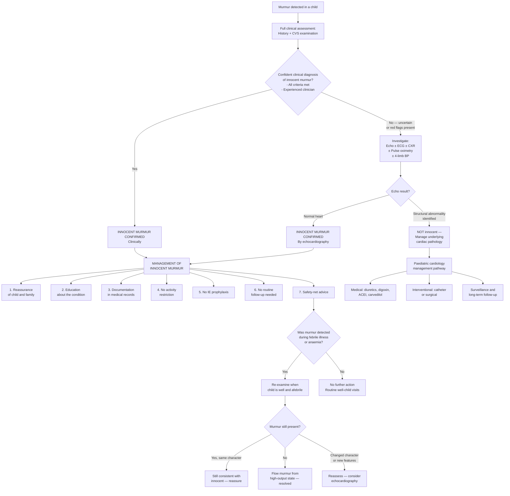

## Management of Innocent Murmur in Children

### The Core Principle: An Innocent Murmur Requires No Treatment

This must be stated upfront and emphatically: ***an innocent murmur is a normal finding in a normal heart and requires NO medical, surgical, or interventional treatment*** [1][5]. There is no medication to prescribe, no procedure to perform, no activity to restrict, and no follow-up cardiological surveillance needed. The "management" of an innocent murmur is really the management of the **clinical encounter** — making the correct diagnosis, communicating it effectively, and avoiding the harms of overdiagnosis and overtreatment.

This may sound straightforward, but in practice it is one of the most important management challenges in paediatric cardiology. Mismanaging an innocent murmur — either by missing pathology on one hand, or by creating unnecessary anxiety and investigations on the other — has real consequences for children and families.

---

### Management Algorithm

---

### Management Components in Detail

#### 1. Reassurance of the Child and Family

This is **the single most important management intervention** for an innocent murmur. It may seem trivial compared to prescribing medications, but effective reassurance prevents:
- Unnecessary parental anxiety and hypervigilance
- Inappropriate activity restriction of the child
- Repeated emergency department visits for "the heart murmur"
- Labelling the child as "cardiac" — which can follow them through school, sports participation, and even insurance applications

**How to reassure effectively:**

| Communication Step | What to Say | Why It Matters |
|-------------------|-------------|----------------|
| **Name it clearly** | "This is called an innocent murmur — also called a normal murmur or a functional murmur" | Using the word "innocent" or "normal" immediately frames the finding as benign. Avoid saying "we found something on the heart" without context — this terrifies parents |
| **Explain the mechanism** | "We can hear the sound of blood flowing normally through your child's healthy heart. Children's hearts are close to the chest wall, so we hear these normal sounds more easily than in adults" | Parents need to understand WHY there is a sound — otherwise they assume sound = problem. Explaining the physics (thin chest wall, vigorous circulation) makes the concept intuitive |
| **State the prognosis explicitly** | "This is not a heart problem. It will not affect your child's health, growth, development, or ability to do anything. Most innocent murmurs become quieter and disappear as children grow" | Parents need to hear categorical reassurance — not hedging. Be definitive |
| **Address activity** | "Your child can do everything — run, swim, play sports, participate in PE. There is absolutely no need for any restriction" | Many parents instinctively restrict a child once "heart murmur" is mentioned. Pre-empt this |
| **Address procedures** | "Your child does NOT need antibiotics before dental work or other procedures for this murmur" | Endocarditis prophylaxis is a common misconception — address it proactively |
| **Provide written information** | Give a leaflet or direct to a reliable resource | Verbal information is often forgotten or distorted. Written material reinforces the message |

<Callout title="The Power of the Word 'Innocent'" type="idea">
Research shows that the specific terminology used significantly affects parental anxiety. Saying "Your child has a heart murmur" without qualification causes significantly more anxiety than saying "Your child has an innocent heart murmur" or "Your child has a normal heart murmur." **Always use the qualifier.** Some clinicians prefer "normal murmur" over "innocent murmur" because "innocent" implies there could be a "guilty" counterpart, which may subtly worry parents. Either term is acceptable, but be deliberate in your word choice.
</Callout>

**Talking to the child (age-appropriate communication):**
- **Toddlers/preschoolers**: "The doctor listened to your heart and it sounds great! Your heart is strong and healthy" (direct reassurance aimed at the parents, but in the child's presence)
- **School-age children**: "You know how when you put your ear to a seashell you can hear the ocean? Your heart makes a similar sound because blood is flowing really well inside it. It's completely normal"
- **Adolescents**: More detailed explanation appropriate — "The murmur is just the sound of blood flowing through your normal heart valves. It doesn't mean anything is wrong, and it won't affect your ability to do sports or anything else"

---

#### 2. Documentation in Medical Records

Proper documentation is essential for three reasons:
1. **Prevents re-investigation**: If another clinician hears the murmur at a future visit, clear documentation prevents unnecessary repeat echocardiography
2. **Medicolegal protection**: Documents that a thorough assessment was performed
3. **Continuity of care**: Particularly important in paediatrics where children see multiple doctors across primary care, hospital, and school health services

**What to document:**

> "Cardiac murmur identified on auscultation. Grade [X]/6 [ejection/vibratory] systolic murmur best heard at [location]. No radiation. Changes with [position]. Normal S1 and S2 with physiological splitting. No thrill, no heave, no displaced apex. Femoral pulses normal and equal bilaterally. Child is asymptomatic with normal growth and development. No dysmorphic features. Clinical assessment consistent with an **innocent murmur**. [If echo performed: Echocardiography confirms structurally and functionally normal heart.] Family reassured. No treatment, investigation, activity restriction, or endocarditis prophylaxis required. Safety-net advice given."

---

#### 3. No Activity Restriction

***Children with innocent murmurs should have NO restriction on physical activity, competitive sports, or exercise*** [1][5]. This is a critical point because:

- Physical activity restriction in a healthy child causes harm — reduces fitness, social participation, psychological wellbeing, and creates a false illness identity
- Schools and sports coaches sometimes restrict participation when they see "heart murmur" on a medical form — the clinician must actively communicate that no restriction is needed
- If a medical form requires completion (e.g., for school sports), state clearly: "Innocent heart murmur. Structurally normal heart. No activity restriction"

---

#### 4. No Infective Endocarditis (IE) Prophylaxis

***Innocent murmurs do NOT require IE prophylaxis before dental or surgical procedures*** [3][5]. The rationale:

- IE requires bacteria to adhere to damaged or abnormal endocardium (vegetations form on roughened surfaces, prosthetic material, or high-velocity jet lesions)
- In an innocent murmur, the heart is structurally normal — there is no abnormal endocardial surface for bacteria to colonise
- Prescribing unnecessary antibiotics exposes the child to drug side effects, contributes to antimicrobial resistance, and reinforces the misconception that something is wrong with the heart

**Current indications for IE prophylaxis in paediatrics (for contrast):**
- Prosthetic heart valves (mechanical or bioprosthetic)
- Previous episode of IE
- Unrepaired cyanotic CHD (including palliative shunts and conduits)
- Repaired CHD with residual defect at or adjacent to prosthetic material
- Cardiac transplant recipients who develop valvulopathy

---

#### 5. No Routine Follow-Up Required

Once an innocent murmur is confidently diagnosed (clinically or with echocardiography), **no routine cardiology follow-up is needed** [1][5].

- The murmur may persist for years (especially Still's murmur, which can be heard into adolescence) — this does NOT change the diagnosis
- The murmur may fluctuate in intensity — louder during illness, exercise, or anxiety; softer when well and calm. This variability is itself a characteristic feature of innocence
- Parents should be told: "You may notice the murmur is louder when your child has a fever or is active. This is normal and expected. It does not mean the condition has worsened"

**Exceptions where re-assessment is warranted:**
- New symptoms develop (exercise intolerance, syncope, cyanosis, chest pain, palpitations)
- Change in murmur character on examination by a clinician (new diastolic component, new thrill, loss of positional variability)
- Development of new clinical findings (failure to thrive, signs of heart failure)

---

#### 6. Safety-Net Advice

Every clinical encounter should include safety-netting — clear instructions about when to return:

> "Bring your child back if they develop any of the following:
> - Becoming unusually breathless or tired during activities that were previously easy
> - Turning blue around the lips
> - Fainting or feeling faint during exercise
> - Chest pain during exertion
> - Heart racing or skipping beats
> - Not growing or gaining weight as expected"

---

#### 7. Re-Examination After High-Output States

***Innocent murmurs are often heard during febrile illness or anaemia due to ↑CO, hence examine after correcting these illnesses*** [5].

**Management approach:**
- If the murmur was first detected during a febrile illness → treat the underlying infection → re-examine the child when afebrile and well (typically at a follow-up visit 2–4 weeks later)
- If the child was anaemic → investigate and treat the anaemia → re-examine once haemoglobin is normalised
- **Possible outcomes on re-examination:**
  - Murmur has **disappeared** → it was a flow murmur amplified by the high-output state → reassure
  - Murmur is **still present with same innocent characteristics** → it is an innocent murmur that was made louder by the illness → reassure
  - Murmur has **changed character** (new quality, new location, new extra sounds) → investigate with echocardiography

---

### What NOT To Do — Harms of Overdiagnosis

Managing an innocent murmur well also means avoiding **iatrogenic harm from overinvestigation and overlabelling**:

| Harm | Mechanism | How to Avoid |
|------|-----------|-------------|
| **Cardiac labelling** | Child is treated as "having a heart condition" by family, school, and future clinicians → activity restriction, anxiety, insurance implications | Use unambiguous terminology: "innocent murmur" or "normal murmur." Document clearly that the heart is normal |
| **Parental cardiac anxiety** | Parents remain worried despite reassurance → repeated ED visits, requests for further investigations, hypervigilant monitoring of child | Provide thorough explanation, written information, and a single definitive echocardiogram if anxiety persists despite clinical reassurance |
| **Unnecessary serial echocardiography** | Repeating echocardiograms at intervals "to make sure" in a child with a confirmed innocent murmur | A single normal echo is definitive. There is no indication for serial imaging. Document the echo result prominently in the medical record |
| **Inappropriate referrals** | Referring every child with any murmur to cardiology overwhelms the system and delays care for truly sick children | Develop clinical skills to confidently identify innocent murmurs. Use structured approaches (the criteria outlined above) |
| **Unnecessary medication** | Prescribing IE prophylaxis or other cardiac medications | Reinforce: no treatment is needed for an innocent murmur |

---

### Management When the Murmur Is NOT Innocent

For completeness — and because the management of innocent murmurs includes correctly identifying those that are NOT innocent and directing them to appropriate care — the following outlines the general principles of managing pathological murmurs in children. ***This is the management of paediatric heart failure and structural CHD, NOT of innocent murmurs themselves*** [1].

***Management of Paediatric Heart Failure*** (as outlined in the lecture slides [1]):

> ***1. Identification of the cause and precipitating factors***
> ***2. Tackling of precipitating factors***
> ***3. General supportive management***
> ***4. Medical therapy of heart failure (diuretics, digoxin, ACEI, carvedilol)***
> ***5. Treatment of underlying cause, if possible, by surgical or catheter intervention***
> ***6. Mechanical circulatory support and heart transplantation***

| Treatment | Indication | Mechanism | Paediatric Notes |
|-----------|-----------|-----------|-----------------|
| ***Diuretics*** (furosemide, spironolactone) | Volume overload in L-to-R shunts (VSD, PDA, AVSD) causing HF | Furosemide: loop diuretic → inhibits Na/K/2Cl cotransporter in loop of Henle → ↑water and salt excretion → ↓preload. Spironolactone: aldosterone antagonist → ↓K loss + additional diuresis | Furosemide: 1–2 mg/kg/dose PO 1–3× daily (paediatric dosing). Monitor electrolytes (risk of hypokalaemia with furosemide, hyperkalaemia with spironolactone). Spironolactone also has anti-fibrotic properties |
| ***Digoxin*** | HF from volume overload, rate control in SVT | Inhibits Na/K-ATPase → ↑intracellular Ca → ↑contractility (positive inotrope). Also ↑vagal tone → ↓HR | Narrow therapeutic index — paediatric dosing is weight-based and age-dependent. Therapeutic drug monitoring essential. Toxicity risk ↑ with hypokalaemia, renal impairment |
| ***ACE inhibitors*** (captopril, enalapril) | Afterload reduction in HF, MR, dilated cardiomyopathy | Inhibits ACE → ↓angiotensin II → ↓afterload + ↓aldosterone → ↓preload. Also ↓ventricular remodelling | Captopril: 0.1–0.5 mg/kg/dose TDS (neonates start lower). Monitor BP (first-dose hypotension), renal function, K. Contraindicated in bilateral renal artery stenosis |
| ***Carvedilol*** (beta-blocker) | Chronic HF management (added to diuretics + ACEI) | Non-selective beta-blocker + alpha-1 blocker → ↓HR, ↓afterload, ↓sympathetic overdrive, ↓ventricular remodelling | Start at low dose and titrate slowly. NOT used in acute decompensated HF (may worsen). Evidence for paediatric HF less robust than adult data but increasingly used |
| **Surgical / catheter intervention** | Definitive treatment of structural defect | Closes the VSD, ligates the PDA, repairs the AVSD, relieves the stenosis — eliminates the haemodynamic cause of HF | Timing depends on severity — urgent in duct-dependent lesions (after prostaglandin stabilisation), semi-elective for large VSD causing FTT despite medical therapy |
| **Prostaglandin E1** (alprostadil) | ***Duct-dependent lesions*** in neonates (critical CoA, critical AS, HLHS, pulmonary atresia, TGA) | Maintains patency of ductus arteriosus → allows continued systemic or pulmonary perfusion until definitive intervention | IV infusion 5–20 ng/kg/min. Side effects: apnoea (have intubation equipment ready), fever, hypotension. Used ONLY for duct-dependent lesions — NOT for innocent murmurs |

<Callout title="None of These Treatments Apply to Innocent Murmurs" type="error">
The above table is included to illustrate what happens when a murmur IS pathological and leads to haemodynamic compromise. ***None of these medications or interventions are indicated for innocent murmurs.*** The management of an innocent murmur is: reassurance, education, documentation, no treatment, no restriction, no prophylaxis, no follow-up beyond safety-netting.
</Callout>

---

### Special Scenarios in Management

#### A. The Neonate With a Murmur

- ***All neonatal murmurs warrant careful assessment*** [1][5]
- Even if the murmur sounds "innocent" (e.g., consistent with peripheral pulmonary stenosis), the neonate requires:
  - Pulse oximetry screening (pre- and post-ductal)
  - Careful assessment of femoral pulses
  - Clinical assessment for signs of HF or cyanosis
  - Low threshold for echocardiography
- **Why neonatal murmurs are different**: The transitional circulation (closing PDA, falling PVR) means that serious lesions can initially be haemodynamically compensated and clinically silent. A murmur on day 1 may be the PDA closing, or it may be the first sign of a critical CHD that will declare itself dramatically when the duct fully closes
- ***Neonatal HF implies duct-dependent systemic circulation → HF with closure of duct; may present with acute shock with weak LL pulses, oliguria and severe metabolic acidosis in 1st week of life*** [5]

#### B. The Child Whose Murmur Was Found Incidentally During a Febrile Illness

- **Immediate management**: Focus on the acute illness (e.g., treat the pneumonia, the UTI, the viral infection)
- **Murmur assessment**: Note the murmur, document its characteristics, but ***defer the definitive assessment of the murmur until the child is well*** [5]
- **Follow-up**: Re-examine at a well-child visit 2–4 weeks later when afebrile and euvolaemic
- **Rationale**: Fever → ↑cardiac output → ↑flow velocity → ↑turbulence → amplified innocent murmur. Assessing the murmur during a high-output state may lead to overestimation of its significance

#### C. The Anxious Family Despite Reassurance

- **Acknowledge the anxiety**: "I understand that hearing 'heart murmur' is worrying. Many parents feel the same way"
- **Offer echocardiography**: A single normal echocardiogram often provides more reassurance than repeated clinical visits. The definitive demonstration of a normal heart on imaging can resolve anxiety that words alone cannot
- **Provide written information**: Leaflet, reputable website, or direct contact with a paediatric cardiac nurse specialist
- **Avoid**: Repeated echocardiograms, cardiology referrals, or serial follow-up appointments — these paradoxically reinforce the perception that something might be wrong

#### D. The Adolescent Athlete

- An innocent murmur in an adolescent who participates in competitive sports requires **no restriction whatsoever**
- Pre-participation cardiac screening varies by jurisdiction:
  - **Hong Kong**: No universal ECG screening for school sports; clinical assessment is standard
  - If an ECG is performed (e.g., for elite athletics) and is normal, combined with normal clinical assessment, this is fully reassuring
  - **HOCM** is the important differential to exclude in this age group — if the murmur gets louder with standing/Valsalva, there is a family history of sudden death, or the ECG shows LVH → echocardiography is mandatory before sports clearance
- **Documentation for sports participation**: "Innocent heart murmur. Structurally normal heart [confirmed by clinical assessment / echocardiography]. Cleared for full unrestricted sporting activity including competitive sports"

---

### Summary: Management Flowchart — What To Do and What NOT To Do

| Action | Indicated? | Rationale |
|--------|-----------|-----------|
| **Reassurance of family** | ***YES*** — this IS the treatment | The "disease" is parental/clinician anxiety, not the murmur itself |
| **Education about the murmur** | ***YES*** | Prevents future unnecessary presentations, activity restriction, and antibiotic use |
| **Clear documentation** | ***YES*** | Prevents re-investigation by future clinicians |
| **Activity restriction** | ***NO*** | Heart is normal — restriction causes physical and psychological harm |
| **IE prophylaxis** | ***NO*** | No abnormal endocardial surface — antibiotics would be inappropriate |
| **Medication** | ***NO*** | No haemodynamic abnormality to treat |
| **Routine cardiology follow-up** | ***NO*** | No progression, no risk of deterioration |
| **Serial echocardiography** | ***NO*** | A single normal echo is definitive — repeating adds no information |
| **Re-examination after fever/anaemia** | ***YES*** | Confirms the murmur was amplified by a high-output state |
| **Safety-net advice** | ***YES*** | Provides a safety mechanism in case the clinical assessment was wrong or new pathology develops |

---

<Callout title="High Yield Summary — Management of Innocent Murmur">

1. ***No treatment is needed*** — the heart is structurally and functionally normal
2. **Management = Reassurance + Education + Documentation**
3. ***No activity restriction*** — full participation in all physical activities including competitive sports
4. ***No IE prophylaxis*** — no abnormal endocardium for bacteria to colonise
5. ***No routine follow-up or serial echocardiography*** — one normal echo is definitive
6. ***Re-examine after correcting fever or anaemia*** if detected during a high-output state [5]
7. **Safety-net advice**: Return if symptoms develop (dyspnoea, cyanosis, syncope, chest pain, FTT, palpitations)
8. **Avoid iatrogenic harm**: Cardiac labelling, parental anxiety from poor communication, unnecessary serial investigations, inappropriate antibiotics
9. **Neonatal murmurs**: ALWAYS assess carefully — cannot be confidently called innocent without thorough evaluation ± echocardiography
10. ***Management of paediatric HF (for contrast, when murmur IS pathological)***: Identify cause → tackle precipitating factors → supportive care → ***medical therapy: diuretics, digoxin, ACEI, carvedilol*** → ***surgical/catheter intervention*** → mechanical circulatory support/transplant [1]
11. **Communication with family** is the most important intervention — use clear, unambiguous language: "innocent murmur" or "normal murmur"

</Callout>

---

<ActiveRecallQuiz
  title="Active Recall - Management of Innocent Murmur"
  items={[
    {
      question: "What is the definitive management of a confirmed innocent murmur in a child? List the key components.",
      markscheme: "Reassurance of child and family (explain mechanism, name it 'innocent' or 'normal'). Education (no heart disease, will likely fade with age). Documentation in medical records. No activity restriction. No IE prophylaxis. No medication. No routine cardiology follow-up. No serial echocardiography. Safety-net advice (return if new symptoms develop). Re-examine after resolution of any concurrent febrile illness or anaemia.",
    },
    {
      question: "A parent asks: 'Does my child need antibiotics before going to the dentist because of this heart murmur?' What is your answer and why?",
      markscheme: "No. Infective endocarditis prophylaxis is not indicated for innocent murmurs because the heart is structurally normal — there is no abnormal endocardial surface, prosthetic material, or turbulent jet lesion for bacteria to adhere to. IE prophylaxis is only for specific high-risk structural conditions such as prosthetic valves, previous IE, unrepaired cyanotic CHD, repaired CHD with residual defects near prosthetic material, and cardiac transplant recipients with valvulopathy.",
    },
    {
      question: "List the 6 steps in the management of paediatric heart failure as outlined in the lecture slides, applicable when a murmur is found to be pathological.",
      markscheme: "1. Identification of the cause and precipitating factors. 2. Tackling of precipitating factors. 3. General supportive management. 4. Medical therapy of heart failure (diuretics, digoxin, ACEI, carvedilol). 5. Treatment of underlying cause by surgical or catheter intervention. 6. Mechanical circulatory support and heart transplantation.",
    },
    {
      question: "Why should a murmur detected during a febrile illness be re-assessed when the child is afebrile? What are the possible outcomes?",
      markscheme: "Fever increases cardiac output and flow velocity, which amplifies normal turbulence and makes innocent murmurs louder or newly audible. Assessing during a high-output state may overestimate the significance of the murmur. On re-examination when afebrile: (1) murmur disappears — it was purely a flow murmur from increased CO, reassure; (2) murmur persists with same innocent characteristics — it is an innocent murmur that was amplified by fever, reassure; (3) murmur has changed character or new features present — investigate with echocardiography.",
    },
    {
      question: "A 14-year-old competitive swimmer has a Grade 2 ejection systolic murmur at the LLSB that decreases on standing. Echo is normal. The sports coach asks whether the student should stop swimming. What do you advise?",
      markscheme: "The student should continue full unrestricted sporting activity including competitive swimming. The murmur is innocent (soft, systolic, decreases on standing = decreased venous return, normal echo). There is no structural heart disease. Provide written documentation for the school: 'Innocent heart murmur. Structurally normal heart confirmed by echocardiography. Cleared for full unrestricted sporting activity including competitive sports.' No activity restriction of any kind is appropriate.",
    },
  ]}
/>

---

## References

[1] Lecture slides: GC 147. Heart failure and cyanosis in children acyanotic and cyanotic congenital heart disease - Part 1.pdf
[3] Senior notes: Ryan Ho Cardiology.pdf
[5] Senior notes: Adrian Lui Pediatrics.pdf
