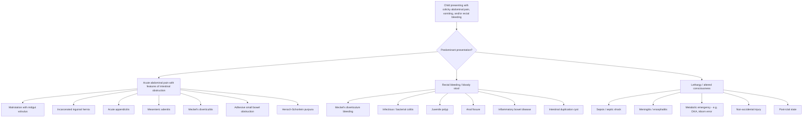

## Differential Diagnosis of Intussusception in Children

### Conceptual Framework: Why Differential Diagnosis Matters

A child presenting with the cardinal features of intussusception — colicky abdominal pain, vomiting, rectal bleeding, and/or lethargy — shares these features with a number of other paediatric surgical and medical emergencies. The key challenge is to **distinguish intussusception from its mimics quickly**, because delayed diagnosis leads to bowel ischaemia and perforation, while misdiagnosis may mean unnecessary interventions or missed alternative emergencies.

The differential diagnosis is best organised by **presenting symptom complex**, because children with intussusception rarely present with the full classical triad. The three major symptom clusters that drive the differential are:

1. **Acute colicky abdominal pain ± vomiting** (the intestinal obstruction picture)
2. **Rectal bleeding / bloody stool** (the lower GI bleeding picture)
3. **Lethargy / altered consciousness** (the neurological mimic picture)

---

### Organising the Differential: A Mermaid Diagram

---

### Detailed Differential Diagnosis by Presentation

#### A. Differential of Acute Colicky Abdominal Pain ± Vomiting (Intestinal Obstruction Picture)

These are conditions that mimic the **obstructive** component of intussusception — colicky pain, vomiting (especially bilious), abdominal distension.

| Condition | Key Distinguishing Features | Why It Mimics Intussusception | How to Differentiate |
|---|---|---|---|
| ***Malrotation with midgut volvulus*** [4][6] | Usually presents in **first days to weeks of life** (75% within first month); ***bilious vomiting*** is the hallmark; abdominal tenderness from peritonitis or ischaemic bowel; can present at any age | Both cause bilious vomiting and can progress to bowel ischaemia. Volvulus also involves mesenteric vascular compromise | **Age** (neonates > infants); **upper GI contrast study** shows abnormal position of DJ flexure (not in LUQ); AXR may show paucity of bowel gas. ***This is the most dangerous mimic — bilious vomiting in a neonate is malrotation with volvulus until proven otherwise*** [4] |
| ***Incarcerated inguinal hernia*** [5] | Irreducible, tender, erythematous groin swelling; ***pain and irritability, vomiting, cyanosis of the mass***; due to ***patent processus vaginalis (PPV)*** in children (indirect hernia) | Both cause intestinal obstruction with vomiting and colicky pain in infants of similar age | **Clinical examination of the groins** — this is why you must ALWAYS examine the inguinal regions in any infant with vomiting or irritability. A tender, non-reducible lump is diagnostic |
| ***Acute appendicitis*** [4][5] | Migration of pain from periumbilical to RIF; low-grade fever; anorexia; RIF tenderness with guarding; ***more likely to be complicated in children*** (delayed presentation); *periappendiceal fat stranding on imaging* | Both can cause RLQ/RIF pain and vomiting. In younger children (< 5 years), appendicitis presents atypically and can be confused with intussusception | **Age** (appendicitis more common > 5 years); **pain pattern** (appendicitis = constant migratory pain vs intussusception = intermittent colicky pain); **no bloody stool** in appendicitis typically; **USG** will show different findings (non-compressible appendix > 6mm vs target sign) |
| ***Mesenteric adenitis*** [4][5] | ***Preceding URTI and high fever ± cervical lymph nodes***; usually ***central 'colicky' pain*** but can cause RLQ pain; self-limiting | Both can follow a viral illness. Both can cause central/RLQ pain. Both occur in similar age groups | **No obstruction features** (no bilious vomiting, no abdominal distension); USG shows enlarged mesenteric lymph nodes without intussusception signs; tends to resolve spontaneously. The viral prodrome is longer and more prominent |
| ***Meckel's diverticulitis*** [4][5] | ***Pain may be similar but signs can be central or left-sided***; may have ***history of antecedent abdominal pain or intermittent LGIB***; peritoneal signs if perforated | Causes acute abdominal pain with peritoneal irritation that can mimic appendicitis or intussusception | ***Often only distinguished intra-operatively (< 10% has pre-operative diagnosis)*** [4]; if operating for suspected appendicitis, ***should run ileum for 60cm to check*** [4] |
| ***Henoch-Schönlein purpura (HSP) — abdominal involvement*** [4][5] | ***IgA-mediated small vessel vasculitis***; ***almost always associated with ecchymotic/purpuric rash on extensor surfaces of limbs and buttocks***; abdominal pain due to intestinal vasculitis (haemorrhage and oedema within bowel wall and mesentery); ***can itself cause intussusception*** (usually ileo-ileal) | HSP causes colicky abdominal pain and bloody stools — indistinguishable from primary intussusception by symptoms alone. HSP is both a **mimic** and a **cause** of intussusception | **Look for the rash** (palpable purpura on legs/buttocks); ***abdominal pain vs intussusception differentiated by USG*** [5]; ***renal involvement common — microscopic haematuria (IgAN-like picture)*** [4]; ***arthritis*** may be present |
| **Adhesive small bowel obstruction** | History of previous abdominal surgery; features of SBO (colicky pain, bilious vomiting, distension, absolute constipation) | Mechanical SBO from any cause shares symptoms | **Surgical history** is the key differentiator; AXR/CT shows dilated SB with transition point but no intussusception target sign |
| ***Post-operative intussusception*** [2] | Occurs after abdominal surgery (especially retroperitoneal or spinal surgery); typically **ileo-ileal**; presents 1–14 days post-operatively | This IS intussusception but in a specific context | Maintain high index of suspicion post-operatively; USG for diagnosis; ileo-ileal type is **less likely to respond to non-operative reduction** but **more likely to resolve spontaneously** [2] |

<Callout title="The Two Must-Not-Miss Diagnoses" type="error">
In any infant with acute abdominal pain and bilious vomiting, the two diagnoses you absolutely **must not miss** are:
1. ***Malrotation with midgut volvulus*** — because the entire midgut can infarct within hours
2. ***Intussusception*** — because delayed treatment leads to bowel necrosis and perforation

Both are **surgical emergencies**. The approach is: stabilise → urgent imaging (USG for intussusception; upper GI contrast for malrotation if suspected) → definitive treatment.
</Callout>

---

#### B. Differential of Rectal Bleeding / Bloody Stool

These conditions mimic the **"red currant jelly stool"** or bloody stool component of intussusception [2][5].

| Condition | Key Distinguishing Features | Why It Mimics Intussusception | How to Differentiate |
|---|---|---|---|
| ***Meckel's diverticulum (bleeding)*** [2][5] | ***Massive painless altered blood*** (maroon-coloured stool); ***due to acid secretion by ectopic gastric mucosa*** causing ulceration of adjacent ileal mucosa; classically **painless** unless complicated by obstruction or diverticulitis | Both cause LGIB in young children | **Painless** (vs painful in intussusception); **larger volume** of altered blood; **no mass** palpable; ***Meckel's (Technetium-99m pertechnetate) scan*** detects ectopic gastric mucosa [5] |
| ***Bacterial colitis*** [2] | Acute bloody diarrhoea with mucus; fever; preceding history of contaminated food/water exposure; organisms include *Salmonella*, *Shigella*, *Campylobacter*, *E. coli* O157:H7, *C. difficile* | Both can cause bloody, mucoid stools with abdominal pain | **Fever more prominent**; **diarrhoea** is the primary symptom (not colicky pain); **stool culture** is definitive; **no mass** on examination; USG shows no intussusception |
| **Juvenile polyp** [5] | ***Painless*** rectal bleeding; bright red blood typically coating the stool; most common colorectal polyp in children (> 90% are juvenile hamartomatous polyps); peak age 2–5 years | Both can cause rectal bleeding in toddlers | **Painless** (no colic); **bright red** blood (not currant jelly); diagnosed by **colonoscopy** |
| **Anal fissure** [5] | ***Painful defecation***; bright red blood on toilet paper or surface of stool; history of constipation (hard stools); visible fissure on inspection | Both present with blood in the stool in an infant/toddler | **Outlet-type bleeding** (blood on surface/wiping); **painful with defecation** specifically; **visible on inspection**; treat underlying constipation |
| **Inflammatory bowel disease** [1][5] | ***Prolonged diarrhoea (> 14 days), bloody diarrhoea***; ***failure to thrive or weight loss***; usually older children/adolescents; extraintestinal manifestations (joint, eye, skin) | Chronic bloody diarrhoea can overlap | **Chronic course** (weeks to months vs acute in intussusception); **weight loss/growth failure**; **raised inflammatory markers** (ESR, CRP, faecal calprotectin); colonoscopy diagnostic |
| **Intestinal duplication cyst** [5] | Can cause painless LGIB if contains ectopic gastric mucosa (similar mechanism to Meckel's); can also act as a pathological lead point for intussusception | Bleeding mechanism similar; can also cause intussusception | **USG** may show a cystic structure adjacent to bowel; **Tc-99m scan** if ectopic gastric mucosa suspected |
| ***Small bowel ischaemia (e.g. volvulus)*** [5] | Bilious vomiting, abdominal pain, bloody stools if bowel becomes gangrenous; signs of shock | Ischaemic bowel from any cause (including intussusception) produces bloody output | **Context** (neonate → think malrotation/volvulus; post-operative → think adhesions); **imaging** differentiates |

> **Clinical pearl from lecture slides:** ***Surgical disorders*** (bowel obstruction, intussusception, ischaemic bowel) should be suspected when a child presents with ***bilious vomiting, severe or localised abdominal pain, bloody diarrhoea***, and examination reveals ***abdominal distension, rebound tenderness, mucoid/bloody stools*** [1].

---

#### C. Differential of Lethargy / Altered Consciousness

This is the most treacherous presentation because it can lead clinicians away from an abdominal diagnosis entirely [2].

| Condition | Key Distinguishing Features | Why It Mimics Intussusception | How to Differentiate |
|---|---|---|---|
| ***Sepsis / septic shock*** [2] | Fever, tachycardia, hypotension, poor perfusion, possible focus of infection; elevated WCC, CRP, procalcitonin, lactate | Both can cause lethargy, pallor, and shock in an infant | **Septic screen** (blood cultures, urine, CXR); **abdominal examination** and **USG** will differentiate — intussusception has a mass and target sign |
| ***Meningitis / encephalitis*** [1] | ***Persistent vomiting, altered consciousness, irritability, photophobia***; ***petechial/purpuric rash (meningococcal), neck stiffness, bulging fontanelle in infants*** | Both can cause lethargy, vomiting, and irritability in infants | **Neurological signs** (meningism, bulging fontanelle); **lumbar puncture** if safe; **no colicky pattern** to symptoms |
| **Metabolic emergency (DKA, inborn errors of metabolism)** [5] | Kussmaul breathing (DKA), ketotic breath, severe dehydration; neonates/infants with IEM may have poor feeding, vomiting, encephalopathy | Both can cause vomiting, lethargy, and dehydration | **Blood glucose**, **ketones**, **blood gas** (metabolic acidosis), **ammonia**, **newborn screening history** |
| **Non-accidental injury (NAI)** | Inconsistent history; unexplained injuries; retinal haemorrhages; subdural haematomas; fractures at different stages of healing | An abused infant may present with lethargy, irritability, and vomiting | **Careful history** (inconsistency between history and injury pattern); **skeletal survey**; **ophthalmoscopy**; **safeguarding referral** |
| **Post-ictal state** | History of seizure activity; gradually improving conscious level; may have known epilepsy or febrile seizures | Post-ictal drowsiness mimics the lethargy of intussusception | **Witnessed seizure history**; **improving trajectory**; **EEG** if needed; always examine the abdomen |

<Callout title="Don't Forget the Abdomen!" type="error">
The most common reason for delayed diagnosis of intussusception is **not thinking of it**. In any infant presenting with lethargy or altered consciousness, **ALWAYS examine the abdomen and perform a PR examination**. If there is any doubt, **get an urgent USG abdomen**. Missing intussusception in a "lethargic infant" is a well-known examination scenario and a real-world diagnostic pitfall [2].
</Callout>

---

### Key Differentiating Approach: Putting It All Together

The following table summarises the **critical distinguishing features** between intussusception and its closest mimics:

| Feature | Intussusception | Malrotation + Volvulus | Incarcerated Hernia | Appendicitis | HSP | Meckel's Bleeding |
|---|---|---|---|---|---|---|
| **Typical age** | 6–36 months | Neonates (< 1 month) | Any infant | > 5 years (usually) | 3–10 years | < 2 years |
| **Pain pattern** | Intermittent colicky | Constant, progressive | Constant | Migratory → constant | Colicky | Usually painless |
| **Vomiting** | Non-bilious → bilious | ***Bilious from onset*** | Present | Present (late) | Present | Absent/mild |
| **Stool** | Currant jelly (late) | Bloody (very late) | Normal initially | Normal | Bloody, mucoid | Painless maroon/altered blood |
| **Mass** | Sausage-shaped RUQ | None typically | Inguinal lump | RIF tenderness | None | None |
| **Rash** | None | None | None | None | ***Purpura on legs/buttocks*** | None |
| **Key investigation** | USG: target sign | Upper GI contrast | Clinical exam | USG / CT | USG ± clinical | Tc-99m scan |

---

### Special Considerations for Hong Kong Practice

- **Rotavirus gastroenteritis** remains a common preceding illness in Hong Kong before intussusception, given that rotavirus vaccination is not part of the government programme and uptake is variable.
- ***Bacterial colitis from Salmonella and Campylobacter*** is relatively common in Hong Kong due to local food practices → these must be considered in children with bloody diarrhoea [1].
- **HSP** is not uncommon in Hong Kong children and is a recognised both as a differential and a cause of intussusception — always look at the skin.
- ***Bilious vomiting in any infant or child should be treated as a surgical emergency until proven otherwise*** — this is a fundamental paediatric principle emphasised across all Hong Kong training programmes [1][4].

---

<Callout title="High Yield Summary — Differential Diagnosis of Intussusception">

1. **Organise by presentation:** (a) colicky pain/obstruction, (b) rectal bleeding, (c) lethargy.
2. **Most dangerous mimic:** ***Malrotation with midgut volvulus*** — bilious vomiting in a neonate is volvulus until proven otherwise.
3. **Don't forget:** Always check the **inguinal regions** (incarcerated hernia) and the **skin** (HSP purpura).
4. **HSP is both a differential AND a cause** — IgA vasculitis causes bowel wall oedema → ileo-ileal intussusception; differentiate from primary intussusception by USG [5].
5. **Meckel's diverticulum** causes **painless** massive rectal bleeding (vs painful + currant jelly in intussusception) and can be a **pathological lead point** for intussusception itself.
6. **Atypical presentation:** Lethargy → always examine the abdomen and get USG. Differential includes sepsis, meningitis, NAI, metabolic emergencies.
7. **Key lecture slide point:** ***Surgical disorders should be suspected with bilious vomiting, severe/localised abdominal pain, bloody diarrhoea, abdominal distension, rebound tenderness, mucoid/bloody stools*** [1].
8. **USG abdomen is the first-line investigation** to differentiate intussusception from its mimics (target sign, pseudo-kidney sign) [3][5].

</Callout>

---

<ActiveRecallQuiz
  title="Active Recall - Differential Diagnosis of Intussusception"
  items={[
    {
      question: "A 3-week-old neonate presents with bilious vomiting. What is the most important diagnosis to exclude, and what investigation would you request?",
      markscheme: "Malrotation with midgut volvulus. Investigation: Upper GI contrast study showing position of DJ flexure (should be in LUQ; displaced = malrotation). Bilious vomiting in a neonate is volvulus until proven otherwise."
    },
    {
      question: "Name three conditions that can be both a differential diagnosis for intussusception AND a pathological lead point causing intussusception.",
      markscheme: "Meckel's diverticulum (lead point for intussusception; also causes painless bleeding as differential), Henoch-Schonlein purpura (bowel wall oedema causes ileo-ileal intussusception; purpura/pain as differential), intestinal polyps (lead point; painless bleeding as differential), lymphoma, duplication cyst."
    },
    {
      question: "How does the rectal bleeding in Meckel's diverticulum differ from that in intussusception? Explain the pathophysiological basis for each.",
      markscheme: "Meckel's: Painless, large volume, maroon/altered blood — due to peptic ulceration of adjacent ileal mucosa by acid secretion from ectopic gastric mucosa. Intussusception: Painful (colicky), currant jelly (blood + mucus), smaller volume initially — due to venous congestion of intussusceptum causing mucosal ooze of blood and mucus."
    },
    {
      question: "A 5-year-old child presents with colicky abdominal pain, bloody stools, and a palpable purpuric rash on the legs and buttocks. What is the most likely diagnosis, and what complication should you look for on USG abdomen?",
      markscheme: "Henoch-Schonlein purpura (IgA vasculitis). USG abdomen should look for intussusception (typically ileo-ileal type), as bowel wall haemorrhage and oedema can act as a lead point. Also check urine for microscopic haematuria (renal involvement)."
    },
    {
      question: "Why must you always examine the inguinal regions in any infant presenting with vomiting and irritability?",
      markscheme: "To exclude incarcerated inguinal hernia, which is due to patent processus vaginalis (indirect hernia) in children. Presents with irreducible tender inguinal swelling, pain, irritability, vomiting, and cyanosis of the mass. If missed, can progress to bowel strangulation and ischaemia."
    },
    {
      question: "List the key features from the NICE/lecture slide table that should make you suspect a surgical disorder rather than simple gastroenteritis in a child with diarrhoea and vomiting.",
      markscheme: "Bilious vomiting, severe or localised abdominal pain, bloody diarrhoea, abdominal distension, rebound tenderness, mucoid or bloody stools. These features distinguish surgical disorders (obstruction, intussusception, ischaemic bowel) from infective gastroenteritis."
    }
  ]}
/>

## References

[1] Lecture slides: GC 142. A child with loose stool.pdf (p19, Table 3.3)
[2] Senior notes: felixlai.md (Intussusception section — Differential diagnosis, Clinical manifestation)
[3] Senior notes: maxim.md (Intussusception section)
[4] Senior notes: Adrian Lui Pediatrics.pdf (p248–250, Appendicitis differentials, Malrotation, Intussusception)
[5] Senior notes: maxim.md (GI bleed section, Meckel diverticulum, HSP, Paediatric surgical abdomen)
[6] Senior notes: felixlai.md (Intestinal malrotation section)
