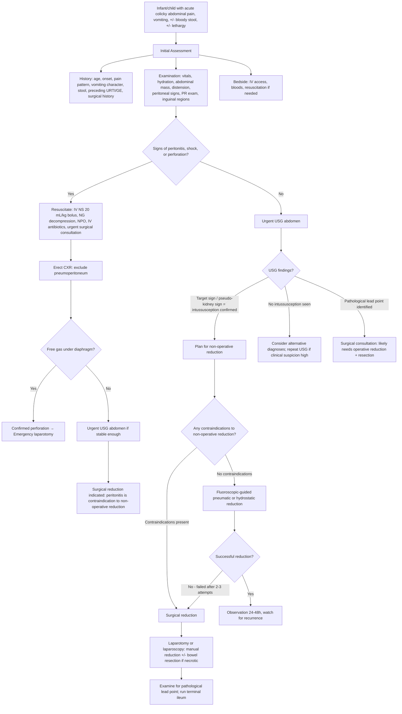

## Diagnostic Criteria, Algorithm, and Investigations for Intussusception in Children

### Diagnostic Criteria

Intussusception does not have a single universally agreed "diagnostic criteria checklist" in the way that, say, rheumatic fever has the Jones criteria. Instead, the diagnosis is made by combining **clinical suspicion** (based on history and examination) with **confirmatory imaging**. In practical paediatric emergency medicine, the diagnostic pathway is:

1. **Clinical suspicion** — raised by any combination of the cardinal features (colicky pain, vomiting, bloody stool, palpable mass, lethargy) in an infant aged 6–36 months.
2. **Imaging confirmation** — ***USG abdomen is the diagnostic gold standard*** [3][7].
3. **Therapeutic confirmation** — in some cases, successful enema reduction (pneumatic or hydrostatic) simultaneously confirms the diagnosis and treats the condition.

<Callout title="There Is No Formal 'Scoring System' for Intussusception">
Unlike appendicitis (where the Alvarado/PAS score exists), intussusception relies on clinical gestalt + ultrasound. The key message is: **if you think of it, image it.** The threshold to obtain an urgent USG should be very low in any infant with unexplained abdominal pain, vomiting, or irritability.
</Callout>

#### Brighton Collaboration Case Definition (Used in Vaccine Safety Surveillance)

For epidemiological and vaccine-safety purposes, the **Brighton Collaboration** provides a standardised case definition of intussusception with three levels of diagnostic certainty [7]:

| Level | Criteria |
|---|---|
| **Level 1 (Definite)** | Surgical confirmation (intussusception found at laparotomy or laparoscopy), OR autopsy findings, OR **air/liquid enema reduction** with confirmation of intussusception by imaging |
| **Level 2 (Probable)** | Two or more of the following: (a) characteristic imaging findings (USG target sign/pseudo-kidney sign; CT target/donut lesion), (b) characteristic clinical features (abdominal mass, bloody stool, signs of IO), (c) pathological lead point found |
| **Level 3 (Possible)** | Clinical features suggestive of intussusception without imaging or surgical confirmation |

> In clinical practice (as opposed to surveillance), **Level 1 or Level 2** is what we aim for — i.e., USG confirmation + clinical features, or confirmation at surgery/enema.

---

### Diagnostic Algorithm

The following algorithm reflects the standard approach used in Hong Kong paediatric emergency departments, integrating initial assessment, resuscitation, imaging, and decision-making for reduction [3][5][7][8].

---

### Investigation Modalities — Detailed Breakdown

#### 1. Bedside Investigations

##### a. Per Rectal (PR) Examination

- **What it tells you:** Blood and/or mucus on the examining finger (early mucosal ooze from venous congestion) even before currant jelly stool is visible in the nappy. Occasionally the apex of the intussusceptum is palpable as a mass.
- **Why it matters:** This is a rapid, no-cost bedside test that can **clinch the diagnosis** and is often the finding that tips the clinician toward ordering an urgent USG.
- **Paediatric consideration:** Explain the procedure to the caregiver and obtain consent. Use a well-lubricated little finger in an infant. It should not be deferred "because the child is crying" — in a child with suspected intussusception, the information gained is critical.

##### b. Vital Signs and Hydration Assessment

| Parameter | What to look for | Why |
|---|---|---|
| Heart rate | Tachycardia (age-appropriate: e.g. > 160 bpm in infant) | Dehydration from vomiting, third-spacing; pain; or sepsis if perforation |
| Blood pressure | Hypotension (late sign in children) | Hypovolaemic or septic shock |
| Temperature | Fever | Underlying viral trigger, or complicating bowel necrosis/peritonitis |
| Capillary refill time | > 2 seconds | Poor perfusion from dehydration/shock |
| Fontanelle (if open) | Sunken | Dehydration |

---

#### 2. Blood Tests

These are **not diagnostic** of intussusception per se, but are essential for **assessing the child's physiological status, guiding resuscitation, and preparing for potential surgery** [8][9].

| Test | What to look for | Pathophysiological basis |
|---|---|---|
| **CBC** | Leucocytosis (↑WCC with neutrophilia) | Stress response, dehydration (haemoconcentration), or secondary bacterial infection if bowel ischaemia/perforation. Anaemia if significant LGIB. |
| **Electrolytes (Na⁺, K⁺, Cl⁻, HCO₃⁻)** | ***HypoK/hypoCl*** from prolonged vomiting; hyponatraemia from third-spacing + inappropriate ADH | Vomiting → loss of H⁺ and Cl⁻ → metabolic alkalosis → renal K⁺ wasting (H⁺/K⁺ exchange) [8][9] |
| **RFT (Urea, Creatinine)** | Raised urea:creatinine ratio (pre-renal AKI) | Dehydration from vomiting and poor intake → reduced renal perfusion → pre-renal uraemia [8][9] |
| **Blood gas (capillary/venous)** | ***Metabolic acidosis with raised lactate*** → bowel ischaemia. ***Metabolic alkalosis*** → prolonged vomiting [8][9] | Ischaemic bowel switches to anaerobic metabolism → lactic acid production. Vomiting loses gastric H⁺ → alkalosis |
| **CRP** | Elevated if necrosis, perforation, or secondary peritonitis | Non-specific inflammatory marker; rising CRP with clinical deterioration suggests complication |
| **Group & Save / Cross-match** | Prepare for potential surgery | All children with suspected surgical abdomen should have blood available |
| **Coagulation profile** | Usually normal; abnormal if DIC from sepsis | If perforation → peritonitis → sepsis → DIC → consumptive coagulopathy |
| **Blood glucose** | Hypoglycaemia (infants have low glycogen reserves; stress + fasting) | Always check in any acutely unwell infant — hypoglycaemia can compound the clinical picture |

<Callout title="Paediatric Normal Values — Know Your Ranges" type="idea">
Always interpret blood results against **age-appropriate normal ranges**:
- Neonatal WCC: 10–26 × 10⁹/L (normally higher than older children)
- Infant WCC: 6–17.5 × 10⁹/L
- Creatinine: much lower in infants (15–30 µmol/L) than adults
- Lactate: normal < 2 mmol/L in children; > 2 mmol/L is concerning for ischaemia
</Callout>

---

#### 3. Radiological Investigations

##### a. Plain Abdominal X-ray (AXR) — Supine ± Erect

**Role:** ***Performed as part of the evaluation of patients with abdominal symptoms and to exclude perforation in patients with suspected intussusception*** [7]. AXR is **NOT diagnostic** of intussusception on its own — its main value is to look for complications (perforation, obstruction) and to exclude other diagnoses. Some centres now skip AXR and go straight to USG.

**Key findings on AXR** [7][8][9]:

| Finding | Description | Significance |
|---|---|---|
| ***Distended loops of small bowel with absence of colonic gas*** [3][7] | Proximal small bowel dilated (> 3 cm); no gas seen in the colon (because the intussusception blocks passage of gas distally) | Supports the diagnosis of mechanical bowel obstruction at the level of the ileocaecal region |
| ***Air-fluid levels*** (on erect film) | Multiple air-fluid levels in the small bowel | Sign of small bowel obstruction (> 5 air-fluid levels is diagnostic of IO) [8][9] |
| **"Target sign"** (AXR) [7] | ***Two concentric radiolucent circles superimposed on the right kidney*** — representing peritoneal fat surrounding and within the intussusception | Relatively specific when seen, but not commonly identified on plain film |
| **"Crescent sign"** [7] | ***A soft-tissue density representing the intussusceptum projecting into the gas of the large bowel*** | The head of the intussusceptum is outlined by colonic gas |
| **"Sausage-shaped opacity"** [9] | A soft-tissue mass in the RUQ/transverse colon region corresponding to the intussusception itself | May be visible, especially if the colon is relatively gas-free |
| **Pneumoperitoneum** (on erect CXR or AXR) | Free gas under the diaphragm (erect CXR) or Rigler's sign (gas on both sides of bowel wall on supine AXR) | Indicates **perforation** — contraindication to enema reduction → proceed directly to surgery |
| **Normal AXR** | No specific findings | A **normal AXR does NOT exclude intussusception** — sensitivity is only ~45–50%. Must proceed to USG if clinical suspicion remains |

<Callout title="AXR Is Not Enough" type="error">
A normal AXR **does not rule out intussusception**. The AXR may appear entirely normal in early intussusception before significant obstruction develops. If you suspect intussusception clinically, you **MUST proceed to USG** regardless of the AXR result [7]. The main purpose of the AXR is to check for perforation (free gas) before attempting enema reduction.
</Callout>

##### b. Ultrasound (USG) Abdomen — The Diagnostic Gold Standard

***USG is the imaging modality of choice to identify intussusception*** [3][7].

**Why USG is ideal in paediatrics:**
- **No ionising radiation** — critical in children (ALARA principle: As Low As Reasonably Achievable)
- **Non-invasive and painless** — can be performed at the bedside
- ***Sensitivity and specificity can approach 100% in experienced hands*** [7]
- ***Able to detect pathological lead points*** [7]
- ***Can monitor success of reduction procedure*** [7]
- Can assess bowel wall perfusion (Doppler) to evaluate for ischaemia

**Classical USG findings** [3][7]:

| View | Finding | Description | Pathophysiological explanation |
|---|---|---|---|
| **Transverse** | ***"Target sign" (also called "doughnut" or "bull's-eye" sign)*** [3][7] | Multiple concentric rings seen on cross-section — alternating hypoechoic (bowel wall) and hyperechoic (mesenteric fat, mucosa) layers | The intussusceptum is surrounded by the intussuscipiens → layering of bowel wall + mesentery + bowel wall creates concentric rings, like a target or doughnut |
| **Longitudinal** | ***"Pseudo-kidney sign"*** [3][7] | An elongated mass with a hyperechoic centre (mesenteric fat of intussusceptum) and hypoechoic rim (bowel wall of intussuscipiens) | In longitudinal section, the layered structure looks like a kidney — the central "hilum" is the trapped mesentery, the "cortex" is the outer bowel wall |
| **Doppler** | ***Lack of perfusion in intussusceptum indicates development of ischaemia*** [7] | Absent or markedly reduced blood flow within the intussusceptum on colour Doppler | Mesenteric vessel compression → no arterial flow detectable → implies ischaemia, increasing urgency for reduction or surgery |
| **Lead point** | Mass within the intussusceptum | A discrete mass (polyp, Meckel's, lymphoma) at the apex of the intussusception | The lead point is the structural lesion that initiated the telescoping |

**Additional USG features to assess:**
- **Outer diameter of the intussusception:** typically > 3 cm (often 2.5–5 cm)
- **Trapped fluid between layers:** indicates oedema; large amounts suggest ischaemia and lower likelihood of successful non-operative reduction
- **Free peritoneal fluid:** suggests advanced disease; if significant, lower success rate of enema reduction
- **Lymph nodes:** enlarged mesenteric lymph nodes may be seen (consistent with viral trigger or mesenteric adenitis)

<Callout title="USG Interpretation — What the Signs Mean Physically">
Imagine cutting through a telescoped bowel (like cutting through a rolled-up newspaper):
- **Transverse cut** → you see concentric rings (target/doughnut sign)
- **Longitudinal cut** → you see a layered sausage with a bright centre (the trapped mesentery fat) resembling a kidney (pseudo-kidney sign)

The more layers you see, the more bowel has telescoped in. The presence of trapped fluid between layers and absence of Doppler flow are ominous signs.
</Callout>

##### c. Contrast Enema (Barium or Air) — Diagnostic AND Therapeutic

In older practice, a **barium enema** was used diagnostically (and could be therapeutic). This has largely been replaced by **pneumatic (air) enema** or **hydrostatic (saline) enema** under fluoroscopic or USG guidance, which serves the **dual purpose of diagnosis and treatment** [3][5]. The diagnostic findings on contrast/air enema are:

| Finding | Description |
|---|---|
| **"Meniscus sign" or "coiled-spring sign"** | Contrast (or air) outlines the intussusceptum within the colon — the leading edge appears as a meniscus (crescent), and the compressed mucosal folds of the intussusceptum create a coiled-spring appearance |
| **"Claw sign"** | The contrast or air columns around the intussusceptum create a claw-like indentation at the apex of the intussusception |
| **Obstruction to retrograde flow** | Contrast/air cannot pass beyond the point of intussusception |
| **Successful reduction** | ***Gush of air into the terminal ileum*** (in pneumatic reduction) or free flow of contrast into the small bowel — confirms complete reduction [3] |

> In modern Hong Kong paediatric practice, **USG is performed first for diagnosis**, and if intussusception is confirmed and there are no contraindications, the child proceeds to ***fluoroscopic-guided pneumatic reduction*** [3].

##### d. CT Abdomen — Reserved for Selected Cases

***CT scan is reserved for patients in whom other imaging modalities are unrevealing or to characterise pathological lead points for intussusception detected by USG*** [7].

| Feature | Detail |
|---|---|
| **When to use** | Atypical presentations; older children where a pathological lead point (e.g. lymphoma) is suspected; unclear USG findings; to assess for complications (perforation, abscess) |
| **Key findings** | ***"Target sign" (alternating hypodense and hyperdense layers)*** [7][9]; pathological lead point (mass); bowel wall thickening; mesenteric oedema; free fluid; ***pneumatosis intestinalis and portal venous gas if ischaemia/necrosis*** [7][9] |
| **Disadvantage** | ***Exposes patients to substantial radiation*** [7] — in paediatrics, CT should only be used when the information gained outweighs the radiation risk |

<Callout title="Radiation Awareness in Paediatric Imaging" type="error">
Children are significantly more sensitive to ionising radiation than adults (higher radiosensitivity of dividing cells + longer remaining lifespan for cancer to develop). The hierarchy of imaging for intussusception should be:
1. **USG** (no radiation, diagnostic)
2. **AXR** (low radiation, for obstruction/perforation screening)
3. **CT** (high radiation, reserved for complex/unclear cases or to characterise lead points)

Never jump to CT when USG can answer the question [7].
</Callout>

---

#### 4. Summary Table: Investigations at a Glance

| Investigation | Role | Key Findings in Intussusception | Sensitivity/Specificity | When to Use |
|---|---|---|---|---|
| **PR examination** | Bedside; detect occult blood | Blood/mucus on finger; rarely palpable mass | High clinical utility | Always — in every suspected case |
| **Bloods** | Assess physiology, prep for surgery | Leucocytosis, electrolyte derangement, metabolic acidosis/raised lactate if ischaemia | Non-diagnostic | Always |
| **AXR (supine ± erect)** | Screen for obstruction/perforation | ***Distended SB, absent LB gas*** [3]; target/crescent sign (uncommon); free gas if perforated | Sensitivity ~45–50%; poor for excluding | First-line alongside USG; mainly to exclude perforation |
| ***USG abdomen*** | ***Diagnostic gold standard*** [3][7] | ***Target/doughnut sign (transverse); pseudo-kidney sign (longitudinal)***; trapped fluid; absent Doppler flow if ischaemic; detect lead point | ***Sensitivity ~98–100%; specificity ~98–100%*** [7] | **All suspected cases** |
| **Pneumatic/hydrostatic enema** | Diagnostic + therapeutic | Meniscus/claw/coiled-spring sign; successful reduction = gush of air into terminal ileum | Very high (performed under fluoroscopic guidance) | After USG confirms diagnosis and no contraindications |
| **CT abdomen** | Complex/atypical cases | Target/donut lesion; lead point characterisation; complications (pneumatosis, portal gas) | Very high but radiation cost | Only if USG unclear or to characterise lead point in older children |

---

### Contraindications to Non-Operative (Enema) Reduction

Before proceeding to enema reduction, you must ensure there are **no contraindications**. These are critical because attempting reduction in these circumstances risks **perforation, peritoneal contamination, and death** [3][5]:

| Contraindication | Rationale |
|---|---|
| ***Peritonitis / signs of peritoneal irritation*** [3] | Suggests bowel necrosis or perforation already present — enema pressure would worsen perforation |
| **Pneumoperitoneum on AXR/CXR** | Confirmed perforation — requires emergency laparotomy |
| **Haemodynamic instability / shock unresponsive to resuscitation** | Child too unstable for enema; needs surgery |
| ***Suspected pathological lead point (e.g. lymphoma, large polyp)*** [3] | Non-operative reduction may temporarily reduce the intussusception but does not address the underlying lesion; recurrence is very likely; the lead point needs surgical excision and histological diagnosis |
| **Prolonged symptoms (> 48 hours) with signs of bowel compromise** | Higher likelihood of gangrenous bowel; lower success rate of reduction; higher perforation risk |

<Callout title="High Yield Summary — Diagnosis of Intussusception">

1. **Diagnosis is clinical suspicion + USG confirmation.** There are no formal "diagnostic criteria" in daily practice — use the Brighton case definition for surveillance.
2. ***USG abdomen is the imaging modality of choice:*** target sign (transverse), pseudo-kidney sign (longitudinal), ± absent Doppler flow (ischaemia), ± visible lead point. Sensitivity and specificity approach 100% [3][7].
3. **AXR** is performed to screen for obstruction and **exclude perforation** (free gas) — a normal AXR does NOT exclude intussusception.
4. **CT** is reserved for atypical/complex cases or to characterise pathological lead points. Avoid unnecessary radiation in children.
5. **Bloods** are for physiological assessment and pre-operative preparation — not for diagnosis. Key findings: leucocytosis, metabolic acidosis with raised lactate (ischaemia), electrolyte derangement from vomiting.
6. **Contraindications to enema reduction:** ***peritonitis, perforation (pneumoperitoneum), shock, suspected pathological lead point*** [3].
7. ***Fluoroscopic-guided pneumatic reduction*** is both diagnostic and therapeutic — successful reduction confirmed by ***gush of air into the terminal ileum*** [3].
8. **Always do a PR examination** — blood/mucus on the finger may be the first objective sign.

</Callout>

---

<ActiveRecallQuiz
  title="Active Recall - Diagnosis of Intussusception"
  items={[
    {
      question: "What is the imaging modality of choice for diagnosing intussusception in children, and what are its two classical findings on transverse and longitudinal views?",
      markscheme: "USG abdomen is the gold standard. Transverse view: target sign (also called doughnut or bull's-eye sign) — concentric rings of bowel wall and mesentery. Longitudinal view: pseudo-kidney sign — layered mass with hyperechoic centre (mesenteric fat) and hypoechoic rim (bowel wall). Sensitivity and specificity approach 100%."
    },
    {
      question: "A child with suspected intussusception has a normal AXR. Can you exclude the diagnosis? What should you do next?",
      markscheme: "No — a normal AXR does NOT exclude intussusception (sensitivity only ~45-50%). Must proceed to urgent USG abdomen if clinical suspicion remains. AXR is mainly useful to exclude perforation (free gas under diaphragm) before enema reduction."
    },
    {
      question: "List four contraindications to non-operative enema reduction of intussusception and explain the rationale for one of them.",
      markscheme: "Contraindications: (1) peritonitis, (2) pneumoperitoneum/perforation, (3) haemodynamic instability/shock, (4) suspected pathological lead point. Rationale for peritonitis: suggests bowel necrosis or perforation already present; applying enema pressure would worsen perforation, causing faecal contamination of peritoneal cavity."
    },
    {
      question: "On USG, what does absence of Doppler flow in the intussusceptum indicate, and how does it change management?",
      markscheme: "Absence of Doppler flow indicates ischaemia of the intussusceptum due to mesenteric vessel compression. This increases urgency — lower success rate of non-operative reduction and higher risk of necrosis/perforation. Earlier surgical consultation is warranted, and the threshold for proceeding to operative reduction is lower."
    },
    {
      question: "What blood gas finding would suggest bowel ischaemia in a child with intussusception? Explain the biochemical mechanism.",
      markscheme: "Metabolic acidosis with raised serum lactate. Mechanism: ischaemic bowel switches from aerobic to anaerobic metabolism, producing lactic acid as a by-product of anaerobic glycolysis. Lactate accumulates systemically, causing a raised anion gap metabolic acidosis."
    },
    {
      question: "In pneumatic reduction of intussusception, what finding confirms successful reduction?",
      markscheme: "A gush of air into the terminal ileum seen on fluoroscopy confirms successful and complete reduction. This indicates that the intussusceptum has been fully pushed back through the ileocaecal valve and the small bowel lumen is now patent."
    }
  ]}
/>

## References

[3] Senior notes: maxim.md (Intussusception section)
[5] Senior notes: maxim.md (Paediatric surgical abdomen; GI bleed section; Meckel diverticulum section)
[7] Senior notes: felixlai.md (Intussusception — Diagnosis section)
[8] Senior notes: Ryan Ho Fundamentals.pdf (p279, Investigations for acute abdomen)
[9] Senior notes: Ryan Ho GI.pdf (p134, Intussusception; p136, Diagnostic evaluation of IO; p105, Investigations for acute abdomen)
