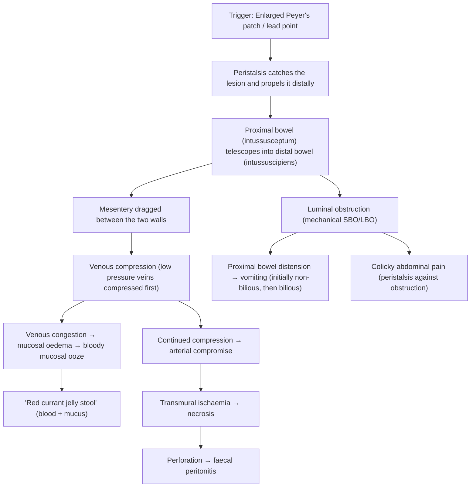

# Intussusception in Children

## Definition

Intussusception — from the Latin *intus* ("within") + *susceptio* ("to take up/receive") — refers to the **invagination (telescoping) of a proximal segment of bowel (the *intussusceptum*) into an immediately distal segment (the *intussuscipiens*)** [1][2][3]. Think of it like pushing a telescope inward: one part of the bowel slides into the next, dragging its mesentery and blood supply along with it.

It is the **most common cause of intestinal obstruction in infants aged 6–36 months** and represents the **most common abdominal emergency in early childhood** [1][2][3].

<Callout title="Terminology Breakdown">
- **Intussusceptum** = the proximal segment that "enters" (the inner tube — this is the part that undergoes ischaemia first because its mesentery gets compressed)
- **Intussuscipiens** = the distal receiving segment (the outer tube)
- The mesentery of the intussusceptum is dragged between the two layers → compressed → venous then arterial compromise
</Callout>

---

## Epidemiology

| Feature | Detail |
|---|---|
| **Incidence** | ~1–4 per 1,000 live births; most common abdominal emergency in early childhood [1][2] |
| **Peak age** | ***6–36 months*** (majority < 2 years); rare before 3 months and after 6 years [1][2] |
| **Sex** | ***Male predominance (M:F ≈ 3:2)*** [2] |
| **Seasonality** | Slight peaks in spring and autumn — paralleling viral gastroenteritis and URTI seasons |
| **Geography** | Worldwide; no strong ethnic predilection. In Hong Kong, rotavirus and adenovirus remain common triggers in the pre-vaccine era; post-rotavirus-vaccine surveillance shows a very small incremental risk (see below) |

> **High Yield:** When intussusception occurs **outside the typical 6–36 month age window** (especially > 6 years), strongly suspect a **pathological lead point** [1][2][3].

### Rotavirus Vaccine Association

- First-generation rotavirus vaccine (RotaShield) was withdrawn in 1999 due to a 1 in 10,000 risk of intussusception.
- ***Current vaccines (RotaTeq, Rotarix) carry a very small increased risk (~1–5 per 100,000), primarily within the first week after the first dose*** [3].
- This is why rotavirus vaccine should ideally be given starting at 6 weeks of age with the first dose **no later than 14 weeks 6 days** — to minimise overlap with peak intussusception age.
- In Hong Kong, rotavirus vaccine is available but is NOT part of the routine government Childhood Immunisation Programme (it is self-financed).

---

## Anatomy and Function

### Relevant GI Anatomy in Infants

To understand intussusception you need to appreciate the anatomy of the **ileocaecal region**:

1. **Terminal ileum** — the last ~20 cm of the small bowel; this is where **Peyer's patches** (organised lymphoid follicles in the submucosa) are most concentrated. In infants, Peyer's patches are large and reactive because the infant immune system is encountering many antigens for the first time.

2. **Ileocaecal valve (ICV)** — a physiological sphincter where the ileum opens into the caecum. This is a natural "funnel point" — the narrowing at the ICV acts as a pivot point that allows a swollen terminal ileal segment to be "caught" by peristalsis and pushed through.

3. **Caecum and ascending colon** — the receiving segment. In infants the caecum is relatively mobile (not yet fully fixed to the retroperitoneum), which may facilitate telescoping.

4. **Mesentery** — the fan-shaped peritoneal fold carrying blood vessels, lymphatics, and nerves to the bowel. When the intussusceptum telescopes in, it **drags its mesentery** with it → the vessels get compressed between the two walls → venous congestion → oedema → arterial compromise → ischaemia → necrosis → perforation.

### Why Children Are Susceptible

- **Prominent Peyer's patches** in the terminal ileum that enlarge further with viral infections → act as a "lead point."
- **Relatively mobile caecum** in young children.
- **High peristaltic activity** in the growing gut.
- The **ileocaecal valve** acts as a fulcrum — the most common intussusception type is therefore ***ileocolic (ileocaecal)*** [1][2][3].

---

## Aetiology and Pathophysiology

### A. Aetiology

#### 1. Idiopathic (~75–90% of paediatric cases) [1][2][3]

- ***No clear disease trigger or pathological lead point*** [2].
- Proposed mechanism: **reactive lymphoid hyperplasia (hypertrophy of Peyer's patches)** in the lymphoid-rich terminal ileum secondary to:
  - **Viral upper respiratory tract infection (URTI)** — adenovirus (serotypes 1, 2, 5), HHV-6
  - **Viral gastroenteritis** — rotavirus, norovirus, enteric adenovirus (serotype 40/41)
  - Other viral infections — EBV, CMV
- The enlarged Peyer's patch protrudes into the lumen → gets "grabbed" by normal peristalsis → dragged distally → initiates telescoping [1][2].
- **Seasonal variation** supports a viral trigger (peaks in spring/autumn).
- ***Many children have a preceding history of URTI or gastroenteritis in the days before presentation*** [1][3].

<Callout title="Why Peyer's patches?" type="idea">
Peyer's patches are submucosal aggregates of lymphoid tissue concentrated in the terminal ileum. In young children, they are disproportionately large relative to the bowel wall. When stimulated by a viral infection, they undergo hyperplasia — swelling into the lumen like small polyps. The vigorous peristalsis of a young child's bowel then catches these swollen patches and telescopes them forward through the ileocaecal valve.
</Callout>

#### 2. Pathological Lead Points (~10–25%) [1][2][3]

A "lead point" is a structural lesion in the bowel wall that is trapped by peristalsis and pulled into the distal segment. **The likelihood of a pathological lead point increases with age** — if a child > 3 years (and especially > 6 years) presents with intussusception, actively search for one.

| Lead Point | Key Features |
|---|---|
| ***Meckel's diverticulum*** | Most common pathological lead point overall; a true diverticulum of the terminal ileum (remnant of omphalomesenteric duct); "rule of twos" — 2% of population, 2 feet from ICV, 2 inches long; should be considered in **recurrent** small bowel intussusception [4][5] |
| **Polyps** | Juvenile polyps, Peutz-Jeghers polyps (hamartomatous), familial adenomatous polyposis |
| ***Lymphoma*** | Particularly Burkitt lymphoma (B-cell, EBV-associated) — ileocaecal region is a classic site; consider in older children with intussusception [1][2] |
| **Duplication cysts** | Congenital enteric duplication; fluid-filled cyst sharing a muscular wall with the adjacent bowel |
| ***Henoch-Schönlein purpura (HSP)*** / IgA vasculitis | Submucosal haemorrhage/oedema of the bowel wall acts as a lead point; typically causes **ileo-ileal** intussusception [2] |
| **Cystic fibrosis** | Inspissated meconium / thick intestinal secretions |
| ***Rotavirus vaccine*** | Small risk, especially within 1 week of first dose [3] |
| **Post-operative** | Uncoordinated peristaltic activity; traction from sutures or devices (e.g. gastrojejunal feeding tube) [2] |
| **Others** | Haemangioma, lipoma, foreign body, parasitic worms (Ascaris), appendiceal stump |

<Callout title="Exam Pearl" type="error">
A common exam mistake is to assume all paediatric intussusception is idiopathic. Remember:
- **Recurrent intussusception** → think pathological lead point (especially Meckel's diverticulum)
- **Child > 3–6 years** → think pathological lead point (lymphoma, polyp, Meckel's)
- **Ileo-ileal** pattern → think HSP, post-operative, or Meckel's
- **Adults** → ALWAYS assume a pathological lead point (tumour until proven otherwise) [3]
</Callout>

#### 3. Location Classification [1][2][3]

| Type | Segment | Proportion | Notes |
|---|---|---|---|
| ***Ileocolic (ileocaecal)*** | Terminal ileum → through ICV into colon | ***~85–90%*** | **Most common** in children |
| **Ileo-ileal** | Small bowel → small bowel | ~5–10% | More common in HSP, post-op, neonates; **less likely to respond to non-operative reduction; more likely to resolve spontaneously** [2] |
| **Colocolic** | Colon → colon | Rare in children | More common in adults (think colonic tumour) |
| **Jejuno-jejunal / Jejuno-ileal** | Small bowel variants | Rare | Usually pathological lead point |

---

### B. Pathophysiology — A Step-by-Step Cascade

Understanding the pathophysiology is crucial because **every clinical feature can be traced back to this sequence**:

**Detailed stepwise explanation:**

1. **Initiation** — A "lead point" (hypertrophied Peyer's patch or structural lesion) protrudes into the bowel lumen. Normal peristalsis grabs it and propels it distally.

2. **Telescoping** — The proximal bowel segment (intussusceptum) progressively invaginates into the distal segment (intussuscipiens). The mesentery is dragged in between the two layers.

3. **Venous obstruction (early)** — Mesenteric veins are thin-walled and low-pressure, so they are compressed first → venous congestion → engorgement of the trapped bowel wall → mucosal oedema.

4. **Mucosal ooze** — Congested, oedematous mucosa weeps blood and mucus into the lumen → this produces the classic ***"red currant jelly stool"*** (a late sign, appearing ~12–24 hours after onset) [1][2][3].

5. **Arterial compromise (later)** — As oedema worsens, the thicker-walled arteries are also compressed → transmural ischaemia → **gangrenous bowel**.

6. **Mechanical obstruction** — The intussusception physically obstructs the bowel lumen:
   - Proximal bowel dilates → colicky abdominal pain (due to powerful peristaltic contractions trying to overcome the obstruction)
   - ***Bilious vomiting*** occurs because the obstruction is usually distal to the ampulla of Vater [3]
   - Abdominal distension develops as the obstruction progresses

7. **Necrosis and perforation** — If untreated → gangrenous bowel → perforation → faecal peritonitis → sepsis → shock → death.

> **The natural history is progressive.** Early presentation = high success with non-operative reduction. Late presentation = higher risk of perforation and need for surgery. This is why **time to diagnosis matters enormously**.

---

## Classification

### By Location (see table above)

### By Cause
- **Idiopathic** (vast majority in children)
- **Secondary** (pathological lead point)
- **Post-operative**

### By Reducibility
- **Reducible** (amenable to pneumatic/hydrostatic reduction)
- **Irreducible** (failed reduction, peritonitis, necrosis → surgical)

### By Course
- **Acute** (classic presentation)
- **Recurrent** (~5–10% recurrence after successful reduction; recurrent intussusception should prompt investigation for a lead point)
- **Chronic** (rare; partial, intermittent symptoms over weeks)

---

## Clinical Features

### A. Symptoms (What the caregiver reports)

| Symptom | Pathophysiological Basis | Notes |
|---|---|---|
| ***Intermittent, severe colicky abdominal pain*** | Peristalsis contracting against the obstructing intussusceptum creates waves of visceral pain. Pain is **colicky** (comes and goes) because peristalsis is rhythmic — the child screams and draws up their knees during a wave, then becomes quiet between episodes | ***Classical triad component*** [3]; the "screaming episodes" with leg-drawing are very characteristic |
| **Inconsolable crying / irritability** | Same mechanism as above; infants cannot verbalise pain, so they cry and become irritable. Between episodes, the child may appear surprisingly well (the "lucid interval") | May be the **only** presenting symptom in young infants |
| ***Vomiting*** | Initially **non-bilious** (reflex vomiting from pain and vagal stimulation). As obstruction progresses and becomes complete, vomiting becomes ***bilious*** (green) because the obstruction is distal to the ampulla of Vater → bile cannot pass distally and refluxes proximally [3] | ***Bilious vomiting in any infant is a surgical emergency until proven otherwise*** |
| ***"Red currant jelly stool"*** | Venous congestion of the intussusceptum → mucosal ooze of blood and mucus → mixed stool that looks like redcurrant jelly. This is a **LATE sign** (appears 12–24+ hours after onset) — its absence does NOT exclude intussusception | ***Classical triad component*** [1][2][3]; present in only ~50–60% of cases. May be detected on PR examination before being visible in the nappy |
| **Pallor / lethargy / "shock-like" episodes** | Autonomic response to visceral pain (vagal activation); also progressive dehydration from vomiting and third-spacing. Severe lethargy can mimic sepsis or a neurological emergency | Sometimes described as "altered consciousness" — a well-known atypical presentation that can mislead clinicians [2] |
| **Refusal to feed** | Pain, nausea, and obstruction make the child reluctant to eat | Non-specific but important in context |
| **Diarrhoea (early)** | Increased peristalsis early in the course may produce loose stools before obstruction becomes complete | Can mimic acute gastroenteritis initially, which is a classic diagnostic pitfall |
| **Preceding URTI or gastroenteritis symptoms** | Viral infection → Peyer's patch hyperplasia → acts as lead point | Very common history to elicit; supports the idiopathic viral trigger hypothesis |

<Callout title="The Classical Triad (present in < 50% of cases!)" type="error">
1. ***Intermittent colicky abdominal pain***
2. ***"Red currant jelly" stool (blood and mucus per rectum)***
3. ***Sausage-shaped abdominal mass (RUQ)***

**Fewer than 50% of children present with all three components** [3]. Do NOT wait for the full triad to make the diagnosis — a high index of suspicion is needed. Many infants present with only one or two features. Lethargy alone can be the presenting complaint.
</Callout>

### B. Signs (What you find on examination)

| Sign | Pathophysiological Basis | Notes |
|---|---|---|
| ***Sausage-shaped mass in the RUQ / right hypochondrium*** | The intussusceptum (usually ileocolic) has telescoped through the ICV and now sits in the ascending colon / hepatic flexure region, forming a palpable cylindrical mass | ***Classical triad component*** [3]; best palpated between episodes of colic (when the abdomen is relaxed). May be missed if the child is crying/guarding |
| **"Empty" right iliac fossa** (***Dance's sign***) | The caecum and terminal ileum have been dragged out of the RIF by the intussusception, leaving the RIF feeling unusually empty on palpation | A classic but subtle sign; not always present |
| **Abdominal distension** | Progressive mechanical bowel obstruction → proximal bowel dilates with gas and fluid | Worsens with time; indicates later-stage obstruction |
| **Abdominal tenderness / guarding / rigidity** | If ischaemia progresses to transmural necrosis or perforation → peritonitis → localised or generalised peritoneal irritation | **Peritonitis is a contraindication to non-operative reduction** and indicates the need for surgery [3] |
| **Blood and/or mucus on per rectal (PR) examination** | Even when currant jelly stool is not visible in the nappy, a PR exam may reveal blood-stained mucus on the examining finger — this represents early mucosal ooze from venous congestion | ***Always perform a PR examination*** in a child with suspected intussusception — it can clinch the diagnosis |
| **Palpable mass on PR** | In a long intussusception that has advanced distally, the apex of the intussusceptum may be palpable as a mass on rectal examination. Very rarely, it may even prolapse through the anus | Rare but pathognomonic |
| **Dehydration signs** | Vomiting + poor intake + third-spacing into oedematous bowel wall → intravascular volume depletion → tachycardia, dry mucous membranes, sunken fontanelle, reduced skin turgor, reduced urine output | Assess hydration status systematically; critical for resuscitation prior to any reduction attempt |
| **Tachycardia / hypotension (late)** | Hypovolaemia from dehydration and/or sepsis from bowel necrosis/perforation | Late ominous signs |
| **Fever** | May reflect underlying viral trigger, or complicating bowel necrosis/perforation with secondary bacterial infection | New-onset fever in a child with intussusception should raise concern for ischaemia/perforation |

### C. Atypical Presentations (High Yield)

These are commonly tested because they catch clinicians off-guard:

1. **Lethargy / altered consciousness as the predominant feature** — can mimic encephalitis, sepsis, or metabolic emergency. The mechanism is thought to involve massive vagal stimulation and endogenous opioid release from visceral pain → "obtunded" appearance [2].

2. **Painless intussusception** — especially in very young infants or immunocompromised children.

3. **Predominantly neurological presentation** — e.g. seizure-like episodes (actually severe pain episodes).

4. **Diarrhoea mimicking gastroenteritis** — early increased peristalsis → loose stools; the child may be initially treated for gastroenteritis, delaying diagnosis.

5. **Recurrent intussusception** — ~5–10% recurrence rate after successful non-operative reduction; recurrence ≥ 3 times should trigger investigation for a pathological lead point.

### D. Summary of Timeline

| Time from onset | Features |
|---|---|
| **0–6 hours** | Sudden colicky pain, crying, vomiting (initially non-bilious), +/- drawing up legs |
| **6–12 hours** | Increasing pain episodes, bilious vomiting, lethargy between episodes, dehydration |
| **12–24 hours** | Red currant jelly stool appears, palpable mass, progressive obstruction |
| **> 24 hours** | Risk of bowel ischaemia, necrosis, perforation, peritonitis, septic shock |

> **Key point for clinical practice in Hong Kong:** At Queen Mary Hospital and other HA hospitals, the standard approach is that any infant 6–36 months presenting with acute colicky abdominal pain ± vomiting should have intussusception high on the differential. An **ultrasound abdomen** should be obtained urgently, as it is the primary diagnostic modality in local practice [3].

---

## Key Points for Family-Centred Care and Communication

- **Explain to parents** in plain language: "Part of the bowel has folded into itself like a telescope. This is causing a blockage and pain."
- **Reassure** that in most cases (75–95%), it can be fixed without surgery using air or fluid pressure.
- **Informed consent** for the reduction procedure must include the small risk of bowel perforation (~0.5–2.5%).
- **Keep the family informed** at every step — parents are understandably extremely anxious when their infant is in severe pain.

---

<Callout title="High Yield Summary">

1. **Definition:** Telescoping of proximal bowel (intussusceptum) into distal bowel (intussuscipiens); most common abdominal emergency in early childhood.
2. **Epidemiology:** Peak at ***6–36 months***, M > F (3:2), ~75–90% idiopathic in children.
3. **Aetiology:** Idiopathic (viral → Peyer's patch hyperplasia) vs. pathological lead point (Meckel's, polyp, lymphoma, HSP, duplication cyst). ***Think lead point if age > 3–6 years or recurrent.***
4. **Location:** ***Ileocolic ~85–90%***; ileo-ileal in HSP/post-op.
5. **Pathophysiology cascade:** Telescoping → mesenteric drag → venous congestion → mucosal ooze (currant jelly stool) → arterial compromise → ischaemia → necrosis → perforation → peritonitis.
6. **Classical triad (< 50% present with all three):** ***Colicky abdominal pain, red currant jelly stool, sausage-shaped RUQ mass.***
7. **Don't miss:** ***Bilious vomiting = surgical emergency***. Lethargy can be the sole presentation. Always do a PR exam.
8. **USG abdomen is the diagnostic investigation of choice** — ***target sign, pseudo-kidney sign*** [3].
9. **Treatment: *Fluoroscopic-guided pneumatic reduction* (75–95% success)** — surgical reduction if failed, peritonitis, or suspected pathological lead point [3].

</Callout>

---

<ActiveRecallQuiz
  title="Active Recall - Intussusception (Definition, Epidemiology, Aetiology, Clinical Features)"
  items={[
    {
      question: "What is the peak age for intussusception in children, and what is the most common location?",
      markscheme: "Peak age 6-36 months. Most common location is ileocolic (ileocaecal), accounting for 85-90% of cases."
    },
    {
      question: "Why does intussusception cause 'red currant jelly stool'? Explain the pathophysiological mechanism.",
      markscheme: "The intussusceptum drags its mesentery between the bowel walls. Low-pressure mesenteric veins are compressed first, causing venous congestion and mucosal oedema. The congested mucosa oozes blood and mucus into the lumen, producing the characteristic red currant jelly appearance. This is a LATE sign (12-24 hours)."
    },
    {
      question: "Name four pathological lead points that can cause intussusception in children. In what clinical scenario should you suspect a lead point?",
      markscheme: "Lead points: Meckel's diverticulum, polyps (juvenile/Peutz-Jeghers), lymphoma (Burkitt), duplication cyst, HSP (any 4). Suspect lead point if age > 3-6 years, recurrent intussusception, or ileo-ileal type."
    },
    {
      question: "What is the classical triad of intussusception? What proportion of children present with the complete triad?",
      markscheme: "Classical triad: (1) Intermittent colicky abdominal pain, (2) Red currant jelly stool, (3) Sausage-shaped mass in RUQ. Fewer than 50% of children present with all three components."
    },
    {
      question: "A 9-month-old boy presents with lethargy and altered consciousness. His abdomen is soft. Why should intussusception still be considered?",
      markscheme: "Lethargy or altered consciousness is a well-recognised atypical presentation of intussusception. Mechanism involves massive vagal stimulation and endogenous opioid release from visceral pain. Abdomen may not always be distended early on. A high index of suspicion is needed; an urgent USG abdomen should be performed."
    },
    {
      question: "What is Dance's sign and what is its pathophysiological basis?",
      markscheme: "Dance's sign = an empty right iliac fossa on palpation. The caecum and terminal ileum have been dragged out of the RIF by the intussusception (telescoped into the ascending colon/hepatic flexure), leaving the RIF unusually empty."
    }
  ]}
/>

## References

[1] Lecture slides: GC 142. A child with loose stool.pdf
[2] Senior notes: felixlai.md (Intussusception section)
[3] Senior notes: maxim.md (Intussusception section)
[4] Senior notes: Adrian Lui Pediatrics.pdf (p249–250, Meckel's diverticulum)
[5] Senior notes: Ryan Ho GI.pdf (p134, Intussusception; p161, Meckel's diverticulum)
