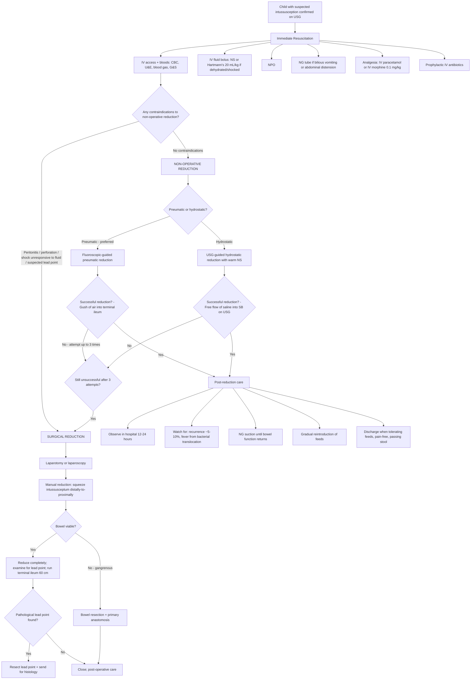

## Management of Intussusception in Children

### Overview: Management Principles

The management of paediatric intussusception follows a clear logical sequence:

1. **Resuscitate and stabilise** — before anything else, correct dehydration and physiological derangement.
2. **Determine suitability for non-operative reduction** — check for contraindications.
3. **Attempt non-operative reduction** (***pneumatic or hydrostatic enema***) — this is the first-line treatment in the vast majority of children [3][7][10].
4. **Proceed to surgery** if non-operative reduction fails or is contraindicated [3][7][10].
5. **Post-reduction monitoring** — observe for recurrence and complications.
6. **Investigate for pathological lead point** — especially in recurrent, atypical, or older-child cases.

The beauty of paediatric intussusception management (compared to adults) is that **most cases can be treated non-operatively** with excellent success rates. In adults, intussusception almost always requires formal surgical resection because there is nearly always a pathological lead point (often malignant) [9].

---

### Management Algorithm

---

### Phase 1: Initial Resuscitation and Stabilisation

Before any reduction attempt, the child **must be adequately resuscitated**. This is because:
- Dehydrated, hypovolaemic children tolerate procedures poorly and are at higher risk of cardiovascular collapse.
- Electrolyte derangements (especially hypokalaemia from vomiting) predispose to cardiac arrhythmias under anaesthesia.
- The enema reduction procedure itself carries a small risk of perforation → the child must be in the best possible physiological state.

| Step | Detail | Rationale |
|---|---|---|
| **IV access** | Secure at least one reliable cannula (22G in infant; 20G in older child); send bloods | Need for fluid resuscitation and potential emergency surgery |
| ***NPO (nil per os)*** [10] | Nothing by mouth from the moment intussusception is suspected | Risk of aspiration during reduction procedure or if emergency surgery required; reduces further bowel distension |
| **IV fluid resuscitation** | ***NS or Hartmann's solution; bolus 20 mL/kg if clinically dehydrated or shocked, reassess, repeat if needed*** [10] | Replace intravascular volume lost through vomiting, third-spacing into oedematous bowel wall, and poor intake. Use isotonic crystalloids — not dextrose-only solutions, as these do not expand intravascular volume effectively |
| ***NG tube decompression*** [10] | Insert NG tube (8Fr in infants, 10–12Fr in older children); place on free drainage with 4-hourly aspiration | ***Decompress proximal bowel*** → reduces distension, decreases risk of aspiration during induction of anaesthesia, reduces intraluminal pressure that may worsen ischaemia [10] |
| **Analgesia** | IV paracetamol (15 mg/kg) as first-line; IV morphine (0.1 mg/kg) or intranasal fentanyl for severe pain | Children in severe pain from colicky intussusception need adequate analgesia. Paracetamol alone is often insufficient for visceral colic; opioids may be required. In paediatrics, always use weight-based dosing |
| ***Prophylactic IV antibiotics*** [7][10] | Broad-spectrum cover (e.g., IV co-amoxiclav 30 mg/kg or IV cefuroxime + metronidazole) | ***Due to risk of perforation*** during reduction and because obstructed, ischaemic bowel undergoes **bacterial translocation** (bacteria crossing the compromised mucosal barrier into the bloodstream) [7] |
| **Correct electrolytes** | Check K⁺, Na⁺, Cl⁻, HCO₃⁻, glucose; replace as needed | ***HypoK and hypoCl from prolonged vomiting*** [8][9]; hypoglycaemia risk in fasting infants (low glycogen stores) |
| **Group & Save / Cross-match** | Type and screen blood | Must be available in case emergency surgery with potential bowel resection is required |
| **Urinary catheter** | Consider if shocked or heading to theatre | Monitor urine output (target > 1 mL/kg/hr in children) as a marker of end-organ perfusion |

<Callout title="'Drip and Suck' — The Universal IO Management Principle">
***"Drip and suck"*** is the standard supportive management for any intestinal obstruction [10]:
- **"Drip"** = IV fluids (replace losses, maintain hydration)
- **"Suck"** = NG tube decompression (decompress the proximal bowel)

This applies to intussusception as much as to any other cause of IO. Get these running immediately while organising definitive treatment.
</Callout>

---

### Phase 2: Non-Operative Reduction — First-Line Definitive Treatment

***Non-operative enema reduction is the preferred first treatment for paediatric intussusception with a high success rate (75–95%)*** [3][7].

There are two techniques: **pneumatic** (air) and **hydrostatic** (liquid). Both work on the same principle — applying retrograde pressure through the rectum to push the intussusceptum back out of the intussuscipiens, like un-telescoping a tube by blowing air or pushing fluid backward through it.

#### a. Pneumatic Reduction (Air Enema) — Generally Preferred [3][7]

| Aspect | Detail |
|---|---|
| **Principle** | Air is insufflated per rectum under controlled pressure → the air column exerts retrograde pressure on the intussusceptum → gradually pushes it proximally back through the ileocaecal valve |
| **Guidance** | ***Fluoroscopic guidance*** — allows real-time visualisation of the air column and the intussusception as it reduces [3] |
| **Technique** | ***Insert 18–22 Fr Foley catheter into rectum***, inflate the balloon to seal the anus, connect to a pressure-limited air insufflator. ***Maintain pressure at ~100–120 mmHg for ~3 minutes per attempt***. ***Observe for a gush of air into the terminal ileum*** which confirms successful reduction [3] |
| **Advantages over hydrostatic** | ***Pneumatic technique reduces intussusception more easily*** [7]; if perforation occurs, air is less harmful to the peritoneum than barium (barium peritonitis is catastrophic); faster procedure |
| **Success rate** | ***75–95%*** [3] |
| **Number of attempts** | Up to **2–3 attempts** are generally considered reasonable before declaring failure; some centres use a "delayed repeat attempt" strategy (wait 30–60 min and retry) |
| **Confirmation of complete reduction** | ***Gush of air into the terminal ileum*** on fluoroscopy [3]; relief of clinical symptoms; disappearance of the abdominal mass on palpation |

> ***"Successful reduction is indicated by appearance of water and bubbles in terminal ileum, free flow of contrast or air into terminal ileum, relief of symptoms, and disappearance of abdominal mass"*** [7].

#### b. Hydrostatic Reduction (Saline/Contrast Enema)

| Aspect | Detail |
|---|---|
| **Principle** | Warm normal saline (or occasionally dilute contrast) is instilled per rectum under gravity or controlled pressure → fluid column pushes intussusceptum back |
| **Guidance** | ***USG guidance*** — now increasingly the intervention of choice [7]; allows direct visualisation of the intussusception reducing in real-time without radiation |
| **Technique** | Foley catheter into rectum; saline reservoir at a height of ~100 cm above the patient (generates hydrostatic pressure ~75–80 mmHg); monitor with USG for disappearance of target sign and free flow of saline into terminal ileum |
| **Advantages** | No ionising radiation (can be performed entirely under USG); readily available |
| **Disadvantages** | Slightly lower success rate than pneumatic in some studies; if perforation occurs, saline spillage is less harmful than barium but more voluminous than air |

<Callout title="Pneumatic vs. Hydrostatic — Which to Choose?">
***Pneumatic technique using air or CO₂ reduces intussusception more easily and is more advantageous if perforation occurs*** [7]. However, ***USG-guided hydrostatic reduction with saline is now increasingly popular*** because it avoids all radiation exposure — particularly valuable in paediatrics.

In Hong Kong HA hospitals, both modalities are available. The choice often depends on local expertise and radiologist preference. At institutions with strong paediatric radiology USG capability (e.g. Queen Mary Hospital, Prince of Wales Hospital), USG-guided hydrostatic reduction is commonly performed. Where fluoroscopic facilities are more established, pneumatic reduction may be preferred [3].
</Callout>

#### c. Contraindications to Non-Operative Reduction

These are the situations where you **must NOT attempt enema reduction** and should proceed directly to surgery [3][7][10]:

| Contraindication | Rationale |
|---|---|
| ***Peritonitis (generalised abdominal tenderness, guarding, rigidity)*** [3] | Peritonitis implies bowel necrosis and/or perforation — applying enema pressure would worsen contamination and perforation |
| ***Perforation / pneumoperitoneum*** [3][7][10] | Confirmed bowel perforation on CXR/AXR (free gas under diaphragm) — further insufflation would cause tension pneumoperitoneum and cardiovascular collapse |
| **Haemodynamic instability / shock unresponsive to resuscitation** | Child too physiologically compromised for a semi-elective procedure; requires emergency laparotomy |
| ***Suspected pathological lead point*** [3] | Non-operative reduction may transiently succeed but the lead point remains → high recurrence rate; the lead point needs surgical excision and histological diagnosis (especially to exclude lymphoma) |
| **Prolonged symptoms (> 48–72 hours) with evidence of bowel compromise** | Higher risk of gangrenous bowel; very low success rate of non-operative reduction |

#### d. Complications of Non-Operative Reduction

| Complication | Incidence | Detail |
|---|---|---|
| ***Bowel perforation*** | ***< 1%*** (pneumatic); ~0.5–2.5% overall | ***Risk factors: age < 6 months, long duration of symptoms, and higher pressure during reduction*** [7]. Pneumatic perforation → ***tension pneumoperitoneum*** (air under tension in the peritoneal cavity → can compress IVC → cardiovascular collapse); requires immediate needle decompression (14G needle in LUQ, midclavicular line) followed by emergency laparotomy [3] |
| ***Recurrence*** | ***~5–10%*** after successful non-operative reduction [3] | Most recurrences occur within 72 hours; the vast majority can be treated with repeat enema reduction. ≥ 3 recurrences → investigate for pathological lead point |
| **Incomplete reduction** | Variable | The intussusception reduces partially but a residual "nubbin" of oedematous ileum remains at the ICV → may re-intussuscept. Complete reduction (free air/fluid reflux into terminal ileum) must be confirmed |

---

### Phase 3: Surgical Management

***Surgical reduction is indicated when non-operative reduction fails, is contraindicated, or when a pathological lead point is suspected*** [3].

#### a. Indications for Surgery [3][7][10]

| Indication | Explanation |
|---|---|
| ***Failed pneumatic/hydrostatic reduction (after 2–3 attempts)*** [3] | The intussusception cannot be reduced by retrograde pressure alone — the bowel is too oedematous, the intussusception is too tightly impacted, or the bowel has become adherent |
| ***Peritonitis / signs of bowel necrosis*** [3] | Gangrenous bowel will not reduce safely and needs resection |
| ***Perforation*** | Requires emergency laparotomy for washout and repair/resection |
| ***Suspected pathological lead point*** [3] | Need direct visualisation, excision, and histological diagnosis |
| **Critically ill child** | ***Suspected intussusception who is critically ill*** [7] — too unstable for a prolonged enema attempt; better served by direct surgical intervention |
| **Recurrent intussusception (≥ 3 episodes)** | High likelihood of a pathological lead point driving recurrence; surgical exploration indicated to identify and resect it |

#### b. Surgical Technique

| Step | Detail | Rationale |
|---|---|---|
| **Approach** | **Laparotomy** (transverse RLQ incision in children) or **laparoscopy** (in experienced centres); laparotomy is more common in the emergency setting | Direct visualisation and access to the bowel |
| ***Manual reduction*** [7][10] | ***Achieved by gently compressing the most distal part of the intussusception towards its origin*** [10] — this means you **squeeze** the intussusceptum **out** of the intussuscipiens by applying gentle pressure on the **apex** of the mass, pushing it **backward/proximally**. **Never pull on the intussusceptum** — this risks serosal tearing and perforation | The bowel wall is oedematous and fragile; gentle sustained retrograde pressure is the safest approach |
| ***Assessment of bowel viability*** [10] | After reduction, inspect the bowel for viability: **colour** (pink = viable, dark/black = necrotic), **peristalsis** (present = viable), **mesenteric pulsation** (palpable = viable), **surface** (shiny = viable, dull/lusterless = necrotic) | Necrotic bowel must be resected — leaving it in situ leads to perforation and peritonitis |
| ***Bowel resection + primary anastomosis*** | If bowel is gangrenous / non-viable: resect the affected segment and perform end-to-end or end-to-side anastomosis. In children, **primary anastomosis is generally preferred** over stoma formation (healthy peritoneum, good healing capacity) | Remove the source of necrosis and restore bowel continuity |
| ***Examine for pathological lead point*** | ***Run the terminal ileum for ~60 cm*** from the ileocaecal valve [4]; inspect the Meckel's diverticulum, polyps, lymphoma, or other masses | Any lead point found must be excised and sent for histological examination |
| **Appendicectomy** | Some surgeons perform an incidental appendicectomy if the approach is through a RLQ incision | Avoids future diagnostic confusion (the incision scar may mimic appendicectomy history) |

<Callout title="Surgical Rule: Squeeze, Don't Pull!" type="error">
During manual operative reduction, **always push the intussusceptum retrograde from its distal apex**. Never grab and pull the proximal bowel — this tears the serosal surface and can cause full-thickness perforation. Think of it like pushing a sock back out of a sleeve: you push from the end that went in last (the most distal point), not pull from the open end.
</Callout>

#### c. Outcomes of Surgical Treatment

| Outcome | Detail |
|---|---|
| **Mortality** | < 1% in developed settings with timely intervention; rises significantly (up to 10–30%) if gangrenous/strangulated bowel [9] |
| **Morbidity** | Wound infection (~3–5%), anastomotic leak (rare in children), adhesive SBO in future (long-term risk of any laparotomy), short bowel syndrome (only if extensive resection required — very rare) |
| **Recurrence after surgical reduction** | ~1–4% (lower than non-operative reduction, ~5–10%) |

---

### Phase 4: Post-Reduction / Post-Operative Care

Regardless of whether reduction was non-operative or surgical, the child requires a period of close observation [7]:

| Component | Detail | Rationale |
|---|---|---|
| ***Hospital observation for 12–24 hours (post non-operative reduction)*** [7] | Monitor vitals, abdominal examination, and stool output frequently | Watch for recurrence (most common in first 72 hours) and complications |
| ***NG suction maintained until bowel function returns*** [7] | Continue NG decompression until passage of flatus or stool | Bowel function may take hours to normalise; premature feeding risks vomiting and aspiration |
| **IV fluids** | Continue maintenance IV fluids (e.g. 0.9% NaCl + 5% dextrose with 10–20 mmol/L KCl, at maintenance rate using Holliday-Segar formula) | Maintain hydration until oral intake re-established |
| **Gradual reintroduction of feeds** | Start with clear fluids once NG output decreases and bowel sounds return; advance to milk/formula/age-appropriate diet as tolerated | Ensure bowel function has recovered before challenging the gut |
| ***Fever post-reduction*** [7] | ***Patient usually presents with fever after successful reduction due to bacterial translocation or release of endotoxin or cytokines*** [7] | This is **expected** and does not necessarily indicate a complication. However, persistent or high fever should prompt re-evaluation (sepsis workup, repeat imaging) |
| **Watch for recurrence** | ***~5–10% recurrence rate after non-operative reduction*** [3]; most occur within 72 hours; child and family should be counselled to return immediately if symptoms recur | Most recurrences can be treated with repeat enema reduction. ≥ 3 recurrences → surgical exploration for lead point |
| **Discharge criteria** | Tolerating full oral feeds, pain-free, afebrile, passing normal stools, parents counselled on recurrence signs | Safe discharge only when clinical recovery is confirmed |

---

### Phase 5: Special Scenarios

#### a. Recurrent Intussusception

- **First recurrence:** Repeat non-operative enema reduction is appropriate (success rate similar to first attempt).
- **Second recurrence:** Consider repeat enema but discuss with paediatric surgery.
- ***Third or more recurrences:*** Strongly consider **surgical exploration** to identify and resect a pathological lead point. Investigations before surgery may include CT abdomen with contrast to characterise the lead point.

#### b. Ileo-Ileal Intussusception (Small Bowel Type)

- More common in **HSP, post-operative, neonates**, and older children with lead points [2].
- ***Less likely to respond to non-operative reduction*** (because the enema pressure is applied through the rectum and cannot easily reach a small bowel intussusception proximal to the ICV) [2].
- ***More likely to resolve spontaneously*** (the intussusception may self-reduce as peristalsis normalises) [2].
- Management: observation initially; surgical reduction if symptoms persist or worsen.

#### c. Intussusception in Older Children (> 6 years)

- **High index of suspicion for pathological lead point** — especially ***lymphoma (Burkitt)*** [2][3].
- Even if non-operative reduction succeeds, consider **further imaging** (CT/MRI) to identify the lead point.
- **Surgical exploration** may be warranted even if reduction is successful, to biopsy/excise the lead point.

#### d. Intussusception in HSP

- Usually **ileo-ileal**; caused by submucosal haemorrhage and oedema.
- Non-operative reduction less effective for ileo-ileal type.
- Treatment of the underlying HSP (supportive ± steroids for severe abdominal pain) may allow spontaneous resolution.
- Surgical reduction if persistent or complicated.

---

### Family-Centred Communication

| Stage | What to Communicate |
|---|---|
| **At diagnosis** | "Part of your child's bowel has folded inside itself, like a telescope. This is blocking the bowel and affecting its blood supply. We need to fix this urgently." |
| **Before enema reduction** | "We will gently inflate the bowel with air (or fill it with fluid) through the bottom to push the folded part back into place. This works in about 8 or 9 out of 10 children. There is a very small risk (less than 1 in 100) that the bowel could tear, and if that happens, we would need to proceed to surgery immediately." |
| **If surgery needed** | "The non-operative treatment was not successful / is not safe in your child's case. We need to do an operation to unfold the bowel. If any part of the bowel is damaged, we may need to remove that section. The surgeon will also look carefully for any underlying cause." |
| **At discharge** | "Your child has recovered well. However, there is about a 1 in 10 chance that this could happen again, usually within the next few days. If you notice severe crying, drawing up of legs, vomiting, or blood in the nappy, please bring your child back to the Emergency Department immediately." |

---

<Callout title="High Yield Summary — Management of Intussusception">

1. ***Resuscitate first:*** NPO, IV fluids (NS/Hartmann's 20 mL/kg bolus), NG decompression ("drip and suck"), analgesia, prophylactic IV antibiotics, correct electrolytes [7][10].
2. ***Non-operative reduction is first-line:*** Pneumatic (air, fluoroscopic-guided) or hydrostatic (saline, USG-guided); ***75–95% success rate*** [3].
3. ***Pneumatic reduction technique:*** 18–22 Fr Foley catheter, maintain pressure ~100–120 mmHg for ~3 min per attempt, confirm success by ***gush of air into terminal ileum*** [3].
4. ***Contraindications to enema reduction:*** Peritonitis, perforation, shock, suspected pathological lead point [3].
5. ***Complications of enema reduction:*** Bowel perforation (< 1%), ***tension pneumoperitoneum*** (if pneumatic perforation), ***recurrence (~5–10%)*** [3][7].
6. ***Surgical reduction indicated if:*** Failed enema, peritonitis/necrosis, perforation, suspected lead point, critically ill child [3][7].
7. ***Surgical technique:*** Manual reduction by gentle retrograde compression (squeeze distally, do not pull); assess viability; resect if gangrenous; examine for lead point (run ileum 60 cm) [7][10].
8. ***Post-reduction:*** Observe 12–24 hours; NG suction until bowel function returns; expect transient fever (bacterial translocation); watch for recurrence within 72 hours [7].
9. ***Recurrence ≥ 3 times → surgical exploration for pathological lead point.***

</Callout>

---

<ActiveRecallQuiz
  title="Active Recall - Management of Intussusception"
  items={[
    {
      question: "Describe the technique for fluoroscopic-guided pneumatic reduction of intussusception. What catheter size, pressure, and endpoint confirm success?",
      markscheme: "Insert 18-22 Fr Foley catheter per rectum, inflate balloon to seal anus. Maintain air pressure at 100-120 mmHg for approximately 3 minutes per attempt, up to 2-3 attempts. Success confirmed by a gush of air into the terminal ileum on fluoroscopy, relief of symptoms, and disappearance of abdominal mass."
    },
    {
      question: "List four contraindications to non-operative enema reduction of intussusception.",
      markscheme: "1. Peritonitis (generalised tenderness, guarding, rigidity). 2. Perforation/pneumoperitoneum. 3. Haemodynamic instability/shock unresponsive to resuscitation. 4. Suspected pathological lead point. (Also accept: prolonged symptoms > 48-72h with signs of bowel compromise.)"
    },
    {
      question: "During surgical manual reduction of intussusception, should you push or pull the intussusceptum? Explain why.",
      markscheme: "Push (squeeze), never pull. Gently compress the most distal part of the intussusception, pushing the intussusceptum retrogradely towards its origin. Pulling on the proximal bowel risks tearing the serosal surface of the oedematous, fragile intussusceptum, causing perforation."
    },
    {
      question: "Why do children commonly develop a fever after successful non-operative reduction of intussusception?",
      markscheme: "Due to bacterial translocation or release of endotoxins and cytokines from the previously ischaemic, congested bowel wall. The compromised mucosal barrier allows bacteria to cross into the bloodstream. This is an expected post-reduction phenomenon and does not necessarily indicate a complication, though persistent high fever warrants re-evaluation."
    },
    {
      question: "A 7-year-old child has a successful pneumatic reduction of intussusception but presents with a third recurrence two weeks later. What is the most likely underlying problem and what should you do?",
      markscheme: "Most likely a pathological lead point (given age > 6 years and recurrent intussusception). Burkitt lymphoma, Meckel's diverticulum, polyp, or duplication cyst should be suspected. Management: further imaging (CT abdomen with contrast) to characterise lead point, followed by surgical exploration for identification, excision, and histological diagnosis."
    },
    {
      question: "Compare pneumatic vs. hydrostatic reduction: give one advantage of each technique.",
      markscheme: "Pneumatic advantage: reduces intussusception more easily (higher success rate in some studies); if perforation occurs, air is less harmful than barium to the peritoneum. Hydrostatic advantage: can be performed under USG guidance with no ionising radiation, which is particularly valuable in paediatrics."
    }
  ]}
/>

## References

[2] Senior notes: felixlai.md (Intussusception — Overview, Etiology)
[3] Senior notes: maxim.md (Intussusception section)
[4] Senior notes: Adrian Lui Pediatrics.pdf (p248–250, Intussusception, Meckel's diverticulum)
[7] Senior notes: felixlai.md (Intussusception — Treatment section)
[8] Senior notes: Ryan Ho Fundamentals.pdf (p279, Investigations for acute abdomen)
[9] Senior notes: Ryan Ho GI.pdf (p134, Intussusception; p138–139, IO management)
[10] Senior notes: felixlai.md (IO — Supportive management, Surgical treatment sections)
