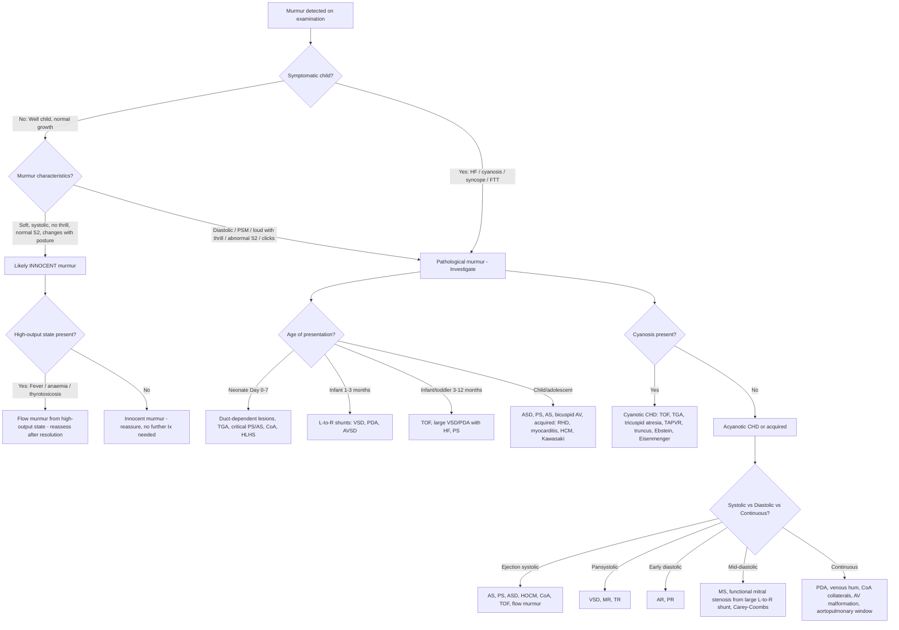

## Differential Diagnosis of Murmur Detected on Examination in Paediatrics

### Conceptual Framework — How to Think About the Differential

When you hear a murmur in a child, the fundamental question is: **Is this an innocent murmur in a normal heart, or does it represent structural/acquired heart disease?** The differential diagnosis is then driven by a systematic analysis of:

1. **The murmur characteristics** (timing, location, grade, radiation, dynamic changes)
2. **The clinical context** (age of presentation, symptoms, associated signs)
3. **The haemodynamic category** (volume overload, pressure overload, regurgitation, mixing/shunting)

Think of murmurs as the *audible signature* of turbulent blood flow. The differential is really the differential of **what is causing that turbulence** — and the answer is almost always one of: increased flow across a normal structure, flow across an abnormal structure, or regurgitant/shunt flow through an abnormal communication.

---

### Organising the Differential — Master Algorithm

---

### Detailed Differential Diagnosis — Organised by Murmur Type

#### A. Systolic Murmurs

Systolic murmurs are by far the commonest murmurs heard in children. The key distinction is between **ejection systolic murmurs (ESM)** and **pansystolic murmurs (PSM)**.

##### i. Ejection Systolic Murmur (ESM) — Crescendo-Decrescendo ("Diamond-Shaped")

An ESM occurs because blood is being ejected through a narrowed or high-flow outflow tract. The crescendo-decrescendo shape reflects the acceleration and deceleration of blood during ventricular ejection [8].

| Condition | Location | Key Differentiating Features | Pathophysiology |
|---|---|---|---|
| ***Still's murmur*** (innocent) | LLSB / apex | Vibratory/musical quality, grade 1–3, **↓ with standing**, asymptomatic well child aged 2–7y | Vibration of normal cardiac structures (possibly false chordae tendineae) — thin chest wall transmits normal turbulence [1][3] |
| ***Pulmonary flow murmur*** (innocent) | LUSB | Soft, blowing, short, in adolescents; normal S2 | Normal turbulence across pulmonary valve in high-flow state or thin chest |
| ***Peripheral pulmonary stenosis*** (innocent) | LUSB → axillae/back | Neonates < 6 months; radiates widely to back and axillae; resolves spontaneously | Relative stenosis at PA branch point (PAs are small relative to MPA in neonates); resolves as PAs grow [1] |
| ***Valvular pulmonary stenosis (PS)*** | LUSB | ***Ejection click*** (valvular), thrill if moderate-severe, ***widely split S2 with soft P2***, parasternal heave | RV outflow obstruction → turbulent ejection through stenotic PV. Click = halting of stiff valve leaflets at maximal opening [1][2] |
| ***Valvular aortic stenosis (AS)*** | RUSB | ***Harsh ESM radiating to neck***, ***ejection click*** (bicuspid AV), ***slow-rising pulse***, ***soft/absent A2***, ***systolic thrill in aortic area*** | LV outflow obstruction → turbulent ejection through stenotic AV [5] |
| ***Subvalvular AS (subaortic membrane)*** | RUSB/LLSB | NO ejection click (obstruction is below valve), may have AR from jet damage to aortic cusps | Discrete fibrous membrane below AV → fixed obstruction |
| ***Supravalvular AS*** | RUSB | ***Associated with Williams syndrome*** (elfin facies, hypercalcaemia, developmental delay), BP differential between arms (R > L), no click | Narrowing above sinotubular junction → turbulent flow in ascending aorta |
| ***Atrial septal defect (ASD)*** | LUSB | ***Fixed widely split S2*** (pathognomonic), parasternal heave, often asymptomatic in childhood | ↑Flow across normal PV (relative PS) due to L-to-R shunt at atrial level → ESM. NOT from the shunt itself (pressure gradient too low) [1][2] |
| ***Coarctation of aorta (CoA)*** | LUSB → left interscapular back | ***Weak LL pulses / radiofemoral delay***, ***UL hypertension***, BP gradient UL > LL ≥ 20 mmHg | Turbulent flow through discrete aortic narrowing at ductal insertion [3][6] |
| ***Tetralogy of Fallot (TOF)*** | LUSB | ***Cyanosis***, ***single S2***, ***murmur softens during Tet spell*** (paradox), RV heave, clubbing in older children | RVOTO → turbulent ejection. Murmur is from RVOT obstruction, NOT the VSD (which is non-restrictive, equalised pressure → no gradient) [1][2] |
| ***Hypertrophic cardiomyopathy (HOCM)*** | LLSB | ***Jerky pulse***, ***↑ with Valsalva/standing*** (unique — ↓preload worsens LVOTO), family history of sudden death, may be associated with ***Noonan syndrome*** | Dynamic LVOT obstruction from asymmetric septal hypertrophy + SAM of MV [8] |
| ***Flow murmur from high-output state*** | LUSB or any area | Resolves after correcting underlying cause (fever, anaemia, thyrotoxicosis); no structural abnormality | ↑CO → ↑flow velocity across normal valves → turbulence [3] |

<Callout title="How to Differentiate Innocent ESM from Pathological ESM">
- ***Innocent***: soft (≤ 3/6), vibratory quality, no thrill, no click, normal S2 splitting, changes with posture/fever, asymptomatic child with normal growth
- ***Pathological***: any grade with thrill (≥ 4/6), associated click, abnormal S2 (fixed split, loud P2, single, soft A2/P2), associated symptoms, abnormal pulses, precordial hyperactivity, radiation to neck/back
</Callout>

##### ii. Pansystolic Murmur (PSM) — Uniform Intensity Throughout Systole

A PSM occurs when there is a continuous pressure gradient between two chambers **throughout the entire duration of systole**. This is always pathological in children [8].

| Condition | Location | Key Differentiating Features | Pathophysiology |
|---|---|---|---|
| ***VSD*** | ***LLSB*** (perimembranous/muscular), ***LUSB*** (subarterial) | Thrill common in small restrictive VSD (high-velocity jet), ± MDM at apex + ESM at LUSB if large (functional MS + ↑PV flow), HF symptoms at 1–2 months | Continuous pressure gradient LV → RV throughout systole → high-velocity jet through defect → PSM [3][4] |
| ***Mitral regurgitation (MR)*** | ***Apex → axilla*** | Displaced thrusting apex (LV volume overload), may be due to rheumatic disease, cleft MV (primum ASD/AVSD), MV prolapse | Systolic backflow LA ← LV through incompetent MV; pressure gradient LV > LA persists throughout systole [7][8] |
| ***Tricuspid regurgitation (TR)*** | ***LLSB*** | ***↑ with inspiration*** (right-sided murmur → ↑venous return → ↑regurgitant volume), ↑JVP with CV waves, pulsatile liver | Systolic backflow RA ← RV through incompetent TV; often secondary to RV dilatation from pulmonary hypertension |

> **How to distinguish VSD from TR at LLSB**: Both produce a PSM at LLSB. TR increases with inspiration (Carvallo's sign), while VSD does not. TR is associated with raised JVP with prominent V waves, whereas VSD is associated with LV volume overload signs (displaced apex) and a thrill.

##### iii. Late Systolic Murmur

| Condition | Location | Key Features | Pathophysiology |
|---|---|---|---|
| ***Mitral valve prolapse (MVP)*** | Apex | ***Mid-systolic click*** followed by late systolic murmur; click moves earlier with standing (↓preload → earlier prolapse); associated with Marfan syndrome, Ehlers-Danlos, connective tissue diseases [9] | Redundant/myxomatous MV leaflet(s) prolapse into LA during mid-late systole → click as chordae tense, followed by MR |

#### B. Diastolic Murmurs

***A diastolic murmur in a child is NEVER innocent and always requires investigation.*** [1] This bears repeating because it is a critical exam and clinical point.

##### i. Early Diastolic Murmur (EDM) — High-Pitched, Decrescendo

Occurs during isovolumetric relaxation and early filling. The high pitch reflects the high-velocity, high-pressure regurgitant jet [8].

| Condition | Location | Key Features | Pathophysiology |
|---|---|---|---|
| ***Aortic regurgitation (AR)*** | ***Left sternal border*** (3rd–4th LICS) | ***Best heard leaning forward at end-expiration***; wide pulse pressure, bounding pulses, displaced thrusting apex; in children — rheumatic, bicuspid AV, subarterial VSD with cusp prolapse, post-balloon valvuloplasty, Marfan syndrome | Incompetent AV → diastolic backflow aorta → LV; pressure gradient ↓ as LV fills → decrescendo [5][8] |
| ***Pulmonary regurgitation (PR)*** (Graham Steell murmur) | ***LUSB*** | ***↑ with inspiration*** (right-sided); usually secondary to pulmonary hypertension (dilated PA ring); low-pitched if not associated with pHTN | Incompetent PV → diastolic backflow PA → RV [8] |

##### ii. Mid-Diastolic Murmur (MDM) — Low-Pitched Rumble

Occurs during ventricular filling phase. Low pitch because flow velocity is lower [8].

| Condition | Location | Key Features | Pathophysiology |
|---|---|---|---|
| ***Mitral stenosis (MS)*** (rheumatic) | ***Apex, left lateral decubitus*** | ***Opening snap*** after S2, ***loud S1*** (if valve still pliable), ***low-pitched rumble with pre-systolic accentuation*** (if sinus rhythm — atrial contraction pushes blood through stenotic valve); rare in children unless longstanding rheumatic disease | Narrowed MV orifice → turbulent diastolic flow LA → LV [7][8] |
| ***Functional mitral stenosis*** (relative MS from ↑flow) | Apex | In context of ***large L-to-R shunt*** (VSD, PDA, AVSD) → MDM at apex; no opening snap | ↑Pulmonary venous return → ↑volume crossing normal MV → turbulence [3][4] |
| ***Carey-Coombs murmur*** | Apex | ***Mid-diastolic low-pitched murmur in acute rheumatic fever***; transient, disappears as inflammation resolves | ***Mitral valvulitis*** → thickened MV leaflets → turbulent diastolic flow across inflamed valve [3][7] |
| ***Tricuspid stenosis*** | LLSB | Extremely rare in paediatrics; ↑ with inspiration | Narrowed TV orifice → turbulent diastolic flow RA → RV |
| ***Austin Flint murmur*** | Apex | Low-pitched MDM mimicking MS but ***without opening snap***; found in severe AR | Severe AR jet impinges on anterior MV leaflet → functional MS → turbulent atrial outflow [5][8] |

#### C. Continuous Murmurs

A continuous murmur persists through both systole and diastole without a pause. This requires a pressure gradient that exists across the **entire cardiac cycle** [8].

| Condition | Location | Key Features | Pathophysiology |
|---|---|---|---|
| ***Patent ductus arteriosus (PDA)*** | ***Left infraclavicular / LUSB*** | ***"Machinery" murmur***, loudest near S2, bounding pulses, wide pulse pressure, common in preterms; ***diastolic component may disappear*** if PA pressures rise (equalising pressures) [3] | Aortic pressure > PA pressure in both systole and diastole → continuous shunt through ductus [1][2] |
| ***Venous hum*** (innocent) | ***Right supraclavicular*** | ***Disappears with ipsilateral jugular compression or turning head***; louder in diastole, louder sitting up; typically age 3–6y | Turbulence in jugular veins draining into brachiocephalic vein; compression or positional change eliminates turbulence [1] |
| ***Collateral vessels in CoA*** | Diffuse, over chest/back | Soft continuous murmur in older children with well-developed collaterals; associated with weak LL pulses, UL HTN | Blood flowing through dilated intercostal and internal mammary arteries bypassing coarctation [3][6] |
| ***Aortopulmonary window*** | LUSB/RUSB | Rare; presents like large PDA with HF symptoms | Direct communication between ascending aorta and MPA → continuous shunt |
| ***Coronary AV fistula*** | Variable, often LLSB | Rare; continuous murmur with diastolic accentuation | Abnormal communication between coronary artery and cardiac chamber → continuous flow |
| ***Surgical shunts*** (e.g., Blalock-Taussig) | Varies with site | Post-surgical; known cardiac history | Surgically created systemic-to-pulmonary connection for palliation of cyanotic CHD |

<Callout title="PDA vs Venous Hum — How to Tell Them Apart" type="idea">
Both are continuous murmurs, but:
- **PDA**: left infraclavicular, bounding pulses, wide pulse pressure, may have heart failure signs; does NOT disappear with jugular compression
- **Venous hum**: right supraclavicular, ***disappears with jugular compression or head turning***, no cardiovascular signs, well child

This is a common exam question!
</Callout>

---

### Differential by Age — Putting It All Together

***The age at which a murmur presents is one of the most powerful differentiating factors in paediatrics*** [1][2][3]:

| Age Group | Most Likely Diagnoses | Why at This Age? |
|---|---|---|
| ***Day 0–3 (neonate)*** | Critical/duct-dependent: CoA, critical PS, critical AS, HLHS, pulmonary atresia, TGA | PDA closing → loss of duct-dependent circulation → shock/cyanosis. TGA → cyanosis from parallel circulations. ***Note that CoA or interruption of aorta is only associated with soft and non-specific murmurs → look hard for soft/absent femoral pulses*** [3] |
| ***Day 1–7*** | Transitional murmurs (benign), PPS (innocent) | Transient TR from elevated RV pressures; PDA still closing — soft murmurs are normal transitionally |
| ***1–3 months*** | VSD, large PDA, AVSD | PVR falls → ↑L-to-R shunting → murmur becomes audible + HF symptoms. ***HF in an infant implies L-to-R shunt with ↓postnatal pulmonary vascular resistance at 2–3 months*** [3] |
| ***3–12 months*** | TOF (progressive cyanosis), large VSD/PDA with failure to thrive | Infundibular hypertrophy progresses (TOF); chronic volume overload causes FTT |
| ***2–7 years*** | ***Still's murmur*** (most common innocent), PS, small VSD (well child with murmur) | Thin chest wall; routine check-ups detect incidental murmurs |
| ***5–15 years*** | Rheumatic heart disease (new MR/AR murmur), ASD (often asymptomatic until now), bicuspid AV (AS), HOCM | Post-streptococcal immune response 2–3 weeks after pharyngitis; ASD has slow haemodynamic impact; HOCM may present with syncope/sudden death during sport |
| ***Adolescence*** | MVP, HOCM, pulmonary flow murmur (innocent), bicuspid AV | MVP more apparent with growth; HOCM may be unmasked by athletic screening |

---

### Differential by Associated Syndromes [9]

***Syndromic features detected on general inspection can immediately narrow the differential***:

| Syndrome | Genetic Basis | Associated Cardiac Lesion / Murmur |
|---|---|---|
| ***Down syndrome (Trisomy 21)*** | Trisomy 21 | ***AVSD*** (most common — ~40% have CHD), VSD, ASD, PDA, TOF |
| ***Turner syndrome (45,X)*** | Monosomy X | ***CoA*** (ESM at LUSB → back), ***bicuspid aortic valve*** (ESM at RUSB → neck) |
| ***Noonan syndrome*** | *PTPN11*, *RAF1* etc. (RAS-MAPK pathway) | ***Valvular pulmonary stenosis*** (ESM at LUSB + click), ***HCM*** |
| ***Williams syndrome*** | 7q11.23 microdeletion (elastin gene) | ***Supravalvular aortic stenosis*** (ESM at RUSB, no click), peripheral PS |
| ***22q11.2 deletion (DiGeorge)*** | 22q11.2 microdeletion | Conotruncal anomalies: ***TOF***, interrupted aortic arch, truncus arteriosus, VSD |
| ***Marfan syndrome*** | *FBN1* mutation (fibrillin-1) | ***MVP*** (mid-systolic click + late systolic murmur), ***AR*** (EDM at LSB), aortic root dilatation. ***Revised Ghent criteria*** for diagnosis include aortic root Z-score ≥ 2, ectopia lentis, and systemic score ≥ 7 [9] |
| ***Holt-Oram syndrome*** | *TBX5* | ASD, VSD; ***absent/hypoplastic thumb*** [3] |
| ***Ellis-van Creveld*** | *EVC/EVC2* | ***Common atrium / primum ASD***; polydactyly, short limbs |
| ***Alagille syndrome*** | *JAG1* (Notch pathway) | ***Peripheral pulmonary stenosis*** → ESM radiating to back; intrahepatic bile duct paucity, butterfly vertebrae |
| ***CHARGE*** | *CHD7* | Conotruncal anomalies, AV canal defects |
| ***Foetal alcohol syndrome*** | Maternal alcohol exposure | VSD, ASD, TOF |

---

### Non-Cardiac Causes to Consider in the Differential

Not every murmur means heart disease. Important non-cardiac mimics and exacerbators include:

| Condition | Mechanism | How to Distinguish |
|---|---|---|
| ***Anaemia*** | ↓Blood viscosity + ↑CO → flow murmur (ESM at LUSB) | Pallor, tachycardia, low Hb; murmur resolves after transfusion/iron therapy |
| ***Fever / sepsis*** | ↑CO → flow murmur | Murmur resolves when fever subsides — ***reassess after febrile illness resolves*** [3] |
| ***Thyrotoxicosis*** | ↑CO + hyperdynamic circulation → flow murmur, thyroid bruit | Tremor, weight loss, exophthalmos (rare in children), elevated free T4 |
| ***Arteriovenous malformation*** | Continuous shunt → steal phenomenon, ↑CO | Bruit over AVM site; may cause high-output cardiac failure in large AVMs (e.g., vein of Galen malformation in neonates) |

<Callout title="Key Point for Clinical Practice" type="error">
***Innocent murmurs are often heard during febrile illness or anaemia due to ↑CO, hence examine after correcting these illnesses*** [3]. Do NOT label a murmur as innocent during a high-output state — reassess when the child is well.
</Callout>

---

### Special Differential: The Collapsed Neonate with Murmur (or WITHOUT Murmur)

This is a **critical scenario** frequently tested in exams. A neonate presenting in the first week of life with shock, poor perfusion, metabolic acidosis ± a murmur:

| Diagnosis | Murmur | Key Clue |
|---|---|---|
| ***Severe CoA*** | ***Soft/absent murmur*** (may be inaudible) | ***Weak/absent femoral pulses*** — the ONLY reliable sign before ductus closes; ***RV impulse*** as systemic circulation supported by RV via PDA [3] |
| ***Interrupted aortic arch*** | Soft/absent | Similar to CoA; associated with 22q11.2 deletion |
| ***Critical AS*** | Soft ESM at RUSB | Poor peripheral perfusion, LV failure, acidosis |
| ***HLHS*** | Non-specific / absent | Cyanosis + shock; single S2; duct-dependent systemic circulation |
| ***Critical PS / Pulmonary atresia*** | Absent or continuous (PDA) | Cyanosis, duct-dependent pulmonary circulation; RV heave |
| ***TGA (intact septum)*** | ***Usually NO significant murmur*** | ***Severe cyanosis*** unresponsive to O₂ (failed hyperoxia test), relatively well-perfused; needs urgent balloon atrial septostomy |

> ***The absence of a murmur does NOT exclude serious cardiac disease in a neonate.*** Many critical duct-dependent lesions present with shock or cyanosis **without** a murmur. ***Pulse oximetry screening*** and ***palpation of femoral pulses*** are more reliable screening tools than auscultation alone [1][3].

---

### Acquired Causes — Differential of a NEW Murmur in a Previously Well Child

| Diagnosis | Murmur Type | Key Clinical Context |
|---|---|---|
| ***Acute rheumatic fever*** | New ***MR*** (PSM apex → axilla) ± ***AR*** (EDM at LSB) ± ***Carey-Coombs MDM*** at apex | ***Preceded by sore throat 2–3 weeks before***; fever, migratory polyarthritis of large joints, erythema marginatum, subcutaneous nodules, chorea. Diagnosis by ***Jones criteria*** [3][7] |
| ***Infective endocarditis*** | New or ***changing*** murmur | ***Persistent fever*** in child with known CHD or abnormal valve; splinter haemorrhages, Osler nodes, Janeway lesions; ***VSD carries risk regardless of size*** [3][10] |
| ***Myocarditis*** | Gallop rhythm ± functional MR/TR | Viral prodrome → acute HF (tachycardia, poor perfusion, hepatomegaly); may have pericardial rub if myopericarditis |
| ***Kawasaki disease*** | MR murmur (from myocarditis or papillary dysfunction) | Prolonged fever ≥ 5 days + at least 4/5 clinical criteria (bilateral conjunctivitis, oral changes, rash, extremity changes, cervical LAD); coronary artery aneurysms on echo |
| ***Dilated cardiomyopathy*** | Functional MR/TR, S3 gallop | Unexplained heart failure with displaced apex; may be post-viral, familial, metabolic, or idiopathic [8] |

---

### Summary Table — Differential Diagnosis by Murmur Location

| Location | Systolic | Diastolic | Continuous |
|---|---|---|---|
| ***RUSB*** | AS (valvular, subvalvular, supravalvular) | — | — |
| ***LUSB*** | PS, ASD (relative PS), TOF (RVOTO), CoA, flow murmur | PR (Graham Steell), AR (if aortic root dilated) | PDA |
| ***LLSB*** | VSD (perimembranous/muscular), TR, HOCM | — | — |
| ***Apex*** | MR, Still's murmur, HOCM (apex variant) | MS, functional MS, Carey-Coombs, Austin Flint | — |
| ***Left infraclavicular*** | — | — | PDA |
| ***Right supraclavicular*** | Brachiocephalic flow murmur | — | Venous hum (innocent) |
| ***Left interscapular (back)*** | CoA | — | CoA collaterals |
| ***Axillae/back bilaterally*** | Peripheral PS (neonatal, innocent), branch PA stenosis | — | — |

---

<Callout title="High Yield Summary — Differential Diagnosis">

1. **Most murmurs in children are innocent** — use the 7 S's and red flags to differentiate.
2. ***A diastolic murmur is NEVER innocent. A pansystolic murmur is NEVER innocent.***
3. **Age is the most powerful differentiator**: neonatal collapse → duct-dependent lesion; 1–3 months HF → L-to-R shunt (VSD, PDA, AVSD); school-age → innocent or ASD; new murmur after pharyngitis → rheumatic.
4. **Absence of murmur does not exclude critical CHD** — TGA, CoA, HLHS may have no murmur. Always check ***femoral pulses*** and ***pulse oximetry***.
5. ***CoA and interrupted aortic arch produce only soft/non-specific murmurs*** — look for weak/absent femoral pulses.
6. **Syndromic features** narrow the differential instantly: Down → AVSD; Turner → CoA; Noonan → PS/HCM; Williams → supravalvular AS; 22q11.2 → TOF/conotruncal; Marfan → MVP/AR.
7. **Reassess murmurs after fever/anaemia resolve** — flow murmurs from high-output states are common and not pathological.
8. ***Fixed split S2 = ASD; single S2 = TOF/PA; loud P2 = pHTN; ejection click = valvular AS or PS.***
9. **New murmur + fever in known CHD → think infective endocarditis.**
10. **HOCM is the only murmur that INCREASES with Valsalva/standing** (↓preload → ↑dynamic LVOTO).

</Callout>

---

<ActiveRecallQuiz
  title="Active Recall - Differential Diagnosis of Murmur in Paediatrics"
  items={[
    {
      question: "A 5-year-old child has a grade 2/6 vibratory systolic murmur at the LLSB that decreases when standing. S2 is normal. The child is asymptomatic with normal growth. What is the most likely diagnosis and what are 3 features that make this innocent?",
      markscheme: "Still's murmur (most common innocent murmur). Innocent features: (1) soft grade 2/6, (2) vibratory/musical quality, (3) systolic timing only, (4) decreases with standing, (5) normal S2 splitting, (6) asymptomatic well child with normal growth. Any 3 of these accepted.",
    },
    {
      question: "List the differential diagnosis for a continuous murmur heard in a child, and state one manoeuvre to distinguish an innocent cause from a pathological one.",
      markscheme: "Differential: PDA, venous hum (innocent), CoA collaterals (in older children), aortopulmonary window, coronary AV fistula, surgical shunt (e.g. BT shunt). Manoeuvre: ipsilateral jugular vein compression or turning the head abolishes a venous hum but not a PDA or other pathological continuous murmur.",
    },
    {
      question: "A neonate presents on Day 2 with shock, metabolic acidosis, and absent femoral pulses. No significant murmur is heard. What is the most likely cardiac diagnosis, and why is the murmur absent or soft?",
      markscheme: "Severe coarctation of the aorta (duct-dependent systemic circulation). The murmur is soft/absent because the coarctation segment is short and blood preferentially flows through the still-patent ductus arteriosus, so there is little turbulent flow across the narrowing. Additionally, in the shocked state, cardiac output is low, reducing flow velocity and murmur intensity.",
    },
    {
      question: "Name the classic cardiac lesion associated with each of the following syndromes: (a) Down syndrome, (b) Turner syndrome, (c) Noonan syndrome, (d) Williams syndrome, (e) 22q11.2 deletion.",
      markscheme: "(a) Down: AVSD (also VSD, ASD). (b) Turner: CoA and bicuspid aortic valve. (c) Noonan: pulmonary stenosis and HCM. (d) Williams: supravalvular aortic stenosis and peripheral pulmonary stenosis. (e) 22q11.2: conotruncal anomalies — TOF, interrupted aortic arch, truncus arteriosus.",
    },
    {
      question: "A 10-year-old presents with fever, migratory polyarthritis of large joints, and a new pansystolic murmur at the apex radiating to the axilla, with a mid-diastolic murmur also at the apex. What is the diagnosis, what is the Carey-Coombs murmur, and what is the underlying pathophysiology?",
      markscheme: "Acute rheumatic fever with carditis. The Carey-Coombs murmur is the mid-diastolic murmur at the apex caused by mitral valvulitis — inflammation and thickening of the MV leaflets creates turbulent diastolic flow across the inflamed valve (functional MS). Pathophysiology: molecular mimicry — anti-M protein antibodies cross-react with cardiac proteins after GAS pharyngitis, causing pancarditis.",
    },
    {
      question: "Why does HOCM produce a murmur that INCREASES with Valsalva manoeuvre, whereas most other systolic murmurs decrease?",
      markscheme: "In HOCM, the dynamic LVOT obstruction is worsened by decreased preload. Valsalva reduces venous return, which decreases LV cavity size, bringing the hypertrophied septum and the anterior MV leaflet closer together, worsening the obstruction (SAM of MV) and increasing the murmur. Most other murmurs (e.g., AS, PS, VSD, flow murmurs) decrease because less blood volume is flowing across the lesion.",
    },
  ]}
/>

---

## References

[1] Lecture slides: GC 147. Heart failure and cyanosis in children acyanotic and cyanotic congenital heart disease - Part 1.pdf
[2] Lecture slides: GC 147. Heart failure and cyanosis in children acyanotic and cyanotic congenital heart disease - Part 2.pdf
[3] Senior notes: Adrian Lui Pediatrics.pdf (p185, p194, p201–202, p235, p239)
[4] Senior notes: Ryan Ho Cardiology.pdf (p190–193, VSD and CoA sections)
[5] Senior notes: Ryan Ho Cardiology.pdf (p158–160, AS and AR sections)
[6] Senior notes: Ryan Ho Cardiology.pdf (p190, CoA section)
[7] Senior notes: Ryan Ho Cardiology.pdf (p146–149, Rheumatic Heart Disease and IE sections)
[8] Senior notes: Ryan Ho Cardiology.pdf (p4, p20, p155, p169, CVS examination and murmur classification)
[9] Lecture slides: GC 151. The malformed child hereditary syndromes and anomalies.pdf (p40, Marfan / Ghent criteria)
[10] Senior notes: Adrian Lui Pediatrics.pdf (p239, Infective Endocarditis and Modified Duke Criteria)
