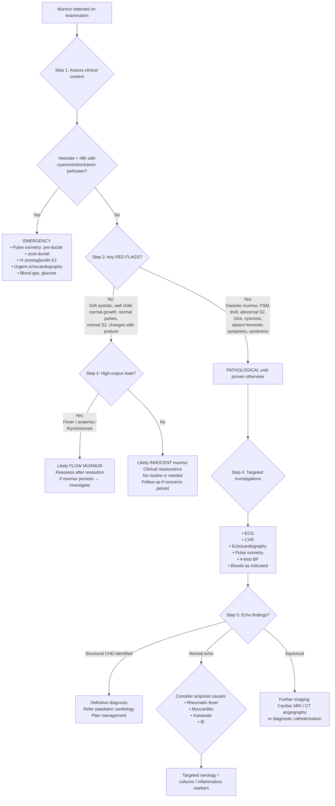

## Diagnostic Criteria, Algorithm, and Investigation Modalities for Murmur Detected on Examination in Paediatrics

### Conceptual Foundation — What Are We Trying to Achieve?

When a murmur is detected in a child, the diagnostic process has three sequential goals:

1. **Is this innocent or pathological?** — Can be determined clinically in many cases.
2. **If pathological, what is the structural/functional lesion?** — Requires targeted investigation.
3. **What is the haemodynamic severity?** — Guides urgency and management.

There is no single "diagnostic criterion" for a murmur the way there is for, say, rheumatic fever or infective endocarditis. Instead, the approach is a **clinical algorithm** that integrates history, examination, and investigations to arrive at the correct underlying diagnosis. For specific acquired conditions presenting with murmurs (e.g., rheumatic fever, infective endocarditis), validated diagnostic criteria exist and are discussed below.

---

### Clinical Criteria for Distinguishing Innocent from Pathological Murmurs

#### ***Features of Innocent Murmurs — "The 7 S's"*** [1][3]

This is the core clinical "diagnostic criterion" for labelling a murmur as innocent. ALL of the following must be present:

| Feature | Rationale |
|---|---|
| ***aSymptomatic*** | No heart failure, cyanosis, syncope, FTT, or exercise intolerance |
| ***Soft*** (grade ≤ 3/6, no thrill) | Low-velocity flow → low-amplitude turbulence |
| ***Systolic*** (or continuous venous hum — but ***never purely diastolic***) | Ejection-type turbulence during systole is physiological; diastolic turbulence always implies structural abnormality |
| ***Short*** duration | Does not span all of systole (cf PSM) |
| ***Single*** — normal S2 splitting | Abnormal S2 (fixed split, single, loud P2) implies pathology |
| ***Sitting/Standing*** → murmur diminishes | ↓Preload → ↓flow → ↓turbulence; HOCM is the exception (↑ with ↓preload) |
| ***Special tests*** normal (ECG, CXR, echo if performed) | Confirms absence of structural disease |

***Features of innoSent murmur: aSymptomatic, Soft blowing, Systolic, Lt Sternal edge*** [3]

<Callout title="Critical Rule">
***A purely diastolic murmur or a pansystolic murmur is NEVER innocent in a child.*** Any such finding mandates echocardiography. Similarly, a murmur with a thrill (≥ grade 4/6), abnormal S2, ejection click, or associated cardiovascular signs is always pathological. [1][3]
</Callout>

#### Red Flags — Clinical Features Mandating Investigation

The following features override any impression of "innocence" and require formal investigation:

| Red Flag | Why It Matters |
|---|---|
| ***Diastolic murmur*** | Always structural — AR, PR, MS, Carey-Coombs |
| ***Pansystolic murmur*** | VSD, MR, TR — always structural |
| ***Grade ≥ 4/6 with thrill*** | High-velocity jet = significant lesion |
| ***Abnormal S2*** (fixed split, single, loud P2) | ASD (fixed split), TOF/PA (single), pHTN (loud P2) |
| ***Ejection click*** | Valvular AS or PS (stiff valve snapping open) |
| ***Symptoms*** (HF, cyanosis, syncope, FTT) | Haemodynamically significant lesion |
| ***Abnormal pulses*** (absent femorals, radiofemoral delay, bounding/collapsing) | CoA (absent femorals), PDA/AR (bounding) |
| ***Cyanosis*** | Right-to-left shunting or mixing lesion |
| ***Dysmorphic features*** associated with CHD | Down → AVSD; Turner → CoA; Noonan → PS; Williams → supravalvular AS; 22q11 → conotruncal |
| ***Murmur in neonate < 48h with any haemodynamic compromise*** | Duct-dependent lesion until proven otherwise |
| ***Family history of CHD, sudden cardiac death, or cardiomyopathy*** | Higher pre-test probability of structural/inherited heart disease |

---

### Specific Diagnostic Criteria for Acquired Conditions Presenting with Murmurs

#### A. ***Acute Rheumatic Fever — Jones Criteria (2015 AHA Revision)*** [3][7]

Diagnosis requires **evidence of preceding GAS infection** PLUS either:
- **2 major criteria**, OR
- **1 major + 2 minor criteria**

The Jones criteria are population-stratified: low-risk populations (incidence < 2/100,000 school-age children per year, such as Hong Kong) vs. moderate-to-high-risk populations.

| | Major Criteria (Low-Risk Populations) | Minor Criteria (Low-Risk Populations) |
|---|---|---|
| 1 | ***Carditis*** (clinical and/or subclinical on echo) | ***Polyarthralgia*** |
| 2 | ***Migratory polyarthritis of large joints*** | ***Fever ≥ 38.5°C*** |
| 3 | ***Chorea*** (Sydenham's) | ***ESR ≥ 60 mm/h and/or CRP ≥ 3.0 mg/dL*** |
| 4 | ***Erythema marginatum*** | ***Prolonged PR interval*** (age-adjusted; after excluding carditis) |
| 5 | ***Subcutaneous nodules*** | |

**Evidence of preceding GAS infection**: ***↑ASO titres***, ***+ve throat swab/rapid antigen test***, or ***recent scarlet fever*** [3][7]

> **Important 2015 update**: Subclinical carditis detected on **echocardiography** (pathological MR or AR by Doppler without a clinical murmur) is now accepted as a major criterion. This was a major change — previously, only clinical carditis counted. This has increased diagnostic sensitivity significantly, especially in populations where subtle carditis may be missed on auscultation alone.

#### B. ***Infective Endocarditis — Modified Duke Criteria*** [3][7][10]

Diagnosis requires:
- **Pathological criteria**: micro-organisms in vegetation OR histological confirmation of IE, OR
- **Clinical criteria**: ***2 major*** OR ***1 major + 3 minor*** OR ***5 minor*** [7][10]

| Major Criteria | Details |
|---|---|
| ***Positive blood cultures*** | Typical organisms (viridans strep, S. aureus, S. bovis, HACEK, community-acquired enterococci without primary focus) from **2 separate cultures** or > 12h apart; OR persistent bacteraemia; OR single Coxiella burnetii C/ST or phase I IgG > 1:800 [7][10] |
| ***Evidence of endocardial involvement*** | Echo: ***vegetation, abscess, or prosthetic valve dehiscence***; OR ***new valvular regurgitation*** (change in pre-existing murmur is NOT sufficient) [7][10] |

| Minor Criteria | Details |
|---|---|
| ***Predisposition*** | ***VHD/cardiac condition*** or IVDU (in paediatrics: underlying CHD, prior cardiac surgery, prosthetic material) [7][10] |
| ***Fever ≥ 38.0°C*** | |
| ***Vascular phenomena*** | Embolism, septic PE, mycotic aneurysm, Janeway lesions, conjunctival haemorrhage [10] |
| ***Immunological phenomena*** | GN, Osler's nodes, Roth spots, ↑RF [10] |
| ***Suggestive blood cultures*** | Organism grown but does not meet major criterion, or serological evidence [10] |

> ***Mnemonic: Bacterial Endocarditis FIVE PM*** — **B**acteria isolated, **E**ndocardial involvement, **F**ever > 38°C, **I**mmunological phenomena, **V**ascular phenomena, **P**redisposition, **M**icrobiological evidence [7]

---

### Diagnostic Algorithm — Murmur Detected on Examination in a Child

#### Step-by-Step Explanation of the Algorithm

**Step 1 — Is this an emergency?**
In a neonate (< 48 hours of life) with cyanosis, shock, or poor perfusion, the priority is to **exclude duct-dependent CHD** before the PDA closes. Start ***IV prostaglandin E1 (alprostadil)*** empirically to keep the duct open while arranging urgent echocardiography [1][3]. Delay = death.

**Step 2 — Are there red flags for pathology?**
Systematically assess the murmur characteristics and associated findings. Any red flag (see table above) means the murmur should be considered pathological until proven otherwise.

**Step 3 — Is there a high-output state?**
***Innocent murmurs are often heard during febrile illness or anaemia due to ↑CO, hence examine after correcting these illnesses*** [3]. If a murmur is heard during fever or with documented anaemia, defer definitive assessment until the child is well and reassess.

**Step 4 — Targeted investigations**
For any murmur suspected to be pathological, obtain **ECG + CXR + echocardiography** as the core investigation triad. Additional investigations depend on the clinical picture.

**Step 5 — Interpret echo findings**
Echocardiography is the ***gold standard*** for definitive anatomical and haemodynamic diagnosis. If structural CHD is found, refer to paediatric cardiology. If the echo is normal but clinical suspicion remains (e.g., new murmur with fever and arthritis), investigate for acquired causes (ARF, IE, myocarditis, Kawasaki disease).

---

### Investigation Modalities — Detailed Findings and Interpretation

#### 1. Pulse Oximetry — Newborn Screening for Critical CHD

**Why**: Auscultation alone misses up to 50% of critical CHD in neonates. Pulse oximetry is more sensitive and is now recommended as a ***universal newborn screening tool*** for critical CHD [1].

**When**: Performed at **24–48 hours** of life (or as close to discharge as possible).

**How**: Measure SpO₂ in the ***right hand (pre-ductal)*** and ***either foot (post-ductal)***.

| Result | Interpretation | Action |
|---|---|---|
| SpO₂ ≥ 95% in both, difference ≤ 3% | ***Normal / Negative screen*** | Routine care |
| SpO₂ 90–94% in either, OR difference > 3% | ***Positive screen*** | Repeat in 1 hour; if still positive → urgent echocardiography |
| SpO₂ < 90% in any extremity | ***Immediately positive*** | Urgent echocardiography + clinical assessment + consider IV PGE1 |

**Pathophysiology of pre/post-ductal difference**: If there is a right-to-left shunt at the level of the PDA (e.g., persistent pulmonary hypertension, coarctation with R-to-L ductal flow), deoxygenated blood enters the descending aorta distal to the left subclavian artery → post-ductal SpO₂ is lower than pre-ductal. The right hand is pre-ductal because the right subclavian artery arises proximal to the ductus.

<Callout title="Why the RIGHT hand?">
The right subclavian artery branches from the brachiocephalic trunk, which arises from the aortic arch **proximal to** the ductus arteriosus. The left hand is unreliable because the left subclavian artery arises close to the ductus and may receive mixed blood in some anatomical variants.
</Callout>

#### 2. Four-Limb Blood Pressure Measurement

**Why**: To detect ***coarctation of the aorta*** — a diagnosis that can be silent on auscultation (***coarctation or interruption of aorta is only associated with soft and non-specific murmurs → look hard for soft/absent femoral pulses*** [3]).

**How**: Use an appropriately sized cuff (***width = 40% of mid-arm circumference***; too-small cuff → falsely ↑BP; too-large → falsely ↓BP) [3]. Measure in both arms and one leg (or all four limbs).

| Finding | Interpretation |
|---|---|
| ***UL systolic BP > LL systolic BP by ≥ 20 mmHg*** | Highly suggestive of ***coarctation of the aorta*** |
| ***Right arm BP > Left arm BP*** | May indicate pre-ductal coarctation or aberrant left subclavian artery origin |
| ***Normal equal BPs in all four limbs*** | Makes coarctation unlikely |

> In neonates with a widely patent PDA, the gradient may be masked because the duct supplies the lower body. Once the duct closes, the gradient becomes apparent. Always recheck after ductal closure if clinical suspicion is high.

#### 3. Electrocardiogram (ECG)

**Why**: Provides information about chamber hypertrophy, axis, rhythm, and conduction abnormalities — indirect evidence of the haemodynamic burden of a lesion.

**Paediatric ECG interpretation is age-dependent** — normal values for heart rate, axis, R/S wave voltages, and PR/QT intervals change dramatically with age. Using adult criteria in children leads to errors.

| Age | Normal QRS Axis | Normal Dominant R Wave |
|---|---|---|
| Neonate (0–1 month) | +60° to +180° (rightward — RV dominance in foetal life) | ***Right precordial leads (V1, V3R, V4R)*** |
| Infant (1–12 months) | +10° to +125° (transitioning leftward) | Transitional |
| Child (> 1 year) | 0° to +110° (leftward — adult-like LV dominance) | Left precordial leads (V5, V6) |

**Key ECG findings and their significance in murmur evaluation** [3][4][8]:

| ECG Finding | Interpretation | Conditions |
|---|---|---|
| ***Right ventricular hypertrophy (RVH)*** | RV pressure or volume overload | PS, TOF, ASD (volume), pHTN, severe CoA (neonatal — RV supports systemic circulation via PDA) |
| ***Left ventricular hypertrophy (LVH)*** | LV pressure or volume overload | AS, CoA (older child), large VSD, PDA, MR, AR |
| ***Biventricular hypertrophy*** | Combined overload | Large VSD with pHTN. ***Katz-Wachtel phenomenon***: biphasic (equiphasic large amplitude) QRS in V2–V5 — ***classical for VSD*** [4] |
| ***Right axis deviation (RAD)*** | RV dominance | ASD, PS, TOF (RAD is normal in neonates so interpretation is age-dependent) |
| ***Left axis deviation (LAD)*** / ***Superior axis*** | Abnormal conduction through AV node area | ***AVSD (primum ASD)*** — pathognomonic of AV canal defects; left anterior hemiblock |
| ***Right atrial enlargement (RAE)*** — tall peaked P waves ("P pulmonale") | RA volume/pressure overload | ASD, Ebstein anomaly, tricuspid atresia, severe PS |
| ***Left atrial enlargement (LAE)*** — broad bifid P waves ("P mitrale") | LA volume overload | Large VSD, PDA, MR, MS |
| ***PR prolongation*** (1st degree AV block) | AV node inflammation or structural conduction delay | Rheumatic fever (minor criterion), AVSD, Ebstein, digoxin effect |
| ***ST depression / T wave inversion*** | Ischaemia, strain | Coronary insufficiency (e.g., anomalous left coronary from PA — ALCAPA), severe AS, CoA |
| ***Giant T-wave inversion in precordial leads*** | Apical HCM | HOCM (apical variant) — especially common in Hong Kong/East Asian population [8] |
| ***Pre-excitation (delta wave, short PR)*** | Accessory pathway | Wolff-Parkinson-White syndrome — associated with Ebstein anomaly |

<Callout title="Paediatric ECG Pitfall" type="error">
***Neonatal RVH is NORMAL*** — the RV is dominant in foetal life. Do NOT diagnose pathological RVH in a neonate unless there are additional features (extreme RAD > +180°, upright T in V1 after day 7 of life, R in V1 > 98th centile for age). Conversely, ***LVH in a neonate is ALWAYS abnormal*** (LV should not be dominant at birth).
</Callout>

#### 4. Chest X-Ray (CXR)

**Why**: Quick, inexpensive, and widely available. Provides a global picture of heart size, shape, and pulmonary vascularity.

**Systematic approach to paediatric cardiac CXR**:

**a. Heart Size — Cardiothoracic Ratio (CTR)**

| Age | Normal CTR |
|---|---|
| Neonate/infant | < 0.60 (the thymus can make assessment difficult) |
| Child (> 2 years) | < 0.50 |

> CTR > normal for age = cardiomegaly → suggests volume overload, HF, pericardial effusion, or cardiomyopathy.

**b. Heart Shape / Silhouette**

| CXR Appearance | Condition |
|---|---|
| ***"Boot-shaped" heart (coeur en sabot)*** | ***Tetralogy of Fallot*** — upturned apex from RVH + concave pulmonary bay (hypoplastic MPA) |
| ***"Egg-on-string" / "Egg-on-side"*** | ***TGA*** — narrow mediastinum (great arteries are parallel/superimposed instead of crossing) + globular heart |
| ***"Snowman" / "Figure-of-8"*** | ***Supracardiac TAPVR*** — dilated vertical vein + innominate vein create the "snowman head" above the enlarged heart |
| ***"Box-shaped" / massive cardiomegaly*** | ***Ebstein anomaly*** — massively dilated RA from atrialized RV; or pericardial effusion ("water-bottle") |
| Dilated RA + RV | ASD, Ebstein, tricuspid atresia (if ASD present), pHTN with RV failure |
| Dilated LA + LV | Large VSD, PDA, MR, AR, DCMP |

**c. Pulmonary Vascular Markings (PVM)**

This is one of the most useful CXR signs for categorising CHD:

| PVM Pattern | Pathophysiology | Conditions |
|---|---|---|
| ***↑ PVM (pulmonary plethora)*** | ↑Pulmonary blood flow from L-to-R shunt | ***Large VSD, PDA, AVSD, ASD*** (all left-to-right shunts), truncus arteriosus, TAPVR |
| ***↓ PVM (pulmonary oligaemia)*** | ↓Pulmonary blood flow from R-to-L shunt or RVOTO | ***TOF, pulmonary atresia, tricuspid atresia, critical PS*** |
| ***Pulmonary venous congestion*** (upper lobe diversion, Kerley B lines, pleural effusion) | ↑Pulmonary venous pressure from LV failure or mitral valve disease | Severe AS, CoA, DCMP, myocarditis, MS, obstructed TAPVR |
| Normal PVM | No significant shunt or obstruction | Mild/moderate PS, mild AS, small VSD, innocent murmur |

**d. Other CXR Features**

| Finding | Significance |
|---|---|
| ***Rib notching*** (bilateral, inferior surfaces of ribs 3–8) | ***CoA in older children/adolescents*** — erosion from dilated intercostal artery collaterals |
| ***"3" sign / "E" sign*** on barium swallow | CoA — indentation of aorta at coarctation site with pre- and post-stenotic dilatation |
| ***Right-sided aortic arch*** | Associated with ***TOF*** (~25%), truncus arteriosus, vascular ring |
| ***Absent thymic shadow*** | ***22q11.2 deletion (DiGeorge syndrome)*** — thymic aplasia; associated with conotruncal anomalies |
| ***Situs inversus*** | Dextrocardia — associated with Kartagener syndrome; check for associated CHD |

#### 5. ***Echocardiography — The Gold Standard*** [1][2][3]

"Echo" comes from Greek *ēchō* = reflected sound. Echocardiography uses ultrasound to image cardiac structures in real-time. In paediatric cardiology, it is the ***definitive diagnostic investigation*** for murmur evaluation.

**Why echocardiography is the gold standard**:
- Non-invasive, no radiation, no sedation in most children
- Provides ***anatomical*** (structural) + ***functional*** (haemodynamic) assessment simultaneously
- Can be performed at the bedside (including in the NICU, emergency department, or ward)
- Highly sensitive and specific for CHD when performed by experienced operators

**Modalities within echocardiography**:

| Modality | What It Shows | Clinical Utility |
|---|---|---|
| ***2D (two-dimensional / B-mode)*** | Real-time cross-sectional images of cardiac anatomy | Identify structural defects (VSD, ASD, valve morphology, chamber size, wall thickness, great vessel anatomy) |
| ***M-mode*** | Motion of structures along a single ultrasound line over time | Measure chamber dimensions, wall thickness, fractional shortening (estimate of systolic function) |
| ***Colour flow Doppler*** | Superimposes colour-coded flow direction on 2D image (red = towards probe, blue = away) | ***Detect and visualise shunts*** (VSD, ASD, PDA), regurgitant jets (MR, AR, TR, PR), flow acceleration across stenosis |
| ***Spectral Doppler (PW and CW)*** | Measures velocity of blood flow at a specific point (PW) or along a beam line (CW) | ***Quantify pressure gradients*** using the modified Bernoulli equation: ΔP = 4V² (where V = peak velocity in m/s). E.g., peak velocity 4 m/s across aortic valve → gradient = 4 × 16 = 64 mmHg (severe AS) |
| ***Tissue Doppler Imaging (TDI)*** | Measures myocardial wall velocities | Assess diastolic function, detect subtle myocardial dysfunction (useful in cardiomyopathy, post-chemotherapy) |

**Key echocardiographic findings in common paediatric murmur-causing conditions**:

| Condition | Key Echo Findings |
|---|---|
| ***VSD*** | Direct visualisation of defect + colour Doppler showing systolic jet L → R across septum; measure defect size; estimate RV pressure from TR jet velocity; assess for volume overload (LA/LV dilatation) [4] |
| ***ASD*** | Direct visualisation of atrial septal defect; colour Doppler showing L → R shunt; RA/RV dilatation; may calculate Qp:Qs ratio |
| ***PDA*** | Visualise patent ductus; continuous colour Doppler flow from aorta → PA; LA/LV dilatation proportional to shunt size |
| ***PS*** | Thickened/doming pulmonary valve; measure peak gradient by CW Doppler (mild < 40 mmHg, moderate 40–60, severe > 60); RVH |
| ***AS*** | Bicuspid/stenotic aortic valve; peak gradient by CW Doppler; LVH; post-stenotic dilatation of ascending aorta |
| ***CoA*** | Narrowing of descending aorta at isthmus; continuous Doppler flow with diastolic tail; estimate gradient; assess transverse arch hypoplasia; look for associated bicuspid AV and VSD |
| ***TOF*** | Large malalignment VSD; overriding aorta; RVOT obstruction (infundibular, valvular, or both); RVH; assess PA size and anatomy |
| ***TGA*** | Aorta arising from RV (anterior and rightward), PA arising from LV; parallel great arteries; assess mixing sites (ASD, VSD, PDA) |
| ***Rheumatic carditis*** | ***MR ± AR, MVP, pericardial effusion***; Carey-Coombs: thickened MV leaflets with diastolic flow disturbance [3][7] |
| ***IE*** | ***Vegetation*** (oscillating mass on valve), ***abscess***, ***prosthetic valve dehiscence***; new valvular regurgitation [7][10] |
| ***HOCM*** | ***Wall thickness ≥ 15 mm in ≥ 1 LV myocardial segment*** (or Z-score > +2 in children); ***SAM of MV***; dynamic LVOT gradient; MR; diastolic dysfunction [8] |
| ***DCMP*** | Dilated LV ± RV with reduced EF; functional MR/TR [8] |
| ***Normal echo*** | Confirms innocent murmur — normal anatomy, normal function, no shunts |

<Callout title="Modified Bernoulli Equation — Know This" type="idea">
***ΔP = 4V²*** where ΔP is the pressure gradient in mmHg and V is the peak Doppler velocity in m/s. This is how echo estimates the severity of stenosis without invasive catheterisation. Example: peak velocity across RVOT in TOF = 5 m/s → gradient = 4 × 25 = ***100 mmHg*** (severe RVOTO).
</Callout>

#### 6. Hyperoxia Test — For Cyanotic Neonates

**Purpose**: Differentiate ***cardiac*** from ***respiratory*** causes of cyanosis in neonates.

**How**: Place neonate in 100% FiO₂ for 10–15 minutes, then measure ***PaO₂*** on arterial blood gas.

| Result | Interpretation | Mechanism |
|---|---|---|
| ***PaO₂ > 150 mmHg (> 20 kPa)*** | ***Respiratory cause*** likely (e.g., pneumonia, RDS, TTN) | Supplemental O₂ corrects the V/Q mismatch or diffusion impairment — O₂ reaches functioning alveoli and enters blood normally |
| ***PaO₂ < 100 mmHg (< 13 kPa)*** | ***Cardiac cause*** likely (cyanotic CHD with R-to-L shunt or mixing) | Deoxygenated blood bypasses the lungs entirely via the shunt → supplemental O₂ cannot access this blood → PaO₂ remains low |
| ***PaO₂ 100–150 mmHg*** | ***Equivocal*** — may be cardiac with some pulmonary flow, or severe lung disease | Requires echocardiography for definitive assessment |

> The hyperoxia test works because in cyanotic CHD, the shunted blood **never passes through the lungs** — no amount of inspired O₂ can oxygenate it. In lung disease, the blood DOES pass through the lungs, and high FiO₂ overcomes the V/Q mismatch.

#### 7. Blood Tests

Blood tests do not diagnose the murmur itself but are essential for evaluating the underlying cause, associated conditions, and complications.

| Test | Purpose | Expected Findings |
|---|---|---|
| ***CBC*** | Anaemia (flow murmur?), polycythaemia (chronic cyanotic CHD), thrombocytopenia (sepsis, Kasabach-Merritt) | Hb ↓ → flow murmur; Hb ↑ + cyanosis → chronic R-to-L shunt stimulating erythropoietin |
| ***Blood gas (VBG/ABG)*** | Assess oxygenation, ventilation, acid-base status | Metabolic acidosis → shock (duct-dependent lesion, severe HF); hyperoxia test PaO₂ |
| ***ESR / CRP*** | Inflammatory markers | ↑ in ARF, IE, myocarditis, Kawasaki |
| ***ASO titre / anti-DNase B*** | Evidence of recent GAS infection | Required for Jones criteria (ARF) [3][7] |
| ***Blood cultures × 3*** (from different sites, ≥ 0.5h apart) | Identify causative organism in IE | ***3 venous cultures at different sites, separated by ≥ 0.5h*** [7][10]; take BEFORE antibiotics |
| ***BNP / NT-proBNP*** | Assess degree of heart failure / ventricular strain | ↑ in significant haemodynamic compromise; useful for monitoring |
| ***Troponin*** | Myocardial injury | ↑ in myocarditis, ALCAPA, Kawasaki with coronary involvement |
| ***TFT*** | Thyrotoxicosis (high-output murmur) | ↓TSH, ↑fT4 |
| ***Genetic testing / karyotype / microarray*** | Syndromic CHD evaluation | Trisomy 21 (AVSD), Turner 45,X (CoA), 22q11.2 deletion (conotruncal), Williams 7q11.23 (supravalvular AS) |

#### 8. Advanced Imaging — When Echocardiography Is Not Sufficient

| Modality | Indications | What It Adds |
|---|---|---|
| ***Cardiac MRI*** | Complex anatomy (especially post-surgical), quantification of ventricular volumes/function, assessment of myocardial tissue (late gadolinium enhancement in myocarditis/cardiomyopathy), pulmonary artery anatomy | Gold standard for RV function assessment; no radiation; requires sedation/GA in young children |
| ***CT angiography (cardiac CT)*** | Coronary artery anatomy (Kawasaki), aortic arch anatomy (CoA), complex vascular anatomy, airway compression | Fast, excellent spatial resolution; involves radiation (use low-dose protocols in children) |
| ***Cardiac catheterisation*** | Haemodynamic assessment (measure pressures directly), interventional procedures (balloon valvuloplasty, device closure of ASD/VSD/PDA, coil embolisation), assessment of pulmonary vascular resistance (PVR) before surgical repair of large L-to-R shunts | Invasive; reserved for when non-invasive imaging is insufficient or when intervention is planned. Direct measurement of Qp:Qs, PVR, and response to pulmonary vasodilators |

---

### Summary of Investigation Pathway by Clinical Scenario

| Scenario | First-Line Ix | Second-Line Ix | Key Diagnostic Finding |
|---|---|---|---|
| ***Well child, soft systolic murmur, no red flags*** | ***Clinical assessment only*** (no Ix needed if confident of innocence); or echo if any parental concern or clinical uncertainty | — | Normal echo = innocent murmur confirmed |
| ***Neonate with cyanosis*** | ***Pre-/post-ductal SpO₂***, ***hyperoxia test***, ***ECG***, ***CXR***, ***urgent echo*** | Cardiac catheterisation if complex anatomy | Echo identifies specific cyanotic CHD |
| ***Neonate with shock/collapse*** | ***SpO₂***, ***ABG***, ***glucose***, ***4-limb BP***, ***ECG***, ***CXR***, ***urgent echo*** | CT angiography for aortic arch anatomy if needed | Echo + 4-limb BP → CoA, critical AS, HLHS |
| ***Infant 1–3 mo with HF symptoms*** | ***ECG***, ***CXR***, ***echo***, ***BNP*** | Cardiac catheterisation if surgical planning needed | Echo → VSD, PDA, AVSD |
| ***Child with new murmur + fever + arthritis*** | ***ECG***, ***CXR***, ***echo***, ***ASO titre***, ***throat swab***, ***ESR/CRP*** | — | Echo: MR/AR, pericardial effusion → Jones criteria for ARF |
| ***Febrile child with known CHD + new/changing murmur*** | ***Blood cultures × 3***, ***ECG***, ***CXR***, ***TTE*** | ***TEE*** if TTE non-diagnostic or prosthetic material [7][10] | Vegetation on echo + positive cultures → Modified Duke criteria for IE |
| ***Child with syncope + murmur*** | ***ECG***, ***echo***, ***Holter monitor*** | Cardiac MRI, exercise testing, genetic testing (HOCM) | ***Wall thickness ≥ 15 mm*** or Z-score > +2 → HOCM [8] |

---

<Callout title="High Yield Summary — Diagnosis and Investigations">

1. ***Echocardiography is the gold standard*** for definitive diagnosis of the cause of a paediatric murmur — it provides both anatomical and haemodynamic information non-invasively.
2. **Not every murmur needs echo**: A confident clinical diagnosis of an innocent murmur in an asymptomatic well child with no red flags does not require echocardiography. However, if there is any clinical doubt, parental anxiety, or red flags — get an echo.
3. ***Pulse oximetry screening*** (pre-ductal right hand + post-ductal foot) is now a universal newborn screen for critical CHD — more sensitive than auscultation. SpO₂ < 95% or > 3% difference = positive screen.
4. ***Four-limb BP and femoral pulse palpation*** are essential to detect CoA — a diagnosis easily missed because the murmur may be soft or absent.
5. **Paediatric ECG interpretation is age-dependent** — neonatal RVH is normal (RV dominance from foetal life); LVH in a neonate is always abnormal.
6. **CXR findings**: Pulmonary plethora = L-to-R shunt; oligaemia = R-to-L shunt; boot-shaped heart = TOF; egg-on-string = TGA; snowman = supracardiac TAPVR.
7. ***Hyperoxia test***: PaO₂ < 100 mmHg on 100% O₂ = cardiac cyanosis (R-to-L shunt); PaO₂ > 150 mmHg = respiratory cause.
8. ***Jones criteria (2015 revision)*** for ARF: 2 major or 1 major + 2 minor + evidence of preceding GAS infection. Subclinical echo-detected carditis now counts as a major criterion.
9. ***Modified Duke criteria*** for IE: 2 major, or 1 major + 3 minor, or 5 minor. Blood cultures × 3 from different sites BEFORE antibiotics. New regurgitation on echo is a major criterion.
10. ***Modified Bernoulli equation***: ΔP = 4V² — know this for estimating pressure gradients from Doppler velocities.

</Callout>

---

<ActiveRecallQuiz
  title="Active Recall - Diagnosis and Investigations for Paediatric Murmur"
  items={[
    {
      question: "A term neonate has a pre-ductal SpO2 of 98% and post-ductal SpO2 of 88%. What does this suggest, and what is your immediate management?",
      markscheme: "A pre-to-post-ductal SpO2 difference of 10% (greater than 3%) with low post-ductal saturations suggests a right-to-left shunt at ductal level, e.g. coarctation of aorta with right-to-left ductal flow, persistent pulmonary hypertension, or interrupted aortic arch. Immediate management: IV prostaglandin E1 to maintain ductal patency, urgent echocardiography, blood gas, 4-limb blood pressures, and stabilise the neonate.",
    },
    {
      question: "Name the classic CXR cardiac silhouette appearances for (a) TOF, (b) TGA, and (c) supracardiac TAPVR, and explain the anatomical basis of each.",
      markscheme: "(a) TOF: boot-shaped heart (coeur en sabot) — upturned apex from RVH and concave pulmonary bay from hypoplastic main pulmonary artery. (b) TGA: egg-on-string — narrow mediastinum because the great arteries lie parallel/superimposed rather than crossing, plus globular cardiomegaly. (c) Supracardiac TAPVR: snowman or figure-of-8 — the upper portion is the dilated vertical vein and innominate vein forming the snowman head, the lower portion is the enlarged heart.",
    },
    {
      question: "Using the modified Bernoulli equation, calculate the pressure gradient if the peak Doppler velocity across the pulmonary valve is 5 m/s. What severity of pulmonary stenosis does this indicate?",
      markscheme: "Delta P = 4V-squared = 4 x 25 = 100 mmHg. This indicates severe pulmonary stenosis (severe is defined as peak gradient greater than 60 mmHg by echo Doppler).",
    },
    {
      question: "List the major and minor Jones criteria for diagnosis of acute rheumatic fever in a low-risk population. What evidence of preceding infection is required?",
      markscheme: "Major: carditis (clinical or subclinical on echo), migratory polyarthritis, Sydenham chorea, erythema marginatum, subcutaneous nodules. Minor: polyarthralgia, fever 38.5C or above, ESR 60 or above and/or CRP 3.0 or above, prolonged PR interval (after excluding carditis). Requires evidence of preceding GAS: raised ASO titre, positive throat swab or rapid antigen test, or recent scarlet fever. Diagnosis: 2 major, or 1 major plus 2 minor criteria plus evidence of GAS infection.",
    },
    {
      question: "Why is a neonatal ECG showing right ventricular hypertrophy NOT necessarily pathological, but left ventricular hypertrophy in a neonate IS always pathological?",
      markscheme: "In foetal life, the RV is the dominant ventricle (pumps against high PVR and supplies the systemic circulation via the ductus arteriosus). At birth, the RV remains hypertrophied and this is reflected as rightward axis and tall R waves in right precordial leads on the neonatal ECG — this is physiologically normal. The LV is relatively under-loaded in foetal life and should not show hypertrophy at birth. LVH on a neonatal ECG therefore indicates a pathological LV pressure or volume load, such as critical aortic stenosis, coarctation, or cardiomyopathy.",
    },
    {
      question: "In evaluation of suspected infective endocarditis in a child with known VSD and prolonged fever, how many blood cultures should be taken, and what constitutes a major Duke criterion for positive blood cultures?",
      markscheme: "Take 3 venous blood cultures from different sites, separated by at least 30 minutes, before starting antibiotics. Major criterion: typical organisms (viridans streptococci, S. aureus, S. bovis, HACEK group, community-acquired enterococci without primary focus) grown from 2 separate cultures or more than 12 hours apart; OR persistently positive cultures; OR single positive culture or phase I IgG titre greater than 1:800 for Coxiella burnetii.",
    },
  ]}
/>

---

## References

[1] Lecture slides: GC 147. Heart failure and cyanosis in children acyanotic and cyanotic congenital heart disease - Part 1.pdf
[2] Lecture slides: GC 147. Heart failure and cyanosis in children acyanotic and cyanotic congenital heart disease - Part 2.pdf
[3] Senior notes: Adrian Lui Pediatrics.pdf (p185, p188, p194, p228, p325)
[4] Senior notes: Ryan Ho Cardiology.pdf (p193, VSD investigations)
[7] Senior notes: Ryan Ho Cardiology.pdf (p146–149, Rheumatic Heart Disease and IE, Modified Duke Criteria)
[8] Senior notes: Ryan Ho Cardiology.pdf (p62, p116, p168, HOCM evaluation and diagnostic approach)
[10] Senior notes: Adrian Lui Pediatrics.pdf (p239, Infective Endocarditis and Modified Duke Criteria)
