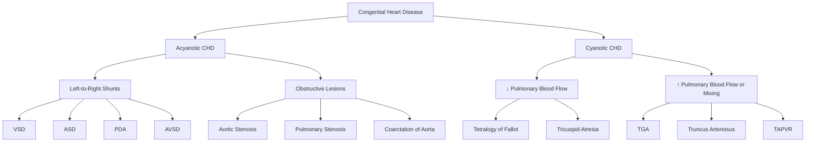

# Murmur Detected on Examination — Paediatric Clinical Approach

## Definition

A **heart murmur** is an audible sound produced by turbulent blood flow within the heart or great vessels, heard through a stethoscope during cardiac auscultation. In paediatrics, a murmur detected on examination is one of the most common reasons for referral to a paediatric cardiologist.

The word "murmur" comes from Latin *murmur* = a low, continuous sound. Physiologically, laminar (smooth, orderly) blood flow is silent; turbulence generates vibrations in surrounding tissue that we hear as a murmur. Turbulence occurs when:
- Flow velocity increases (e.g., fever, anaemia, high-output states)
- There is a pressure gradient across a narrowed orifice (e.g., stenotic valve, septal defect)
- Blood flows through an abnormal communication (e.g., VSD, PDA)

<Callout title="Key Concept">
Most murmurs heard in children are **innocent (functional) murmurs** — present in up to 50–80% of children at some point during childhood. The critical clinical skill is distinguishing innocent murmurs from pathological murmurs that indicate structural heart disease.
</Callout>

---

## Epidemiology and Risk Factors

### Epidemiology

- ***Heart murmurs are extremely common in childhood***: up to **50–80%** of all children will have an audible murmur at some point [1][2]
- Of all murmurs detected, the **vast majority are innocent** — only about **1%** of all children have congenital heart disease (CHD)
- ***Congenital heart disease (CHD)***: incidence approximately **6–8 per 1,000 live births** (roughly 1 in 125–150) [1][2]
- ***Ventricular septal defect (VSD) is the commonest CHD***: 0.3–0.5 per 1,000 live births [3][4]
- In Hong Kong, the incidence of CHD mirrors worldwide figures. Rheumatic heart disease, once common, has declined dramatically with improved living standards and antibiotic treatment of group A streptococcal (GAS) pharyngitis, but remains relevant in immigrant populations [3]

### Risk Factors for Pathological Murmurs / CHD

| Category | Examples |
|---|---|
| **Genetic / Chromosomal** | Trisomy 21 (AVSD), Turner syndrome (CoA, bicuspid AV), Trisomy 13/18, 22q11.2 deletion (conotruncal anomalies — TOF, truncus arteriosus, interrupted aortic arch), Williams syndrome (supravalvular AS), Noonan syndrome (pulmonary stenosis, HCM) |
| **Maternal factors** | Maternal diabetes (TGA, VSD, HCM), maternal rubella (PDA, peripheral PS), maternal SLE with anti-Ro/La antibodies (congenital heart block), maternal phenylketonuria, maternal alcohol (VSD, ASD, TOF) |
| **Teratogenic drugs** | Lithium (Ebstein anomaly), sodium valproate (ASD, VSD, CoA), retinoic acid, thalidomide |
| **Family history** | Positive family history of CHD increases risk 3–4-fold; specific genes (e.g., *NKX2-5*, *GATA4*, *TBX5* in Holt-Oram syndrome) |
| **Acquired causes** | Rheumatic heart disease (GAS pharyngitis → molecular mimicry), infective endocarditis, Kawasaki disease (coronary artery aneurysms, MR) |

---

## Relevant Anatomy and Physiology (Paediatric)

### Foetal and Transitional Circulation — Why It Matters

To understand why murmurs appear *when they do* in neonates and infants, you must understand the transitional circulation:

1. **In utero**: Pulmonary vascular resistance (PVR) is **very high** (lungs are fluid-filled, not ventilated) → blood bypasses lungs via:
   - **Foramen ovale** (RA → LA)
   - **Ductus arteriosus** (PA → aorta)
   - Placenta acts as the gas exchange organ

2. **At birth**: First breath → lung expansion → ↓PVR dramatically. Simultaneously, clamping of umbilical cord → ↑systemic vascular resistance (SVR).
   - ↑LA pressure (from ↑pulmonary venous return) > RA pressure → functional closure of foramen ovale
   - ↑PaO₂ + ↓prostaglandins → constriction and closure of **ductus arteriosus** (functional closure within 24–48 hours; anatomical closure by 2–3 weeks)

3. **PVR continues to fall** over the first **6–8 weeks** of life → this is why left-to-right shunt lesions (VSD, ASD, PDA) may not produce a murmur at birth but become audible at **4–8 weeks** as the shunt increases.

### Cardiac Auscultation Areas in Children

| Area | Location | Valve/Structure |
|---|---|---|
| **Aortic** | Right upper sternal border (RUSB) / 2nd RICS | Aortic valve |
| **Pulmonary** | Left upper sternal border (LUSB) / 2nd LICS | Pulmonary valve |
| **Tricuspid** | Left lower sternal border (LLSB) / 4th LICS | Tricuspid valve, VSD |
| **Mitral / Apex** | 5th LICS, mid-clavicular line (in older children) or 4th LICS (infants) | Mitral valve |

> **Practical tip**: In infants, the heart is more horizontal and the apex is at the 4th intercostal space, mid-clavicular line. The chest is small — sounds radiate widely, so localisation requires care.

### Normal Heart Sounds in Children

- **S1**: Closure of mitral and tricuspid valves (onset of systole). Normally single or narrowly split.
- **S2**: Closure of aortic (A2) and pulmonary (P2) valves (onset of diastole).
  - ***Normal physiological splitting of S2***: heard during inspiration (↑venous return → longer RV ejection time → delayed P2). **Varies with respiration** — this is key.
  - ***Fixed splitting of S2***: does NOT vary with respiration → pathognomonic of **ASD** (equalised filling of both ventricles via the shunt)
  - ***Single S2***: suggests either only one semilunar valve is functioning (e.g., pulmonary atresia, truncus arteriosus) or severe pulmonary hypertension (P2 merges with A2 because of early closure of PV)
  - ***Loud P2***: indicates **pulmonary hypertension**
- **S3**: Normal in children and young adults (rapid ventricular filling). Pathological in older adults.
- **S4**: Always pathological — indicates stiff/non-compliant ventricle.

---

## Aetiology — Focus on Hong Kong Paediatric Population

We classify murmurs first into **innocent** vs. **pathological**, then further classify pathological murmurs by the underlying lesion.

### A. Innocent (Functional / Flow) Murmurs

These are murmurs generated by normal blood flow in a structurally and functionally normal heart. They are **the commonest murmurs in childhood**.

**Why do they occur?**
- The paediatric chest wall is thin → turbulent flow in normal vessels is more easily transmitted
- Relative hyperkinetic circulation in children (higher cardiac output relative to body size)
- Turbulence at branch points of normal great vessels

***Types of innocent murmurs*** [1][2]:

| Type | Age | Location | Character | Mechanism |
|---|---|---|---|---|
| ***Still's murmur*** (most common innocent murmur) | 2–7 years | LLSB/apex | Low-pitched, vibratory/musical, grade 1–3 systolic | Vibration of normal LV structures, possibly false chordae tendineae |
| ***Pulmonary ejection murmur*** | 8–14 years / adolescents | LUSB | Soft, blowing, early–mid systolic | Normal turbulence across pulmonary valve |
| ***Venous hum*** | 3–6 years | Right supraclavicular / upper chest | Continuous, louder in diastole | Turbulence in jugular veins; **disappears with compression of ipsilateral jugular vein or turning head** |
| ***Peripheral pulmonary stenosis (PPS)*** | Neonates (< 6 months) | LUSB, radiates to axillae and back | Soft, short systolic | Relative stenosis at branch PA bifurcation (vessels are small relative to MPA); resolves as PAs grow |
| ***Supraclavicular / brachiocephalic murmur*** | Older children/adolescents | Supraclavicular region | Brief systolic, radiates to neck | Turbulence at origin of head/neck vessels |
| ***Mammary souffle*** | Pregnancy/lactation (rare in paeds, but occurs in adolescence) | Over breast | Continuous or systolic | ↑blood flow in mammary vessels |

<Callout title="Features of Innocent Murmurs — The 7 S's">
Use the **"7 S's"** mnemonic to remember features of innocent murmurs:
1. **S**oft (grade ≤ 3/6, usually 1–2/6)
2. **S**ystolic (or continuous for venous hum — but never purely diastolic)
3. **S**hort duration
4. **S**ingle (normal S2 splitting)
5. **S**itting/standing → murmur decreases (changes with posture)
6. **S**ymptomatic? — No! Asymptomatic child
7. **S**pecial tests normal (normal ECG, CXR, echocardiogram if performed)

***A purely diastolic murmur in a child is NEVER innocent and always requires investigation.*** [1]
</Callout>

### B. Pathological Murmurs — Congenital Heart Disease

***Congenital heart disease is broadly classified into:*** [1][2]

#### I. Acyanotic CHD — Left-to-Right Shunts

Left-to-right shunts produce volume overload of the pulmonary circulation. The murmur is generated by the shunt itself or by increased flow across normal valves.

##### 1. ***Ventricular Septal Defect (VSD)*** [3][4]

- **Epidemiology**: ***Commonest CHD*** — 0.3–0.5/1,000 live births
- **Anatomy**: The interventricular septum has four components:
  - ***Perimembranous (70%)***: in the membranous septum just beneath the aortic valve → ***most common type causing clinically significant VSD*** [3]
  - ***Muscular***: anywhere in the muscular septum → central muscular type more likely to spontaneously close [3]
  - ***Subarterial / doubly committed subarterial (5%)***: beneath both semilunar valves → ***associated with coronary cusp prolapse and aortic regurgitation*** → does NOT spontaneously close [3]
  - ***Inlet***: beneath the AV valves → associated with AVSD / trisomy 21

- **Pathophysiology** [3][4]:
  - ***In utero***: PVR is very high → minimal shunting across VSD → little effect on cardiac physiology
  - ***Postnatal***: Gradual ↓PVR over 2–3 months → progressive ↑left-to-right shunting
    - ↑Pulmonary blood flow → **heart failure symptoms** + **pulmonary hypertension**
    - ↑Pulmonary venous return → **LV volume overload** (displaced, thrusting apex)
    - ***NO RV overload in early stages*** because the RV merely acts as a conduit for blood flowing from LV → RV → PA (i.e., no increased preload to the RV) [3]
  - ***Natural history***: Spontaneous closure in 60–80% (usually by age 5), except subarterial type [3][4]
    - Small VSD (< 4 mm): 75% close spontaneously within 2 years
    - Moderate VSD (4–6 mm): less spontaneous closure but usually responds to medical treatment
    - ***Large VSD (> 6 mm): progressive ↑PVR → risk of Eisenmenger syndrome*** [3]

- **Clinical features**:
  - Small VSD: ***Asymptomatic with incidental murmur*** — the classically described "loud murmur in a well child"
  - Moderate/large VSD: Heart failure symptoms appear at ***1–2 months*** (as PVR falls): tachypnoea, feeding difficulty, poor weight gain, sweating during feeds, recurrent chest infections
  - ***Signs*** [3][4]:
    - ***Pansystolic murmur (PSM) at LLSB*** — widely radiating, often with a thrill in muscular defects
    - ***PSM at LUSB*** in subarterial defects
    - LV volume overload: ***displaced, thrusting apex***
    - If large with significant shunt: ***mid-diastolic murmur (MDM) at apex*** (functional mitral stenosis due to ↑flow across MV) and ***ejection systolic murmur (ESM) at LUSB*** (↑flow across PV)
    - Pulmonary hypertension: ***loud P2 or single S2***
    - Signs of heart failure: tachypnoea, hepatomegaly, precordial bulge (chronic volume overload in infancy before chest wall ossifies)

> **Why does a small VSD produce a louder murmur than a large VSD?** A small, restrictive VSD has a large pressure gradient between LV and RV → high velocity jet → loud murmur with thrill. A large, non-restrictive VSD equalises pressures → lower velocity → softer, shorter murmur. Paradoxically, a very loud murmur in a well baby is reassuring!

##### 2. ***Atrial Septal Defect (ASD)***

- **Epidemiology**: ~7–10% of CHD
- **Types**:
  - ***Secundum ASD (70%)***: defect in fossa ovalis region — most common
  - ***Primum ASD (15–20%)***: defect in lower atrial septum, part of the AVSD spectrum — associated with Down syndrome; often has an associated cleft mitral valve → MR
  - ***Sinus venosus ASD (5–10%)***: near SVC/IVC junction — associated with partial anomalous pulmonary venous return (PAPVR)
  - ***Coronary sinus ASD***: very rare

- **Pathophysiology**:
  - Left-to-right shunt at atrial level → RV and pulmonary vascular volume overload (NOT LV overload, because shunt is pre-tricuspid)
  - Because the pressure difference between LA and RA is small, the shunt is compliant and gradual → symptoms develop **late** (often not until adulthood)
  - Chronic RV volume overload → RV dilatation → relative pulmonary stenosis (↑flow across normal PV)

- **Clinical features**:
  - Often ***asymptomatic*** in childhood — detected incidentally
  - ***Signs***:
    - ***Fixed, widely split S2*** — **pathognomonic** (because the ASD equalises filling pressures between atria, so respiratory variation is abolished)
    - ***Ejection systolic murmur at LUSB*** — due to relative pulmonary stenosis (↑flow across PV), NOT the ASD shunt itself (pressure gradient is too low to generate turbulence directly)
    - RV volume overload: ***left parasternal heave***
    - If primum ASD with cleft MV: ***apical pansystolic murmur*** (MR)

<Callout title="Exam Pearl" type="idea">
The murmur in ASD is NOT caused by blood flowing through the defect — the pressure gradient between LA and RA is too small. The murmur is due to **increased flow across the pulmonary valve** (relative PS). This is why ASD produces an ESM at LUSB, not a continuous or pansystolic murmur.
</Callout>

##### 3. ***Patent Ductus Arteriosus (PDA)***

- **Epidemiology**: ~5–10% of CHD; much higher in premature infants (as high as 60% in < 28 weeks gestational age)
- **Pathophysiology**:
  - Ductus arteriosus connects PA to descending aorta in foetal life. Normally closes by 24–48 hours (functional) and 2–3 weeks (anatomical)
  - Persistence → left-to-right shunt (aorta → PA) throughout cardiac cycle (because aortic pressure > PA pressure in both systole and diastole after PVR falls)
  - Result: ↑pulmonary blood flow → ↑pulmonary venous return → **LA and LV volume overload**
  - Large PDA → heart failure, failure to thrive, pulmonary hypertension

- **Clinical features**:
  - ***Continuous "machinery" murmur*** — best heard at ***left infraclavicular area / LUSB***. The murmur is loudest in late systole and continuous into diastole (because the pressure gradient persists throughout the cardiac cycle), with a characteristic crescendo–decrescendo pattern peaking around S2
  - ***Bounding / collapsing pulses*** with ***wide pulse pressure*** (because of diastolic run-off from aorta into PA → low diastolic BP)
  - LV volume overload: displaced, thrusting apex
  - In premature neonates: may present with worsening respiratory distress, apnoea, or difficulty weaning off ventilation

##### 4. ***Atrioventricular Septal Defect (AVSD)***

- Strongly associated with ***Down syndrome (trisomy 21)*** — ~40% of children with Down syndrome have CHD, and AVSD is the most common type
- **Complete AVSD**: single common AV valve with both atrial and ventricular components of the defect → presents with heart failure in infancy
- **Partial AVSD**: essentially a primum ASD with cleft mitral valve → may present later

#### II. Acyanotic CHD — Obstructive Lesions

##### 1. ***Pulmonary Stenosis (PS)***

- **Epidemiology**: ~8–10% of CHD
- **Types**: valvular (most common), subvalvular (infundibular), supravalvular (associated with Williams syndrome, Noonan syndrome, or post-rubella)
- **Pathophysiology**: obstruction to RV outflow → RV pressure overload → compensatory RVH
  - In critical PS (neonates): duct-dependent pulmonary circulation (needs PDA to maintain pulmonary blood flow)

- **Clinical features**:
  - ***Ejection systolic murmur at LUSB*** with ***ejection click*** (valvular PS)
  - Radiation to the ***back / axillae*** (especially in peripheral PS)
  - ***Thrill at LUSB*** in moderate-severe PS
  - ***Soft P2*** (calcified/immobile valve) or ***widely split S2*** (delayed RV ejection)
  - RV pressure overload: ***left parasternal heave***

##### 2. ***Aortic Stenosis (AS)*** [5]

- **Types in children**: Valvular (most common — often bicuspid aortic valve), subvalvular (subaortic membrane — can be associated with VSD), supravalvular (Williams syndrome — "elfin facies", hypercalcaemia)
- ***Bicuspid aortic valve***: occurs in 1–2% of the population; most common congenital cardiac anomaly [5]
- **Pathophysiology**: obstruction to LV outflow → LV pressure overload → ***concentric LVH without deviation of apex*** (initially) → eventually decompensation with LV dilatation and failure [5]

- **Clinical features** [5]:
  - ***Ejection systolic murmur (ESM)***: harsh, "saw cutting wood", best heard at ***aortic area (RUSB)***
  - ***Radiates to bilateral carotid arteries / neck***
  - ***Ejection click*** (valvular AS — from opening of stiff valve; click disappears with severe calcification)
  - ***Narrow pulse pressure*** and ***slow-rising, small volume pulse (pulsus parvus et tardus)*** — because of fixed, reduced stroke volume
  - ***S4*** — due to forceful atrial contraction against stiff LV
  - ***Soft or absent A2*** (if severely calcified/stenotic)
  - Severe AS: ***sustained, heaving apex*** (LVH), ***systolic thrill in aortic area***

##### 3. ***Coarctation of Aorta (CoA)*** [3][4][6]

- **Epidemiology**: ***9% of CHD***, incidence 4/10,000 live births, ***M > F ≈ 59:41%*** [3]
- ***Associations***: Turner syndrome, hypoplasia of transverse aortic arch, VSD, ***bicuspid aortic valve*** (present in up to 80%), berry aneurysms [3][6]
- **Anatomy**: ***majority discrete narrowing of descending aorta at insertion of ductus*** (juxtaductal) [3]

- **Pathophysiology** [3][6]:
  - ***Severe CoA in neonates***: duct-dependent systemic circulation
    - RV supplies descending aorta via PDA
    - ***Duct closure → acute ↑LV afterload → acute heart failure with shock + renal failure***
  - ***Less severe CoA***: presents later with ***systolic hypertension*** and LV pressure overload
    - Chronic LV pressure overload → compensatory LVH
    - ***Systemic arterial insufficiency distal to coarctation*** → collateral development (intercostal arteries enlarge → rib notching on CXR in older children)
    - ***Upper limb hypertension*** (proximal to obstruction) with ***lower limb hypotension*** (distal to obstruction)
    - ***Systolic hypertension may persist despite repair*** due to permanent alteration of arterial mechanics [3]

- ***Clinical features*** [3][6]:
  - ***Asymptomatic***: incidental finding of murmur or systemic hypertension (even if narrowing is moderate/severe)
  - ***Neonatal presentation (duct-dependent)***: Day 2 heart failure with shock and oliguria → ***death within 1 week if tight stenosis*** and untreated [3]

| Duct-dependent (neonate) | Non-duct-dependent (older child) |
|---|---|
| ***Weak lower limb pulses***: only reliable sign before ductus closes [3] | ***Weak LL pulse with radiofemoral delay*** [3] |
| ***RV impulse*** (as systemic circulation supported by RV via PDA) | ***LV impulse (heaving apex)*** |
| ***Inaudible/soft ESM at LUSB*** | ***ESM at LUSB radiating to left interscapular region at the back*** [3] |
| ***Collapse, shock, oliguria after ductal closure*** | ***± Soft continuous murmur throughout chest*** in older children with well-developed collaterals [3] |

<Callout title="Must-Know Clinical Sign" type="error">
***Always check four-limb blood pressures and femoral pulses in any child with a murmur or hypertension.*** A > 20 mmHg systolic gradient between upper and lower limbs, or weak/absent femoral pulses, strongly suggests coarctation. This is a commonly missed diagnosis — examiners love to test it.
</Callout>

#### III. Cyanotic CHD [1][2]

Cyanotic CHD produces ***central cyanosis*** — a blue discolouration of the mucous membranes and skin caused by ↑deoxygenated haemoglobin (> 3–5 g/dL) in arterial blood. This requires a **right-to-left shunt** or **mixing lesion** that allows deoxygenated blood to enter the systemic circulation.

##### 1. ***Tetralogy of Fallot (TOF)***

- ***Commonest cyanotic CHD*** (~5–7% of all CHD) [1][2]
- **Four components** (from the **single developmental defect** of anterior and cephalad deviation of the infundibular septum):
  1. ***Large VSD*** (non-restrictive, malalignment type)
  2. ***Right ventricular outflow tract obstruction (RVOTO)*** — infundibular, valvular, or both (this determines severity)
  3. ***Overriding aorta*** (aortic root straddles the VSD)
  4. ***Right ventricular hypertrophy*** (secondary to RVOTO)

- **Pathophysiology**:
  - The VSD is large and non-restrictive → RV and LV pressures equalise
  - The **degree of cyanosis depends on the severity of RVOTO**: the more severe the obstruction, the more right-to-left shunting through VSD into the overriding aorta → more cyanosis
  - Mild RVOTO ("pink TOF"): may have predominantly left-to-right shunting → ***acyanotic at birth with progressive cyanosis*** developing over months
  - Severe RVOTO: cyanosis from birth → duct-dependent pulmonary circulation

- ***Clinical features***:
  - ***Progressive cyanosis*** in first months of life (as infundibular hypertrophy worsens)
  - ***Hypercyanotic / "Tet" spells***: paroxysmal episodes of severe cyanosis, often precipitated by crying, feeding, or straining → infundibular spasm → ↑RVOTO → ↑right-to-left shunt → profound cyanosis, irritability, altered consciousness
    - ***Squatting position***: older children instinctively squat during spells — this ↑SVR (compresses femoral arteries) → reduces right-to-left shunt + ↑venous return from lower limbs
  - ***Clubbing*** (in older children with chronic cyanosis)
  - ***Signs***:
    - ***Ejection systolic murmur at LUSB*** — due to RVOTO (NOT the VSD — the VSD is non-restrictive and pressures equalise, so no pressure gradient to generate murmur)
    - ***The murmur becomes SOFTER during a Tet spell*** (because less blood is flowing through RVOT)
    - ***Single S2*** (aortic component only — P2 is usually inaudible because of low pulmonary flow)
    - ***RV heave***

> ***The paradox of TOF***: A louder murmur in TOF means LESS obstruction (more blood going through RVOT into lungs → better oxygenation). A softer/absent murmur during a spell means severe RVOTO → emergency.

##### 2. ***Transposition of the Great Arteries (TGA)***

- ***Commonest cyanotic CHD presenting in the neonatal period*** [1][2]
- **Anatomy**: Aorta arises from RV, PA arises from LV → two parallel circulations (systemic and pulmonary) with no mixing → ***incompatible with life unless there is mixing*** (via ASD, VSD, or PDA)
- ***Presents with severe cyanosis in the first hours-days of life*** that does NOT respond to supplemental O₂ (failed hyperoxia test)
- ***Murmur may be absent or soft*** (if intact septum); murmur present if associated VSD

##### 3. Other Cyanotic Lesions (brief mention for completeness)
- ***Tricuspid atresia***: absent tricuspid valve → obligatory right-to-left shunt at atrial level (through ASD/PFO); duct-dependent pulmonary circulation
- ***Total anomalous pulmonary venous return (TAPVR)***: all pulmonary veins drain into systemic venous system → mixing → cyanosis ± obstruction
- ***Truncus arteriosus***: single arterial trunk from both ventricles → mixing → cyanosis + heart failure
- ***Hypoplastic left heart syndrome (HLHS)***: underdeveloped left heart → duct-dependent systemic circulation → collapse after ductal closure

### C. Acquired Causes of Pathological Murmurs

#### 1. ***Rheumatic Heart Disease*** [3][7]

- **Pathophysiology**: ***Molecular mimicry*** — delayed immune response to infection with certain strains of ***group A streptococcus (S. pyogenes)*** [3][7]
  - ***Cross-reactive antibodies (anti-M protein)*** target cardiac proteins → inflammation in endocardium, myocardium, and pericardium (***pancarditis***) [3][7]
  - ***Characteristically, rheumatic heart disease is the ONLY disease that affects all three layers of the heart*** [3][7]

- **Clinical features**: preceded by sore throat ***2–3 weeks*** before [3]
  - General: fever, anorexia, lethargy
  - ***Pancarditis (60%)***: breathlessness, palpitation/chest pain, tachycardia, new/changing murmur [3]
    - ***Murmurs***: transient ***MR and/or AR murmur***, ***mid-diastolic murmur at apex (Carey-Coombs murmur)*** — due to mitral valvulitis leading to thickening of MV → turbulent flow through thickened valve [3]
  - ***Arthritis (50%)***: asymmetrical, predominantly large joints, ***migratory*** [3]
  - ***Skin lesions***:
    - ***Erythema marginatum (< 5%)***: non-pruritic pink ring lesions on trunk/extremities, sparing the face [3]
    - ***Subcutaneous nodules (< 10%)***: small, painless, symmetrical over extensor surfaces of tendons and bones [3]
  - ***Sydenham's chorea (20%)***: emotional lability followed by choreiform movements of hands, feet, or face [3]
    - ***Milkmaid sign***: increasing and decreasing pressure of patient's grip when asked to squeeze examiner's hand [3]

#### 2. Kawasaki Disease
- Acute febrile vasculitis of childhood (< 5 years)
- Cardiac involvement: coronary artery aneurysms, myocarditis → may produce murmur (MR from papillary muscle dysfunction or myocarditis)

#### 3. Infective Endocarditis
- Can occur on any abnormal valve or septal defect
- ***VSD carries a risk of infective endocarditis regardless of size*** [3]
- New or changing murmur in a febrile child with known CHD → must consider IE

### D. Physiological / High-Output States Producing Flow Murmurs

Any condition that increases cardiac output or decreases blood viscosity will increase turbulence and may produce or accentuate a murmur:
- **Fever** (↑CO)
- **Anaemia** (↓viscosity + ↑CO to maintain O₂ delivery) → flow murmur, typically ESM at LUSB
- **Thyrotoxicosis** (↑CO, ↑heart rate)
- **Pregnancy / puberty** (physiological ↑CO)
- **Anxiety / exercise** (↑CO)

---

## Classification of Murmurs

### By Timing in the Cardiac Cycle

| Timing | Type | Examples |
|---|---|---|
| **Systolic** | Ejection systolic murmur (ESM) — crescendo-decrescendo | AS, PS, HOCM, ASD (relative PS), TOF (RVOTO), innocent murmurs |
| | Pansystolic murmur (PSM) — uniform throughout systole | VSD, MR, TR |
| | Late systolic murmur | Mitral valve prolapse |
| **Diastolic** | Early diastolic murmur (EDM) — decrescendo | AR, PR |
| | Mid-diastolic murmur (MDM) — low-pitched rumble | MS, functional mitral stenosis (large VSD, large PDA), Carey-Coombs murmur (rheumatic) |
| **Continuous** | Present in both systole and diastole | PDA ("machinery murmur"), venous hum (innocent), collaterals (CoA), arteriovenous malformation |

<Callout title="Never Innocent" type="error">
***A diastolic murmur is NEVER innocent in a child. Any diastolic murmur mandates echocardiography.***

Similarly, a ***pansystolic murmur*** is always pathological (innocent murmurs are ejection-type and do not last throughout systole).
</Callout>

### By Grading (Levine Scale — Out of 6)

| Grade | Description |
|---|---|
| **1/6** | Very faint, only heard in a quiet environment with concentration |
| **2/6** | Soft but readily audible |
| **3/6** | Moderately loud, no thrill |
| **4/6** | Loud, with a palpable thrill |
| **5/6** | Very loud, heard with edge of stethoscope |
| **6/6** | Audible without stethoscope |

> Innocent murmurs are ≤ 3/6 and never have a thrill.

---

## Clinical Features

### A. Symptoms — What the Family Reports

Murmurs themselves are asymptomatic — they are physical signs, not symptoms. However, the **underlying condition** producing the murmur determines symptoms:

#### 1. Symptoms Suggesting Significant Haemodynamic Compromise (Heart Failure in Infants)

The pathophysiological basis of heart failure in infants relates to volume overload (left-to-right shunts) or pressure overload (obstructive lesions):

| Symptom | Pathophysiological Basis |
|---|---|
| ***Tachypnoea / respiratory distress*** | ↑Pulmonary blood flow → pulmonary congestion → ↓lung compliance → increased work of breathing |
| ***Feeding difficulty / poor feeding*** | Tachypnoea makes coordinating suck-swallow-breathe difficult; ↑metabolic demands of laboured breathing |
| ***Sweating during feeds*** | Sympathetic activation to maintain cardiac output; feeds are the "exercise test" for infants |
| ***Failure to thrive / poor weight gain*** | ↑Metabolic demands + ↓caloric intake (poor feeding) → negative energy balance |
| ***Recurrent respiratory infections*** | Pulmonary congestion → oedematous airways → impaired mucociliary clearance → ↑infection susceptibility |
| ***Hepatomegaly*** | Systemic venous congestion (right heart failure) → hepatic congestion |

#### 2. Symptoms Suggesting Cyanotic Heart Disease

| Symptom | Pathophysiological Basis |
|---|---|
| ***Central cyanosis*** | ↑Deoxygenated Hb in arterial blood from right-to-left shunting |
| ***Hypercyanotic / "Tet" spells*** (TOF) | Infundibular spasm → ↑RVOTO → ↑R-to-L shunting → acute desaturation |
| ***Squatting*** (older children) | ↑SVR → ↓R-to-L shunting + ↑venous return from lower limbs |

#### 3. Symptoms Suggesting Obstruction

| Symptom | Pathophysiological Basis |
|---|---|
| ***Syncope on exertion*** | Fixed CO (unable to ↑output) + peripheral vasodilation during exercise → ↓cerebral perfusion |
| ***Chest pain on exertion*** | Subendocardial ischaemia from ↑myocardial O₂ demand (hypertrophy) and ↓supply (high intraventricular pressure impedes coronary flow) |
| ***Sudden cardiac death*** | Ventricular arrhythmia triggered by myocardial ischaemia in severe obstruction (especially AS, HCM) |

#### 4. Symptoms in the Neonate — Collapsed Neonate

This is a **critical presentation** and represents a cardiac emergency:
- ***Duct-dependent lesions*** present when PDA closes (Day 1–3 of life)
- Presents as ***acute collapse, shock, poor perfusion, metabolic acidosis, oliguria***
- Duct-dependent systemic circulation: CoA, HLHS, critical AS, interrupted aortic arch
- Duct-dependent pulmonary circulation: pulmonary atresia, critical PS, severe TOF, tricuspid atresia

### B. Signs — What You Find on Examination

#### Systematic Approach to Examining a Child with a Murmur

**1. General Inspection**

| Sign | Significance / Pathophysiology |
|---|---|
| ***Dysmorphic features*** | Suggest underlying syndrome: Down syndrome → AVSD; Turner → CoA; DiGeorge/22q11 → conotruncal anomalies; Williams → supravalvular AS; Noonan → PS, HCM |
| ***Central cyanosis*** | R-to-L shunting or mixing lesion (check mucous membranes, tongue — more reliable than skin colour, especially in dark-skinned children) |
| ***Clubbing*** | Chronic cyanosis (months-years) → digital vasodilation and connective tissue hypertrophy |
| ***Failure to thrive*** | Chronic heart failure → ↑metabolic demand, ↓intake |
| ***Precordial bulge*** | Chronic cardiomegaly in infancy (before chest wall ossifies) — the compliant infant chest wall is pushed out by the enlarged heart |
| ***Respiratory distress*** | Tachypnoea, subcostal/intercostal recession → pulmonary congestion |
| ***Pallor*** | Anaemia (may exacerbate or cause flow murmur); poor cardiac output |

**2. Peripheral Assessment**

| Sign | Significance |
|---|---|
| ***Four-limb blood pressures*** | > 20 mmHg gradient UL > LL suggests CoA; pre-ductal vs post-ductal SpO₂ difference > 3% suggests R-to-L shunting at PDA level |
| ***Pulse character*** | Collapsing/bounding → PDA, AR (↑stroke volume with diastolic run-off); slow-rising → AS; weak/absent femorals → CoA |
| ***Pulse rate and rhythm*** | Tachycardia → heart failure, fever; irregular → arrhythmia |
| ***Hepatomegaly*** | Systemic venous congestion → right heart failure |
| ***Peripheral oedema*** | Rare in infants with heart failure (infants get hepatomegaly, not oedema, because venous pressure is highest in the splanchnic bed) |

**3. Precordial Palpation**

| Sign | Significance |
|---|---|
| ***Apex beat position*** | Displaced laterally → LV dilatation (volume overload: MR, VSD, PDA, AR) |
| ***Apex character*** | ***Thrusting*** (volume overload): large SV → forceful outward impulse; ***Heaving/sustained*** (pressure overload): sustained forceful impulse (AS, HT, CoA) |
| ***Left parasternal heave*** | RV hypertrophy/dilatation (PS, ASD, pHTN, TOF) |
| ***Thrill*** | Palpable vibration = grade ≥ 4/6 murmur = always pathological |
| ***Palpable P2*** | Pulmonary hypertension |

**4. Auscultation — Detailed Murmur Analysis**

For each murmur, document systematically: ***STAMP+R*** — Site, Timing, Amplitude (grade), Morphology (shape), Pitch, Radiation

| Murmur Characteristic | How to Describe | Clinical Utility |
|---|---|---|
| **Site** | Where loudest (use standard auscultation areas) | Points to the valve/structure involved |
| **Timing** | Systolic, diastolic, continuous; early/mid/late/pan | Differentiates ESM (stenosis) from PSM (regurgitation) from EDM (AR/PR) |
| **Amplitude** | Grade 1–6 | ≥ 4/6 always pathological; but grade does NOT correlate well with haemodynamic severity |
| **Morphology** | Crescendo-decrescendo (diamond), uniform, decrescendo | ESM = diamond; PSM = plateau; EDM = decrescendo |
| **Pitch** | High, low, mixed | High-pitched → high-velocity flow (AR, MR); Low-pitched → low-velocity flow (MS, functional MDM) |
| **Radiation** | Where else is it heard? | Neck (AS), axilla (MR), back (CoA, PS, PDA) |
| **Dynamic changes** | With posture, respiration, Valsalva | Right-sided murmurs ↑ with inspiration (↑venous return); innocent murmurs ↓ with standing |

**5. Summary Table — Classic Murmur Findings in Common Paediatric Conditions**

| Condition | Type of Murmur | Location | Radiation | Key Associated Findings |
|---|---|---|---|---|
| ***Still's murmur*** | Vibratory ESM, grade 1–3 | LLSB/apex | None | Asymptomatic, ↓ with standing |
| ***VSD*** | PSM | LLSB (muscular/perimembranous), LUSB (subarterial) | Widely radiating, ± thrill | ± MDM apex (if large); loud P2 (if pHTN) |
| ***ASD*** | ESM | LUSB | — | ***Fixed split S2***; parasternal heave |
| ***PDA*** | ***Continuous "machinery"*** | Left infraclavicular / LUSB | Back | Bounding pulses, wide pulse pressure |
| ***PS*** | ESM + ejection click | LUSB | Back/axillae | Widely split S2, soft P2, RV heave |
| ***AS*** | Harsh ESM + ejection click | RUSB | Neck | Slow-rising pulse, thrill, soft A2 |
| ***CoA*** | ESM | LUSB | Left interscapular (back) | Weak LL pulses, radiofemoral delay, UL HTN |
| ***TOF*** | ESM | LUSB | — | Cyanosis, ***single S2***, RV heave; murmur ↓ during Tet spell |
| ***MR (rheumatic)*** | PSM | Apex | Axilla | ± Carey-Coombs MDM, ± AR |
| ***AR (rheumatic)*** | EDM | LUSB/tricuspid area | — | Wide pulse pressure, displaced apex |
| ***HOCM*** | ESM | LLSB | — | Jerky pulse, ***↑ with Valsalva/standing*** (↓preload → ↑LVOTO) |
| ***Innocent venous hum*** | Continuous | Right supraclavicular | — | ***Disappears with ipsilateral jugular compression or turning head*** |
| ***Peripheral PS (neonatal)*** | Soft systolic | LUSB → bilateral axillae/back | Back | Resolves by 6 months |

---

## Age-Specific Considerations — When Do Murmurs Present?

| Age | Common New Murmur Presentations | Why at This Age? |
|---|---|---|
| ***Day 0–3*** | Duct-dependent lesions (CoA, critical PS/AS, pulmonary atresia, HLHS, TGA) | PDA closing → haemodynamic collapse; TGA → cyanosis from birth |
| ***1–2 months*** | VSD, large PDA, AVSD | PVR falling → ↑L-to-R shunting → heart failure |
| ***3–6 months*** | TOF (progressive cyanosis) | Infundibular hypertrophy progresses → ↑RVOTO |
| ***2–7 years*** | Innocent (Still's) murmur; ASD (if not picked up earlier) | Thin chest wall, routine examination opportunities (school health) |
| ***5–15 years*** | Rheumatic heart disease (new murmur) | Post-streptococcal immune response (molecular mimicry); 2–3 weeks after pharyngitis |
| ***Any age*** | Infective endocarditis (new/changing murmur in febrile child with known CHD) | Bacteraemia seeding abnormal endocardium |

---

## Distinguishing Innocent from Pathological Murmurs — Clinical Features

| Feature | Innocent Murmur | Pathological Murmur |
|---|---|---|
| **Symptoms** | Asymptomatic, well child | Heart failure, cyanosis, failure to thrive, syncope, chest pain |
| **Timing** | Systolic (or continuous venous hum) — ***never purely diastolic*** | Any timing; ***diastolic = always pathological*** |
| **Grade** | ≤ 3/6, no thrill | Any grade; thrill = always pathological |
| **S2** | Normal splitting | Fixed split (ASD), single (TOF, PA), loud P2 (pHTN) |
| **Extra sounds** | No clicks, no gallop (S3 may be normal) | Ejection clicks (AS, PS), S4, pathological S3 |
| **Posture** | ↓ with standing/Valsalva (↓preload → ↓flow → ↓murmur) | Generally unchanged or ↑ (HOCM ↑ with Valsalva) |
| **Growth** | Normal | May be impaired |
| **Pulses** | Normal and equal | Abnormal character, radiofemoral delay, absent femorals |
| **Precordium** | Normal apex, no heave, no thrill | Displaced apex, heave, thrill |
| **Cyanosis** | Absent | May be present |

---

## Special Considerations in the Neonatal Period [1]

- ***Neonatal murmurs are unreliable for excluding significant CHD*** — many severe lesions (TGA, CoA, HLHS) may have NO murmur at birth
- ***Pulse oximetry screening*** (pre-ductal + post-ductal SpO₂) is now recommended as a universal screen for critical CHD in newborns — more sensitive than auscultation alone
  - A difference of > 3% between pre-ductal (right hand) and post-ductal (either foot) or SpO₂ < 95% in either is abnormal → warrants echocardiography
- ***Transitional murmurs***: Up to 60% of term newborns have transient murmurs in the first 48 hours (due to closing PDA, tricuspid regurgitation from transitional RV pressure), usually resolving within days

---

<Callout title="High Yield Summary">

1. **Murmurs are extremely common in children** — up to 80% will have one at some point; the vast majority are innocent.
2. ***Innocent murmurs***: soft (≤ 3/6), systolic (or continuous venous hum), no thrill, no diastolic component, no associated symptoms, normal S2 splitting, normal growth, normal pulses. **Still's murmur** is the commonest. **Remember the 7 S's.**
3. ***Pathological red flags***: diastolic murmur, pansystolic murmur, loud murmur (≥ 4/6) with thrill, abnormal S2 (fixed split, single, loud P2), associated symptoms (cyanosis, heart failure, failure to thrive, syncope), abnormal pulses (radiofemoral delay, absent femorals, bounding), clicks, precordial hyperactivity.
4. ***VSD is the commonest CHD*** — PSM at LLSB; murmur appears at 1–2 months as PVR falls; small VSD = loud murmur + well child; large VSD = softer murmur + heart failure.
5. ***ASD***: ESM at LUSB with **fixed split S2** (pathognomonic) — murmur from ↑flow across PV, not the defect itself.
6. ***PDA***: continuous "machinery" murmur, bounding pulses, wide pulse pressure.
7. ***TOF***: commonest cyanotic CHD; ESM at LUSB that becomes SOFTER during Tet spells (paradox); single S2.
8. ***CoA***: always check four-limb BPs and femoral pulses — radiofemoral delay; ESM at LUSB radiating to back; associated with Turner syndrome and bicuspid AV.
9. ***Duct-dependent lesions*** present with collapse after PDA closure (Day 1–3); give **IV prostaglandin E1** to reopen duct.
10. ***Rheumatic heart disease***: molecular mimicry after GAS pharyngitis; pancarditis; new MR/AR murmur + Carey-Coombs MDM; Jones criteria for diagnosis.
11. ***Diastolic murmur in a child is NEVER innocent.***
12. ***Pulse oximetry screening*** for critical CHD in newborns is more sensitive than auscultation alone.

</Callout>

---

<ActiveRecallQuiz
  title="Active Recall - Murmur Detected on Examination"
  items={[
    {
      question: "Name the 7 S's that characterise innocent murmurs in children.",
      markscheme: "Soft (grade 1-3), Systolic (never purely diastolic), Short duration, Single (normal S2), Sitting/Standing causes murmur to decrease, Symptomatic - No (asymptomatic child), Special tests normal.",
    },
    {
      question: "A 6-week-old infant presents with tachypnoea, poor feeding, sweating during feeds, and a pansystolic murmur at the left lower sternal border with a thrill. What is the most likely diagnosis, and why did symptoms appear at this age?",
      markscheme: "Moderate-to-large VSD. Symptoms appear at 4-8 weeks because PVR gradually falls after birth, increasing the left-to-right shunt through the VSD, leading to pulmonary overcirculation and heart failure.",
    },
    {
      question: "What is the pathognomonic auscultatory finding in ASD, and why does it occur?",
      markscheme: "Fixed, widely split S2. The ASD equalises filling between the two atria, so RV volume is relatively constant regardless of respiratory phase, abolishing the normal respiratory variation in S2 splitting.",
    },
    {
      question: "In Tetralogy of Fallot, why does the ejection systolic murmur become softer during a hypercyanotic spell?",
      markscheme: "During a Tet spell, infundibular spasm worsens RVOTO, so less blood flows through the RVOT into the pulmonary artery. Less flow means less turbulence and a softer murmur. Paradoxically, a softer murmur indicates worsening obstruction and more severe right-to-left shunting.",
    },
    {
      question: "A neonate presents on Day 2 with shock, weak lower limb pulses, and metabolic acidosis. The upper limb blood pressure is 85/55 mmHg and the lower limb is 50/30 mmHg. What is the most likely diagnosis, and what is the emergency treatment?",
      markscheme: "Coarctation of the aorta (severe, duct-dependent systemic circulation). Emergency treatment is IV prostaglandin E1 (alprostadil) to reopen the ductus arteriosus, along with stabilisation (ventilation, inotropes, correction of acidosis).",
    },
    {
      question: "Why is a purely diastolic murmur in a child always considered pathological?",
      markscheme: "Innocent murmurs are caused by turbulence during ventricular ejection (systole) or venous return. Diastolic murmurs indicate either valve regurgitation (AR, PR causing early diastolic murmur) or valve stenosis/increased flow across an AV valve (MS, functional mitral stenosis causing mid-diastolic murmur). Both require structural abnormality or significant haemodynamic disturbance that does not occur in a normal heart.",
    },
  ]}
/>

---

## References

[1] Lecture slides: GC 147. Heart failure and cyanosis in children acyanotic and cyanotic congenital heart disease - Part 1.pdf
[2] Lecture slides: GC 147. Heart failure and cyanosis in children acyanotic and cyanotic congenital heart disease - Part 2.pdf
[3] Senior notes: Adrian Lui Pediatrics.pdf (p201–235, Congenital Heart Disease and Rheumatic Heart Disease sections)
[4] Senior notes: Ryan Ho Cardiology.pdf (p190–193, CoA and VSD sections)
[5] Senior notes: Ryan Ho Cardiology.pdf (p158, Aortic Stenosis section)
[6] Senior notes: Ryan Ho Cardiology.pdf (p190, Coarctation of Aorta section)
[7] Senior notes: Ryan Ho Cardiology.pdf (p146, Rheumatic Heart Disease section)
