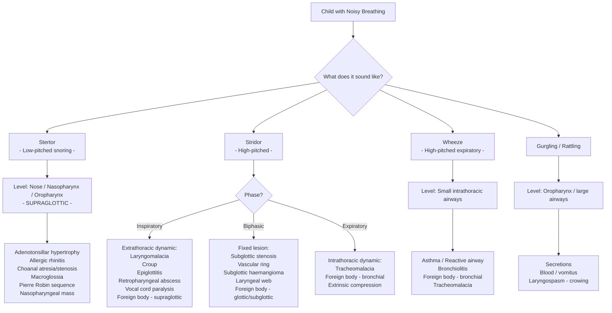

## Differential Diagnosis of Noisy Breathing / Snoring in Children

The differential diagnosis of noisy breathing in a child is best approached **systematically** — first by characterising the sound (which localises the level), then by considering the tempo (acute vs chronic), and finally by the child's age. This section builds on the anatomy, pathophysiology, and clinical features discussed previously.

### Organising Framework: Sound Character → Level → Differential

The single most important bedside step is to **listen and characterise the sound**, because the sound IS the localisation:

---

### Differential by Presentation: Acute Noisy Breathing / Stridor

When a child presents **acutely** with new-onset noisy breathing, the priorities are (1) assess severity and stabilise, (2) distinguish life-threatening from benign causes. Below are the key differentials, each with the distinguishing features that let you tell them apart:

#### 1. ***Viral Laryngotracheobronchitis (Croup)*** — The Most Common Cause of Acute Stridor

- ***Epidemiology: typically occurs in 6 months – 6 years (peak at 2 years), most common in autumn*** [3]
- ***Microbiology: parainfluenza virus, rhinovirus, RSV, influenza virus*** [3]
- **Pathophysiology**: Viral infection causes inflammation and oedema of the **subglottic mucosa** — remember, the subglottis (cricoid ring) is the narrowest point in the paediatric airway, and even 1mm of oedema causes a 16-fold increase in resistance (Poiseuille's law).
- ***Clinical features*** [3]:
  - ***Hoarseness and harsh stridor: typically worse at night***
  - ***Characteristic barking cough: sea lion-like (due to tracheal oedema/collapse)***
  - ***± preceding coryzal symptoms: fever, nasal congestion, discharge***
  - ***± respiratory distress***
- **Why worse at night?** Cortisol levels are lowest at night (nadir around midnight), reducing the natural anti-inflammatory effect; also, cooler ambient air and horizontal positioning may worsen oedema and airway dynamics.
- ***Imaging: NOT indicated if clinically suggestive*** [3]; ***Neck XR: steeple (hourglass) sign*** [3] — the normal "shouldering" of the subglottis disappears because oedema narrows the subglottic region symmetrically.
- **Key distinguishing feature**: Gradual onset with URTI prodrome + barking cough + hoarse voice + inspiratory stridor. The child is usually not toxic-looking.

> ***Approach to acute cough: "Is this a croup syndrome?" → Stridor, 'barking' or 'croupy cough', hoarseness, ± fever → Viral croup / Recurrent spasmodic croup / Bacterial tracheitis*** [5]

#### 2. ***Spasmodic Croup*** — The Non-Infective Variant

- ***Clinical features: hoarseness and harsh stridor typically worse at night, characteristic barking cough, but NO preceding coryzal symptoms*** [3]
- **Pathophysiology**: Thought to be allergic/hyperreactive rather than infectious — ?IgE-mediated mucosal oedema of the subglottis. Often recurrent.
- **Key distinguishing feature from viral croup**: Sudden onset, usually at night, **without** preceding URTI symptoms. Child is afebrile. Resolves quickly (often within hours) and tends to recur.

#### 3. Epiglottitis — A Paediatric Emergency

- **Definition**: Acute bacterial infection of the **supraglottic structures** (epiglottis and aryepiglottic folds).
- **Aetiology**: Historically *Haemophilus influenzae* type b (now rare in HK since Hib vaccination introduced in 1997); currently *Staphylococcus aureus*, Group A Streptococcus, non-typeable *H. influenzae*.
- **Pathophysiology**: Bacterial cellulitis of the epiglottis → rapid, severe supraglottic swelling → the swollen "cherry-red" epiglottis balloons over the laryngeal inlet → **can cause complete airway obstruction within hours**.
- **Clinical features**: 
  - **Toxic-looking child** — high fever, ill-appearing
  - **4 D's**: **D**rooling (cannot swallow saliva due to pain/obstruction), **D**ysphagia, **D**ysphonia (muffled "hot potato" voice — NOT hoarse, because the vocal cords themselves are not inflamed), **D**istress
  - Tripod position (sitting forward, chin extended, mouth open — to maximise airway diameter)
  - Soft inspiratory stridor (because the obstruction is supraglottic, not subglottic)
  - **ABSENCE of barking cough** (the subglottis is not involved)
- **Key distinguishing features from croup**:

| Feature | Croup | Epiglottitis |
|---|---|---|
| Onset | Gradual (days) | Rapid (hours) |
| Preceding URTI | Yes | No |
| Fever | Low-grade | High |
| Appearance | Non-toxic | Toxic |
| Cough | Barking cough | No barking cough |
| Voice | Hoarse | Muffled |
| Drooling | No | Yes |
| Position | Any | Tripod / sitting forward |
| Age peak | 6mo–3yr | 2–6yr (now any age) |

<Callout title="Never Examine the Throat in Suspected Epiglottitis" type="error">
Attempting to visualise the epiglottis with a tongue depressor in a child with suspected epiglottitis can precipitate **complete airway obstruction and cardiac arrest** due to laryngospasm. Keep the child calm, in the position of comfort (usually sitting in parent's lap), and call for senior anaesthetic/ENT help for controlled airway examination in theatre.
</Callout>

#### 4. ***Foreign Body Aspiration***

- ***Listed as a cause of stridor and intraluminal cause of upper airway obstruction*** [1][3]
- **Epidemiology**: Peak age 1–3 years (oral exploration phase, immature swallowing coordination, running while eating).
- **Pathophysiology**: Depends on **where the FB lodges**:
  - **Laryngeal FB** → acute severe stridor, aphonia, complete obstruction possible → life-threatening
  - **Tracheal FB** → biphasic stridor, "audible slap" and "palpable thud"
  - **Bronchial FB** → unilateral wheeze, air trapping (ball-valve effect → hyperinflation on affected side on CXR). Right main bronchus more common (wider, more vertical).
- **Key distinguishing feature**: ***Sudden onset*** choking episode in a previously well child, often witnessed (but not always — a history of choking may be absent in up to 40% of cases!). There is **no prodrome, no fever**.
- ***"Is this an acute URI?" vs. "Is this a croup syndrome?" vs. lower respiratory tract illness — the approach systematically differentiates these*** [5]

> ***Causes of stridor: viral laryngotracheobronchitis (croup) (most common), foreign body, congenital causes (e.g. laryngomalacia, subglottic stenosis, external compression e.g. double aortic arch), acquired causes (e.g. laryngeal oedema from anaphylaxis/inhalation of hot fume, throat trauma, retropharyngeal abscess, bacterial tracheitis/epiglottitis, diphtheria, severe LN swelling, hypocalcaemia, vocal cord dysfunction)*** [3]

#### 5. ***Retropharyngeal Abscess***

- ***Listed as mural cause of upper airway obstruction*** [1]
- **Epidemiology**: More common in children < 6 years — because the **retropharyngeal lymph nodes** (nodes of Rouvière) are prominent in early childhood and involute by age ~6. These nodes drain the nasopharynx, adenoids, and middle ear.
- **Pathophysiology**: URTI → suppurative lymphadenitis of retropharyngeal nodes → abscess formation → mass effect pushing the posterior pharyngeal wall forward, compressing the airway from behind.
- **Clinical features**: Fever, neck stiffness (may mimic meningitis), refusal to eat, drooling, stridor, muffled voice, neck held in extension ("stargazing"). Palpation of the posterior pharyngeal wall reveals a fluctuant midline swelling (but be cautious — rupture risk).
- **Key distinguishing feature**: Neck stiffness + stridor + preceding URTI in a young child. Lateral neck X-ray shows **widened prevertebral soft tissue** (retropharyngeal space > half the AP diameter of the adjacent vertebral body in children).

#### 6. ***Peritonsillar Abscess (Quinsy)***

- ***Listed as mural cause of upper airway obstruction*** [1]
- **Epidemiology**: More common in **adolescents** and older children.
- **Pathophysiology**: Complication of acute tonsillitis → infection spreads beyond the tonsillar capsule into the peritonsillar space → abscess pushes the tonsil medially and the soft palate forward.
- **Clinical features**: Severe sore throat (often unilateral), trismus (spasm of pterygoid muscles adjacent to the abscess), "hot potato" voice, drooling, deviated uvula (pushed away from the side of the abscess), fever.
- **Key distinguishing feature from epiglottitis**: **Trismus** is prominent; the voice is muffled but the child does not typically have stridor unless very large. Older age group.

#### 7. Bacterial Tracheitis (Pseudomembranous Croup)

- **Aetiology**: Secondary bacterial infection (usually *Staphylococcus aureus*, *Moraxella catarrhalis*, *Streptococcus pneumoniae*) of the tracheal mucosa, often superimposed on viral croup.
- **Pathophysiology**: Bacterial invasion → thick purulent membrane forms on the tracheal mucosa → severe subglottic/tracheal obstruction. Unlike croup, the obstruction is not just oedema but includes thick secretions and pseudomembranes.
- **Clinical features**: Child who appeared to have croup but **suddenly deteriorates** — worsening stridor, high fever, toxic appearance, poor response to nebulised adrenaline and steroids.
- **Key distinguishing feature**: Looks like severe croup that doesn't respond to standard treatment + toxic-looking child.

#### 8. ***Anaphylaxis / Angioedema***

- ***Listed as mural cause: oedema, e.g. anaphylaxis, angioedema, post-operative*** [1]
- **Pathophysiology**: IgE-mediated (anaphylaxis) or bradykinin-mediated (hereditary angioedema) → massive mucosal oedema of the supraglottis/glottis/subglottis → acute airway obstruction.
- **Key distinguishing feature**: Exposure history (food, drug, insect sting), associated urticaria, facial/lip/tongue swelling, hypotension (anaphylaxis). In hereditary angioedema — family history, recurrent episodes, no urticaria.

#### 9. ***Other Acquired Causes of Acute Stridor*** [3]

- ***Laryngeal oedema from inhalation of hot fumes*** — burn/fire exposure history, facial burns, singed nasal hairs, soot in oropharynx
- ***Throat trauma*** — direct blow, penetrating injury, post-intubation
- ***Diphtheria*** — rare in HK due to vaccination but consider in unvaccinated children or recent travellers; "bull neck" appearance, grey pharyngeal membrane
- ***Severe lymph node swelling*** — e.g. infectious mononucleosis causing massive tonsillar enlargement
- ***Hypocalcaemia*** — causes **laryngospasm** (Chvostek and Trousseau signs); tetanic contraction of the vocal cords → acute stridor. In neonates, can occur with DiGeorge syndrome or transient neonatal hypocalcaemia.

---

### Differential by Presentation: Chronic Noisy Breathing / Snoring

When the history is of **persistent or habitual** noisy breathing, the differential shifts toward structural, congenital, and hypertrophic causes:

#### 1. Adenotonsillar Hypertrophy — The Most Common Cause of Chronic Snoring/OSA

- **Epidemiology**: Peak age 2–8 years (lymphoid tissue peaks at 5–7 years relative to airway size).
- **Pathophysiology**: The adenoids (nasopharyngeal tonsils) and palatine tonsils enlarge physiologically during childhood. When they are disproportionately large relative to the airway → chronic supraglottic/nasopharyngeal obstruction → stertor/snoring (during wakefulness and sleep), and OSA (during sleep when muscle tone drops).
- **Key distinguishing features**: Habitual snoring, mouth breathing, adenoid facies, nasal voice, ± witnessed apnoeas, ± secondary enuresis, ± behavioural problems. On examination: grade 3–4 tonsils, mouth breathing at rest.

#### 2. Obstructive Sleep Apnoea (OSA) — The Syndrome

- OSA is a **clinical syndrome**, not just a sound. It represents the pathological consequence of chronic upper airway obstruction during sleep.
- ***Suspect OSA if snoring at night plus either excessive daytime sleepiness OR any two of: intermittent nocturnal arousal, nocturnal choking, unrefreshing sleep at waking, daytime fatigue, impaired daytime concentration*** [2]
- ***In children, the AHI cut-off for OSA is > 1*** [2]
- **In paediatrics**, the dominant cause is adenotonsillar hypertrophy (not obesity as in adults), though obesity is increasingly important in HK.
- ***D/dx for sudden episodic awakening with breathing difficulty during sleep: OSA ('choking' sensation), PND (a/w orthopnoea, does not resolve immediately upon awakening, relieved by sleeping with several pillows), asthma (a/w wheezes, Hx of atopy), rhinitis with severe nasal blockade*** [2]

#### 3. Laryngomalacia — The Most Common Cause of Congenital Stridor

- **Epidemiology**: 60–75% of all congenital stridor. Onset typically 2 weeks of age, peaks 4–8 months, resolves by 12–18 months.
- **Pathophysiology**: Immaturity of the supraglottic cartilage (epiglottis and aryepiglottic folds) → floppy tissue prolapses into the airway during inspiration (Bernoulli effect pulls floppy tissue into the airflow).
- **Key distinguishing features**: **Inspiratory stridor** that is **positional** (worse supine, better prone), **worse with feeding** (competing respiratory demand), **worse with crying** (increased airflow velocity → more dynamic collapse), and **improves over time** (cartilage matures). The child is otherwise well and thriving in mild cases.

#### 4. Vocal Cord Paralysis — 2nd Most Common Cause of Congenital Stridor

- **Unilateral**: Weak/breathy cry, mild inspiratory stridor, feeding difficulties (aspiration risk). Causes: birth trauma, idiopathic, iatrogenic (cardiac/thoracic surgery → recurrent laryngeal nerve injury).
- **Bilateral**: Severe biphasic stridor, near-normal cry (both cords are adducted, so they can still vibrate), may need tracheostomy. Causes: Arnold-Chiari malformation type II (brainstem compression → bilateral vagal nuclei dysfunction), raised ICP, perinatal asphyxia.
- **Key distinguishing feature**: Stridor present from birth, cry is abnormal. Flexible nasolaryngoscopy is diagnostic.

#### 5. Subglottic Stenosis

- **Congenital**: Narrowed cricoid ring; presents with biphasic stridor from birth, recurrent "croup" that is unusual (occurs in a neonate, or requires intubation, or happens > 3 times).
- **Acquired** (more common): ***Post-intubation*** — pressure necrosis of the subglottic mucosa → fibrosis → fixed narrowing. Important in ex-premature infants with prolonged NICU intubation.
- **Key distinguishing feature**: Biphasic stridor (fixed obstruction), recurrent "croup" episodes, history of prior intubation.

#### 6. Subglottic Haemangioma

- **Epidemiology**: Presents at 1–3 months, worsens during the proliferative phase (peaks ~5 months).
- **Pathophysiology**: Infantile haemangioma growing in the subglottic space → progressive fixed/biphasic stridor.
- **Key distinguishing feature**: Progressive biphasic stridor in the first few months of life, **50% have cutaneous haemangiomas** (especially "beard distribution" — chin, lip, mandible, anterior neck). Worsens with crying (increased venous pressure engorges the haemangioma).

#### 7. Vascular Ring

- **Definition**: Anomalous aortic arch or great vessel anatomy that encircles and compresses the trachea and/or oesophagus.
- **Types**: Double aortic arch (most common symptomatic type), right aortic arch with aberrant left subclavian artery and left ligamentum arteriosum, pulmonary artery sling.
- **Pathophysiology**: External compression of the trachea → biphasic stridor (fixed obstruction); compression of the oesophagus → **dysphagia lusoria** (dysphagia from vascular compression — "lusoria" from Latin "lusus naturae" = freak of nature).
- **Key distinguishing feature**: Biphasic stridor + feeding difficulties/dysphagia present since early infancy, not responsive to medical management, no associated voice changes.

#### 8. Tracheomalacia / Bronchomalacia

- **Pathophysiology**: Softened/weak tracheal or bronchial cartilage → dynamic **expiratory** collapse → expiratory stridor or wheeze.
- **Primary**: Congenital cartilage immaturity; often improves by age 2 as cartilage matures.
- **Secondary**: External compression (e.g. from vascular ring, large mediastinal mass), post-surgical (e.g. TOF repair where the trachea was compressed by the dilated oesophageal pouch).
- **Key distinguishing feature**: **Expiratory** noisy breathing (not inspiratory). Worsens with forced expiration, coughing, crying. May produce a "dying away" quality to the cough.

#### 9. Allergic Rhinitis

- **Extremely common in HK** (~40% of school-age children).
- **Pathophysiology**: IgE-mediated type I hypersensitivity → mast cell degranulation in nasal mucosa → histamine release → mucosal oedema, hypersecretion, nasal obstruction → mouth breathing → snoring.
- **Key distinguishing feature**: Sneezing, watery rhinorrhoea, nasal congestion with clear seasonal/perennial pattern, allergic shiners, allergic crease (transverse nasal crease from repeated nose rubbing — "allergic salute"), cobblestone appearance of posterior pharynx, pale boggy turbinates. Family history of atopy.

#### 10. Choanal Atresia/Stenosis

- **Age group**: **Neonates**. Bilateral choanal atresia is a neonatal emergency because neonates are obligate nasal breathers.
- **Pathophysiology**: Bony (~90%) or membranous (~10%) plate blocking the posterior nares → cannot pass air through the nose.
- **Key distinguishing feature**: Bilateral → **cyclical cyanosis** (cyanosis at rest that improves with crying, because crying opens the mouth and allows oral breathing; the opposite pattern to most respiratory causes of cyanosis). Unilateral → may present later with chronic unilateral nasal discharge. Inability to pass a suction catheter through the nostril.
- **Associations**: CHARGE syndrome (**C**oloboma, **H**eart defects, **A**tresia choanae, **R**etardation of growth, **G**enital anomalies, **E**ar anomalies).

#### 11. Macroglossia

- **Causes in children**: Down syndrome, Beckwith-Wiedemann syndrome (macroglossia + macrosomia + omphalocele), hypothyroidism, mucopolysaccharidoses, haemangioma/lymphatic malformation of the tongue.
- **Pathophysiology**: Enlarged tongue falls posteriorly (especially in sleep) → oropharyngeal obstruction → stertor/snoring.
- **Key distinguishing feature**: Visible tongue protrusion, feeding difficulties, associated syndromic features.

#### 12. Pierre Robin Sequence

- **Triad**: Micrognathia + glossoptosis (posterior displacement of tongue base) + ± cleft palate.
- **Pathophysiology**: Small mandible provides insufficient scaffold for the tongue → tongue falls back into the hypopharynx → severe supraglottic obstruction. In utero, the displaced tongue prevents palatal shelf fusion → cleft palate.
- **Age group**: **Neonates/young infants**. May present with airway obstruction at birth.
- **Key distinguishing feature**: Small chin + noisy breathing from birth + cleft palate.

#### 13. Laryngeal Papillomatosis

- **Aetiology**: Vertical transmission of HPV 6 and 11 (from maternal genital warts during vaginal delivery).
- **Pathophysiology**: HPV infects the laryngeal epithelium → warty papillomatous growths on the vocal cords and subglottis → progressive hoarseness → stridor as lesions enlarge.
- **Key distinguishing feature**: Progressive hoarseness in a young child (usually presents age 2–4 years), eventually stridor. Recurrent after excision. Maternal history of genital warts.

#### 14. Lower Airway Causes Presenting as "Noisy Breathing"

These are important differentials because **parents may describe wheeze as "noisy breathing"**:

- ***Asthma***: ***Episodic wheezing, cough, SOB especially at night, a/w triggers (allergen, irritant exposure, exercise, viral infections) and history of atopy (allergic rhinitis, atopic dermatitis)*** [3]. ***Seasonal and diurnal variation, association with rhinitis, posture, 'clearing of throat', triggers*** [5].
- ***Bronchiolitis***: Acute viral LRTI (RSV predominant) in infants < 12 months; widespread fine crackles and wheeze, preceding coryza, low-grade fever. ***Tachypnoea, respiratory distress with increased work of breathing, chest signs (crepitations or wheeze/rhonchi), fever*** [5].
- ***Pneumonia***: ***Cough (± haemoptysis) with abnormal vitals (fever, tachypnoea, tachycardia) and signs of consolidation and crepitations*** [3].

> ***Approach to acute cough — "Is this a lower respiratory tract illness?" → Tachypnoea (> 60 for < 2 months, > 50 for 2–12 months, > 40 for > 1 year), respiratory distress with increased work of breathing, chest signs (crepitations or wheeze/rhonchi), fever → Acute bronchiolitis, Pneumonia, Asthma*** [5]

---

### Differential for Daytime Sleepiness / Behavioural Disturbance (Secondary to Chronic Snoring/OSA)

***Differential diagnosis of daytime sleepiness*** [2]:
- ***↓Sleep duration: sleep deprivation, disturbance of sleep-wake cycle***
- ***↓Sleep quality: respiratory (sleep apnoea — central, obstructive), obesity-hypoventilation syndrome; neurological (periodic limb movement syndrome)***
- ***Normal sleep: neurological (narcolepsy), drugs, idiopathic hypersomnolence***
- ***Others: depression, other medical conditions***

In children, the behavioural manifestation (hyperactivity, poor concentration) must also be differentiated from **primary ADHD**, **depression**, **iron deficiency** (which can cause restless leg syndrome and sleep disruption), and **thyroid dysfunction**.

---

### Differential for Nocturnal Enuresis (Secondary to Snoring/OSA)

***Enuresis in the context of snoring*** should raise suspicion for OSA [2], but other causes of secondary enuresis must be considered:
- UTI
- Diabetes mellitus/insipidus (polyuria)
- Chronic constipation (mass effect on bladder)
- Psychosocial stress
- Primary nocturnal enuresis (never achieved nighttime continence — typically a maturational issue, not OSA)

---

### Summary Table: Key Differentials by Sound and Age

| Sound | Neonate | Infant | Toddler/Preschool | School-age/Adolescent |
|---|---|---|---|---|
| **Stertor** | Choanal atresia, Pierre Robin, macroglossia | Adenoidal hypertrophy beginning | **Adenotonsillar hypertrophy/OSA**, allergic rhinitis | Adenotonsillar hypertrophy, obesity-related OSA, allergic rhinitis, NPC (rare) |
| **Inspiratory stridor** | Laryngomalacia, vocal cord paralysis | Laryngomalacia (peak), subglottic haemangioma | ***Croup***, FB aspiration, epiglottitis | Epiglottitis, peritonsillar abscess, anaphylaxis |
| **Biphasic stridor** | Subglottic stenosis (congenital), vascular ring, laryngeal web | Subglottic stenosis (acquired — post-intubation), vascular ring | Subglottic stenosis, FB | FB, subglottic stenosis |
| **Expiratory noise/wheeze** | Tracheomalacia | Bronchiolitis, tracheomalacia | ***Asthma***, FB (bronchial) | Asthma |

<Callout title="The 'Recurrent Croup' Red Flag" type="error">
A child who presents with **"recurrent croup"** (≥3 episodes, or croup in an atypical age group like a neonate, or croup requiring intubation) must be investigated for an **underlying structural abnormality** — subglottic stenosis, subglottic haemangioma, or vascular ring. These children need flexible laryngoscopy/bronchoscopy, not just repeated courses of dexamethasone.
</Callout>

---

### Red Flags That Shift the Differential Toward Serious Pathology

| Red Flag | Why It Matters | Think Of |
|---|---|---|
| ***Silence after stridor*** | ***Complete obstruction — no air moving*** [1] | Imminent arrest; any cause of acute obstruction |
| Stridor **at birth** | Unlikely to be acquired → congenital structural | Vocal cord paralysis, laryngeal web/atresia, subglottic stenosis |
| **Biphasic** stridor | Fixed lesion | Subglottic stenosis, vascular ring, laryngeal web |
| **Feeding difficulties / FTT** | Severe enough to compromise nutrition | Severe laryngomalacia, vascular ring, Pierre Robin |
| **Abnormal cry** | Vocal cord pathology | Vocal cord paralysis, laryngeal web, papillomatosis |
| **Cutaneous haemangiomas in beard distribution** | 50% risk of airway haemangioma | Subglottic haemangioma |
| ***Failure to thrive, finger clubbing, chest deformity*** | Suggests chronic respiratory disease | ***To be further investigated*** [5] — CF, chronic aspiration, structural anomaly |
| **Sudden onset with choking, no prodrome** | Foreign body until proven otherwise | FB aspiration |
| **Toxic appearance + drooling** | Epiglottitis or deep neck space infection | Epiglottitis, retropharyngeal abscess |

---

### Approach to History-Taking: Distinguishing the Differentials

The history alone will narrow the differential to 1–2 possibilities in most cases. Key questions:

1. **Age of onset?** Birth → congenital; 6mo–3yr → croup/FB; 2–8yr → adenotonsillar hypertrophy
2. **Acute or chronic?** Hours/days → infectious/FB/anaphylaxis; Weeks/months → structural
3. **Preceding URTI?** Yes → croup, bronchiolitis; No with sudden onset → FB; No with high fever → epiglottitis
4. **Character of sound?** Stertor (supraglottic) vs stridor (laryngeal) vs wheeze (lower airway)
5. **Positional variation?** Worse supine → laryngomalacia, OSA (gravity); Better sitting forward → epiglottitis
6. **Relationship to feeding?** Worse → laryngomalacia, vascular ring (oesophageal compression)
7. **Quality of cry/voice?** Hoarse → vocal cord/subglottic; Muffled → supraglottic; Weak → vocal cord paralysis
8. **Response to treatment?** Responds to nebulised adrenaline → croup; Doesn't respond → bacterial tracheitis, FB, structural
9. **Recurrent episodes?** Think subglottic stenosis, spasmodic croup, or allergic/reactive aetiology
10. **Syndromic features?** Down, Pierre Robin, Beckwith-Wiedemann, CHARGE

<Callout title="High Yield Summary — Differential Diagnosis">

1. **Characterise the sound first**: Stertor (supraglottic), inspiratory stridor (extrathoracic larynx), biphasic stridor (fixed lesion), expiratory stridor/wheeze (intrathoracic).

2. **Most common causes by age**: Neonate = laryngomalacia/vocal cord paralysis/choanal atresia; Toddler = croup/FB; School-age = adenotonsillar hypertrophy/OSA.

3. ***Croup vs Epiglottitis***: Croup = gradual onset, barking cough, hoarse voice, URTI prodrome, non-toxic. Epiglottitis = rapid onset, NO barking cough, muffled voice, drooling, toxic, DO NOT examine throat.

4. ***Foreign body***: Sudden onset, no prodrome, no fever. May be missed if choking episode not witnessed. Unilateral wheeze/hyperinflation on CXR.

5. **Recurrent croup = red flag** for structural abnormality (subglottic stenosis, haemangioma, vascular ring).

6. ***OSA in children***: Adenotonsillar hypertrophy is the #1 cause. AHI > 1 is abnormal. Presents with behavioural disturbance, not classic sleepiness.

7. **Silence is worse than noise** — loss of stridor in a deteriorating child = complete obstruction = pre-arrest.
</Callout>

---

<ActiveRecallQuiz
  title="Active Recall - Differential Diagnosis of Noisy Breathing / Snoring"
  items={[
    {
      question: "A 2-year-old presents with 2 days of runny nose followed by barking cough, hoarse voice, and inspiratory stridor that worsens at night. He is non-toxic with mild subcostal retractions. What is the most likely diagnosis, and name 3 differentials you must consider?",
      markscheme: "Most likely: Viral croup (laryngotracheobronchitis). Differentials: (1) Spasmodic croup (but has URTI prodrome, so less likely), (2) Foreign body aspiration (sudden onset, no prodrome — different history), (3) Bacterial tracheitis (if deteriorates, becomes toxic, doesn't respond to treatment), (4) Retropharyngeal abscess (more neck stiffness, drooling). Also consider epiglottitis (but child is non-toxic, has barking cough and hoarse voice which point to croup)."
    },
    {
      question: "A 3-year-old presents with acute-onset high fever, drooling, muffled voice, and soft inspiratory stridor. He is sitting forward with chin extended. What is the most likely diagnosis, and what must you NOT do?",
      markscheme: "Most likely diagnosis: Acute epiglottitis. Must NOT examine the throat with a tongue depressor — this can precipitate laryngospasm and complete airway obstruction. Keep child calm in position of comfort, call senior anaesthetic/ENT help for controlled airway examination in theatre. Key distinguishing features from croup: rapid onset (hours), toxic appearance, drooling, muffled (not hoarse) voice, no barking cough."
    },
    {
      question: "A 5-year-old in Hong Kong has habitual snoring, mouth breathing, and his teacher reports hyperactivity and poor concentration. Name the most likely diagnosis, the most likely underlying cause, and explain why the daytime presentation differs from adults.",
      markscheme: "Diagnosis: Obstructive sleep apnoea. Most likely cause: Adenotonsillar hypertrophy (peak lymphoid growth at age 5-7 years). In children, daytime features are predominantly behavioural (hyperactivity, inattention, irritability — may mimic ADHD) rather than classical daytime sleepiness as in adults. This is because sleep fragmentation impairs executive function and emotional regulation in the developing brain, manifesting as externalising behaviours rather than somnolence."
    },
    {
      question: "A child has had 4 episodes of 'croup' requiring hospitalisation, with the first episode at age 4 months. What underlying diagnoses should you consider and what investigation would you request?",
      markscheme: "Recurrent croup (3 or more episodes) or croup in an atypically young age group is a red flag for underlying structural abnormality. Consider: (1) Subglottic stenosis (congenital or acquired — ask about prior intubation/prematurity), (2) Subglottic haemangioma (look for beard-distribution cutaneous haemangiomas), (3) Vascular ring. Investigation: Flexible laryngoscopy and bronchoscopy (direct visualisation of the airway) is the key investigation. Also consider CT angiography if vascular ring is suspected."
    },
    {
      question: "Explain the pathophysiological basis for why extrathoracic obstruction causes inspiratory stridor while intrathoracic obstruction causes expiratory wheeze.",
      markscheme: "During inspiration, negative intrapleural pressure is generated to draw air in. This dilates intrathoracic airways but simultaneously generates negative intraluminal pressure in the extrathoracic airway, causing a floppy or narrowed extrathoracic structure to collapse inward — hence inspiratory stridor. During expiration, positive intrapleural pressure compresses intrathoracic airways while the extrathoracic airway opens out. Therefore, intrathoracic obstruction worsens on expiration — hence expiratory wheeze. A fixed obstruction does not change with respiratory phase — hence biphasic stridor."
    },
    {
      question: "A neonate turns cyanotic at rest but PINK when crying. What is the likely diagnosis and explain the pathophysiology?",
      markscheme: "Bilateral choanal atresia. Neonates are obligate nasal breathers. Bilateral choanal atresia (bony or membranous obstruction of posterior nares) prevents nasal airflow. At rest, the neonate attempts to breathe through the nose and fails, leading to cyanosis. Crying forces the mouth open, allowing oral breathing, so the infant becomes pink. This 'cyclical cyanosis' pattern (cyanosis at rest, improves with crying) is the classic presentation. Association: CHARGE syndrome."
    }
  ]}
/>

## References

[1] Senior notes: Ryan Ho Critical Care.pdf (Section 1.1 Primary Survey, Section 1.2 Acute SOB and Airway Management)
[2] Senior notes: Ryan Ho Respiratory.pdf (Section 3.8 Sleep-Associated Disorders, including 3.8.1 Approach to Daytime Sleepiness and 3.8.2 Sleep Apnoea/Hypopnoea Syndrome)
[3] Senior notes: Adrian Lui Pediatrics.pdf (Pages 155, 161 — Causes of stridor, Croup, Spasmodic croup)
[4] Senior notes: Ryan Ho Endocrine.pdf (Section 5.2.3 Acromegaly — OSA association)
[5] Lecture slides: GC 141. A child with cough acute and chronic cough in children.pdf (Page 15 — Approach to acute cough)
