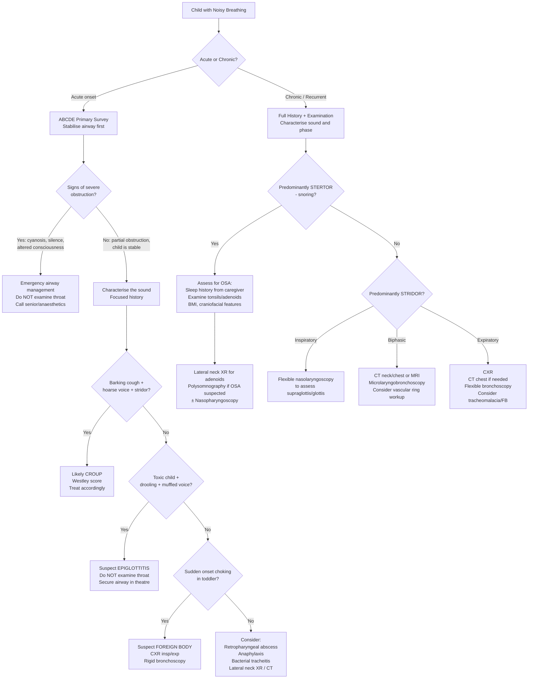

## Diagnostic Criteria, Algorithm, and Investigations for Noisy Breathing / Snoring in Children

---

### Diagnostic Criteria

Noisy breathing itself is a **symptom**, not a single diagnosis — so there is no single set of diagnostic criteria for "noisy breathing." Instead, diagnostic criteria exist for the **specific conditions** that cause it. The two most important sets of criteria in paediatric practice are for **Obstructive Sleep Apnoea (OSA)** and **Croup severity scoring**, because these directly change management.

#### A. Paediatric Obstructive Sleep Apnoea — Diagnostic Criteria

OSA is defined by the combination of **clinical features + polysomnographic confirmation**. The gold standard diagnosis is by **overnight polysomnography (PSG)**.

**ICSD-3 (International Classification of Sleep Disorders, 3rd edition) criteria for paediatric OSA** require **both** of:

1. **Clinical**: The caregiver reports at least ONE of:
   - Snoring
   - Laboured, paradoxical, or obstructed breathing during sleep
   - Sleepiness, hyperactivity, behavioural problems, or learning difficulties

2. **Polysomnographic**: ***AHI > 1 event/hour*** [2] (obstructive apnoeas, mixed apnoeas, or obstructive hypopnoeas per hour of sleep)
   - OR an obstructive hypoventilation pattern: > 25% of total sleep time with CO₂ > 50 mmHg (end-tidal or transcutaneous) PLUS snoring, paradoxical breathing, or flattened nasal pressure waveforms

<Callout title="Paediatric vs Adult AHI Cut-offs">

***In adults: Normal AHI < 5; Mild OSA = 5–15; Moderate = 15–30; Severe = > 30*** [2].

***In children: AHI > 1 is abnormal*** [2]. Paediatric severity grading:
- Mild: AHI 1–5
- Moderate: AHI 5–10
- Severe: AHI > 10

Why is the threshold so much lower in children? Because the developing brain is exquisitely sensitive to even small amounts of sleep fragmentation and intermittent hypoxia. Children also have higher baseline respiratory rates and smaller oxygen reserves (higher metabolic rate relative to FRC), so even brief apnoeas cause faster desaturation.
</Callout>

#### B. ***Westley Croup Severity Score*** [3]

This is the validated scoring system for acute croup that directly guides management:

| Parameter | Score 0 | Score 1 | Score 2 | Score 3 | Score 4 | Score 5 |
|---|---|---|---|---|---|---|
| ***Level of consciousness*** | ***Normal incl sleep*** | — | — | — | — | ***Disoriented*** |
| ***Cyanosis*** | ***None*** | — | — | — | ***With agitation*** | ***At rest*** |
| ***Stridor*** | ***None*** | ***With agitation*** | ***At rest*** | — | — | — |
| ***Air entry*** | ***Normal*** | ***Decreased*** | ***Markedly decreased*** | — | — | — |
| ***Retraction*** | ***None*** | ***Mild*** | ***Moderate*** | ***Severe*** | — | — |

***Severity interpretation*** [3]:
- ***≤2 points → Mild: home treatment with symptomatic care ± PO dexamethasone***
- ***3–7 points → Moderate: outpatient treatment with PO dexamethasone + nebulised adrenaline***
- ***8–11 points → Severe: hospitalisation with same treatment***
- ***≥12 points → Critical: ICU admission with IM/IV dexamethasone ± repeated nebulised adrenaline***

> The Westley score is elegant because it uses **objective physiological parameters**: consciousness (reflecting cerebral oxygenation), cyanosis (reflecting SpO₂), stridor timing (reflecting degree of obstruction — at rest is worse than only on agitation because the child is generating more negative pressure during agitation anyway, so stridor at rest means even calm breathing is obstructed), air entry (reflecting actual airflow through the obstruction), and chest wall retractions (reflecting the work of breathing needed to overcome the obstruction).

#### C. Severity Assessment for Stridor (General) [3]

***Severity can be assessed by*** [3]:
- ***Degree of stridor: none → only on crying → at rest → biphasic*** — this reflects worsening obstruction because: stridor only on crying means the child needs to generate high flow (high negative pressure) to produce turbulence through the narrowed airway; stridor at rest means even tidal breathing is obstructed; biphasic means the obstruction is severe enough to affect both phases.
- ***Degree of chest recession: none → only on crying → at rest*** — more recession = more negative intrathoracic pressure needed = higher resistance.

---

### Diagnostic Algorithm

The approach differs depending on whether the noisy breathing is **acute** (emergency stabilisation first) or **chronic** (systematic workup).

#### Overall Algorithm

#### Acute Noisy Breathing — Step-by-Step

1. **ABCDE primary survey** [1]: The first priority is always airway stabilisation, not diagnosis.
   - ***Look for: see-saw respirations, use of accessory muscles, central cyanosis (late feature)*** [1]
   - ***Listen for: stertor, stridor, wheeze, gurgling, rattling, crowing*** [1]
   - ***Silence for complete obstruction or apnoea*** [1]
   - ***Feel for: expired air at mouth/nose*** [1]

2. **Stabilise** → then take a focused history (age, tempo of onset, preceding URTI, choking episode, allergies, immunisation status).

3. **Characterise the sound** → this directs the differential and investigation pathway (as per the algorithm above).

4. **Targeted investigations** based on the leading differential (see Investigation Modalities below).

#### Chronic Noisy Breathing / Habitual Snoring — Step-by-Step

***The approach to chronic snoring in a child follows a systematic evaluation*** [2]:

1. **Detailed sleep history from caregiver** (the child often cannot report their own sleep quality):
   - ***Sleep history: bedtime, duration until sleep onset, final awakening, nap times, self-rated sleep quality*** [6]
   - ***Nighttime symptoms: abnormal movement, parasomnia, snoring, breathing problems — try to include history from bed partner/caregiver*** [6]
   - ***Daytime symptoms: sleepiness, impact on functioning and mood*** [6]
   - Specifically for children: school performance, behavioural problems, hyperactivity, morning headaches, secondary enuresis
   - Video recording of the child sleeping (taken by parents on a smartphone) — extremely useful and increasingly used in paediatric practice

2. **Screening questionnaires**:
   - **Paediatric Sleep Questionnaire (PSQ)** — validated for children aged 2–18; screens for sleep-disordered breathing. A score ≥ 0.33 (i.e. ≥8/22 positive items) has ~85% sensitivity and ~87% specificity for OSA.
   - ***Epworth Sleepiness Scale*** [2] — more useful in adolescents; less validated in young children because daytime sleepiness is not the predominant feature.
   - **Modified Epworth for children (MESC)** — adapted version for parental report.
   - **OSA-18 quality of life questionnaire** — measures the impact of OSA on quality of life in children.

3. **Physical examination** — as detailed in previous sections (adenoid facies, tonsil grading, BMI, craniofacial features, nasal examination, chest, cardiac).

4. **Investigations** — guided by clinical findings (see below).

---

### Investigation Modalities — Detailed

#### 1. Polysomnography (PSG) — The Gold Standard for OSA

**What it is**: An overnight sleep study that simultaneously records multiple physiological parameters during sleep.

**What it measures** (the name tells you: "poly" = many, "somno" = sleep, "graphy" = recording):
- **EEG** (electroencephalogram) — brain waves → determines sleep stage and arousals
- **EOG** (electro-oculogram) — eye movements → distinguishes REM from NREM sleep
- **EMG** (electromyogram) — chin and limb muscle tone → detects REM atonia, limb movements
- **Nasal airflow** (thermistor and nasal pressure transducer) → detects apnoeas and hypopnoeas
- **Thoracic and abdominal respiratory effort** (impedance bands) → distinguishes **obstructive** (effort present but no flow) from **central** (no effort, no flow) apnoea
- **Pulse oximetry** (SpO₂) → detects desaturations
- **ECG** — heart rate and rhythm
- **End-tidal or transcutaneous CO₂** (capnography) — particularly important in children because they may show obstructive hypoventilation without discrete apnoeic events
- **Body position** — supine vs lateral
- **Video** — records movements, abnormal breathing patterns
- **Sound/microphone** — records snoring

**Key findings and interpretation in paediatric OSA**:

| Parameter | Normal | Abnormal in OSA |
|---|---|---|
| ***AHI*** | ***≤1 event/hour*** | ***> 1 = OSA; Mild 1–5; Moderate 5–10; Severe > 10*** [2] |
| Obstructive Apnoea Index (OAI) | ≤1 | > 1 supports diagnosis |
| SpO₂ nadir | > 92% | < 92% = significant desaturation; < 85% = severe |
| Time with SpO₂ < 90% | Minimal | > 2% of TST = significant |
| End-tidal CO₂ > 50 mmHg | < 25% of TST | > 25% of TST = obstructive hypoventilation |
| Arousal index | < 10/hr | Elevated in OSA (but children may have fewer arousals than adults for same severity — higher arousal threshold) |

**Why is PSG the gold standard?** Because clinical assessment alone (history + exam) has poor sensitivity and specificity for paediatric OSA — studies show that even experienced clinicians correctly predict PSG findings only ~50–60% of the time. Tonsil size does NOT reliably correlate with AHI (a child with grade 2 tonsils can have severe OSA if they have a narrow airway or hypotonia).

<Callout title="When to Order PSG in Children" type="idea">
**American Academy of Pediatrics (AAP) 2012/2024 guidelines** recommend PSG for children with snoring + any of the following before adenotonsillectomy:
- Age < 2 years
- Obesity
- Down syndrome or craniofacial abnormalities
- Neuromuscular disorders
- Sickle cell disease
- Mucopolysaccharidoses
- Discordance between tonsil size and symptom severity
- When the family prefers watchful waiting and needs objective data
- After adenotonsillectomy if symptoms persist (to assess for residual OSA)

In practice, in HK, PSG availability is limited, and many children with straightforward adenotonsillar hypertrophy and classical OSA symptoms proceed to adenotonsillectomy without PSG. However, PSG is strongly recommended for the high-risk groups above.
</Callout>

#### 2. Overnight Pulse Oximetry (Nocturnal Oximetry)

**What it is**: A simplified screening tool — the child wears a pulse oximeter overnight at home.

**What it shows**: Pattern of oxygen desaturations during sleep. A "sawtooth" pattern of cyclical desaturations is characteristic of OSA (each dip corresponds to an apnoeic event followed by arousal and reoxygenation).

**Interpretation (McGill Oximetry Score)**:
- **Positive** (≥3 clusters of desaturations and ≥3 dips to < 90%): High positive predictive value (~97%) for moderate-severe OSA → can proceed to surgery without PSG.
- **Negative/Inconclusive**: Does NOT rule out OSA (sensitivity only ~40–70%). A normal oximetry does not exclude mild-moderate OSA because the child may not desaturate significantly. Needs PSG for definitive assessment.

**Why use it?** It is cheap, non-invasive, can be done at home, and is widely available — useful as a **screening tool** when PSG is not accessible. In HK, where PSG waiting lists can be long, nocturnal oximetry is commonly used in paediatric practice.

#### 3. Flexible Nasopharyngolaryngoscopy (FNL)

**What it is**: A thin flexible fibre-optic endoscope passed through the nose to directly visualise the nasal passages, nasopharynx, oropharynx, supraglottis, glottis, and subglottis.

**When to use it**: This is the **first-line investigation for stridor** — both acute (once stabilised) and chronic.

**Key findings by condition**:

| Condition | FNL Findings |
|---|---|
| **Laryngomalacia** | Omega-shaped epiglottis, short aryepiglottic folds, redundant arytenoid mucosa prolapsing into the airway on inspiration |
| **Vocal cord paralysis** | Unilateral: one cord immobile in paramedian position; Bilateral: both cords adducted, narrow glottic aperture |
| **Subglottic stenosis** | Narrowed subglottic lumen (may need to assess with rigid bronchoscopy for grading) |
| **Subglottic haemangioma** | Smooth, compressible, submucosal mass in the subglottis (usually posterolateral, left > right) |
| **Laryngeal papillomatosis** | Warty, exophytic, grape-like masses on vocal cords ± subglottis |
| **Epiglottitis** | Cherry-red, swollen epiglottis (only visualised in a controlled setting!) |
| **Adenoidal hypertrophy** | Degree of adenoidal obstruction of the nasopharynx (graded as % obstruction of choanae) |

**Practical pearl**: In children, FNL can be performed awake (with topical lignocaine spray) in cooperative children, or with light sedation. It is generally well-tolerated even in infants when done by experienced hands.

#### 4. Rigid Microlaryngoscopy and Bronchoscopy (MLB)

**What it is**: Examination under general anaesthesia with rigid instruments providing a magnified view of the entire airway from larynx to distal bronchi.

**When to use it**: When detailed assessment of the subglottis/trachea/bronchi is needed, or when intervention is planned:
- Grading of subglottic stenosis (Myer-Cotton grading: Grade I = 0–50% obstruction, II = 51–70%, III = 71–99%, IV = no detectable lumen)
- Biopsy of papillomas
- Foreign body removal (rigid bronchoscopy is therapeutic)
- Assessment of tracheomalacia (dynamic collapse seen on spontaneous ventilation)
- Assessment of vascular ring compression

#### 5. Imaging Studies

##### a. Lateral Neck X-ray (Soft Tissue Neck)

**What it shows and key findings**:

| Finding | Condition | Interpretation |
|---|---|---|
| ***Steeple (hourglass) sign*** | ***Croup*** [3] | Symmetrical narrowing of the subglottic region on AP view — the normal "shouldering" (lateral subglottic walls) is lost because mucosal oedema narrows the airway into a steeple shape |
| **Thumb sign** | Epiglottitis | Swollen epiglottis on lateral view resembles a thumb (normal epiglottis is thin like a little finger) |
| **Widened prevertebral soft tissues** | Retropharyngeal abscess | Retropharyngeal space > 7mm at C2, or > 14mm at C6 in children (rule of thumb: > ½ AP diameter of adjacent vertebral body). In young children, this can be falsely positive during expiration/crying — ideally taken during inspiration with neck in extension |
| **Adenoidal enlargement** | Adenoidal hypertrophy | Lateral view shows soft tissue mass in the nasopharynx narrowing the nasopharyngeal airway. Ratio of adenoid to nasopharyngeal space can be estimated (Fujioka adenoidal-nasopharyngeal ratio > 0.8 = significant) |

***Imaging for croup: NOT indicated if clinically suggestive*** [3]. Only obtain if diagnosis is unclear or atypical features are present (e.g. no response to treatment, concern for foreign body or retropharyngeal abscess).

##### b. Chest X-ray (CXR)

**When**: Suspected foreign body, lower airway pathology, cardiac assessment.

**Key findings**:

| Finding | Condition | Interpretation |
|---|---|---|
| **Unilateral hyperinflation** | Foreign body (bronchial) | Ball-valve effect: air enters past the FB on inspiration but cannot escape on expiration → air trapping → hyperinflated hemithorax with mediastinal shift to the contralateral side. Best seen on **expiratory film** or **lateral decubitus** film (the affected side does not deflate) |
| **Radio-opaque FB** | Foreign body | Only ~10% of aspirated FBs are radio-opaque (e.g. coins, metallic objects). Organic material (peanuts, food) is radiolucent |
| **Cardiomegaly** | Cor pulmonale from chronic severe OSA | Right heart enlargement from pulmonary hypertension |
| **Pulmonary infiltrates** | Pneumonia, post-obstructive atelectasis | Consolidation, atelectasis distal to an obstructing lesion |

##### c. CT Scan (Neck / Chest / CT Angiography)

| Indication | What it shows |
|---|---|
| **CT neck with contrast** | Deep neck space infections (retropharyngeal abscess — ring-enhancing collection), extent of neck masses (cystic hygroma, tumour) |
| **CT chest** | Mediastinal masses, vascular anomalies (CT angiography for vascular ring — best non-invasive modality to delineate the vascular anatomy) |
| **CT airway (virtual bronchoscopy)** | Can reconstruct 3D airway images — useful for subglottic stenosis grading, tracheal compression assessment |

##### d. MRI

- **MRI neck/chest**: Useful for soft tissue detail without radiation — subglottic haemangioma (enhances with gadolinium), extent of lymphatic malformations, vascular rings.
- **MRI brain/posterior fossa**: If bilateral vocal cord paralysis → look for Arnold-Chiari malformation (herniation of cerebellar tonsils through foramen magnum → brainstem compression → bilateral vagal nuclei dysfunction).

##### e. Barium Swallow / Contrast Swallow Study

**When**: Suspected vascular ring (dysphagia + stridor), tracheo-oesophageal fistula, aspiration.

**Key findings**:
- **Vascular ring**: Posterior indentation of the oesophagus by the aberrant vessel on lateral view; bilateral indentation on AP view (double aortic arch).
- **Aspiration**: Contrast enters the airway during swallowing → suggests laryngeal cleft, vocal cord paralysis, or swallowing dysfunction.

#### 6. Other Investigations

##### a. Blood Tests

| Test | When | Why |
|---|---|---|
| **FBC, CRP** | Acute infections (epiglottitis, retropharyngeal abscess, bacterial tracheitis) | Elevated WCC and CRP support bacterial infection; helps distinguish viral croup (mild elevation) from bacterial superinfection |
| **Blood gas (ABG/CBG)** | Severe respiratory distress, altered consciousness | Hypoxia (↓PaO₂), hypercapnia (↑PaCO₂) indicates respiratory failure; respiratory acidosis suggests decompensation |
| **TFTs** | Chronic snoring with other hypothyroid features | ***Hypothyroidism*** causes submucosal infiltration and narrowing of URT [2], macroglossia, and hypotonia — all contributing to airway obstruction |
| **Calcium** | Laryngospasm (crowing) | ***Hypocalcaemia*** causes laryngospasm — check ionised calcium. In neonates, consider DiGeorge syndrome |
| **Iron studies** | Restless sleep, limb movements | Iron deficiency → restless leg syndrome → sleep fragmentation that may mimic or coexist with OSA |

##### b. Echocardiography

**When**: Chronic severe OSA with suspected pulmonary hypertension / cor pulmonale, or when a vascular ring is suspected (echocardiography may show aortic arch sidedness but CT angiography is more definitive for ring anatomy).

**Findings in cor pulmonale**: Right ventricular hypertrophy, RV dilatation, tricuspid regurgitation, estimated PA systolic pressure elevated.

##### c. Sleep Nasendoscopy (Drug-Induced Sleep Endoscopy — DISE)

**What it is**: FNL performed while the child is in a pharmacologically induced sleep (using propofol or midazolam). This allows direct visualisation of the level and pattern of pharyngeal collapse **during sleep**, mimicking the conditions that produce OSA.

**When**: Useful when the site of obstruction is unclear, especially in children with **persistent OSA after adenotonsillectomy**, or in children with **Down syndrome, craniofacial anomalies, or obesity** where the obstruction may be multilevel.

**Findings**: Concentric collapse (velum), anteroposterior collapse (tongue base), lateral wall collapse — guides further surgical planning.

---

### Summary: Which Investigations for Which Presentation?

| Clinical Scenario | First-Line Investigation | Additional / Second-Line |
|---|---|---|
| **Acute stridor with barking cough — classic croup** | ***Clinical diagnosis; imaging NOT indicated*** [3] | Neck XR only if atypical |
| **Acute stridor, toxic child, drooling** | DO NOT examine throat; lateral neck XR if safe → **thumb sign** | Blood cultures after airway secured; MLB in theatre |
| **Acute choking episode in toddler** | CXR (inspiratory + expiratory views) | Rigid bronchoscopy (diagnostic + therapeutic) |
| **Chronic inspiratory stridor since infancy** | Flexible nasolaryngoscopy | ± MLB if subglottic pathology suspected |
| **Habitual snoring, suspected OSA** | Overnight pulse oximetry (screening) | **PSG (gold standard)** for definitive diagnosis; lateral neck XR for adenoid size |
| **Recurrent croup** | Flexible nasolaryngoscopy + MLB | CT/MRI to assess for subglottic stenosis, haemangioma, vascular ring |
| **Biphasic stridor since birth** | Flexible nasolaryngoscopy → MLB | CT angiography if vascular ring suspected; MRI if haemangioma suspected |
| **Stridor + dysphagia** | Barium swallow | CT angiography for vascular ring; MLB |
| **Bilateral vocal cord paralysis** | FNL → confirm immobile cords | MRI brain/posterior fossa (Arnold-Chiari malformation) |

---

### Key Interpretation Pitfalls in Paediatric Investigations

<Callout title="Common Interpretation Pitfalls" type="error">

1. **Lateral neck XR — false positive prevertebral widening**: In young children, crying or neck flexion causes the retropharyngeal tissues to appear thickened. Always ensure the film is taken during **inspiration** with the neck in **extension** — otherwise you may overcall a retropharyngeal abscess.

2. **Normal CXR does NOT exclude foreign body**: Up to 30% of bronchial foreign bodies show a normal CXR. If clinical suspicion is high (witnessed choking episode), proceed to rigid bronchoscopy regardless.

3. **Nocturnal oximetry: positive is useful, negative is NOT reassuring**: A positive oximetry (sawtooth desaturations) has high PPV for OSA, but a negative result has poor sensitivity — it does not exclude mild-moderate OSA. PSG is needed if clinical suspicion remains.

4. **Tonsil size does not predict OSA severity**: A child with grade 2 tonsils but a narrow craniofacial framework or hypotonia may have worse OSA than a child with grade 4 tonsils. PSG is needed for objective severity assessment.

5. ***Imaging for croup is NOT indicated if clinically suggestive*** [3]: Do not delay treatment to obtain imaging. The steeple sign is only ~50% sensitive — a normal XR does not exclude croup.
</Callout>

---

<Callout title="High Yield Summary — Diagnosis and Investigations">

1. **PSG is the gold standard for paediatric OSA diagnosis**. ***AHI > 1 = abnormal in children*** [2]. Record EEG, EOG, EMG, airflow, respiratory effort, SpO₂, CO₂, ECG, video, sound.

2. **Nocturnal oximetry** is a useful screening tool: positive result (McGill criteria) has high PPV; negative does NOT rule out OSA.

3. ***Croup is a clinical diagnosis — imaging NOT indicated if clinically suggestive*** [3]. ***Westley score*** guides management severity [3].

4. **Flexible nasolaryngoscopy (FNL)** is the first-line investigation for **chronic stridor** — it directly visualises the airway from nose to glottis.

5. **Rigid MLB under GA** is needed for subglottic assessment, FB removal, and grading of stenosis.

6. **Lateral neck XR**: Steeple sign (croup), thumb sign (epiglottitis), prevertebral widening (retropharyngeal abscess), adenoidal size.

7. **CXR for foreign body**: Look for unilateral hyperinflation on expiratory film. Normal CXR does not exclude FB — proceed to bronchoscopy if clinical suspicion is high.

8. **CT angiography** is the investigation of choice for **vascular ring**.

9. **MRI posterior fossa** if bilateral vocal cord paralysis → rule out Arnold-Chiari malformation.

10. Always check **TFTs** (hypothyroidism), **calcium** (hypocalcaemia → laryngospasm), and **iron studies** (iron deficiency → restless legs) as part of the workup for chronic noisy breathing/sleep disturbance.
</Callout>

---

<ActiveRecallQuiz
  title="Active Recall - Diagnosis and Investigations for Noisy Breathing / Snoring"
  items={[
    {
      question: "What is the gold standard investigation for diagnosing paediatric OSA, and what AHI threshold defines OSA in children? Why is the threshold different from adults?",
      markscheme: "Gold standard: Overnight polysomnography (PSG). Paediatric OSA defined as AHI greater than 1 event per hour (vs greater than 5 in adults). The threshold is lower because the developing brain is more vulnerable to sleep fragmentation and intermittent hypoxia, and children have smaller oxygen reserves (higher metabolic rate relative to FRC) so even brief apnoeas cause faster desaturation."
    },
    {
      question: "A 2-year-old presents with barking cough, hoarse voice, and inspiratory stridor after 2 days of coryza. Should you order a neck X-ray? What would you see if you did, and what scoring system guides your management?",
      markscheme: "Imaging is NOT indicated if clinically suggestive of croup. If obtained, AP neck XR shows the steeple or hourglass sign (symmetrical subglottic narrowing, loss of normal shouldering). Westley Croup Severity Score guides management: scores consciousness, cyanosis, stridor, air entry, and retractions (max 17 points). Score 2 or less = mild (home care +/- dexamethasone); 3-7 = moderate (dexamethasone + nebulised adrenaline); 8-11 = severe (hospitalise); 12 or more = ICU."
    },
    {
      question: "A 5-year-old habitual snorer undergoes overnight pulse oximetry which is reported as normal. Can you confidently exclude OSA? Explain your reasoning.",
      markscheme: "No, a normal overnight pulse oximetry does NOT exclude OSA. Nocturnal oximetry has high positive predictive value (a positive result with sawtooth desaturations strongly suggests OSA) but POOR sensitivity (only 40-70%). Mild-moderate OSA may cause sleep fragmentation and arousals without significant oxygen desaturation. Polysomnography is needed for definitive assessment if clinical suspicion remains."
    },
    {
      question: "Name 3 key findings on lateral neck X-ray and the conditions they suggest.",
      markscheme: "(1) Steeple/hourglass sign on AP view = croup (symmetrical subglottic narrowing from mucosal oedema). (2) Thumb sign on lateral view = epiglottitis (swollen epiglottis resembles a thumb). (3) Widened prevertebral soft tissues = retropharyngeal abscess (retropharyngeal space greater than 7mm at C2 or greater than half the AP diameter of the adjacent vertebral body). Pitfall: prevertebral widening can be falsely positive if the film is taken during expiration or with neck flexion in a young child."
    },
    {
      question: "A 3-month-old infant has progressive biphasic stridor and is found to have multiple cutaneous haemangiomas on the chin and lower lip. What airway diagnosis should you suspect, what investigation confirms it, and what will it show?",
      markscheme: "Suspect subglottic haemangioma. Beard distribution cutaneous haemangiomas (chin, lip, mandible, anterior neck) have a 50% association with airway haemangiomas. Confirm with flexible nasolaryngoscopy (may see smooth submucosal mass in subglottis, usually posterolateral) and MRI neck (shows enhancing subglottic mass with gadolinium). Rigid microlaryngobronchoscopy under GA provides definitive assessment. Biopsy is generally avoided due to bleeding risk."
    }
  ]}
/>

## References

[1] Senior notes: Ryan Ho Critical Care.pdf (Section 1.1 Primary Survey)
[2] Senior notes: Ryan Ho Respiratory.pdf (Section 3.8 Sleep-Associated Disorders, including 3.8.2 Sleep Apnoea/Hypopnoea Syndrome)
[3] Senior notes: Adrian Lui Pediatrics.pdf (Pages 155, 161 — Causes of stridor, Croup, severity assessment)
[6] Senior notes: Ryan Ho Psychiatry.pdf (Section 9.2 Sleep Disorders — evaluation approach, polysomnography, sleep diary)
