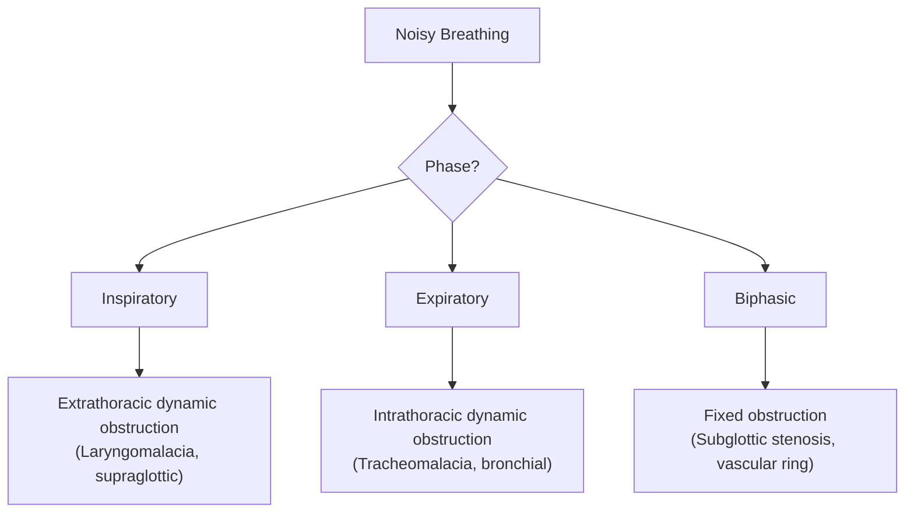
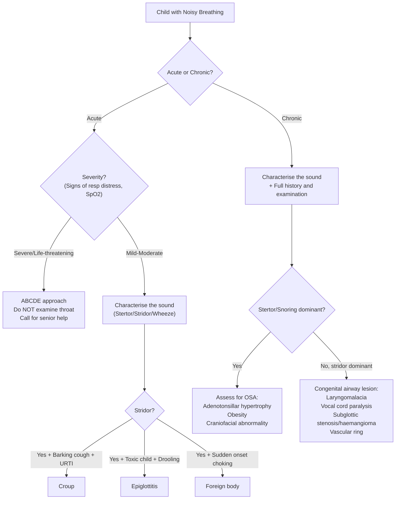

# Noisy Breathing / Snoring in Children

## Definition and Terminology

"Noisy breathing" is an umbrella term for any audible sound produced during respiration in a child. It is one of the most common presenting complaints in paediatrics — and the key clinical skill is to **localise the level of obstruction from the sound character alone**, because the sound tells you where the problem is.

Let's break down the key terms:

| Sound | Meaning | Level of Obstruction | Phase | Pathophysiology |
|---|---|---|---|---|
| ***Stertor (snoring)*** | ***Low-pitched inspiratory sound indicating turbulent flow above the larynx, usually due to tongue occluding the pharynx*** [1] | Nose / nasopharynx / oropharynx (supraglottic) | Predominantly inspiratory | Turbulent airflow through a narrowed but floppy supraglottic passage |
| ***Stridor*** | ***High-pitched monophonic sound heard during breathing indicating obstruction of large airways*** [1] | Larynx / extrathoracic trachea (glottic/subglottic) or intrathoracic large airways | Inspiratory (extrathoracic), expiratory (intrathoracic), or biphasic (fixed/glottic) | Bernoulli effect — negative intraluminal pressure during inspiration collapses a floppy or narrowed extrathoracic airway |
| ***Wheeze*** | ***High-pitched expiratory monophonic or polyphonic sound indicating obstruction of small airways*** [1] | Intrathoracic small airways (bronchi/bronchioles) | Predominantly expiratory | Positive intrathoracic pressure during expiration narrows already-obstructed intrathoracic airways |
| ***Gurgling*** | ***Fluid in mouth/upper airway*** [1] | Oropharynx | Variable | Liquid secretions vibrating with airflow |
| ***Rattling*** | ***Secretions in airway*** [1] | Larger airways | Variable | Mucus or secretions oscillating in medium-sized airways |
| ***Crowing*** | ***Laryngospasm*** [1] | Glottic | Inspiratory | Involuntary vocal cord adduction |

> **Why does the phase of the respiratory cycle matter?** During **inspiration**, intraluminal pressure in the **extrathoracic** airway becomes negative (to draw air in), so a floppy or narrowed extrathoracic airway collapses → **inspiratory** noise. During **expiration**, intrathoracic pressure rises, compressing **intrathoracic** airways → **expiratory** noise. A **fixed** obstruction (e.g. subglottic stenosis, vascular ring) does not change with the respiratory cycle → **biphasic** noise.

<Callout title="Key Concept: Sound = Level" type="idea">
The character and phase of noisy breathing is your free localisation tool. Stertor = above larynx. Inspiratory stridor = larynx/extrathoracic trachea. Expiratory stridor or wheeze = intrathoracic. Biphasic = fixed lesion at/near the glottis. Always listen before you scope.
</Callout>

---

## Epidemiology

### General
- Noisy breathing is **extremely common** in infancy — up to 10–20% of infants will have some degree of audible breathing in the first year of life [3].
- **Laryngomalacia** is the **single most common cause of stridor in infants** (60–75% of congenital stridor cases) and peaks at 4–8 months of age [3].
- **Snoring** (stertor) is reported in **7–12% of all children** and is a cardinal symptom of **obstructive sleep apnoea (OSA)** in childhood [2][4].
- ***In children, the AHI cut-off for OSA is > 1*** (compared to > 5 in adults) — children are much more sensitive to the effects of sleep fragmentation [2].
- **Adenotonsillar hypertrophy** is the **most common cause of paediatric OSA**, peaking at ages 2–8 years (coinciding with peak lymphoid tissue growth relative to airway size) [2].

### Hong Kong Context
- In Hong Kong, the prevalence of **habitual snoring** in children is approximately **8–10%**, and OSA affects around **2–5%** of children [4].
- Allergic rhinitis prevalence in HK children is very high (~40% in school-age children) and is a significant contributor to chronic nasal obstruction and snoring.
- Air pollution in urban HK contributes to mucosal inflammation and adenoidal hypertrophy.
- Craniofacial features in the East Asian population (relatively smaller mid-face, flatter nasal bridge) may predispose to narrower nasopharyngeal dimensions, making adenoidal obstruction more clinically significant for a given degree of hypertrophy.

---

## Risk Factors

### For Snoring / OSA specifically in children:
1. **Adenotonsillar hypertrophy** — the dominant risk factor in children aged 2–8 years. Why? Lymphoid tissue grows disproportionately fast relative to the bony airway framework during this age.
2. **Obesity** — ***parapharyngeal fat deposits narrow airway*** [2]; increasingly relevant as childhood obesity rises in HK. Obesity also reduces lung volumes (↓FRC) which reduces tethering effect on upper airway, making it more collapsible.
3. **Craniofacial abnormalities** — ***micrognathia (undersized jaw)***, midface hypoplasia (e.g. Down syndrome, Treacher Collins, Pierre Robin sequence). Why? The mandible is the scaffold for the tongue base; a small mandible → tongue falls posteriorly → supraglottic obstruction.
4. **Neuromuscular disorders** — cerebral palsy, muscular dystrophies, hypotonic conditions. Why? Reduced pharyngeal muscle tone → inability to maintain airway patency during sleep when central drive falls.
5. **Allergic rhinitis / chronic rhinosinusitis** — mucosal oedema narrows the nasal airway, forcing mouth-breathing, which itself worsens pharyngeal collapsibility (loss of nasal CPAP effect and increased pharyngeal resistance).
6. **Prematurity** — immature cartilaginous framework, hypotonia, and susceptibility to subglottic stenosis (from prior intubation).
7. ***Alcohol and sedatives (relaxes upper airway dilating muscles)*** [2] — relevant in adolescents; also medications like antihistamines with sedating properties.
8. **Gastro-oesophageal reflux (GOR)** — acid reflux can cause laryngeal oedema (posterior laryngitis) and contribute to laryngomalacia severity.
9. **Genetic syndromes** — Down syndrome (hypotonia + relative macroglossia + midface hypoplasia), Prader-Willi (obesity + hypotonia), mucopolysaccharidoses (tissue infiltration narrowing airways), achondroplasia (midface hypoplasia + foramen magnum stenosis).

---

## Anatomy and Function

Understanding noisy breathing requires a **solid grasp of paediatric upper airway anatomy** and how it differs from adults. This is the foundation for everything that follows.

### Paediatric Airway vs Adult Airway

| Feature | Infant/Young Child | Adult | Clinical Implication |
|---|---|---|---|
| Head | Large occiput, short neck | Proportional | Neck flexion in supine position → airway obstruction; use a shoulder roll |
| Nasal breathing | **Obligate nasal breathers** up to ~4–6 months | Oro-nasal | Nasal obstruction (e.g. choanal atresia, rhinitis) in neonates → respiratory distress |
| Tongue | Relatively large for oral cavity | Proportional | Greater tendency to fall back and obstruct oropharynx |
| Epiglottis | Omega-shaped (Ω), floppy, angled at 45° | Flat, firm | More prone to prolapse over the glottis (laryngomalacia) |
| Larynx position | High (C3–C4) | Lower (C5–C6) | More anterior larynx; harder to intubate; more susceptible to supraglottic obstruction |
| Subglottis | **Narrowest point** (cricoid ring is complete, rigid ring) | Narrowest at glottis (vocal cords) | 1mm of oedema in a 4mm infant subglottis → **75% reduction in cross-sectional area** (Poiseuille's law: resistance ∝ 1/r⁴); this is why croup is devastating in infants |
| Airway cartilage | Soft, compliant | Rigid | Greater tendency to dynamic collapse (tracheomalacia, laryngomalacia) |
| Tonsils/adenoids | Grow from age ~2, peak at 5–7 years | Involuted | Peak obstruction coincides with smallest relative airway size |

<Callout title="Poiseuille's Law — Why Paediatric Airways Are Vulnerable" type="error">
Resistance to airflow ∝ 1/radius⁴. An infant's subglottis is ~4mm in diameter. Just 1mm of circumferential mucosal oedema reduces the radius from 2mm to 1mm → a **16-fold increase in resistance** (and ~75% reduction in cross-sectional area). This is why croup, which causes subglottic oedema, produces dramatic stridor in infants but is rarely a problem in adults.
</Callout>

### Functional Anatomy — Levels of the Airway

Think of the airway in **layers from outside to inside**, and from **above to below**:

```
Nose/Nasopharynx → Oropharynx → Hypopharynx → Supraglottis → Glottis → Subglottis → Trachea → Bronchi
```

1. **Nose and Nasopharynx** — Nasal passages, adenoids, choanae. Obstruction here → **stertor**, mouth breathing, nasal voice.
2. **Oropharynx** — Palatine tonsils, tongue base, soft palate. Obstruction here → **stertor/snoring**, muffled "hot potato" voice.
3. **Supraglottis** — Epiglottis, aryepiglottic folds, arytenoids. Obstruction here → **inspiratory stridor** (floppy tissues prolapse inward on inspiration).
4. **Glottis** — Vocal cords. Obstruction here → **biphasic stridor** (or hoarse voice if cords are thickened/inflamed).
5. **Subglottis** — Cricoid cartilage (the narrowest point in children). Obstruction here → **biphasic stridor with barking cough** (croup).
6. **Intrathoracic trachea and bronchi** — Obstruction here → **expiratory stridor or wheeze**.

### Upper Airway Dilator Muscles

The pharynx is a muscular tube with no rigid skeletal support (unlike the trachea with its cartilaginous rings). Patency depends on the **balance between collapsing forces and dilating forces**:

- **Collapsing forces**: Negative intraluminal pressure during inspiration, tissue weight (obesity/fat), external compression.
- **Dilating forces**: **Pharyngeal dilator muscles** (especially genioglossus, tensor palatini, geniohyoid), driven by a central neural drive that is highest during wakefulness and drops during sleep.

***During sleep, ventilatory drive drops → ↓responsiveness to blood gas changes*** [2]. Combined with ***↓neuromuscular tone of upper airway during sleep*** [2], this explains why snoring and OSA are predominantly nocturnal phenomena.

---

## Aetiology (Focus on Hong Kong)

The causes of noisy breathing in children can be organised anatomically (by level) and by onset (acute vs chronic, congenital vs acquired).

### Anatomical Classification

#### A. Nose and Nasopharynx

| Condition | Congenital/Acquired | Notes |
|---|---|---|
| **Choanal atresia/stenosis** | Congenital | Bony or membranous plate blocking posterior nares; bilateral → neonatal emergency (obligate nasal breathers); unilateral → presents later with unilateral discharge |
| **Nasal septal deviation** | Congenital or acquired (trauma) | Common; mild forms often asymptomatic |
| **Allergic rhinitis** | Acquired | **Very common in HK** (~40% school-age children); mucosal oedema → nasal obstruction → mouth breathing → snoring |
| **Adenoidal hypertrophy** | Acquired (physiological lymphoid growth) | **Most common cause of snoring/OSA in children 2–8 years**; lymphoid tissue peaks at 5–7 years |
| **Nasal polyps** | Acquired | Think of **cystic fibrosis** if polyps in a child; also seen in allergic rhinitis |
| **Pyriform aperture stenosis** | Congenital | Rare; bony narrowing of anterior nasal opening |
| **Nasopharyngeal tumour** | Acquired | **NPC** (nasopharyngeal carcinoma) is endemic in Southern Chinese/HK population; rare in young children but adolescents can be affected |

#### B. Oropharynx

| Condition | Congenital/Acquired | Notes |
|---|---|---|
| **Tonsillar hypertrophy** | Acquired | Often coexists with adenoidal hypertrophy; together they are the dominant cause of paediatric OSA |
| ***Peritonsillar abscess (quinsy)*** | Acquired (infection) | ***Listed as mural cause of upper airway obstruction*** [1]; acute onset, "hot potato" voice, trismus |
| ***Retropharyngeal abscess*** | Acquired (infection) | ***Listed as mural cause of upper airway obstruction*** [1]; neck stiffness, drooling, stridor; more common in children < 6 years (retropharyngeal lymph nodes involute after this age) |
| **Macroglossia** | Congenital | Down syndrome, Beckwith-Wiedemann syndrome, hypothyroidism, mucopolysaccharidoses |
| **Pierre Robin sequence** | Congenital | Micrognathia + glossoptosis + cleft palate → severe supraglottic obstruction in neonates |
| **Lingual thyroid / thyroglossal cyst** | Congenital | Midline tongue base mass; rare but important |

#### C. Larynx (Supraglottic, Glottic, Subglottic)

| Condition | Congenital/Acquired | Notes |
|---|---|---|
| **Laryngomalacia** | Congenital | **Most common cause of stridor in infants** (60–75%); floppy supraglottic structures (epiglottis, aryepiglottic folds) prolapse into airway on inspiration → inspiratory stridor. Typically onset at 2 weeks, peaks at 4–8 months, resolves by 12–18 months. Worsened by feeding, crying, supine position. |
| ***Epiglottitis*** | Acquired (infection) | ***Listed as mural cause of upper airway obstruction*** [1]; acute, severe, toxic child; historically *H. influenzae* type b (now rare due to Hib vaccine in HK since 1997); currently *Staph aureus*, group A Strep, or non-typeable H. influenzae |
| ***Croup (laryngotracheobronchitis)*** | Acquired (infection) | ***Listed as infection causing upper airway obstruction*** [1]; parainfluenza virus most common; subglottic oedema → barking cough + inspiratory stridor + hoarse voice; peak age 6 months – 3 years |
| **Vocal cord paralysis** | Congenital or acquired | **2nd most common cause of congenital stridor**; unilateral → weak cry, mild stridor; bilateral → severe stridor, may need tracheostomy. Causes: birth trauma, Arnold-Chiari malformation (bilateral), idiopathic, iatrogenic (cardiac surgery → recurrent laryngeal nerve injury) |
| **Subglottic stenosis** | Congenital or acquired | Acquired form: **most common acquired cause of stridor in neonates/infants** due to prolonged intubation (pressure necrosis → fibrosis); congenital form: narrowed cricoid ring |
| **Laryngeal web/atresia** | Congenital | Web across glottis → weak/absent cry at birth + stridor; atresia = lethal if complete |
| **Subglottic haemangioma** | Congenital | Infantile haemangioma of subglottis; presents at 1–3 months, worsens as haemangioma grows (proliferative phase peaks ~5 months); may have cutaneous haemangiomas. Look for **"beard distribution"** cutaneous haemangiomas (chin, lip, mandible) — 50% association with airway haemangiomas |
| **Laryngeal papillomatosis** | Acquired (vertical HPV transmission) | Recurrent; HPV 6 and 11; hoarse voice/cry + stridor; can be recalcitrant |
| ***Laryngospasm*** | Acquired | ***Produces crowing sound*** [1]; GORD, post-extubation, hypocalcaemia |

#### D. Trachea and Bronchi

| Condition | Congenital/Acquired | Notes |
|---|---|---|
| **Tracheomalacia** | Congenital or acquired | Softened tracheal cartilage → dynamic expiratory collapse → expiratory stridor/wheeze; may be primary or secondary to vascular ring, TOF repair |
| **Vascular ring** | Congenital | Anomalous aortic arch/vessels encircle and compress trachea/oesophagus → biphasic stridor + dysphagia (dysphagia lusoria); e.g. double aortic arch, right aortic arch with aberrant left subclavian |
| ***Foreign body aspiration*** | Acquired | ***Listed as intraluminal cause of upper airway obstruction*** [1]; peak 1–3 years (oral exploration phase); peanuts/small toys; right main bronchus more common (wider, more vertical); may present with unilateral wheeze, hyperinflation on CXR, or ball-valve effect |
| **Extrinsic compression** — mediastinal mass, lymphadenopathy | Acquired | Lymphoma, TB lymphadenopathy (important in HK) |

#### E. Extrathoracic Causes

| Condition | Congenital/Acquired | Notes |
|---|---|---|
| **Cystic hygroma (lymphatic malformation)** | Congenital | Large neck mass compressing airway |
| ***Penetrating neck injury*** | Acquired | ***Listed as extramural cause*** [1] |
| ***Oesophageal foreign body*** | Acquired | ***Listed as extramural cause of upper airway obstruction*** [1]; posterior compression of trachea |

### Temporal Classification — Acute vs Chronic

This is clinically very useful because it changes your differential and urgency:

| Acute Onset | Chronic / Recurrent |
|---|---|
| Croup | Laryngomalacia |
| Epiglottitis | Adenotonsillar hypertrophy / OSA |
| Foreign body aspiration | Vocal cord paralysis |
| Anaphylaxis / angioedema | Subglottic stenosis |
| Retropharyngeal / peritonsillar abscess | Vascular ring |
| Bacterial tracheitis | Tracheomalacia |
| Laryngospasm | Laryngeal papillomatosis |
| Post-extubation stridor | Subglottic haemangioma |
| Thermal / caustic injury | Allergic rhinitis |

<Callout title="Acute vs Chronic: The Exam Pearl">
If the question says "acute onset stridor in a 2-year-old with preceding URTI" → think **croup**. If "acute onset choking episode in a toddler while eating peanuts" → think **foreign body**. If "progressive stridor since birth, worsens with feeding" → think **laryngomalacia**. If "habitual snoring with mouth breathing in a 5-year-old" → think **adenotonsillar hypertrophy**.
</Callout>

---

## Pathophysiology

### Why Does Noisy Breathing Occur? — First Principles

All noisy breathing results from **turbulent airflow**. Laminar flow is silent; turbulent flow produces sound. The transition from laminar to turbulent flow is governed by the **Reynolds number**, which increases with:
- Higher flow velocity
- Larger tube diameter (paradoxically, but in practice narrowing increases velocity → turbulence)
- Lower gas viscosity

In practice, any **narrowing** of the airway increases flow velocity through that segment (Venturi effect), which increases turbulence and produces sound. The **character** of the sound depends on:
1. **Level of narrowing** (nose vs larynx vs bronchi)
2. **Nature of the obstruction** (fixed vs dynamic)
3. **Phase of respiration** (extrathoracic = inspiratory, intrathoracic = expiratory)

### Dynamic vs Fixed Obstruction

**Dynamic obstruction** changes with the respiratory cycle:
- **Extrathoracic dynamic obstruction** (e.g. laryngomalacia): During inspiration, negative intraluminal pressure sucks in the floppy tissue → narrowing → **inspiratory stridor**. During expiration, positive pressure pushes the tissue outward → airway opens → sound lessens.
- **Intrathoracic dynamic obstruction** (e.g. tracheomalacia): During expiration, positive intrathoracic pressure compresses the floppy airway → **expiratory stridor/wheeze**. During inspiration, negative intrathoracic pressure opens the airway → sound lessens.

**Fixed obstruction** (e.g. subglottic stenosis, vascular ring, complete web) does not change with the respiratory cycle → **biphasic stridor**.



### Pathophysiology of Snoring / OSA in Children

***The pathophysiology of paediatric OSA*** involves an interplay of anatomical narrowing and neuromuscular factors:

1. **Anatomical factors (Starling resistor model)**: The pharynx behaves like a collapsible tube. The "critical closing pressure" (Pcrit) is the pressure at which the pharynx collapses. In children with adenotonsillar hypertrophy, the resting pharyngeal lumen is already narrowed, so the Pcrit is higher (more positive) → easier collapse.

2. ***During sleep, ventilatory drive drops → ↓responsiveness to blood gas changes → ↓neuromuscular tone of upper airway*** [2]. This means the pharyngeal dilator muscles (genioglossus etc.) are less active → the balance shifts toward collapse.

3. ***Inspiration → negative pressure in upper airway → ↑collapsibility*** [2]. With each breath, the already-narrowed pharynx is subjected to a suction force. If the dilator muscles cannot compensate → partial (snoring/hypopnoea) or complete (apnoea) collapse.

4. ***Result: upper airway collapses during inspiration → snoring (mild) and apnoea (severe) → arousal response to re-dilate airway and regain wakefulness drive*** [2]. This arousal-rescue cycle fragments sleep, causing daytime symptoms.

5. **In children**, the arousal threshold is actually higher than in adults (children sleep more deeply), so they may tolerate more severe obstruction before arousing — but this means they may also have longer apnoeas and worse desaturations before rescue occurs.

**Consequences of repetitive apnoea/hypopnoea cycles:**
- **Intermittent hypoxia** → sympathetic activation → HTN, endothelial dysfunction
- **Sleep fragmentation** → daytime somnolence, behavioural problems (ADHD-like), poor school performance
- **Intrathoracic pressure swings** → increased cardiac afterload → cor pulmonale (in severe cases)
- **Chronic mouth breathing** → abnormal dentofacial growth ("adenoid facies": elongated face, high-arched palate, dental malocclusion)

---

## Classification

### By Character of Sound
(As described in Definition section above — stertor, stridor, wheeze, gurgling, rattling, crowing)

### By Duration
- **Acute** ( < 2 weeks): Infectious (croup, epiglottitis), foreign body, anaphylaxis, trauma
- **Chronic** ( > 4 weeks): Congenital anomalies, adenotonsillar hypertrophy, allergic rhinitis

### By Timing in Respiratory Cycle
- Inspiratory → supraglottic/extrathoracic
- Expiratory → intrathoracic
- Biphasic → fixed/glottic/subglottic

### By Severity (for OSA specifically)
***AHI classification*** [2]:

| Severity | Adult AHI | ***Paediatric AHI*** |
|---|---|---|
| Normal | < 5 | ***≤1*** |
| Mild | 5–15 | 1–5 |
| Moderate | 15–30 | 5–10 |
| Severe | > 30 | > 10 |

### By Aetiology of Upper Airway Obstruction [1]

***Intraluminal:***
- ***Secretions, blood, vomitus***
- ***Foreign body aspiration***

***Mural (wall of the airway):***
- ***Infections: tonsillitis, peritonsillar/retropharyngeal abscess, epiglottitis, croup***
- ***Trauma***
- ***Tumour***
- ***Oedema: anaphylaxis, angioedema, post-operative***
- ***Laryngospasm***

***Extramural:***
- ***Penetrating neck injury***
- ***Tumour***
- ***Oesophageal foreign body***

---

## Clinical Features

### A. Symptoms (with pathophysiological basis)

#### 1. Snoring / Stertor
- **Description**: Low-pitched vibratory sound, predominantly during sleep, heard during inspiration.
- **Pathophysiology**: Turbulent airflow past a partially obstructed supraglottic airway (adenoids, tonsils, tongue base, soft palate vibration). The tissues vibrate like a reed instrument.
- **Key history**: Habitual vs occasional? Position-dependent (worse supine because gravity pulls tongue/soft palate posteriorly)? Worse during URTIs (adenoidal inflammation adds to existing hypertrophy)?

#### 2. Mouth Breathing
- **Description**: Child breathes predominantly through the mouth, especially during sleep.
- **Pathophysiology**: Nasal obstruction (adenoidal hypertrophy, allergic rhinitis) → nose cannot serve as the primary airway → mouth breathing compensates. Loss of the "nasal CPAP effect" (the nasal valve normally provides ~1–2 cmH₂O of positive pressure that helps stent the pharynx open) actually worsens pharyngeal collapsibility.

#### 3. ***Witnessed Apnoeas***
- **Description**: ***Pausing of breathing followed by a series of loud deep breaths*** [2].
- **Pathophysiology**: Complete pharyngeal collapse → cessation of airflow → rising CO₂ and falling O₂ → arousal → vigorous respiratory effort to reopen the airway (the loud deep breaths).
- **Ask caregivers**: "Does your child stop breathing during sleep? For how long? Does the child seem to struggle or gasp afterwards?"

#### 4. ***Nocturnal Choking***
- **Description**: ***Characteristically described as 'suffocation, gasping, choking' and resolves almost immediately on waking*** [2].
- **Pathophysiology**: Arousal from an apnoeic event brings back the wakefulness drive to the pharyngeal dilator muscles → airway reopens → immediate relief.
- **Differential for nocturnal choking in children**: OSA (resolves immediately), nocturnal asthma (a/w wheeze, takes time to settle), GORD (burning sensation, sour taste), PND from heart failure (rare in children unless structural heart disease).

#### 5. Restless Sleep / Abnormal Sleep Positions
- **Description**: Children with OSA often adopt unusual positions — hyperextending the neck, sleeping prone, or sleeping sitting up.
- **Pathophysiology**: These positions are **compensatory** — neck extension opens the hypopharynx; prone position prevents the tongue from falling posteriorly.

#### 6. ***Excessive Daytime Sleepiness*** / Behavioural Problems
- **Description**: ***Principal symptom of OSA in adults*** [2], but in **children**, the presentation is different — children more often show **behavioural problems**: hyperactivity, inattention, irritability, aggression, poor school performance. Classic daytime sleepiness is less common (though it occurs in adolescents and severe cases).
- **Pathophysiology**: Sleep fragmentation from repeated arousals → failure to achieve restorative slow-wave sleep → impaired memory consolidation, executive function, and emotional regulation. Intermittent hypoxia may also cause prefrontal cortex dysfunction.

<Callout title="Paediatric vs Adult OSA Presentation" type="error">
A common exam mistake: assuming children with OSA present like adults with daytime sleepiness. In children, the hallmark daytime feature is **behavioural disturbance** (may mimic ADHD), NOT sleepiness. Always ask about school performance, behaviour, and concentration — not just "Do you feel sleepy?"
</Callout>

#### 7. ***Unrefreshing Sleep / Morning Headache***
- **Description**: ***Wakes up unrefreshed*** [2]; ***morning headache due to desaturations, CO₂ retention*** [2].
- **Pathophysiology**: Repeated apnoeas → intermittent hypoxia + hypercapnia → cerebral vasodilation (CO₂ is a potent cerebral vasodilator) → headache on waking; poor sleep architecture → non-restorative sleep.

#### 8. ***Enuresis (Bedwetting)***
- **Description**: ***Enuresis = involuntary urination during sleep*** [2]; ***enuresis or nocturia*** [2].
- **Pathophysiology**: Multiple mechanisms:
  - Increased intrathoracic negative pressure during obstructed breathing → increased venous return → atrial stretch → ↑ANP (atrial natriuretic peptide) → ↑urine production
  - Arousal from deep sleep → confused arousal with incontinence
  - Altered ADH secretion due to sleep fragmentation
- **Clinical pearl**: Secondary enuresis (child was previously dry at night) in the context of snoring should raise suspicion for OSA. Treatment of OSA often resolves the enuresis.

#### 9. Stridor
- **Description**: High-pitched inspiratory (or biphasic) sound.
- **Pathophysiology**: As described above — narrowing at the laryngeal/subglottic level.
- **Key history**: Age of onset (congenital vs acquired), positional variation, associated with feeding or crying, response to treatment (e.g. responds to nebulised adrenaline → likely croup).

#### 10. ***Barking Cough***
- **Description**: Characteristic "seal-bark" cough.
- **Pathophysiology**: Subglottic oedema (croup) → inflammation of the vocal cords and subglottic mucosa → the swollen, stiff cords produce a characteristic resonant "bark" when they vibrate during cough. The cough mechanism involves forced expiration against a closed glottis, then sudden opening — with swollen cords, this produces the distinctive sound.

#### 11. Voice / Cry Changes
- **Hoarse voice/cry**: Vocal cord pathology (vocal cord paralysis, laryngitis, papillomatosis, intubation injury).
- **Muffled / "hot potato" voice**: Supraglottic pathology (peritonsillar abscess, epiglottitis — swollen tissues above the cords muffle the sound).
- **Weak/absent cry at birth**: Vocal cord paralysis, laryngeal web/atresia.

#### 12. Feeding Difficulties / Failure to Thrive
- **Description**: Infants with laryngomalacia or severe airway obstruction may have difficulty coordinating suck-swallow-breathe.
- **Pathophysiology**: Breathing takes priority; an obstructed infant must interrupt feeding to breathe → reduced caloric intake → failure to thrive. Also, increased work of breathing → increased metabolic demand.

#### 13. ***Dry Mouth***
- **Description**: ***Dry mouth*** [2] — due to chronic mouth breathing.
- **Pathophysiology**: Oral mucosa dries out when the nose is bypassed.

#### 14. Nasal Symptoms
- Nasal congestion, rhinorrhoea, post-nasal drip, sneezing → suggest allergic rhinitis or adenoiditis.
- Unilateral purulent discharge in a neonate → think choanal atresia; in a toddler → think nasal foreign body.

### B. Signs (with pathophysiological basis)

#### On General Inspection

1. ***Features of respiratory distress*** [1]:
   - ***Use of accessory muscles of respiration*** — sternocleidomastoid, intercostal, subcostal retractions; the child recruits additional muscles because the diaphragm alone cannot generate sufficient negative pressure to overcome the increased airway resistance.
   - ***See-saw respirations (paradoxical chest and abdominal movements with chest collapsing when abdomen is bulging out)*** [1] — in upper airway obstruction, the diaphragm contracts (abdomen rises) but air cannot enter the chest → chest wall is sucked inward.
   - ***Central cyanosis (late feature)*** [1] — when SpO₂ drops below ~85% (needs > 5g/dL deoxyHb), indicating severely compromised gas exchange. This is a **pre-arrest sign** in acute airway obstruction.
   - **Tracheal tug** — visible descent of the trachea during inspiration, indicating increased inspiratory effort.
   - **Nasal flaring** — dilation of the nares during inspiration to reduce nasal airway resistance; a sign of respiratory distress particularly prominent in infants.
   - **Head bobbing** — rhythmic extension of the neck with each breath; a sign of severe respiratory distress in infants (the sternocleidomastoid pulls the head forward as an accessory muscle of respiration).

2. **Growth parameters** — Plot height, weight, and BMI. Obese children → risk factor for OSA. Failure to thrive → suggests severe airway obstruction with feeding difficulties or increased metabolic demand.

3. **"Adenoid facies"** — The classic appearance of a child with chronic upper airway obstruction from adenotonsillar hypertrophy:
   - Long face (dolichocephalic)
   - Open mouth posture
   - High-arched palate (because the tongue sits low instead of moulding the palate)
   - Dental malocclusion, crowded teeth
   - "Gummy" smile
   - Dark periorbital circles ("allergic shiners" — venous congestion from nasal obstruction)
   - **Pathophysiology**: Chronic mouth breathing during the critical years of facial growth (age 2–10) → the tongue does not rest against the palate → palate narrows and heightens → mandible drops → elongated facial growth pattern.

4. **Pectus excavatum / Harrison's sulcus** — In chronic severe obstruction, repeated forceful diaphragmatic contractions against the obstruction → inward deformation of the lower chest wall at the diaphragmatic insertion. This is more common in young children with compliant chest walls.

#### On Head and Neck Examination

5. **Craniofacial assessment**:
   - ***Micrognathia (undersized jaw)*** [2] — Pierre Robin, Treacher Collins, Goldenhar syndrome → tongue base falls posteriorly.
   - ***Midface hypoplasia*** — Down syndrome, achondroplasia, Apert/Crouzon syndromes.
   - ***Thick neck*** [2] — May indicate obesity or lymphadenopathy.
   - **Neck masses** — Cystic hygroma, thyroglossal cyst, branchial cleft cyst → external compression.

6. **Nasal examination**:
   - Anterior rhinoscopy: turbinate hypertrophy (allergic rhinitis — pale, boggy mucosa), polyps, septal deviation.
   - Patency: Misting of a cold metal spatula held below each nostril (neonatal choanal atresia test), or passage of a fine suction catheter.

7. **Oral examination**:
   - **Tonsillar size** (Brodsky grading):
     - Grade 0: Tonsils within tonsillar fossa
     - Grade 1: < 25% of oropharyngeal space
     - Grade 2: 25–50%
     - Grade 3: 50–75%
     - Grade 4: > 75% (kissing tonsils — virtually touching in the midline)
   - ***Pharyngeal crowding, macroglossia, adenotonsillar enlargement*** [2]
   - ***Mallampati score / Friedman tongue position*** [2] — assess the degree of oropharyngeal crowding (though this is more relevant in adults/adolescents).
   - **Palate**: High-arched (chronic mouth breathing), cleft (Pierre Robin), submucosal cleft (bifid uvula as a clue).

8. **Drooling** — Inability to swallow saliva suggests severe supraglottic obstruction (epiglottitis, retropharyngeal abscess) or neuromuscular dysfunction.

#### On Chest Examination

9. **Auscultation** — This is where you characterise the noisy breathing:
   - **Stertor**: Low-pitched snoring sound; best heard over the nose/mouth without a stethoscope.
   - **Stridor**: High-pitched; listen over the neck (trachea) — timing (inspiratory/expiratory/biphasic) localises the lesion.
   - **Transmitted upper airway sounds**: Large airway sounds can transmit to the chest and be mistaken for lower airway pathology. **Key differentiation**: Transmitted sounds are equally loud over the trachea and periphery and are monophonic; true lower airway sounds are louder peripherally and may be polyphonic.
   - **Wheeze**: High-pitched expiratory sounds heard with stethoscope over the chest; suggests lower airway narrowing. **Unilateral wheeze** → foreign body or endobronchial lesion.
   - ***Silence for complete obstruction or apnoea*** [1] — **absence of breath sounds is more dangerous than noisy breathing**; it means no air is moving.

<Callout title="Critical Point: Silence is Worse Than Noise" type="error">
***Silence for complete obstruction or apnoea*** [1]. A suddenly quiet child who was previously stridulous is a **pre-arrest emergency** — it means the obstruction has become complete and NO air is moving. Noisy breathing at least means some air is getting through. Never be reassured by the disappearance of stridor in a deteriorating child.
</Callout>

10. **Chest wall deformity** — Pectus excavatum, Harrison's sulcus (see above).

11. **Cardiac examination** — Important because:
    - Severe, chronic upper airway obstruction → pulmonary hypertension → right heart failure (cor pulmonale): look for loud P2, right ventricular heave, tricuspid regurgitation murmur, hepatomegaly, peripheral oedema.
    - Congenital heart disease may coexist with airway anomalies (e.g. vascular ring causing stridor).

#### Other Signs

12. **Cutaneous haemangiomas** — "Beard distribution" (chin, lower lip, anterior neck) → 50% risk of airway (subglottic) haemangioma. Always examine the skin of an infant with stridor.

13. **Syndromic features** — Down syndrome (flat nasal bridge, macroglossia, hypotonia), Prader-Willi (obesity, hypogonadism, hypotonia), Beckwith-Wiedemann (macroglossia, omphalocele, macrosomia), mucopolysaccharidoses (coarse facies, hepatosplenomegaly).

14. **Neurological assessment** — Tone (hypotonia worsens pharyngeal collapse), bulbar function (swallowing, gag reflex), conscious level.

---

## Special Considerations by Age Group

### Neonates (0–28 days)
- **Obligate nasal breathers** → bilateral choanal atresia is a neonatal emergency
- Congenital causes predominate: laryngomalacia, vocal cord paralysis, subglottic stenosis, Pierre Robin sequence, vascular ring
- Post-intubation subglottic stenosis (if NICU stay)
- **Red flag**: Stridor at birth → think congenital structural abnormality

### Infants (1–12 months)
- Laryngomalacia (peaks 4–8 months)
- Subglottic haemangioma (proliferative phase)
- Post-viral croup begins to become relevant toward end of first year
- Consider GOR-related laryngeal oedema

### Toddlers (1–3 years)
- ***Croup*** peak incidence [1]
- ***Foreign body aspiration*** peak incidence [1] — oral exploration, running with food
- Adenotonsillar hypertrophy begins to cause significant obstruction

### Preschool and School Age (3–12 years)
- **Adenotonsillar hypertrophy / OSA** — peak age
- Allergic rhinitis increasingly prevalent
- Laryngeal papillomatosis (if vertically transmitted HPV)

### Adolescents (12–18 years)
- OSA pattern shifts toward adult-type (obesity becomes dominant risk factor over adenotonsillar hypertrophy)
- NPC (rare but endemic in HK) — unilateral nasal obstruction, bloody discharge, middle ear effusion, cervical lymphadenopathy
- Voice changes — physiological (puberty) vs pathological

---

## Approach to Noisy Breathing — Clinical Framework



<Callout title="High Yield Summary">

**Noisy Breathing / Snoring in Children — Key Points:**

1. **Sound localises the level**: Stertor = supraglottic (nose/pharynx); inspiratory stridor = extrathoracic larynx; expiratory stridor/wheeze = intrathoracic; biphasic = fixed lesion. ***Silence = complete obstruction = emergency*** [1].

2. **Paediatric airway is uniquely vulnerable**: Obligate nasal breathing (neonates), narrowest at subglottis (cricoid ring), soft compliant cartilage, relatively large tongue and tonsils. Poiseuille's law: 1mm oedema → 16× resistance increase in a 4mm airway.

3. **Most common causes by age**: Neonates = laryngomalacia (stridor), choanal atresia; Toddlers = croup, foreign body; School-age = adenotonsillar hypertrophy/OSA (snoring).

4. **Paediatric OSA differs from adult OSA**: Adenotonsillar hypertrophy is the #1 cause (not obesity). ***AHI > 1 = abnormal in children*** [2]. Daytime features are **behavioural** (hyperactivity, poor concentration), not classic sleepiness.

5. **Pathophysiology of OSA**: Anatomical narrowing (adenoids/tonsils/obesity) + loss of neuromuscular tone during sleep → pharyngeal collapse → snoring (partial) or apnoea (complete) → arousal cycle → sleep fragmentation and intermittent hypoxia.

6. **Red flags in noisy breathing**: Biphasic stridor (fixed obstruction), stridor at birth (congenital anomaly), feeding difficulties/FTT, cyanosis, apnoeic episodes, failure to thrive, abnormal cry.

7. ***ABCDE approach for acute airway obstruction*** [1]: Establish airway → look for see-saw respirations, accessory muscle use, cyanosis → listen for stertor/stridor/wheeze/silence → feel for expired air.

8. **Chronic consequences**: Cor pulmonale (severe OSA), adenoid facies, neurocognitive impairment, secondary enuresis, growth failure, pulmonary hypertension.
</Callout>

---

<ActiveRecallQuiz
  title="Active Recall - Noisy Breathing / Snoring in Children"
  items={[
    {
      question: "A 6-month-old presents with inspiratory stridor that worsens with feeding and crying, and improves when prone. What is the most likely diagnosis and its pathophysiology?",
      markscheme: "Laryngomalacia. Floppy supraglottic structures (epiglottis, aryepiglottic folds) prolapse into the airway during inspiration due to immature cartilage and negative intraluminal pressure (Bernoulli effect). Worsens supine (gravity), with feeding (increased respiratory demand while coordinating suck-swallow-breathe), and with crying (increased airflow velocity). Improves prone because gravity pulls structures anteriorly away from the airway."
    },
    {
      question: "Why is 1mm of subglottic oedema clinically devastating in an infant but not in an adult? Include the relevant physics principle.",
      markscheme: "Poiseuille's law: resistance to airflow is inversely proportional to the 4th power of the radius (R proportional to 1/r to the power of 4). Infant subglottis is approximately 4mm diameter (2mm radius). 1mm circumferential oedema reduces radius from 2mm to 1mm, causing a 16-fold increase in resistance and approximately 75% reduction in cross-sectional area. Adult subglottis is approximately 10mm, so the same 1mm oedema causes a much smaller proportional reduction."
    },
    {
      question: "A 5-year-old habitual snorer presents with hyperactivity, poor school performance, and secondary enuresis. What diagnosis should you consider, and how does the AHI threshold differ from adults?",
      markscheme: "Obstructive sleep apnoea secondary to adenotonsillar hypertrophy. Paediatric AHI threshold is greater than 1 event per hour (vs greater than 5 in adults). Children present with behavioural problems (ADHD-like: hyperactivity, inattention) rather than classical daytime sleepiness. Enuresis occurs due to increased ANP from intrathoracic pressure swings, altered ADH secretion, and confused arousals."
    },
    {
      question: "Classify the following sounds by level of obstruction and phase: stertor, inspiratory stridor, expiratory wheeze, biphasic stridor.",
      markscheme: "Stertor: supraglottic (nose, nasopharynx, oropharynx), predominantly inspiratory. Inspiratory stridor: extrathoracic larynx or subglottis, dynamic obstruction worsens on inspiration due to negative intraluminal pressure. Expiratory wheeze: intrathoracic small airways (bronchi/bronchioles), positive intrathoracic pressure during expiration compresses already-narrowed airways. Biphasic stridor: fixed obstruction at or near the glottis/subglottis (e.g. subglottic stenosis, vascular ring), does not change with respiratory cycle."
    },
    {
      question: "List 3 acute and 3 chronic causes of stridor in children, specifying the level of obstruction for each.",
      markscheme: "Acute: (1) Croup - subglottic (viral laryngotracheobronchitis causing subglottic oedema), (2) Epiglottitis - supraglottic (bacterial infection of epiglottis), (3) Foreign body aspiration - variable level (laryngeal, tracheal, or bronchial). Chronic: (1) Laryngomalacia - supraglottic (floppy aryepiglottic folds/epiglottis), (2) Subglottic stenosis - subglottic (congenital narrowing or acquired from intubation injury), (3) Vocal cord paralysis - glottic (unilateral or bilateral, from birth trauma, Arnold-Chiari, or iatrogenic)."
    },
    {
      question: "A previously stridulous toddler with croup suddenly becomes silent with worsening cyanosis. What does this mean and what is your immediate action?",
      markscheme: "Silence in a previously stridulous child indicates progression to complete airway obstruction - this is a pre-arrest emergency. No air movement means no sound. Immediate action: Call for senior/anaesthetic help, initiate ABCDE approach. Do not examine the throat. Position of comfort. Give high-flow oxygen. Prepare for advanced airway management (intubation or surgical airway). Nebulised adrenaline if available while awaiting definitive airway."
    }
  ]}
/>

## References

[1] Senior notes: Ryan Ho Critical Care.pdf (Section 1.1 Primary Survey, Section 1.2 Acute SOB and Airway Management)
[2] Senior notes: Ryan Ho Respiratory.pdf (Section 3.8 Sleep-Associated Disorders, including 3.8.1 Approach to Daytime Sleepiness and 3.8.2 Sleep Apnoea/Hypopnoea Syndrome)
[3] Senior notes: Adrian Lui Pediatrics.pdf
[4] Senior notes: Ryan Ho Endocrine.pdf (Section on Complications of Obesity — OSA)
