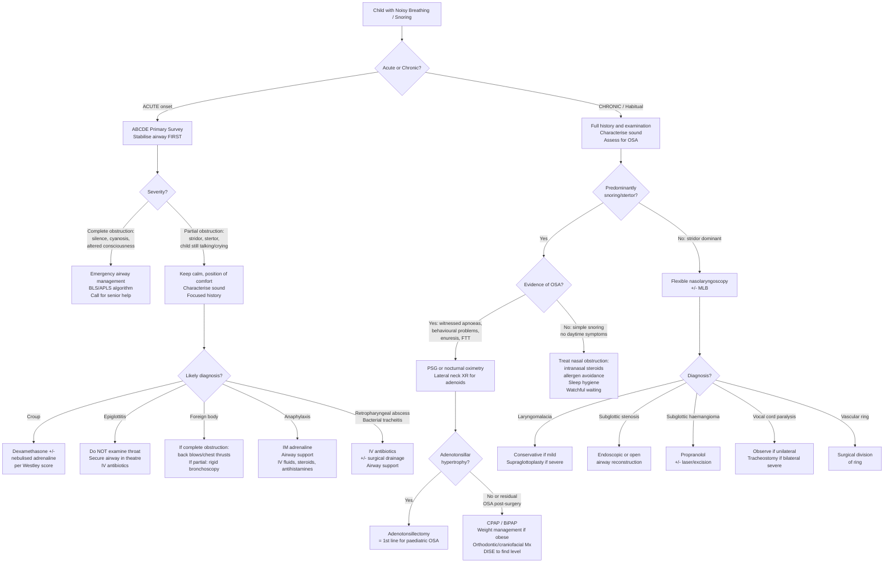

## Management Algorithm and Treatment Modalities for Noisy Breathing / Snoring in Children

The management of noisy breathing in children is entirely dependent on **two things**: (1) the tempo — acute or chronic, and (2) the underlying cause. This section walks through the approach systematically.

---

### Overarching Management Algorithm

---

### Part A: Management of ACUTE Noisy Breathing / Airway Obstruction

#### Step 1: ABCDE Stabilisation

***The first priority is ALWAYS airway stabilisation, following the ABCDE framework*** [1]:

***Establish patent airway*** [1]:
- ***Remove cause: suction, foreign body removal from mouth*** [1]
- ***Airway manoeuvre*** [1] — head-tilt chin-lift (or jaw thrust if C-spine concern)
- ***Airway adjuncts*** [1] — oropharyngeal airway (OPA) or nasopharyngeal airway (NPA)
- ***Advanced airway*** [1] — endotracheal intubation if needed
- ***High-flow O₂ AFTER airway is cleared*** [1]

**Paediatric-specific airway management considerations:**
- **Sizing**: OPA = measured from incisors to angle of mandible. In children, insert OPA with the **concavity facing down** (not with the 180° rotation technique used in adults) or use a tongue depressor — rotation can damage the soft palate in young children.
- **ETT sizing**: Uncuffed ETT for children < 8 years (historical guideline, though modern practice increasingly uses cuffed tubes even in younger children with cuff pressure monitoring); size = (age/4) + 3.5 for uncuffed, (age/4) + 3 for cuffed.
- ***Laryngeal mask airway (LMA)***: ***acceptable initial alternative airway adjunct for providers during paediatric cardiac arrest when tracheal intubation is difficult to achieve*** [8] — ***higher complication rate in smaller children*** [8].

#### Step 2: Condition-Specific Acute Management

##### A. Croup (Viral Laryngotracheobronchitis)

***Management is guided by the Westley Croup Severity Score*** [3]:

| Severity | Westley Score | Management |
|---|---|---|
| ***Mild*** | ***≤2 points*** | ***Home treatment with symptomatic care ± PO dexamethasone*** [3] |
| ***Moderate*** | ***3–7 points*** | ***Outpatient treatment with PO dexamethasone + nebulised adrenaline*** [3] |
| ***Severe*** | ***8–11 points*** | ***Hospitalisation with same treatment as above*** [3] |
| ***Critical*** | ***≥12 points*** | ***ICU admission with IM/IV dexamethasone ± repeated nebulised adrenaline*** [3] |

**Medications:**

1. ***Dexamethasone 0.6 mg/kg*** [3] (single dose, oral preferred):
   - **Why dexamethasone?** It is a long-acting glucocorticoid (half-life ~36–54 hours) with potent anti-inflammatory effect. It reduces subglottic mucosal oedema by suppressing the inflammatory cascade (↓prostaglandins, ↓leukotrienes, ↓cytokines, ↓capillary permeability). A single dose is usually sufficient because the long half-life covers the typical duration of croup (2–3 days).
   - **Route**: Oral is preferred (well absorbed, palatability can be improved by mixing with syrup). IM if the child is vomiting or refusing oral. IV if already cannulated.
   - **Onset**: Clinical effect begins within 2–3 hours (anti-oedema) but full effect takes 6 hours.
   - **Alternative**: Prednisolone 1–2 mg/kg/day for 3 days (shorter acting, so requires multiple doses — less convenient). Nebulised budesonide 2 mg is an alternative in the vomiting child but is more expensive and no more effective than oral dexamethasone.

2. ***Nebulised adrenaline: 1:1000, 0.5 mL/kg (max 5 mL)*** [3]:
   - **Why adrenaline?** It acts on α₁-adrenergic receptors on the subglottic mucosal vasculature → vasoconstriction → rapid reduction in mucosal oedema. This provides **immediate** but **temporary** relief (onset ~10 minutes, duration ~2 hours).
   - **The "rebound" effect**: After 2 hours, the vasoconstriction wears off and oedema may return (sometimes even worse because the underlying inflammation is still active). This is why **any child who receives nebulised adrenaline must be observed for at least 2–4 hours** before discharge — to ensure they don't deteriorate when the adrenaline wears off.
   - ***Seldom given because of possible paradoxical response*** [3] — though in practice, it is used frequently in moderate-severe croup. The "paradoxical response" refers to rare cases of worsening agitation, which itself can worsen stridor in an already distressed child.
   - Can be repeated every 15–20 minutes in severe cases, but if multiple doses are needed, the child needs ICU care.

3. **Supportive care**:
   - Minimal handling — keep the child calm (in caregiver's arms). Agitation worsens stridor because increased respiratory effort generates more negative intraluminal pressure → more dynamic collapse.
   - Humidified air/mist therapy — historically used (cold steam), but evidence shows **no benefit** and it is no longer routinely recommended.
   - Monitoring: SpO₂, respiratory rate, work of breathing.

<Callout title="Croup: The 3 Key Points" type="idea">
(1) **Dexamethasone for ALL children with croup** (even mild) — a single dose reduces return to ED and need for further treatment. (2) **Nebulised adrenaline for moderate-severe** — buys you 2 hours while steroids take effect. (3) **Observe after adrenaline** for rebound.
</Callout>

***Consult ENT for recurrent or slow-to-resolve croup: may be associated with underlying subglottic stenosis*** [3].

##### B. Acute Epiglottitis

***Management of acute epiglottitis*** [8]:

This is a **true airway emergency**. The management principle is: **secure the airway first, treat infection second**.

1. **Do NOT examine the throat** — this can precipitate laryngospasm and complete obstruction.
2. **Keep the child calm** in the position of comfort (sitting upright in caregiver's lap).
3. **Call for senior anaesthetist + ENT** — the airway should be secured under **controlled conditions in the operating theatre** via gas induction and direct laryngoscopy/intubation.
4. **Intubation**: Usually with a tube 0.5–1 size smaller than expected (because the swollen supraglottic structures narrow the glottic aperture).
5. ***Supportive care post-intubation*** [8]:
   - ***Fluid and hydration***
   - ***Treatment of post-obstructive pulmonary oedema*** — this occurs because severe airway obstruction generates massively negative intrathoracic pressure → increased venous return + increased LV afterload → transudation of fluid into alveoli. Usually resolves within 24–48 hours with supportive care (supplemental O₂, CPAP/PEEP if needed).
   - ***Sedation and avoid accidental extubation***
   - ***Care of ET tube***
   - ***Adequate humidification***
6. **IV antibiotics**: 3rd generation cephalosporin (ceftriaxone 80 mg/kg/day or cefotaxime) — covers *H. influenzae* (even if Hib is rare post-vaccination, empirical cover is still given), *S. aureus*, *Group A Streptococcus*. Add anti-staphylococcal cover (flucloxacillin or vancomycin) if MRSA is suspected.
7. ***Extubation criteria*** [8]:
   - ***General condition improving***
   - ***Fever subsiding***
   - ***Presence of air leak*** — this is a key sign that the swelling has decreased sufficiently. An air leak around the ETT (heard when the child breathes) indicates that the supraglottic oedema has reduced enough for air to pass around the tube → the airway is now patent enough to sustain unassisted breathing.
   - ***Usually done at 18–24 hours*** [8]

<Callout title="Air Leak Test Before Extubation" type="idea">
Why check for an air leak? The ETT was placed through a swollen supraglottis. If the swelling is still severe, removing the tube may leave the child with an inadequate airway. An air leak means the gap between the tube and the laryngeal wall has increased (swelling reduced) — it is safe to extubate.
</Callout>

##### C. Foreign Body Aspiration

Management depends on **severity of obstruction**:

1. **Complete obstruction (choking, unable to cough/speak/cry)**:
   - ***Foreign body removal: abdominal thrusts, back blows/slaps, chest thrusts*** [1]
   - **In infants < 1 year**: 5 back blows (with the infant face-down on your forearm, head lower than body) alternating with 5 chest thrusts (using 2-finger technique on the sternum). **Do NOT use abdominal thrusts in infants** — risk of liver/spleen injury.
   - **In children > 1 year**: 5 back blows alternating with 5 abdominal thrusts (Heimlich manoeuvre).
   - If the child loses consciousness → start CPR (chest compressions may dislodge the FB).

2. **Partial obstruction (coughing, crying, stridor but maintaining air entry)**:
   - Encourage coughing — the child's own cough is the most effective way to expel a partial obstruction.
   - **Do NOT perform blind finger sweeps** — this can push the FB further in.
   - Arrange for **rigid bronchoscopy** in theatre for definitive removal.

3. **Delayed presentation / missed FB**:
   - CXR (inspiratory + expiratory) → unilateral hyperinflation, mediastinal shift.
   - Normal CXR does NOT exclude FB → if clinical suspicion is high, proceed to rigid bronchoscopy (diagnostic AND therapeutic).
   - CT chest may help localise the FB if bronchoscopy findings are equivocal.

##### D. Anaphylaxis / Angioedema

- **IM adrenaline** (1:1000) — anterolateral thigh:
  - < 6 years: 0.15 mg (150 mcg)
  - 6–12 years: 0.3 mg (300 mcg)
  - > 12 years: 0.5 mg (500 mcg)
  - Repeat every 5 minutes if no improvement.
- **Airway management**: Position of comfort, high-flow O₂, prepare for intubation if progressive upper airway oedema.
- **Adjuncts**: IV fluid bolus (20 mL/kg NS for hypotension), nebulised adrenaline (for upper airway oedema), IV hydrocortisone, IV chlorpheniramine.
- **For hereditary angioedema**: C1 esterase inhibitor concentrate, icatibant (bradykinin B₂ receptor antagonist), or fresh frozen plasma if specific treatments unavailable. **Adrenaline and steroids are LESS effective** in bradykinin-mediated angioedema (because the mechanism is not histamine/IgE-mediated).

##### E. Retropharyngeal Abscess / Peritonsillar Abscess

- **IV antibiotics**: Ampicillin-sulbactam or clindamycin (cover oral flora including anaerobes + Group A Strep + *S. aureus*).
- **Surgical drainage**: Incision and drainage (I&D) — for peritonsillar abscess, this can be done transorally; for retropharyngeal abscess, transoral drainage in theatre under GA with airway protection.
- **Airway monitoring**: Close observation ± intubation if airway compromise.

---

### Part B: Management of CHRONIC Noisy Breathing / Snoring / OSA

#### Adenotonsillar Hypertrophy and Paediatric OSA

This is the **single most common scenario** you will encounter. The management pathway is:

##### 1. General Measures and Conservative Management

- **Sleep hygiene**: Regular sleep schedule, adequate sleep duration for age (11–14 hours for toddlers, 9–12 hours for school-age, 8–10 hours for adolescents), avoid screens before bed.
- ***Manage predisposing factors: rhinitis*** [2] — intranasal corticosteroids (e.g. mometasone, fluticasone) reduce adenoidal and nasal mucosal inflammation. Montelukast (leukotriene receptor antagonist) can also reduce adenoidal tissue. **Intranasal steroids + montelukast** may be trialled for 6–12 weeks in mild OSA as an alternative to surgery, particularly in children < 2 years where surgical risk is higher.
- ***Weight reduction if overweight*** [2] — critical in obese children; even modest weight loss can significantly reduce AHI. In adolescents, the same lifestyle measures apply; in severe adolescent obesity (BMI ≥ 35 with comorbidities), bariatric surgery may be considered [4].
- ***Avoid alcohol and sedatives*** [2] — relevant in adolescents; medications with sedating properties (antihistamines, benzodiazepines) should be reviewed and minimised.
- **Positional therapy**: Sleeping on the side rather than supine reduces gravitational collapse of the tongue base and soft palate — less evidence in children than adults but still useful.
- ***Sleep posture: lying laterally*** [2].

##### 2. Adenotonsillectomy (AT) — First-Line Definitive Treatment for Paediatric OSA

***Removal of hypertrophic tonsils/adenoids in children*** [2] — this is the definitive treatment for the majority of paediatric OSA.

**Why is AT first-line in children but NOT in adults?** Because in children, the dominant mechanism of OSA is **adenotonsillar hypertrophy** (a discrete, removable anatomical obstruction), whereas in adults, the problem is multifactorial (obesity, pharyngeal collapsibility, neuromuscular factors) — so removing one structure doesn't fix the problem.

**Indications for adenotonsillectomy in children**:

| Indication | Explanation |
|---|---|
| **Moderate-severe OSA** (AHI > 5 or significant desaturations) | Definitive treatment |
| **Mild OSA** (AHI 1–5) with significant symptoms | Behavioural problems, growth failure, enuresis, poor QoL |
| **Recurrent tonsillitis** (Paradise criteria) | ≥7 episodes in 1 year, ≥5/year for 2 years, ≥3/year for 3 years |
| **Peritonsillar abscess** | Risk of recurrence |
| **Suspected malignancy** | Asymmetric tonsillar enlargement |

**Contraindications / Cautions**:

| Contraindication | Reason |
|---|---|
| **Bleeding diathesis** (uncontrolled) | Tonsillectomy is in a highly vascular field; post-tonsillectomy haemorrhage is the most feared complication |
| **Velopharyngeal insufficiency** (e.g. submucous cleft palate) | Removing the adenoids may worsen VPI → hypernasal speech. Check for bifid uvula, short palate before adenoidectomy |
| **Active infection** | Increased bleeding risk; defer to 2–4 weeks after resolution |
| **Age < 2 years** | Higher perioperative risk (especially respiratory complications); these children need PSG confirmation of OSA before surgery and should be managed in a centre with paediatric anaesthesia expertise |

**Surgical techniques**:
- **Tonsillectomy**: Total (extracapsular) vs intracapsular/partial (leaves the capsule intact — less pain, faster recovery, but risk of tonsillar regrowth). Cold steel dissection, electrocautery, coblation, or microdebrider.
- **Adenoidectomy**: Suction diathermy, curette, or microdebrider. Performed under direct vision with a mirror or endoscope.

**Expected outcomes**:
- AT is curative in **~80% of otherwise healthy children** with OSA due to adenotonsillar hypertrophy.
- **Residual OSA post-AT** occurs in ~20% — risk factors: obesity, craniofacial anomalies, Down syndrome, neuromuscular disease, severe pre-operative OSA (AHI > 20). These children need **post-operative PSG** at 6–8 weeks to reassess.

**Post-operative complications**:
- **Primary haemorrhage** ( < 24 hours): ~0.5–2% — usually from the tonsillar fossa; return to theatre for haemostasis.
- **Secondary haemorrhage** (5–10 days): ~2–4% — due to sloughing of the eschar (the "scab" over the tonsil bed). Infection can precipitate this. Presents with fresh blood in the mouth ± haematemesis (swallowed blood).
- **Pain**: Peaks at day 3–5; adequate analgesia with paracetamol ± ibuprofen (note: some centres avoid NSAIDs in the first 2 weeks due to theoretical bleeding risk, though recent evidence suggests ibuprofen is safe and beneficial). **Avoid codeine in children** — CYP2D6 ultra-rapid metabolisers can develop fatal respiratory depression (FDA black box warning post-tonsillectomy).
- **Velopharyngeal insufficiency** — hypernasal speech post-adenoidectomy (usually transient).
- **Dehydration** — from poor oral intake due to pain; encourage cold fluids and soft diet.

<Callout title="Codeine After Tonsillectomy — A Deadly Mistake" type="error">
**NEVER prescribe codeine to children post-tonsillectomy.** Codeine is a prodrug metabolised by CYP2D6 to morphine. CYP2D6 ultra-rapid metabolisers (prevalence varies by ethnicity: ~1–2% in East Asian populations, up to 10% in some populations) convert codeine to morphine at dangerously high rates → fatal respiratory depression, especially in the post-tonsillectomy child who already has a vulnerable airway. Use paracetamol ± ibuprofen instead.
</Callout>

##### 3. Continuous Positive Airway Pressure (CPAP) / Bilevel Positive Airway Pressure (BiPAP)

***Nasal CPAP: application of positive pressure through nasal mask during sleep — most consistently effective treatment of OSA*** [2].

**How does CPAP work?** It acts as a **pneumatic splint** — the positive pressure keeps the pharyngeal airway open by exceeding the critical closing pressure (Pcrit). Essentially, it counteracts the negative intraluminal pressure generated during inspiration that would normally collapse the floppy pharynx.

**Indications in children**:
- Residual OSA after adenotonsillectomy
- OSA in children who are NOT surgical candidates (e.g. craniofacial anomalies where AT alone won't be curative)
- Bridge therapy while awaiting surgery
- Central sleep apnoea (BiPAP with backup rate)
- Obesity-related OSA where weight loss has not yet been achieved

**Practical considerations in paediatric CPAP**:
- **Interface**: Nasal mask is preferred over full-face mask in children (lower risk of aspiration, more comfortable). Must be properly fitted — paediatric masks come in multiple sizes.
- **Pressure titration**: Done during a PSG (titration study) — the pressure is gradually increased until apnoeas/hypopnoeas are abolished. Typical pressures in children: 4–10 cmH₂O.
- **Compliance**: This is the Achilles heel of CPAP in children. Compliance rates are ~50–65%. Strategies to improve compliance: behavioural desensitisation (gradual introduction), positive reinforcement, involving the child in choosing mask design, starting at low pressures and titrating up.
- **Mid-face hypoplasia risk**: Prolonged CPAP use in young children (especially < 6 years) with a poorly fitting mask can cause mid-face retrusion over time due to pressure on the developing facial skeleton. Regular craniofacial monitoring is needed.

***Mandibular advancement device*** [2]:
- ***Device worn during sleep to advance mandible to enlarge upper respiratory tract and modify muscle collapsibility*** [2].
- ***Variable efficacy, usually cannot completely control severe OSA*** [2].
- In paediatrics, **rapid maxillary expansion (RME)** appliances are more commonly used — these widen the palate and nasal floor, increasing the nasal and oropharyngeal airway. Best results in children aged 4–8 years with high-arched palate and dental malocclusion.

##### 4. Medical Management of Chronic Snoring / Mild OSA

| Treatment | Mechanism | Indication | Dose | Evidence |
|---|---|---|---|---|
| **Intranasal corticosteroid** (mometasone, fluticasone) | ↓Nasal and adenoidal mucosal inflammation, ↓lymphoid tissue volume | Mild OSA, allergic rhinitis coexisting with snoring, pre-/post-AT residual symptoms | Mometasone: 1 spray (50 mcg) each nostril daily (age ≥ 3y); Fluticasone: same | Moderate evidence; RCTs show ↓AHI by 25–50% in mild OSA |
| **Montelukast** | Leukotriene receptor antagonist → ↓adenoidal lymphoid hyperplasia | Mild OSA (especially with coexisting allergic rhinitis/asthma) | 4 mg (2–5y), 5 mg (6–14y) once daily at bedtime | Some evidence for ↓AHI; may be tried for 6–12 weeks before considering surgery |
| **Combination** (intranasal steroid + montelukast) | Synergistic anti-inflammatory effect | Mild OSA, or residual mild OSA post-AT | As above | Better than either alone in small studies |

##### 5. Other Surgical and Interventional Treatments

| Treatment | Indication | Mechanism / Details |
|---|---|---|
| ***Uvulopalatopharyngoplasty (UPPP)*** | ***Variable efficacy, not favoured*** [2] — rarely used in children | ***Removal/remodelling of uvula, soft palate, and pharynx*** [2]. Risk of VPI in children makes this largely inappropriate. |
| **Supraglottoplasty** | Severe laryngomalacia (FTT, significant desaturations, severe stridor causing feeding difficulty) | Endoscopic trimming of redundant aryepiglottic folds, arytenoid mucosa, or omega-shaped epiglottis. ~95% success rate for symptom improvement. |
| **Tongue base reduction** (various techniques) | Tongue base collapse causing residual OSA (identified on DISE) | Radiofrequency ablation, midline glossectomy, or lingual tonsillectomy (if lingual tonsils are hypertrophied). |
| ***Faciomaxillary/mandibular surgery*** | ***Significant maxillofacial anomalies*** [2] | Mandibular distraction osteogenesis (e.g. Pierre Robin sequence) — gradually lengthens the mandible by creating a bony cut and slowly widening the gap with a distraction device. |
| **Tracheostomy** | Severe, life-threatening OSA refractory to all other measures; bilateral vocal cord paralysis with severe obstruction | ***Bypasses upper airway obstruction*** [7]. Most definitive airway but associated with significant morbidity (stomal care, communication difficulties, psychosocial impact). Reserved as last resort. |
| **Propranolol** | Subglottic haemangioma | Non-selective β-blocker → inhibits haemangioma growth (↓VEGF, induces apoptosis, vasoconstriction). Dose: 1–3 mg/kg/day in 2–3 divided doses. Treatment typically continued until age 12–18 months (past the proliferative phase). Monitor for bradycardia, hypotension, hypoglycaemia (especially in infants — must be given with feeds). |
| **Vascular ring division** | Symptomatic vascular ring | Surgical division of the non-dominant arch or ligamentum arteriosum → relieves tracheal/oesophageal compression. Usually performed via left thoracotomy or thoracoscopically. |

##### 6. Management of Secondary Enuresis (in context of OSA)

***Treat underlying cause first*** [3] — resolving the OSA (typically by adenotonsillectomy) often resolves the enuresis.

If enuresis persists after OSA treatment:
- ***General measures: education and reassurance, behavioural modification (void before bed, fluid/salt restriction 2h before sleep, star chart)*** [3]
- ***Enuresis alarm: 1st line, most effective long-term therapy*** [3]
  - ***MoA: sensor placed in undergarment or on bed pad → activated and alert when detect moisture*** [3]
  - ***Efficacy: 30–60% success rate but associated with significant relapse rate*** [3]
- ***Medical treatment: desmopressin ± anticholinergics (if component of detrusor overactivity)*** [3]
  - ***Usual use for short-term, e.g. school camps*** [3]
  - ***Note: intranasal formulation is associated with increased risk of seizures and is no longer indicated for treatment of enuresis*** [3] — use oral desmopressin melt/tablet instead (120–240 mcg oral lyophilisate at bedtime)

---

### Part C: Management of Specific Congenital Causes

| Condition | Management | Details |
|---|---|---|
| **Laryngomalacia (mild)** | Conservative / watchful waiting | ~90% resolve spontaneously by 12–18 months as cartilage matures. Reassure parents. GOR treatment (omeprazole/ranitidine) may help as acid reflux worsens laryngomalacia. Positional advice (prone positioning during supervised awake time). |
| **Laryngomalacia (severe)** | Supraglottoplasty | Indications: failure to thrive, significant desaturations on sleep study, severe feeding difficulties, cor pulmonale. |
| **Vocal cord paralysis (unilateral)** | Observe + speech therapy | Most unilateral palsies recover spontaneously within 6–12 months. Monitor for aspiration risk. Thickened feeds if aspiration is a concern. |
| **Vocal cord paralysis (bilateral)** | Tracheostomy ± later lateralisation procedure | Bilateral paralysis with severe obstruction often requires tracheostomy for airway safety. Later procedures (posterior cordotomy, arytenoidectomy) can widen the glottis but may worsen voice quality. Treat underlying cause (e.g. neurosurgical decompression for Arnold-Chiari). |
| **Subglottic stenosis** | Endoscopic dilation ± laryngotracheal reconstruction (LTR) | Grade I–II: may respond to endoscopic balloon dilation ± topical mitomycin C (inhibits fibroblast proliferation). Grade III–IV: open LTR with cartilage grafting (anterior/posterior costal cartilage graft to widen the cricoid). |
| **Subglottic haemangioma** | Oral propranolol (1st line) | As above. If refractory: CO₂ laser ablation, intralesional steroid injection, or open excision. |
| **Choanal atresia (bilateral)** | Emergent airway → surgical repair | Neonatal emergency: Insert oral airway (McGovern nipple or simply a cut dummy/pacifier taped in place). Definitive: Transnasal endoscopic repair (drill through the bony plate, place stents). |
| **Pierre Robin sequence** | Positioning → tongue-lip adhesion → mandibular distraction → tracheostomy (stepwise) | Start with prone positioning; if insufficient, tongue-lip adhesion (suture tongue to inner lip → prevents glossoptosis); if still obstructed, mandibular distraction osteogenesis; tracheostomy as last resort. |
| **Laryngeal papillomatosis** | Repeated microlaryngeal surgery + adjuvant therapy | Surgical debulking (CO₂ laser or microdebrider) — recurrence is the rule; adjuvant cidofovir (intralesional antiviral) or bevacizumab (anti-VEGF) for recalcitrant disease. HPV vaccination may reduce recurrence. |
| **Tracheomalacia (mild)** | Conservative / watchful waiting | Most improve by age 2 as cartilage matures. |
| **Tracheomalacia (severe)** | Aortopexy ± tracheal stenting | Aortopexy: the ascending aorta is sutured to the posterior sternum → pulls the anterior tracheal wall forward → opens the airway. For refractory cases: biodegradable or metallic tracheal stents. |
| **Vascular ring** | Surgical division | Division of the ring (usually the smaller/non-dominant arch or ligamentum arteriosum) via thoracotomy or thoracoscopy. |

---

### Follow-Up and Monitoring

- **Post-adenotonsillectomy**: Reassess symptoms at 6–8 weeks. If symptoms persist → repeat PSG to assess for residual OSA → consider CPAP, weight management, or further investigation (DISE).
- **Children on CPAP**: Regular follow-up every 3–6 months — mask fit, compliance data download, growth monitoring (mid-face development), repeat PSG annually to assess if CPAP pressure needs adjustment.
- **Children with congenital airway lesions**: Long-term ENT follow-up with serial flexible nasolaryngoscopy to monitor airway growth and lesion regression.
- **Neurodevelopmental monitoring**: Children with a history of significant OSA should be monitored for neurodevelopmental and behavioural outcomes — referral to developmental paediatrics or educational psychology if concerns arise.

---

<Callout title="High Yield Summary — Management">

1. **Acute croup**: ***Dexamethasone 0.6 mg/kg PO (single dose) for ALL*** [3] + ***nebulised adrenaline for moderate-severe*** [3]. Observe after adrenaline for rebound.

2. **Acute epiglottitis**: ***Do NOT examine throat. Secure airway in theatre*** [8]. IV antibiotics. ***Extubate when fever subsiding + air leak present, usually at 18–24 hours*** [8].

3. **Foreign body**: ***Back blows/chest thrusts for complete obstruction*** [1]. **Rigid bronchoscopy** for partial obstruction or delayed presentation. Never use abdominal thrusts in infants < 1 year.

4. **Paediatric OSA**: ***Adenotonsillectomy is first-line*** [2] (curative in ~80%). ***CPAP for residual/non-surgical OSA*** [2]. **Intranasal steroids + montelukast** for mild OSA as medical trial.

5. **Severe laryngomalacia**: Supraglottoplasty. Mild laryngomalacia: conservative (self-resolves by 12–18 months).

6. **Subglottic haemangioma**: Oral propranolol.

7. ***Never prescribe codeine post-tonsillectomy in children*** — fatal respiratory depression risk in CYP2D6 ultra-rapid metabolisers.

8. **Enuresis secondary to OSA**: ***Treat OSA first. If persists → enuresis alarm (1st line) ± oral desmopressin*** [3].
</Callout>

---

<ActiveRecallQuiz
  title="Active Recall - Management of Noisy Breathing / Snoring in Children"
  items={[
    {
      question: "A 2-year-old presents with barking cough, hoarse voice, and inspiratory stridor at rest. Westley score is 5. What is your management plan, including drug names, doses, and routes?",
      markscheme: "Moderate croup (Westley 3-7). (1) Oral dexamethasone 0.6 mg/kg single dose (reduces subglottic oedema via anti-inflammatory effect, long half-life covers typical course). (2) Nebulised adrenaline 1:1000, 0.5 mL/kg (max 5 mL) — acts on alpha-1 receptors causing mucosal vasoconstriction, rapid onset in 10 minutes but temporary effect lasting 2 hours. (3) Observe for minimum 2-4 hours post-adrenaline for rebound. (4) Keep child calm, minimal handling, in caregiver arms. (5) Monitor SpO2."
    },
    {
      question: "A 3-year-old with suspected epiglottitis has been intubated in theatre. What are the criteria for extubation and the typical timing?",
      markscheme: "Extubation criteria: (1) General condition improving, (2) Fever subsiding, (3) Presence of air leak around the ETT — indicates supraglottic swelling has reduced enough for air to pass around the tube. Typically extubated at 18-24 hours. Post-intubation care includes fluid and hydration, treatment of post-obstructive pulmonary oedema, sedation to avoid accidental extubation, care of ET tube, and adequate humidification."
    },
    {
      question: "What is the first-line definitive treatment for paediatric OSA due to adenotonsillar hypertrophy? What is the cure rate, and in which groups is residual OSA more common?",
      markscheme: "Adenotonsillectomy is first-line definitive treatment. Curative in approximately 80% of otherwise healthy children. Residual OSA post-AT (occurring in about 20%) is more common in: obese children, those with craniofacial anomalies (e.g. Down syndrome, Pierre Robin), neuromuscular disorders, and those with severe pre-operative OSA (AHI greater than 20). These children need post-operative PSG at 6-8 weeks to assess for residual OSA."
    },
    {
      question: "A 3-month-old with progressive biphasic stridor has beard-distribution cutaneous haemangiomas. Flexible nasolaryngoscopy confirms a subglottic haemangioma. What is the first-line medical treatment, its mechanism, and what must you monitor?",
      markscheme: "First-line: Oral propranolol 1-3 mg/kg/day in 2-3 divided doses. Mechanism: Non-selective beta-blocker that inhibits haemangioma growth via decreased VEGF expression, induction of apoptosis of endothelial cells, and vasoconstriction of feeding vessels. Continue treatment until age 12-18 months (past the proliferative phase). Monitor for: bradycardia, hypotension, hypoglycaemia (especially in infants — must be given with feeds to prevent fasting hypoglycaemia), bronchospasm."
    },
    {
      question: "Why should you NEVER prescribe codeine to children after tonsillectomy? What analgesic regimen should be used instead?",
      markscheme: "Codeine is a prodrug metabolised by CYP2D6 to morphine. Ultra-rapid metabolisers (prevalence 1-2% in East Asian, up to 10% in some populations) convert codeine to morphine at dangerously high rates, causing fatal respiratory depression — particularly dangerous post-tonsillectomy when the airway is vulnerable. Use paracetamol (15 mg/kg QDS) plus ibuprofen (5-10 mg/kg TDS) instead. FDA black box warning exists against codeine use post-tonsillectomy in children."
    },
    {
      question: "A child has habitual snoring but is otherwise well with no daytime symptoms and AHI of 0.8 on polysomnography. How do you manage this?",
      markscheme: "This is primary snoring (AHI 1 or less is normal in children). Management is conservative: (1) Treat nasal obstruction if present — intranasal corticosteroids for allergic rhinitis (e.g. mometasone 1 spray each nostril daily). (2) Allergen avoidance. (3) Sleep hygiene advice. (4) Weight management if overweight. (5) Watchful waiting with reassessment if symptoms worsen (development of witnessed apnoeas, behavioural problems, enuresis, or failure to thrive). No surgery or CPAP is indicated."
    }
  ]}
/>

## References

[1] Senior notes: Ryan Ho Critical Care.pdf (Section 1.1 Primary Survey, Section 1.2.2 Upper Airway Obstruction and Airway Management)
[2] Senior notes: Ryan Ho Respiratory.pdf (Section 3.8.2 Sleep Apnoea/Hypopnoea Syndrome — Treatment)
[3] Senior notes: Adrian Lui Pediatrics.pdf (Pages 161, 339 — Croup management, Enuresis management)
[4] Senior notes: Ryan Ho Endocrine.pdf (Section on Surgical Therapy for Obesity — bariatric surgery indications)
[7] Senior notes: felixlai.md (Tracheostomy — indications and contraindications)
[8] Lecture slides: GC 145. A critically ill child childhood medical emergencies.pdf (Pages 28, 38 — Laryngeal mask, Management of acute epiglottitis)
