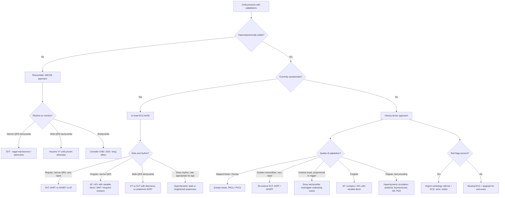

## Differential Diagnosis of Palpitations in Paediatrics

### Organising Framework

The differential diagnosis of palpitations in a child or adolescent is best approached by first asking: **"What is the heart actually doing?"** The answer falls into one of three broad buckets, as established in the prior section [1][2]:

1. ***Tachyarrhythmias felt by patients***
2. ***Hyperdynamic circulation exaggerating sinus rhythm***
3. ***Bradyarrhythmias with strong beats (↑ diastolic time → ↑ stroke volume)***

A fourth, often-overlooked category is **heightened awareness of a normal heartbeat** (anxiety, somatoform disorders). In paediatrics, one must additionally always consider the **age of the patient** — the differential is different for a neonate, an infant, a school-age child, and an adolescent.

---

### Master Differential Diagnosis Table

The table below is organised by anatomical origin of the rhythm disturbance, with paediatric prevalence emphasis.

| Level | ***Tachyarrhythmias*** | ***Bradyarrhythmias*** |
|---|---|---|
| **SA node** | Sinus tachycardia (ST) | Sinus bradycardia; Sick sinus syndrome; Sinus arrest; Sinoatrial block |
| **Atrial muscle** | Atrial tachycardia (AT); Atrial flutter (AFL); Atrial fibrillation (AF); Atrial premature beats/ectopics (APB) | Atrial escape |
| **AV node** | AV re-entrant tachycardia (AVRT); AV nodal re-entrant tachycardia (AVNRT); Junctional tachycardia | AV blocks (1°, 2°, 3°); Junctional escape |
| **Ventricles** | Ventricular tachycardia (VT); Ventricular fibrillation (VF); Ventricular premature beats/ectopics (VPB) | Ventricular escape |

[1][2]

Below, each major differential is explored with a paediatric lens — *why* it occurs, *who* it affects, and *how* to differentiate it.

---

### A. Tachyarrhythmias

#### 1. Sinus Tachycardia (ST) — The Most Common Cause Overall

- **Why it happens**: ST is not a primary arrhythmia — it is the normal SA node increasing its firing rate in response to ↑ sympathetic drive or ↓ vagal tone. The question is always "what is driving the sinus tachycardia?"
- **Paediatric causes**:
  - **Physiological**: exercise, crying, pain, fear/anxiety
  - **Fever/infection**: HR rises ~10 bpm per 1°C; this is the single most common cause of palpitations in a febrile child presenting to ED
  - **Dehydration/hypovolaemia**: gastroenteritis (very common in HK paediatric EDs [4]), haemorrhage
  - **Anaemia**: iron deficiency (prevalent in HK toddlers and menstruating adolescent females) → ↓ O₂ carrying capacity → compensatory ↑ HR + ↑ SV
  - **Thyrotoxicosis**: Graves' disease in adolescents [7]
  - **Drugs**: salbutamol/SABA (very common in asthmatic children), methylphenidate (ADHD), caffeine/energy drinks, theophylline
  - **Heart failure**: any cause — including ***large L-to-R shunts (VSD, AVSD, PDA)*** in infants and ***cardiomyopathy*** at any age [3]
  - **Sepsis**: ↑ HR as early compensatory sign in paediatric sepsis [5]
  - **Pain/distress**: post-operative, procedural
- **How to recognise**: ***insidious onset and offset***; rate varies with activity/emotion; ***P waves normal and upright in lead II*** [1][2]

<Callout title="Exam Trap" type="error">
Never diagnose SVT by rate alone. In infants, sinus tachycardia from fever can reach 200 bpm. The key distinguishing features are: ST has **gradual onset/offset, rate variability, and identifiable normal P waves**, whereas SVT has **sudden onset/offset, fixed rate, and absent or abnormal P waves**. An infant HR > 220 bpm almost always favours SVT; 180–220 bpm is the overlap zone where ECG morphology is critical.
</Callout>

#### 2. Supraventricular Tachycardia (SVT)

***SVT is the most common pathological tachyarrhythmia in children*** [3].

##### a) AVRT (Accessory Pathway–Mediated)
- ***Most common SVT mechanism in infants and young children (< 5 years)*** [1][3]
- **Why**: congenital accessory pathway (bundle of Kent) present from birth; the pathway + AV node form the two limbs of a re-entrant circuit
- **WPW syndrome**: pre-excitation on resting ECG (short PR, delta wave) + symptomatic tachycardia
- **Key features**: ***sudden onset and sudden offset; discrete bouts, very rapid ( > 120 bpm)*** [1][2]
- **Age pattern**: ~50% of infants with SVT have WPW; many accessory pathways regress by 1 year of age → SVT may resolve spontaneously in the first year

##### b) AVNRT (Dual AV Nodal Pathway)
- ***More common in older children and adolescents***; ***young: think congenital syndromes (LQTS, WPW); AVNRT*** [1][2]
- **Why**: dual AV nodal pathways (fast and slow) create a re-entrant circuit entirely within or immediately adjacent to the AV node
- **Key feature**: ***terminated by vagal manoeuvres (sneeze, cough, Valsalva, ice to face in infants)*** — because the circuit depends on AV nodal conduction [1][2]

##### c) Junctional Ectopic Tachycardia (JET)
- **Post-operative JET**: most commonly after surgery near the AV node (VSD repair, TOF repair)
- **Congenital JET**: rare; automatic tachycardia from AV junction; often incessant → tachycardia-mediated cardiomyopathy
- **Why in paediatrics**: direct surgical trauma/oedema of the His bundle region → enhanced automaticity

##### d) Focal Atrial Tachycardia (AT)
- ***Mechanism: abnormal automaticity, re-entry at single atrial focus (microreentry), triggered activity*** [1]
- **Paediatric relevance**: can be **incessant** in young children → if unrecognised for weeks-months, causes **tachycardia-mediated dilated cardiomyopathy (DCM)** — essentially the heart "burns out" from running fast for too long
- ***Causes: no underlying disease (good prognosis), atrial enlargement, digitalis toxicity*** [1]

##### e) Atrial Flutter (AFL)
- **Neonates**: can occur de novo (often with structurally normal heart); frequently self-limited; may require cardioversion once then no recurrence
- **Older children**: almost always in context of **congenital heart disease, especially post-atrial surgery** (Fontan, Mustard/Senning atrial switch) where surgical scars create a substrate for macro-re-entrant atrial circuits [3]
- ***AFL: rapid regular atrial activity at 180–350 bpm; re-entry via anatomically fixed pathway*** [1]

##### f) Atrial Fibrillation (AF)
- ***Very rare in children*** unless:
  - Structural heart disease (dilated cardiomyopathy, rheumatic mitral valve disease)
  - Post-cardiac surgery
  - **WPW + AF**: dangerous → rapid conduction down accessory pathway → VF [3]
  - Thyrotoxicosis in adolescents [7]
- ***Irregular palpitations → think AF, AFL/AT with variable block and MAT*** [1][2]

#### 3. Ectopic Beats (PACs and PVCs)

- ***Skipped or 'heavy' beats → think ectopic beats (often triggered by stress, alcohol, nicotine, worse at rest)*** [1][2]
- **PACs**: very common, almost universally benign in structurally normal hearts
- **PVCs**: common and usually benign if isolated, single morphology, suppressed by exercise, PVC burden < 10%
  - **Why the "thump" sensation?**: The ectopic beat comes early (before the ventricle has fully filled) → produces a weak, often imperceptible beat → followed by a compensatory pause → the next sinus beat fills the ventricle more than usual (↑ diastolic filling time → ↑ SV via Frank-Starling) → that beat is forceful and perceived as a "thump"
- **Concerning features**: ↑ PVC burden ( > 10–15%), exercise-induced, multiple morphologies, couplets/runs → risk of PVC-mediated cardiomyopathy or underlying channelopathy/cardiomyopathy

#### 4. Ventricular Tachycardia (VT) and Ventricular Fibrillation (VF)

- **Rare in children but critical to identify** because of risk of sudden cardiac death [5][6]
- ***Causes of cardiac arrest in children: structural heart disease (HCM, DCM, ARVD, congenital HD), LQTS, Brugada syndrome, WPW, drug-induced TdP, severe electrolyte imbalance*** [6]
- **Channelopathies to consider in paediatrics**:
  - **Long QT syndrome (LQTS)**: mutations in K⁺/Na⁺ channels → prolonged QT → early afterdepolarisations → TdP (polymorphic VT). ***Young: think congenital syndromes (LQTS, WPW)*** [1][2]. Specific triggers: exercise/swimming (LQT1), auditory startle (LQT2), sleep/rest (LQT3).
  - **Catecholaminergic polymorphic VT (CPVT)**: RyR2 mutation → exercise/emotion-triggered bidirectional/polymorphic VT in structurally normal heart
  - **Brugada syndrome**: SCN5A Na⁺ channel mutation → VT/VF, typically at rest/sleep; characteristic coved ST elevation in V1–V3
- **Cardiomyopathies**: ***HCM → sudden cardiac death due to VT/VF, typically during or after vigorous physical activity*** [8]; ***ARVD → VT from fatty/fibrous replacement of RV myocardium*** [9]; DCM → VT from dilated, scarred ventricle
- **Myocarditis**: acute viral myocarditis (Coxsackie B, adenovirus, SARS-CoV-2) → inflammatory infiltrate → electrical instability → PVCs, VT, or conduction block
- **Post-surgical CHD**: scar-related re-entrant VT, especially after TOF repair (right ventriculotomy scar)
- **Commotio cordis**: a blunt, non-penetrating precordial blow (e.g., baseball, cricket ball) strikes during the vulnerable T-wave period → VF. Uniquely paediatric/young adult — the relatively thin, compliant paediatric chest wall transmits energy more easily to the myocardium.
- **Electrolyte disturbances**: severe hypokalaemia (e.g., from GI losses in gastroenteritis [4] or DKA), hypomagnesaemia → VT/TdP

---

### B. Hyperdynamic Circulation

In this category the rhythm is sinus, but stroke volume or contractility is increased so that each beat is perceptible. ***Regular, relatively fast pounding (90–120 bpm) → think hyperdynamic circulation (anaemia, pregnancy, thyrotoxicosis, AR, PDA)*** [1][2].

| Cause | Paediatric Context | Why Palpitations Occur |
|---|---|---|
| **Iron deficiency anaemia** | Common in HK toddlers (cow's milk excess) and menstruating adolescent females | ↓ Hb → ↓ O₂ delivery → ↑ HR + ↑ SV (↓ blood viscosity → ↓ afterload → ↑ flow) |
| **Thalassaemia (major/intermedia)** | Prevalent in southern Chinese/HK population | Chronic haemolytic anaemia → high-output state; also iron overload cardiomyopathy from transfusions |
| **Thyrotoxicosis** | Graves' disease in adolescent females; neonatal thyrotoxicosis from maternal TRAb | T3/T4 → ↑ β-adrenergic receptor expression → ↑ HR, ↑ contractility, ↓ SVR [7] |
| **Patent ductus arteriosus (PDA)** | Premature infants; or as part of CHD in any age | L→R shunt → LV volume overload → ↑ SV → bounding pulses, wide pulse pressure [3] |
| **Aortic regurgitation (AR)** | Rheumatic heart disease; bicuspid aortic valve; post-Ross procedure | Regurgitant volume → ↑ LVEDV → ↑ SV → wide pulse pressure, forceful beats |
| **Large AV malformation** | Vein of Galen malformation in neonates; hepatic haemangioma in infants | Low-resistance shunt → ↑ venous return → ↑ CO → high-output heart failure |
| **Fever** | Universal paediatric experience | Cytokine-mediated vasodilation → ↑ CO; also direct metabolic effect of temperature on SA node |
| **Severe anxiety / panic** | Adolescents | ↑ Sympathetic tone → ↑ HR + ↑ contractility [10] |

---

### C. Bradyarrhythmias with Compensatory Strong Beats

- **Why perceived as palpitations**: Slow rate → longer diastolic filling time → ↑ end-diastolic volume → ↑ stroke volume (Frank-Starling mechanism) → each beat is forceful and noticeable [1][2]

| Cause | Paediatric Context | Mechanism |
|---|---|---|
| **Congenital complete heart block (CCHB)** | Neonates/infants of mothers with anti-Ro (SSA) / anti-La (SSB) antibodies (neonatal lupus); also associated with congenitally corrected TGA (L-TGA) | Maternal antibodies cross placenta → inflammatory destruction of fetal AV node → permanent 3° AV block → slow ventricular escape rate (40–60 bpm) → forceful beats |
| **Post-surgical AV block** | After VSD repair, AVSD repair, or any surgery near the AV node/His bundle [3] | Surgical trauma/oedema → conduction system damage |
| **Sick sinus syndrome (SSS)** | Post-Fontan or post-Mustard/Senning (atrial switch) operation | Extensive atrial surgery → SA node damage + atrial scar → alternating bradycardia and tachycardia ***("tachycardia-bradycardia syndrome")*** [9]; overdrive suppression of SA node during tachycardia phase → prolonged asystolic pause at termination |
| **Sinus bradycardia** | Athletic children/adolescents (physiological); hypothyroidism, hypothermia, ↑ ICP, drugs (beta-blockers) | ↑ Vagal tone (athletes) or ↓ metabolic demand → ↓ SA node firing rate |
| **2nd degree AV block** | May be incidental finding (Mobitz I/Wenckebach is often benign in young athletes) or pathological (Mobitz II → risk of progression to CHB) | Intermittent dropped beats → compensatory pause → forceful next beat |

---

### D. Non-Cardiac Causes of Palpitations

These must always be considered, as they are common in the paediatric population and easily overlooked.

#### 1. Psychiatric / Psychogenic
- **Anxiety and panic disorder**: ***Palpitations are a cardinal somatic symptom of panic attacks*** — DSM-5 lists *"palpitations, pounding heart, or ↑ HR"* as criterion A(1) [10][11]. In adolescents, palpitations may be the presenting complaint that brings the patient to the cardiologist when the underlying problem is anxiety.
  - ***Cognitive theory***: anxiety → physical symptoms of anxiety (palpitations, sweating, tremor) → fear of illness/catastrophe (e.g., "Am I having a heart attack?") → generates more anxiety → vicious cycle [10]
  - ***Features of a panic attack: palpitations, sweating, trembling, SOB, choking, chest pain, nausea, dizziness, paraesthesia, chills, depersonalization, fear of losing control, fear of dying*** [11]
- **Somatoform disorder / somatic symptom disorder**: palpitations among the common somatic symptoms; ***CVS/resp: chest pain, SOB, palpitations*** [12]
- **School-refusal / separation anxiety**: younger children may somatise anxiety as "tummy ache" or "my heart is going fast"

#### 2. Endocrine
- **Thyrotoxicosis (Graves' disease)**: adolescent females predominantly; ***hyperthyroid symptoms: palpitation, sweating, weight loss despite ↑ appetite, heat intolerance, tremor, diarrhea*** [7]
- **Phaeochromocytoma / paraganglioma**: very rare in children but classically presents with ***5Ps: Pressure (HTN), Pain (headache, chest pain), Palpitation, Perspiration, Pallor (vasoconstriction)*** [13]; ***classical triad of headache + sweating + palpitation ( > 90% predictive)*** [13]; should be considered in children with paroxysmal hypertension, especially if NF1, MEN2, or VHL present
- **Hypoglycaemia**: ***adrenergic symptoms from ANS activity: palpitation, sweating, anxiety, tremor, tachycardia*** [14]; in children with T1DM on insulin, sulphonylurea use (rare in paeds), insulinoma, ketotic hypoglycaemia of toddlerhood, or congenital hyperinsulinism in infancy

#### 3. Drugs and Substances
- **Salbutamol / β₂-agonists**: extremely common in asthmatic children; β₂ stimulation → reflex tachycardia + direct β₁ spillover effects on heart
- **Methylphenidate / amphetamine-based stimulants**: ADHD medications → ↑ catecholamine release → sinus tachycardia
- **Caffeine / energy drinks**: increasing concern in HK adolescents; direct adenosine receptor antagonism + phosphodiesterase inhibition → ↑ cAMP → ↑ HR, ↑ contractility, ↑ ectopy
- **Recreational drugs in adolescents**: cannabis, cocaine, MDMA, ketamine (common in HK) → various arrhythmogenic mechanisms

#### 4. Respiratory
- **Asthma exacerbation**: combination of hypoxia, SABA use, and anxiety all contribute to tachycardia
- **Tension pneumothorax**: ↓ venous return → ↓ CO → compensatory reflex tachycardia; associated with chest pain and respiratory distress

#### 5. Metabolic / Electrolyte
- **Hypokalaemia**: from gastroenteritis (common in HK [4]), DKA, renal tubular acidosis, diuretics → prolonged QT, U waves, ectopy, risk of TdP/VF
- **Hypocalcaemia**: neonates (early or late neonatal hypocalcaemia), DiGeorge syndrome → prolonged QT → arrhythmia risk [3]
- **Hypomagnesaemia**: often accompanies hypokalaemia; directly predisposes to TdP

#### 6. Febrile / Infectious
- **Acute myocarditis**: viral (Coxsackie, adenovirus, EBV, COVID-19), Kawasaki disease → inflammatory destruction of myocardium → ectopy, VT, conduction abnormalities, or heart failure with sinus tachycardia [3]
- **Acute rheumatic fever**: carditis → valvulitis, myocarditis, pericarditis → tachycardia, new murmur; declining in HK but still present
- **MIS-C (multisystem inflammatory syndrome in children)**: post-COVID; myocardial dysfunction, coronary artery changes, arrhythmias

#### 7. Syncope Mimics — Differentiating Palpitations from "Funny Turns"

In younger children, palpitations may overlap with or be confused with the following [15]:

- ***Expiratory apnoea syncope ("blue breath-holding spells")***: trigger = anger/crying → hold breath in expiration → go blue → stiff then limp ± LOC; rapid recovery [15]
- ***Reflex asystolic syncope ("pallid breath-holding spells")***: excess vagal stimulation → cardiac asystole → pale → stiff ± brief seizure [15]
- ***Vasovagal syncope***: hot/stuffy environment, prolonged standing → predominantly vasodepressor or cardioinhibitory → presyncope/syncope [15]
- ***Cardiac syncope, e.g., LQTS***: exercise/emotion-triggered syncope with convulsive movements mimicking seizures [15]

<Callout title="Key Paediatric Pearl" type="idea">
A child presenting with "funny turns," syncope, or apparent seizures should always have a **cardiac evaluation including ECG** (looking for QTc prolongation, pre-excitation, Brugada pattern) before being labelled as epilepsy. LQTS is a common mimic of epilepsy — the syncope from TdP causes cerebral hypoxia → convulsive movements → misdiagnosed as seizure. A family history of "epilepsy with sudden death" is a red flag for channelopathy.
</Callout>

---

### Differential Diagnosis by Age Group

Because the paediatric age spectrum is wide, the relative likelihood of each differential varies substantially by age:

| Age Group | Most Common Causes of Palpitations | Less Common but Must-Not-Miss |
|---|---|---|
| **Neonate (0–28 days)** | SVT (AVRT with accessory pathway — most common), sinus tachycardia (sepsis, anaemia, PDA), atrial flutter (de novo, often self-limited) | Congenital complete heart block (neonatal lupus), congenital JET, neonatal thyrotoxicosis (maternal Graves'), hypocalcaemia (DiGeorge) |
| **Infant (1–12 months)** | ***SVT*** (AVRT still predominates, often presenting as HF — poor feeding, pallor, tachypnoea, hepatomegaly [3]), sinus tachycardia (infection, anaemia, VSD/PDA shunt causing HF) | Incessant AT → tachycardia-mediated DCM, long QT syndrome, coarctation causing HF |
| **Toddler/Preschool (1–5 years)** | Sinus tachycardia (fever, dehydration from GE [4]), ectopic beats (benign), SVT (AVRT, AVNRT emerging) | Myocarditis, Kawasaki disease (arrhythmia from coronary artery involvement), CPVT (exercise-triggered collapse) |
| **School-age (6–11 years)** | Benign ectopics (PACs/PVCs), sinus tachycardia (anxiety, exercise, caffeine), SVT (AVNRT now equals/exceeds AVRT) | LQTS, HCM, CPVT, arrhythmias post-CHD surgery, myocarditis |
| **Adolescent (12–18 years)** | ***Anxiety/panic*** (very common), sinus tachycardia, SVT (AVNRT > AVRT), benign ectopics, caffeine/energy drinks | LQTS, HCM (***sudden death during sport***), Brugada syndrome, ARVC (older adolescents), thyrotoxicosis, phaeochromocytoma, substance use (cocaine, MDMA, ketamine), eating disorders (electrolyte disturbances → arrhythmia) |

---

### Algorithmic Approach to the Differential Diagnosis

---

### Key Differentiating Features — Summary Table

| Feature | Sinus Tachycardia | SVT | Ectopic Beats | VT | Anxiety/Panic | Hyperdynamic State |
|---|---|---|---|---|---|---|
| **Onset** | ***Insidious*** | ***Sudden*** | Intermittent | Sudden | Variable | Gradual |
| **Offset** | ***Insidious*** | ***Sudden*** | Intermittent | Sudden/collapse | Variable | Gradual |
| **Rate** | Age-appropriate ↑ | Very rapid ( > 220 in infants, > 180 in older children) | Normal between beats | Usually > 120 | Mild ↑ (80–120) | ***90–120 bpm*** |
| **Rhythm** | Regular | Regular | Irregular (extra beats) | Regular or irregular | Regular | Regular |
| **Vagal manoeuvres** | Transient slowing | ***Terminates if AVRT/AVNRT*** | No effect | No effect | No effect | No effect |
| **ECG P waves** | Normal, upright in II | Absent / retrograde / abnormal | Premature, different morphology | AV dissociation | Normal | Normal |
| **QRS** | Narrow | Narrow (orthodromic) or wide (antidromic) | May be wide if PVC | Wide ( > 0.09s in children) | Narrow, normal | Narrow, normal |
| **Associated features** | Fever, dehydration, anaemia, drugs | Polyuria after episode, pallor in infants | Often at rest, post-caffeine | Syncope, collapse, post-exercise | Hyperventilation, paraesthesia, fear of dying [11] | Murmur, goitre, pallor, bounding pulse |

---

<Callout title="High Yield Summary">

**Three mechanisms of palpitations**: (1) Tachyarrhythmia, (2) Hyperdynamic circulation, (3) Bradyarrhythmia with compensatory strong beats. A fourth category is heightened awareness of normal rhythm (anxiety/somatoform).

**Most common overall cause in paediatrics**: Sinus tachycardia (secondary to fever, dehydration, anaemia, anxiety, drugs).

**Most common pathological arrhythmia in children**: SVT — AVRT in infants/young children, AVNRT in older children/adolescents.

***History-based clues***:
- ***Skipped/heavy beats → ectopics (worse at rest)***
- ***Sudden onset/offset, very rapid → re-entrant SVT (AVRT/AVNRT)***
- ***Insidious onset/offset → sinus tachycardia or automatic AT***
- ***Irregular → AF, AFL with variable block, MAT***
- ***Regular fast pounding 90–120 → hyperdynamic circulation***
- ***Terminated by vagal manoeuvres → AV nodal re-entrant tachycardia***

**Age-based thinking**: Young → WPW/LQTS/congenital; Older → acquired/structural + anxiety.

**Must-not-miss in paediatrics**: LQTS (syncope mimicking epilepsy), HCM (exercise-related sudden death), myocarditis (new arrhythmia + HF), WPW + AF (risk of VF), congenital CHB (neonatal lupus), post-surgical arrhythmias.

**Non-cardiac causes commonly encountered**: anxiety/panic (adolescents), caffeine/energy drinks, SABA use (asthmatic children), anaemia, thyrotoxicosis, electrolyte disturbances from GI losses.

</Callout>

---

<ActiveRecallQuiz
  title="Active Recall - Differential Diagnosis of Palpitations"
  items={[
    {
      question: "A 3-week-old neonate born to a mother with SLE presents with a resting heart rate of 55 bpm and intermittent forceful beats felt by the mother during feeding. What is the most likely diagnosis and what is the pathophysiological mechanism?",
      markscheme: "Congenital complete heart block (CCHB) due to neonatal lupus. Maternal anti-Ro/SSA and anti-La/SSB antibodies cross the placenta and cause inflammatory destruction of the fetal AV node. The ventricles beat at an escape rate of 40-60 bpm. The slow rate causes increased diastolic filling time, increased end-diastolic volume, and increased stroke volume (Frank-Starling mechanism), making each beat more forceful and perceptible."
    },
    {
      question: "Name three historical features that help distinguish SVT from sinus tachycardia in a child.",
      markscheme: "1) SVT has sudden onset and offset vs gradual in ST. 2) SVT has a fixed, very rapid rate (often > 220 in infants) vs variable rate proportional to activity in ST. 3) SVT may be terminated by vagal manoeuvres vs ST only transiently slows. Additional: polyuria after episode (SVT - ANP release), identifiable normal P waves (ST) vs absent/abnormal P waves (SVT)."
    },
    {
      question: "An adolescent girl presents with palpitations described as regular fast pounding at about 100 bpm, weight loss despite increased appetite, tremor, and a diffuse non-tender neck swelling. What is the most likely diagnosis and category of palpitation mechanism?",
      markscheme: "Graves' disease (thyrotoxicosis) causing palpitations via hyperdynamic circulation. The mechanism is increased T3/T4 leading to upregulation of beta-adrenergic receptors, increased heart rate, increased contractility, and decreased systemic vascular resistance, resulting in increased stroke volume and forceful beats perceived as palpitations. This is sinus rhythm with exaggerated output, not a primary arrhythmia."
    },
    {
      question: "A 14-year-old boy collapses during a swimming race. He is resuscitated from VF. His resting ECG shows a corrected QT interval of 520 ms. What is the likely diagnosis, the gene most commonly implicated, and why swimming is a specific trigger?",
      markscheme: "Long QT syndrome type 1 (LQT1). Most commonly caused by KCNQ1 mutation (loss-of-function of the slow delayed rectifier K+ channel IKs). Swimming involves sustained exercise with facial immersion (which triggers a dive reflex increasing vagal tone). The combination of sympathetic activation from exercise and IKs channel dysfunction leads to failure of QT shortening during exercise, predisposing to early afterdepolarisations and torsades de pointes."
    },
    {
      question: "List the 5Ps mnemonic for phaeochromocytoma and state why this diagnosis, though rare, must be considered in a child with paroxysmal hypertension and palpitations.",
      markscheme: "5Ps: Pressure (hypertension), Pain (headache, chest pain), Palpitation, Perspiration, Pallor (vasoconstriction). Must be considered because: (1) Up to 10% of pheochromocytomas occur in children (traditional rule of 10s). (2) Higher rate of familial/syndromic association in paediatric cases (MEN2, VHL, NF1). (3) Catecholamine crisis can be life-threatening (APO, ICH). (4) Higher rate of bilateral and malignant tumours in paediatric patients."
    },
    {
      question: "A 7-year-old child with repaired Tetralogy of Fallot presents with palpitations and near-syncope during play. What arrhythmias should be considered and why is this patient at risk?",
      markscheme: "Consider: (1) Scar-related re-entrant ventricular tachycardia (right ventriculotomy scar from TOF repair creates a slow conduction zone for re-entrant VT). (2) Atrial flutter/intra-atrial re-entrant tachycardia (atrial surgical scars). (3) Complete heart block (from surgery near the conduction system). (4) Right bundle branch block is expected post-TOF repair but significant PR prolongation or bifascicular block may indicate progressive conduction disease. The near-syncope during play is a red flag for haemodynamically significant arrhythmia requiring urgent evaluation."
    }
  ]}
/>

---

## References

[1] Senior notes: Ryan Ho Cardiology.pdf (p61 — Palpitations section)
[2] Senior notes: Ryan Ho Fundamentals.pdf (p206 — Palpitations section)
[3] Senior notes: Adrian Lui Pediatrics.pdf (p197 — Heart Failure and Acyanotic Heart Disease)
[4] Lecture slides: GC 142. A child with loose stool.pdf
[5] Lecture slides: GC 145. A critically ill child childhood medical emergencies.pdf
[6] Senior notes: Ryan Ho Critical Care.pdf (p28 — Cardiac Arrest, BLS and ACLS)
[7] Senior notes: Ryan Ho Endocrine.pdf (p18, p23 — Thyroid)
[8] Senior notes: Ryan Ho Cardiology.pdf (p167 — HCMP)
[9] Senior notes: Ryan Ho Cardiology.pdf (p83 — Sick sinus syndrome / SSS)
[10] Senior notes: Ryan Ho Psychiatry.pdf (p178 — Panic disorder)
[11] Senior notes: Ryan Ho Psychiatry.pdf (p179 — Panic attack features and DSM-5 criteria)
[12] Senior notes: Ryan Ho Psychiatry.pdf (p199, p203 — Somatoform disorders)
[13] Senior notes: Ryan Ho Endocrine.pdf (p66 — Phaeochromocytoma)
[14] Senior notes: Ryan Ho Endocrine.pdf (p94 — Hypoglycaemia)
[15] Senior notes: Adrian Lui Pediatrics.pdf (p117 — Paroxysmal disorders / syncope mimics)
