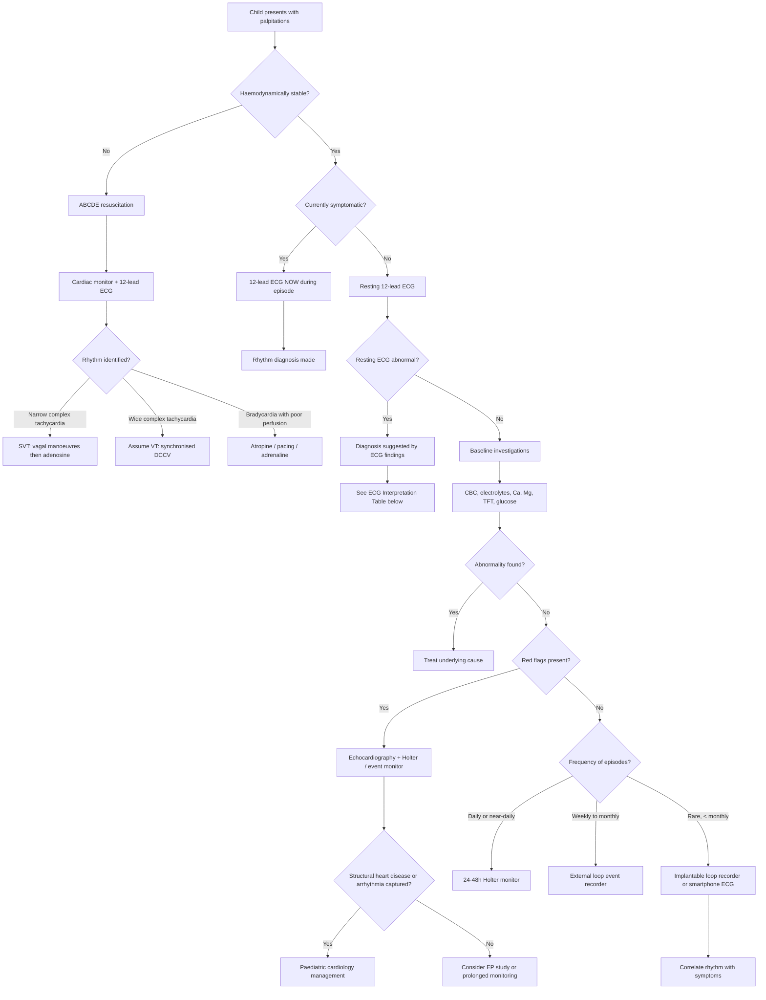

## Diagnostic Approach to Palpitations in Paediatrics

### Overview: There Is No Single "Diagnostic Criterion" for Palpitations

Palpitations are a **symptom**, not a disease. There is no formal diagnostic criterion for the symptom itself — the diagnostic task is to determine the **underlying rhythm or cause** of the palpitations. The approach is therefore:

1. **Capture the rhythm** — ideally during an episode (the "holy grail" is a 12-lead ECG during symptoms)
2. **Evaluate for structural heart disease** — echocardiography
3. **Screen for systemic causes** — bloods (anaemia, electrolytes, thyroid)
4. **Risk-stratify** — for sudden cardiac death risk (family history, resting ECG, exercise testing, genetic testing)

> In paediatrics, the major challenge is that episodes are often **brief and infrequent** — by the time the child presents to the emergency department, the episode has resolved and the resting ECG is normal. This is why ambulatory and event monitoring play such a critical role.

---

### Master Diagnostic Algorithm

---

### Investigation Modalities: Detailed Guide

#### 1. 12-Lead Electrocardiogram (ECG)

> **The single most important investigation.** Every child presenting with palpitations must have a resting 12-lead ECG, even if they are asymptomatic at the time of assessment.

##### Why the 12-Lead ECG Matters

The resting ECG can reveal the underlying diagnosis even **between episodes** in many conditions. Think of it as a "fingerprint" of the cardiac electrical system.

##### Paediatric ECG Interpretation — Key Differences from Adults

Before interpreting the ECG, you must know the **age-dependent normal values** — paediatric ECG interpretation is fundamentally different from adult interpretation:

| Parameter | Neonate | Infant (1–12m) | Child (1–8y) | Adolescent ( > 12y) |
|---|---|---|---|---|
| **Heart rate (bpm)** | 100–205 | 100–180 | 75–140 | 60–100 |
| **PR interval (ms)** | 80–160 | 80–160 | 90–170 | 120–200 |
| **QRS duration (ms)** | < 80 | < 80 | < 90 | < 100 (< 120 in adolescents) |
| **QTc (ms, Bazett)** | < 460 | < 460 | < 450 | < 450 (M), < 460 (F) |
| **Axis** | +60 to +180° (rightward) | +10 to +125° | 0 to +110° | –30 to +105° |
| **RV dominance** | Normal (T inversion V1–V3 in neonates is normal) | Gradual transition | Adult pattern emerging | Adult pattern |

[16]

<Callout title="Paediatric ECG Trap" type="error">
**Right ventricular dominance is normal in neonates and infants.** The neonatal right ventricle is thicker than the left (because in utero, the RV is the systemic ventricle pumping against high pulmonary vascular resistance). This means:
- Tall R waves in V1 and deep S waves in V6 are **normal** in neonates
- Right axis deviation is **normal** up to about 6 months of age
- T-wave inversion in V1–V3 is **normal** in neonates (the "juvenile T-wave pattern")

Do NOT apply adult ECG criteria to paediatric ECGs — you will overcall pathology.
</Callout>

##### Resting ECG Findings and Their Diagnostic Significance

| Finding on Resting ECG | Diagnosis Suggested | Explanation / Pathophysiology |
|---|---|---|
| ***Short PR interval + delta wave + wide QRS*** | ***WPW syndrome (pre-excitation)*** | The accessory pathway conducts faster than the AV node → early ventricular depolarisation (short PR) via the pathway → the "delta wave" is the slurred QRS upstroke as the ventricle activates from the accessory pathway insertion point before the His-Purkinje system kicks in → wider QRS [1][2] |
| **Prolonged QTc ( > 460 ms neonates; > 450 ms children)** | **Long QT syndrome (LQTS)** | Ion channel mutations → prolonged repolarisation → ECG shows prolonged QT interval → risk of early afterdepolarisations → TdP → syncope/SCD. Bazett formula: QTc = QT / √RR. Use age-appropriate cutoffs. |
| **Coved ST elevation in V1–V3 followed by negative T wave** | **Brugada syndrome (Type 1 pattern)** | SCN5A Na⁺ channel loss-of-function → premature repolarisation in RV epicardium → characteristic ECG pattern → VT/VF risk at rest/sleep |
| **Epsilon wave in V1–V3 ± T-wave inversion V1–V3 beyond infancy** | **Arrhythmogenic RV cardiomyopathy (ARVC)** | Desmosomal gene mutations → fibrofatty replacement of RV myocardium → delayed RV activation (epsilon wave = small deflection after QRS) → re-entrant VT substrate [6] |
| **Left ventricular hypertrophy (LVH) voltage criteria + ST/T repolarisation abnormalities** | **Hypertrophic cardiomyopathy (HCM)** | Sarcomere gene mutations → asymmetric septal hypertrophy → ↑ QRS voltages + repolarisation abnormalities; ***deep narrow Q waves in lateral leads suggest septal hypertrophy*** |
| **Giant T-wave inversions in precordial leads** | **Apical HCM** | ***Giant T-wave inversion in precordial leads; 25–30% of HCM in Japan and HK*** [17] |
| **Complete heart block: P waves marching through at one rate, QRS at separate slower rate** | **Congenital CHB (neonatal lupus) or post-surgical CHB** | Complete AV dissociation → atria and ventricles beat independently; ventricular escape rate 40–60 bpm |
| **Sinus bradycardia with pauses, then bursts of SVT** | **Sick sinus syndrome / tachy-brady** | SA node dysfunction → alternating bradycardia and tachycardia; ***common post-Fontan or atrial switch operation*** [9] |
| **Normal P waves, regular rhythm, rate appropriate for age** | **Sinus rhythm (normal between episodes)** | Resting ECG between paroxysmal arrhythmia episodes is often completely normal → need ambulatory monitoring to capture the arrhythmia |
| **PACs or PVCs visible** | **Ectopic beats** | Premature P waves (PACs) or wide bizarre QRS without preceding P wave (PVCs); isolated findings usually benign in structurally normal heart |

##### ECG During an Episode — Pattern Recognition

| ECG Pattern | Likely Diagnosis | Key Features |
|---|---|---|
| **Narrow QRS, regular, very rapid (180–300 bpm), no discernible P waves** | **AVRT or AVNRT** | Orthodromic AVRT: retrograde P waves may be seen in ST segment; AVNRT: pseudo-S in II/III/aVF or pseudo-R' in V1 |
| **Narrow QRS, sawtooth baseline (especially II, III, aVF, V1)** | **Atrial flutter** | ***Atrial rate 180–350 bpm; typical 2:1 block gives ventricular rate ~150 bpm in older children*** [1] |
| **Narrow QRS, irregularly irregular, no P waves, fibrillatory baseline** | **Atrial fibrillation** | Rare in children unless structural heart disease, WPW, or thyrotoxicosis |
| **Narrow QRS, abnormal P-wave morphology, rate 110–250 bpm** | ***Focal atrial tachycardia*** | ***Abnormal P-wave morphology; atrial rate 110–250 bpm; narrow QRS; underlying rhythm revealed by vagal manoeuvres or adenosine*** [1] |
| **Narrow QRS, ≥3 P-wave morphologies, irregularly irregular** | ***Multifocal atrial tachycardia (MAT)*** | ***≥3 P-wave morphologies in same lead; flat isoelectric line preserved (cf AF)*** [1] |
| **Wide QRS, regular, rapid, AV dissociation** | **Ventricular tachycardia** | Fusion and capture beats diagnostic; QRS morphology different from sinus; in children, **always assume wide-complex tachycardia is VT until proven otherwise** |
| **Wide QRS, irregularly irregular, very rapid** | **AF with WPW (pre-excited AF)** | Danger rhythm → conduction down accessory pathway → variable wide QRS → risk of VF; **AV nodal blockers contraindicated** |
| **Polymorphic QRS with rotating axis** | **Torsades de pointes (TdP)** | "Twisting of the points" → polymorphic VT in the setting of prolonged QT; check for QT prolongation when in sinus rhythm; degeneration to VF possible |

<Callout title="Adenosine as a Diagnostic Tool" type="idea">
***Adenosine (or vagal manoeuvres) can be used diagnostically*** — not just therapeutically — to unmask the underlying atrial rhythm:
- **SVT (AVRT/AVNRT)**: adenosine terminates the tachycardia by blocking AV node conduction → **abrupt termination** = diagnostic of re-entrant SVT involving the AV node
- **Atrial flutter / AT**: adenosine transiently blocks AV conduction → **reveals the underlying atrial rhythm** (sawtooth flutter waves or ectopic P waves become visible) but does NOT terminate the arrhythmia (because the atrial circuit does not involve the AV node)
- **Sinus tachycardia**: transient slowing then gradual return → **no abrupt termination**
- **VT**: no effect (the circuit does not involve the AV node)

This is why adenosine is considered both a therapeutic and a diagnostic agent in narrow-complex tachycardia [1].
</Callout>

##### Paediatric Adenosine Dosing (for diagnosis and treatment)
- **IV adenosine**: 0.1 mg/kg rapid IV push (maximum first dose 6 mg)
- If ineffective: 0.2 mg/kg (maximum 12 mg)
- **Must be given as rapid IV push** followed by immediate **saline flush** (adenosine has a half-life of < 10 seconds)
- **Administer through a large-bore IV as proximal as possible** (antecubital or central line preferred)
- **Continuous ECG recording during administration** to capture the diagnostic response

---

#### 2. Ambulatory ECG Monitoring

The resting ECG is often normal between episodes. Ambulatory monitoring aims to **capture the rhythm during symptoms**.

| Modality | Duration | Best For | Key Points |
|---|---|---|---|
| **24–48 hour Holter monitor** | 24–48 hours (can extend to 7 days with newer devices) | **Frequent episodes (daily or near-daily)** | Continuous recording; child/family keeps a symptom diary to correlate events with ECG; also quantifies PVC burden, detects asymptomatic arrhythmias, and assesses HR variability and QT dynamics |
| **External loop event recorder** | 2–4 weeks | **Less frequent episodes (weekly to monthly)** | Patient-activated: the child/parent presses a button when symptoms occur → device stores a retrospective and prospective ECG window; some newer devices have auto-detect algorithms for tachycardia/bradycardia |
| **Implantable loop recorder (ILR)** | Up to 3 years | **Rare but concerning episodes (< monthly); syncope workup** | Subcutaneously implanted (minor procedure under local/sedation); continuous monitoring with auto-detect for arrhythmias; remote transmission to clinic; used in paediatrics for unexplained syncope, suspected channelopathy with infrequent events |
| **Smartphone / smartwatch ECG** | Indefinite | **Adolescents with infrequent palpitations** | Single-lead ECG via Apple Watch, KardiaMobile, etc.; can provide a real-time rhythm strip during symptoms; increasingly used in clinical practice; limitations: single lead, motion artefact, not validated for all paediatric arrhythmias; still useful as a screening adjunct |
| **Trans-telephonic event monitor** | Variable | **Paroxysmal events** | Child records a short ECG strip and transmits by phone to a monitoring centre; being largely superseded by smartphone devices |

<Callout title="Symptom-Rhythm Correlation is the Gold Standard">
The diagnostic goal of any ambulatory monitor is to answer one question: **"When the child feels palpitations, what rhythm is the heart in?"** — and equally importantly — **"When the heart is in an arrhythmia, does the child have symptoms?"** This correlation (or lack thereof) drives all subsequent management.
</Callout>

---

#### 3. Echocardiography

##### Why
- To **identify or exclude structural heart disease** that may serve as a substrate for arrhythmias
- To assess **cardiac function** (especially if sustained tachycardia → tachycardia-mediated cardiomyopathy)
- ***Heart failure in infants: cardiomegaly is both a compensatory mechanism and a sign of sustained tachycardia*** [3]

##### Indications in Palpitations Workup
- Documented arrhythmia (especially SVT, VT, AF)
- Abnormal resting ECG (LVH, ST changes, pre-excitation)
- Syncope or near-syncope associated with palpitations
- Family history of cardiomyopathy or sudden cardiac death
- Clinical signs suggesting structural heart disease (murmur, displaced apex, abnormal pulses)
- Suspected tachycardia-mediated cardiomyopathy (chronic incessant tachycardia)

##### Key Findings

| Echo Finding | Diagnosis | Clinical Relevance |
|---|---|---|
| **Structurally normal heart with normal function** | Likely benign ectopy, AVRT/AVNRT in structurally normal heart, or non-cardiac cause | Very reassuring; management directed by arrhythmia type |
| **Asymmetric septal hypertrophy ± systolic anterior motion of mitral valve (SAM)** | ***HCM*** | ***LVOT obstruction in ~1/3 of HCM patients; SAM → mitral regurgitation; major determinant for HF symptoms and death*** [17] |
| **Dilated LV with ↓ systolic function** | DCM or tachycardia-mediated cardiomyopathy | If incessant AT or JET → suspect tachycardia-mediated DCM; function may recover after rate control / ablation |
| **RV dilation ± wall motion abnormalities** | ARVC | Fibrofatty replacement → akinetic/dyskinetic segments of RV free wall |
| **ASD, VSD, PDA** | Left-to-right shunt lesions → volume overload → atrial dilation → substrate for atrial arrhythmias | ***Large L-to-R shunt (VSD, AVSD, PDA) → heart failure in infants*** [3] |
| **Mitral valve prolapse (MVP)** | MVP | Leaflet prolapse visible; may be associated with PACs/PVCs; rarely SVT |
| **Coronary artery aneurysms** | **Kawasaki disease** | Risk of myocardial ischaemia → ischaemia-related arrhythmias; particularly relevant in HK |
| **Pericardial effusion** | Pericarditis / myocarditis | Associated with electrical instability; tamponade if large |

---

#### 4. Blood Investigations

These are "screening" tests to identify treatable systemic causes of palpitations. In a child with isolated benign ectopy and normal ECG, some clinicians only perform ECG ± echo. However, if there is any diagnostic uncertainty, the following bloods are recommended:

| Test | What It Detects | Rationale / Key Findings |
|---|---|---|
| **Full blood count (CBC)** | Anaemia | ↓ Hb → hyperdynamic circulation → sinus tachycardia + ↑ SV → palpitations. Iron deficiency is extremely common in HK toddlers and menstruating adolescent females |
| **Serum electrolytes (Na⁺, K⁺)** | Hypokalaemia, hyperkalaemia | ***Hypokalaemia: ECG changes at K < 3.0 → flattened T waves, U waves, ST depression, prolonged QT → risk of TdP/VF. Hyperkalaemia: ECG changes → peaked T waves (6–7 mmol/L), aberrant QRS (8–10), sine wave (10–12), VF*** [18] |
| **Calcium (Ca²⁺)** | Hypocalcaemia | Prolongs QT interval → risk of TdP. In neonates: early hypocalcaemia (first 48h, preterm, IUGR, IDM) and late hypocalcaemia (5–10 days, high phosphate cow's milk formula, DiGeorge syndrome) |
| **Magnesium (Mg²⁺)** | Hypomagnesaemia | Often accompanies hypokalaemia (renal Mg wasting and K wasting share mechanisms); directly predisposes to TdP (Mg stabilises cardiac ion channels); IV MgSO₄ is first-line treatment for TdP |
| **Thyroid function tests (TFT): TSH ± fT4** | Thyrotoxicosis / hypothyroidism | ***Thyrotoxicosis → hyperdynamic circulation + direct arrhythmogenic effect*** [7]; hypothyroidism → sinus bradycardia (strong beats); **in HK, neonatal thyroid screening is universal but Graves' disease in adolescents can still present with palpitations** |
| **Blood glucose** | Hypoglycaemia | ***Adrenergic symptoms: palpitation, sweating, anxiety, tremor, tachycardia*** [14]; counterregulatory catecholamine surge drives sinus tachycardia |
| **C-reactive protein (CRP) / ESR** | Inflammatory markers | Elevated in myocarditis, acute rheumatic fever, Kawasaki disease, MIS-C |
| **Cardiac troponin (cTn)** | Myocardial injury | Elevated in myocarditis, anomalous coronary artery with ischaemia; also mildly elevated in sustained SVT with haemodynamic compromise |
| **BNP / NT-proBNP** | Heart failure screening | Elevated if ventricular dysfunction (tachycardia-mediated DCM, myocarditis, CHD); paediatric normal ranges differ from adult — interpret with age-specific cutoffs |
| **24-hour urine catecholamines + fractionated metanephrines** | Phaeochromocytoma / paraganglioma | ***Screening for catecholamine-secreting tumour; abnormal if > 2× elevation; false positives: stress, OSA, drugs (TCA, α-agonists, levodopa → stop 1 week before testing)*** [13][19]. Rare in children but ↑ familial rate |
| **Toxicology screen** | Substance use | In adolescents with acute palpitations ± concerning features: screen for amphetamines, cocaine, cannabis, MDMA. Always approach sensitively, with confidentiality |

---

#### 5. Exercise Stress Testing (EST)

##### Why
- To provoke arrhythmias that are **exercise-triggered** — this is the primary indication in paediatric palpitations
- To assess the behaviour of known arrhythmias during exercise (e.g., does PVC burden increase or suppress? do pre-excitation delta waves disappear at high HR?)
- To screen for catecholaminergic polymorphic VT (CPVT) — the hallmark finding is **bidirectional or polymorphic VT during exercise** in a child with structurally normal heart and normal resting ECG

##### Indications
- Exercise-triggered palpitations or syncope
- Suspected CPVT (exercise-triggered syncope + normal resting ECG + no structural disease)
- Risk stratification of WPW (if the delta wave disappears abruptly at moderate HR → accessory pathway has a long refractory period → lower risk of rapid conduction if AF develops)
- Assessment of PVC behaviour with exercise (suppression = reassuring; increase = concerning)
- Suspected LQTS: failure of QT to shorten appropriately with exercise (especially LQT1)

##### Protocol
- In children, use age-appropriate exercise protocols (modified Bruce, bicycle ergometer)
- Continuous 12-lead ECG monitoring + BP monitoring
- Must have resuscitation equipment available
- Minimum age ~5–6 years (cooperative enough for treadmill/bicycle); younger children → use pharmacological stress or ambulatory monitoring instead

---

#### 6. Electrophysiology Study (EPS)

##### What It Is
- An **invasive** procedure performed in the cardiac catheterisation laboratory
- Electrode catheters inserted via femoral veins → positioned in RA, RV, His bundle, coronary sinus
- Used to **map the electrical conduction system**, identify accessory pathways, and provoke arrhythmias under controlled conditions

##### Indications in Paediatrics
- **Documented SVT** for which **catheter ablation** is being considered (EPS = diagnostic + therapeutic in the same session)
- **WPW syndrome** risk stratification: determine the refractory period of the accessory pathway (short refractory period < 250 ms → high risk of rapid ventricular response if AF develops → ablation recommended)
- **VT of uncertain mechanism** requiring mapping for ablation
- **Syncope with suspected arrhythmic cause** where non-invasive monitoring has failed to establish diagnosis
- **Post-operative CHD** with documented or suspected arrhythmia

##### Paediatric Considerations
- Generally deferred until the child is older/larger (typically > 15 kg, ideally > 4–5 years) unless clinically urgent
- Performed under general anaesthesia or deep sedation in younger children (beware: GA may suppress arrhythmia inducibility, especially if using propofol)
- **Radiofrequency ablation (RFA)** or **cryoablation** can be performed during the same procedure — cryoablation is preferred near the AV node (reversible if inadvertent AV block occurs; "cryomapping" before permanent lesion)
- Success rates for SVT ablation in children: > 95% for AVRT and AVNRT

---

#### 7. Cardiac MRI (CMR)

##### Indications
- Suspected ARVC (fibrofatty replacement, RV wall motion abnormalities — MRI is the gold standard for tissue characterisation)
- Myocarditis (late gadolinium enhancement in a non-coronary distribution)
- HCM (more accurate wall thickness measurement than echo, particularly apical HCM; late gadolinium enhancement = fibrosis = arrhythmia substrate)
- Complex CHD where echo is insufficient

##### Paediatric Considerations
- Young children ( < 6–8 years) usually require **general anaesthesia or deep sedation** for the duration of the scan (30–60 minutes motionless)
- Gadolinium contrast used for late enhancement studies — low risk of nephrogenic systemic fibrosis (check renal function)

---

#### 8. Genetic Testing

##### When to Consider
- Clinical suspicion of channelopathy (LQTS, CPVT, Brugada) based on ECG ± family history
- Clinical/echo diagnosis of HCM, DCM, or ARVC
- First-degree relative with confirmed pathogenic variant (cascade screening)
- Survivor of sudden cardiac arrest without clear cause

##### What It Involves
- Peripheral blood sample for DNA extraction
- Targeted gene panels (e.g., cardiac channelopathy panel: KCNQ1, KCNH2, SCN5A, RYR2, etc.)
- Results guide management (e.g., genotype-specific beta-blocker choice in LQTS, family screening)
- Turnaround time: weeks to months

##### Paediatric Considerations
- **Consent and assent**: genetic testing has implications for the child and the entire family — discuss with parents; involve the child in age-appropriate discussion; genetic counselling essential
- **Cascade screening**: if a pathogenic variant is found, all first-degree relatives should be offered testing

---

#### 9. Additional Targeted Investigations

| Investigation | Indication | Key Findings |
|---|---|---|
| **Tilt-table test** | Recurrent unexplained syncope (suspected vasovagal or autonomic dysfunction) in older children/adolescents | Reproduction of syncope with HR/BP changes during passive tilt; helps classify neurocardiogenic syncope subtypes (cardioinhibitory vs vasodepressor vs mixed) |
| **Drug provocation (ajmaline/procainamide)** | Suspected Brugada syndrome with inconclusive resting ECG | Na⁺ channel blocker unmasks the type 1 Brugada ECG pattern in susceptible individuals |
| **Epinephrine provocation** | Suspected LQTS with borderline QTc | IV epinephrine infusion: paradoxical QT prolongation during infusion = positive for LQTS (particularly LQT1 and LQT2) |
| ***24-hour urine fractionated metanephrines*** | ***Suspected phaeochromocytoma*** | ***Abnormal if > 2× elevation; screening test of choice*** [13][19] |
| **CT/MRI abdomen** | Phaeochromocytoma localisation after biochemical confirmation | Anatomical localisation of tumour |
| ***I-123 MIBG scan*** | ***Phaeochromocytoma: functional localisation*** | ***MIBG = norepinephrine analogue, taken up by phaeochromocytoma*** [19] |
| **Chest X-ray** | Cardiomegaly, pulmonary congestion | ***Heart failure signs: cardiomegaly (CTR > 55% in children, > 60% in infants), pulmonary plethora (L-to-R shunt), pulmonary oligaemia (R-to-L shunt)*** [3] |

---

### Putting It All Together — Stepwise Diagnostic Approach Summary

| Step | Action | Rationale |
|---|---|---|
| **1. Focused History** | Characterise palpitation (onset, offset, rate, rhythm, triggers, termination, associated symptoms, family history, drugs) | ***History most important: age of onset, onset, precipitating factors, quality, severity, termination*** [1][2] |
| **2. Physical Examination** | Vital signs, pulse character, murmur, signs of heart failure, goitre, pallor, syndromic features | Identifies structural heart disease, hyperdynamic circulation, systemic cause |
| **3. Resting 12-Lead ECG** | Every child — look for pre-excitation, prolonged QT, Brugada pattern, LVH, ectopy, conduction block | May diagnose condition even between episodes |
| **4. Baseline Bloods** | CBC, electrolytes (K, Ca, Mg), TFT, glucose ± CRP, troponin, BNP | Screens for treatable systemic causes |
| **5. Echocardiography** | If arrhythmia documented, abnormal ECG, murmur, syncope, red flags | Structural heart disease assessment and function |
| **6. Ambulatory Monitoring** | Holter (daily symptoms), event recorder (weekly-monthly), ILR (rare) | Capture symptom-rhythm correlation |
| **7. Exercise Stress Test** | If exercise-triggered symptoms or suspected CPVT, LQTS, WPW risk stratification | Provoke arrhythmia and assess physiological response |
| **8. Electrophysiology Study** | If ablation considered, WPW risk stratification, VT mapping, or diagnostic uncertainty after non-invasive workup | Definitive diagnosis + potential cure (ablation) in same session |
| **9. Genetic Testing** | If channelopathy, cardiomyopathy, or sudden cardiac arrest survivor | Genotype-phenotype correlation; cascade family screening |

---

<Callout title="High Yield Summary">

**No diagnostic criteria for palpitations themselves** — the task is to identify the underlying rhythm or cause.

**Every child with palpitations needs a esting 12-lead ECG.** Know paediatric normal ECG values (HR, PR, QRS, QTc, axis — all age-dependent).

**Key resting ECG diagnoses**: Pre-excitation (WPW: short PR, delta wave), prolonged QTc (LQTS), Brugada pattern (coved ST V1–V3), LVH (HCM), epsilon waves (ARVC), giant T inversions in precordial leads (apical HCM — ***common in HK***).

**Adenosine = diagnostic + therapeutic**: Terminates AVRT/AVNRT (diagnostic of AV nodal re-entry); reveals underlying atrial rhythm in flutter/AT (diagnostic but does not terminate); no effect on VT or sinus tachycardia.

**Ambulatory monitoring** captures symptom-rhythm correlation: Holter for daily episodes, event recorder for weekly-monthly, ILR for rare events.

**Bloods**: CBC (anaemia), K/Ca/Mg (arrhythmogenic electrolyte disturbances), TFT (thyrotoxicosis), glucose (hypoglycaemia).

**Echo**: structural heart disease assessment — mandatory if arrhythmia documented, abnormal ECG, syncope, or red flags.

**Exercise testing**: for exercise-triggered symptoms, CPVT screening, WPW risk stratification, PVC assessment.

**EPS**: invasive definitive diagnosis + ablation; deferred until child is older/larger unless urgent.

**Genetic testing**: channelopathies, cardiomyopathies, cardiac arrest survivors — always with genetic counselling and cascade screening.

</Callout>

---

<ActiveRecallQuiz
  title="Active Recall - Diagnosis of Palpitations in Paediatrics"
  items={[
    {
      question: "What is the response to adenosine in each of the following: (a) AVRT/AVNRT, (b) atrial flutter, (c) sinus tachycardia, (d) ventricular tachycardia?",
      markscheme: "(a) AVRT/AVNRT: abrupt termination (circuit involves AV node). (b) Atrial flutter: transient AV block revealing sawtooth flutter waves, but arrhythmia NOT terminated (circuit does not involve AV node). (c) Sinus tachycardia: transient slowing then gradual return to baseline rate. (d) VT: no effect (circuit does not involve AV node). This is why adenosine is both a diagnostic and therapeutic tool."
    },
    {
      question: "Name three resting ECG findings (in a child between episodes) that can suggest the diagnosis even when the child is asymptomatic, and state the diagnosis each suggests.",
      markscheme: "(1) Short PR, delta wave, wide QRS = WPW syndrome (pre-excitation via accessory pathway). (2) Prolonged QTc (> 460ms neonates, > 450ms children) = Long QT syndrome. (3) Coved ST elevation V1-V3 with negative T wave = Brugada syndrome. Others acceptable: giant T-wave inversion in precordial leads (apical HCM), epsilon waves in V1-V3 (ARVC), LVH pattern (HCM)."
    },
    {
      question: "A 10-year-old boy with palpitations occurring twice a month and a normal resting ECG is referred for monitoring. Which ambulatory monitoring modality is most appropriate and why?",
      markscheme: "External loop event recorder (worn for 2-4 weeks). Rationale: episodes occur weekly-to-monthly, which is too infrequent for a 24-48h Holter to capture but frequent enough that an external event recorder (worn for weeks) has a reasonable probability of capturing an event. Patient/parent presses a button during symptoms; device stores retrospective and prospective ECG. An ILR would be considered only if the event recorder fails to capture an episode."
    },
    {
      question: "What is the paediatric IV adenosine dose for SVT, and what are three critical administration details?",
      markscheme: "Dose: 0.1 mg/kg rapid IV push (max first dose 6 mg); if ineffective, 0.2 mg/kg (max 12 mg). Critical details: (1) Must be given as rapid IV push (half-life less than 10 seconds; slow administration = drug degraded before reaching the heart). (2) Followed by immediate saline flush. (3) Administer through large-bore IV as proximal as possible (antecubital or central line). Also: continuous ECG recording during administration to capture the diagnostic response."
    },
    {
      question: "List three specific indications for echocardiography in a child presenting with palpitations.",
      markscheme: "Any 3 of: (1) Documented arrhythmia (SVT, VT, AF). (2) Abnormal resting ECG (LVH, ST changes, pre-excitation). (3) Syncope or near-syncope associated with palpitations. (4) Family history of cardiomyopathy or sudden cardiac death. (5) Clinical signs of structural heart disease (murmur, displaced apex, abnormal pulses). (6) Suspected tachycardia-mediated cardiomyopathy (chronic incessant tachycardia with signs of heart failure)."
    },
    {
      question: "What is the hallmark exercise stress test finding in catecholaminergic polymorphic VT (CPVT), and why does this arrhythmia occur?",
      markscheme: "Hallmark finding: bidirectional or polymorphic VT appearing during exercise at increasing heart rates, in a child with structurally normal heart and normal resting ECG. Mechanism: RyR2 mutation (most common) causes defective ryanodine receptor on the sarcoplasmic reticulum. During exercise, catecholamine surge increases intracellular calcium. The mutant RyR2 leaks calcium from the SR, causing delayed afterdepolarisations (DADs) that trigger VT. At rest, catecholamine levels are low, so the arrhythmia is not present and the resting ECG is normal."
    }
  ]}
/>

---

## References

[1] Senior notes: Ryan Ho Cardiology.pdf (p61, p92 — Palpitations, Atrial Tachycardia sections)
[2] Senior notes: Ryan Ho Fundamentals.pdf (p206 — Palpitations section)
[3] Senior notes: Adrian Lui Pediatrics.pdf (p186, p197 — CVS examination, Heart Failure and Acyanotic Heart Disease)
[6] Senior notes: Ryan Ho Critical Care.pdf (p28 — Cardiac Arrest section; ARVD footnote from Ryan Ho Cardiology.pdf p83)
[7] Senior notes: Ryan Ho Endocrine.pdf (p13, p18, p19 — Thyroid investigations)
[9] Senior notes: Ryan Ho Cardiology.pdf (p83 — Sick sinus syndrome)
[13] Senior notes: Ryan Ho Endocrine.pdf (p66 — Phaeochromocytoma)
[14] Senior notes: Ryan Ho Endocrine.pdf (p94 — Hypoglycaemia)
[16] Senior notes: Ryan Ho Fundamentals.pdf (p448 — ECG Basics)
[17] Senior notes: Ryan Ho Cardiology.pdf (p167, p169 — HCMP, Apical HCMP)
[18] Senior notes: Ryan Ho Chemical Path.pdf (p14 — Hyperkalaemia)
[19] Senior notes: maxim.md (p432, p436 — Adrenal incidentaloma, Phaeochromocytoma investigations)
