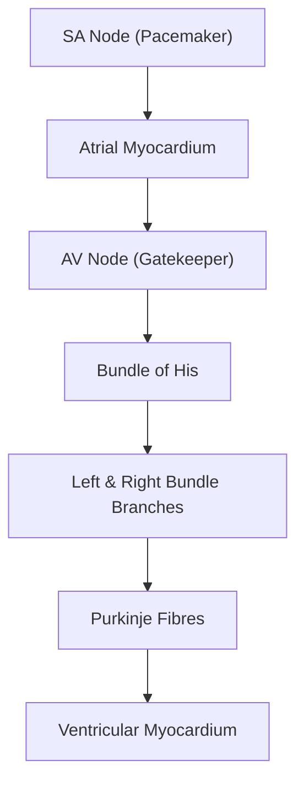

# Palpitations in Paediatrics

## Definition

Palpitations refer to the **unexpected, subjective awareness of one's own heartbeat** — the child (or more commonly the caregiver) perceives the heart beating too fast, too hard, too slow, or irregularly [1][2]. The term itself is vague and encompasses a wide spectrum of underlying causes, from benign ectopic beats to life-threatening ventricular arrhythmias.

> **"Palpitation"** derives from Latin *palpitare* = "to throb, flutter." It is a **symptom**, not a diagnosis. The clinical task is always to determine *what rhythm the heart was in* during the episode.

In paediatrics, the challenge is amplified because:
- **Younger children cannot articulate the sensation** — they may say "my heart is jumping" or "my chest feels funny," or simply appear distressed/pale without explanation.
- **Infants cannot report symptoms at all** — tachyarrhythmias in neonates and infants present with irritability, poor feeding, pallor, or frank heart failure rather than a complaint of "palpitations."
- **Caregivers** often notice the child's heart racing when holding or bathing them, or notice a rapid pulse incidentally.

<Callout title="Paediatric Pearl">
In infants and toddlers, sustained tachyarrhythmias (e.g., SVT lasting hours) may present as **heart failure** (poor feeding, tachypnoea, hepatomegaly, pallor) rather than palpitations. Always consider arrhythmia in the differential of unexplained heart failure in a previously well infant [3].
</Callout>

---

## Epidemiology and Risk Factors

### Epidemiology
- Palpitations are a **common presenting complaint** in paediatric cardiology clinics, though less frequent than in adults.
- In large paediatric emergency department series, arrhythmia-related presentations account for approximately **0.5–1%** of visits.
- **Supraventricular tachycardia (SVT)** is the most common pathological tachyarrhythmia in children, with an estimated incidence of **1 in 250–1,000 children** [4].
- In neonates, SVT is the most common arrhythmia requiring treatment, often presenting within the first few months of life.
- Many paediatric palpitations are **benign** — sinus tachycardia from fever, anxiety, or exercise is by far the most common cause.

### Risk Factors for Pathological Arrhythmias in Children

| Risk Factor | Mechanism / Relevance |
|---|---|
| **Congenital heart disease (CHD)** — especially post-surgical | Surgical scars create re-entrant circuits (e.g., intra-atrial re-entrant tachycardia after Fontan/atrial switch); volume/pressure overload causes atrial/ventricular dilation → substrate for arrhythmia [3] |
| **Wolff-Parkinson-White syndrome (WPW)** | Accessory pathway (bundle of Kent) allows AV re-entrant tachycardia (AVRT); present from birth [1][2] |
| **Family history of sudden cardiac death or channelopathies** | Long QT syndrome (LQTS), Brugada syndrome, catecholaminergic polymorphic VT (CPVT) — all have genetic basis [1] |
| **Cardiomyopathy** (HCM, DCM, ARVC) | Myocardial fibrosis/disarray creates arrhythmogenic substrate; ***palpitations and arrhythmias (both VT and SVT, esp AF)*** are presenting features of HCM [5] |
| **Electrolyte disturbances** | Hypokalaemia (→ prolonged QT, U waves, VT/VF), hyperkalaemia (→ bradycardia, VF), hypocalcaemia (→ prolonged QT), hypomagnesaemia (→ torsades de pointes) [6] |
| **Drugs / substances** | Caffeine, energy drinks, sympathomimetics (salbutamol/SABA), stimulant medications (methylphenidate), tricyclic antidepressants, digoxin toxicity [1] |
| **Thyrotoxicosis** | Hyperdynamic circulation + direct effect on cardiac ion channels → sinus tachycardia, AF, SVT; ***thyrotoxic periodic paralysis*** in Asian adolescents [7] |
| **Anaemia** | Compensatory ↑heart rate and ↑stroke volume → awareness of forceful beats |
| **Anxiety / panic disorder** | Hyperventilation → ↓CO₂ → respiratory alkalosis → paraesthesiae + palpitations; autonomic activation → sinus tachycardia [8] |
| **Fever / infection** | Sinus tachycardia (HR increases ~10 bpm per 1°C rise); myocarditis may cause ectopy or VT |
| **Myocarditis** | Inflammatory infiltrate → electrical instability → ectopy, VT, or conduction block |

<Callout title="Hong Kong Context" type="idea">
In Hong Kong, the following deserve emphasis:
- **Kawasaki disease** is common (high incidence in East Asian populations) — coronary artery aneurysms can lead to ischaemia-related arrhythmias.
- **Thyrotoxic periodic paralysis (TPP)** is disproportionately seen in young Asian males (up to 2% of hyperthyroid Asian patients); palpitations + weakness should trigger this differential [7].
- **Rheumatic heart disease**, while declining, still occurs — mitral valve disease can lead to atrial arrhythmias.
- **Energy drink consumption** among adolescents is increasingly recognised as a trigger for SVT and palpitations.
</Callout>

---

## Anatomy and Physiology of the Cardiac Conduction System (Paediatric Focus)

Understanding palpitations requires understanding *how the heart generates and conducts electrical impulses* — and how this differs in children versus adults.

### Normal Conduction Pathway

1. **Sinoatrial (SA) node** — located at the junction of the SVC and right atrium; the "natural pacemaker" with the highest intrinsic rate of automaticity.
   - *Paediatric normal sinus rates are age-dependent* (see table below).
2. **Atrial myocardium** — impulse spreads across both atria → atrial contraction (P wave on ECG).
3. **Atrioventricular (AV) node** — located at the base of the interatrial septum near the coronary sinus os; serves as a **physiological delay** (PR interval) to allow atrial contraction to fill ventricles before ventricular systole.
   - The AV node also acts as a **gatekeeper** — it has a longer refractory period, preventing 1:1 conduction of very rapid atrial rates to the ventricles. This is why atrial flutter with 300 bpm atrial rate typically conducts 2:1 to give a ventricular rate of ~150 bpm.
4. **Bundle of His → bundle branches → Purkinje fibres** — rapid conduction to ventricular myocardium → coordinated ventricular contraction (QRS complex).

### Age-Dependent Normal Heart Rates

| Age | Awake HR (bpm) | Sleeping HR (bpm) |
|---|---|---|
| Neonate (0–28 days) | 100–205 | 90–160 |
| Infant (1–12 months) | 100–180 | 90–160 |
| Toddler (1–3 years) | 98–140 | 80–120 |
| Preschool (4–5 years) | 80–120 | 65–100 |
| School age (6–11 years) | 75–118 | 58–90 |
| Adolescent (12–15 years) | 60–100 | 50–90 |

> The key point: **what constitutes "tachycardia" is age-dependent**. A heart rate of 160 bpm is normal in a crying neonate but alarming in a 10-year-old at rest.

### Key Electrophysiological Concepts

- **Automaticity**: the ability of specialised cardiac cells to spontaneously depolarise. The SA node has the fastest rate → it "wins" as pacemaker. If automaticity is enhanced in other foci (e.g., an ectopic atrial focus), those foci can "take over" → ectopic tachycardia.
- **Re-entry**: the most common mechanism for sustained tachyarrhythmias in children. Requires:
  1. Two pathways with different conduction velocities and refractory periods
  2. Unidirectional block in one pathway
  3. Slow conduction in the other pathway (allowing the blocked pathway to recover)
  4. → The impulse "circles" around the circuit indefinitely = sustained tachycardia
  - ***AVRT*** (uses an accessory pathway) and ***AVNRT*** (uses dual AV nodal pathways) are classic re-entrant tachycardias [1][2].
- **Triggered activity**: afterdepolarisations (early or delayed) that reach threshold → extra beats. Seen in long QT syndrome (early afterdepolarisations, EADs) and digoxin toxicity (delayed afterdepolarisations, DADs).

### Paediatric vs. Adult Differences

| Feature | Paediatrics | Adults |
|---|---|---|
| Most common pathological tachyarrhythmia | **SVT (AVRT > AVNRT)** | AF |
| Accessory pathway prevalence | Higher (WPW more common as a cause of SVT in children < 5 years) | Lower prevalence |
| Structural heart disease context | **Congenital** heart disease | **Acquired** (ischaemic, valvular) |
| VT | Rare; if present → consider channelopathy, cardiomyopathy, myocarditis, or long QT | More common; usually ischaemic substrate |
| AF | Very rare except in post-surgical CHD or cardiomyopathy | Very common |
| Tolerance of SVT | Infants may tolerate SVT for hours before developing HF; older children report palpitations sooner | Adults usually symptomatic quickly |

---

## Aetiology (Hong Kong–Relevant) and Pathophysiology

The causes of palpitations can be organised by mechanism. Below, each aetiology is paired with its pathophysiology to explain *why* it causes the sensation of palpitations.

### A. Tachyarrhythmias (Most Important Category)

These are arrhythmias where the ventricular rate is faster than normal for age. The child (or parent) perceives the rapid, forceful beating.

#### 1. Sinus Tachycardia (ST) — *The Most Common Cause*

- **Definition**: Appropriate ↑ in SA node firing rate in response to physiological or pathological demand.
- **Causes in children**:
  - **Physiological**: exercise, crying, pain, anxiety, fever (↑10 bpm per 1°C)
  - **Pathological**: dehydration/hypovolaemia, anaemia (compensatory ↑HR to maintain O₂ delivery), sepsis, thyrotoxicosis, heart failure, drugs (salbutamol, caffeine, methylphenidate)
- **Pathophysiology**: ↑ sympathetic tone or ↓ vagal tone → ↑SA node automaticity → ↑HR → the child/parent perceives rapid beating.
- **Key features**: gradual onset and offset (not sudden); rate varies with activity/emotion; **P waves are normal and upright in lead II** (because the SA node is still the pacemaker) [1].

<Callout title="Sinus Tachycardia is a Response, Not a Disease" type="error">
A common mistake is to "treat" sinus tachycardia with anti-arrhythmics. Sinus tachycardia is always secondary — treat the underlying cause (rehydrate, antipyretics, correct anaemia, etc.). The tachycardia will resolve when the trigger is addressed.
</Callout>

#### 2. Supraventricular Tachycardia (SVT)

***SVT is the most common pathological tachyarrhythmia in children*** [3][4].

##### a) AV Re-entrant Tachycardia (AVRT) — *Most common SVT mechanism in infants and young children*

- **Pathophysiology**: An **accessory pathway** (bundle of Kent) connects atrium to ventricle, bypassing the AV node. This creates two limbs of a potential re-entrant circuit:
  - **Orthodromic AVRT** (90%): impulse goes *down* through AV node (normal path) and *up* through accessory pathway → **narrow QRS** (because ventricle is activated normally via His-Purkinje system).
  - **Antidromic AVRT** (10%): impulse goes *down* through accessory pathway and *up* through AV node → **wide QRS** (because ventricle is activated from the accessory pathway insertion, not the His-Purkinje system) → can mimic VT.
- **WPW syndrome** (*"Wolff–Parkinson–White"*: Wolff, Parkinson, White = the three physicians who described it):
  - Defined as **pre-excitation on resting ECG** (short PR, delta wave, wide QRS) **plus** symptomatic tachycardia.
  - **Delta wave** = slurred upstroke of the QRS, representing early ventricular activation through the accessory pathway during sinus rhythm.
  - ***In children, WPW/AVRT is the most common mechanism of SVT, especially under 5 years of age*** [1][2].
  - **Risk**: If AF develops in a WPW patient, rapid conduction down the accessory pathway (which lacks the AV node's rate-limiting property) can cause VF → **sudden death**. This is why AV nodal blocking drugs (digoxin, verapamil) are **contraindicated** in WPW with AF (they block the AV node → all conduction funnels down the accessory pathway) [3].

##### b) AV Nodal Re-entrant Tachycardia (AVNRT) — *More common in older children and adolescents*

- **Pathophysiology**: The AV node itself has **dual pathways** — a fast pathway (long refractory period) and a slow pathway (short refractory period). A premature atrial beat can block in the fast pathway (still refractory) and conduct down the slow pathway; by the time the impulse reaches the distal end, the fast pathway has recovered → the impulse travels *up* the fast pathway → re-enters the slow pathway → sustained circuit.
- ***Sudden onset and offset; terminated by vagal manoeuvres or adenosine*** (because the circuit depends on the AV node) [1][2].
- **ECG**: narrow QRS, regular, very rapid (typically 180–280 bpm in children); P waves often hidden in QRS or seen as pseudo-S in inferior leads / pseudo-R' in V1.

##### c) Atrial Tachycardia (AT)

- **Focal AT**: an ectopic atrial focus fires faster than the SA node → takes over as pacemaker.
  - *Mechanism: abnormal automaticity, micro-re-entry, or triggered activity* [1].
  - **ECG**: abnormal P-wave morphology (different from sinus P), atrial rate 110–250 bpm, narrow QRS.
  - Can be **incessant** in children → may cause **tachycardia-mediated cardiomyopathy** (DCM from chronic ↑HR).
- **Multifocal AT (MAT)**: ≥3 P-wave morphologies; rare in children; associated with pulmonary disease or critical illness.

##### d) Atrial Flutter (AFL) and Atrial Fibrillation (AF)

- **Atrial flutter**: rapid regular atrial activity (typically ~300 bpm in older children, higher in neonates) with a re-entrant circuit around the tricuspid valve annulus → **"sawtooth" baseline** on ECG [1].
  - In neonates: can occur de novo, often resolves spontaneously; in older children: usually a/w CHD (especially post-atrial surgery) [3].
  - Ventricular rate depends on AV conduction ratio (e.g., 2:1 → ~150 bpm; 4:1 → ~75 bpm).
- **AF**: chaotic atrial activity → irregularly irregular ventricular response.
  - ***Very rare in children*** unless structural heart disease (e.g., dilated cardiomyopathy, rheumatic mitral stenosis) or post-cardiac surgery. Also seen in adolescents with WPW (dangerous — see above) or hyperthyroidism [1].

##### e) Junctional Ectopic Tachycardia (JET)

- Automatic tachycardia arising from the AV junction; most commonly seen **post-cardiac surgery** (especially after VSD repair or Tetralogy of Fallot repair) due to surgical trauma near the AV node/His bundle.
- Also a congenital form (congenital JET) — rare but can be incessant → cardiomyopathy.
- **ECG**: narrow QRS, AV dissociation (atrial rate < ventricular rate), no P waves preceding QRS.

#### 3. Ventricular Arrhythmias

- ***Rare in children but critically important because of risk of sudden cardiac death*** [3].

##### a) Premature Ventricular Complexes (PVCs / VPBs)

- Isolated PVCs are **common and usually benign** in children with structurally normal hearts.
- Pathophysiology: ectopic focus in the ventricular myocardium depolarises before the next sinus beat → the child feels a "skipped beat" or "thump" (actually the post-ectopic pause followed by a compensatory strong beat with ↑ stroke volume due to longer diastolic filling time) [1][2].
- **Features suggesting benignity**: single morphology, suppressed by exercise, no underlying heart disease, < 10% PVC burden on Holter.
- **Features suggesting concern**: ↑ PVC burden ( > 10–15%), multiple morphologies, couplets/triplets, worsened by exercise, underlying structural heart disease → risk of PVC-mediated cardiomyopathy.

##### b) Ventricular Tachycardia (VT)

- **Definition**: ≥3 consecutive ventricular beats at rate > 120 bpm.
- **Causes in children**:
  - **Channelopathies**: Long QT syndrome (LQTS), catecholaminergic polymorphic VT (CPVT), Brugada syndrome
  - **Cardiomyopathies**: HCM (***sudden cardiac death due to VT/VF, typically during or after vigorous physical activity*** [5]), DCM, arrhythmogenic right ventricular cardiomyopathy (ARVC)
  - **Myocarditis**: viral (e.g., Coxsackie B, adenovirus, parvovirus B19)
  - **Post-surgical CHD**: scar-related re-entry (especially after TOF repair)
  - **Electrolyte disturbances**: hypokalaemia, hypomagnesaemia
  - **Idiopathic VT**: right ventricular outflow tract (RVOT) VT — usually benign in structurally normal hearts
- **Pathophysiology of LQTS → Torsades de Pointes (TdP)**:
  - Mutations in cardiac ion channels (e.g., KCNQ1 in LQT1, KCNH2 in LQT2, SCN5A in LQT3) → prolonged ventricular repolarisation → prolonged QT interval → **early afterdepolarisations (EADs)** during phase 2/3 of action potential → triggered activity → polymorphic VT (TdP = "twisting of the points" — the QRS axis rotates around the baseline).
  - ***Young patients: think congenital syndromes (e.g., LQTS, WPW syndrome)*** [1][2].

##### c) Ventricular Fibrillation (VF)

- Chaotic, uncoordinated ventricular activity → no effective cardiac output → **cardiac arrest**.
- Causes: degeneration of VT, severe electrolyte disturbance, commotio cordis (blunt chest trauma in children, e.g., hit by a ball → VF triggered during the vulnerable period of repolarisation).

#### 4. Premature Atrial Complexes (PACs / APBs)

- Very common and almost always benign in children.
- Pathophysiology: ectopic atrial focus fires early → premature P wave → may or may not conduct to ventricles (if AV node is refractory → "blocked PAC" → perceived as a pause).
- Can trigger SVT if the premature beat finds the re-entrant circuit in a vulnerable state [1].

### B. Hyperdynamic Circulation (Exaggerating Sinus Rhythm)

Here the heart rhythm is normal sinus, but the **stroke volume is increased** → forceful beats that the child perceives.

| Cause | Mechanism |
|---|---|
| **Anaemia** | ↓ O₂ carrying capacity → compensatory ↑HR + ↑SV (↓ blood viscosity → ↓ afterload → ↑SV) |
| **Fever / sepsis** | Cytokines + vasodilation → ↑CO as compensatory response |
| **Thyrotoxicosis** | T3/T4 → ↑β-adrenergic receptor density + ↑Na⁺/K⁺-ATPase activity → ↑HR, ↑contractility, ↓SVR → hyperdynamic state; ***regular, relatively fast pounding (90–120 bpm)*** [1][7] |
| **Anxiety / panic** | ↑ sympathetic tone → ↑HR, ↑contractility; may coexist with hyperventilation → paraesthesiae, dizziness [8] |
| **Exercise** | Physiological ↑ sympathetic drive |
| **Pregnancy** (relevant in older adolescents) | ↑ blood volume + ↓SVR → ↑CO |
| **Aortic regurgitation (AR)** | Wide pulse pressure → ↑SV → bounding/forceful beats perceived as palpitations |
| **Patent ductus arteriosus (PDA)** | L→R shunt → volume overload of left heart → ↑SV → ***hyperdynamic circulation*** [1][3] |
| **Arteriovenous malformation (AVM)** | Low-resistance shunt → ↑CO to compensate |

### C. Bradyarrhythmias with Compensatory Strong Beats

- ***Bradyarrhythmias with strong beats (↑ diastolic time → ↑ stroke volume)*** [1][2].
- When the heart is slow, each beat has a longer diastolic filling time → ↑ end-diastolic volume → ↑ stroke volume (Frank-Starling mechanism) → each beat is stronger and more perceptible.

| Cause | Mechanism |
|---|---|
| **Sinus bradycardia** | May be physiological (athletic child) or pathological (hypothyroidism, ↑ICP, hypothermia, drugs) |
| **Complete heart block (CHB)** | Congenital (a/w maternal anti-Ro/La antibodies in neonatal lupus) or acquired (post-cardiac surgery, myocarditis, Lyme disease). Ventricles beat at escape rate (40–60 bpm) → each beat is very forceful |
| **Sick sinus syndrome** | Sinus node dysfunction → alternating bradycardia and tachycardia ("tachy-brady syndrome"); common post-Fontan or atrial switch operations [3] |
| **AV blocks (2nd degree)** | Dropped beats → longer pause → next beat has ↑ SV |

### D. Non-Cardiac Causes

| Category | Examples | Mechanism of Palpitation |
|---|---|---|
| **Psychiatric** | Anxiety, panic disorder, somatoform disorder | Sympathetic activation → sinus tachycardia; hyperawareness of normal heartbeat; ***cognitive theory: anxiety → physical symptoms → fears of illness → ↑ anxiety*** [8] |
| **Drugs / toxins** | Caffeine, energy drinks, salbutamol (SABA), methylphenidate, pseudoephedrine, theophylline, cocaine (adolescents) | Sympathomimetic effects → ↑HR and ↑contractility |
| **Endocrine** | Thyrotoxicosis (Graves' disease), phaeochromocytoma (very rare in paediatrics), hypoglycaemia | Thyroid hormones/catecholamines → ↑adrenergic stimulation; hypoglycaemia → counter-regulatory catecholamine surge → tremor, sweating, palpitations [7][9] |
| **Respiratory** | Asthma (SABA use), pneumothorax | SABA → β₂ stimulation → reflex tachycardia + direct β₁ cardiac effects; tension pneumo → ↓venous return → compensatory ↑HR |
| **GI / structural** | ***Hiatus hernia*** (rare in children) | ***Chest pain, hiccups, palpitations (irritation of diaphragm/pericardial sac)*** [10] — the stomach herniating through the hiatus can mechanically stimulate the pericardium/vagus nerve |
| **Haematological** | Iron deficiency anaemia (common in HK toddlers and adolescent females) | ↓Hb → ↓O₂ delivery → compensatory ↑HR + ↑SV |

---

## Classification

Palpitations can be classified in several ways:

### By Mechanism (Most Clinically Useful)

1. **Tachyarrhythmias** — the heart is beating too fast
2. **Bradyarrhythmias with strong compensatory beats** — the heart is beating too slowly, but each beat is forceful
3. **Hyperdynamic circulation** — the rhythm is normal sinus but each beat is exaggerated
4. **Heightened perception of normal heartbeat** — the rhythm and rate are normal but the patient is excessively aware (anxiety, panic disorder, somatoform disorder) [1][2]

### By Origin of Arrhythmia

| Level | Tachyarrhythmia | Bradyarrhythmia |
|---|---|---|
| **SA node** | Sinus tachycardia | Sinus bradycardia, sick sinus syndrome, sinus arrest, SA block |
| **Atrial muscle** | AT, AFL, AF, APBs | Atrial escape |
| **AV node** | AVRT, AVNRT, junctional tachycardia | AV block (1st, 2nd, 3rd degree), junctional escape |
| **Ventricles** | VT, VF, VPBs | Ventricular escape |

[1][2]

### By Urgency / Risk Stratification

- **Benign / Low risk**: sinus tachycardia, isolated PACs, isolated PVCs (structurally normal heart), anxiety
- **Moderate risk**: SVT (AVRT, AVNRT), AT → usually haemodynamically tolerated but need diagnosis and management
- **High risk / Life-threatening**: VT, VF, torsades de pointes, SVT with haemodynamic compromise (especially in neonates/infants), WPW with AF, symptomatic complete heart block

---

## Clinical Features

### A. Symptoms (with Pathophysiological Basis)

The history is the **most important tool** in evaluating palpitations. In paediatrics, gather information from both the child (if old enough) and the caregiver.

| Symptom | What it Suggests | Pathophysiological Basis |
|---|---|---|
| **"Skipped beats" or "my heart stops then thumps"** | **Ectopic beats** (PACs or PVCs) | The premature beat is often imperceptible; the subsequent compensatory pause allows increased ventricular filling → the next sinus beat has ↑ stroke volume → perceived as a "thump" [1][2] |
| ***Irregular palpitations*** | ***AF, AFL/AT with variable block, MAT*** [1][2] | AF: chaotic atrial activation → irregularly irregular ventricular response; AFL with variable block: inconsistent AV conduction ratios |
| ***Regular, relatively fast pounding (90–120 bpm)*** | ***Hyperdynamic circulation (anaemia, thyrotoxicosis, AR, PDA)*** [1][2] | ↑ stroke volume from volume overload or ↓ afterload → each beat is more forceful; rate is only mildly elevated |
| ***Discrete bouts, very rapid ( > 120 bpm)*** | ***Paroxysmal nodal re-entrant tachycardia (AVRT / AVNRT)*** [1][2] | Re-entrant circuit established suddenly → abrupt onset of very rapid regular tachycardia |
| ***Sudden onset and sudden offset*** | ***Re-entrant SVT (AVRT, AVNRT, some AT)*** [1][2] | Re-entrant circuits are "all-or-nothing" — the circuit is either running or not |
| ***Insidious onset and offset*** | ***↑ automaticity → sinus tachycardia, some AT*** [1][2] | Gradual increase in firing rate of automatic focus; no abrupt circuit initiation |
| ***Terminated by vagal manoeuvres (sneeze, cough, Valsalva, ice to face)*** | ***AV nodal re-entrant tachycardia*** [1][2] | Vagal manoeuvres ↑ parasympathetic tone to AV node → slows AV conduction → breaks the re-entrant circuit that depends on the AV node. Does NOT work for arrhythmias not involving the AV node (e.g., AT, AFL, VT) |
| **Syncope or presyncope (dizziness, "graying out")** | Haemodynamically significant arrhythmia (VT, very rapid SVT, complete heart block); also consider LQTS, HCM, CPVT | Rapid rate → ↓ diastolic filling time → ↓ CO → cerebral hypoperfusion; or very slow rate → ↓ CO |
| **Chest pain** | Myocardial ischaemia during tachycardia (rare in children unless HCM, anomalous coronary artery); also chest wall / musculoskeletal | ↑ myocardial O₂ demand (↑HR) + ↓ supply (↓ diastolic filling of coronaries) → supply-demand mismatch |
| **Dyspnoea / exercise intolerance** | Heart failure secondary to sustained tachycardia (tachycardia-mediated cardiomyopathy); or associated structural heart disease | Chronic ↑ HR → ↓ diastolic filling → ↓ CO + ↑ myocardial O₂ consumption → eventual ventricular dysfunction |
| **Polyuria (post-episode)** | SVT | Atrial distension during rapid tachycardia → ↑ ANP (atrial natriuretic peptide) release → natriuresis and diuresis; the child or parent may report passing large volumes of dilute urine after the episode resolves |
| **Poor feeding, irritability, pallor (in infants)** | Sustained SVT causing heart failure | Infants cannot report palpitations; sustained tachycardia → ↓ CO → sympathetic activation (pallor, tachypnoea) + hepatic congestion (hepatomegaly) + pulmonary congestion (tachypnoea, grunting) [3] |
| **Seizure-like episodes** | Arrhythmia with ↓ cerebral perfusion mimicking seizures; also consider LQTS (syncope triggered by swimming, startle, exercise → convulsive syncope) | ↓ CO → cerebral hypoxia → anoxic seizure; important to distinguish from epilepsy |
| **Triggered by exercise** | CPVT (bidirectional/polymorphic VT), LQTS (especially LQT1 — swimming, exercise), outflow tract VT | Catecholamine surge during exercise → ↑ intracellular Ca²⁺ (in CPVT: RyR2 mutation → uncontrolled Ca²⁺ release from SR → delayed afterdepolarisations → VT) |
| **Triggered by loud noises / startle** | LQT2 (KCNH2 mutation) | Sudden sympathetic surge → EADs in the setting of delayed repolarisation → TdP |
| **At rest or during sleep** | LQT3 (SCN5A — gain-of-function Na⁺ channel mutation → prolonged inward Na⁺ current at slow HR), ectopics | Bradycardia → further QT prolongation → EADs; ectopics are often more noticeable at rest when there is less "background noise" |

#### Important History Points Specific to Paediatrics

- **Age of onset**: ***Young → congenital syndromes (LQTS, WPW); older → arrhythmias associated with underlying structural heart disease*** [1][2].
- ***Precipitating factors***: ***at rest → ectopics, AF; during exercise → SVT, AF, VT; other → drugs, alcohol (adolescents), coffee, tea, energy drinks*** [1][2].
- **Family history**: sudden cardiac death (especially < 40 years), LQTS, HCM, Brugada, drowning, unexplained car accidents, "epilepsy" in young family member (may have been misdiagnosed LQTS)
- **Drug history**: salbutamol, methylphenidate, caffeine/energy drinks, OTC cold medications (pseudoephedrine), recreational drugs in adolescents
- **Past medical history**: CHD (especially post-surgical), Kawasaki disease, myocarditis, rheumatic fever
- **Developmental history**: some genetic syndromes with arrhythmias (e.g., Noonan syndrome → HCM; Timothy syndrome → LQTS + syndactyly + ASD; Williams syndrome → SVAS + HTN)
- **Ask the child to "tap the rhythm"**: this is extremely helpful to distinguish regular from irregular, fast from slow [1][2]

### B. Signs (with Pathophysiological Basis)

Physical examination is often **normal** between episodes (since most palpitations are paroxysmal). The examination aims to:
1. Identify signs of **haemodynamic compromise** during an ongoing episode
2. Find clues to **underlying structural heart disease or systemic cause**

#### During an Episode

| Sign | What it Indicates | Pathophysiological Basis |
|---|---|---|
| **Tachycardia (rate > upper limit for age)** | Active tachyarrhythmia or sinus tachycardia from systemic cause | Direct measurement of the arrhythmia |
| **Irregular pulse** | AF, frequent ectopics, AFL with variable block | See above |
| **Hypotension / poor perfusion (cool extremities, delayed CRT, weak pulses)** | Haemodynamic compromise from arrhythmia | Rapid rate → ↓ diastolic filling → ↓ SV → ↓ CO → ↓ BP |
| **Cannon A waves in JVP** | AV dissociation (complete heart block or VT) | The atrium contracts against a closed tricuspid valve (atrium and ventricle beating independently) → blood forced retrograde into jugular veins → visible pulsation |
| **Pallor, diaphoresis** | Sympathetic activation from ↓ CO | Baroreceptor reflex → ↑ sympathetic outflow → vasoconstriction (pallor) + sweating |
| **Signs of heart failure (hepatomegaly, gallop rhythm, tachypnoea, peripheral oedema — rare in children)** | Sustained tachycardia → tachycardia-mediated cardiomyopathy; or underlying structural heart disease | Chronic ↑ HR → ↓ diastolic filling + ↑ myocardial O₂ demand → ventricular dysfunction → heart failure [3] |

#### Between Episodes (Clues to Underlying Cause)

| Sign | What it Suggests | Pathophysiological Basis |
|---|---|---|
| **Murmur** | Structural heart disease (VSD, ASD, valve disease, HCM — harsh ESM at LLSE, ↑ with Valsalva) | Turbulent flow across abnormal cardiac structures; structural disease provides substrate for arrhythmias |
| **Mid-systolic click ± late systolic murmur** | Mitral valve prolapse (MVP) — associated with PACs and rarely SVT in adolescents | Redundant mitral leaflet(s) prolapse into LA → stretch → ectopic triggers |
| **Displaced, thrusting apex** | Dilated cardiomyopathy (DCM) | Ventricular dilation shifts apex laterally and inferiorly |
| **Heaving, sustained apex** | HCM or aortic stenosis | Concentric hypertrophy → sustained systolic impulse |
| **Fixed, widely split S2** | ASD | Persistent L→R shunt → RV volume overload → delayed RV ejection → wide split S2 that doesn't vary with respiration |
| **Loud P2** | Pulmonary hypertension | ↑ PA pressure → forceful closure of pulmonary valve |
| **Wide pulse pressure / collapsing pulse** | Aortic regurgitation, PDA | Large SV due to regurgitant volume → high systolic BP; rapid diastolic run-off → low diastolic BP |
| **Goitre, exophthalmos, tremor, lid lag, warm moist palms** | Thyrotoxicosis (Graves' disease) | TRAb → ↑ T3/T4 → hypermetabolic state + ↑ adrenergic sensitivity [7] |
| **Pallor, koilonychia, angular cheilitis** | Iron deficiency anaemia | ↓ Hb → ↓ O₂ delivery → compensatory ↑ HR/SV |
| **Café-au-lait spots, neurofibromas** | Neurofibromatosis type 1 (NF1) — associated with phaeochromocytoma | Catecholamine-secreting tumour → paroxysmal hypertension + palpitations [9] |
| **Marfanoid habitus, lens subluxation** | Marfan syndrome — associated with MVP, AR, aortic root dilation | FBN1 mutation → connective tissue abnormality → cardiac valve and aortic pathology → arrhythmia substrate |
| **Syndactyly** | Timothy syndrome (LQT8) | CACNA1C mutation → ↑ Ca²⁺ influx → prolonged QT + syndactyly + ASD |
| **Neurodevelopmental delay + cardiac features** | Various genetic syndromes (Down, Noonan, Turner, Williams) — each associated with specific CHD patterns | Chromosomal/genetic abnormalities affect both cardiac and neurodevelopmental pathways |

<Callout title="Red Flags in Paediatric Palpitations" type="error">
The following features mandate urgent investigation and cardiology referral:
- **Syncope or near-syncope** during palpitations (especially exercise-induced)
- **Family history of sudden cardiac death < 40 years** or "SIDS" in a sibling
- **Known structural heart disease** or previous cardiac surgery
- **Exercise-triggered** palpitations
- **Associated chest pain**
- **Documented wide-complex tachycardia**
- **Abnormal resting ECG** (prolonged QT, pre-excitation, Brugada pattern, epsilon waves)
- **Infant presenting with heart failure** (think sustained SVT)
</Callout>

---

## Approach to History-Taking (Structured Framework for Paediatrics)

A systematic history for palpitations in a child should cover:

1. **Characterise the palpitation**:
   - Onset: sudden vs gradual → re-entrant vs automatic
   - Rate: ask caregiver/child to tap it out; count if possible
   - Rhythm: regular vs irregular
   - Duration: seconds (ectopics) vs minutes-hours (SVT) vs persistent
   - Frequency: how often
   - Offset: sudden vs gradual; terminated by vagal manoeuvres?
   - Polyuria after episode? (→ SVT with ANP release)

2. **Associated symptoms**: syncope, presyncope, chest pain, dyspnoea, diaphoresis, cyanosis

3. **Triggers**: exercise, rest, sleep, startle, emotional stress, caffeine, drugs, position change

4. **Past medical history**: CHD, cardiac surgery, Kawasaki disease, myocarditis, rheumatic fever

5. **Drug history**: salbutamol, methylphenidate, caffeine, theophylline, cold medications, recreational drugs

6. **Family history**: sudden cardiac death, LQTS, HCM, Brugada, pacemaker/ICD in young relatives, "epilepsy" or drowning in young family members, consanguinity

7. **Birth and developmental history**: relevant for syndromic associations

8. **Psychosocial history**: school stress, anxiety, sleep quality — especially in adolescents

---

<Callout title="High Yield Summary">

**Definition**: Palpitations = unexpected awareness of heartbeat; a symptom, not a diagnosis. In young children/infants, may present as irritability, poor feeding, pallor, or heart failure rather than reported palpitations.

**Age-dependent normal values**: Always compare HR to age-appropriate norms. Neonatal HR 100–205 bpm awake; adolescent 60–100 bpm.

**Three mechanisms of palpitations**: (1) Tachyarrhythmia, (2) Hyperdynamic circulation, (3) Bradyarrhythmia with compensatory strong beats.

**Most common pathological tachyarrhythmia in children = SVT**, with AVRT (accessory pathway) most common in infants/young children and AVNRT more common in older children/adolescents.

***Sudden onset/offset + terminated by vagal manoeuvres = AV nodal re-entrant tachycardia.***

***Irregular palpitations → AF, AFL/AT with variable block.***

***Regular fast pounding 90–120 bpm → hyperdynamic circulation (anaemia, thyrotoxicosis, AR, PDA).***

***Discrete bouts, very rapid > 120 bpm → paroxysmal nodal re-entrant tachycardia.***

***Skipped/heavy beats → ectopic beats (worse at rest, triggered by stress/caffeine).***

**Red flags**: syncope (especially exercise-induced), FHx sudden death < 40y, known CHD/post-surgical, exercise-triggered, wide-complex tachycardia, abnormal resting ECG, infant with unexplained HF.

**WPW danger**: AV nodal blockers (digoxin, verapamil) are CONTRAINDICATED in WPW with AF → risk of VF.

**Hong Kong relevance**: High prevalence of Kawasaki disease, thyrotoxic periodic paralysis in young Asian males, rising energy drink consumption in adolescents, rheumatic heart disease still present.

</Callout>

---

<ActiveRecallQuiz
  title="Active Recall - Palpitations in Paediatrics"
  items={[
    {
      question: "What is the most common pathological tachyarrhythmia in children, and what are its two main mechanisms?",
      markscheme: "SVT. Two mechanisms: (1) AVRT (accessory pathway, most common in infants/young children, e.g. WPW), (2) AVNRT (dual AV nodal pathways, more common in older children/adolescents)."
    },
    {
      question: "A 3-month-old infant presents with poor feeding, pallor, tachypnoea, and hepatomegaly. HR is 280 bpm on monitor. What is the most likely diagnosis and why did the infant present with these symptoms rather than reporting palpitations?",
      markscheme: "SVT (likely AVRT) causing heart failure. Infants cannot report palpitations; sustained SVT causes decreased cardiac output leading to heart failure signs (poor feeding from fatigue and splanchnic hypoperfusion, pallor from sympathetic activation, tachypnoea from pulmonary congestion, hepatomegaly from systemic venous congestion)."
    },
    {
      question: "Why are vagal manoeuvres effective in terminating AVRT and AVNRT but not atrial flutter or VT?",
      markscheme: "Vagal manoeuvres increase parasympathetic tone to the AV node, slowing AV conduction. AVRT and AVNRT circuits depend on AV nodal conduction as one limb of the re-entrant circuit, so slowing it breaks the circuit. Atrial flutter and VT do not involve the AV node in their re-entrant circuits, so vagal manoeuvres do not terminate them (though they may transiently slow ventricular response in flutter by increasing AV block)."
    },
    {
      question: "Why is digoxin contraindicated in WPW syndrome with atrial fibrillation?",
      markscheme: "Digoxin blocks the AV node, but in WPW there is an accessory pathway that bypasses the AV node. In AF, blocking the AV node diverts all atrial impulses through the accessory pathway, which has a short refractory period and no rate-limiting function. This can cause extremely rapid ventricular rates leading to ventricular fibrillation and sudden death."
    },
    {
      question: "Name three red flags in paediatric palpitations that warrant urgent cardiology referral.",
      markscheme: "Any 3 of: (1) Syncope or near-syncope especially exercise-induced, (2) Family history of sudden cardiac death under 40 years, (3) Known structural heart disease or post-cardiac surgery, (4) Exercise-triggered palpitations, (5) Documented wide-complex tachycardia, (6) Abnormal resting ECG (prolonged QT, pre-excitation, Brugada pattern)."
    },
    {
      question: "An adolescent in Hong Kong presents with palpitations, proximal muscle weakness, and hypokalaemia (K+ 1.8 mmol/L). TFT shows suppressed TSH and elevated fT4. What is the diagnosis and what is the pathophysiology of the hypokalaemia?",
      markscheme: "Thyrotoxic periodic paralysis (TPP). Hyperthyroidism increases Na+/K+-ATPase activity and insulin release (especially after carbohydrate load), causing intracellular shift of potassium leading to severe hypokalaemia. This is particularly common in young Asian males (up to 2% of hyperthyroid Asian patients). The hypokalaemia causes muscle weakness and cardiac arrhythmias (palpitations)."
    }
  ]}
/>

---

## References

[1] Senior notes: Ryan Ho Cardiology.pdf (p61 — Palpitations section)
[2] Senior notes: Ryan Ho Fundamentals.pdf (p206 — Palpitations section)
[3] Lecture slides: GC 147. Heart failure and cyanosis in children acyanotic and cyanotic congenital heart disease - Part 1.pdf; Part 2.pdf
[4] Lecture slides: GC 145. A critically ill child childhood medical emergencies.pdf
[5] Senior notes: Ryan Ho Cardiology.pdf (p167–169 — HCMP section)
[6] Senior notes: Ryan Ho Chemical Path.pdf (p16 — Hyperkalaemia section)
[7] Senior notes: Ryan Ho Endocrine.pdf (p23, p29 — Graves' disease, TPP sections)
[8] Senior notes: Ryan Ho Psychiatry.pdf (p178–180 — Panic disorder section)
[9] Senior notes: Ryan Ho Endocrine.pdf (p66 — Phaeochromocytoma section)
[10] Senior notes: maxim.md (p111 — Hiatus hernia section)
