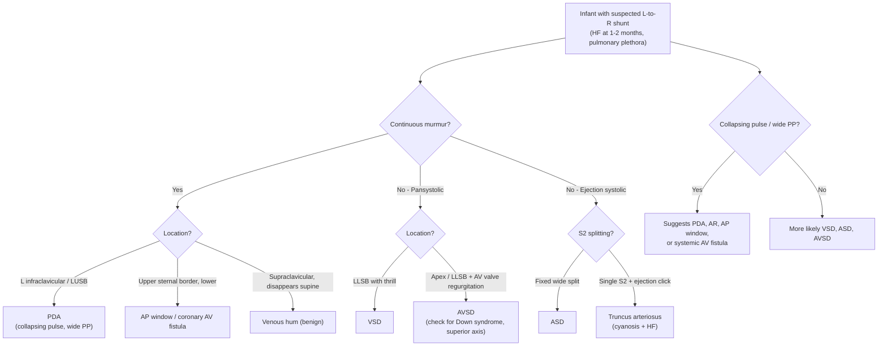

## Differential Diagnosis of Patent Ductus Arteriosus (PDA) in Paediatrics

When a child presents with features suggestive of PDA — a continuous murmur at the left infraclavicular area, bounding pulses, wide pulse pressure, signs of heart failure in infancy, or an incidental echocardiographic finding — you need to think systematically about what else could produce these findings. The differential diagnosis is best approached by asking: **"What else can mimic the key features of PDA?"**

The three cardinal features that drive the DDx are:
1. **Continuous murmur** (heard in systole AND diastole)
2. **Wide pulse pressure / collapsing pulse** (suggesting diastolic run-off)
3. **Left heart volume overload with pulmonary overcirculation** (suggesting a significant L-to-R shunt)

We will also consider the DDx of **heart failure presenting at 1–2 months of age** (the typical presentation of a large PDA in term infants) and the DDx in **preterm neonates with a haemodynamically significant duct**.

---

### A. Differential Diagnosis of a Continuous Murmur in a Child

A continuous murmur means the sound extends from systole into diastole without interruption. This requires a **pressure gradient that persists throughout the entire cardiac cycle** between two communicating structures. The ductus arteriosus achieves this because aortic pressure exceeds pulmonary artery pressure in both systole and diastole. But other conditions can do the same:

| Condition | Mechanism of Continuous Murmur | Key Distinguishing Features |
|---|---|---|
| ***Patent ductus arteriosus*** | Aorta-to-PA flow throughout the cardiac cycle | ***Left infraclavicular/LUSB location; machinery quality; collapsing pulse; wide pulse pressure*** [1][2] |
| **Venous hum** (benign) | Turbulent flow in internal jugular veins due to gravity in upright position | ***Disappears on lying supine or turning head; heard over right supraclavicular area; very common in children aged 3–8 years***. NO haemodynamic compromise. This is the most common cause of a continuous murmur in children [1] |
| **Aortopulmonary window (AP window)** | Direct communication between ascending aorta and main PA → continuous flow | Murmur at **upper sternal border**, often louder and lower than PDA; **early heart failure** (large defect); no diastolic run-off to same degree as PDA because the window is typically large and non-restrictive (pressure may equalise) → murmur may become purely systolic |
| **Coronary arteriovenous fistula** | Abnormal communication between a coronary artery and a cardiac chamber (usually RA/RV) or PA → continuous flow | Continuous murmur **lower** on precordium than PDA (mid-sternal or towards apex); may cause **steal** from myocardium → ischaemia signs |
| **Ruptured sinus of Valsalva aneurysm** | Aortic sinus ruptures into RA or RV → continuous aorta-to-right heart flow | Rare in children; sudden onset continuous murmur with acute HF; murmur at **right or left sternal border** |
| ***Surgical systemic-to-pulmonary shunt (e.g., Blalock-Taussig shunt)*** | Surgically created aortic-to-PA communication (subclavian artery to PA) — identical physiology to PDA | History of prior cardiac surgery for cyanotic CHD; murmur location corresponds to shunt site (usually infraclavicular) |
| **Aortopulmonary collaterals (MAPCAs)** | Systemic arterial collaterals to pulmonary arteries → continuous flow from high-pressure systemic to lower-pressure pulmonary circulation | ***Seen in pulmonary atresia with VSD*** [3]; multiple murmurs over the back; uneven pulmonary vascularity on CXR |
| **Peripheral pulmonary artery stenosis** | Turbulent flow across stenotic branch PAs producing a systolic murmur that extends into diastole | Common in neonates (physiological — resolves by 6 months); heard over both lung fields and back; **no diastolic run-off** |
| **Coarctation of the aorta with collaterals** | Intercostal collateral arteries develop to bypass the coarctation → continuous flow through tortuous collaterals | Continuous murmur **over the back**; ***weak/absent femoral pulses with radio-femoral delay***; upper limb hypertension; rib notching on CXR (older children) [4] |
| **Arteriovenous malformation (systemic)** | High-flow AV communication anywhere in the body (cranial, hepatic, pulmonary) → continuous bruit | Bruit at the **site of the AVM** (e.g., cranium in vein of Galen malformation → high-output HF in neonates); not at typical PDA location |

<Callout title="Exam Trap: Venous Hum vs PDA">
The **venous hum** is the most common continuous murmur heard in children — it is entirely benign. If they describe a continuous murmur that **disappears on lying down or with neck compression/head turning**, it is a venous hum, NOT a PDA. PDA murmur does not change with posture.
</Callout>

---

### B. Differential Diagnosis of Wide Pulse Pressure / Collapsing Pulse in a Child

Wide pulse pressure means the gap between systolic and diastolic BP is large (typically > 40 mmHg in children, though this is age-dependent). The mechanism is always **diastolic run-off** — blood escaping from the aorta during diastole through some abnormal pathway. PDA causes this because blood flows from the aorta into the PA during diastole. Other causes include:

| Condition | Mechanism | Key Distinguishing Features |
|---|---|---|
| **PDA** | Diastolic run-off via ductus to PA | Continuous murmur at L infraclavicular area |
| **Aortic regurgitation (AR)** | Diastolic backflow from aorta to LV | **Early diastolic decrescendo murmur** at left sternal border (NOT continuous); displaced apex; may have Austin Flint murmur |
| **Aortopulmonary window** | Diastolic run-off via AP communication | Murmur at LUSB; early HF |
| **Systemic AV fistula** (e.g., hepatic haemangioma, vein of Galen malformation) | High-flow arteriovenous communication → reduced SVR → high output state | Continuous bruit at site of AVM; high-output HF in neonates; hepatomegaly (hepatic AVM) |
| **Truncus arteriosus** | Single great artery overriding both ventricles → unrestricted pulmonary flow → diastolic run-off via large PAs | **Single S2**; ejection click; systolic murmur; cyanosis with HF (common mixing lesion) [1] |
| **Thyrotoxicosis / severe anaemia / sepsis** | Non-cardiac: high output state → low SVR → wide pulse pressure | Tachycardia, warm peripheries, other systemic features |

---

### C. Differential Diagnosis of Acyanotic CHD Presenting with Heart Failure at 1–2 Months (L-to-R Shunt Lesions)

***Acyanotic CHD with L-to-R shunts characteristically present with heart failure at approximately 2–3 months of age, as pulmonary vascular resistance (PVR) drops and shunt volume increases*** [1][5]. The key L-to-R shunt lesions that must be differentiated from PDA are:

| Condition | Shunt Level | Key Distinguishing Features |
|---|---|---|
| ***Ventricular septal defect (VSD)*** | Ventricular level (LV → RV) | ***Most common CHD (~30%)*** [1]; **pansystolic murmur at lower left sternal border** (NOT continuous); thrill may be palpable; NO collapsing pulse (no diastolic run-off); murmur loudness inversely proportional to defect size in small VSDs |
| ***Patent ductus arteriosus (PDA)*** | Great artery level (Aorta → PA) | ***Continuous murmur at L infraclavicular area; collapsing pulse; wide pulse pressure*** |
| ***Atrial septal defect (ASD)*** | Atrial level (LA → RA) | ***Usually asymptomatic in childhood*** (low-pressure shunt, compensated for years); ***fixed widely split S2*** with ejection systolic murmur at LUSB (increased flow across pulmonary valve, NOT across the defect itself); no collapsing pulse; HF rare before adulthood unless very large [1] |
| ***Atrioventricular septal defect (AVSD)*** | AV junction (combined atrial + ventricular level + abnormal AV valves) | ***Strongly associated with Down syndrome (trisomy 21)*** [1]; features of both ASD and VSD; AV valve regurgitation murmur; superior axis on ECG (pathognomonic); HF at 1–2 months |
| **Aortopulmonary window** | Great artery level (ascending aorta → main PA) | Rare; continuous or systolic murmur at upper sternal border; early severe HF |
| **Truncus arteriosus** | Single outflow trunk overriding both ventricles → unrestricted pulmonary flow | **Cyanotic + HF** (common mixing); single S2; ejection click; may have truncal valve regurgitation |

---

### D. Differential Diagnosis in the Preterm Neonate with Suspected PDA

In the NICU setting, the question is often: **"Is this baby's clinical deterioration due to a haemodynamically significant PDA (hsPDA) or something else?"** [6]

| Condition Mimicking hsPDA | Key Distinguishing Features |
|---|---|
| **Sepsis / necrotising enterocolitis (NEC)** | Abdominal distension, bloody stools, pneumatosis on AXR; fever/hypothermia; raised CRP/procalcitonin. NEC can coexist with PDA (PDA increases NEC risk via diastolic steal) |
| **Worsening respiratory distress syndrome (RDS)** | Worsening ventilation needs without new murmur or bounding pulses; CXR shows ground-glass opacification rather than pulmonary plethora |
| **Pneumonia** | New infiltrates on CXR; signs of infection; purulent tracheal aspirates |
| **Intraventricular haemorrhage (IVH)** | Sudden deterioration with full fontanelle, apnoea, seizures; confirmed on cranial ultrasound |
| **Heart failure from other structural CHD** | Echocardiography is essential — may reveal VSD, AVSD, coarctation, or other lesion rather than isolated PDA |

<Callout title="Key Point: Echo Is Essential" type="error">
In both term and preterm infants, **echocardiography is the gold standard** to confirm PDA and exclude other structural heart disease. Never rely on murmur alone — a preterm PDA may have no murmur initially, and a murmur may be caused by a different lesion entirely. Always get an echo before initiating pharmacological closure in a preterm neonate.
</Callout>

---

### E. Differential Diagnosis of Differential Cyanosis

***Differential cyanosis (blue lower limbs, pink upper limbs)*** is nearly pathognomonic for Eisenmenger PDA, but consider:

| Condition | Pattern | Mechanism |
|---|---|---|
| ***Eisenmenger PDA*** | ***Pink upper body, blue lower body*** | ***R-to-L shunt via PDA inserts distal to L SCA → desaturated blood to descending aorta only*** [1][2] |
| **Interrupted aortic arch with PDA** | ***Pink RUL, blue lower body; ± blue LUL depending on type*** | Descending aortic flow depends on R-to-L PDA; in type B, left subclavian arises distal to interruption [4] |
| **Critical coarctation with PDA** | ***Pink upper body, blue lower body*** | Similar to interrupted arch — lower body perfused by R-to-L duct flow |
| **Reverse differential cyanosis** (blue upper body, pink lower body) | Seen in ***TGA with coarctation or pHTN*** | PA (oxygenated blood from LV) supplies descending aorta via PDA while aorta (deoxygenated from RV) supplies upper body [3] |

---

### F. Conditions Where PDA Coexists with (and May Mask) Other CHD

This is clinically critical — a PDA may be the **only thing keeping a child alive** in duct-dependent circulation:

| Duct-Dependent Condition | Consequence of Ductal Closure |
|---|---|
| ***Critical coarctation of aorta*** | ***Collapse and shock on day 2 of life*** as lower body loses perfusion [4][5] |
| ***Interrupted aortic arch*** | ***Cardiovascular collapse*** — descending aorta entirely duct-dependent [4] |
| ***Critical pulmonary stenosis / pulmonary atresia (with intact ventricular septum or VSD)*** | ***Severe cyanosis*** — pulmonary blood flow depends on PDA [3] |
| ***Transposition of great arteries (TGA) with intact ventricular septum*** | ***Severe cyanosis and death*** — PDA provides critical intercirculatory mixing [3] |
| ***Hypoplastic left heart syndrome (HLHS)*** | ***Systemic collapse*** — systemic circulation entirely duct-dependent |

> ***Always consider: "Is this PDA the disease, or is it keeping this child alive?"*** In any neonate presenting with cyanosis or shock whose condition worsens as the duct closes, think of **duct-dependent CHD** and commence ***PGE₁ infusion immediately*** to reopen/maintain the duct while arranging urgent echocardiography [3][4][5].

---

### Summary: Systematic DDx Approach by Presenting Feature

| Presenting Feature | Top Differential Diagnoses |
|---|---|
| **Continuous murmur** | PDA, venous hum, AP window, coronary AV fistula, surgical BT shunt, MAPCAs, CoA with collaterals |
| **Wide pulse pressure / collapsing pulse** | PDA, aortic regurgitation, AP window, systemic AV fistula, truncus arteriosus, high-output states |
| **L-to-R shunt with HF at 1–2 months** | VSD, PDA, AVSD, large ASD, AP window |
| **Differential cyanosis** | Eisenmenger PDA, interrupted aortic arch, critical CoA |
| **Preterm neonate with worsening haemodynamics** | hsPDA, sepsis, NEC, worsening RDS, IVH, other structural CHD |

---

<Callout title="High Yield Summary">

**Differential Diagnosis of PDA — Key Points for Exams:**

1. ***The most common cause of a continuous murmur in children is a venous hum (benign) — it disappears on lying supine***
2. ***PDA is the most common PATHOLOGICAL cause of a continuous murmur — machinery quality, L infraclavicular, with collapsing pulse***
3. ***Other continuous murmur causes: AP window, coronary AV fistula, MAPCAs, surgical shunts, CoA with collaterals***
4. ***Wide pulse pressure DDx: PDA, aortic regurgitation, AP window, systemic AV fistula, truncus arteriosus***
5. ***L-to-R shunt lesions presenting with HF at 1–2 months: VSD (pansystolic murmur, LLSB), PDA (continuous murmur, L infraclavicular), AVSD (Down syndrome, superior axis), ASD (usually asymptomatic in childhood)***
6. ***Differential cyanosis (pink arms, blue legs) = Eisenmenger PDA, interrupted aortic arch, or critical CoA — all involve R-to-L flow via a duct to descending aorta***
7. ***Always ask: "Is this PDA the disease, or is it keeping the child alive?" — duct-dependent CHD requires PGE₁, not closure***
8. ***Echo is essential — never treat based on murmur alone; exclude other structural CHD***

</Callout>

---

<ActiveRecallQuiz
  title="Active Recall - Differential Diagnosis of PDA"
  items={[
    {
      question: "What is the most common cause of a continuous murmur in children, and how do you distinguish it from PDA?",
      markscheme: "Venous hum — benign, heard in supraclavicular area (usually right), disappears on lying supine or turning the head/compressing the ipsilateral internal jugular vein. PDA murmur does not change with posture, is heard at L infraclavicular area, and is associated with collapsing pulse and wide pulse pressure."
    },
    {
      question: "Name three structural cardiac conditions other than PDA that can produce a continuous murmur in a child.",
      markscheme: "Any three of: aortopulmonary window, coronary arteriovenous fistula, ruptured sinus of Valsalva aneurysm, major aortopulmonary collateral arteries (MAPCAs in pulmonary atresia with VSD), surgical systemic-to-pulmonary shunt (e.g. Blalock-Taussig), coarctation of aorta with intercostal collaterals."
    },
    {
      question: "A neonate is found to have differential cyanosis with pink upper limbs and blue lower limbs. What is the most likely diagnosis, and what is the mechanism?",
      markscheme: "Eisenmenger PDA (or duct-dependent lesion such as critical CoA or interrupted aortic arch). Mechanism: R-to-L shunt through the PDA delivers deoxygenated blood to the descending aorta distal to the left subclavian artery, so only the lower body is desaturated. Upper body is supplied by oxygenated blood from the LV via the ascending aorta."
    },
    {
      question: "How do you differentiate VSD from PDA on clinical examination in an infant with heart failure?",
      markscheme: "VSD: pansystolic murmur at lower left sternal border, often with thrill; NO collapsing pulse; NO wide pulse pressure. PDA: continuous (machinery) murmur at left infraclavicular area/LUSB; collapsing pulse with wide pulse pressure due to diastolic run-off. Echo confirms diagnosis."
    },
    {
      question: "In a critically ill neonate whose condition worsens as the ductus closes, what should you consider and what is the immediate management?",
      markscheme: "Consider duct-dependent CHD: critical coarctation, interrupted aortic arch, critical PS or pulmonary atresia, TGA with intact septum, HLHS. Immediate management: PGE1 (alprostadil) infusion to reopen and maintain the ductus arteriosus; prepare for intubation (apnoea is a side effect); urgent echocardiography to define the underlying lesion."
    }
  ]}
/>

## References

[1] Senior notes: Adrian Lui Pediatrics.pdf (p190, p202)
[2] Senior notes: Ryan Ho Cardiology.pdf (p189)
[3] Senior notes: Adrian Lui Pediatrics.pdf (p215, p219 — Pulmonary atresia with VSD; TGA)
[4] Senior notes: Adrian Lui Pediatrics.pdf (p212 — Interrupted aortic arch)
[5] Lecture slides: GC 147. Heart failure and cyanosis in children acyanotic and cyanotic congenital heart disease - Part 1.pdf
[6] Senior notes: Adrian Lui Pediatrics.pdf (p36 — Problems related to prematurity)
