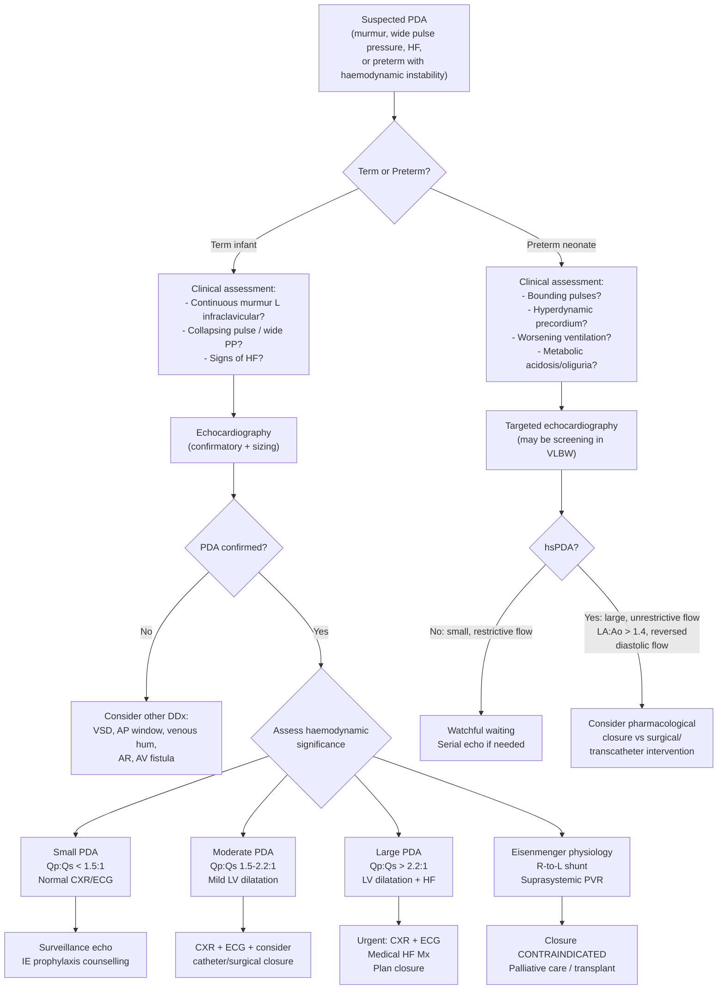

## Diagnostic Criteria, Diagnostic Algorithm, and Investigation Modalities for Patent Ductus Arteriosus (PDA) in Paediatrics

---

### Diagnostic Criteria

PDA does not have a single universally agreed "diagnostic criteria" set in the way that, say, rheumatic fever (Jones criteria) or Kawasaki disease do. The diagnosis is **established by echocardiography** demonstrating a patent communication between the descending aorta and the pulmonary artery. However, the clinical question is not just "Is there a PDA?" but rather **"Is this PDA haemodynamically significant?"** — because management hinges entirely on this distinction.

#### A. Confirming the Diagnosis of PDA

The diagnosis is confirmed when:

1. **Echocardiography** demonstrates a patent vascular communication between the proximal descending aorta (distal to L SCA) and the pulmonary artery (at the junction of MPA and LPA), with colour-flow Doppler showing flow through the duct [1][2]
2. **Supportive clinical features** (continuous murmur, collapsing pulse, wide pulse pressure) may be present but are **not required** — a PDA can exist without an audible murmur, especially in preterm neonates or when PVR is still high

> ***Echocardiography is the gold standard diagnostic modality for PDA*** [1][2]. It confirms the diagnosis, defines anatomy, assesses haemodynamic significance, and excludes other structural CHD.

#### B. Defining Haemodynamic Significance (hsPDA)

This is particularly important in **preterm neonates**, where the decision to treat pharmacologically or surgically depends on whether the PDA is causing clinically relevant haemodynamic compromise. There is no single universally adopted scoring system, but the following echocardiographic and clinical markers are used:

**Echocardiographic markers of haemodynamically significant PDA (hsPDA):**

| Parameter | Significant | Explanation |
|---|---|---|
| **Ductal diameter** | > 1.5 mm (or > 1.5 mm/kg in preterms) | Larger duct → greater shunt volume |
| **LA:Ao ratio** | > 1.4:1 (normal ~1:1) | LA dilates from increased pulmonary venous return (volume overload from L-to-R shunt) |
| **LV dimensions** | Dilated LV (LVIDd > 2 SD for age) | LV volume overload from the shunt |
| **Ductal flow pattern** | Pulsatile, unrestricted ("growing" pattern with low-velocity flow indicating no pressure gradient) | Restrictive flow (high velocity, small jet) = small, non-significant PDA. Unrestrictive flow = near-equalisation of aortic and PA pressures = large shunt |
| **Diastolic flow in descending aorta** | Absent or retrograde diastolic flow | Diastolic "steal" — blood runs backwards from the aorta into the PA via the PDA during diastole, robbing the systemic circulation |
| **Diastolic flow in coeliac/mesenteric/cerebral arteries** | Absent or reversed end-diastolic flow | Systemic hypoperfusion from diastolic run-off — correlates with risk of NEC, IVH, renal impairment |
| ***Qp:Qs ratio*** | ***> 1.5:1*** (moderate), ***> 2.2:1*** (large) | Calculated from echo measurements of flow across pulmonary and aortic valves; directly quantifies the shunt [1][2] |

**Clinical markers of haemodynamic significance:**

| Marker | Significance |
|---|---|
| Bounding/collapsing pulses | Diastolic run-off |
| Widening pulse pressure | > 25 mmHg in preterms is suggestive |
| Hyperdynamic precordium | LV volume overload |
| Worsening ventilatory requirements | Pulmonary oedema from overcirculation |
| Metabolic acidosis | Systemic hypoperfusion |
| Oliguria ( < 1 mL/kg/hr) | Renal hypoperfusion |
| Feed intolerance / abdominal distension | Mesenteric steal |

<Callout title="Term PDA vs Preterm PDA: Different Diagnostic Paradigms" type="idea">

- **Term infant PDA**: Diagnosis is usually clinical (continuous murmur + collapsing pulse) confirmed by echo. The question is "How big is the shunt?" to guide intervention timing.
- **Preterm PDA**: Diagnosis is often **echocardiographic first** (echo screening in at-risk preterms < 28 weeks), because clinical signs may be subtle, absent, or non-specific. The question is "Is this PDA haemodynamically significant enough to warrant treatment?"
</Callout>

---

### Diagnostic Algorithm

The approach differs between term and preterm infants, so let's outline both systematically:

**Key steps in the algorithm explained:**

1. **Clinical suspicion**: In term infants — murmur + pulse character. In preterms — clinical deterioration or screening echo
2. ***Echocardiography is always performed*** — this is the pivotal investigation [1][2]
3. **Exclude other structural CHD** — this is critical, especially in neonates. A PDA may coexist with (or mask) other lesions. ***Always check for duct-dependent conditions***
4. **Assess haemodynamic significance** — using echo parameters (ductal diameter, LA:Ao ratio, Qp:Qs, diastolic flow patterns) and clinical markers
5. **Plan management** based on significance, age group, and whether the child is symptomatic

---

### Investigation Modalities

#### 1. Chest X-Ray (CXR)

CXR is a **first-line, readily available investigation** that provides indirect evidence of the haemodynamic consequences of PDA. It does NOT directly visualise the duct.

**Findings by PDA size:**

| PDA Size | CXR Findings | Pathophysiological Explanation |
|---|---|---|
| ***Small PDA*** | ***Normal CXR*** | Shunt volume too small to cause cardiac chamber enlargement or pulmonary overcirculation [1][2] |
| ***Large PDA*** | ***Cardiomegaly (LV dilatation)*** | LV volume overload → LV dilates → increased cardiothoracic ratio ( > 0.6 in neonates, > 0.55 in infants, > 0.5 in children) |
| ***Large PDA*** | ***Pulmonary plethora (increased pulmonary vascular markings)*** | Excessive pulmonary blood flow from L-to-R shunt → engorged pulmonary vessels visible on CXR [1][2] |
| Large PDA + pHTN | Prominent main PA segment | Dilated main pulmonary artery from chronically elevated PA pressure |
| Eisenmenger PDA | Peripheral pruning of pulmonary vessels with prominent central PA | Pulmonary arteriolar obliteration → reduced peripheral flow but dilated proximal PAs |

**Specific CXR features to look for:**
- **Heart size**: Cardiothoracic ratio — remember age-specific normal values
- **Pulmonary vascularity**: Compare with size of the descending branch of the right PA (should be ≤ width of the trachea). Plethoric = too many, too large vessels
- **Lung fields**: Pulmonary oedema (perihilar haziness, Kerley B lines) in decompensated HF
- **Thymus**: Should be present in neonates — absence suggests DiGeorge syndrome (associated with conotruncal anomalies, but useful to note when doing a systematic CHD workup) [4]

<Callout title="CXR Interpretation Pearl" type="idea">
A **normal CXR does NOT exclude PDA**. Small PDA has no CXR abnormalities. Even moderate PDA may have only subtle changes. CXR tells you about **consequences** (volume overload, pulmonary congestion), not the anatomy. Echo is always needed.
</Callout>

---

#### 2. Electrocardiogram (ECG)

ECG provides indirect evidence of **chamber enlargement and pressure/volume overload** resulting from PDA. Like CXR, it does not directly diagnose PDA.

**Key paediatric ECG considerations:**
- ***Normal neonatal ECG shows right ventricular dominance*** (right axis, tall R in V1, deep S in V6) because the RV is thicker in utero to support the systemic circulation via the ductus [3]
- ***By 1 month, QRS axis shifts leftward (~90°); by 1 year, adult-like LV dominance (~60°)*** [3]
- Must interpret all ECG findings in context of **age-specific normal values** (crucial in paediatrics)

**Findings by PDA size:**

| PDA Size | ECG Findings | Pathophysiological Explanation |
|---|---|---|
| ***Small PDA*** | ***Normal ECG*** | No significant volume or pressure overload [1][2] |
| ***Large PDA*** | ***LVH (left axis deviation, tall R in V6, deep S in V1)*** | LV volume overload → LV eccentric hypertrophy [1][2][3] |
| ***Large PDA*** | ***LAE (P wave duration ≥ 0.10 s, notched/biphasic P wave)*** | LA dilatation from increased pulmonary venous return [1][2][3] |
| Large PDA + pHTN | ***± RVH (right axis deviation, tall R in V1, deep S in V6)*** | RV pressure overload from elevated pulmonary artery pressure [1][2] |
| Large PDA + pHTN | ***± RAE (tall, peaked P waves ≥ 3 mm)*** | RA pressure rises with RV pressure overload → RA dilatation [1][2] |
| Eisenmenger PDA | Dominant RVH pattern | Suprasystemic PVR → RV pressure overload dominates |

**Specific ECG patterns to recognise:**

| ECG Pattern | Criteria (Paediatric) | Seen in PDA when... |
|---|---|---|
| ***LVH*** | ***Left axis deviation + tall R in V6 + deep S in V1*** | Significant L-to-R shunt with LV volume overload |
| ***LV strain*** | ***Inverted T wave in V6 or lead I*** | Severe, longstanding LV volume overload [3] |
| ***LAE*** | ***P wave duration ≥ 0.10 s; notched ("P mitrale") or biphasic in V1*** | Large pulmonary venous return → LA dilatation [3] |
| ***RVH*** | ***Right axis deviation + tall R in V1 + deep S in V6; upright T in V1 between 3 days and 6 years suggests RVH*** | pHTN developing [3] |
| **BiVH (Katz-Wachtel phenomenon)** | ***LVH + RVH criteria met; large equiphasic QRS complexes in V2–V5*** | Large PDA with both LV volume overload AND RV pressure overload from pHTN [3] |

<Callout title="ECG Trap: Normal Neonatal RV Dominance vs Pathological RVH" type="error">
In a neonate, right axis deviation and tall R in V1 are **normal**. Do NOT over-diagnose RVH in a newborn. However, if RV dominance **persists or increases beyond the expected age** (e.g., right axis with tall R in V1 in a 6-month-old), this is abnormal and suggests RV pressure overload (from pHTN or an obstructive right heart lesion).

Conversely, finding **LVH in a neonate** (when RV dominance should be normal) IS significant — it suggests significant left heart volume overload.
</Callout>

---

#### 3. Echocardiography (Echo)

***Echocardiography is the definitive diagnostic investigation for PDA*** [1][2]. It provides direct anatomical visualisation and comprehensive haemodynamic assessment.

**Modalities used:**

| Echo Modality | What It Shows in PDA |
|---|---|
| **2D imaging** | Direct visualisation of the ductus arteriosus connecting the descending aorta to the PA; duct morphology (conical, tubular, window-type); measurements of ductal diameter |
| **Colour-flow Doppler** | Demonstrates the direction and pattern of flow through the PDA — typically **red** (towards transducer) in the PA during L-to-R shunt, showing continuous flow. Bidirectional or R-to-L flow indicates elevated PVR |
| **Pulsed-wave / Continuous-wave Doppler** | Measures velocity of flow across the PDA; estimates pressure gradient (using modified Bernoulli equation: ΔP = 4v²); determines PA systolic pressure |
| **M-mode** | Measures LA and Ao root dimensions → **LA:Ao ratio**; measures LV dimensions (LVIDd, LVIDs) |

**Key echocardiographic parameters and their interpretation:**

| Parameter | Normal | Haemodynamically Significant PDA | Why It Matters |
|---|---|---|---|
| **Ductal diameter** | Closed or tiny (< 1.5 mm) | ***> 1.5 mm or > 1.5 mm/kg*** | Larger duct = less resistance to flow = greater shunt volume |
| ***LA:Ao ratio*** | ***~1.0:1*** | ***> 1.4:1*** | LA enlarges because of increased pulmonary venous return from pulmonary overcirculation. This is one of the most practical bedside echo markers of hsPDA |
| **LV internal diameter (LVIDd)** | Normal for age/weight | > 2 SD above mean for age | LV dilates from chronic volume overload |
| **Ductal flow pattern** | No flow (closed duct) | Continuous L-to-R flow; unrestricted = low velocity, pulsatile; restrictive = high velocity, continuous | Unrestricted flow means PA pressure is close to aortic pressure (large shunt). Restrictive flow means a significant gradient exists (small/moderate duct with lower pressure transmission) |
| **Diastolic flow in descending aorta** | Continuous forward flow | ***Absent or retrograde diastolic flow*** | "Diastolic steal" — blood flows backwards from the aorta into the PDA during diastole instead of perfusing the body. Correlates with end-organ hypoperfusion (gut, kidneys, brain) |
| **PA systolic pressure** | < 25 mmHg (estimated from TR jet or PDA gradient) | > 50% systemic → moderate pHTN; suprasystemic → Eisenmenger | Determines whether closure is safe or contraindicated |
| ***Qp:Qs*** | ***1:1*** | ***> 1.5:1 (moderate), > 2.2:1 (large)*** | Directly quantifies shunt magnitude. Calculated from echo Doppler measurements of flow across the pulmonary and aortic valves [1][2] |

**Echo also excludes other structural CHD:**
- Always perform a **complete structural survey** — look for VSD, ASD, coarctation, aortic arch anomalies, TGA
- ***Must exclude duct-dependent lesions*** — if you find a large PDA in a cyanotic neonate, do NOT close it before ruling out duct-dependent pulmonary or systemic circulation

**Echo in preterm PDA — staged assessment protocol:**

Many NICUs employ a structured echocardiographic assessment for preterm infants at risk of hsPDA [7]:

| Timing | Purpose |
|---|---|
| Day 1–3 of life | Baseline: Is a PDA present? Initial size and flow pattern |
| Day 3–7 | Has the PDA closed spontaneously? If not, is it becoming haemodynamically significant? |
| Post-treatment | Has pharmacological closure been successful? Is there residual flow? |
| Pre-discharge | Confirm closure or plan outpatient follow-up |

---

#### 4. Cardiac Catheterisation

Cardiac catheterisation is **rarely needed** for diagnosis of isolated PDA in the modern era, as echocardiography provides all necessary information. However, it has specific roles [1][2]:

| Indication | What It Provides |
|---|---|
| **Pre-intervention haemodynamic assessment** (when echo is equivocal) | Direct measurement of PA pressure, PVR (in Wood units), Qp:Qs via oximetry |
| **Assessment of PVR operability** (large PDA with suspected pHTN) | ***PVR > 12 WU or PAP suprasystemic = closure contraindicated***; PVR 8–12 WU = caution, increased perioperative risk [1] |
| **Pulmonary vasodilator testing** | If pHTN is borderline, test reactivity with inhaled NO or oxygen to determine reversibility |
| **Therapeutic**: transcatheter device closure | Simultaneous diagnostic and therapeutic procedure — see Management section |

**Catheterisation findings in PDA:**

| Finding | Explanation |
|---|---|
| **Step-up in oxygen saturation at PA level** | Oxygenated blood from the aorta enters the PA via PDA → oxygen saturation in PA is higher than in RV (the "step-up" confirms the L-to-R shunt at PA level) |
| **Elevated PA pressure** | Direct manometry confirms degree of pHTN |
| **Calculation of Qp:Qs** | Using the Fick principle with oxygen saturations: Qp:Qs = (SaO₂ − SvO₂) / (SpvO₂ − SpaO₂) |
| **PVR calculation** | PVR = (mean PAP − LA pressure) / Qp. Measured in Wood units (WU). Critical for determining operability |
| **Angiography** | Injection of contrast into the aortic arch delineates the duct anatomy (Krichenko classification for device selection) |

---

#### 5. Additional Investigations

| Investigation | Role in PDA | Findings |
|---|---|---|
| **Pulse oximetry (pre- and post-ductal)** | Screening in neonates; detection of differential cyanosis | ***Pre-ductal (right hand) SpO₂ > post-ductal (either foot) SpO₂ by > 3% suggests R-to-L ductal shunt*** (seen in duct-dependent CHD or Eisenmenger PDA). Note: L-to-R PDA will NOT show a pre-/post-ductal difference (both are well-oxygenated) |
| **BNP / NT-proBNP** | Biomarker of volume overload and ventricular wall stress; adjunct in preterm PDA assessment | Elevated in hsPDA; can help guide treatment decisions and monitor response to therapy. Cut-offs are not firmly established in neonates but NT-proBNP > 10,000 pg/mL in first week correlates with hsPDA |
| **Blood gas (arterial/capillary)** | Assess for metabolic acidosis in preterm with suspected hsPDA | Metabolic acidosis (low pH, elevated lactate) suggests systemic hypoperfusion from diastolic steal |
| **Renal function (urea, creatinine)** | Monitor for renal impoperfusion; baseline before NSAID therapy | Elevated creatinine suggests renal hypoperfusion; also needed to assess safety of indomethacin/ibuprofen (nephrotoxic) |
| **CT angiography / MRI** | Rarely used for isolated PDA; reserved for complex anatomy | Delineation of complex aortic arch anatomy, unusual PDA morphology, or MAPCAs [1] |

---

### Summary Table: Investigations by PDA Size

| Investigation | ***Small PDA*** | ***Moderate PDA*** | ***Large PDA*** | ***Eisenmenger PDA*** |
|---|---|---|---|---|
| ***CXR*** | ***Normal*** | Mild cardiomegaly | ***Cardiomegaly + pulmonary plethora*** | Prominent central PA, peripheral pruning |
| ***ECG*** | ***Normal*** | LVH | ***LVH, LAE, ± RVH*** | Dominant RVH, RAE |
| ***Echo*** | ***Small duct, restrictive flow; normal LA:Ao and LV*** | Moderate duct; LA:Ao 1.2–1.4; mild LV dilatation | ***Large duct; LA:Ao > 1.4; LV dilatation; reversed diastolic flow in descending aorta*** | R-to-L flow; suprasystemic PA pressure |
| **Catheterisation** | Not needed | Rarely needed | May be needed for PVR assessment | ***Essential for PVR quantification*** |

[1][2][3]

---

### Pre- and Post-Ductal Saturations — A Special Note

***Pre-ductal saturation*** is measured from the **right hand** (supplied by the brachiocephalic trunk, which arises proximal to the ductus). ***Post-ductal saturation*** is measured from **either foot** (supplied by the descending aorta, distal to the ductus insertion).

| Scenario | Pre-ductal (RH) | Post-ductal (foot) | Interpretation |
|---|---|---|---|
| **Normal / L-to-R PDA** | 95–100% | 95–100% | Oxygenated blood from aorta flows INTO PA (not into descending aorta from PA), so both saturations are high |
| **R-to-L PDA (Eisenmenger or duct-dependent)** | 95–100% | < 90% (> 3% lower than pre-ductal) | Deoxygenated blood from PA enters descending aorta → lower limb desaturation |
| **TGA with PDA** | Low | Higher than pre-ductal ("reverse differential") | Mixing at ductal level; LV (connected to PA in TGA) sends oxygenated blood to descending aorta via PDA |

> ***Newborn pulse oximetry screening (performed at 24–48 hours) can detect critical CHD including duct-dependent lesions. A post-ductal SpO₂ < 95% or a pre-/post-ductal difference > 3% warrants urgent echocardiography*** [5].

<Callout title="Why Does a Normal L-to-R PDA NOT Show a Pre-/Post-Ductal SpO₂ Difference?" type="idea">
Because in L-to-R PDA, oxygenated blood flows FROM the aorta INTO the PA. The descending aorta still receives fully oxygenated blood from the LV — the shunt goes the other way. Only when the shunt reverses (R-to-L, i.e., Eisenmenger or duct-dependent physiology) does deoxygenated blood enter the descending aorta, causing lower post-ductal saturations.
</Callout>

---

<Callout title="High Yield Summary">

**Diagnosis of PDA — Key Points for Exams:**

1. ***Echocardiography is the gold standard*** — confirms PDA, measures ductal diameter, assesses LA:Ao ratio, Qp:Qs, LV dimensions, diastolic flow patterns, and PA pressure
2. ***LA:Ao ratio > 1.4 indicates haemodynamically significant PDA*** in preterm infants
3. ***Reversed/absent diastolic flow in descending aorta*** = diastolic steal = systemic hypoperfusion = hsPDA
4. ***CXR: Large PDA → cardiomegaly + pulmonary plethora; Small PDA → normal***
5. ***ECG: Large PDA → LVH + LAE ± RVH (if pHTN); Small PDA → normal***
6. ***Remember age-specific ECG normals*** — RV dominance is normal in neonates; LVH in a neonate IS significant
7. ***Cardiac catheterisation is reserved for PVR assessment in borderline pHTN cases and for transcatheter closure***
8. ***PVR > 12 WU or suprasystemic PAP = closure contraindicated (Eisenmenger)***
9. ***Pre-/post-ductal SpO₂ difference > 3% suggests R-to-L ductal shunt*** (Eisenmenger or duct-dependent CHD) — a normal L-to-R PDA shows NO difference
10. ***Newborn pulse oximetry screening at 24–48 hours can detect critical CHD***

</Callout>

---

<ActiveRecallQuiz
  title="Active Recall - PDA Diagnosis and Investigations"
  items={[
    {
      question: "What is the gold standard investigation for diagnosing PDA, and name four key echocardiographic parameters that define a haemodynamically significant PDA in a preterm neonate.",
      markscheme: "Echocardiography. Four parameters: (1) Ductal diameter > 1.5 mm or > 1.5 mm/kg, (2) LA:Ao ratio > 1.4:1, (3) Reversed or absent diastolic flow in descending aorta, (4) Qp:Qs > 1.5:1. Additional acceptable answers: LV dilatation, unrestrictive ductal flow pattern."
    },
    {
      question: "Describe the CXR and ECG findings in a large PDA and explain the pathophysiological basis for each.",
      markscheme: "CXR: Cardiomegaly (LV dilatation from volume overload) + pulmonary plethora (increased pulmonary blood flow from L-to-R shunt). ECG: LVH with tall R in V6 and deep S in V1 (LV volume overload and eccentric hypertrophy), LAE with prolonged/notched P waves (LA dilatation from increased pulmonary venous return), plus/minus RVH (if pulmonary hypertension develops causing RV pressure overload)."
    },
    {
      question: "A neonate has pre-ductal SpO2 of 98% on the right hand but post-ductal SpO2 of 85% on the foot. What does this indicate, and what are two possible underlying diagnoses?",
      markscheme: "This indicates a R-to-L shunt across the ductus arteriosus (deoxygenated blood entering the descending aorta distal to L SCA). Possible diagnoses: (1) Eisenmenger PDA with suprasystemic PVR, (2) Duct-dependent systemic circulation lesion such as critical coarctation of aorta or interrupted aortic arch, (3) Persistent pulmonary hypertension of the newborn (PPHN)."
    },
    {
      question: "When is cardiac catheterisation indicated in a child with PDA? What key measurement determines whether closure is contraindicated?",
      markscheme: "Catheterisation is indicated when: (1) Echo is equivocal for PVR/PA pressure assessment, (2) Suspected borderline pulmonary hypertension requiring direct haemodynamic measurement, (3) Planned transcatheter device closure. Closure is contraindicated when PVR > 12 Wood units or PAP is suprasystemic (Eisenmenger physiology), as closure would precipitate acute RV failure and reduced LV output."
    },
    {
      question: "Why does a normal L-to-R PDA show no pre-/post-ductal SpO2 difference, whereas Eisenmenger PDA does?",
      markscheme: "In L-to-R PDA, oxygenated blood flows FROM the aorta INTO the PA. The descending aorta still receives fully oxygenated blood from the LV, so post-ductal saturation remains normal. In Eisenmenger PDA, the shunt has reversed (R-to-L) due to suprasystemic PVR, so deoxygenated blood from the PA enters the descending aorta distal to the L SCA, causing lower post-ductal saturations while the pre-ductal circulation remains oxygenated."
    }
  ]}
/>

## References

[1] Senior notes: Adrian Lui Pediatrics.pdf (p199, p202)
[2] Senior notes: Ryan Ho Cardiology.pdf (p189)
[3] Senior notes: Adrian Lui Pediatrics.pdf (p199 — ECG in paediatrics, chamber enlargement criteria)
[4] Senior notes: Adrian Lui Pediatrics.pdf (p212 — Interrupted aortic arch; DiGeorge thymus absence)
[5] Lecture slides: GC 147. Heart failure and cyanosis in children acyanotic and cyanotic congenital heart disease - Part 1.pdf
[7] Senior notes: Ryan Ho Fundamentals.pdf (p39 — Heart murmurs reference)
