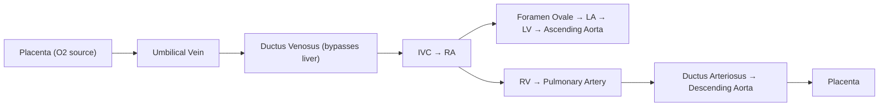

# Patent Ductus Arteriosus (PDA) in Paediatrics

## Definition

Patent ductus arteriosus (PDA) is the persistent patency of the ductus arteriosus (DA) — a normal fetal vascular structure connecting the proximal descending aorta to the main pulmonary artery — beyond the expected time of physiological closure after birth.

Breaking down the name:
- **Patent** = open, not closed
- **Ductus** = duct/channel (Latin)
- **Arteriosus** = arterial (relating to arteries)

In term infants, functional closure of the DA normally occurs within 10–15 hours of birth and is anatomically complete by 2–3 weeks. A PDA is considered pathological when it remains open beyond 72 hours of life in a term neonate, or when it fails to close and produces haemodynamic consequences in a preterm infant [1][2].

> In preterm infants, the DA may remain patent for much longer and is one of the most common complications of prematurity — this is a distinct entity from "PDA as a congenital heart disease" and management differs significantly [3].

<Callout title="Key Distinction: Preterm PDA vs Term PDA">
- **Preterm PDA**: Due to immaturity of ductal smooth muscle and persistence of prostaglandin sensitivity. Very common (up to 60–70% in infants < 28 weeks). Often responds to pharmacological closure (NSAIDs/paracetamol).
- **Term PDA**: A true structural/congenital heart defect (CHD). The ductus has a structural abnormality preventing normal closure. Does NOT respond to pharmacological closure. Requires device/surgical closure if significant.
</Callout>

---

## Epidemiology

- ***Incidence: approximately 1 in 2,500–5,000 live births*** (referring to isolated PDA in term infants) [1][2]
- ***Accounts for ~5–10% of all congenital heart disease*** — the **6th most common** CHD [1]
- ***Female-to-male ratio: 2:1*** [1][2]
- Much more common in preterm infants:
  - ~30% of infants < 1500 g birth weight
  - Up to 60–70% of infants < 28 weeks' gestation [3]
- In Hong Kong, CHD prevalence is approximately 8 per 1,000 live births; PDA represents a significant proportion, especially given the relatively high preterm birth rate (~6–7%) [1]

---

## Risk Factors

| Category | Risk Factor | Mechanism |
|---|---|---|
| ***Genetic*** | ***2–4% sibling recurrence risk*** | Polygenic inheritance |
| ***Genetic*** | ***Char syndrome*** (TFAP2B mutation) | Transcription factor defect impairing ductal smooth muscle remodelling |
| ***Perinatal*** | ***Prematurity*** | Immature ductal smooth muscle; persistent prostaglandin sensitivity; reduced oxygen-sensing mechanisms |
| ***Perinatal*** | ***Maternal rubella (1st trimester)*** | Direct viral damage to ductal wall elastic tissue → impaired constriction |
| ***Perinatal*** | ***Birth at high altitude*** | Lower ambient PaO₂ → reduced stimulus for ductal constriction |
| Maternal drugs | Warfarin exposure | Associated with PDA (5% of fetal warfarin syndrome) |
| Maternal drugs | Fetal alcohol syndrome | VSD, ASD, TOF, PDA |
| Chromosomal | Trisomy 21 (less specific) | General association with CHD |
| Other | Perinatal asphyxia | Prolonged hypoxia maintains ductal patency |

[1][2][4]

---

## Anatomy and Function of the Ductus Arteriosus

### Fetal Anatomy

The ductus arteriosus is a muscular artery connecting:
- **Proximally**: the ***junction of the main pulmonary artery and the left pulmonary artery***
- **Distally**: the ***proximal descending aorta, just distal to the origin of the left subclavian artery (L SCA)***

It is derived from the **left 6th aortic arch** during embryological development [1][2].

### Fetal Function

Understanding the fetal circulation is essential to understanding PDA:

***In utero, the DA allows right ventricular output (~60% of combined cardiac output) to bypass the high-resistance, fluid-filled, non-ventilating lungs and be directed to the systemic circulation (which has lower vascular resistance via the placenta)*** [1][2].

Key fetal physiology points:
- Fetal lungs are collapsed → **pulmonary vascular resistance (PVR) is extremely high**
- Systemic vascular resistance (SVR) is low (because the placenta is a massive low-resistance vascular bed)
- Therefore, blood flows **right-to-left** (PA → Aorta) through the DA in utero — this is the NORMAL direction in fetal life

### Why Does the DA Stay Open In Utero?

Two principal factors maintain ductal patency in fetal life:

1. ***Low fetal PaO₂ (approximately 25–28 mmHg)*** — Hypoxia relaxes ductal smooth muscle via hypoxia-sensitive potassium channels and local prostaglandin production
2. ***High circulating prostaglandin E₂ (PGE₂)*** — Produced by the placenta and metabolised by the lungs. Since fetal lungs receive minimal blood flow, PGE₂ is not adequately cleared → high circulating levels → vasodilatory effect on ductal smooth muscle [1][2]

### Normal Postnatal Closure

***At birth, two critical changes trigger ductal constriction:***

1. ***↑PaO₂ (lungs inflate, begin gas exchange)*** → Oxygen directly constricts ductal smooth muscle via inhibition of voltage-gated potassium (Kv) channels → membrane depolarisation → calcium influx → smooth muscle contraction
2. ***↓Circulating PGE₂*** → Placenta (source of PGE₂) is removed + now-ventilating lungs metabolise remaining PGE₂ via prostaglandin dehydrogenase

**Timeline:**
- ***Functional closure (smooth muscle constriction): within 10–15 hours of birth***
- ***Anatomical closure (intimal proliferation → "ligamentum arteriosum"): complete by 2–3 weeks*** [1][2]

<Callout title="Why Premature Infants Are Susceptible to PDA" type="idea">
Preterm ductal tissue differs fundamentally from term ductal tissue:
- **Immature smooth muscle**: Fewer oxygen-sensitive Kv channels → poor constrictor response to O₂
- **Persistent prostaglandin sensitivity**: High density of PGE₂ receptors (EP4) on immature ductal smooth muscle
- **Reduced intimal cushion formation**: Less capable of permanent anatomical closure
- **Lower PGE₂ clearance**: Immature lungs clear PGE₂ less efficiently

This is why **pharmacological closure with COX inhibitors (indomethacin, ibuprofen) or paracetamol works in preterm PDA** — you're removing the prostaglandin signal. It does NOT work in term PDA because the defect is structural.
</Callout>

---

## Aetiology (with Hong Kong Focus) and Pathophysiology

### Aetiology

In Hong Kong, the most relevant aetiological considerations for PDA are:

1. **Prematurity** — The single most important risk factor. Hong Kong's preterm birth rate is ~6–7%, and with excellent NICU survival of extremely preterm infants, PDA in prematurity is a frequent clinical problem [3]
2. **Isolated congenital PDA in term infants** — Sporadic, likely multifactorial (genetic susceptibility + environmental triggers)
3. **Congenital rubella** — Historically important; now rare in Hong Kong due to universal MMR vaccination, but still tested in OSCE/exam scenarios [1][4]
4. **Syndromic associations** — ***Char syndrome*** (autosomal dominant, TFAP2B gene), Down syndrome, fetal alcohol syndrome [1][2]

### Pathophysiology: The Haemodynamic Consequences of PDA

This is the crux of understanding PDA clinically. Follow the logic step by step:

#### Step 1: Direction of Shunt

Once the DA remains patent after birth:
- **PVR falls** (lungs expand, begin gas exchange) while **SVR rises** (placenta removed)
- Aortic pressure > Pulmonary artery pressure
- ***Blood flows left-to-right (Aorta → Pulmonary artery) through the PDA — this is an L-to-R shunt*** [1][2]

> This is the **opposite** of the fetal flow direction. In utero: R→L. After birth: L→R.

#### Step 2: Volume Overload to Pulmonary Circulation

- ***The L-to-R shunt delivers excess blood flow to the pulmonary circulation***
- This produces **pulmonary overcirculation** (pulmonary plethora on CXR)

#### Step 3: Left Heart Volume Overload

- ***Increased pulmonary venous return → LA and LV receive more blood → LV volume overload***
- The LV must pump both the normal systemic output AND the shunt volume
- ***LV dilates (eccentric hypertrophy)*** → displaced, thrusting (hyperdynamic) apex beat

#### Step 4: Hyperdynamic Circulation and "Run-off"

This is a unique feature of PDA (compared to VSD or ASD):

- ***Blood "runs off" from the aorta into the low-resistance pulmonary circulation during both systole AND diastole*** (because the PDA connects two great vessels, not ventricles)
- ***Diastolic run-off → low diastolic BP → wide pulse pressure → collapsing (bounding) pulse***
- This is the same physiology as aortic regurgitation — diastolic aortic pressure drops because blood escapes backwards

#### Step 5: Consequences of the Shunt

**Forward (pulmonary) effects:**
- Pulmonary congestion → tachypnoea, feeding difficulty, recurrent chest infections
- If sustained → pulmonary vascular remodelling → ***pulmonary hypertension (pHTN)***

**Backward (systemic) effects:**
- Diastolic run-off → reduced diastolic perfusion of:
  - **Coronary arteries** → subendocardial ischaemia risk (relevant in large PDA)
  - **Gut** → risk of necrotising enterocolitis (NEC) in preterms
  - **Kidneys** → oliguria, renal impairment
  - **Brain** → risk of intraventricular haemorrhage (IVH) in preterms (fluctuating cerebral blood flow)

**Heart failure:**
- ***LV volume overload → LV dilatation → congestive heart failure (CHF)***
- ***In large PDA, HF symptoms appear at 1–2 months of age in term infants*** (as PVR drops) [1][2]
- ***In preterm infants, HF symptoms appear within days*** (because PVR drops faster and cardiac reserve is lower) [1][2]

#### Step 6: Eisenmenger Syndrome (End-stage, Irreversible)

- If a large PDA is left untreated for years:
  - Chronic pulmonary overcirculation → pulmonary arteriolar remodelling (medial hypertrophy, intimal fibrosis, plexiform lesions)
  - ***PVR rises to exceed SVR → shunt reverses to R-to-L***
  - ***This produces "differential cyanosis"*** — desaturated blood from the PA enters the aorta distal to the L SCA → ***lower limbs are cyanosed and clubbed, upper limbs (especially right arm) are pink***
  - ***This is Eisenmenger syndrome — irreversible and a contraindication to closure*** [1][2]

<Callout title="Why 'Differential Cyanosis' and Not Generalised Cyanosis?" type="idea">
The PDA inserts into the descending aorta **below** the brachiocephalic trunk and left common carotid/left subclavian arteries. Therefore:
- The ascending aorta and its branches (head, right arm, left arm) receive oxygenated blood from the LV
- The descending aorta receives admixed (deoxygenated) blood from the R-to-L PDA shunt
- **Result**: Pink upper body, blue lower body — this is ***differential cyanosis***, pathognomonic of Eisenmenger PDA

If the PDA is pre-ductal (extremely rare), you can get reversed differential cyanosis.
</Callout>

---

## Classification

PDA can be classified by several schemes:

### A. By Gestational Age Context

| Type | Description |
|---|---|
| **Preterm PDA** | Due to ductal immaturity; functional/pharmacological closure possible |
| **Term PDA** | Structural defect; pharmacological closure ineffective |

### B. By Haemodynamic Significance (Shunt Ratio, Qp:Qs)

This is the most clinically relevant classification [1][2]:

| Size | ***Qp:Qs*** | Haemodynamic Impact |
|---|---|---|
| ***Small PDA*** | ***< 1.5:1*** | Minimal; no volume overload |
| ***Moderate PDA*** | ***1.5–2.2:1*** | Mild-moderate LV volume overload; may cause symptoms in adolescence/adulthood |
| ***Large PDA*** | ***> 2.2:1*** | Significant LV volume overload; HF in infancy |

> **Qp:Qs** = ratio of pulmonary blood flow to systemic blood flow. Normal is 1:1. A Qp:Qs of 2:1 means twice as much blood flows through the lungs as through the systemic circulation — the excess is the shunt volume.

### C. By Anatomical Morphology (Krichenko Classification — for interventional planning)

| Type | Description |
|---|---|
| A | Conical, well-defined aortic ampulla, narrow at PA end (most common, ~65%) |
| B | Short, "window-like" |
| C | Tubular, no constriction |
| D | Multiple constrictions |
| E | Elongated, constricted at aortic end |

### D. Duct-Dependent Circulation (Special Category)

Some severe CHDs **require** the DA to remain open for survival. In these cases, the DA is life-saving and is kept open with ***PGE₁ (prostaglandin E₁ / alprostadil) infusion***:

| Duct-dependent condition | Why the duct is needed |
|---|---|
| ***Duct-dependent pulmonary circulation*** (e.g., critical PS, pulmonary atresia, severe TOF) | DA provides the only source of pulmonary blood flow (aorta → PA) |
| ***Duct-dependent systemic circulation*** (e.g., critical CoA, interrupted aortic arch, HLHS) | DA provides the only source of descending aortic blood flow (PA → aorta) |
| ***Duct-dependent mixing*** (e.g., TGA without VSD) | DA allows mixing between parallel circulations |

[1][4][5]

<Callout title="Exam Pearl: PGE₁ to Keep the Duct Open" type="error">
Students often confuse closing and opening the duct:
- **To CLOSE the duct** (preterm PDA): Use **COX inhibitors** (indomethacin, ibuprofen) or **paracetamol** → block PGE₂ synthesis
- **To KEEP the duct OPEN** (duct-dependent CHD): Use ***PGE₁ (alprostadil) infusion***
- Side effects of PGE₁: apnoea (15–20%), fever, hypotension, seizures → always have intubation equipment ready
</Callout>

---

## Clinical Features

Clinical features are entirely determined by the ***degree of L-to-R shunting*** (i.e., PDA size and PVR) [1][2].

### A. Symptoms (with Pathophysiological Basis)

#### ***Large PDA (Qp:Qs > 2.2:1)***

| Symptom | Pathophysiological Basis |
|---|---|
| ***Heart failure symptoms at 1–2 months of age*** (term infants) / ***within days*** (preterm) | As PVR drops postnatally → increasing L-to-R shunt → LV volume overload → CHF. Earlier in preterms due to lower cardiac reserve and faster PVR drop |
| **Tachypnoea / respiratory distress** | Pulmonary overcirculation → pulmonary congestion/oedema → ↓lung compliance → ↑work of breathing |
| **Poor feeding / failure to thrive (FTT)** | 1) ↑metabolic demand from HF 2) Tachypnoea interferes with feeding 3) Reduced gut perfusion from diastolic run-off |
| ***Recurrent chest infections*** | Pulmonary congestion impairs mucociliary clearance and creates favourable environment for bacterial growth |
| **Excessive sweating (especially during feeds)** | Sympathetic activation in response to reduced cardiac output |
| **Irritability / lethargy** | Reduced systemic perfusion; low cardiac output state |

#### ***Moderate PDA (Qp:Qs = 1.5–2.2:1)***

| Symptom | Pathophysiological Basis |
|---|---|
| ***↓Exercise tolerance*** | Mild LV volume overload limits cardiac output augmentation during exercise |
| ***HF symptoms in adolescence or adulthood*** | Chronic volume overload eventually decompensates over years |
| May be asymptomatic in childhood | Compensatory LV eccentric hypertrophy maintains output |

#### ***Small PDA (Qp:Qs < 1.5:1)***

| Symptom | Pathophysiological Basis |
|---|---|
| ***Asymptomatic*** | Shunt volume too small to cause significant haemodynamic effects |
| ***Incidental murmur*** | Detected on routine examination |
| ***Infective endocarditis (uncommon)*** | Turbulent jet across PDA damages endothelium → nidus for vegetation. Risk is lifelong even with small PDA [1][2] |

#### Eisenmenger Syndrome (Late / Untreated Large PDA)

| Symptom | Pathophysiological Basis |
|---|---|
| ***Differential cyanosis*** (blue toes, pink fingers) | R-to-L shunt via PDA delivers deoxygenated blood to descending aorta only |
| Exertional dyspnoea | Fixed high PVR limits pulmonary blood flow |
| Haemoptysis | Pulmonary arteriolar fragility from severe pHTN |
| Syncope | Fixed cardiac output; exercise-induced drop in SVR with inability to augment pulmonary flow |

---

### B. Signs (with Pathophysiological Basis)

#### General Inspection

| Sign | Pathophysiological Basis |
|---|---|
| **Tachypnoea, intercostal/subcostal recession** | Pulmonary congestion → ↓compliance → ↑respiratory effort |
| **FTT / growth faltering** | Chronic HF → ↑metabolic demands + ↓caloric intake |
| ***Differential cyanosis/clubbing*** (Eisenmenger only) | R-to-L shunt via PDA to descending aorta → desaturation of lower limbs only |

#### Pulse and Blood Pressure

| Sign | Pathophysiological Basis |
|---|---|
| ***Collapsing (bounding/water-hammer) pulse*** | Diastolic run-off through PDA → low diastolic BP → ***wide pulse pressure*** → brisk upstroke and rapid collapse. Identical mechanism to aortic regurgitation |
| ***Increased pulse pressure*** | Systolic BP may be slightly elevated (hyperdynamic LV); diastolic BP is low (run-off) |
| Tachycardia | Sympathetic compensation for reduced effective systemic output |

> ***The collapsing pulse and wide pulse pressure are hallmark signs of a haemodynamically significant PDA*** — they indicate substantial diastolic aortic run-off [1][2].

#### Precordium

| Sign | Pathophysiological Basis |
|---|---|
| ***Displaced, thrusting (hyperdynamic) apex beat*** | LV volume overload → LV dilatation and eccentric hypertrophy → apex displaced laterally and inferiorly; increased force due to increased stroke volume |
| ***Parasternal heave*** (if pHTN develops) | RV pressure overload from elevated pulmonary pressures |

#### Auscultation — The Murmur of PDA

This is one of the most classic and high-yield murmurs in paediatric cardiology:

| Feature | Detail | Pathophysiological Basis |
|---|---|---|
| ***Character*** | ***Continuous "machinery" murmur (Gibson's murmur)*** | Pressure gradient between aorta and PA exists throughout BOTH systole and diastole → continuous flow through PDA → continuous murmur. Loudest in late systole, spilling into diastole |
| ***Location*** | ***Left infraclavicular area / left upper sternal border (LUSB)*** | Anatomical location of the PDA — beneath the left clavicle |
| ***Radiation*** | May radiate to the back | Along the course of the descending aorta |
| ***Grading*** | Large PDA: ***4/6***; Moderate: ***2–3/6***; Small: ***< 3/6*** | Louder murmur with larger shunt volume (though not always proportional) |
| ***Timing variation*** | ***In neonatal period: murmur may be confined to SYSTOLE ONLY*** | Because PVR is still high in the first few weeks → diastolic gradient is small → diastolic component absent. As PVR drops, the classic continuous murmur develops [1][2] |
| ***In Eisenmenger*** | Murmur disappears or becomes very soft | When PVR equals or exceeds SVR, there is no pressure gradient → no flow → no murmur. May hear loud P2 instead |

<Callout title="Exam Pearl: Why Is the PDA Murmur Continuous?" type="idea">
Most shunt murmurs are NOT continuous. VSD produces a pansystolic murmur because the pressure gradient (LV > RV) exists only in systole. ASD doesn't produce a murmur from the shunt at all (low-velocity flow).

PDA is unique because:
- Aortic pressure > PA pressure in **both systole AND diastole**
- Therefore, flow through the PDA is continuous
- The murmur peaks in late systole (when the pressure gradient is maximal) and extends through diastole

The ONLY other continuous murmur you need to know is a **venous hum** (benign, disappears on lying down/turning head).
</Callout>

#### Additional Auscultatory Findings

| Finding | When | Pathophysiological Basis |
|---|---|---|
| ***Loud P2 or single S2*** | If pHTN present | Elevated PA pressure → forceful closure of pulmonary valve |
| **Apical mid-diastolic flow murmur** | Large PDA | Increased flow across the mitral valve (functional mitral stenosis) due to high pulmonary venous return |
| **S3 gallop** | HF | Rapid ventricular filling into a dilated, volume-overloaded LV |

#### Signs Specific to Preterm PDA

In premature neonates, the clinical signs differ somewhat:

| Sign | Detail |
|---|---|
| **Bounding peripheral pulses** | Prominent in premature infants due to thin subcutaneous tissue + wide pulse pressure |
| **Hyperactive precordium** | Easily visible/palpable LV impulse through thin chest wall |
| **Systolic murmur only** (initially) | PVR still relatively high in first days; continuous murmur develops later |
| **Worsening ventilatory requirements** | Increasing FiO₂ or ventilator settings needed due to pulmonary oedema |
| **Metabolic acidosis** | Reduced systemic perfusion → tissue hypoxia → lactic acidosis |
| **Oliguria** | Renal hypoperfusion from diastolic steal |
| **Abdominal distension / feed intolerance** | Gut hypoperfusion → risk of NEC |

---

### Summary Table of Clinical Features by PDA Size

| Feature | ***Small PDA*** | ***Moderate PDA*** | ***Large PDA*** |
|---|---|---|---|
| ***Symptoms*** | Asymptomatic; IE risk | ↓Exercise tolerance; late HF | HF at 1–2mo (days in preterm); FTT; recurrent infections |
| ***Pulse*** | Normal | Bounding | ***Collapsing; wide pulse pressure*** |
| ***Apex*** | Normal | Mildly displaced | ***Displaced, thrusting*** |
| ***Murmur*** | ***Continuous, < G3/6, LUSB/L infraclavicular*** | ***Continuous, G2–3/6*** | ***Continuous, G4/6; ± mid-diastolic rumble*** |
| ***P2*** | Normal | May be loud | ***Loud; ± single S2*** |
| ***CXR*** | Normal | Mild cardiomegaly | ***Cardiomegaly; pulmonary plethora*** |
| ***ECG*** | Normal | LVH | ***LVH, LAE; ± RVH if pHTN*** |

[1][2]

---

## Key Concepts — Connecting Clinical Features to Pathophysiology

Let's consolidate the "why" behind the key features:

| Clinical Feature | Why? |
|---|---|
| **Continuous murmur** | Aorta > PA pressure in both systole and diastole → continuous flow |
| **Left infraclavicular location** | Anatomical site of PDA |
| **Wide pulse pressure / collapsing pulse** | Diastolic run-off from aorta → PA via PDA drops diastolic pressure |
| **Displaced thrusting apex** | LV volume overload → eccentric LV dilatation |
| **Loud P2** | Pulmonary hypertension → forceful pulmonary valve closure |
| **Differential cyanosis** | Eisenmenger: R-to-L shunt enters aorta below L SCA → lower body deoxygenated |
| **HF at 1–2 months** | PVR drops over weeks → shunt increases → LV overloaded |
| **HF in days (preterm)** | Immature myocardium + faster PVR drop + lower cardiac reserve |
| **NEC risk in preterm** | Diastolic run-off → mesenteric hypoperfusion |
| **IVH risk in preterm** | Fluctuating cerebral blood flow from run-off + hyperdynamic circulation |

---

<Callout title="High Yield Summary">

**Patent Ductus Arteriosus (PDA) — Key Points for Exams:**

1. ***PDA = persistent patency of the ductus arteriosus connecting the aorta (distal to L SCA) to the PA (at junction of MPA and LPA)***
2. ***Fetal DA kept open by: low PaO₂ + high PGE₂. Closes at birth due to: ↑PaO₂ + ↓PGE₂***
3. ***Functional closure: 10–15 hours. Anatomical closure: 2–3 weeks***
4. ***Epidemiology: 1/2500–5000 live births, F > M = 2:1, much more common in preterms***
5. ***Risk factors: prematurity (most important), maternal rubella, high altitude, Char syndrome***
6. ***L-to-R shunt (aorta → PA) → pulmonary overcirculation + LV volume overload + diastolic run-off***
7. ***Hallmark signs: Continuous "machinery" (Gibson's) murmur at L infraclavicular/LUSB + collapsing pulse + wide pulse pressure***
8. ***Murmur may be systolic only in neonatal period (before PVR drops)***
9. ***Large PDA: HF at 1–2mo (term) or days (preterm); Moderate: ↓exercise tolerance; Small: asymptomatic***
10. ***Eisenmenger syndrome → differential cyanosis (blue legs, pink hands) — irreversible, contraindicates closure***
11. ***Preterm PDA: close with COX inhibitors (indomethacin/ibuprofen) or paracetamol***
12. ***Duct-dependent CHD: keep open with PGE₁ (alprostadil) infusion***
13. ***CXR large PDA: cardiomegaly + pulmonary plethora. ECG: LVH, LAE, ± RVH***
14. ***Echo is diagnostic and assesses size, shunt ratio, and PA pressure***

</Callout>

---

<ActiveRecallQuiz
  title="Active Recall - Patent Ductus Arteriosus"
  items={[
    {
      question: "What two physiological changes at birth trigger closure of the ductus arteriosus?",
      markscheme: "1) Increased PaO2 (oxygen constricts ductal smooth muscle via Kv channel inhibition). 2) Decreased circulating PGE2 (placenta removed + lungs now metabolise PGE2)."
    },
    {
      question: "Explain why the murmur of PDA is continuous, and why it may be systolic-only in the neonatal period.",
      markscheme: "Continuous because aortic pressure exceeds PA pressure in both systole and diastole, producing continuous flow. In neonatal period, PVR is still high so diastolic gradient is minimal - only systolic component heard. As PVR drops over weeks, diastolic component appears."
    },
    {
      question: "What is differential cyanosis in PDA and what is its pathophysiological basis?",
      markscheme: "Blue lower limbs with pink upper limbs. Occurs in Eisenmenger PDA: PVR exceeds SVR causing R-to-L shunt through PDA. Deoxygenated blood enters descending aorta distal to left subclavian artery, so only lower body is desaturated."
    },
    {
      question: "Why does a large PDA cause a collapsing (bounding) pulse and wide pulse pressure?",
      markscheme: "Diastolic run-off: blood escapes from aorta into low-resistance pulmonary circulation via PDA during diastole. This lowers diastolic BP while systolic BP is maintained or increased by hyperdynamic LV. Result: wide pulse pressure and collapsing pulse (same mechanism as aortic regurgitation)."
    },
    {
      question: "Why do preterm infants with PDA develop heart failure within days rather than weeks, and name two organ-specific complications unique to preterm PDA.",
      markscheme: "Preterms have lower cardiac reserve, faster PVR drop, and immature myocardium - so volume overload decompensates earlier. Organ complications: 1) NEC (mesenteric hypoperfusion from diastolic steal). 2) IVH (fluctuating cerebral blood flow from hyperdynamic circulation and run-off)."
    },
    {
      question: "How do you pharmacologically close a preterm PDA versus keep a duct open in duct-dependent CHD? Name the drugs and their mechanisms.",
      markscheme: "Close preterm PDA: COX inhibitors (indomethacin, ibuprofen) or paracetamol - block prostaglandin synthesis, removing PGE2 that maintains ductal patency. Keep duct open: PGE1 (alprostadil) infusion - directly relaxes ductal smooth muscle. Side effects of PGE1 include apnoea, so prepare for intubation."
    }
  ]}
/>

---

## References

[1] Senior notes: Adrian Lui Pediatrics.pdf (p202, p189)
[2] Senior notes: Ryan Ho Cardiology.pdf (p189)
[3] Senior notes: Adrian Lui Pediatrics.pdf (p36 — Problems related to prematurity)
[4] Senior notes: Adrian Lui Pediatrics.pdf (p189 — Conditions associated with CHD)
[5] Lecture slides: GC 147. Heart failure and cyanosis in children acyanotic and cyanotic congenital heart disease - Part 1.pdf; Part 2.pdf
