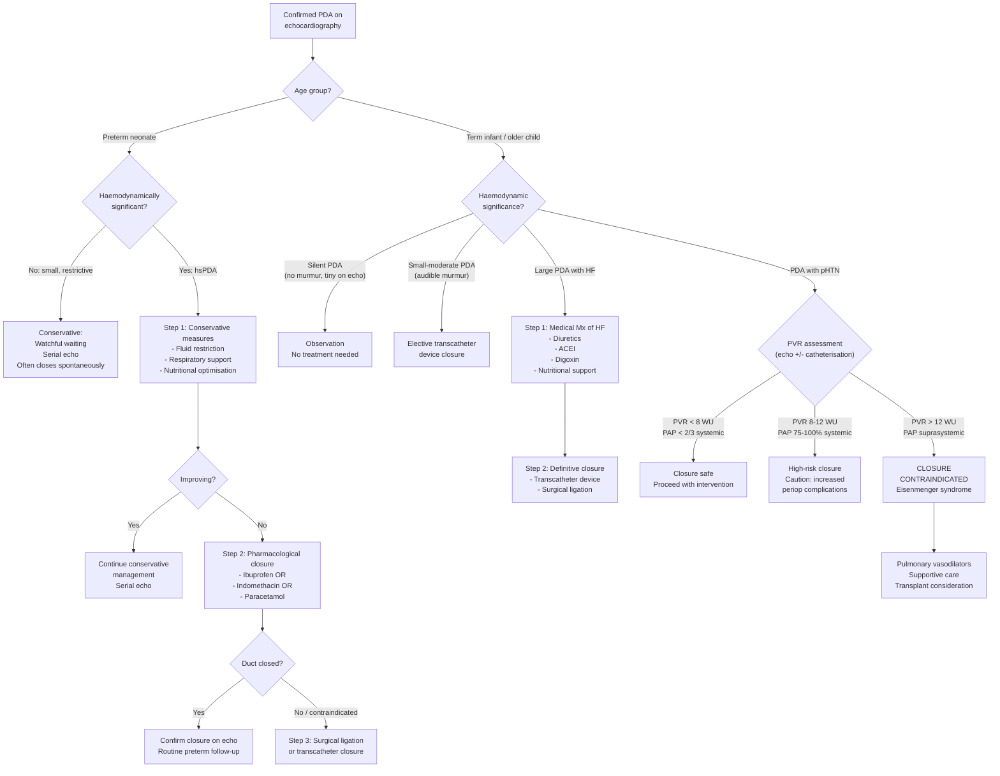

## Management of Patent Ductus Arteriosus (PDA) in Paediatrics

Management of PDA is fundamentally determined by **three factors**: (1) the **age group** (preterm vs term), (2) the **haemodynamic significance** of the PDA, and (3) the **presence of complications** such as heart failure or pulmonary hypertension. The overarching principle is that a PDA that is causing harm should be closed, but *how* it is closed differs dramatically between preterm and term infants.

---

### General Principles of PDA Management

***Management depends on size, symptoms, shunt ratio (Qp:Qs) and pulmonary pressure*** [1][2].

Before discussing specific treatments, let's establish the framework:

| Clinical Scenario | Management Approach |
|---|---|
| **Silent/tiny PDA** (incidental echo finding, no murmur) | Observation; no intervention needed |
| **Small PDA** (audible murmur, Qp:Qs < 1.5:1, normal chambers) | Historically observed with IE prophylaxis counselling; current 2024 AHA guidelines support transcatheter closure for all audible PDAs due to lifetime IE risk |
| **Moderate PDA** (Qp:Qs 1.5–2.2:1, mild LV dilatation) | Elective closure (transcatheter preferred) |
| **Large PDA** (Qp:Qs > 2.2:1, HF symptoms) | Medical stabilisation of HF → definitive closure (transcatheter or surgical) |
| **Preterm hsPDA** | Conservative supportive care → pharmacological closure → surgical/transcatheter closure if refractory |
| ***Eisenmenger PDA (PVR suprasystemic)*** | ***Closure CONTRAINDICATED*** — palliative care, pulmonary vasodilator therapy, consider heart-lung transplant [1][2] |

---

### Management Algorithm

---

### Treatment Modalities

#### I. Conservative / Supportive Management (Preterm Neonates)

This is the **first-line approach** for preterm PDA, based on growing evidence that many preterm PDAs close spontaneously and that aggressive early treatment may not improve long-term outcomes.

**Rationale**: The preterm duct has the potential for delayed spontaneous closure. Up to 34% of hsPDAs in extremely preterm infants close without pharmacological intervention by discharge. Conservative management avoids drug side effects while supporting the infant through the period of haemodynamic compromise.

| Measure | Mechanism / Rationale |
|---|---|
| **Fluid restriction** (typically 130–150 mL/kg/day, avoid excessive volumes) | Reduces intravascular volume → reduces preload → reduces LV volume overload and pulmonary congestion. However, overly restrictive fluids impair nutrition, so balance is key |
| **Respiratory support** (CPAP, mechanical ventilation with appropriate PEEP) | PEEP increases intrathoracic pressure → reduces pulmonary blood flow → may reduce L-to-R shunt. Also supports gas exchange in the setting of pulmonary oedema |
| **Nutritional optimisation** (concentrated feeds, fortified breast milk) | Increased metabolic demands from HF require higher caloric intake; concentrated formulas reduce volume while maintaining calories |
| **Maintain adequate haematocrit** (target Hb > 12 g/dL in symptomatic preterm) | Anaemia → reduced oxygen-carrying capacity → compensatory increase in cardiac output → worsens HF. Also, low haematocrit reduces blood viscosity → increases ductal flow |
| **Avoid excessive supplemental oxygen** | ***O₂ caution in large L-to-R shunt: ↑PAO₂ → pulmonary vasodilation → ↓PVR → ↑shunting*** [8]. Only give enough O₂ to maintain target SpO₂ (90–95% in preterms) |

<Callout title="The Shifting Paradigm: Conservative vs Early Treatment" type="idea">
Traditional teaching was to treat all hsPDAs aggressively with early pharmacological closure. However, multiple recent RCTs (including the PDA-TOLERATE trial and Baby-OSCAR trial, 2019–2023) have shown that early pharmacological treatment does NOT reduce the composite outcome of death or BPD in extremely preterm infants. Current practice (2024–2026) increasingly favours an initial conservative approach ("expectant management") in many centres, reserving pharmacotherapy for infants with clear haemodynamic compromise refractory to supportive care.
</Callout>

---

#### II. Pharmacological Closure (Preterm Neonates Only)

***Pharmacological closure is effective in preterm infants only*** — it does NOT work in term infants because term PDA is a structural defect, not simply persistent prostaglandin sensitivity.

**Mechanism**: All pharmacological agents work by **inhibiting prostaglandin synthesis**, thereby removing the PGE₂-mediated vasodilatory signal that keeps the immature duct open. Without PGE₂, the ductal smooth muscle constricts, leading to functional and eventually anatomical closure.

##### A. COX Inhibitors (Cyclooxygenase Inhibitors)

COX enzymes (COX-1 and COX-2) catalyse the conversion of arachidonic acid to prostaglandins, including PGE₂. Inhibiting COX → ↓PGE₂ → ductal constriction.

| Agent | ***Ibuprofen*** | ***Indomethacin*** |
|---|---|---|
| **Class** | Non-selective COX inhibitor | Non-selective COX inhibitor |
| **Route** | IV (preferred) or oral/rectal | IV |
| **Dosing** | ***Loading: 10 mg/kg IV, then 5 mg/kg at 24h and 48h*** (3-dose course) | ***Loading: 0.2 mg/kg IV, then 0.1–0.25 mg/kg at 12–24h intervals*** (3-dose course; dose escalates with postnatal age) |
| **Efficacy** | ~70–80% closure rate when given early (< 7 days) | ~70–80% closure rate |
| **Advantages** | ***Less renal side effects than indomethacin*** (better maintained renal blood flow); does not reduce cerebral or mesenteric blood flow as significantly | Well-established; also reduces IVH risk (reduces cerebral blood flow fluctuation) |
| **Disadvantages** | Displaces bilirubin from albumin → avoid in significant hyperbilirubinaemia | ***More nephrotoxic***; reduces cerebral and mesenteric blood flow (risk of NEC); oliguria |
| **Current preference** | ***Ibuprofen is preferred first-line in most centres (including Hong Kong)*** due to better renal safety profile | Still used; some centres prefer it for its IVH-protective effect |

##### B. Paracetamol (Acetaminophen)

| Feature | Detail |
|---|---|
| **Mechanism** | Inhibits PGE₂ synthesis via the **peroxidase** component of COX (different site from NSAIDs — acts on the POX active site of prostaglandin H₂ synthase). This reduces PGE₂ production in a gentler manner than COX inhibitors |
| **Route** | IV or oral |
| **Dosing** | 15 mg/kg every 6 hours for 3–7 days (IV or oral) |
| **Efficacy** | ~70–80% (comparable to COX inhibitors in recent meta-analyses) |
| **Advantages** | ***Fewer renal side effects than COX inhibitors; does not affect platelet function; safe in the setting of thrombocytopenia, NEC, or renal impairment*** — can be used when COX inhibitors are contraindicated |
| **Disadvantages** | Theoretical hepatotoxicity (though not demonstrated at standard doses in neonates); some concern about long-term neurodevelopmental effects (very preliminary data, not established) |
| **Current status** | ***Increasingly used as first-line alternative or when COX inhibitors are contraindicated. Some centres now use paracetamol as first-line given its safety profile*** |

##### Contraindications to Pharmacological Closure

| Contraindication | Reason |
|---|---|
| ***Duct-dependent congenital heart disease*** | Closing the PDA would be fatal — the duct is keeping the child alive (critical CoA, PA with IVS, TGA, HLHS, etc.) |
| **Active NEC or suspected NEC** | COX inhibitors reduce mesenteric blood flow → worsen gut ischaemia. Paracetamol may be cautiously used |
| **Significant renal impairment** (creatinine > 1.5–1.8 mg/dL, urine output < 0.6 mL/kg/hr) | COX inhibitors are nephrotoxic → worsen renal failure. Paracetamol is preferred if treatment needed |
| **Active bleeding / severe thrombocytopenia** (platelets < 50,000/μL) | COX inhibitors impair platelet function → increase bleeding risk. Paracetamol does not affect platelets |
| **Significant hyperbilirubinaemia** (especially for ibuprofen) | Ibuprofen displaces bilirubin from albumin binding sites → increases free bilirubin → risk of kernicterus |
| **Term infant PDA** | Pharmacological closure is ineffective — the defect is structural, not prostaglandin-dependent |

<Callout title="Exam Must-Know: Three Drugs for Preterm PDA Closure" type="error">

The three pharmacological agents for preterm PDA closure and their key differences:
1. **Indomethacin** — most nephrotoxic, reduces IVH risk (reduces cerebral flow fluctuation)
2. **Ibuprofen** — preferred in most centres; better renal profile
3. **Paracetamol** — safe in renal impairment, thrombocytopenia, NEC; alternative/first-line in some centres

**None of these work in term PDA** — because term PDA is structural, not prostaglandin-dependent.
</Callout>

---

#### III. Medical Management of Heart Failure (Term and Preterm)

When a PDA causes heart failure — whether in a symptomatic term infant or a preterm neonate — medical treatment of HF is needed as a **bridge** to definitive closure or while assessing suitability for intervention.

***The management framework for paediatric heart failure*** (as per lecture slides [5]):

> ***1. Identification of the cause and precipitating factors***
> ***2. Tackling of precipitating factors***
> ***3. General supportive management***
> ***4. Medical therapy of heart failure (diuretics, digoxin, ACEI, carvedilol)***
> ***5. Treatment of underlying cause, if possible, by surgical or catheter intervention***
> ***6. Mechanical circulatory support and heart transplantation***

**Specific medications for PDA-related HF:**

| Drug | Class | Mechanism in PDA Context | Paediatric Dosing |
|---|---|---|---|
| ***Furosemide (frusemide)*** | Loop diuretic | Reduces preload by promoting salt and water excretion → relieves pulmonary congestion and oedema | 1–2 mg/kg/dose IV/oral, 1–3 times daily |
| ***Spironolactone*** | MRA (mineralocorticoid receptor antagonist) | Potassium-sparing diuretic; anti-fibrotic effects; counteracts RAAS activation | 1–3 mg/kg/day oral in 1–2 divided doses |
| ***Captopril / Enalapril*** | ACE inhibitor | Reduces afterload (↓SVR) → improves forward cardiac output; also ↓ RAAS-mediated fluid retention. **Caution**: reducing SVR may increase the L-to-R shunt if the PDA is still open, but the net effect is beneficial because improved LV function and reduced congestion outweigh this | Captopril: 0.1–0.5 mg/kg/dose TDS; Enalapril: 0.05–0.1 mg/kg/dose BD (start low, titrate up) |
| **Digoxin** | Cardiac glycoside | Positive inotrope (inhibits Na⁺/K⁺-ATPase → increases intracellular Ca²⁺ → increased contractility); also slows AV conduction. ***Seldom used due to narrow therapeutic index*** [8] | Loading: 20–30 μg/kg (term), 15–20 μg/kg (preterm); Maintenance: 5–10 μg/kg/day |
| ***Carvedilol*** | Non-selective β-blocker + α1-blocker | Neurohormonal modulation (reduces sympathetic overdrive); anti-remodelling. Used in chronic HF, not acute decompensation | 0.05–0.1 mg/kg/dose BD, titrate slowly |

**General supportive measures** [8]:
- ***Bed rest with elevation of bed head*** → improves lung function by reducing hydrostatic pulmonary oedema
- ***High caloric diet*** → increased metabolic demands from HF require caloric supplementation (up to 120–150 kcal/kg/day in infants)
- ***Fluid restriction*** → reduces volume overload
- ***Oxygen with caution*** → ***in large L-to-R shunt, excessive O₂ causes pulmonary vasodilation → ↓PVR → ↑shunting*** [8]
- **Treat precipitating factors** → infection, anaemia, arrhythmia, electrolyte disturbance

| HF Stage | Medical Therapy |
|---|---|
| ***Stage A*** (at risk, no symptoms) | ***No specific treatment*** |
| ***Stage B*** (structural, asymptomatic) | ***ACEI/ARB + beta-blocker (e.g., carvedilol)*** |
| ***Stage C*** (structural, symptomatic) | ***ACEI/ARB + beta-blocker + MRA ± diuretics*** |
| ***Stage D*** (refractory) | ***Above + IV inotropes (e.g., dobutamine, milrinone), diuretics, ± mechanical support*** [8] |

---

#### IV. Definitive Closure — Transcatheter Device Closure (First-Line for Term PDA)

***Transcatheter device closure is now the preferred method for PDA closure in term infants and older children*** — it is minimally invasive, avoids thoracotomy, and has excellent success rates.

| Feature | Detail |
|---|---|
| **Procedure** | Catheter inserted via femoral artery or vein → device deployed across the PDA under fluoroscopic and echocardiographic guidance |
| **Devices** | Amplatzer Duct Occluder (ADO) I or II; Amplatzer Vascular Plug; coils (for small PDAs); Piccolo™ Occluder (for small preterms ≥ 700g) |
| **Success rate** | > 95% immediate closure; > 98% at 1 year |
| **Advantages** | No thoracotomy; shorter hospital stay (usually 1–2 days); lower morbidity; cosmetically superior; avoids cardiopulmonary bypass |
| **Minimum weight** | ADO I: typically > 5–6 kg; Piccolo™: ≥ 700 g (FDA-approved for preterm ≥ 700 g) |
| **Timing** | Elective: usually after 6–12 months of age in term infants; earlier if symptomatic and weight allows |

**Indications for transcatheter closure:**

| Indication | Rationale |
|---|---|
| All audible PDAs (moderate or small with murmur) in term infants | Lifetime risk of IE; LV volume overload in moderate PDAs; current guidelines support closure [2024 AHA/ACC] |
| Haemodynamically significant PDA with Qp:Qs > 1.5:1 | Volume overload; HF risk |
| PDA with LV dilatation | Evidence of haemodynamic consequence |
| History of infective endocarditis | Definitive prevention of recurrence |

**Contraindications:**

| Contraindication | Reason |
|---|---|
| ***PVR > 12 WU or PAP suprasystemic (Eisenmenger)*** | ***Risk of precipitating acute RV heart failure + ↓LV output*** — closing the PDA removes the "pop-off valve" for the RV → acute RV decompensation [1][2] |
| ***PVR 8–12 WU or PAP 75–100% systemic*** | ***↑Risk of perioperative complications*** — exercise extreme caution; may attempt trial occlusion with catheter to assess haemodynamic response before definitive closure [1][2] |
| Duct-dependent circulation | The PDA is life-sustaining |
| Infant too small for device (< 700 g for Piccolo™) | Technical limitation; surgical ligation preferred |
| Unfavourable anatomy (very short/window-type duct) | Device may embolise or obstruct LPA or aorta |

---

#### V. Definitive Closure — Surgical Ligation / Division

Surgical closure was historically the only option and remains important in specific situations.

| Feature | Detail |
|---|---|
| **Procedure** | Left posterolateral thoracotomy (through 3rd or 4th intercostal space) → PDA identified → ligation (suture tie) or division (cut between ligatures) or clip application |
| **No cardiopulmonary bypass needed** | The PDA is an extracardiac structure — surgery is performed through the chest without stopping the heart |
| **Success rate** | > 99% |
| **Mortality** | < 1% (extremely low in isolated PDA) |

**Indications for surgical closure:**

| Indication | Rationale |
|---|---|
| ***Preterm PDA refractory to pharmacological closure*** | COX inhibitors and paracetamol have failed or are contraindicated |
| Preterm PDA where pharmacological closure is contraindicated | Active NEC, severe renal failure, thrombocytopenia — and conservative measures insufficient |
| Term infant too small or with anatomy unsuitable for transcatheter device | Weight < 5 kg (for conventional devices); unfavourable duct morphology |
| **Large PDA with heart failure refractory to medical management** | Definitive closure needed urgently |
| ***Associated cardiac anomaly requiring surgical repair*** | PDA ligated at the time of open-heart surgery for the other lesion |

**Complications of surgical ligation:**

| Complication | Mechanism |
|---|---|
| **Recurrent laryngeal nerve palsy** | The left recurrent laryngeal nerve loops around the aortic arch at the level of the ligamentum arteriosum/PDA — surgical manipulation can damage it → hoarse cry, feeding difficulties |
| **Phrenic nerve palsy** | Left phrenic nerve runs near the operative field → diaphragmatic paralysis → respiratory compromise |
| **Chylothorax** | Thoracic duct injury during dissection → lymphatic fluid leakage into pleural space |
| **Pneumothorax** | From thoracotomy |
| **Incomplete closure / recanalisation** | Rare; more common with ligation alone than with division |
| **Post-ligation cardiac syndrome** (preterm) | Acute LV dysfunction after PDA ligation → hypotension, low cardiac output. Mechanism: sudden increase in LV afterload (SVR rises when diastolic run-off ceases) in a myocardium adapted to low afterload. Occurs in ~30% of preterm surgical ligations → managed with milrinone (inodilator) |

---

#### VI. Special Situations

##### A. Duct-Dependent Congenital Heart Disease

***In duct-dependent CHD, the PDA must be kept OPEN with PGE₁ (alprostadil) infusion*** — closing it would be fatal.

| Feature | Detail |
|---|---|
| **Drug** | ***Prostaglandin E₁ (PGE₁, alprostadil)*** |
| **Route** | Continuous IV infusion |
| **Starting dose** | ***0.01–0.05 μg/kg/min*** (lower dose for maintenance after duct has reopened) |
| **Higher dose** | Up to 0.1 μg/kg/min to reopen a closing duct |
| **Mechanism** | PGE₁ binds EP4 receptors on ductal smooth muscle → activates adenylate cyclase → ↑cAMP → smooth muscle relaxation → ductal dilation |
| ***Side effects*** | ***Apnoea (15–20% — most important; always have intubation equipment ready), fever, hypotension, flushing, diarrhoea, seizures (rare), cortical hyperostosis (with prolonged use)*** |

##### B. Eisenmenger PDA

***Closure is absolutely contraindicated*** when PVR is suprasystemic [1][2].

Management is palliative:
- ***Pulmonary vasodilator therapy***: bosentan (endothelin receptor antagonist), sildenafil (PDE5 inhibitor), prostacyclin analogues (epoprostenol, iloprost)
- Avoid dehydration, altitude, pregnancy (in adolescents)
- Iron supplementation for secondary erythrocytosis
- ***Consider heart-lung transplantation*** in suitable candidates

##### C. The "Silent" / Very Small PDA

- No audible murmur; found incidentally on echocardiography
- Current 2024 AHA guidelines state that closure of a **silent PDA** (no murmur, no haemodynamic significance) is **not recommended** — the IE risk is extremely low and does not justify intervention
- **Surveillance echo** every few years is reasonable

---

### Summary Table: Management by Clinical Scenario

| Scenario | Management |
|---|---|
| ***Silent PDA*** (tiny, incidental) | Observation |
| ***Small PDA*** (audible, no LV dilatation) | Transcatheter closure (elective) — prevents lifetime IE risk |
| ***Moderate PDA*** (LV dilatation, Qp:Qs 1.5–2.2) | Transcatheter closure (elective) |
| ***Large PDA with HF*** (Qp:Qs > 2.2) | ***Medical Mx of HF (diuretics, ACEI, digoxin, nutrition) → definitive closure (transcatheter or surgical)*** |
| ***Preterm hsPDA*** | ***Conservative → Pharmacological (ibuprofen/indomethacin/paracetamol) → Surgical ligation if refractory*** |
| ***PDA with pHTN (PVR < 8 WU)*** | Closure safe |
| ***PDA with pHTN (PVR 8–12 WU)*** | ***Caution — ↑periop risk; trial occlusion at catheterisation*** [1][2] |
| ***Eisenmenger PDA (PVR > 12 WU)*** | ***Closure CONTRAINDICATED; pulmonary vasodilators; transplant*** [1][2] |
| ***Duct-dependent CHD*** | ***PGE₁ infusion to maintain duct patency*** |

---

<Callout title="High Yield Summary">

**Management of PDA — Key Exam Points:**

1. ***Management depends on size, symptoms, Qp:Qs, and pulmonary pressure*** [1][2]
2. ***Preterm PDA***: Conservative first → Pharmacological closure (ibuprofen preferred, indomethacin or paracetamol alternatives) → Surgical ligation if refractory
3. ***Term PDA***: Pharmacological closure does NOT work. Transcatheter device closure is first-line; surgical ligation if too small or unsuitable anatomy
4. ***Three drugs for preterm PDA closure***: Indomethacin (most nephrotoxic, reduces IVH), Ibuprofen (preferred, less nephrotoxic), Paracetamol (safe in renal failure/thrombocytopenia/NEC)
5. ***Medical HF management (per lecture slides)***: Identification of cause → tackle precipitants → supportive measures → medical therapy (diuretics, digoxin, ACEI, carvedilol) → surgical/catheter intervention → mechanical support/transplant [5]
6. ***Avoid excessive O₂ in large L-to-R shunt*** → pulmonary vasodilation → ↓PVR → ↑shunting [8]
7. ***Closure contraindicated if PVR > 12 WU or PAP suprasystemic*** (Eisenmenger) → risk of acute RV failure [1][2]
8. ***PVR 8–12 WU***: caution, ↑periop risk [1][2]
9. ***Duct-dependent CHD: PGE₁ (alprostadil) 0.01–0.05 μg/kg/min*** → keep duct open; SE: apnoea (have intubation ready)
10. ***Post-ligation cardiac syndrome*** in preterms: acute LV dysfunction from sudden afterload increase; treat with milrinone
11. ***Surgical complications***: recurrent laryngeal nerve palsy (hoarse cry), phrenic nerve palsy, chylothorax

</Callout>

---

<ActiveRecallQuiz
  title="Active Recall - PDA Management"
  items={[
    {
      question: "Name the three pharmacological agents used to close a preterm PDA and explain why they do NOT work in term infants.",
      markscheme: "Indomethacin, ibuprofen, paracetamol. All work by inhibiting prostaglandin synthesis (COX inhibition for indomethacin/ibuprofen; peroxidase component of COX for paracetamol), removing PGE2 that maintains ductal patency. They do not work in term PDA because the defect is structural (abnormal ductal wall tissue that fails to constrict normally), not simply prostaglandin-dependent."
    },
    {
      question: "What are the contraindications to pharmacological PDA closure with COX inhibitors in a preterm neonate?",
      markscheme: "1) Duct-dependent CHD, 2) Active or suspected NEC, 3) Significant renal impairment (creatinine > 1.5-1.8 mg/dL, oliguria < 0.6 mL/kg/hr), 4) Active bleeding or severe thrombocytopenia (platelets < 50,000), 5) Significant hyperbilirubinaemia (especially for ibuprofen which displaces bilirubin from albumin)."
    },
    {
      question: "Why is closure of PDA contraindicated when PVR exceeds 12 Wood units? What happens if you close the PDA in Eisenmenger physiology?",
      markscheme: "In Eisenmenger PDA, the R-to-L shunt through the PDA acts as a 'pop-off valve' for the RV, decompressing the suprasystemic pulmonary pressures. Closing the PDA removes this outlet, causing acute RV pressure overload and failure, plus reduced LV output (underfilling due to RV failure). The suprasystemic PVR is fixed and irreversible, so closing the shunt cannot reduce PA pressure."
    },
    {
      question: "Outline the six-step management framework for paediatric heart failure as per the lecture slides.",
      markscheme: "1) Identification of the cause and precipitating factors, 2) Tackling precipitating factors, 3) General supportive management, 4) Medical therapy (diuretics, digoxin, ACEI, carvedilol), 5) Treatment of underlying cause by surgical or catheter intervention, 6) Mechanical circulatory support and heart transplantation."
    },
    {
      question: "What is post-ligation cardiac syndrome in preterm PDA? Explain its mechanism and treatment.",
      markscheme: "Post-ligation cardiac syndrome is acute LV dysfunction occurring in approximately 30% of preterm infants after surgical PDA ligation. Mechanism: the LV has adapted to a low-afterload state (diastolic run-off through PDA reduces SVR). Sudden PDA closure removes this run-off, acutely increasing LV afterload. The immature preterm myocardium cannot cope, causing hypotension and low cardiac output. Treatment: milrinone (inodilator — increases contractility while reducing afterload)."
    },
    {
      question: "A neonate with critical pulmonary atresia requires the PDA to remain open. What drug do you use, at what dose, and what is the most important side effect to prepare for?",
      markscheme: "PGE1 (alprostadil) continuous IV infusion at 0.01-0.05 mcg/kg/min (up to 0.1 mcg/kg/min to reopen a closing duct). Most important side effect: apnoea (occurs in 15-20%). Must have intubation equipment at the bedside. Other side effects include fever, hypotension, flushing, and seizures."
    }
  ]}
/>

## References

[1] Senior notes: Adrian Lui Pediatrics.pdf (p200, p202)
[2] Senior notes: Ryan Ho Cardiology.pdf (p189, p191, p194)
[5] Lecture slides: GC 147. Heart failure and cyanosis in children acyanotic and cyanotic congenital heart disease - Part 1.pdf (p36)
[8] Senior notes: Adrian Lui Pediatrics.pdf (p200 — Management of paediatric HF, O₂ caution)
