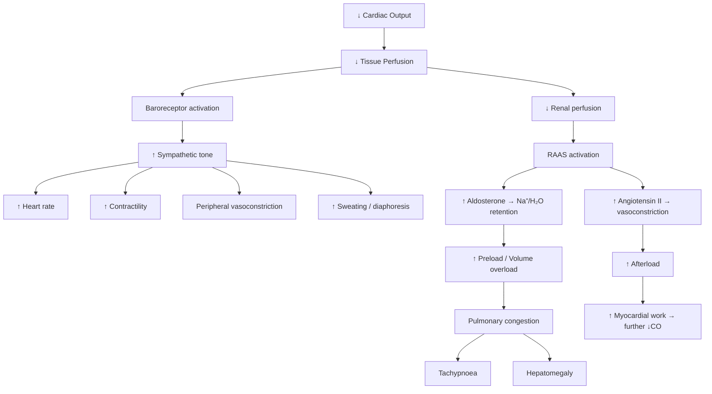

# Poor Feeding and Sweating During Feeds (Heart Failure in Infants and Children)

## Definition

Heart failure (HF) in the paediatric population is a **clinical syndrome** in which the heart is unable to deliver sufficient cardiac output to meet the metabolic demands of the growing body — or can only do so at the expense of abnormally elevated filling pressures [1][2]. In infants, the cardinal presenting features are not the classic adult triad of dyspnoea–oedema–fatigue but rather ***poor feeding, excessive sweating during feeds, and failure to thrive*** [1][3].

> **Why "poor feeding and sweating during feeds"?** Feeding is the most metabolically demanding activity for an infant — the equivalent of exercise in an adult. An infant in heart failure cannot increase cardiac output to meet this demand, leading to easy fatiguability (manifesting as poor feeding, falling asleep at the breast/bottle, prolonged feeding times) and sympathetic activation (manifesting as diaphoresis/sweating). This is the paediatric equivalent of exertional dyspnoea and exercise intolerance in adults.

Breaking down the terminology:
- **Heart** = the pump
- **Failure** = inability to perform its function (maintaining adequate circulation)
- **Diaphoresis** (Greek: *dia-* = through, *phoresis* = carrying) = carrying sweat through the skin — i.e., excessive sweating due to sympathetic overdrive
- **Failure to thrive (FTT)** = inadequate growth — the downstream consequence of chronic insufficient caloric intake plus increased metabolic demand

---

## Epidemiology

### Incidence and Prevalence
- Congenital heart disease (CHD) is the most common congenital malformation worldwide: **~8 per 1,000 live births** [4]
- In Hong Kong, the incidence of CHD is approximately **7–8 per 1,000 live births**, consistent with global figures
- **Heart failure** develops in roughly **20–25%** of infants with significant CHD during the first year of life
- The most common structural cause of infant heart failure in the first 2–3 months of life is a ***large left-to-right shunt*** (especially VSD, AVSD, PDA) [1][3]
- ***Duct-dependent lesions*** (e.g., coarctation of the aorta, critical aortic stenosis, hypoplastic left heart syndrome, interrupted aortic arch) present in the **first 1–2 weeks** of life as the ductus arteriosus closes [1][3]

### Age at Presentation — A Crucial Clue
| Age at Presentation | Most Likely Cause | Why at This Age? |
|---|---|---|
| First hours/days | Duct-dependent systemic circulation (CoA, HLHS, IAA, critical AS), arrhythmias, myocarditis, asphyxia | Ductus begins closing; loss of systemic perfusion |
| 1–2 weeks | Duct-dependent lesions (late closure), severe CoA | Same as above, slightly delayed ductal closure |
| ***2–3 months*** | ***Large L-to-R shunts (VSD, AVSD, PDA)*** | ***PVR drops to adult levels by 6–8 weeks → shunt increases dramatically*** |
| 6 months – childhood | Cardiomyopathy, myocarditis, Kawasaki disease complications, unoperated CHD | Progressive ventricular dysfunction |
| Older children/adolescents | Post-operative late ventricular dysfunction, secondary cardiomyopathies (iron overload from thalassaemia major, post-chemotherapy), valvular insufficiency | Accumulated myocardial injury |

<Callout title="High Yield — Timing of Presentation" type="idea">
***The timing of presentation is the single most important clue to the aetiology of paediatric heart failure.*** A neonate presenting in the first week → think duct-dependent lesion. An infant presenting at 6–8 weeks → think large L-to-R shunt (VSD, AVSD, PDA). The reason is the physiological drop in pulmonary vascular resistance (PVR) that occurs over the first 6–8 weeks of life [1][3].
</Callout>

---

## Risk Factors

### For Congenital Heart Disease (the commonest cause of infant HF)
- **Chromosomal abnormalities**: Down syndrome (40–50% have CHD, especially AVSD, VSD), Turner syndrome (CoA, bicuspid AV), Trisomy 18/13
- **Maternal factors**: diabetes (especially pre-gestational — risk of TGA, VSD, HCMP), rubella infection (PDA, peripheral PS), SLE (congenital heart block), medications (lithium → Ebstein anomaly, anticonvulsants, retinoids, alcohol)
- **Family history**: recurrence risk ~3–5% if one sibling affected; higher with specific syndromes
- **Prematurity**: PDA is extremely common in premature infants (up to 70% in < 28 weeks GA) due to ductal tissue immaturity and sensitivity to prostaglandins

### For Non-Structural Causes of HF
- **Severe anaemia** (e.g., haemolytic disease of the newborn, fetomaternal transfusion, thalassaemia major in Hong Kong)
- **Sepsis/infection** — especially in neonates
- **Arrhythmias** — SVT (often Wolff-Parkinson-White related), congenital complete heart block (associated with maternal anti-Ro/anti-La antibodies in neonatal lupus)
- **Myocarditis** — viral (Coxsackie B, adenovirus, enterovirus)
- **Kawasaki disease** — leading acquired cause of heart disease in children in Hong Kong and across Asia; coronary artery aneurysms → MI → ventricular dysfunction

---

## Relevant Anatomy and Physiology

### Fetal Circulation — The Starting Point

Understanding paediatric heart failure requires understanding the **transition from fetal to postnatal circulation**, because this transition determines *when* lesions become symptomatic.

**Fetal circulation key features:**
1. **Placenta** is the organ of gas exchange (not lungs) → lungs are fluid-filled, high-resistance
2. **Pulmonary vascular resistance (PVR) is very high** in utero → only ~10% of RV output goes to the lungs
3. **Three shunts** allow blood to bypass the lungs:
   - **Ductus venosus**: oxygenated blood from umbilical vein → IVC, bypassing the liver
   - **Foramen ovale**: oxygenated blood from RA → LA (because RA pressure > LA pressure in utero)
   - **Ductus arteriosus (DA)**: blood from PA → descending aorta (because PVR > SVR)

4. **In utero, both ventricles work in parallel**, not in series. The RV pumps against high PVR and blood flows R→L through the DA into the aorta.

### Postnatal Transitional Circulation

At birth, three critical events occur:
1. **First breath** → lung expansion → dramatic ↓PVR
2. **Clamping of the umbilical cord** → ↑SVR (loss of low-resistance placental bed)
3. **↑PaO₂** → triggers functional closure of the ductus arteriosus (O₂ is a potent constrictor of ductal smooth muscle; prostaglandins keep the DA open — hence why indomethacin/ibuprofen can close a PDA, and PGE₁ can keep it open)

**Timeline of postnatal changes:**
- **PVR drops** progressively over the first **6–8 weeks** of life (this is critical!)
- **Ductus arteriosus**: functional closure within 24–72 hours; anatomical closure (ligamentum arteriosum) by 2–3 weeks
- **Foramen ovale**: functional closure within hours (LA pressure > RA pressure once pulmonary venous return increases); anatomical closure variable (patent foramen ovale persists in ~25% of adults)

### Why This Matters for Heart Failure

- ***Duct-dependent systemic circulation*** (e.g., critical CoA, HLHS, IAA, critical AS): The systemic circulation depends on R→L flow through the DA. When the DA closes in the first days of life → catastrophic ↓systemic perfusion → ***cardiogenic shock*** [1][3]
- ***Large L-to-R shunts*** (VSD, AVSD, PDA): In the first days of life, PVR is still high → minimal L→R shunting → baby appears well. As PVR drops over 6–8 weeks → ***progressive increase in L→R shunting → pulmonary overcirculation → volume overload of LA and LV → heart failure symptoms emerge at 2–3 months*** [3][5]

### Normal Cardiovascular Parameters by Age

| Parameter | Neonate | Infant (1–12 mo) | Child (1–5 yr) | Older child (6–12 yr) |
|---|---|---|---|---|
| Heart rate (bpm) | 100–160 | 100–150 | 80–120 | 70–110 |
| Systolic BP (mmHg) | 60–90 | 80–100 | 90–110 | 100–120 |
| Respiratory rate (/min) | 30–60 | 25–40 | 20–30 | 18–25 |
| Cardiac output (mL/kg/min) | ~200 | ~150 | ~100 | ~80 |

> Note: Neonates have a **relatively fixed stroke volume** and are **heart-rate dependent** for cardiac output. This is why tachycardia is the earliest and most important compensatory sign in infant HF — they can't increase stroke volume as effectively as older children and adults because of immature myocardium with less compliant ventricles and fewer organized sarcomeres.

---

## Aetiology (Focus on Hong Kong Paediatric Population)

The causes of paediatric heart failure differ fundamentally from adult HF. In adults, ischaemic heart disease and hypertension dominate. ***In children, structural congenital heart disease with preserved contractility is the most common cause*** [1][3].

### Aetiological Classification

#### A. Heart Failure with Preserved Contractility (Most Common in Paediatrics)

##### 1. Duct-Dependent CHD (Presenting in Neonatal Period — First 1–2 Weeks)

***"Duct-dependent systemic circulation"*** — the baby's systemic blood flow depends on blood flowing from the PA through the DA into the aorta [1][3]:

| Lesion | Mechanism |
|---|---|
| ***Coarctation of the aorta (CoA)*** | Discrete narrowing of aorta (usually at/near DA insertion) → blood flow to lower body depends on DA; when DA closes → acute LV afterload mismatch + ↓lower body perfusion |
| ***Interrupted aortic arch (IAA)*** | Complete discontinuity of the aortic arch → all descending aortic flow via DA |
| ***Critical aortic stenosis (AS)*** | Severe LVOT obstruction → LV cannot generate adequate systemic output → DA supplements systemic flow |
| ***Hypoplastic left heart syndrome (HLHS)*** | Underdeveloped LV, mitral valve, aortic valve → entire systemic circulation supplied by RV through DA |

**Pathophysiology:** When the DA closes → catastrophic loss of systemic perfusion → metabolic acidosis, shock, multi-organ failure, and death if not recognised and treated with ***prostaglandin E₁ (PGE₁/alprostadil) infusion*** to reopen the DA [1][3].

> ***PDA in premature infants*** is also listed as a cause of neonatal HF — here the mechanism is different: the DA fails to close → large L→R shunt (aorta → PA) → pulmonary overcirculation + systemic steal (↓diastolic blood flow to gut, kidneys, brain) [1].

##### 2. Large Left-to-Right Shunts (Presenting at 2–3 Months)

***This is the most common cause of heart failure presenting with poor feeding and sweating during feeds*** [1][3].

| Lesion | Frequency | Key Features |
|---|---|---|
| ***Ventricular septal defect (VSD)*** | ***Commonest CHD (1 in 500 live births)*** [5] | Only moderate-large VSDs cause HF; small VSDs are asymptomatic with loud PSM |
| ***Atrioventricular septal defect (AVSD)*** | Strong association with Down syndrome | Complete AVSD has both atrial and ventricular components + common AV valve |
| ***Patent ductus arteriosus (PDA)*** | Very common in prematurity | Continuous "machinery" murmur; systemic steal phenomenon |
| ***Atrial septal defect (ASD)*** | ***Rarely causes HF in infancy*** [1] | Low-pressure shunt → well tolerated for decades; may cause RV failure in adulthood |

**Pathophysiology of L-to-R shunt causing HF** (using VSD as the example):
1. In utero: PVR ≈ SVR → minimal shunting → no haemodynamic consequence
2. After birth: PVR drops progressively over 6–8 weeks
3. As PVR ↓ → pressure gradient from LV to RV increases → ***↑L-to-R shunt volume***
4. ***↑Pulmonary blood flow*** → pulmonary overcirculation → pulmonary venous congestion
5. ***↑Pulmonary venous return to LA*** → LA dilation → ↑LA pressure
6. ***LV volume overload*** (the LV receives more blood than normal) → LV dilation
7. ***Heart failure develops*** when compensatory mechanisms (↑heart rate, ↑contractility, ventricular dilation) are overwhelmed
8. The RV is initially NOT volume-overloaded — it merely acts as a ***conduit*** for blood flowing from LV → RV → PA [5]

<Callout title="Why does a large VSD cause HF at 2–3 months and not at birth?">
Because PVR is still high at birth (nearly systemic), so even with a large VSD, there is minimal pressure gradient to drive L→R shunting. As PVR progressively falls over the first 6–8 weeks of life, the shunt volume increases dramatically. This is why the baby is initially well and then presents at around 2–3 months with poor feeding, sweating, tachypnoea, and failure to thrive [1][3][5].
</Callout>

##### 3. Other Structural Causes
- **Unoperated CHD** in older children
- ***Valvular insufficiencies*** (MR, AR, TR, PR) — volume overload of respective chambers [1]

#### B. Heart Failure with Impaired Contractility (Less Common in Paediatrics)

##### 1. Neonatal Period
| Cause | Mechanism |
|---|---|
| ***Myocarditis*** | Viral infection (Coxsackie B, enterovirus) → inflammatory infiltrate → myocyte necrosis → ↓contractility |
| ***Transient myocardial ischaemia*** | Perinatal asphyxia → subendocardial ischaemia |
| ***Cardiomyopathy*** | Inherited (dilated, hypertrophic) or metabolic |
| ***Sepsis*** | Myocardial depression from circulating cytokines (TNF-α, IL-1β) + vasodilation → distributive + cardiogenic shock |
| ***Asphyxia*** | Global hypoxic-ischaemic injury to myocardium |
| ***Hypocalcaemia (in low birth weight babies)*** | Ca²⁺ is essential for excitation-contraction coupling; ↓Ca²⁺ → impaired contractility [1] |
| ***Anaemia*** (e.g., fetomaternal transfusion) | High-output failure; ↓O₂ delivery with compensatory ↑CO → eventual decompensation [1] |

##### 2. Infant Period (2–3 Months)
| Cause | Mechanism |
|---|---|
| ***Cardiomyopathy*** | Dilated CMP most common in paediatrics |
| ***MI due to Kawasaki disease*** | Coronary artery aneurysm → thrombosis → MI → segmental wall motion abnormality → ↓EF |
| ***Anomalous left coronary artery from pulmonary artery (ALCAPA)*** | As PVR drops, coronary perfusion pressure drops → myocardial ischaemia → infarction → severe LV dysfunction. Classic presentation: infant who ***cries with feeds*** (angina equivalent) |
| ***Arrhythmias — SVT, VT*** | Often WPW-related; ↑HR → ↓diastolic filling time → ↓CO; if sustained → tachycardia-induced cardiomyopathy [1] |

##### 3. Older Children and Adolescents

| Cause | Mechanism | Hong Kong Relevance |
|---|---|---|
| ***Iron overload cardiomyopathy*** | Transfusion-dependent thalassaemia → Fe deposits in myocardium → oxidative stress → DCMP | **Major cause in Hong Kong** — thalassaemia is common in Southern Chinese; leading cause of death in thalassaemia major is cardiac [6][7] |
| ***Post-chemotherapy cardiomyopathy*** | Anthracyclines (doxorubicin) → dose-dependent cardiotoxicity → DCMP | Relevant in childhood cancer survivors |
| ***Neuromuscular disease*** | Duchenne muscular dystrophy → progressive myocardial fibrosis → DCMP | X-linked, presents in boys |
| ***Endocarditis/myocarditis*** | Infectious or autoimmune inflammation → myocardial damage | |
| ***Operated CHD with late ventricular dysfunction*** | Scarring, volume/pressure overload from residual lesions, arrhythmias | Growing population of CHD survivors in HK |
| ***Premature MI in homozygous familial hypercholesterolaemia*** | Severe atherosclerosis from childhood [1] | Rare but recognised |
| ***Rheumatic heart disease*** | Post-streptococcal valvular damage → MR/AR → volume overload | Less common in HK now but still seen in immigrant populations |

#### C. Arrhythmic Causes

| Arrhythmia | Age Group | Mechanism |
|---|---|---|
| ***SVT (often WPW-related)*** | Any age | Rapid rate → ↓diastolic filling → ↓CO; sustained → tachycardia-induced CMP [1] |
| ***VT*** | Any age | As above + risk of degeneration to VF |
| ***Congenital complete heart block*** | Neonatal | Associated with maternal SLE (anti-Ro/La antibodies); ventricular rate ~50–60 bpm → ↓CO |

#### D. Extracardiac/High-Output Causes

| Cause | Mechanism |
|---|---|
| ***Severe anaemia*** | ↓Hb → ↓O₂ carrying capacity → compensatory ↑CO → eventually exceeds cardiac reserve |
| ***Thyrotoxicosis*** | ↑metabolic rate → ↑demand; direct chronotropic effect → tachycardia |
| ***Arteriovenous malformation/fistula*** (e.g., vein of Galen malformation) | Low-resistance vascular shunt → ↑venous return → volume overload → high-output HF |
| ***Fluid overload*** | Iatrogenic (excessive IV fluids) or renal failure → ↑preload beyond compensatory capacity |

---

## Pathophysiology of Heart Failure in Infants and Children

### The Core Problem: Mismatch Between Supply and Demand

***Heart failure = cardiac output cannot meet metabolic demand → a mismatch*** [1][3].

This is identical to the adult concept, but the **compensatory mechanisms and clinical manifestations differ** because of the unique physiology of the immature cardiovascular system.

### Frank-Starling Mechanism in the Paediatric Heart

The Frank-Starling law states that within physiological limits, increased end-diastolic volume (preload) leads to increased stroke volume. This is because greater myocyte stretch → more optimal actin-myosin overlap → stronger contraction.

However, the **neonatal/infant myocardium has important differences**:
- Fewer and less organised sarcomeres
- Greater proportion of non-contractile elements (mitochondria, nuclei)
- Less compliant ventricles
- **Relatively fixed stroke volume** → cardiac output is **heart-rate dependent**
- Limited contractile reserve — cannot augment contractility as effectively as the adult heart

This means:
1. **Tachycardia** is the primary compensatory mechanism (and the earliest sign of HF)
2. Volume overload pushes the infant heart past the optimal Starling point more easily
3. The threshold for decompensation is lower

### Compensatory Mechanisms in Heart Failure

When cardiac output falls, the body activates several compensatory pathways. Initially helpful, these become maladaptive with sustained activation:

| Mechanism | Effect | Clinical Manifestation | Maladaptive Consequence |
|---|---|---|---|
| ***↑ Sympathetic tone*** | ↑HR, ↑contractility, vasoconstriction | ***Tachycardia, sweating, cool peripheries*** | ↑Myocardial O₂ demand, ↑afterload |
| ***RAAS activation*** | Na⁺/H₂O retention, vasoconstriction | ***Oedema, hepatomegaly, weight gain*** | Volume overload, ↑afterload |
| ***Ventricular dilation*** (Starling) | ↑Stroke volume (initially) | ***Cardiomegaly on CXR*** | Beyond optimal → ↓CO, MR from annular dilation |
| ***Ventricular hypertrophy*** | ↓Wall stress (LaPlace's law) | ***Precordial bulge (chronic)*** | Diastolic dysfunction, ↑O₂ demand |
| ***Neurohormonal*** (BNP, ANP) | Natriuresis, vasodilation (counter-regulatory) | ↑BNP used as biomarker | Eventually overwhelmed |

### Why Feeding Is the "Exercise Test" for Infants

> ***"Feeding is to the infant what exercise is to the adult."***

Feeding requires coordinated sucking, swallowing, and breathing — this is one of the most metabolically demanding activities for an infant, increasing oxygen consumption by **20–30%**. An infant in heart failure:
1. Cannot augment cardiac output to meet this increased demand
2. Has **↑respiratory rate** at baseline due to pulmonary congestion → cannot coordinate breathing with sucking/swallowing → feeds become laboured
3. Activates the **sympathetic nervous system** maximally during feeds → ***diaphoresis*** (sweating), especially over the forehead and scalp
4. Becomes exhausted quickly → ***falls asleep during feeds*** or ***takes < 50% of expected feed volume***
5. Over time → ***inadequate caloric intake + increased metabolic expenditure = failure to thrive*** [1][3]

### Pathophysiology of Specific Symptoms and Signs

#### Why Tachypnoea?
- Pulmonary venous congestion (from LV failure or L→R shunt with pulmonary overcirculation) → ↑pulmonary interstitial fluid → stimulates juxtacapillary (J) receptors in the alveolar walls → reflex rapid shallow breathing
- Also: ↓lung compliance from interstitial oedema → need higher respiratory rate to maintain minute ventilation

#### Why Sweating (Diaphoresis)?
- Sympathetic activation → stimulation of eccrine sweat glands
- Especially prominent during feeds (maximal exertion)
- Characteristically over the ***forehead and scalp*** — this is where eccrine gland density is highest in infants

#### Why Hepatomegaly (Not Peripheral Oedema)?
- In infants and young children, the venous capacitance bed is different from adults
- The ***liver is the primary reservoir*** for venous congestion in infants (the equivalent of ankle oedema in adults)
- Why? Infants have a proportionally larger liver with compliant hepatic veins, and they are supine (gravity doesn't pool blood in the ankles as in ambulatory adults)
- ***Peripheral oedema is uncommon in infant HF*** — if present, suggests very severe failure

#### Why Failure to Thrive?
Multiple converging mechanisms:
1. **↓Caloric intake**: poor feeding, fatigue during feeds, shortened feed duration
2. **↑Metabolic expenditure**: tachycardia, tachypnoea, increased work of breathing, sympathetic activation — all consume calories
3. **↑Caloric requirement**: the failing heart has increased metabolic demand; increased catecholamine levels increase basal metabolic rate
4. **Malabsorption**: gut oedema from venous congestion → impaired nutrient absorption
5. **Recurrent respiratory infections**: pulmonary congestion predisposes to infection → further caloric drain

#### Why Recurrent Chest Infections?
- Pulmonary overcirculation → congested, oedematous lung → impaired mucociliary clearance → ideal environment for bacterial colonisation
- Also: pooling of fluid in airways → wheeze (sometimes called "cardiac asthma")

---

## Classification of Paediatric Heart Failure

### By Underlying Mechanism (Most Clinically Useful)

| Category | Contractility | Common Causes | Typical Age |
|---|---|---|---|
| ***Preserved contractility*** (volume/pressure overload) | Normal | Large L-to-R shunts (VSD, AVSD, PDA); duct-dependent CHD; valvular lesions | Neonates and infants |
| ***Impaired contractility*** | Reduced | Myocarditis, cardiomyopathy, post-chemotherapy, iron overload, ALCAPA, arrhythmia-induced | Any age |

<Callout title="Key Distinction" type="error">
A common exam pitfall: In paediatrics, the **majority** of heart failure presents with **preserved contractility** — the problem is volume or pressure overload from structural lesions, NOT intrinsic pump failure. This is the opposite of adult medicine where myocardial dysfunction (IHD, DCMP) dominates. Always think structural first in an infant with HF [1][3].
</Callout>

### By Cardiac Output

| Type | CO | SVR | Mechanism | Causes |
|---|---|---|---|---|
| Low-output | ↓ | ↑ (compensatory) | Pump failure or obstruction | Most structural CHD, myocarditis, CMP |
| ***High-output*** | Normal/↑ | ↓ | Excessive demand or low resistance | ***Anaemia, thyrotoxicosis, AV fistula, fluid overload*** [1][2] |

### Modified Ross Classification (Paediatric Equivalent of NYHA)

The ***Ross classification*** is the paediatric-specific functional classification of heart failure, analogous to NYHA in adults:

| Ross Class | Description | Correlate |
|---|---|---|
| I | Asymptomatic | NYHA I |
| II | Mild tachypnoea or diaphoresis with feeding (infants); dyspnoea on exertion (older children) | NYHA II |
| III | Marked tachypnoea or diaphoresis with feeding; prolonged feeding times; growth faltering | NYHA III |
| IV | Symptomatic at rest: tachypnoea, retractions, grunting, or diaphoresis at rest | NYHA IV |

### By Stage (Adapted from AHA/ACC for Paediatrics) [1]

| Stage | Description | Management |
|---|---|---|
| ***A*** | At risk but no structural heart disease and no symptoms | No specific treatment; risk factor modification |
| ***B*** | Structural heart disease but no symptoms | ***ACEI/ARB + beta-blocker (e.g., carvedilol)*** |
| ***C*** | Structural heart disease with current/prior symptoms | ***ACEI/ARB + BB + MRA ± diuretics for fluid overload*** |
| ***D*** | Refractory HF requiring specialised interventions | ***Above + IV inotropes (e.g., dobutamine), mechanical support (ECMO, VAD), heart transplantation*** |

### By Laterality

| Side | Upstream Congestion | Downstream Effect | Key Signs in Infants |
|---|---|---|---|
| Left heart failure | Pulmonary venous congestion | ↓Systemic CO | Tachypnoea, feeding difficulty, sweating, failure to thrive |
| Right heart failure | Systemic venous congestion | ↓Pulmonary blood flow | ***Hepatomegaly***, facial oedema, rarely peripheral oedema in infants |
| Biventricular | Both | Both | Features of both; most severe presentations |

---

## Clinical Features

### A. Symptoms (What the Parent Reports)

***The symptoms of paediatric heart failure are very non-specific*** [1] — this is a critical exam concept. Many of these overlap with common benign conditions (e.g., poor feeding can be due to faulty technique, tachypnoea due to bronchiolitis).

#### Infants

| Symptom | Pathophysiological Basis | Key Details |
|---|---|---|
| ***Poor feeding*** | Feeding = exercise for infants; ↓CO → fatiguability; tachypnoea → cannot coordinate suck-swallow-breathe | ***↓Volume of each feed; prolonged feeding time (>30–40 min); frequent interruptions; falling asleep at breast/bottle*** [1][3] |
| ***Excessive sweating (especially during feeds)*** | Sympathetic overdrive → eccrine gland stimulation; maximal during feeds (peak metabolic demand) | ***Characteristically over forehead and scalp; parents describe needing to change clothes after feeds; "the pillow is always wet"*** [1][3] |
| ***Breathlessness, especially on exertion*** | Pulmonary congestion → ↓compliance → ↑WOB; exercise = feeding in infants | ***Tachypnoea that worsens during feeds*** [3] |
| ***Failure to thrive*** | ↓Intake + ↑expenditure + ↑demand + ↓absorption (see pathophysiology section above) | ***Weight affected first → then length → then head circumference (if prolonged and severe)*** [1][3] |
| ***Recurrent chest infections*** | Pulmonary congestion → impaired clearance → superinfection | ***Parents report "always having a cough" or "recurrent pneumonia/bronchiolitis"*** [3] |
| ***Irritability*** | Discomfort from dyspnoea + poor feeding + possible pain (e.g., hepatic distension) | Non-specific; often misattributed to "colic" |
| ***Delayed motor milestones*** | Chronic HF → failure to thrive → global developmental impact; also reduced activity/exercise tolerance | If prolonged and severe [1] |

#### Young Children

| Symptom | Pathophysiological Basis |
|---|---|
| ***GI symptoms: abdominal pain, nausea/vomiting, decreased appetite*** | Hepatic congestion → liver capsule stretch → pain; gut oedema → ↓absorption → nausea/poor appetite [1] |
| ***Easy fatiguability*** | ↓CO → inadequate muscle perfusion |
| ***Recurrent or chronic cough with wheezing*** | Pulmonary congestion → peribronchial oedema → airway narrowing → wheeze (cardiac asthma); also ↑bronchial reactivity |
| ***Failure to thrive*** | As above |

#### Older Children and Adolescents

| Symptom | Pathophysiological Basis |
|---|---|
| ***Exercise intolerance*** | ↓CO reserve during exertion → muscle fatigue, dyspnoea (paediatric equivalent of NYHA class) [1][3] |
| ***Anorexia / abdominal pain*** | Hepatic and GI congestion |
| ***Dyspnoea / orthopnoea*** | Pulmonary congestion; orthopnoea = supine position → ↑venous return → ↑pulmonary congestion |
| ***Wheezing*** | Peribronchial oedema (cardiac asthma) |
| ***Peripheral oedema*** | Only in older children; ↑venous pressure → transudation |
| ***Palpitations*** | Compensatory tachycardia or arrhythmias |
| ***Chest pain*** | Myocardial ischaemia (if CMP, anomalous coronary, Kawasaki), pericardial inflammation |
| ***Syncope*** | Severely ↓CO → cerebral hypoperfusion; or arrhythmia-related |

<Callout title="Clinical Pearl — The Feeding History Is Your Best Tool">
When taking a feeding history from the parents of an infant with suspected HF, ask specifically:
1. **How long does a feed take?** (normal < 20–30 min; HF infants often > 40 min)
2. **How much does the baby take per feed?** (↓volume)
3. **Does the baby sweat during feeds?** (sympathetic activation)
4. **Does the baby fall asleep during feeds?** (fatigue/exhaustion)
5. **Is the baby breathless during feeds?** (tachypnoea interfering with suck-swallow-breathe coordination)
6. **Weight gain trajectory?** (plot on growth chart — crossing centiles downwards)
</Callout>

### B. Signs (What You Find on Examination)

The physical examination findings can be organised by the underlying pathophysiology:

#### Signs of Compensatory Mechanisms

| Sign | Mechanism | Details |
|---|---|---|
| ***Tachycardia*** | ↑Sympathetic tone to maintain CO (HR × SV = CO); especially important in neonates/infants who are HR-dependent for CO | ***Resting HR above age-appropriate normal; gallop rhythm may be present*** |
| ***Cardiomegaly*** | Ventricular dilation (Frank-Starling) or hypertrophy (pressure overload) | ***Displaced, thrusting apex beat*** (laterally and inferiorly); ***precordial bulge*** (chronic cardiomegaly in a growing infant — the compliant chest wall bulges over an enlarged heart) [1][5] |
| ***Cool, mottled peripheries*** | Peripheral vasoconstriction (sympathetic + RAAS) to redirect blood to vital organs | ***Prolonged capillary refill time ( > 2 seconds)*** |
| ***Weak peripheral pulses*** | ↓CO → ↓pulse pressure | Check **femoral pulses** — absent/weak femorals suggests CoA specifically |

#### Signs of Pulmonary Venous Congestion (Left Heart Failure)

| Sign | Mechanism | Details |
|---|---|---|
| ***Tachypnoea*** | Pulmonary oedema → ↓compliance → J-receptor activation → reflex rapid breathing | ***Most sensitive sign of HF in infants; respiratory rate > 60/min in a neonate or > 40/min in an infant at rest is abnormal*** [1][3] |
| ***Subcostal / intercostal recession*** | ↑Work of breathing due to ↓lung compliance | Suggests significant respiratory distress |
| ***Fine crepitations (bibasal)*** | Fluid in alveoli | Less common in infants than adults; more often presents as tachypnoea and wheeze |
| ***Wheeze*** | Peribronchial oedema → airway narrowing (cardiac asthma) | May be misdiagnosed as bronchiolitis or asthma |

#### Signs of Systemic Venous Congestion (Right Heart Failure)

| Sign | Mechanism | Details |
|---|---|---|
| ***Hepatomegaly*** | ↑RA pressure → ↑hepatic venous pressure → hepatic congestion | ***The most important sign of systemic venous congestion in infants*** (equivalent of ankle oedema + ↑JVP in adults). Liver edge > 2 cm below costal margin is significant. May be tender. |
| ***↑JVP*** | ↑RA filling pressure → distended jugular veins | ***Very difficult to assess in infants*** (short, fat neck); more useful in older children |
| ***Facial/periorbital oedema*** | Venous congestion + fluid retention (RAAS); infants are supine → fluid distributes to face rather than ankles | More common in infants than peripheral oedema |
| ***Peripheral oedema*** | ↑hydrostatic pressure in systemic veins → transudation | ***Uncommon in infants***; seen in older children/adolescents |

#### Signs Related to the Underlying Lesion

| Sign | Suggests | Mechanism |
|---|---|---|
| ***Murmur*** | Structural heart disease | Different lesions have characteristic murmurs (see below) |
| ***Absent/weak femoral pulses*** | ***Coarctation of the aorta*** | Obstruction to descending aortic flow → ↓pulse pressure below the coarctation |
| ***Radio-femoral delay*** | ***CoA*** | Blood reaches upper limbs before lower limbs |
| ***Upper limb hypertension*** | ***CoA*** | LV ejects against obstruction → ↑pressure proximal to coarctation |
| ***BP differential (arms > legs)*** | ***CoA*** | Normally legs > arms by 10–20 mmHg in infants; reversal is pathological |
| ***Continuous machinery murmur*** | ***PDA*** | Continuous flow through DA (systolic and diastolic) because aortic pressure > PA pressure throughout the cardiac cycle |
| ***PSM at LLSB*** | ***VSD*** | Blood flowing through VSD during systole; loud thrill if moderate |
| ***Fixed split S2*** | ***ASD*** | Fixed RA volume → constant RV ejection time regardless of respiration |
| ***Single/loud S2 (P2)*** | ***Pulmonary hypertension*** | ↑PA pressure → forceful closure of pulmonary valve [5] |
| ***Precordial bulge*** | ***Chronic cardiomegaly*** | Enlarged heart deforms the compliant infant chest wall |
| ***Parasternal heave*** | ***RV pressure overload*** (e.g., pulmonary hypertension) | RV hypertrophy → palpable lift at left sternal border [5] |
| ***Displaced, thrusting apex*** | ***LV volume overload*** | LV dilation → apex displaced laterally and inferiorly [5] |

#### Signs Specific to Underlying Aetiology (Extracardiac)

| Sign | Condition | Why |
|---|---|---|
| ***Dysmorphic features (flat face, upslanting palpebral fissures, single palmar crease)*** | Down syndrome | AVSD (40–50% of Trisomy 21), VSD |
| ***Pallor*** | Severe anaemia (high-output HF) | ↓Hb → pallor |
| ***Webbed neck, wide-spaced nipples, lymphoedema*** | Turner syndrome (45,X) | CoA, bicuspid aortic valve |
| ***Features of DiGeorge syndrome*** (microcephaly, palatal abnormalities, hypocalcaemia) | 22q11.2 deletion | Conotruncal anomalies (ToF, truncus arteriosus, interrupted aortic arch) |

<Callout title="Examination Checklist for Suspected Infant HF">

**General:** Growth parameters (weight, length, HC — plot on growth chart), syndromic features, pallor, cyanosis, respiratory distress (nasal flaring, grunting, retractions)

**CVS:**
- Precordium: bulge, apex beat position and character, thrills, heaves
- Auscultation: heart sounds (S1, S2 — single? split? loud P2?), additional sounds (S3 gallop), murmurs (characterise fully)
- Peripheral: four-limb BP, four-limb pulse oximetry, pulse volume, capillary refill, hepatomegaly

**Respiratory:** Rate, effort, auscultation (crepitations, wheeze)

**Abdomen:** Hepatomegaly (liver span), splenomegaly (if present — think infective endocarditis or haemolytic anaemia)

***Always check four-limb saturations and blood pressures in any infant with suspected heart failure*** — a gradient suggests CoA or interrupted aortic arch [3].
</Callout>

---

## Growth and Development Considerations

### Impact of Heart Failure on Growth
- ***Weight is affected first***, then length, then head circumference
- In chronic HF, caloric intake is typically **only 60–80%** of requirements while expenditure is **125–150%** of normal
- Growth velocity < 5th centile is common in moderate–severe HF
- After corrective surgery, ***catch-up growth*** is expected — failure to catch up suggests another diagnosis or complication

### Impact on Development
- Chronic HF → reduced activity → delayed **motor milestones** (rolling, sitting, walking)
- Chronic hypoxia (in cyanotic CHD or severe HF) → may affect **cognitive development**
- **Feeding difficulties** → may affect oral motor development
- ***Family-centred care*** is essential: parents need counselling about realistic expectations, nutrition support, and developmental stimulation

---

## Family-Centred Care and Communication

### Communication with Parents/Caregivers
- Heart failure in an infant is terrifying for parents — the word "heart failure" implies the heart is about to stop
- Explain in lay terms: "Your baby's heart is working harder than it should, so it gets tired easily — especially during feeds"
- Use the ***feeding analogy***: "It's like trying to eat a meal while running on a treadmill"
- Address parental guilt: "This is not caused by anything you did or didn't do"

### Consent and Assent
- All decisions are made by parents/legal guardians for infants and young children
- For older children/adolescents, involve them in discussions (**assent** from ~7 years; **Gillick competence** assessment in adolescents)

---

## Summary Table: Symptoms vs Signs by Pathophysiological Category

| Category | Symptoms | Signs |
|---|---|---|
| **Compensatory mechanisms** | Palpitations, sweating | Tachycardia, cardiomegaly, cool peripheries, gallop |
| **Pulmonary congestion** | Breathlessness (esp. during feeds), cough, wheeze | Tachypnoea, recession, crepitations, wheeze |
| **Systemic congestion** | Abdominal distension, facial swelling | Hepatomegaly, ↑JVP (older children), oedema |
| **↓Cardiac output** | Poor feeding, fatigue, irritability, exercise intolerance | Weak pulses, prolonged CRT, pallor, oliguria |
| **Growth failure** | Poor weight gain, "not growing" | FTT on growth chart, delayed milestones |

---

<Callout title="High Yield Summary">

1. ***Heart failure in infants presents as poor feeding, excessive sweating during feeds, tachypnoea, and failure to thrive*** — feeding is the infant's "exercise test" [1][3]

2. ***The most common cause of HF at 2–3 months is a large left-to-right shunt (VSD, AVSD, PDA)*** — because PVR drops to adult levels by 6–8 weeks, unmasking the shunt [1][3][5]

3. ***Duct-dependent lesions (CoA, HLHS, IAA, critical AS) present in the first 1–2 weeks*** as the ductus arteriosus closes — rescue with PGE₁ [1][3]

4. ***Tachycardia is the earliest compensatory sign*** in infant HF (infants are HR-dependent for CO); ***hepatomegaly is the most important sign of systemic congestion*** (not peripheral oedema) [1]

5. ***Preserved contractility (structural lesion with volume/pressure overload) is far more common*** than impaired contractility in paediatric HF — always think structural first [1][3]

6. ***The timing of presentation is the single most important aetiological clue***: first week = duct-dependent; 6–8 weeks = L→R shunt; any age = myocarditis/CMP/arrhythmia [1]

7. ***Signs to specifically check***: four-limb BP and SpO₂ (CoA), femoral pulses, liver edge, precordial activity, murmur characterisation, growth chart plotting [3]

8. ***Management stages***: Stage A = nil specific; Stage B = ACEI/ARB + BB; Stage C = add MRA ± diuretics; Stage D = IV inotropes, mechanical support, transplant [1][3]

9. ***In Hong Kong***: thalassaemia-related iron overload cardiomyopathy and Kawasaki disease are important acquired causes of paediatric HF [6][7]

</Callout>

---

<ActiveRecallQuiz
  title="Active Recall - Poor Feeding and Sweating During Feeds (Heart Failure)"
  items={[
    {
      question: "A 2-month-old infant presents with poor feeding, sweating during feeds, tachypnoea, and failure to thrive. What is the most likely category of underlying cardiac lesion, and why does it present at this age?",
      markscheme: "Large left-to-right shunt (VSD, AVSD, or PDA). Presents at 2-3 months because PVR drops to adult levels by 6-8 weeks of life, increasing the L-to-R shunt volume and causing pulmonary overcirculation and volume overload of the left heart."
    },
    {
      question: "Why do infants with heart failure sweat excessively during feeds? Explain the pathophysiological mechanism.",
      markscheme: "Feeding is the most metabolically demanding activity for an infant (equivalent of exercise in adults). The failing heart cannot augment CO to meet the increased demand, triggering sympathetic nervous system activation, which stimulates eccrine sweat glands, causing diaphoresis, especially over the forehead and scalp."
    },
    {
      question: "A 5-day-old neonate presents with acute cardiovascular collapse, weak femoral pulses, and metabolic acidosis. The ductus arteriosus has just closed. Name three duct-dependent lesions that could cause this presentation and the immediate pharmacological rescue.",
      markscheme: "Coarctation of the aorta (CoA), hypoplastic left heart syndrome (HLHS), interrupted aortic arch (IAA), or critical aortic stenosis. Immediate treatment: IV prostaglandin E1 (PGE1/alprostadil) to reopen the ductus arteriosus and restore systemic perfusion."
    },
    {
      question: "Why is hepatomegaly the key sign of systemic venous congestion in infants rather than peripheral oedema?",
      markscheme: "Infants are predominantly supine, so venous congestion does not pool in the ankles. The liver has a proportionally larger size, compliant hepatic veins, and acts as the primary reservoir for systemic venous congestion. Peripheral oedema is uncommon in infant HF and only appears in very severe cases."
    },
    {
      question: "List the four stages (A-D) of paediatric heart failure management and the key pharmacological agents at each stage.",
      markscheme: "Stage A: No specific treatment (at risk, no structural disease). Stage B: ACEI/ARB plus beta-blocker (e.g. carvedilol). Stage C: ACEI/ARB plus BB plus MRA plus diuretics for fluid overload. Stage D: Above plus IV inotropes (e.g. dobutamine), mechanical circulatory support (ECMO, VAD), and heart transplantation."
    },
    {
      question: "Why does a large VSD NOT cause heart failure at birth?",
      markscheme: "At birth, pulmonary vascular resistance (PVR) is still nearly equal to systemic vascular resistance (SVR), so there is minimal pressure gradient across the VSD to drive L-to-R shunting. As PVR gradually falls over the first 6-8 weeks, the shunt volume progressively increases, leading to pulmonary overcirculation, LV volume overload, and heart failure symptoms emerging at approximately 2-3 months of age."
    }
  ]}
/>

---

## References

[1] Senior notes: Adrian Lui Pediatrics.pdf (p. 96–97, 197–200)
[2] Senior notes: Ryan Ho Fundamentals.pdf (p. 214–215)
[3] Lecture slides: GC 147. Heart failure and cyanosis in children acyanotic and cyanotic congenital heart disease - Part 1.pdf (p. 7, 8, 11, 36, 43)
[4] Senior notes: Ryan Ho Cardiology.pdf (p. 70–71, 193)
[5] Senior notes: Ryan Ho Cardiology.pdf (p. 193 — VSD section)
[6] Senior notes: Ryan Ho Haemtology.pdf (p. 24 — thalassaemia cardiac complications)
[7] Senior notes: Ryan Ho GI.pdf (p. 294 — iron overload cardiomyopathy)
