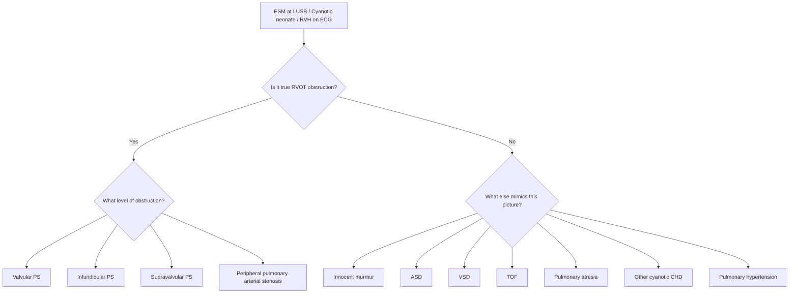
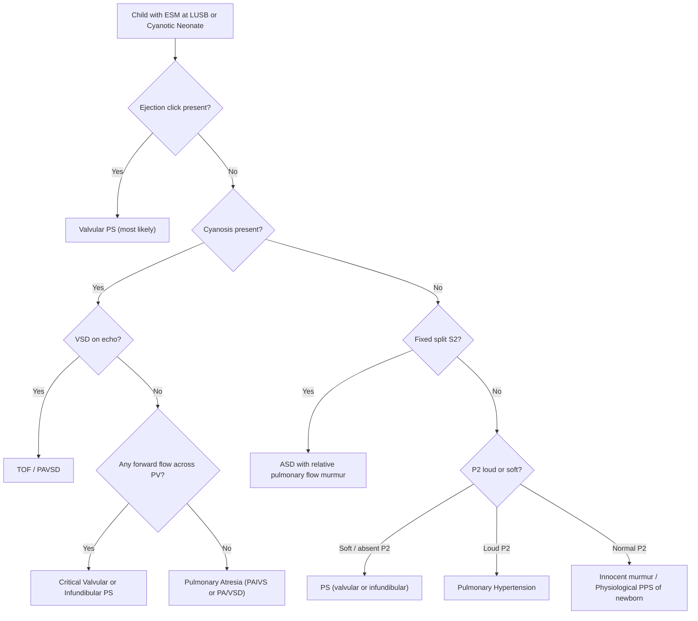

## Differential Diagnosis of Pulmonary Stenosis

When you encounter a child with a suspected RVOT obstruction — whether presenting as an ejection systolic murmur at the LUSB, neonatal cyanosis, or an incidental echocardiographic finding — you need a systematic framework to distinguish true pulmonary stenosis from its mimics. The differential depends heavily on the **clinical presentation scenario**: (A) the child with an ESM at the LUSB, (B) the cyanotic neonate, or (C) the child with RV hypertrophy on ECG/echo.

Let us work through this from first principles, always asking "what else could produce this clinical picture?"

---

### Conceptual Framework

The core haemodynamic signature of PS is **RV pressure overload** with or without reduced pulmonary blood flow. The differential therefore includes:

1. **Other causes of RVOT obstruction** (different anatomical levels, associated lesions)
2. **Conditions mimicking the murmur** (innocent murmurs, other structural lesions causing ESM at LUSB)
3. **Other causes of neonatal cyanosis with reduced pulmonary blood flow** (for critical PS)
4. **Other causes of RVH** (non-PS causes of RV pressure overload)

---

### A. Differential of an ESM at the Left Upper Sternal Border (LUSB)

This is the most common clinical scenario leading to consideration of PS. The LUSB (also called the "pulmonary area") is where flow across the pulmonary valve and RVOT is best auscultated. But several conditions produce murmurs heard here.

#### 1. Innocent (Physiological) Murmurs

| Feature | Detail |
|---|---|
| **Physiological peripheral PS of the newborn** | Very common in neonates; caused by the relatively small calibre and acute angulation of branch PAs relative to the MPA at birth. Produces a soft, short systolic murmur radiating to both axillae and the back. **Resolves by 3–6 months** as the branch PAs grow. Distinguished from pathological PPS by its transient nature and absence of RVH or post-stenotic dilation on echo. |
| **Still's murmur** | The most common innocent murmur in children (age 2–7 years). Musical, vibratory, low-pitched systolic murmur best heard at the **LLSB to apex** (not LUSB). Should not be confused with PS — location and quality differ. |
| **Pulmonary flow murmur of childhood** | Soft, blowing ESM at the LUSB in thin or high-cardiac-output children (fever, anaemia, anxiety). No thrill, no click, normal S2 splitting, normal ECG and CXR. Disappears when output normalises. |

> **Key discriminator**: Innocent murmurs are **≤ Grade 2/6**, have **no thrill**, **no click**, **normal S2**, **normal ECG**, and **normal CXR**. If any of these are abnormal, the murmur is likely pathological.

#### 2. Atrial Septal Defect (ASD)

- ***ASD produces an ESM at the LUSB due to increased flow across the pulmonary valve*** (not turbulence through the ASD itself — the ASD shunt is low-velocity and silent) [6]
- The hallmark is ***wide, fixed splitting of S2*** — the S2 split does not vary with respiration because the ASD equalises filling between the two atria regardless of respiratory phase
- **Why this mimics PS**: Both produce an ESM at LUSB and may show RVH on ECG. However:
  - ASD: **volume** overload of RV (dilated RV, not hypertrophied); **fixed split S2** with **normal P2 intensity**; **no ejection click**
  - PS: **pressure** overload of RV (hypertrophied, not dilated); **wide but not fixed split S2** with **soft/delayed P2**; **ejection click** in valvular PS
- CXR in ASD shows **cardiomegaly** (RA/RV dilation) and **pulmonary plethora** (increased pulmonary markings) — opposite to PS where heart size and lung markings are normal

#### 3. Ventricular Septal Defect (VSD)

- ***VSD typically produces a pansystolic murmur (PSM) at the LLSB*** [7], but:
  - A **subarterial (doubly committed) VSD** can produce a murmur at the **LUSB** that may mimic PS [7]
  - A **large VSD** with increased flow across the PV can produce a secondary **ESM at the LUSB** (relative pulmonary flow murmur) [7]
- Distinguishing features: PSM character (vs. crescendo-decrescendo ESM of PS), LV volume overload signs (displaced apex, MDM at apex from increased mitral flow), and pulmonary plethora on CXR

#### 4. Patent Ductus Arteriosus (PDA)

- ***PDA classically produces a continuous "machinery" murmur at the left infraclavicular area / LUSB*** [8]
- In the neonatal period (before PVR drops fully), PDA may produce only a **systolic murmur** that can mimic PS
- Distinguishing features: continuous murmur (extends through S2 into diastole), collapsing pulse, wide pulse pressure, LV volume overload

#### 5. Tetralogy of Fallot (TOF)

***TOF is a critical differential, particularly in the cyanotic infant with an ESM at the LUSB*** [3][9]:

- ***TOF involves: pulmonary stenosis (usually infundibular), RVH, overriding aorta, VSD*** [3]
- The ESM in TOF is due to the **PS component**, just as in isolated PS
- ***The main haemodynamic determinant in TOF is the degree of RVOT obstruction*** [3]
- **Key differences from isolated PS**:
  - TOF has a **VSD** → right-to-left shunting at ventricular level → cyanosis occurs without needing a PFO/ASD
  - ***Fallot's/Tet spells*** [3]: Transient near-occlusion of the RVOT with profound cyanosis; during a spell, the ***ESM paradoxically softens or disappears*** (less flow across RVOT) [3] — in isolated PS, the murmur does not behave this way
  - ***CXR shows boot-shaped heart (coeur en sabot)*** [9] due to RVH + small PA segment and uplifted apex — in isolated valvular PS, the PA segment is **prominent** (post-stenotic dilation), which is the opposite
  - ***Fallot's sign: squatting relieves cyanosis*** [3] by increasing SVR (reducing R-to-L shunt) and increasing venous return (increasing pulmonary flow)

<Callout title="TOF vs. Isolated Severe PS — Exam Favourite" type="idea">

| Feature | Isolated Valvular PS | TOF |
|---|---|---|
| VSD | Absent | Present (large, non-restrictive) |
| Cyanosis mechanism | R-to-L at atrial level (needs PFO/ASD) | R-to-L at ventricular level (through VSD) |
| PA segment on CXR | ***Prominent (post-stenotic dilation)*** [1] | ***Small/absent*** [9] |
| Heart shape on CXR | Normal | ***Boot-shaped*** [9] |
| Tet spells | No | ***Yes*** [3] |
| Ejection click | Present (valvular) | Usually absent (infundibular PS) |

</Callout>

---

### B. Differential of the Cyanotic Neonate with Reduced Pulmonary Blood Flow

When critical PS presents as neonatal cyanosis, the differential includes all causes of ***cardiac cyanosis with reduced pulmonary flow*** [5]:

> ***"Cardiac origins of central cyanosis — systemic venous blood bypassing the lung (right-to-left shunts) and reduced pulmonary flow (pulmonary outflow obstruction, pulmonary atresia)"*** [5]

#### 1. Pulmonary Atresia with Intact Ventricular Septum (PAIVS)

***PAIVS is the extreme end of the PS spectrum — complete obstruction (atresia) of the pulmonary outflow*** [10]:

- ***Imperforate PV or complete muscular obliteration of infundibulum*** [10]
- ***RV is hypertrophied and hypoplastic; tricuspid valve is small and incompetent*** [10]
- ***Obligatory R-to-L shunting via PFO; duct-dependent pulmonary circulation*** [10]
- ***Uniformly fatal if untreated (~50% die ≤ 2 weeks, 85% die < 6 months)*** [10]
- **How to distinguish from critical PS**: In PAIVS there is **no forward flow** across the PV at all (complete atresia), the RV may be severely hypoplastic, and ***there may be RV-dependent coronary circulation (RVDCC) via ventriculo-coronary fistulous communications*** [10] — this is absent in PS. Echo is definitive.
- On auscultation: ***Single S2 (no P2 at all); NO ESM across PV (no flow); PSM at LLSB from TR; soft continuous murmur from PDA*** [10]

#### 2. Tetralogy of Fallot with Severe PS or Pulmonary Atresia (TOF/PA)

- Severe TOF with near-atretic RVOT can present identically to critical PS in the neonatal period
- ***Duct-dependent pulmonary circulation*** in severe TOF [9]
- Distinguished by the presence of a **VSD** and **overriding aorta** on echocardiography

#### 3. Pulmonary Atresia with VSD (PAVSD)

- ***R-to-L shunt via VSD; ± aortopulmonary collaterals (MAPCAs) determine presentation*** [9]
- If collaterals are insufficient/stenosed → cyanosis and duct dependence, mimicking critical PS
- Distinguished by the VSD and potentially complex pulmonary arterial anatomy (MAPCAs)

#### 4. Tricuspid Atresia

- Complete absence of the tricuspid valve → no direct RV inflow → blood must reach the lungs via an ASD (obligatory R-to-L atrial shunt) and then via a VSD or PDA
- Presents with cyanosis; ECG classically shows **left axis deviation** and **LV dominance** (unusual in a cyanotic neonate — most cyanotic CHD shows RVH), which is a strong clue
- Distinguished from PS by the absent tricuspid valve on echo

#### 5. Ebstein Anomaly

- Apical displacement of the septal and posterior tricuspid valve leaflets into the RV → "atrialized" RV with functional RV hypoplasia + severe TR
- Presents with cyanosis (R-to-L shunting through PFO/ASD due to elevated RA pressure) + massive cardiomegaly on CXR
- ***Associated with Ebstein anomaly*** in the classification of cyanotic CHD [6]
- Distinguished from PS by the **massive RA dilation**, **characteristic TV displacement on echo**, and **WPW pattern on ECG** (accessory pathway in ~25%)

#### 6. Transposition of Great Arteries (TGA)

- ***Transposition haemodynamics*** [5]: The aorta arises from the RV and the PA from the LV → two parallel circuits with no effective mixing unless there is an ASD, VSD, or PDA
- Presents with severe cyanosis in the first hours of life, but this is due to **parallel circulations** rather than reduced pulmonary flow — pulmonary blood flow may actually be **increased**
- ***CXR shows "egg-on-a-string" appearance*** (narrow mediastinum due to superimposed great arteries) — very different from PS
- Distinguished by the arterial arrangement on echo

#### 7. Total Anomalous Pulmonary Venous Connection (TAPVC)

- ***Common mixing condition at venous/atrial level*** [5][6]
- All pulmonary veins drain anomalously into the systemic venous system → complete mixing → cyanosis
- If the venous drainage is **obstructed** (especially infradiaphragmatic type), presents as a neonatal emergency with severe cyanosis, pulmonary oedema, and a "white-out" on CXR
- Distinguished from PS because TAPVC has **pulmonary venous congestion** (plethoric/oedematous lungs) whereas PS has **oligaemic** lung fields

---

### C. Differential of RV Hypertrophy on ECG/Echo

If the presenting finding is RVH rather than a murmur, the differential broadens:

| Condition | Mechanism of RVH | Key Distinguishing Feature |
|---|---|---|
| **Valvular PS** | ***RV pressure overload*** [1] | Ejection click, post-stenotic PA dilation on CXR, ESM at LUSB |
| **Infundibular PS** | RV pressure overload | ***No ejection click, no post-stenotic dilation; a/w VSD, TOF*** [2] |
| **Peripheral PPS** | RV pressure overload | ***A/w rubella, Alagille, Williams; bilateral murmurs radiating to axillae*** [2] |
| ***Pulmonary hypertension*** | ↑PVR → RV pressure overload | Loud P2 (not soft!); causes include chronic lung disease, PPHN in neonates, Eisenmenger [11] |
| **Large ASD** | RV volume overload | Fixed split S2; pulmonary plethora; RA/RV dilation rather than hypertrophy |
| **TOF** | RV pressure overload from RVOT obstruction + VSD | Boot-shaped heart; VSD; cyanosis from ventricular-level shunting [3] |
| **Cor pulmonale** | Chronic lung disease → ↑PVR → RV failure | History of chronic respiratory disease; dilated PAs with peripheral pruning on CXR [11] |
| **Normal neonatal RV dominance** | Fetal physiology (RV is the dominant ventricle in utero) | Resolves by ~6 months; no pathological features |

<Callout title="Loud P2 vs. Soft P2 — The Critical Differentiator" type="error">
A common exam mistake is confusing PS with pulmonary hypertension. Both cause RVH and may present with exertional symptoms. However:
- **PS → soft/delayed/absent P2** (the stiff, stenotic valve closes poorly)
- **Pulmonary hypertension → loud, palpable P2** (the valve snaps shut forcefully against high PA pressure)

If you hear a loud P2, think pulmonary hypertension — NOT PS. This single finding can pivot your entire differential.
</Callout>

---

### D. Syndromic Associations — Narrowing the Differential

When PS is found in a syndromic child, the associated syndrome helps confirm the diagnosis and predict valve morphology:

| Syndrome | Type of PS | Associated Cardiac Lesions | Key Dysmorphic Features |
|---|---|---|---|
| ***Noonan syndrome*** [1][12] | ***Valvular PS with thick dysplastic cusps; peripheral branch PA stenosis*** | ***ASD, hypertrophic cardiomyopathy*** | ***Turner-like features, ptosis, downslanting palpebral fissures, low-set ears, hypertelorism, shield chest, cryptorchidism*** [12] |
| ***Williams syndrome*** [12] | ***Peripheral branch PA stenosis*** | ***Supravalvular AS, systemic/renal/coronary arterial stenosis*** | ***Elfin facies, full cheeks, flat nasal bridge, long philtrum, prominent lips, hypercalcaemia, intellectual disability*** [12] |
| ***Congenital rubella syndrome*** [2] | ***Peripheral PA stenosis*** | ***PDA*** | Sensorineural deafness, cataracts, microcephaly, "blueberry muffin" rash |
| ***Alagille syndrome*** [2] | ***Peripheral PA stenosis*** | — | Bile duct paucity (cholestasis), butterfly vertebrae, posterior embryotoxon (eye), characteristic facies (broad forehead, deep-set eyes, pointed chin) |
| ***DiGeorge syndrome (22q11.2 deletion)*** [12] | Not classical PS, but conotruncal anomalies | ***Interrupted aortic arch, truncus arteriosus, TOF, VSD*** | ***Abnormal facies, thymic hypo/aplasia, cleft palate, hypocalcaemia*** [12] |
| ***LEOPARD syndrome*** [4] | Valvular PS | Hypertrophic cardiomyopathy | Lentigines, ECG abnormalities, ocular hypertelorism, pulmonary stenosis, abnormal genitalia, retarded growth, deafness |

---

### E. Approach to Differentiating PS from Key Mimics — Summary Mermaid Diagram

---

### F. Summary Table: Key Differentials of Pulmonary Stenosis by Presentation

| Differential | Shared Feature with PS | Key Distinguishing Feature |
|---|---|---|
| Innocent pulmonary flow murmur | ESM at LUSB | ≤ Grade 2, no click, normal S2, normal ECG/CXR |
| Physiological PPS of newborn | ESM radiating to axillae/back | Resolves by 3–6 months; no RVH |
| ASD | ESM at LUSB, RV overload | Fixed split S2, normal P2, RV dilation (volume not pressure), pulmonary plethora |
| VSD (subarterial) | Murmur at LUSB | PSM character, LV volume overload, pulmonary plethora |
| PDA | Murmur at LUSB | Continuous murmur, wide pulse pressure, collapsing pulse |
| ***TOF*** [3] | ESM at LUSB, cyanosis, RVH | ***VSD, boot-shaped heart, small PA segment, Tet spells*** |
| ***PAIVS*** [10] | Neonatal cyanosis, duct-dependent | ***No forward PV flow, RV hypoplasia, ventriculo-coronary fistulae, single S2*** |
| TGA | Neonatal cyanosis | Egg-on-string CXR, parallel circulations, cyanosis out of proportion to respiratory distress |
| TAPVC (obstructed) | Neonatal cyanosis | Pulmonary oedema ("white-out" CXR), not oligaemic lungs |
| ***Pulmonary hypertension*** [11] | RVH, exertional symptoms | ***Loud P2*** (not soft); dilated PAs with peripheral pruning |
| Tricuspid atresia | Cyanosis, reduced pulmonary flow | Left axis deviation on ECG, absent TV on echo |
| Ebstein anomaly | Cyanosis, RV dysfunction | Massive cardiomegaly, displaced TV, WPW on ECG |

---

<Callout title="High Yield Summary — Differential Diagnosis of PS">

1. **ESM at LUSB differential**: Valvular PS (ejection click, soft P2), ASD (fixed split S2, normal P2), innocent murmur (Grade ≤ 2, normal everything), PDA (continuous), VSD (PSM at LLSB/LUSB)
2. **Cyanotic neonate with reduced pulmonary flow**: Critical PS, PAIVS (no forward PV flow), severe TOF (VSD, boot-shaped heart), PAVSD, tricuspid atresia (LAD on ECG)
3. **RVH differential**: PS vs. pulmonary hypertension — **soft P2 = PS; loud P2 = pHTN**
4. **TOF vs. isolated PS**: TOF has VSD, boot-shaped heart, small PA segment; PS has no VSD, prominent PA segment (post-stenotic dilation)
5. **PAIVS vs. critical PS**: PAIVS has complete atresia (no forward flow), RV hypoplasia, possible RVDCC; critical PS has a pinhole opening with some forward flow
6. **Syndromic clues**: Noonan → dysplastic valvular PS; Williams/Rubella/Alagille → peripheral PPS; LEOPARD → PS + lentigines

</Callout>

---

<ActiveRecallQuiz
  title="Active Recall - Differential Diagnosis of Pulmonary Stenosis"
  items={[
    {
      question: "A neonate presents with cyanosis and an ESM at the LUSB. CXR shows a boot-shaped heart with oligaemic lung fields. What is the most likely diagnosis and how does its CXR differ from isolated valvular PS?",
      markscheme: "Tetralogy of Fallot. TOF shows a boot-shaped heart with a SMALL or absent PA segment (due to RVOT obstruction and underfilled PA). Isolated valvular PS shows a PROMINENT PA segment (post-stenotic dilation) with normal heart size. Both have oligaemic lungs if severe."
    },
    {
      question: "How do you differentiate ASD from PS when both can produce an ESM at the LUSB and RV overload on ECG?",
      markscheme: "ASD: wide FIXED splitting of S2 (does not vary with respiration), normal P2 intensity, RV volume overload (dilation), pulmonary plethora on CXR, no ejection click. PS: wide but NOT fixed split S2, SOFT or delayed P2, RV pressure overload (hypertrophy), normal/oligaemic lung markings on CXR, ejection click present in valvular PS."
    },
    {
      question: "A child has RVH on ECG and exertional dyspnoea. P2 is loud and palpable. Is this likely PS or pulmonary hypertension, and why?",
      markscheme: "Pulmonary hypertension. In PS, P2 is soft, delayed, or absent because the stenotic valve leaflets cannot close with a normal snap. In pulmonary hypertension, high PA pressure causes the valve to slam shut forcefully, producing a loud, palpable P2. Loud P2 is the key differentiator."
    },
    {
      question: "Name three syndromes associated with peripheral pulmonary arterial stenosis and one distinguishing feature of each.",
      markscheme: "1. Congenital rubella syndrome - sensorineural deafness, cataracts, PDA. 2. Alagille syndrome - bile duct paucity causing cholestasis, butterfly vertebrae, posterior embryotoxon. 3. Williams syndrome - elfin facies, hypercalcaemia, supravalvular aortic stenosis, intellectual disability."
    },
    {
      question: "What clinical and echocardiographic features distinguish PAIVS from critical valvular PS in a cyanotic neonate?",
      markscheme: "PAIVS: Complete atresia with NO forward flow across PV on echo; RV is typically hypoplastic; possible ventriculo-coronary fistulae and RV-dependent coronary circulation; single S2 with no ESM; PSM from TR; LV dominance on ECG. Critical PS: Pinhole opening with SOME residual forward flow across PV on echo; RV may be hypertrophied but not necessarily hypoplastic; no coronary fistulae; faint ESM may be present."
    },
    {
      question: "An otherwise well 4-week-old has a soft grade 1-2 systolic murmur at the LUSB radiating to both axillae. No thrill, no click, normal S2, normal growth. ECG and CXR are normal. What is the most likely diagnosis?",
      markscheme: "Physiological peripheral pulmonary stenosis (PPS) of the newborn. This is an innocent murmur caused by the relatively small calibre and acute angulation of branch PAs at birth. It radiates bilaterally to the axillae and back. It resolves spontaneously by 3-6 months as the branch PAs grow. No investigation or follow-up is needed if ECG and CXR are normal."
    }
  ]}
/>

## References

[1] Senior notes: Adrian Lui Pediatrics.pdf (p206)
[2] Senior notes: Adrian Lui Pediatrics.pdf (p207)
[3] Senior notes: Ryan Ho Cardiology.pdf (p187)
[4] Senior notes: Ryan Ho Rheumatology.pdf (p185)
[5] Lecture slides: GC 147. Heart failure and cyanosis in children acyanotic and cyanotic congenital heart disease - Part 2.pdf (p8)
[6] Senior notes: Adrian Lui Pediatrics.pdf (p190)
[7] Senior notes: Ryan Ho Cardiology.pdf (p193)
[8] Senior notes: Ryan Ho Cardiology.pdf (p189)
[9] Senior notes: Adrian Lui Pediatrics.pdf (p232)
[10] Senior notes: Adrian Lui Pediatrics.pdf (p217)
[11] Senior notes: Ryan Ho Respiratory.pdf (p39, p138)
[12] Senior notes: Ryan Ho Cardiology.pdf (p185)
