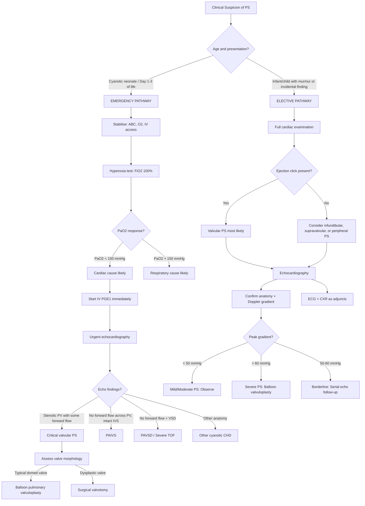

## Diagnostic Criteria, Diagnostic Algorithm, and Investigations for Pulmonary Stenosis

### Diagnostic Criteria

Unlike many medical conditions (e.g. rheumatic fever with Jones criteria, or Kawasaki disease), pulmonary stenosis does **not** have a formal set of published "diagnostic criteria" in the way a systemic disease does. Instead, the diagnosis is made by integrating **clinical features** with **echocardiographic confirmation**. Echocardiography is the **gold standard** — it establishes the diagnosis, defines the anatomical level of obstruction, quantifies severity, and guides management decisions.

However, we can operationally define the diagnostic framework:

#### Operational Diagnostic Requirements

| Component | What it Establishes |
|---|---|
| **1. Clinical suspicion** | Murmur (ESM at LUSB ± ejection click), neonatal cyanosis, or incidental finding |
| **2. Echocardiographic confirmation** | Anatomical level of obstruction (valvular/subvalvular/supravalvular/peripheral); valve morphology (typical domed vs. dysplastic); presence of associated lesions (PFO, ASD, VSD) |
| **3. Doppler-derived pressure gradient** | ***Estimation of systolic pressure gradient across PV*** [1] — this is the cornerstone for severity grading and treatment decisions |

#### Severity Grading (Doppler Echocardiography)

The severity of PS is graded by the **peak instantaneous pressure gradient** measured by continuous-wave (CW) Doppler across the pulmonary valve using the **modified Bernoulli equation**:

$$\Delta P = 4v^2$$

Where *v* = peak velocity of the jet across the stenotic valve (m/s), and ΔP = pressure gradient (mmHg).

| Severity | Peak Doppler Gradient | RV Systolic Pressure Relative to Systemic | Clinical Implication |
|---|---|---|---|
| **Trivial** | < 25 mmHg | < 1/3 systemic | No haemodynamic significance; no follow-up may be needed |
| **Mild** | 25–49 mmHg | 1/3–1/2 systemic | ***Usually asymptomatic; observe/no management*** [1] |
| **Moderate** | 50–64 mmHg | 1/2–3/4 systemic | ***Observe/no management in most; borderline for intervention*** [1] |
| **Severe** | > 64 mmHg | > 3/4 systemic (may exceed LV) | ***Balloon pulmonary valvuloplasty indicated (gradient > 60 mmHg)*** [1] |
| **Critical** | Near-atretic valve, minimal forward flow | Suprasystemic | ***Urgent PGE₁ + neonatal balloon valvuloplasty*** [1]; duct-dependent pulmonary circulation |

<Callout title="Why 60 mmHg?" type="idea">
The threshold of **> 60 mmHg** (some guidelines use > 50 mmHg with symptoms, or > 60 mmHg regardless of symptoms) corresponds to RV pressure approaching systemic levels. At this point, the RV is chronically subjected to near-systemic afterload, risking progressive RV dysfunction, myocardial fibrosis, arrhythmia, and exercise intolerance. Intervention below this threshold generally does not improve outcomes and exposes the child to procedural risk unnecessarily. ***Observe/no management in mild/moderate PS*** [1].
</Callout>

<Callout title="Gradient Pitfall in Critical PS" type="error">
In **critical PS** with very low cardiac output, the Doppler gradient may be **misleadingly low** — not because the stenosis is mild, but because there is so little flow across the valve that velocity (and therefore ΔP = 4v²) is low. Always correlate the gradient with **RV function**, **valve morphology**, and **clinical status**. A low gradient in a cyanotic, shocked neonate does NOT mean mild PS — it may mean critical PS with impending circulatory collapse.
</Callout>

---

### Diagnostic Algorithm

The following algorithm walks through the clinical approach from initial suspicion to definitive diagnosis and severity classification. The pathway differs based on whether the child presents as (A) a **cyanotic neonate** (emergency pathway) or (B) an **older infant/child with a murmur** (elective pathway).

---

### Investigation Modalities

#### 1. Echocardiography (Gold Standard)

Echocardiography is the **definitive diagnostic tool** for PS. It is non-invasive, radiation-free, portable (can be done at the bedside in NICU), and provides both anatomical and haemodynamic information in real-time. Let us break down exactly what echo tells you and why each finding matters.

##### 2D (Two-Dimensional) Echocardiography

| Finding | Explanation (First Principles) |
|---|---|
| ***Incomplete opening of PV cusps*** [1] | In typical valvular PS, the fused commissures prevent full leaflet excursion. On 2D echo, you see the valve leaflets "dome" towards the PA during systole — they bow forward like a parachute rather than opening flat. This doming pattern is **pathognomonic of valvular stenosis with commissural fusion** and predicts good response to balloon valvuloplasty (the balloon will split the fused commissures). |
| **Valve morphology: typical vs. dysplastic** | ***Dysplastic valves (Noonan syndrome) show thick, myxomatous, immobile cusps*** [1][12] with minimal commissural fusion and often a hypoplastic annulus. This distinction is crucial because ***dysplastic valves do not respond to balloon valvuloplasty → require surgical valvotomy*** [1]. |
| ***Post-stenotic dilatation of pulmonary trunk*** [1] | The turbulent jet exiting the stenotic valve impacts the wall of the MPA, causing localised dilation. Visible as an enlarged MPA on 2D echo. ***Not present in infundibular or supravalvular PS*** [1] — the turbulence pattern is different when the valve itself is normal. |
| **RV wall thickness** | RV free wall thickness > 5 mm in a child (age-dependent norms) indicates **RV hypertrophy** — the compensatory response to chronic pressure overload. Measured in the subcostal or parasternal short-axis view. |
| **RV cavity size** | In pressure overload (PS), the RV is **hypertrophied but not dilated** (concentric hypertrophy). This contrasts with volume overload (ASD) where the RV is **dilated but not necessarily hypertrophied**. |
| **IVS and associated defects** | Must assess for PFO, ASD, VSD to determine shunting pathways. In critical PS, identifying a PFO/ASD with R-to-L shunting explains the cyanosis mechanism. |
| **Infundibular anatomy** | Assess for subvalvular muscular obstruction (infundibular PS) — narrowing of the infundibulum by hypertrophied muscle bundles. Important to distinguish from valvular PS as management differs (***enlargement of RVOT by resecting muscle bundles ± transannular patch*** [2] rather than balloon valvuloplasty). |
| **Tricuspid valve** | Assess for TR (tricuspid regurgitation) — TR jet velocity allows estimation of RV systolic pressure via the modified Bernoulli equation: RVSP = 4(TR jet velocity)² + estimated RAP. This provides an independent measure of RV pressure load. |

##### Doppler Echocardiography

| Modality | What It Measures | Clinical Application |
|---|---|---|
| **Colour-flow Doppler** | Direction and turbulence of flow | ***Turbulent flow in pulmonary trunk*** [1] — appears as colour aliasing (mosaic pattern of red/blue/green) at and distal to the stenotic valve. Also identifies direction of shunt through PFO/ASD (R-to-L in critical PS). |
| **Continuous-wave (CW) Doppler** | Peak velocity across the stenosis | ***Estimation of systolic pressure gradient across PV*** [1] using ΔP = 4v². The CW Doppler beam is aligned parallel to the stenotic jet in the parasternal short-axis or subcostal views. Peak gradient is the primary metric for severity grading and intervention threshold. |
| **Pulsed-wave (PW) Doppler** | Velocity at a specific point | Useful for localising the exact level of obstruction — place the sample volume at different levels (below valve, at valve, above valve) to identify where the velocity step-up occurs. Also used for assessing diastolic function. |

<Callout title="Doppler Gradient vs. Catheter Gradient">
The Doppler-derived gradient is a **peak instantaneous gradient** (the maximum pressure difference at any single moment in systole). Cardiac catheterisation measures a **peak-to-peak gradient** (difference between peak RV pressure and peak PA pressure, which do NOT occur simultaneously). Therefore, Doppler gradients are typically **higher** than catheter gradients by approximately 10–15 mmHg. This is a common source of confusion in exams and clinical practice. Modern paediatric cardiology uses **Doppler gradients** as the standard for decision-making, with catheterisation reserved for intervention or discordant findings.
</Callout>

##### Echocardiographic Assessment in Special Scenarios

| Scenario | Key Echo Findings |
|---|---|
| **Critical PS (neonate)** | Near-atretic valve with minimal forward flow; severe RVH with poor RV function; PFO/ASD with R-to-L shunting; PDA providing pulmonary blood flow |
| **PAIVS** (differential, not PS) | ***Imperforate PV with no forward flow; RV hypoplasia; detect abnormal Rt ventriculo-coronary sinusoidal flow*** [10] |
| **Infundibular PS** | Muscular narrowing below a normal-appearing PV; velocity step-up at subvalvular level on PW Doppler |
| **Peripheral PPS** | Normal PV and infundibulum; turbulence and velocity step-up at branch PA level; may require CT/MRI for detailed branch PA anatomy |
| **Post-intervention follow-up** | Residual gradient, degree of pulmonary regurgitation (PR), RV function |

---

#### 2. Electrocardiography (ECG)

ECG is a first-line, widely available investigation that provides indirect evidence of the **haemodynamic burden** on the right heart. It does NOT diagnose PS directly, but supports the clinical assessment.

> **Paediatric ECG interpretation reminder**: Normal ECG patterns change dramatically with age. Neonates have physiological right axis deviation and RV dominance (because the RV is the dominant pumping chamber in utero). By 6 months, the LV normally becomes dominant. RVH must be judged against **age-appropriate norms**.

| Finding | Severity Correlation | Explanation (First Principles) |
|---|---|---|
| ***Normal ECG*** [1] | **Mild PS** | Minimal haemodynamic burden; the RV compensates easily without significant hypertrophy beyond normal for age |
| ***Right axis deviation (RAD)*** [1] | **Moderate/Severe PS** | The mean QRS axis shifts rightward (> +120° in children > 6 months) because the hypertrophied RV generates a larger electrical vector than the LV. In neonates, this must be interpreted cautiously as RAD is normal. |
| ***RV hypertrophy (RVH)*** [1] | **Moderate/Severe PS** | **Tall R waves in V1** (right precordial leads) exceeding age-appropriate upper limits; **deep S waves in V5–V6**. In severe PS, a **pure R wave in V1** (no S wave) with **qR pattern** suggests suprasystemic RV pressure. **RV strain pattern** (ST depression, T-wave inversion in right precordial leads) indicates severe, chronic pressure overload with subendocardial ischaemia. |
| ***RA enlargement (P pulmonale)*** [1] | **Moderate/Severe PS** | **Tall, peaked P waves > 2.5 mm in lead II** — the RA hypertrophies to overcome the stiff, hypertrophied RV with elevated RVEDP. The increased RA depolarisation voltage produces the tall P wave. |
| **LV dominance with paucity of RV forces** | ***PAIVS*** [10] (not PS) | In PAIVS, the RV is hypoplastic and generates minimal electrical force. The ECG paradoxically shows LV dominance in a cyanotic neonate — a strong diagnostic clue that helps differentiate PAIVS from critical valvular PS (which shows RVH). |

##### ECG Severity Correlation — A Practical Guide

| ECG Pattern | PS Severity | RV Pressure (Approximate) |
|---|---|---|
| Normal | Mild (gradient < 50 mmHg) | < 50% systemic |
| Mild RAD + slight RVH | Moderate (gradient 50–64 mmHg) | 50–75% systemic |
| Marked RAD + prominent RVH + P pulmonale | Severe (gradient > 64 mmHg) | > 75% systemic |
| RVH + RV strain (ST/T changes in V1–V3) | Very severe / Critical | Near-systemic or suprasystemic |

<Callout title="When to Worry About the ECG in PS" type="error">
If you see **RV strain pattern** (ST depression + T-wave inversion in V1–V3) in a child with PS, this indicates severe chronic pressure overload with **subendocardial ischaemia** — the hypertrophied RV myocardium outstrips its coronary blood supply. This child needs **urgent intervention** regardless of whether they are symptomatic.
</Callout>

---

#### 3. Chest X-Ray (CXR)

CXR is a simple, readily available investigation that provides useful supportive information, though it is **not diagnostic** on its own. Understanding the CXR findings requires linking back to the pathophysiology.

| Finding | Present In | Explanation (First Principles) |
|---|---|---|
| ***Prominent pulmonary knob (post-stenotic dilation)*** [1] | ***Valvular PS only*** [1] | The high-velocity turbulent jet exiting through the stenotic valve impacts the wall of the MPA, causing localised wall stress and dilation. This produces a prominent convexity at the left upper heart border (the "pulmonary knob" or "PA segment"). ***Not present in infundibular/supravalvular PS*** [1] because when the valve is normal, there is no focused jet impacting the MPA wall in the same way. |
| ***Normal heart size*** [1] | Mild–Severe PS | RV **pressure** overload causes concentric hypertrophy (the wall thickens but the chamber does not dilate). Therefore, the cardiac silhouette remains normal in size. This contrasts sharply with RV **volume** overload (e.g., ASD) where the RV dilates and the heart enlarges. |
| ***Normal pulmonary vascular markings*** [1] | Mild–Moderate PS | Pulmonary blood flow is maintained because the RV compensates by generating higher pressure. The lung fields appear normal. |
| **Oligaemic (decreased) pulmonary vascular markings** | Critical/Very severe PS | When the stenosis is so severe that RV output to the lungs is significantly reduced, the pulmonary arteries are underfilled → the lung fields appear dark and "oligaemic" with sparse vascular markings. |
| **Uptilted cardiac apex ("boot-shaped heart")** | Severe PS with marked RVH; ***classically TOF*** [3] | The hypertrophied RV lifts the apex off the diaphragm. While classically described in TOF, any condition with marked RVH can produce this appearance. ***In PS, the heart size is typically normal in mild-moderate*** [1], and the boot shape is more characteristic when combined with a small/absent PA segment (as in TOF). |
| **Cardiomegaly** | Critical PS with RV failure or significant TR | If the RV fails and dilates, or if significant TR causes RA/RV dilation, the heart enlarges. In ***PAIVS, grossly enlarged RA/RV due to TR*** [10] can cause massive cardiomegaly. |

##### CXR Comparison: PS vs. Key Differentials

| Condition | Heart Size | PA Segment | Lung Fields |
|---|---|---|---|
| **Valvular PS (mild/moderate)** | ***Normal*** [1] | ***Prominent (post-stenotic dilation)*** [1] | ***Normal*** [1] |
| **Critical PS** | Normal or enlarged | Prominent or normal | Oligaemic |
| **TOF** | Normal | ***Small/absent*** [3] | ***Oligaemic*** [3] |
| **PAIVS** | ***Enlarged (RA dilation)*** [10] | Small/absent | ***Diminished*** [10] |
| **ASD** | Enlarged (RV dilation) | Prominent (↑flow) | Plethoric |
| **VSD (large)** | ***Enlarged (LV dilation)*** [7] | Prominent (↑flow) | ***Plethoric*** [7] |

<Callout title="CXR Pearl: Prominent PA Segment + Normal Heart Size = Valvular PS">
This is a classic radiographic pattern. The prominent PA knob from post-stenotic dilation combined with a normal-sized heart (because RV hypertrophy does not dilate the chamber) is highly suggestive of **isolated valvular PS**. If you see a prominent PA segment with cardiomegaly, think of **ASD** (volume overload) or **large VSD/PDA** instead.
</Callout>

---

#### 4. Hyperoxia Test (Nitrogen Washout Test)

This is specifically for the **cyanotic neonate** when the differential includes cardiac vs. respiratory cause of cyanosis.

**Principle**: Administer 100% FiO₂ for 10 minutes and measure post-ductal PaO₂ (from right radial or umbilical artery).

| Result | Interpretation | Mechanism |
|---|---|---|
| PaO₂ > 150 mmHg (often > 200 mmHg) | Respiratory cause of cyanosis | Supplemental O₂ corrects V/Q mismatch; alveolar O₂ diffuses across healthy pulmonary capillary bed |
| PaO₂ < 100 mmHg (often < 50 mmHg) | ***Cardiac cause likely (fixed R-to-L shunt)*** | Deoxygenated blood bypasses the lungs entirely through an intracardiac shunt; no amount of alveolar O₂ can oxygenate blood that never reaches the lungs |
| PaO₂ 100–150 mmHg | Equivocal; consider mixing lesions, persistent pulmonary hypertension of the newborn (PPHN) | Partial mixing or variable shunting |

> In **critical PS with R-to-L atrial shunting**, the PaO₂ will remain low (< 100 mmHg) because the deoxygenated blood is shunting right-to-left at the atrial level, bypassing the lungs. This is a **fixed shunt** that does not respond to supplemental oxygen — the defining feature of **cardiac cyanosis** [5].

**Practical note**: If the hyperoxia test suggests cardiac cyanosis, ***start IV PGE₁ immediately*** [1] (do not wait for echo confirmation) and arrange **urgent echocardiography**.

---

#### 5. Pulse Oximetry Screening (Newborn)

- **Pre-ductal** (right hand) and **post-ductal** (either foot) pulse oximetry is now part of routine newborn screening in many centres including Hong Kong
- A **positive screen** (SpO₂ < 95% in either limb, or > 3% difference between pre- and post-ductal) prompts urgent echocardiography
- In **critical PS with R-to-L atrial shunting**, both pre- and post-ductal SpO₂ will be low (the shunt is at the atrial level, proximal to the ductus), so there may NOT be a significant pre-post-ductal difference — unlike conditions like CoA or interrupted aortic arch where differential cyanosis occurs
- Sensitivity of pulse oximetry screening for critical PS is variable (it may miss mild-moderate PS entirely, as these children are not hypoxaemic)

---

#### 6. Cardiac Catheterisation

In the modern era, cardiac catheterisation is **not primarily diagnostic** for PS — echocardiography has largely replaced it. However, catheterisation is performed in two specific contexts:

##### A. Interventional Catheterisation (Therapeutic)

- ***Balloon pulmonary valvuloplasty (BPV)*** [1] is performed **during catheterisation** — the diagnostic and therapeutic procedure are combined
- A balloon-tipped catheter is advanced from the femoral vein → IVC → RA → RV → across the stenotic PV → inflated to split fused commissures
- Simultaneous pressure measurements confirm the gradient (RV pressure vs. PA pressure) and demonstrate the reduction in gradient post-dilation

##### B. Diagnostic Catheterisation (Specific Indications)

| Indication | Rationale |
|---|---|
| **Discordant echo/clinical findings** | When echo gradient does not match clinical severity (e.g., very symptomatic child with apparently moderate gradient) |
| **Complex anatomy** | Multi-level obstruction, peripheral PPS requiring detailed branch PA anatomy mapping |
| **Assessment of coronary anatomy in PAIVS** | ***Detect abnormal Rt ventriculo-coronary sinusoidal flow*** [10] — critical for surgical planning, as decompression of a hypertensive RV in PAIVS with RVDCC can cause fatal coronary steal |
| **Pre-operative assessment** | Before complex surgical repair (e.g., TOF with multiple levels of obstruction) |

##### Catheterisation Measurements

| Parameter | What It Tells You |
|---|---|
| **RV systolic pressure** | Direct measurement of RV pressure load; in severe PS, ***RV systolic pressure may exceed that of LV*** [1] |
| **PA pressure** | Confirms low PA pressure distal to the stenosis (distinguishes PS from pulmonary hypertension, where PA pressure is high) |
| **Peak-to-peak gradient** | Difference between peak RV and peak PA pressures (note: lower than Doppler peak instantaneous gradient by ~10–15 mmHg) |
| **RV angiography** | Demonstrates valve morphology (doming), level of obstruction, RV size, infundibular anatomy |
| **Coronary angiography** | In PAIVS, to delineate ventriculo-coronary fistulae and assess for coronary stenosis (RVDCC) |
| **Oxygen saturations** | Detect R-to-L shunting at atrial level (step-down in LA saturation); calculate Qp:Qs |

---

#### 7. Cardiac MRI (CMR) and CT Angiography

These are **adjunctive** investigations, not first-line for isolated PS, but valuable in specific situations:

| Modality | Indication | What It Adds |
|---|---|---|
| **Cardiac MRI** | Complex anatomy (TOF, PAVSD); quantification of RV volumes and function; assessment of PR (post-intervention); ***branch PA stenosis (PPS) detailed anatomy*** [2] | Gold standard for RV volumetric assessment; quantifies regurgitant fraction post-intervention; 3D reconstruction of PA anatomy |
| **CT angiography** | Peripheral PPS anatomy; aortopulmonary collaterals (MAPCAs in PAVSD); coronary anatomy when MRI is not feasible | Excellent spatial resolution for branch PA anatomy; fast acquisition (useful in young children who cannot tolerate long MRI); radiation exposure is a limitation in paediatrics |

> **Paediatric consideration**: MRI in young children ( < 6–7 years) typically requires **general anaesthesia or deep sedation** due to the long scan time and need for immobility. This adds procedural risk and resource requirements. CT is faster but involves ionising radiation. The decision between MRI and CT is made case-by-case, weighing anatomy complexity, child's age/cooperation, and available expertise.

---

#### 8. Blood Tests (Supportive, Not Diagnostic)

Blood tests do not diagnose PS but are essential in the **acute management** of critical PS:

| Test | Relevance |
|---|---|
| **Arterial blood gas (ABG)** | Critical PS: severe metabolic acidosis (lactic acidosis from tissue hypoxia) + hypoxaemia; guides resuscitation |
| **Lactate** | Elevated in critical PS with shock — reflects tissue hypoperfusion |
| **Full blood count (FBC)** | Chronic cyanosis → secondary polycythaemia (erythropoietin-driven ↑RBC production to improve O₂-carrying capacity); may see elevated Hb/Hct |
| **Renal function, electrolytes** | Assess for end-organ damage in critical PS with shock |
| **Genetic testing** | If syndromic features present (e.g., ***Noonan syndrome — RASopathy gene panel including PTPN11, SOS1, RAF1, KRAS*** [12][4]; Williams syndrome — FISH or microarray for 7q11.23 deletion; Alagille — JAG1/NOTCH2 sequencing) |

---

### Summary: Investigation Algorithm by Clinical Scenario

| Scenario | First-Line | Key Findings | Additional Investigations |
|---|---|---|---|
| **Cyanotic neonate (suspected critical PS)** | Hyperoxia test → PGE₁ → urgent echo | Low PaO₂; near-atretic valve; R-to-L atrial shunt; PDA | ABG (acidosis), lactate, pre/post-ductal SpO₂; CXR + ECG as adjuncts; catheterisation for intervention |
| **Infant/child with ESM at LUSB** | Echocardiography | Domed valve, post-stenotic dilation, Doppler gradient | ECG (RVH?), CXR (PA knob?); if mild → observe; if severe → refer for BPV |
| **Suspected peripheral PPS** | Echocardiography | Branch PA turbulence; normal PV | CT angiography or cardiac MRI for detailed branch PA anatomy; ***repeated balloon angioplasty ± stenting*** [2] |
| **Syndromic child (e.g., Noonan)** | Echocardiography + genetic testing | ***Thick dysplastic valve cusps*** [12]; may be associated with HCM | Genetic panel; surgical planning (not BPV) |

---

<Callout title="High Yield Summary — Diagnosis of Pulmonary Stenosis">

1. **Gold standard**: Echocardiography — confirms anatomy, valve morphology, Doppler gradient, associated defects
2. **Modified Bernoulli equation**: ΔP = 4v² — cornerstone of non-invasive severity grading
3. **Severity thresholds**: Mild < 50 mmHg (observe); Severe > 60 mmHg (BPV); Critical = near-atretic, duct-dependent (urgent PGE₁ + BPV)
4. **Typical vs. dysplastic valve**: Echo morphology determines balloon vs. surgery — dysplastic valves (Noonan) do not respond to BPV
5. **CXR triad of valvular PS**: Prominent PA knob + normal heart size + normal lung markings
6. **ECG correlation**: Normal in mild; RAD + RVH + P pulmonale in severe; RV strain = urgent intervention
7. **Post-stenotic dilation**: Present ONLY in valvular PS (not infundibular/supravalvular)
8. **Hyperoxia test**: In cyanotic neonates — PaO₂ < 100 mmHg = cardiac cause → start PGE₁ before echo
9. **Catheterisation**: Now primarily therapeutic (BPV); diagnostic role limited to complex anatomy, discordant findings, or coronary assessment in PAIVS
10. **Beware low gradient in critical PS**: Low flow → low velocity → falsely low gradient; always correlate with clinical status

</Callout>

---

<ActiveRecallQuiz
  title="Active Recall - Diagnosis of Pulmonary Stenosis"
  items={[
    {
      question: "A child with PS has a Doppler peak velocity of 4 m/s across the pulmonary valve. Calculate the peak instantaneous gradient and classify the severity.",
      markscheme: "Gradient = 4v-squared = 4 x 16 = 64 mmHg. This is SEVERE PS (greater than 60 mmHg). Balloon pulmonary valvuloplasty is indicated."
    },
    {
      question: "Why might the Doppler gradient in critical PS be misleadingly low, and how would you avoid this diagnostic pitfall?",
      markscheme: "In critical PS with very low cardiac output, minimal flow crosses the valve, so the jet velocity is low and the calculated gradient (4v-squared) underestimates the true severity. To avoid this, correlate the gradient with RV function, valve morphology on 2D echo, clinical status (cyanosis, shock), and presence of duct-dependent circulation. A low gradient in a cyanotic neonate does NOT mean mild PS."
    },
    {
      question: "On CXR, what combination of findings is characteristic of isolated valvular PS, and why is post-stenotic dilation absent in infundibular PS?",
      markscheme: "Valvular PS CXR: prominent pulmonary knob (post-stenotic dilation) with normal heart size and normal lung markings. Post-stenotic dilation is absent in infundibular PS because the valve itself is normal; the obstruction is below the valve, so there is no high-velocity jet directly impacting the MPA wall to cause turbulence-related dilation."
    },
    {
      question: "A cyanotic neonate has a PaO2 of 45 mmHg on 100% FiO2 (hyperoxia test). What does this indicate, and what is the immediate management before echocardiography?",
      markscheme: "PaO2 less than 100 mmHg on 100% FiO2 indicates a fixed right-to-left cardiac shunt (cardiac cause of cyanosis). Immediate management: start IV prostaglandin E1 (PGE1/alprostadil) to maintain ductal patency and ensure pulmonary blood flow. Do NOT wait for echo confirmation."
    },
    {
      question: "On ECG, how do you distinguish critical valvular PS from PAIVS in a cyanotic neonate?",
      markscheme: "Critical valvular PS: ECG shows RV hypertrophy (tall R in V1) and RA enlargement (P pulmonale) because the RV is hypertrophied from pressure overload. PAIVS: ECG shows LV dominance with paucity of RV forces because the RV is hypoplastic/atrophic. LV dominance on ECG in a cyanotic neonate is a strong clue for PAIVS rather than critical PS."
    },
    {
      question: "In what specific clinical scenario is cardiac catheterisation still used diagnostically rather than therapeutically in the context of PS or related conditions?",
      markscheme: "Key scenarios: (1) Discordant echo and clinical findings where severity is uncertain. (2) Complex multi-level obstruction requiring detailed anatomy. (3) PAIVS - to detect ventriculo-coronary fistulae and assess for RV-dependent coronary circulation (RVDCC), which is critical for surgical planning as RV decompression in RVDCC can cause fatal coronary steal."
    }
  ]}
/>

## References

[1] Senior notes: Adrian Lui Pediatrics.pdf (p206)
[2] Senior notes: Adrian Lui Pediatrics.pdf (p207)
[3] Senior notes: Ryan Ho Cardiology.pdf (p187)
[4] Senior notes: Ryan Ho Rheumatology.pdf (p172)
[5] Lecture slides: GC 147. Heart failure and cyanosis in children acyanotic and cyanotic congenital heart disease - Part 2.pdf (p8)
[7] Senior notes: Ryan Ho Cardiology.pdf (p193)
[10] Senior notes: Adrian Lui Pediatrics.pdf (p217)
[12] Senior notes: Ryan Ho Cardiology.pdf (p185)
