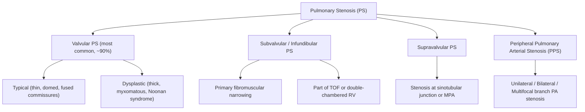
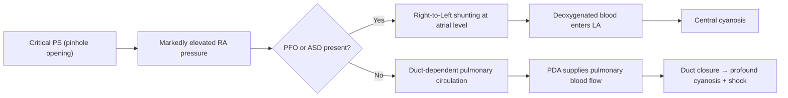

# Pulmonary Stenosis in Children

## Definition

Pulmonary stenosis (PS) refers to obstruction of the right ventricular outflow tract (RVOT) at, below, or above the level of the pulmonary valve, resulting in impeded blood flow from the right ventricle (RV) to the pulmonary arterial circulation. Breaking down the name: "pulmonary" = relating to the lungs/pulmonary artery; "stenosis" (Greek *stenōsis*) = narrowing.

In the paediatric context, PS is almost always congenital in origin. It ranges from trivial (haemodynamically insignificant) to **critical PS** (a neonatal emergency with duct-dependent pulmonary circulation).

---

## Epidemiology

- ***Valvular PS accounts for 7.5–12% of all congenital heart disease (CHD), making it the 2nd most common CHD*** [1][2]
- Incidence: ***0.6–0.8 per 1,000 live births*** [1]
- Male-to-female ratio approximately 1:1 (no significant sex predilection for isolated valvular PS)
- ***Frequently under-reported because mild PS is often asymptomatic and therefore not picked up*** [1] — many children with mild PS are only detected incidentally during routine examinations or echocardiography for other reasons
- In Hong Kong, where universal neonatal screening and paediatric cardiac services are well-established, mild PS may still be missed if there is no audible murmur at the well-baby check
- **Critical PS** (neonatal presentation) represents the severe end of the spectrum, accounting for a small but clinically important subset

### Risk Factors and Associations

| Factor | Detail |
|---|---|
| ***Noonan syndrome*** | ***Associated with thick and dysplastic pulmonary valve leaflets*** [1]; autosomal dominant RASopathy (RAS-MAPK pathway); classic facies, short stature, cryptorchidism, bleeding diathesis |
| ***Congenital rubella syndrome*** | Associated with ***peripheral pulmonary arterial stenosis (PPS)*** [2] |
| ***Alagille syndrome*** | Bile duct paucity + PPS (JAG1/NOTCH2 mutations) [2] |
| ***Williams syndrome*** | Supravalvular aortic stenosis classically, but also ***PPS*** [2]; elastin gene deletion (7q11.23) |
| Tetralogy of Fallot (TOF) | Infundibular PS is a cardinal feature [3] |
| ***LEOPARD syndrome*** | Mnemonic: **L**entigo, **E**CG abnormalities, **O**cular hypertelorism, **P**ulmonary stenosis, **A**bnormal genitalia, **R**etarded growth, **D**eafness [4] |
| Familial/sporadic | Most isolated valvular PS is sporadic; rare familial clustering |

<Callout title="High Yield Association" type="idea">
If you see PS + Noonan syndrome on an exam, think **dysplastic valve** → poor response to balloon valvuloplasty → will need **surgical valvotomy**. This is a classic exam discriminator.
</Callout>

---

## Anatomy and Function

### Normal Pulmonary Valve and RVOT Anatomy

To understand PS, you must understand the normal anatomy of the RVOT:

1. **Infundibulum (conus arteriosus)**: The muscular sub-pulmonary region of the RV that funnels blood toward the pulmonary valve. It is entirely muscular (unlike the LV outflow tract, which has fibrous continuity with the mitral valve).

2. **Pulmonary valve (PV)**: A semilunar valve with **three thin, pliable cusps** (right, left, and anterior) sitting at the junction of the RV infundibulum and the main pulmonary artery (MPA). In systole, the cusps open widely and fully; in diastole, they coapt to prevent regurgitation.

3. **Pulmonary valve annulus**: The fibrous ring supporting the valve cusps. In PS, this may be hypoplastic.

4. **Main pulmonary artery (MPA)**: Arises from the PV annulus and bifurcates into right and left pulmonary arteries (branch PAs).

5. **Sinotubular junction**: The junction between the pulmonary sinuses and the MPA trunk — supravalvular stenosis occurs here.

### Normal Physiology

- RV systolic pressure in a normal child: **~25 mmHg** (about 1/4 to 1/5 of LV systolic pressure)
- The RV is a thin-walled, compliant, low-pressure chamber designed to pump blood through the low-resistance pulmonary vascular bed
- The pulmonary valve opens when RV pressure exceeds PA pressure (normally very low gradient, < 10 mmHg)
- Normal P2 (pulmonary component of S2) is softer than A2 and occurs slightly after A2 (physiological splitting of S2 widens with inspiration in children)

---

## Aetiology and Classification

PS is classified by the **anatomical level of obstruction**:

### 1. Valvular PS (Most Common)

***The valve leaflets are the site of obstruction.*** [1]

**Typical valvular PS:**
- The three cusps are thin but **fused at the commissures** (partially or completely), forming a dome-shaped membrane with a central or eccentric orifice
- The valve "domes" during systole instead of opening widely — this doming is visible on echocardiography
- The valve tissue itself is relatively normal — this is why it **responds well to balloon valvuloplasty**

**Dysplastic valvular PS:**
- ***Associated with Noonan syndrome*** [1]
- The cusps are ***thick, myxomatous, and immobile*** with little commissural fusion
- The annulus itself may be hypoplastic
- ***Does NOT respond well to balloon valvuloplasty*** → requires **surgical valvotomy** [1]

### 2. Infundibular (Subvalvular) PS

***Caused by primary fibromuscular narrowing below the pulmonary valve*** [2]

- ***Uncommon in isolation → often associated with other CHD: VSD, double-chambered RV, as part of TOF*** [2]
- In TOF, the infundibular narrowing is the ***most common level of obstruction*** [3] — caused by anterocephalad deviation of the outlet (conal/infundibular) septum
- **Double-chambered RV**: Anomalous muscle bundles divide the RV cavity into a high-pressure proximal chamber and a low-pressure distal (infundibular) chamber
- ***Clinical features: similar to valvular PS, but NO ejection click and NO soft P2; different murmur radiation*** [2]

### 3. Supravalvular PS

- Stenosis at or above the sinotubular junction of the MPA
- Less common; can be seen in TOF (stenosis at the sinotubular ridge) [3]
- Also associated with Williams syndrome, Noonan syndrome, or post-surgical

### 4. Peripheral Pulmonary Arterial Stenosis (PPS)

***Associated with: congenital rubella syndrome, Alagille syndrome, Williams syndrome, TOF*** [2]

- ***Anatomy: can be unilateral, bilateral, or multifocal (including PA branch take-offs)*** [2]
- ***Clinical features: similar to valvular PS, but NO ejection click, NO soft P2, and different murmur radiation*** [2]
- A physiological variant of mild PPS (causing a soft systolic murmur) is common in newborns and resolves by 3–6 months as the branch PAs grow — this is the **"physiological peripheral PS of the newborn"** (innocent murmur)
- ***Management: repeated balloon angioplasty ± stenting for stenotic arteries*** [2]

<Callout title="Exam Discriminator: Ejection Click" type="idea">
An **ejection click** at the upper left sternal border (ULSB) is heard **only in valvular PS** — it is caused by the sudden halting of the domed valve leaflets at maximal excursion. The click is **absent** in infundibular, supravalvular, and peripheral PS because the valve itself is normal at those levels. This is a classic auscultatory distinguishing feature.
</Callout>

---

## Pathophysiology

The fundamental haemodynamic consequence of PS is ***RV pressure overload*** [1]. Let us trace through the pathophysiology systematically from first principles:

### Step-by-Step Haemodynamic Chain

**1. Obstruction → Increased RV Systolic Pressure**

- The narrowed RVOT creates resistance to forward flow
- To maintain cardiac output through the stenotic orifice, the RV must generate higher systolic pressures
- By the Bernoulli principle, the pressure gradient across the stenosis (ΔP) is proportional to the square of flow velocity: ΔP = 4v² (simplified Bernoulli equation used in Doppler echocardiography)
- ***In severe PS, RV systolic pressure may even exceed that of the LV*** [1]

**2. RV Hypertrophy (RVH)**

- ***RVH develops as a compensatory response to chronic pressure overload*** [1]
- The RV myocardium thickens (concentric hypertrophy) to normalise wall stress (Laplace's law: wall stress = Pressure × Radius / 2 × Wall thickness)
- The hypertrophied RV is stiffer (reduced compliance) → impaired diastolic filling

**3. Elevated RV End-Diastolic Pressure (RVEDP) → Right Atrial Hypertrophy (RAH)**

- ***↑RVEDP → back-pressure transmitted to the RA*** [1]
- RA dilates and hypertrophies to overcome the increased downstream pressure
- This is reflected on ECG as **right atrial enlargement (P pulmonale: tall, peaked P waves > 2.5 mm in lead II)**

**4. Post-Stenotic Dilation of the Pulmonary Trunk**

- ***Post-stenotic dilation of the MPA occurs due to turbulent blood flow*** [1] distal to the stenotic valve
- The jet of blood through the narrow orifice impacts the wall of the MPA, causing localised dilation (a "Venturi effect" analogy — though more accurately, it is turbulence-related wall stress)
- ***This post-stenotic dilation is visible on CXR as a prominent pulmonary knob*** [1]
- ***Crucially, post-stenotic dilation is NOT present in infundibular or supravalvular PS*** [1] — because the valve itself is normal and the turbulence pattern is different

**5. Critical PS: Cyanosis Pathway**

***Critical PS occurs when there is a pinhole opening of the pulmonary valve*** [1]:

- ***In critical PS with PFO or ASD: ↑↑↑RA pressure → right-to-left shunting via PFO or ASD → cyanosis*** [1]
- ***In critical PS without PFO/ASD: duct-dependent pulmonary circulation occurs*** [1] — the PDA is the sole source of pulmonary blood flow. When the duct closes (typically within hours to days of birth), the infant develops profound hypoxaemia and cardiovascular collapse

> ***This links to the lecture concept: "Cardiac origins of central cyanosis — systemic venous blood bypassing the lung (right-to-left shunts) and reduced pulmonary flow (pulmonary outflow obstruction, pulmonary atresia)"*** [5]

### Severity Classification by Pressure Gradient

| Severity | Peak Systolic Gradient (Doppler) | RV Pressure | Haemodynamic Consequence |
|---|---|---|---|
| Trivial/Mild | < 36 mmHg | < 50% systemic | Usually none; well-compensated |
| Moderate | 36–64 mmHg | 50–75% systemic | Progressive RVH; usually asymptomatic |
| Severe | > 64 mmHg | > 75% systemic (may exceed LV) | Significant RVH; risk of RV failure; exercise limitation |
| Critical | Near-atretic valve | Suprasystemic | Duct-dependent ± cyanosis; neonatal emergency |

<Callout title="Why > 60 mmHg is the Threshold for Intervention" type="idea">
A gradient > 60 mmHg corresponds to RV pressure approaching systemic levels. At this point, the RV is chronically working against near-systemic afterload, risking irreversible RV dysfunction, arrhythmias, and exercise intolerance. This is why ***balloon pulmonary valvuloplasty (BPV) is indicated when gradient > 60 mmHg*** [1].
</Callout>

### Relationship Between PS Severity and Pulmonary Flow / Cyanosis

This concept is beautifully illustrated in univentricular hearts with PS but applies broadly [1][5]:

- ***↑↑ Pulmonary stenosis → ↓↓ pulmonary flow → predominant cyanosis with minimal heart failure*** [1]
- ***Moderate pulmonary stenosis → balanced haemodynamics*** [1]
- ***↓↓ Pulmonary stenosis → ↑↑ pulmonary flow → mild cyanosis with congestive heart failure*** [1]

In isolated PS without intracardiac shunts, cyanosis only occurs when RA pressure is high enough to shunt right-to-left through a PFO/ASD (i.e., critical or severe PS).

---

## Clinical Features

### Symptoms

| Symptom | Pathophysiological Basis |
|---|---|
| ***Usually asymptomatic in the majority (even with moderate/severe PS)*** [1] | The RV compensates well with hypertrophy; the low-resistance pulmonary bed means even moderate obstruction may be well-tolerated for years |
| ***Cyanosis in critical PS*** [1] | Right-to-left shunting at atrial level (via PFO/ASD) when RA pressure exceeds LA pressure; or duct-dependent pulmonary flow with inadequate PDA flow |
| Exertional dyspnoea / exercise intolerance | In severe PS, the RV cannot augment cardiac output during exercise because the fixed stenosis limits forward flow; exercise → ↑HR → shorter diastolic filling → ↓stroke volume |
| Fatigue and failure to thrive | Chronically reduced cardiac output in severe PS; increased metabolic demands of a hypertrophied RV |
| Syncope / pre-syncope on exertion | In severe PS, exercise-induced ↓cardiac output → cerebral hypoperfusion; also possible exertional right-to-left shunting if PFO present |
| Peripheral oedema, hepatomegaly, ascites (rare, late) | RV failure → elevated systemic venous pressure → third-space fluid accumulation (same mechanism as adult right heart failure) |
| Rapid clinical deterioration after ductal closure in critical PS | ***Duct-dependent pulmonary circulation*** [1] — once PDA closes, there is no pathway for blood to reach the lungs → profound hypoxaemia, metabolic acidosis, shock |

<Callout title="Critical PS is a Neonatal Emergency" type="error">
Critical PS presenting in the first days of life must be immediately recognised. If the duct closes, these neonates deteriorate rapidly with severe cyanosis, metabolic acidosis, and circulatory collapse. ***Urgent PGE₁ (prostaglandin E₁ / alprostadil) infusion is life-saving*** [1] — it reopens and maintains the ductus arteriosus, restoring pulmonary blood flow until definitive intervention.
</Callout>

### Signs

The clinical signs of PS are elegantly related to the severity and level of obstruction:

#### Auscultation — The Core of PS Clinical Examination

**1. Ejection Click (EC)**

- ***Present in valvular PS; absent in infundibular/supravalvular/peripheral PS*** [1][2]
- Heard best at the **upper left sternal border (ULSB/LUSB)** in early systole
- Mechanism: The domed, fused valve cusps suddenly halt at their maximal excursion during RV ejection, producing a brief high-frequency sound
- **Timing clue**: The EC becomes **softer with inspiration** in PS (because increased venous return partially opens the valve during diastole, so there is less abrupt excursion in systole) — opposite to aortic EC which does not vary with respiration
- In severe PS, the EC may merge with S1 and become inaudible

**2. Ejection Systolic Murmur (ESM)**

- ***ESM at the left upper sternal border (LUSB)*** [1]
- Crescendo-decrescendo ("diamond-shaped") murmur caused by turbulent flow across the stenotic orifice
- Radiates to the back (left infraclavicular area) and to the lung fields
- **Severity correlation**:
  - Mild PS: short, early-peaking ESM
  - Severe PS: longer, later-peaking ESM (delayed peak because it takes longer for the RV to generate enough pressure to push blood through the tight stenosis)
  - ***In Tet spells (TOF context): increasing obstruction → decreasing murmur*** [3] — because less blood flows across the RVOT; more is shunted right-to-left through the VSD

**3. Second Heart Sound (S2) — Specifically P2**

- P2 (pulmonary valve closure sound) is generated by the snap-closure of the pulmonary valve leaflets
- ***Severe PS: delayed, soft, or absent P2*** [1]
  - **Delayed**: Because RV ejection time is prolonged (it takes longer to empty through a narrow orifice) → P2 occurs later → **wide splitting of S2**
  - **Soft/absent**: Because the stiff, stenotic valve leaflets cannot close with the normal snap; also, the pressure gradient means the valve closes more gently
- ***Single S2 suggests severe PS or pulmonary atresia (no P2 at all)*** [1]

**4. Systolic Thrill**

- ***Palpable thrill at LUSB and suprasternal notch in severe PS*** [1]
- A thrill is simply a murmur you can feel — Grade ≥ 4/6 murmur
- ***Suprasternal pulsation/thrill*** [1] reflects turbulent flow transmitted to the great vessels

#### Palpation

| Sign | Pathophysiological Basis |
|---|---|
| ***RV impulse (parasternal heave)*** [1] | RV hypertrophy from chronic pressure overload; the thickened RV pushes anteriorly against the chest wall |
| ***Suprasternal thrill*** [1] | Turbulent flow in the MPA transmitted to the suprasternal notch |
| Hepatomegaly (in RV failure) | Elevated RA pressure → hepatic venous congestion → hepatomegaly |

#### Inspection

| Sign | Pathophysiological Basis |
|---|---|
| ***Cyanosis (critical PS only)*** [1] | Right-to-left shunting at atrial level |
| Clubbing (in chronic cyanotic PS) | Chronic hypoxaemia → platelet microthrombi releasing PDGF/VEGF in nail bed capillaries → soft tissue hypertrophy |
| JVP elevation with prominent 'a' wave (older children) | The RA contracts forcefully against a stiff, hypertrophied RV → large 'a' wave |
| Failure to thrive | Chronic low cardiac output state |

### Summary: Signs by Severity

| Feature | Mild PS | Severe PS | Critical PS (neonate) |
|---|---|---|---|
| Cyanosis | Absent | Usually absent (unless PFO) | Present |
| Ejection click | ***Present*** | May be absent (merged with S1) | Variable |
| ESM at LUSB | ***Present, short*** | ***Present, long, loud, late-peaking*** | May be soft (low flow) |
| P2 | Normal | ***Delayed/soft/absent*** | Absent |
| RV heave | Absent | ***Present*** | Variable |
| Thrill | Absent | ***Present (LUSB, suprasternal)*** | Variable |
| S2 splitting | Normal/mildly wide | ***Widely split, fixed*** | Single S2 |

<Callout title="Distinguishing Valvular from Non-Valvular PS at the Bedside">

**Three key clinical clues:**
1. **Ejection click** → present ONLY in **valvular** PS
2. **Post-stenotic dilation on CXR** → present ONLY in **valvular** PS  
3. **Soft/absent P2** → present in **valvular** PS (abnormal valve closure) but NOT in infundibular/peripheral PS (where the valve itself is normal)

If the question describes PS without an ejection click and without post-stenotic dilation on CXR, think **infundibular or peripheral PS**.
</Callout>

### Special Paediatric Considerations

- **Neonates**: May present with profound cyanosis unresponsive to supplemental O₂ (the hallmark of cyanotic CHD vs. respiratory disease). The hyperoxia test (giving 100% FiO₂ and checking PaO₂) will show PaO₂ remaining < 150 mmHg (often < 100 mmHg) in cardiac cyanosis
- **Infants**: Feeding difficulties, diaphoresis during feeds, and failure to thrive may be the presenting complaints of significant PS — these are equivalents of exertional dyspnoea in infants
- **Physiological PPS of the newborn**: A benign, transient systolic murmur heard in newborns due to the acute angle and relative narrowing of branch PAs. This resolves by 3–6 months and must be distinguished from pathological PPS
- **Communication with caregivers**: Mild PS requires reassurance — parents should be told it is common, usually does not progress, rarely needs intervention, and the child can lead a normal life. Severe/critical PS requires urgent clear communication about the need for intervention

---

## Investigations (Overview — Detailed in Diagnosis Section)

While the full diagnostic algorithm will be covered later, the investigation findings are tightly linked to pathophysiology and are worth summarising here:

### Chest X-Ray (CXR)

| Finding | Explanation |
|---|---|
| ***Prominent pulmonary knob (post-stenotic dilation)*** [1] | Turbulent jet distal to the stenotic valve dilates the MPA — ONLY in valvular PS |
| ***Normal heart size*** [1] | RV pressure overload causes concentric hypertrophy (thicker wall, same chamber size) — unlike volume overload which causes dilation |
| ***Normal pulmonary vascular markings*** [1] | In mild-moderate PS, pulmonary blood flow is maintained. In critical PS, markings may be **oligaemic** (reduced) |
| Oligaemic lung fields (critical PS) | Severely reduced pulmonary blood flow |

### ECG

| Finding | Explanation |
|---|---|
| ***Normal in mild PS*** [1] | Minimal haemodynamic burden |
| ***Right axis deviation (RAD)*** [1] | RVH shifts the mean QRS axis rightward |
| ***RA enlargement (P pulmonale)*** [1] | Tall, peaked P waves in lead II ( > 2.5 mm) from RA hypertrophy |
| ***RV hypertrophy*** [1] | Tall R waves in V1 (right precordial leads), deep S waves in V5–V6; may show RV strain pattern (ST depression, T-wave inversion in V1–V3) in severe PS |

> **Paediatric ECG note**: Normal ECG values change with age. RV dominance is normal in neonates (right axis, dominant R in V1). RAD and RVH must be interpreted against age-appropriate norms. By 6 months, the LV normally becomes dominant — persistence of RV dominance beyond this age suggests pathological RVH.

### Echocardiography

| Finding | Explanation |
|---|---|
| ***Incomplete opening of PV cusps (doming)*** [1] | Fused commissures prevent full leaflet excursion |
| ***Post-stenotic dilation of MPA*** [1] | Turbulence-related dilation |
| ***Turbulent flow in pulmonary trunk*** [1] | Colour-flow Doppler shows aliasing (mosaic pattern) across the stenotic valve |
| ***Estimation of systolic pressure gradient across PV*** [1] | Continuous-wave (CW) Doppler measures peak velocity → ΔP = 4v² (modified Bernoulli) |
| RVH, RV function assessment | M-mode and 2D assessment of RV wall thickness and function |
| Presence of PFO/ASD and shunt direction | Critical for assessing cyanosis pathway |
| Dysplastic vs. typical valve morphology | Guides management (balloon vs. surgery) |

---

<Callout title="High Yield Summary">

**Pulmonary Stenosis — Key Points for Exams:**

1. **Most common type**: Valvular PS (~90%); 2nd most common CHD overall (7.5–12%)
2. **Pathophysiology**: RV pressure overload → RVH → ↑RVEDP → RAH; post-stenotic MPA dilation (valvular PS only)
3. **Critical PS**: Duct-dependent pulmonary circulation ± R-to-L shunt at atrial level → cyanosis → needs urgent PGE₁
4. **Noonan syndrome**: Dysplastic valve → poor response to balloon → needs surgical valvotomy
5. **Ejection click**: ONLY in valvular PS (fused, domed valve); absent in infundibular, supravalvular, peripheral PS
6. **Severity by murmur**: Longer, later-peaking ESM = more severe; delayed/soft/absent P2 = more severe
7. **CXR clue**: Prominent pulmonary knob (post-stenotic dilation) with normal heart size — classic of valvular PS
8. **Intervention threshold**: Gradient > 60 mmHg → balloon pulmonary valvuloplasty
9. **Peripheral PS associations**: Rubella, Alagille, Williams, TOF
10. **Infundibular PS**: Usually not isolated — think TOF, double-chambered RV, VSD

</Callout>

---

<ActiveRecallQuiz
  title="Active Recall - Pulmonary Stenosis: Definition to Clinical Features"
  items={[
    {
      question: "A neonate presents with cyanosis unresponsive to oxygen at day 2 of life. Echo shows a near-atretic pulmonary valve with a PFO and right-to-left shunt. What is the immediate pharmacological management and why?",
      markscheme: "IV Prostaglandin E1 (PGE1/alprostadil) to reopen and maintain the ductus arteriosus, thereby restoring pulmonary blood flow in duct-dependent pulmonary circulation. This buys time for definitive intervention (balloon valvuloplasty)."
    },
    {
      question: "What auscultatory finding distinguishes valvular PS from infundibular PS, and what is its mechanism?",
      markscheme: "Ejection click - present in valvular PS, absent in infundibular PS. Caused by the sudden halting of the domed, fused valve leaflets at maximal excursion during systole. Also, soft/absent P2 is characteristic of valvular PS but not infundibular PS (where the valve is normal)."
    },
    {
      question: "Why is post-stenotic dilation of the pulmonary artery seen on CXR in valvular PS but not in infundibular PS?",
      markscheme: "In valvular PS, the high-velocity turbulent jet exits directly into the MPA, causing wall stress and dilation. In infundibular PS, the obstruction is below the valve; the valve itself is normal and does not create the same focused jet pattern into the MPA, so no post-stenotic dilation occurs."
    },
    {
      question: "A child with Noonan syndrome has severe pulmonary stenosis. Why is balloon valvuloplasty unlikely to be effective, and what is the alternative?",
      markscheme: "Noonan syndrome is associated with dysplastic, thick, myxomatous valve leaflets (not fused commissures). Balloon valvuloplasty works by splitting fused commissures - it cannot remodel inherently dysplastic tissue. Alternative: surgical valvotomy with possible annular enlargement."
    },
    {
      question: "List three syndromes associated with peripheral pulmonary arterial stenosis (PPS).",
      markscheme: "Congenital rubella syndrome, Alagille syndrome, Williams syndrome. (TOF also acceptable as an associated condition.)"
    },
    {
      question: "Explain why the ESM in severe PS has a later systolic peak compared to mild PS.",
      markscheme: "In severe PS, the RV requires more time to generate sufficient pressure to overcome the greater obstruction. Peak flow velocity across the valve occurs later in systole, so the crescendo phase of the murmur is prolonged and the peak shifts toward late systole (later-peaking murmur)."
    }
  ]}
/>

## References

[1] Senior notes: Adrian Lui Pediatrics.pdf (p206–207)
[2] Senior notes: Adrian Lui Pediatrics.pdf (p207)
[3] Senior notes: Ryan Ho Cardiology.pdf (p187)
[4] Senior notes: Ryan Ho Rheumatology.pdf (p185)
[5] Lecture slides: GC 147. Heart failure and cyanosis in children acyanotic and cyanotic congenital heart disease - Part 2.pdf (p8)
