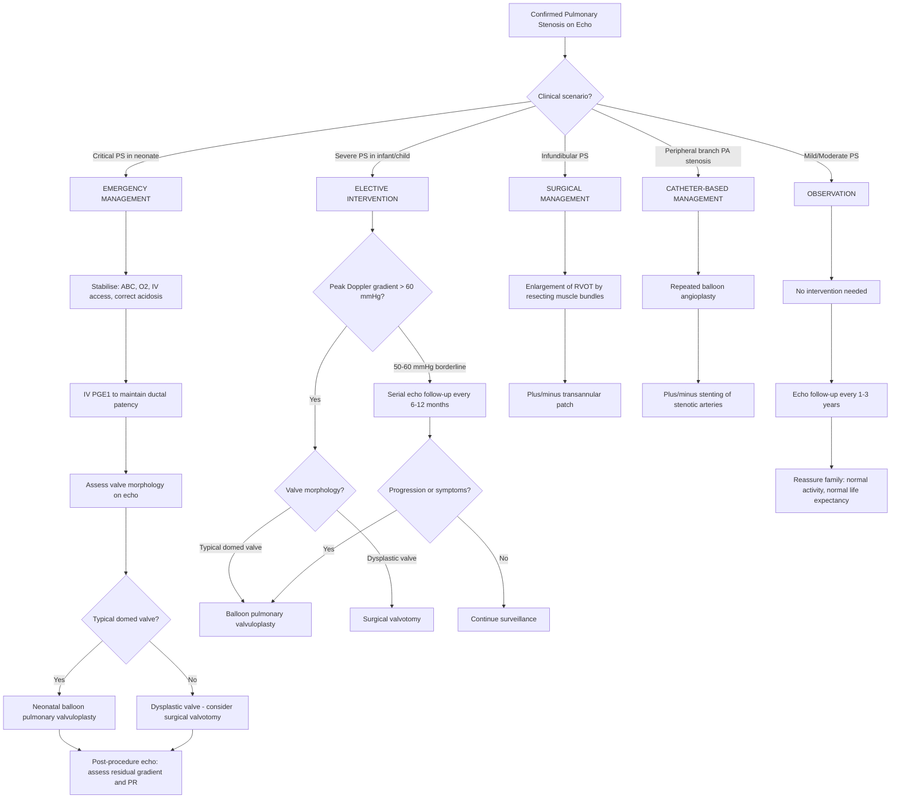

## Management of Pulmonary Stenosis

### Guiding Principles

The management of PS in children is determined by **three key variables**:

1. **Severity of obstruction** (Doppler gradient and clinical status)
2. **Anatomical level of obstruction** (valvular vs. infundibular vs. supravalvular vs. peripheral)
3. **Valve morphology** (typical domed valve vs. dysplastic valve)

The overarching logic is straightforward: **mild-moderate PS is well-tolerated and does not need intervention; severe/critical PS needs intervention to prevent RV failure and restore pulmonary blood flow**. The *type* of intervention depends on whether the valve is amenable to balloon dilation or requires surgery.

---

### Management Algorithm

---

### A. Emergency Management: Critical PS in the Neonate

Critical PS is a **duct-dependent** lesion — the PDA is the sole or major source of pulmonary blood flow. When the duct closes (typically within hours to days of birth), the neonate becomes profoundly cyanotic and rapidly deteriorates. Management must be **immediate and aggressive**.

#### Step 1: Stabilisation

| Action | Rationale |
|---|---|
| **Airway, Breathing, Circulation (ABC)** | Standard neonatal resuscitation; ensure adequate ventilation and perfusion |
| **IV access** (umbilical vein if peripheral access difficult) | For drug administration and fluid resuscitation |
| **Supplemental O₂** | May provide marginal benefit but will NOT significantly improve SpO₂ in fixed cardiac shunt (the problem is not V/Q mismatch but R-to-L shunting); avoid hyperoxia which can promote ductal closure |
| **Correct metabolic acidosis** | NaHCO₃ if severe acidosis (pH < 7.1); tissue hypoperfusion from inadequate pulmonary blood flow causes lactic acidosis |
| **Volume resuscitation** | ***IV fluids to increase RV preload*** [13] — a higher preload may help push more blood across even a severely stenotic valve |

#### Step 2: Prostaglandin E₁ (PGE₁ / Alprostadil)

> ***Urgent PGE₁ + neonatal balloon valvuloplasty in critical PS*** [1]

**Why PGE₁ works**: The ductus arteriosus is kept patent in utero by circulating prostaglandins (PGE₂ from the placenta) and low PaO₂. At birth, the rise in PaO₂ and fall in PGE₂ trigger ductal constriction. Exogenous PGE₁ reverses this process by directly relaxing the smooth muscle of the ductus wall, reopening it and restoring the PDA → pulmonary blood flow.

| Parameter | Detail |
|---|---|
| **Drug** | Prostaglandin E₁ (alprostadil) |
| **Route** | Continuous IV infusion (via central or peripheral line; ideally via umbilical venous catheter) |
| **Starting dose** | 5–10 ng/kg/min (some protocols start at 50–100 ng/kg/min for rapid duct opening, then wean) |
| **Maintenance dose** | 5–20 ng/kg/min (lowest effective dose to minimise side effects) |
| **Key side effects** | ***Apnoea*** (most important — 12% of neonates; always have intubation equipment ready and a plan for ventilatory support), hypotension, fever, flushing, seizures, cortical hyperostosis (long-term use) |
| **Duration** | Until definitive intervention (balloon valvuloplasty or surgery); avoid prolonged use if possible |

<Callout title="PGE₁ and Apnoea" type="error">
***Apnoea is the most dangerous side effect of PGE₁ in neonates.*** Always be prepared to intubate. In practice, many centres will prophylactically intubate and ventilate the neonate before starting PGE₁, especially if the infant is being transferred to a cardiac centre. Never start PGE₁ without monitoring and resuscitation capability.
</Callout>

#### Step 3: Definitive Neonatal Intervention

Once the duct is reopened and the neonate stabilised, **definitive relief of the obstruction** is performed — ideally within hours to days.

- **Typical domed valve** → ***Neonatal balloon pulmonary valvuloplasty*** [1] (see below)
- ***Dysplastic valve (e.g. Noonan syndrome) → Surgical valvotomy*** [1] (balloon will fail because there are no fused commissures to split)

---

### B. Balloon Pulmonary Valvuloplasty (BPV) — The Cornerstone Intervention

Breaking down the name: "balloon" = inflatable catheter device; "pulmonary" = pulmonary valve; "valvuloplasty" (Latin *valvula* = small valve + Greek *plastia* = moulding/repair) = reshaping/opening of the valve.

BPV is the **first-line treatment** for typical valvular PS in children. It was introduced in 1982 and has since become the gold standard due to its excellent efficacy, low complication rate, and avoidance of open-heart surgery.

#### Mechanism of Action

The balloon catheter is advanced percutaneously (via femoral vein → IVC → RA → RV → across the stenotic PV) and inflated at the level of the valve. The inflation **splits the fused commissures** of the domed valve, widening the effective orifice. Think of it like inflating a balloon inside a partially sealed envelope — the sealed edges (fused commissures) tear open.

This is why it works beautifully for **typical valvular PS** (where the problem IS commissural fusion) but ***does not respond well in dysplastic valves*** [1] (where the problem is thick, myxomatous tissue with no fused commissures to split).

#### Indications

| Indication | Evidence / Rationale |
|---|---|
| ***Severe PS with peak Doppler gradient > 60 mmHg*** [1] | RV pressure approaching systemic → risk of irreversible RV dysfunction, arrhythmia, exercise limitation |
| ***Critical PS in neonates (after PGE₁ stabilisation)*** [1] | Life-saving; restores anterograde pulmonary flow |
| Moderate PS (gradient 50–60 mmHg) with **symptoms** | Exertional dyspnoea, syncope, or exercise limitation attributable to PS; borderline gradient but clinically significant |
| Moderate PS with **RV strain on ECG** or **progressive RVH** | Evidence of myocardial compromise despite "moderate" gradient; intervene before irreversible RV damage |

#### Contraindications / Situations Where BPV is NOT Appropriate

| Situation | Reason | Alternative |
|---|---|---|
| ***Dysplastic PV (e.g. Noonan syndrome)*** [1] | ***Thick, myxomatous leaflets without commissural fusion → balloon cannot split what is not fused*** [1] | ***Surgical valvotomy*** [1] |
| **Infundibular (subvalvular) PS** | The obstruction is muscular, below the valve; a balloon at the valve level will not address subvalvular muscular hypertrophy | ***Surgical enlargement of RVOT by resecting muscle bundles ± transannular patch*** [2] |
| **Severe infundibular hypertrophy secondary to valvular PS** | After BPV of the valve, residual dynamic infundibular obstruction may worsen transiently (the hypertrophied infundibulum contracts against reduced afterload — "suicide RV") | Managed conservatively with beta-blockers; resolves over weeks as the infundibular muscle regresses |
| **Supravalvular PS** | The obstruction is above the valve; balloon at valve level is ineffective | Surgical patch repair or stenting depending on anatomy |
| **Peripheral branch PA stenosis** | Multiple discrete stenoses in branch PAs; valve-level balloon is irrelevant | ***Repeated balloon angioplasty ± stenting for stenotic arteries*** [2] |

#### Technique (Simplified for Understanding)

1. **Vascular access**: Femoral vein percutaneous puncture under ultrasound guidance
2. **Catheter advancement**: Wire and catheter advanced to RA → RV → across stenotic PV into PA
3. **Haemodynamic assessment**: Simultaneous measurement of RV and PA pressures to confirm peak-to-peak gradient
4. **Balloon selection**: Balloon diameter is chosen to be **120–140% of the PV annulus diameter** (measured on echo). Undersizing leads to inadequate relief; oversizing risks annular rupture or severe PR
5. **Inflation**: Rapid inflation of the balloon across the valve; the "waist" on the balloon (caused by the stenotic valve) disappears as the commissures split
6. **Post-dilation assessment**: Repeat pressure measurements to confirm gradient reduction (target: residual gradient < 25–30 mmHg); repeat echo to assess for PR

#### Outcomes

| Parameter | Detail |
|---|---|
| **Immediate success rate** | > 90% in typical valvular PS; gradient usually falls by > 50% |
| **Long-term outcomes** | Excellent; most children do not need re-intervention; freedom from re-intervention > 85% at 10 years |
| **Complications** | Rare ( < 2%): vascular injury (femoral vein), cardiac perforation (very rare), severe PR (usually from oversized balloon), transient arrhythmia, infundibular spasm |
| **Pulmonary regurgitation** | Some degree of PR is expected and usually well-tolerated; severe PR is uncommon with appropriately sized balloons |
| **Restenosis** | Uncommon ( < 5–10%); more likely in neonates with hypoplastic annulus; may require repeat BPV or surgery |

<Callout title="Post-BPV Infundibular Spasm — The 'Suicide RV'">
After successful BPV, the sudden reduction in afterload can unmask **dynamic infundibular obstruction** — the chronically hypertrophied infundibular muscle, which was previously stretched by high RV pressure, now contracts vigorously against a lower-resistance outflow. This can transiently worsen the gradient. It is managed conservatively (beta-blockers ± volume loading) and resolves over weeks to months as the infundibular muscle regresses. Do NOT re-balloon for this — it will not help and may worsen PR.
</Callout>

---

### C. Surgical Management

Surgery is reserved for cases where catheter-based intervention is not feasible or has failed. In the era of excellent catheter techniques, surgery for isolated PS is **uncommon** but remains essential for specific indications.

#### 1. Surgical Pulmonary Valvotomy

***Indicated in dysplastic PV (e.g. Noonan syndrome) → do not respond to BPV*** [1]

| Parameter | Detail |
|---|---|
| **Approach** | Open-heart surgery via median sternotomy with cardiopulmonary bypass (CPB) |
| **Procedure** | Direct incision of the thickened, dysplastic valve leaflets under direct vision; partial excision of myxomatous tissue; may include annular enlargement if the annulus is hypoplastic |
| **Outcome** | Effective relief of obstruction; low operative mortality ( < 1% in experienced centres) |
| **Complications** | Pulmonary regurgitation (more likely if aggressive tissue excision), bleeding, infection, heart block (rare), need for CPB-related complications |

#### 2. RVOT Reconstruction / Infundibular Resection

***For infundibular (subvalvular) PS: enlargement of RVOT by resecting muscle bundles ± transannular patch*** [2]

| Parameter | Detail |
|---|---|
| **Indication** | Primary infundibular PS (isolated or as part of TOF, double-chambered RV) |
| **Procedure** | Resection of the hypertrophied muscle bundles causing the subvalvular obstruction; if the RVOT is too narrow even after muscle resection, a **transannular patch** is placed — a patch of pericardium or synthetic material that bridges the annulus, widening the outflow tract |
| **Key consideration** | ***Transannular patch causes obligatory pulmonary regurgitation*** [3] — by destroying the valve annulus integrity, the patch creates free PR. This is the principal long-term complication of TOF repair and applies equally here. |
| **Long-term consequence of PR** | RV volume overload → RV dilation → RV dysfunction → arrhythmia (VT, atrial flutter/fibrillation) → exercise intolerance → potential sudden cardiac death; requires long-term follow-up with serial echo and MRI |

#### 3. Surgery for Peripheral Pulmonary Arterial Stenosis (PPS)

***Repeated balloon angioplasty ± stenting for stenotic arteries*** [2] is the first-line approach for PPS. However, surgery may be needed when:

- Catheter-based approach fails or is not technically feasible
- Complex multi-level stenosis requiring patch augmentation of branch PAs
- Often performed as part of a larger surgical procedure (e.g., during TOF repair)

---

### D. Conservative Management: Observation for Mild/Moderate PS

> ***Observe/no management in mild/moderate PS*** [1]

This is the most common management scenario, as the **majority of children with PS have mild or moderate disease**.

| Management | Detail |
|---|---|
| **No intervention needed** | Mild PS (gradient < 50 mmHg) is haemodynamically insignificant; the RV compensates easily; there is no risk of sudden death or rapid deterioration |
| **Serial echocardiographic follow-up** | Every 1–3 years depending on severity; monitor for progression of gradient, development of RVH, change in RV function |
| **No exercise restriction** | Children with mild-moderate PS can participate in **all activities including competitive sports**; unlike aortic stenosis, there is virtually no risk of sudden death with exercise in mild-moderate PS |
| **Reassurance to family** | Parents should be told: "This is a very common and mild heart condition. Your child can lead a completely normal life. We will keep an eye on it with regular scans, but the vast majority of children with mild PS never need any treatment." |
| **Natural history** | Mild PS rarely progresses significantly; many children have stable or even decreasing gradients over time as they grow (somatic growth may outpace valve stenosis). Moderate PS occasionally progresses and may eventually meet intervention thresholds. |

<Callout title="Progression of PS — When to Worry">
While most mild PS remains stable, a small subset may progress — particularly in infancy when rapid somatic growth can outstrip valve growth. Neonates with "moderate" PS at birth should be followed closely (echo every 3–6 months initially) because they may progress to severe PS during the first year. After infancy, progression is uncommon.
</Callout>

---

### E. Medical Therapy — Limited Role in PS

Unlike heart failure from volume overload lesions (VSD, PDA) where diuretics, ACE inhibitors, and digoxin play central roles, **there is no primary medical therapy for PS**. PS is a fixed mechanical obstruction — no drug can widen a stenotic valve.

However, medical therapy has specific supporting roles:

| Drug / Intervention | Role in PS Management | Mechanism |
|---|---|---|
| ***PGE₁ (alprostadil)*** [1] | Maintain ductal patency in critical PS | Relaxes ductus arteriosus smooth muscle; restores pulmonary blood flow |
| **Beta-blockers (e.g. propranolol)** | Post-BPV infundibular spasm ("suicide RV") | Reduces heart rate, decreases contractility → reduces dynamic infundibular obstruction |
| **Inotropes (e.g. dobutamine, dopamine)** | Critical PS with cardiogenic shock | Augments cardiac contractility and maintains systemic perfusion while awaiting intervention |
| **NaHCO₃** | Correction of severe metabolic acidosis in critical PS | Buffering agent; restores intracellular enzyme function and myocardial contractility |
| ***Diuretics, digoxin, ACEI, carvedilol*** [14] | If RV failure develops (late complication of severe/untreated PS) | ***Standard heart failure management*** [14]; diuretics reduce preload/congestion; ACEI reduces afterload; digoxin augments contractility; carvedilol provides beta-blockade with alpha-mediated vasodilation |

<Callout title="Do NOT Use ACEI/ARB in PS with Associated Intracardiac Shunt" type="error">
If PS coexists with a VSD (as in TOF), ***avoid ACEI/ARB*** [3] — these reduce systemic vascular resistance (SVR), which increases the pressure gradient favouring right-to-left shunting through the VSD, potentially ***triggering Tet spells*** [3]. This is a critical pharmacological pitfall in paediatric cardiology.
</Callout>

---

### F. Infective Endocarditis Prophylaxis

| Aspect | Recommendation |
|---|---|
| **Current guidelines (AHA/ESC 2023–2025)** | Antibiotic prophylaxis is **NOT routinely recommended** for isolated native valvular PS |
| **Exception** | Prophylaxis IS recommended for **6 months after BPV or surgical valvotomy**, or if there is a **residual defect at the site of a prosthetic patch or device** |
| **High-risk procedures** | Dental procedures involving gingival manipulation or perforation of oral mucosa |
| **Drug of choice** | Amoxicillin 50 mg/kg (max 2g) PO 30–60 min before the procedure; clindamycin 20 mg/kg (max 600 mg) if penicillin-allergic |

---

### G. Long-Term Follow-Up

Even after successful intervention, children with PS require **lifelong follow-up** (though the frequency decreases with time and favourable outcomes).

| Scenario | Follow-Up Schedule | Key Monitoring |
|---|---|---|
| **Mild PS (no intervention)** | Echo every 1–3 years | Gradient stability, RV function |
| **Post-BPV (successful)** | Echo at 1 month, 6 months, 1 year, then every 1–2 years | Residual gradient, degree of PR, RV function |
| **Post-surgical valvotomy** | Echo + ECG at 1 month, then 6-monthly for first year, then annually | Residual gradient, PR, arrhythmia screening |
| **Post-RVOT reconstruction with transannular patch** | ***Long-term F/U and exercise testing every 3–4 years*** [3] | PR severity (MRI regurgitant fraction), RV volumes, RV function, arrhythmia screening; ***PV replacement if MRI shows RVH + > 25% regurgitant fraction or if symptomatic*** [3] |
| **PPS post-stenting** | Annual echo + CT/MRI as needed | In-stent restenosis, stent fracture, need for re-dilation as child grows |

> **Paediatric consideration**: Stents placed in growing children will become relatively stenotic as the child grows — planned serial re-dilation is often necessary. This is a key difference from adult stenting where the vessels are full-size.

---

### H. Special Populations

#### 1. Noonan Syndrome

***Noonan syndrome is associated with thick dysplastic valve leaflets*** [1] and is the most important syndromic association to know:

- ***Dysplastic PV does not respond to BPV → requires surgical valvotomy*** [1]
- May also have ***peripheral branch PA stenosis*** [12] and hypertrophic cardiomyopathy (HCM) — screen for these
- Genetic counselling for the family (autosomal dominant, variable penetrance; genes: PTPN11, SOS1, RAF1, KRAS, BRAF)
- Growth hormone may be considered for short stature but must be used cautiously if HCM is present

#### 2. PS as Part of Tetralogy of Fallot

When PS is not isolated but part of TOF, management is fundamentally different — the VSD creates a haemodynamic interaction that changes everything:

- ***TOF repair usually at 6–12 months*** [3]: VSD patch closure + ***enlargement of RVOT by resecting infundibular muscle bundles ± transannular patch*** [3]
- ***Palliative modified Blalock-Taussig shunt (mBTS)*** [3] if the neonate has severe cyanosis, uncontrolled Tet spells, or pulmonary artery hypoplasia precluding early repair
- ***PGE₁ + early shunting in duct-dependent neonates*** [3]
- ***Avoid ACEI/ARB*** [3] in the pre-repair period

#### 3. PS in Univentricular Hearts

***In univentricular hearts, the degree of pulmonary outflow obstruction (PS) determines the balance between pulmonary and systemic flow (Qp:Qs)*** [15]:

- ***↑↑PS → predominant cyanosis → may need shunt insertion (mBTS) to increase pulmonary flow*** [15][16]
- ***↓↓PS → excessive pulmonary flow → HF → may need pulmonary artery banding to restrict flow*** [15]
- ***Staged management: shunt or band in infancy → Fontan-type procedure when older*** [16]

---

### Summary: Management by Level of Obstruction

| Level | Primary Intervention | Alternative / Adjunct |
|---|---|---|
| ***Valvular PS (typical)*** | ***Balloon pulmonary valvuloplasty (BPV) if gradient > 60 mmHg*** [1] | Observe if mild/moderate |
| ***Valvular PS (dysplastic)*** | ***Surgical valvotomy*** [1] | BPV may be attempted first but usually fails |
| ***Infundibular PS*** | ***Surgical enlargement of RVOT ± transannular patch*** [2] | If part of TOF: full repair with VSD closure |
| ***Supravalvular PS*** | Surgical patch repair | Stenting in selected cases |
| ***Peripheral PA stenosis*** | ***Repeated balloon angioplasty ± stenting*** [2] | Surgical patch augmentation if catheter approach fails |
| ***Critical PS (any type)*** | ***Urgent PGE₁ → emergent BPV or surgery*** [1] | mBTS as bridge if anatomy unfavourable for primary intervention |

---

<Callout title="High Yield Summary — Management of Pulmonary Stenosis">

1. **Mild/Moderate PS**: ***Observe, no intervention*** [1]; serial echo every 1–3 years; no exercise restriction; reassure family
2. **Severe PS (gradient > 60 mmHg)**: ***Balloon pulmonary valvuloplasty (BPV) is first-line*** [1] for typical domed valves
3. **Critical PS (neonate)**: ***Urgent IV PGE₁ to reopen ductus*** [1] → emergent BPV or surgical valvotomy
4. **Dysplastic valve (Noonan)**: ***BPV fails → surgical valvotomy required*** [1]
5. **Infundibular PS**: ***Surgical RVOT resection ± transannular patch*** [2]; NOT amenable to balloon
6. **Peripheral PPS**: ***Repeated balloon angioplasty ± stenting*** [2]
7. **Post-BPV infundibular spasm**: Manage with beta-blockers; self-resolving over weeks
8. **Transannular patch = obligatory PR**: Long-term follow-up essential; PV replacement if RVH + > 25% regurgitant fraction on MRI or if symptomatic
9. **IE prophylaxis**: NOT routinely needed for native PS; needed for 6 months post-intervention
10. **ACEI/ARB contraindicated** if PS coexists with VSD (TOF) → risk of triggering Tet spells

</Callout>

---

<ActiveRecallQuiz
  title="Active Recall - Management of Pulmonary Stenosis"
  items={[
    {
      question: "A neonate with critical PS is started on IV PGE1. What is the most important side effect to anticipate, and what precaution must be in place?",
      markscheme: "Apnoea (occurs in approximately 12% of neonates on PGE1). Must have intubation equipment immediately available and a plan for mechanical ventilation. Many centres prophylactically intubate before starting PGE1, especially during inter-hospital transfer."
    },
    {
      question: "Why does balloon pulmonary valvuloplasty fail in dysplastic pulmonary valves as seen in Noonan syndrome, and what is the alternative treatment?",
      markscheme: "BPV works by splitting fused commissures. Dysplastic valves have thick, myxomatous, immobile leaflets with minimal or no commissural fusion, so there are no commissures to split. The alternative is surgical valvotomy under direct vision, where the thickened tissue can be excised and the annulus enlarged if needed."
    },
    {
      question: "After successful BPV for severe valvular PS, the gradient paradoxically increases on immediate post-procedure echo. What is the most likely explanation and how should it be managed?",
      markscheme: "Post-BPV dynamic infundibular obstruction (suicide RV). The chronically hypertrophied infundibular muscle contracts vigorously against reduced afterload after successful valve dilation. Management is conservative: beta-blockers (e.g. propranolol) to reduce contractility and heart rate, plus volume loading. Do NOT re-balloon. Resolves over weeks to months as the infundibular muscle regresses."
    },
    {
      question: "A child with Tetralogy of Fallot has significant RVOT obstruction and is awaiting surgical repair. Why are ACE inhibitors contraindicated?",
      markscheme: "ACEI reduce systemic vascular resistance (SVR). In TOF, the VSD allows right-to-left shunting when RV pressure exceeds LV pressure. Reducing SVR lowers LV pressure, increasing the pressure gradient favouring R-to-L shunting through the VSD, worsening cyanosis and potentially triggering hypercyanotic (Tet) spells."
    },
    {
      question: "What are the indications for pulmonary valve replacement after prior RVOT reconstruction with a transannular patch?",
      markscheme: "Two main indications: (1) MRI showing RV hypertrophy plus regurgitant fraction greater than 25%, or (2) Symptomatic patient with RV failure or arrhythmia. Long-term follow-up with exercise testing every 3-4 years is required to monitor for these complications."
    },
    {
      question: "Compare the management approach for infundibular PS versus peripheral pulmonary arterial stenosis.",
      markscheme: "Infundibular PS: Surgical enlargement of RVOT by resecting hypertrophied muscle bundles, plus or minus transannular patch. Not amenable to balloon valvuloplasty because the obstruction is muscular, not valvular. Peripheral PPS: Repeated balloon angioplasty plus or minus stenting of stenotic branch pulmonary arteries. This is a catheter-based approach. Surgery (patch augmentation) is reserved for failed catheter interventions."
    }
  ]}
/>

## References

[1] Senior notes: Adrian Lui Pediatrics.pdf (p206)
[2] Senior notes: Adrian Lui Pediatrics.pdf (p207)
[3] Senior notes: Ryan Ho Cardiology.pdf (p188)
[12] Senior notes: Ryan Ho Cardiology.pdf (p185)
[13] Senior notes: Adrian Lui Pediatrics.pdf (p216)
[14] Lecture slides: GC 147. Heart failure and cyanosis in children acyanotic and cyanotic congenital heart disease - Part 1.pdf (p36)
[15] Senior notes: Adrian Lui Pediatrics.pdf (p222)
[16] Lecture slides: GC 147. Heart failure and cyanosis in children acyanotic and cyanotic congenital heart disease - Part 2.pdf (p35)
