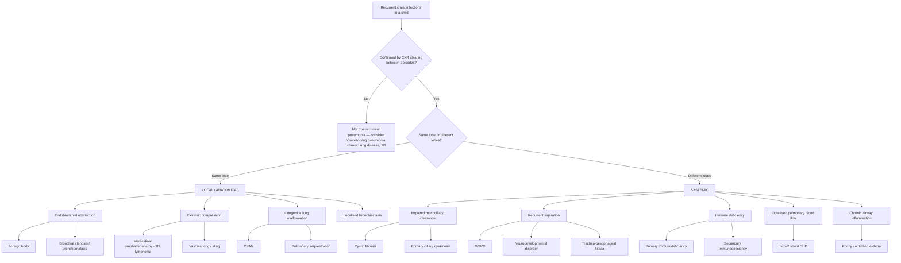

## Differential Diagnosis of Recurrent Chest Infections in Children

### The Thinking Framework

Before diving into a list, let's establish the clinical reasoning. When a child presents with recurrent chest infections, your job as a clinician is to answer **three sequential questions**:

1. **Is this truly recurrent pneumonia?** — Confirm genuine parenchymal disease with radiographic clearing between episodes. ***Sometimes "recurrent pneumonia" may merely reflect frequent URTI or asthma*** [3].
2. **Is the recurrence in the same anatomical location or different locations each time?** — This single question splits the differential neatly into local vs. systemic causes [5].
3. **What is the pattern of infection?** — The type of pathogen, severity, associated features, and age of onset point to specific aetiologies.

> **Why is anatomical pattern so important?** If the same lobe is affected every time, something *local* is preventing that lobe from clearing properly (obstruction, malformation, aspiration into a gravity-dependent region). If different lobes are affected, the problem is *systemic* — the whole lung is vulnerable because the child's defences (immune, mucociliary, or protective reflexes) are globally impaired.

---

### Differential Diagnosis — Mermaid Overview

---

### Systematic Differential Diagnosis Table

The table below organises differentials by mechanism, with distinguishing features and pathophysiological reasoning.

#### A. Local / Anatomical Causes (Same-Lobe Recurrence)

***Recurrence in the same region → look for anatomical anomalies and RFs for aspiration*** [5]

| Differential | Pathophysiology | Key Distinguishing Features | Age Group |
|---|---|---|---|
| **Foreign body aspiration** | Partial obstruction → ball-valve mechanism → distal air trapping, atelectasis, and post-obstructive pneumonia. The foreign body also acts as a nidus for bacterial growth. Classically affects the **right lung** because the right main bronchus is wider, shorter, and more vertical. | ***Intrathoracic airway lesion (e.g., asthma, foreign body)*** → ***wheeze*** [4]; sudden-onset choking episode (often witnessed) in a toddler (peak 1–3 years); **unilateral wheeze**; recurrent pneumonia **always in the same lobe** (typically RLL or RML); CXR may show air trapping, mediastinal shift, atelectasis | 6 months – 4 years (peak) |
| ***Bronchial obstruction*** [1] | Intrinsic narrowing (stenosis) or excessive collapsibility (bronchomalacia) → mucus cannot drain from the distal lobe → post-obstructive infection | ***Recurrent pneumonia of same lobe*** [1]; persistent focal wheeze; may be congenital or acquired (post-intubation) | Any age |
| **Extrinsic bronchial compression** — mediastinal lymphadenopathy (TB, lymphoma), vascular ring/sling | Enlarged lymph nodes or anomalous vessels compress a bronchus from outside → same mechanism as endobronchial obstruction | TB: contact history, chronic cough, weight loss, night sweats (HK is intermediate-endemic); Lymphoma: constitutional symptoms, hepatosplenomegaly; Vascular ring: stridor, feeding difficulties from oesophageal compression | TB: any; Lymphoma: school-age; Vascular ring: infancy |
| **Congenital pulmonary airway malformation (CPAM)** | Abnormal cystic or solid lung tissue that does not participate in gas exchange and acts as a nidus for recurrent infection due to poor drainage and mucus pooling | Often detected on prenatal USS; recurrent pneumonia in same region; CT shows cystic/solid mass within lung parenchyma | Infancy onwards |
| **Pulmonary sequestration** | Aberrant non-functioning lung tissue with **systemic arterial supply** (from aorta, not pulmonary artery) and no normal bronchial connection (intralobar) → dead space that traps secretions | Recurrent **LLL** pneumonia (75% are intralobar, 60% in LLL); CT angiography shows anomalous feeding artery from aorta; may present with air-fluid level | Infancy–childhood |
| **Localised bronchiectasis** | Post-infectious destruction of bronchial wall in one region → permanently dilated airway with impaired clearance → chronic colonisation | History of a severe pneumonia (especially adenovirus, pertussis, measles, or TB) that damaged one area; persistent wet cough; HRCT confirms localised bronchiectasis | Post-infectious: any |

<Callout title="Exam Tip — Foreign Body" type="idea">
Always ask about a **choking episode** in any toddler with recurrent same-lobe pneumonia. Parents may have forgotten a brief episode months ago. A normal CXR does **not** exclude a foreign body — you may need inspiratory/expiratory films or fluoroscopy (looking for air trapping), or proceed straight to **rigid bronchoscopy** (both diagnostic and therapeutic).
</Callout>

---

#### B. Systemic Causes (Different-Lobe Recurrence)

***Recurrence in different regions → look for underlying systemic factors*** [5]

##### B1. Impaired Mucociliary Clearance

| Differential | Pathophysiology | Key Distinguishing Features |
|---|---|---|
| **Cystic fibrosis (CF)** | ***CFTR mutation, AR inheritance*** [1] → defective chloride channel → dehydrated, viscous airway surface liquid → impaired mucociliary clearance → ***chronic/recurrent lung infections ± bronchiectasis*** [1]. Also affects pancreas, GI tract, sweat glands, vas deferens. | ***Classical triad: ↑sweat Cl⁻ + recurrent lung infections + pancreatic insufficiency*** [1]; common pathogens: ***S. aureus, H. influenzae (early), P. aeruginosa, Burkholderia cepacia (late)*** [1]; ***clubbing, chest hyperinflation, coarse inspiratory crackles ± expiratory wheeze*** [1]; steatorrhoea, FTT; **nasal polyps** in a child (unusual and should prompt CF testing); meconium ileus in neonates. **Rare in Chinese** but does occur [6]. |
| **Primary ciliary dyskinesia (PCD)** | ***AR inheritance; abnormal structure/function of cilia → ↓mucociliary clearance → recurrent respiratory infections*** [1]. During embryogenesis, ciliary beating determines left-right lateralisation; dysfunctional cilia → **random** situs (50% chance situs inversus). | ***~50% have Kartagener syndrome (situs inversus + chronic sinusitis + bronchiectasis)*** [1]; chronic productive cough from birth/infancy; neonatal respiratory distress (unclear cause); chronic rhinosinusitis; chronic otitis media with effusion; ***recurrent productive cough, purulent nasal discharge, chronic ear infection*** [1]; male infertility (immotile sperm); screening with **nasal NO** (↓NO) [1] |

> **Why is nasal NO low in PCD?** The paranasal sinuses are normally the major source of exhaled nasal NO. In PCD, chronic sinusitis and poor ventilation of the sinuses lead to trapped NO and reduced nasal NO concentrations. This makes it a useful **screening** test (but not diagnostic on its own).

##### B2. Recurrent Aspiration

***CNS abnormalities → recurrent aspiration*** [1]

| Differential | Pathophysiology | Key Distinguishing Features |
|---|---|---|
| **Neurodevelopmental disorders** (cerebral palsy, global developmental delay, myopathies) | Poor oromotor coordination, weak cough, depressed swallow reflex → chronic micro-aspiration of saliva and feeds into the airway → chemical pneumonitis + bacterial superinfection | ***Neurodevelopmental abnormality → aspiration lung disease*** [4]; ***feeding difficulties → serious systemic illness, aspiration*** [4]; recurrent **RLL pneumonia** (gravity-dependent aspiration when upright) or bilateral lower lobes; wet/gurgling voice; cough/choking with feeds |
| **Gastro-oesophageal reflux disease (GORD)** | Reflux of acidic gastric contents past the upper oesophageal sphincter → laryngeal/tracheal aspiration → recurrent chemical injury + infection | Vomiting/regurgitation (but can be "silent" in infants); irritability with feeds; poor weight gain; apnoea in neonates; chronic cough worse when supine; CXR showing recurrent RLL or bilateral lower zone infiltrates |
| ***Tracheo-oesophageal fistula (TOF)*** | Abnormal connection between trachea and oesophagus → feeds enter the airway directly. Most types are diagnosed in the neonatal period, but **H-type fistula** (no oesophageal atresia) can present late with ***recurrent pneumonia*** [4] | ***Recurrent pneumonia*** [4]; choking/coughing with every feed since birth; recurrent unexplained pneumonia in an otherwise well infant; diagnosed by contrast swallow or bronchoscopy |
| **Laryngeal cleft** | Defect in the posterior cricoid lamina → communication between airway and oesophagus → aspiration during swallowing | Stridor, chronic cough, feeding difficulties; diagnosed on microlaryngoscopy/bronchoscopy |

<Callout title="Aspiration Pattern — Why RLL?" type="idea">
When a child aspirates while **upright or semi-recumbent** (i.e., during feeding), gravity directs aspirated material to the **right lower lobe** via the more vertical right main bronchus. When supine (e.g., during sleep), the **posterior segments of the upper lobes** and **apical segments of the lower lobes** are affected. This anatomical reasoning helps you localise the cause.
</Callout>

##### B3. Immune Deficiency

This is the category that exam questions love to test. The pattern of infection is the biggest clue to *which* arm of the immune system is defective.

***Causes of recurrent infections*** [1]:
- ***Non-immunologic defects***
- ***Secondary immunodeficiencies (e.g., HIV, measles, chemo, cancer, malnutrition)*** [3]
- ***Primary immunodeficiencies (i.e., inborn errors of immunity)*** [3]

###### Primary Immunodeficiency (IEI)

***Primary immunodeficiency: genetically-determined defects in immunity. Now referred to as inborn errors of immunity (IEI). > 440 different diseases, ~1/4000 births*** [1].

| Immune Component Defect | Typical Infections | Typical Pathogens | Classic Examples | Key Distinguishing Features |
|---|---|---|---|---|
| ***Humoral (Ab) deficiency (36.3%)*** [1] | ***Sinopulmonary and GI infections*** [1]; ***bronchiectasis, granulomatous-lymphocytic ILD, IBD*** [1] | ***Encapsulated bacteria, Giardia, enterovirus*** [1] | ***XLA*** (absent B cells, panhypogammaglobulinaemia, absent tonsils) [1]; ***CVID*** (most common severe Ab deficiency, ↓↓↓IgG, ↓IgA/E) [1]; ***Hyper-IgM syndrome*** (↑IgM, ↓IgG/A/E) [1]; ***Selective IgA deficiency*** (most common PID, usually asymptomatic) [1] | ***Present after 4–6 months*** (when maternal IgG wanes) [1]; recurrent otitis media, sinusitis, pneumonia; may develop autoimmunity; ***CT showing sinusitis, HRCT showing bronchiectasis*** (as in XLA case) [3] |
| ***Combined (T + B cell) deficiency (19.8%)*** [1] | ***Severe ± unusual viral and fungal infections*** [1] | Opportunistic: PJP, CMV, Candida, adenovirus | ***SCID*** (fatal without treatment; ↓ALC, absent thymus on CXR) [1]; ***DiGeorge syndrome*** (22q11.2 del; conotruncal cardiac anomaly + thymic hypoplasia + hypoparathyroidism) [1]; ***Wiskott-Aldrich syndrome*** (eczema + thrombocytopenia + immunodeficiency) [1]; ***Ataxia telangiectasia*** (cerebellar ataxia, telangiectasia, ↑AFP, lymphoma risk) [1] | Present early in life; ***severe bronchiolitis, oral thrush, PJP, disseminated CMV*** [1]; FTT; complications from live vaccines (***BCG → SCID, CGD; OPV → SCID, XLA***) [1] |
| ***Phagocyte defect (14.9%)*** [1] | ***Recurrent bacterial infections***; skin and deep organ abscesses | ***Skin commensals, fungi***; catalase-positive organisms (CGD) | ***CGD*** (failure to produce superoxide → granuloma formation; lung/skin/LN/liver abscesses, BCG dissemination) [1]; ***LAD*** (↑neutrophil count, absent pus, delayed cord separation, omphalitis) [1] | Recurrent skin/perianal abscesses; ***lymphadenitis, hepatosplenomegaly*** [1]; non-healing wounds; **abnormal DHR flow cytometry** (CGD); **absent CD18** (LAD) |
| ***Complement deficiency*** [1] | ***Recurrent bacterial infections and SLE-like illness*** [1] | ***Encapsulated bacteria*** [1]; especially **Neisseria** (terminal pathway deficiency) | Early component def (C1, C2, C4) → SLE-like; C3 def → severe pyogenic; C5–C9 def → recurrent Neisseria | SLE-like illness + recurrent infections; recurrent meningococcal disease; CH50 undetectable |

***10 warning signs of IEI (Jeffrey Modell Foundation)*** [3]:
1. ***Eight or more new ear infections within 1 year***
2. ***Two or more serious sinus infections within 1 year***
3. ***Two or more months on antibiotics with little effect***
4. ***Two or more pneumonias within 1 year***
5. ***Failure of an infant to gain weight or grow normally***
6. ***Recurrent, deep skin or organ abscesses***
7. ***Persistent thrush in mouth or elsewhere on skin, after age 1***
8. ***Need for intravenous antibiotics to clear infections***
9. ***Two or more deep-seated infections***
10. ***A family history of IEI***

***Not a comprehensive list — do not exclude patients based on 10 warning signs alone. Patients could present with non-infectious phenotypes*** [3].

***Past medical history: Document in detail. Note IEIs can affect many different organs*** [3]:
1. ***Infections (recurrent, opportunistic or live vaccine complications)***
2. ***Autoinflammation, autoimmunity, e.g., IBD, AIHA, arthritis***
3. ***Non-malignant lymphoproliferation***
4. ***Atopy***
5. ***Cancer, e.g., lymphoma***

***Note: Any rare immunological phenomenon can have a monogenic basis (i.e., be an IEI). Some patients may present without a history of recurrent or opportunistic infections*** [3].

> **Mnemonic for approach to PID infections — "SPUR"**: ***Serious, Persistent, Unusual, Recurrent*** [1] infections should trigger suspicion for immunodeficiency.

###### Secondary Immunodeficiency

| Cause | Mechanism | Distinguishing Features |
|---|---|---|
| ***Iatrogenic (steroid, immunosuppressant, splenectomy)*** [1] | Drug-induced immune suppression or loss of splenic filtration function | Drug history; post-splenectomy → overwhelming post-splenectomy infection (OPSI) with encapsulated bacteria |
| ***Malnutrition*** [1] | Impaired cell-mediated immunity, reduced complement and secretory IgA; ***muscle wasting → respiratory muscle weakness → resp failure and chest infections*** [7] | Anthropometric evidence of wasting/stunting; micronutrient deficiencies |
| ***Nephrotic syndrome*** [1] | Urinary loss of IgG and complement factor B → susceptibility to encapsulated bacteria | Oedema, proteinuria, hypoalbuminaemia |
| ***HIV*** [1] | Progressive CD4+ T cell depletion → opportunistic infections | Consider in any child with unexplained recurrent infections; vertical transmission risk |
| ***Neoplasms*** [1] | Bone marrow infiltration (leukaemia) → pancytopenia; or chemotherapy-induced immunosuppression | Pallor, bruising, hepatosplenomegaly, lymphadenopathy, weight loss |
| ***Post-measles*** | "Immune amnesia" — measles virus destroys memory B and T cells → transient but profound susceptibility to infections for weeks to months | Recent measles illness; unvaccinated child |

##### B4. Increased Pulmonary Blood Flow (Congenital Heart Disease)

| Differential | Pathophysiology | Key Distinguishing Features |
|---|---|---|
| **L→R shunt CHD** (VSD, ASD, PDA, AVSD) | Excessive pulmonary blood flow → pulmonary congestion and interstitial oedema → compression of small airways → impaired clearance + fluid in alveoli = culture medium → recurrent LRTIs | Cardiac murmur; signs of heart failure (tachypnoea, hepatomegaly, poor feeding, FTT, sweating with feeds); CXR showing cardiomegaly + pulmonary plethora; echocardiogram diagnostic |

> **Why does a VSD cause recurrent chest infections?** The left-to-right shunt increases pulmonary blood flow. Engorgement of the pulmonary vasculature compresses the airways and increases interstitial fluid. The waterlogged lung cannot clear pathogens effectively, and the excess fluid provides a substrate for bacterial growth. Additionally, the child is often in heart failure with increased work of breathing and poor nutrition — further impairing immune function.

##### B5. Chronic Airway Inflammation

| Differential | Pathophysiology | Key Distinguishing Features |
|---|---|---|
| **Poorly controlled asthma** | Chronic eosinophilic airway inflammation → mucus hypersecretion, airway wall oedema, bronchospasm → mucus plugging → segmental atelectasis (which can mimic consolidation on CXR) → ± secondary bacterial infection | ***Is this an acute exacerbation of a chronic respiratory disorder? — Failure to thrive, finger clubbing, chest deformity, features of atopy*** [4]; episodic wheeze, nocturnal cough, triggers (allergens, exercise, cold air); Hx of atopy; responds to bronchodilators; CXR may show hyperinflation ± atelectasis (mimicking pneumonia!) |
| **Allergic bronchopulmonary aspergillosis (ABPA)** | IgE-mediated hypersensitivity to *Aspergillus fumigatus* colonising the airways → intense eosinophilic inflammation → mucoid impaction → proximal bronchiectasis | Usually in child with CF or severe asthma; peripheral eosinophilia; ↑total IgE ( > 1000 IU/mL); +ve *Aspergillus*-specific IgE and IgG; central bronchiectasis on HRCT (unique to ABPA) |

<Callout title="Don't Be Tricked by Asthma Mimicking Pneumonia" type="error">
***Sometimes "recurrent pneumonia" may merely reflect frequent URTI or asthma*** [3]. Mucus plugging in asthma can cause **lobar/segmental atelectasis** that looks exactly like consolidation on CXR. If a child with "recurrent pneumonia" always improves dramatically with bronchodilators and steroids rather than antibiotics, think **asthma** — not immunodeficiency. Always review the old CXRs carefully.
</Callout>

##### B6. Other Systemic Causes

| Differential | Pathophysiology | Key Distinguishing Features |
|---|---|---|
| **Tuberculosis** | Can cause recurrent or non-resolving pneumonia; endobronchial TB or lymph node compression can cause post-obstructive pneumonia; miliary TB mimics recurrent pneumonia | Contact history; constitutional symptoms; TST/IGRA positivity; CXR: hilar lymphadenopathy, upper lobe predilection, miliary pattern; early morning gastric aspirate for AFB [8] |
| **Bronchopulmonary dysplasia (BPD)** | Chronic lung disease of prematurity → disrupted alveolar and vascular development → impaired gas exchange and clearance → recurrent infections | History of extreme prematurity ( < 28 weeks), prolonged NICU stay, mechanical ventilation; chronic oxygen dependency; CXR: cystic/fibrotic changes |
| **Sickle cell disease** | Functional asplenia → susceptibility to encapsulated bacteria; acute chest syndrome (vaso-occlusion + infection + fat embolism) mimics recurrent pneumonia | Haemolytic anaemia, pain crises, splenomegaly → later autosplenectomy; Hb electrophoresis diagnostic; less common in HK but seen in mixed-race families |

---

### Key Differential Diagnosis by Clinical Clue

This is how you use clinical features to **narrow** the differential rapidly:

| Clinical Clue | Top Differentials |
|---|---|
| Recurrent pneumonia **always same lobe** | Foreign body, CPAM, sequestration, bronchial stenosis, extrinsic compression |
| Recurrent pneumonia + **steatorrhoea / FTT** | Cystic fibrosis |
| Recurrent pneumonia + **situs inversus** | Primary ciliary dyskinesia (Kartagener) |
| Recurrent pneumonia + **absent tonsils** + panhypogammaglobulinaemia | XLA |
| Recurrent pneumonia + **eczema + thrombocytopenia** | Wiskott-Aldrich syndrome |
| Recurrent pneumonia + **cardiac murmur + FTT** | CHD with L→R shunt |
| Recurrent pneumonia + **choking with feeds** | Aspiration (neurodevelopmental, TOF, GORD) |
| Recurrent pneumonia + **deep organ abscesses + BCG dissemination** | CGD |
| Recurrent pneumonia + **delayed cord separation** | LAD |
| Recurrent pneumonia + **oral thrush > 1 year** | T cell / combined immunodeficiency (SCID, DiGeorge) |
| Recurrent pneumonia + **cardiac anomaly + hypocalcaemia** | DiGeorge syndrome (22q11.2 del) |
| Recurrent **RLL pneumonia** in a neurologically impaired child | Aspiration |
| Recurrent pneumonia + **atopic features, wheeze** | Asthma (poorly controlled) |
| Recurrent pneumonia + **no pathogen identified, subacute onset, contact history** | Tuberculosis |

---

### Differentiating "Normal" Recurrent Infections from Pathological

This is a crucial distinction in paediatrics — most children with recurrent infections are **normal**.

| Feature | Normal Child | Pathological (suspect underlying cause) |
|---|---|---|
| Frequency | ***8–10 URTIs/year can be normal*** [3] | ***≥2 pneumonias/year or ≥3 ever*** (with CXR clearing) [1] |
| Duration | ***Short duration, self-limited*** [3] | Prolonged; ***≥2 months on antibiotics with little effect*** [3] |
| Severity | ***Uncomplicated*** [3] | Requiring IV antibiotics, ICU admission; deep-seated infections |
| Between episodes | ***Healthy in between episodes*** [3] | Ongoing symptoms (chronic cough, poor growth, persistent wheeze) |
| Growth | Normal | ***Failure to gain weight or grow normally*** [3] |
| Family history | Siblings in daycare, ***start of school*** [1] | ***Family history of IEI*** [3]; consanguinity; unexplained infant death |
| Organisms | Common viruses, typical bacteria | Opportunistic (PJP, CMV, Candida); unusual; catalase-positive |
| Response to treatment | Quick resolution | Poor or absent response |

<Callout title="High Yield Summary — Differential Diagnosis of Recurrent Chest Infections">

**Framework**: Same lobe → local/anatomical; Different lobes → systemic.

**Local causes**: Foreign body (most treatable!), CPAM, pulmonary sequestration, bronchial stenosis/bronchomalacia, extrinsic compression (TB LN, vascular ring).

**Systemic — Impaired clearance**: CF (sweat Cl⁻ + steatorrhoea + lung infections), PCD (situs inversus + sinusitis + bronchiectasis).

**Systemic — Aspiration**: Neurodevelopmental disorders, GORD, TOF (H-type), laryngeal cleft.

**Systemic — Immune deficiency**: Primary (antibody deficiency most common — presents after 4–6 months; combined deficiency presents early and severely; phagocyte defects → catalase-positive organisms + abscesses; complement deficiency → Neisseria + SLE-like). Secondary (iatrogenic, malnutrition, HIV, nephrotic syndrome, malignancy).

**Systemic — Cardiac**: L→R shunt CHD → pulmonary overcirculation → recurrent LRTIs.

**Systemic — Airway inflammation**: Poorly controlled asthma (beware atelectasis mimicking consolidation), ABPA.

**Differentiating normal from pathological**: Normal children are well between episodes, grow normally, and respond to standard treatment. Red flags = SPUR infections (Serious, Persistent, Unusual, Recurrent), FTT, need for IV antibiotics, family history of IEI, live vaccine complications.

**10 Warning Signs of IEI** (Jeffrey Modell Foundation) — not comprehensive but a useful screening checklist.

**Always confirm genuine pneumonia with CXR** — "recurrent pneumonia" may be frequent URTI or asthma with atelectasis.

</Callout>

---

<ActiveRecallQuiz
  title="Active Recall - Differential Diagnosis of Recurrent Chest Infections"
  items={[
    {
      question: "A 2-year-old presents with his third episode of right middle lobe pneumonia in 12 months. Between episodes, CXR clears completely and he is otherwise well. What is the most likely category of underlying cause, and what single investigation would you prioritise?",
      markscheme: "Local/anatomical cause (same-lobe recurrence). Most likely diagnosis is aspirated foreign body. Prioritise rigid bronchoscopy (both diagnostic and therapeutic). Inspiratory-expiratory CXR or CT thorax are alternatives if bronchoscopy is not immediately available."
    },
    {
      question: "Explain why antibody (humoral) deficiencies predominantly cause sinopulmonary and GI infections rather than, say, skin or CNS infections.",
      markscheme: "The respiratory and GI tracts are the largest mucosal surfaces in direct contact with the external environment. Secretory IgA is the dominant mucosal defence immunoglobulin. When antibody production fails, these mucosal surfaces lose their first-line adaptive defence against pathogens, making them the primary sites of infection. Also, IgG deposition is greatest at these sites."
    },
    {
      question: "A 4-month-old boy presents with Pneumocystis jirovecii pneumonia (PJP), oral thrush, and failure to thrive. His absolute lymphocyte count is very low and CXR shows absent thymic shadow. What is the most likely diagnosis and why is it a medical emergency?",
      markscheme: "Severe combined immunodeficiency (SCID). It is a medical emergency because SCID is fatal without treatment (usually haematopoietic stem cell transplant). The absent thymic shadow and low ALC indicate failure of both T and B cell development. PJP and persistent thrush indicate failed cell-mediated immunity. Every day of delay increases infection risk and worsens transplant outcomes."
    },
    {
      question: "How would you distinguish recurrent pneumonia caused by poorly controlled asthma from true bacterial recurrent pneumonia due to an underlying structural lesion?",
      markscheme: "Asthma: episodic wheeze with triggers, nocturnal cough, atopic history, rapid response to bronchodilators and steroids rather than antibiotics, CXR may show atelectasis from mucus plugging (not true consolidation), well between episodes. Structural lesion: same-lobe involvement every time, may not respond to bronchodilators, may have focal physical signs (persistent crackles, reduced air entry), CT or bronchoscopy reveals anatomy. Key: review old CXRs to see if clearing occurs between episodes and whether it is always the same lobe."
    },
    {
      question: "Name three clinical features that differentiate a normal child with frequent URTIs from a child with underlying primary immunodeficiency.",
      markscheme: "Any three of: (1) Normal child is healthy between episodes vs PID child may have chronic symptoms or FTT; (2) Normal child responds quickly to standard treatment vs PID child needs prolonged or IV antibiotics; (3) Normal child has uncomplicated self-limiting infections vs PID child has deep-seated, unusual, or severe infections; (4) Normal growth vs failure to thrive; (5) No family history vs family history of IEI or consanguinity; (6) Typical pathogens vs opportunistic organisms."
    },
    {
      question: "A child has recurrent chest infections affecting different lobes, chronic sinusitis, and is found to have dextrocardia on examination. What is the diagnosis, what is the inheritance pattern, and what screening test would you use?",
      markscheme: "Primary ciliary dyskinesia (Kartagener syndrome with situs inversus). Inheritance: autosomal recessive. Screening test: nasal nitric oxide measurement (characteristically low in PCD due to chronic sinusitis and poor sinus ventilation). Confirmatory tests include ciliary ultrastructure analysis from nasal brushing and genetic testing."
    }
  ]}
/>

## References

[1] Senior notes: Adrian Lui Pediatrics.pdf (p154, p163, p182, p406, p407, p410, p411)
[3] Lecture slides: GC 144. A child with recurrent infections Primary immunodeficiencies.pdf (p3, p4, p6, p12, p28)
[4] Lecture slides: GC 141. A child with cough acute and chronic cough in children.pdf (p15, p20)
[5] Senior notes: Ryan Ho Respiratory.pdf (p67)
[6] Senior notes: Ryan Ho Fundamentals.pdf (p225)
[7] Senior notes: Ryan Ho Fluids and Nutrition.pdf (p7)
[8] Senior notes: Ryan Ho Respiratory.pdf (p73, p81)
