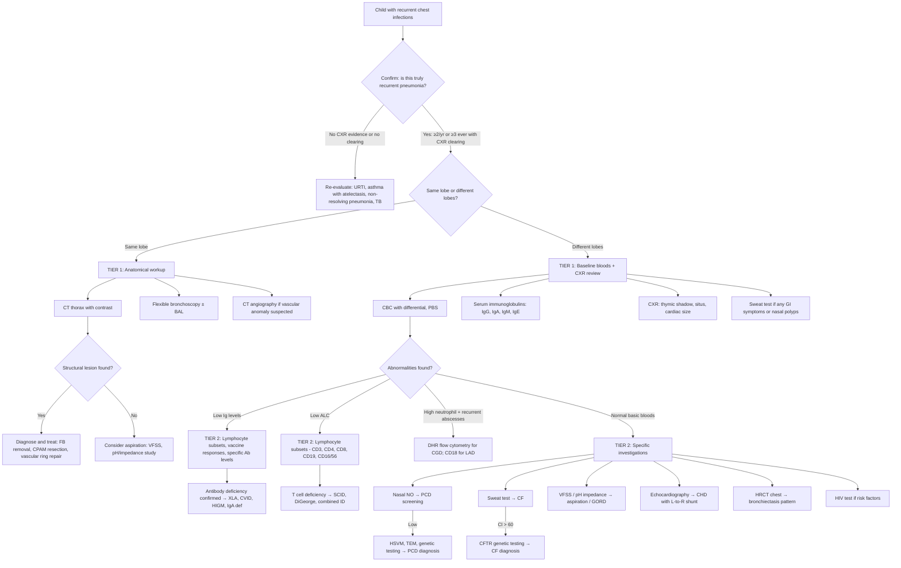

## Diagnostic Criteria

### Does "Recurrent Chest Infections" Have Formal Diagnostic Criteria?

Unlike a single disease entity (e.g., asthma with GINA criteria, or SLE with ACR/EULAR criteria), "recurrent chest infections" is a **clinical presentation** — a pattern that demands you find the **underlying cause**. Therefore, the diagnostic process has two distinct layers:

1. **Confirming the pattern itself** — establishing that this truly is recurrent pneumonia
2. **Identifying the underlying aetiology** — which is the real diagnosis

### Layer 1: Confirming Recurrent Pneumonia

**Definition (operational diagnostic criteria)** [1]:

> **Recurrent pneumonia** = **≥2 episodes of pneumonia in a single year** OR **≥3 episodes at any time**, with **radiographic clearing between episodes**.

Each individual episode must satisfy the criteria for pneumonia:

| Component | Criteria in Paediatrics | Why |
|---|---|---|
| **Clinical** | Fever + respiratory symptoms (cough, tachypnoea, respiratory distress) + signs of consolidation (focal crackles, dullness, bronchial breathing) | Pneumonia is a clinico-radiological diagnosis; clinical features alone are insufficiently specific in children |
| **Radiological** | New infiltrate / consolidation on CXR | ***A CXR should be considered in the presence of lower respiratory tract signs, relentlessly progressive cough, haemoptysis*** [4]; confirms parenchymal disease and distinguishes from URTI or asthma |
| **Clearing** | CXR must normalise between episodes | This is the critical criterion — it proves each episode is *new* rather than a single non-resolving infection |

> **Age-specific tachypnoea thresholds** (WHO criteria — essential for paediatrics):
> - < 2 months: RR > 60/min
> - 2–12 months: RR > 50/min
> - 1–5 years: RR > 40/min
> - > 5 years: RR > 20/min

<Callout title="Must-Know Distinction" type="error">
**Recurrent** vs **Non-resolving (persistent)** pneumonia — these require DIFFERENT workups:
- **Recurrent**: CXR clears → think structural anomaly, immune deficiency, aspiration, ciliary dysfunction
- **Non-resolving**: CXR never clears → think foreign body with complete obstruction, TB, malignancy, congenital lung malformation, lung abscess, empyema
</Callout>

### Layer 2: Diagnostic Criteria for Specific Underlying Causes

Once recurrent pneumonia is confirmed, the underlying cause must be identified. Key conditions have their own diagnostic criteria:

#### Cystic Fibrosis (CF)

| Test | Diagnostic Criteria | Notes |
|---|---|---|
| ***Sweat test (gold standard)*** [1] | ***Sweat chloride > 60 mmol/L = diagnostic*** [1] | Procedure: pilocarpine iontophoresis → collect sweat → measure Cl⁻. Borderline: 30–59 mmol/L (requires repeat + genetic testing). Normal: < 30 mmol/L |
| ***Newborn screening*** [1] | ***↑immunoreactive trypsinogen (IRT) → proceed to genetic test*** [1] | IRT is released from damaged pancreas; elevated in CF neonates |
| ***Genetic test*** [1] | Identification of **two** CFTR mutations | ***~2000 gene mutations identified; Phe508del is the most frequent (~78%) in UK*** [1] |

> Diagnosis requires **consistent clinical features** + **evidence of CFTR dysfunction** (elevated sweat Cl⁻ and/or 2 CFTR mutations).

#### Primary Ciliary Dyskinesia (PCD) — European Respiratory Society (ERS) Guidelines 2017

| Test | Finding | Interpretation |
|---|---|---|
| ***Nasal NO screening*** [1] | ***↓NO*** [1] ( < 77 nL/min) | High sensitivity screening test; low nasal NO because of chronic sinusitis and poor sinus ventilation |
| **High-speed video microscopy (HSVM)** | Abnormal ciliary beat pattern and/or frequency | Obtained from ***nasal epithelial cells via nose brush*** [1] |
| **Transmission electron microscopy (TEM)** | Ultrastructural defects (outer/inner dynein arm defects, central pair abnormalities) | Classic but ~30% of PCD patients have **normal** ultrastructure → TEM alone cannot exclude PCD |
| ***Genetic test*** [1] | Biallelic pathogenic variants in PCD-associated genes | > 50 genes identified; confirms diagnosis when found, but genetic testing cannot detect all cases |

> PCD diagnosis typically requires **clinical suspicion** + **low nasal NO** + **abnormal HSVM/TEM** and/or **confirmatory genetics**. No single test is 100% sensitive.

#### Primary Immunodeficiency (IEI) — Pattern-Based Diagnostic Approach

There are no unified "diagnostic criteria" for all IEI, but the ***10 warning signs*** [3] serve as a screening tool, and specific conditions have characteristic laboratory patterns:

| Condition | Key Diagnostic Investigations | Diagnostic Findings |
|---|---|---|
| ***XLA*** [1] | Flow cytometry for B cells; serum Ig levels; Btk gene sequencing | ***↓B cells ( < 2%), pan-hypo(γ)globulinaemia*** [1]; absent Btk protein/gene mutation |
| ***CVID*** [1] | Serum Ig levels; vaccine responses; exclusion of other causes | ***↓↓↓IgG, ↓IgA ± ↓IgE*** [1]; poor vaccine antibody responses; diagnosis of exclusion (age typically > 4 years) |
| ***SCID*** [1] | CBC with differential (absolute lymphocyte count); lymphocyte subsets; functional assays | ***↓ALC ( < 2.5 × 10⁹/L in neonates); absent thymus shadow on CXR*** [1]; absent/very low T cells; absent proliferative response to mitogens |
| ***CGD*** [1] | **Dihydrorhodamine (DHR) flow cytometry** or nitroblue tetrazolium (NBT) test | Absent oxidative burst in neutrophils; DHR is more sensitive and quantitative than NBT |
| ***LAD*** [1] | Flow cytometry for CD18 (β₂ integrin) on neutrophils | ***Absent or markedly reduced CD18 expression*** [1]; ***↑neutrophil count*** [1] |
| ***Complement deficiency*** [1] | **CH50** (total haemolytic complement); **AH50**; individual complement levels | CH50 = 0 → classical pathway defect; AH50 = 0 → alternative pathway defect |

---

## Diagnostic Algorithm

The following algorithm represents the systematic approach to a child presenting with recurrent chest infections:

---

## Investigation Modalities — Detailed Guide

### Tier 1: Every Child with Recurrent Chest Infections Should Get These

These are the **baseline investigations** that help you categorise the problem and direct further workup.

#### 1. Chest X-ray (CXR)

**Why**: The foundational investigation. It confirms pneumonia, identifies the anatomical pattern, and provides clues to the underlying cause.

| Finding | Interpretation | Points to |
|---|---|---|
| **Consolidation — same lobe** | Recurrent post-obstructive pneumonia | Foreign body, CPAM, sequestration, bronchial stenosis |
| **Consolidation — different lobes** | Systemic susceptibility | Immune deficiency, CF, PCD, aspiration |
| **Cardiomegaly** | ***Cardiothoracic ratio ≥0.5 (children) or ≥0.6 (infants)*** [9] | CHD with L→R shunt; note ***thymus in infants/young children simulates cardiomegaly → diagnostic difficulty*** [9] |
| ***Pulmonary plethora + cardiomegaly*** [9] | ***L-to-R shunt (e.g., VSD): volume overload*** [9] | Congenital heart disease |
| **Absent thymic shadow** (in an infant) | ***Absent thymus → SCID*** [1] | Combined immunodeficiency — the thymus should always be visible in neonates/young infants |
| ***Dextrocardia*** [9] | Situs inversus — ***when associated with left or central liver/stomach → likely only heart displaced*** [9] | PCD (Kartagener syndrome) if associated with sinusitis and bronchiectasis |
| **Bronchiectasis signs** | Ring shadows ( < 1cm = dilated bronchi end-on), tramline shadows (dilated bronchi side-on) [6] | CF, PCD, post-infectious, immune deficiency |
| **Hyperinflation** | Air trapping | Asthma, CF, foreign body (unilateral) |
| **Hilar lymphadenopathy** | Granulomatous disease | TB, sarcoidosis (rare in children) |

> **Paediatric CXR interpretation tip**: Always look at the **thymus** (should be visible up to ~2 years), **cardiac silhouette** (using age-appropriate CTR), **situs** (stomach bubble, cardiac apex), and **airway** (tracheal position, bronchial anatomy).

#### 2. Complete Blood Count (CBC) with Differential

***CBC and differentials*** should be obtained [4].

| Finding | Interpretation | Points to |
|---|---|---|
| **Neutrophilia** | Acute bacterial infection; also seen in CGD (paradoxically) | Active pneumonia; if persistent neutrophilia with recurrent abscesses → consider LAD (↑neutrophils trapped in vasculature) |
| **Lymphopenia** (***↓ALC***) | ***SCID*** [1]; HIV; post-measles immune amnesia | Combined immunodeficiency — **absolute lymphocyte count < 2.5 × 10⁹/L in infants is abnormal and warrants urgent lymphocyte subset analysis** |
| **Eosinophilia** | Allergic/atopic disease; parasitic infection; ABPA; Hyper-IgE syndrome | Asthma; eosinophilic lung disease |
| **Thrombocytopenia** | Wiskott-Aldrich syndrome (characteristically **small platelets** on PBS); leukaemia | WAS: eczema + thrombocytopenia + immunodeficiency |
| **Pancytopenia** | Bone marrow failure or infiltration | Leukaemia; aplastic anaemia; advanced HIV |
| **Normocytic anaemia** | Anaemia of chronic disease; malignancy | Chronic infection; malignancy workup needed |

<Callout title="High Yield — Lymphocyte Count in Infants">
Normal ALC in neonates and young infants is **higher** than in adults (4–13.5 × 10⁹/L). An ALC that looks "normal" by adult standards (e.g., 2.0 × 10⁹/L) may actually represent **severe lymphopenia** in an infant and should trigger urgent investigation for SCID.
</Callout>

#### 3. Serum Immunoglobulins (IgG, IgA, IgM, IgE)

**Why**: This is the single most important screening test for the most common category of PID — **antibody deficiency** (36.3% of all IEI) [1].

| Finding | Interpretation | Points to |
|---|---|---|
| ***Pan-hypogammaglobulinaemia (↓↓IgG, ↓IgA, ↓IgM)*** | ***XLA*** [1] (if absent B cells) or CVID | ***Present after 4–6 months due to maternal IgG depletion*** [1] — do NOT measure before 4–6 months as maternal IgG confounds |
| ***↑IgM, ↓IgG/IgA/IgE*** [1] | ***Hyper-IgM syndrome*** [1] | Failure of class-switch recombination |
| **Isolated ↓IgA** | Selective IgA deficiency | Usually asymptomatic; most common PID |
| ***↓↓↓IgG, ↓IgA/IgE*** [1] | ***CVID*** [1] | Must exclude secondary causes; typically diagnosed > 4 years |
| **↑↑IgE** ( > 2000 IU/mL) | Hyper-IgE syndrome; ABPA; atopic disease | HIES: pneumatoceles, recurrent skin abscesses, retained primary teeth |

> **Age-specific reference ranges are essential**: IgG levels are lowest at ~3–6 months (physiological nadir after maternal IgG wanes), and adult levels are not reached until ~7–8 years for IgG and even later for IgA (~adolescence). Always interpret against **age-matched norms**.

#### 4. Inflammatory Markers (CRP, ESR)

- Helpful in acute episodes to confirm active infection and monitor response
- Not useful for identifying the underlying cause
- Persistently elevated CRP/ESR between infections → consider chronic inflammation (bronchiectasis, TB, autoimmune disease, malignancy)

---

### Tier 2: Directed by Tier 1 Results and Clinical Suspicion

#### For Suspected Immune Deficiency

| Investigation | What It Measures | Key Findings | When to Order |
|---|---|---|---|
| **Lymphocyte subsets** (flow cytometry: CD3, CD4, CD8, CD19, CD16/56) | Quantifies T cells, B cells, NK cells | ***↓B cells → XLA*** [1]; ↓T cells → SCID/DiGeorge; ↓NK → some forms of SCID | Low Ig levels OR low ALC OR suspected combined ID |
| **Vaccine antibody responses** | Functional antibody production | Poor response to protein vaccines (tetanus, diphtheria) and polysaccharide vaccines (pneumococcal) → specific antibody deficiency | Normal total Ig but recurrent sinopulmonary infections (functional antibody deficiency) |
| **DHR flow cytometry** ("DHR burst test") | NADPH oxidase function in neutrophils | Absent oxidative burst → **CGD** | Recurrent deep organ/skin abscesses with catalase-positive organisms, BCG dissemination |
| **CD18 expression** (flow cytometry) | β₂ integrin on neutrophils | ***Absent or ↓CD18 → LAD*** [1] | Delayed cord separation, omphalitis, high neutrophil count with absent pus |
| **CH50 and AH50** | Total haemolytic complement (classical and alternative pathways) | CH50 = 0 → defect in classical pathway (C1-C4); AH50 = 0 → alternative pathway defect; both = 0 → C3 or terminal pathway defect | Recurrent Neisseria infections; SLE-like illness + infections |
| **HIV test** | HIV antibody/antigen or PCR | Positive → secondary immunodeficiency | Any child with unexplained recurrent infections, especially with opportunistic organisms |
| **Lymphocyte proliferation assays** | T cell function (response to mitogens like PHA) | Absent proliferation → severe T cell dysfunction (SCID) | Suspected combined immunodeficiency |

#### For Suspected Impaired Clearance

| Investigation | What It Measures | Key Findings | When to Order |
|---|---|---|---|
| ***Sweat test*** [1] | Sweat chloride concentration | ***Cl⁻ > 60 mmol/L = CF*** [1]; 30–59 = borderline | Any child with recurrent chest infections + GI symptoms (steatorrhoea, FTT), nasal polyps, or chronic productive cough; **should be done in all cases of unexplained bronchiectasis** |
| **CFTR genetic testing** | CFTR mutations | Two pathogenic mutations = CF | Positive/borderline sweat test; newborn screening positive (***↑IRT → genetic test***) [1] |
| **Faecal elastase** | Pancreatic exocrine function | ***↓faecal elastase → pancreatic exocrine insufficiency*** (seen in > 90% CF patients) [1] | Steatorrhoea, FTT, suspected CF |
| ***Nasal NO measurement*** [1] | Nasal nitric oxide concentration | ***↓NO ( < 77 nL/min) → screening for PCD*** [1] | Chronic wet cough from infancy, chronic sinusitis, situs inversus, neonatal respiratory distress |
| ***Ciliary structure/function examination*** [1] | Ciliary beat pattern and ultrastructure | Abnormal beat pattern on HSVM; dynein arm defects on TEM | Low nasal NO or high clinical suspicion for PCD |
| **PCD genetic panel** | PCD-associated genes ( > 50 known) | Biallelic pathogenic variants confirm diagnosis | Supportive HSVM/TEM findings; inconclusive conventional tests |

#### For Suspected Aspiration

| Investigation | What It Measures | Key Findings | When to Order |
|---|---|---|---|
| **Video fluoroscopic swallow study (VFSS)** | Dynamic assessment of swallowing phases | Aspiration or penetration during swallow; pooling in valleculae/piriform sinuses | ***Neurodevelopmental abnormality*** [4]; coughing/choking with feeds; recurrent aspiration pneumonia |
| **Fibreoptic endoscopic evaluation of swallowing (FEES)** | Direct visualisation of laryngeal function during swallowing | Aspiration, laryngeal cleft, vocal cord palsy | Alternative to VFSS; can be done at bedside |
| **24-hour pH/impedance monitoring** | Quantifies acid and non-acid reflux episodes | Abnormal acid exposure time; correlation of reflux events with respiratory symptoms | Suspected GORD-related aspiration; especially when GORD is "silent" |
| **Upper GI contrast study** | Anatomy of oesophagus and stomach | H-type TOF (contrast entering trachea from oesophagus); malrotation; oesophageal stricture | Suspected TOF (especially H-type); anatomical assessment |
| **Bronchoscopy with BAL** | Airway inspection + bronchoalveolar lavage | **Lipid-laden macrophages** in BAL → chronic aspiration (lipid-laden macrophage index > 100 is suggestive) | Recurrent aspiration suspected but VFSS is negative; also useful to identify foreign body or airway anomaly |

#### For Suspected Structural/Anatomical Cause

| Investigation | What It Measures | Key Findings | When to Order |
|---|---|---|---|
| ***CT thorax*** [1] | Detailed lung parenchymal and airway anatomy | CPAM (cystic/solid mass); sequestration (anomalous vessel); bronchiectasis pattern; foreign body; mediastinal mass/lymphadenopathy | ***CT thorax and bronchoscopy for structural disease*** [1]; same-lobe recurrence; chronic symptoms |
| **CT angiography** | Vascular anatomy | Vascular ring/sling compressing airway; anomalous systemic arterial supply (sequestration) | Stridor + recurrent infections; suspected vascular compression |
| **HRCT chest** | High-resolution thin-section imaging of airways and parenchyma | ***HRCT showing bronchiectasis*** [3]; tramline shadows, signet ring sign (airway larger than adjacent vessel); mosaic attenuation (air trapping in PCD/obliterative bronchiolitis) | Chronic productive cough; suspected bronchiectasis; characterising established lung disease |
| ***Flexible bronchoscopy ± BAL*** [1] | Direct airway visualisation + sampling | Foreign body; endobronchial lesion; bronchomalacia; airway compression; BAL for microbiology (culture, AFB), cytology (lipid-laden macrophages), differential cell count | ***Bronchoscopy for structural disease*** [1]; same-lobe recurrence; unexplained chronic cough; suspected aspiration |
| **Rigid bronchoscopy** | Therapeutic airway intervention | Foreign body removal; dilatation of stenosis | Confirmed or highly suspected foreign body (definitive treatment) |
| **Echocardiography** | Cardiac structure and haemodynamics | L→R shunt (VSD, ASD, PDA); estimation of pulmonary artery pressure; conotruncal anomalies (DiGeorge) | Cardiac murmur; signs of heart failure; suspected CHD |

#### For Suspected TB

| Investigation | Key Findings | Notes |
|---|---|---|
| **Tuberculin skin test (TST) / Mantoux** | Induration ≥ 10mm (or ≥ 5mm if immunocompromised) | Tests delayed-type hypersensitivity to mycobacterial antigens; affected by BCG vaccination |
| **Interferon-gamma release assay (IGRA)** | Positive = active T cell response to TB-specific antigens | More specific than TST (not affected by BCG); less reliable in children < 5 years |
| **Early morning gastric aspirate (EMGA)** × 3 | AFB smear and culture; TB PCR | ***For children or uncooperative patients*** [8]; children rarely expectorate sputum — EMGA captures swallowed respiratory secretions |
| **CXR** | Hilar/mediastinal lymphadenopathy; consolidation; miliary pattern; cavitation (older children) | Primary TB in children often shows lymphadenopathy rather than cavitation |
| **CT thorax** | Better sensitivity for lymphadenopathy and early parenchymal disease | When CXR is equivocal |

---

### Tier 3: Specialised Investigations (Usually Tertiary Centre)

| Investigation | Purpose | When |
|---|---|---|
| **Whole-exome / whole-genome sequencing** | Identify novel or rare genetic causes of IEI, PCD, CF | When clinical picture strongly suggests a genetic condition but standard panels are negative |
| **Lung biopsy** (open or thoracoscopic) | Histological diagnosis of interstitial lung disease, granulomatous disease, or unusual infections | When non-invasive workup is inconclusive and child continues to deteriorate |
| **Bone marrow aspirate/trephine** | Assess haematopoiesis; exclude malignancy or bone marrow failure | Pancytopenia; suspected leukaemia/lymphoma; evaluate for SCID pre-transplant |
| **Cardiac catheterisation** | Definitive haemodynamic assessment | Complex CHD; quantify shunt; pre-operative planning |

---

### Key Principles of the Paediatric Diagnostic Approach

1. **Start simple, escalate as needed**: CXR → bloods → targeted second-line tests. Don't order everything at once.

2. ***Most children with cough due to a simple URI do not need any investigations*** [4]. Only investigate when features suggest something beyond a normal URTI.

3. **Age-specific interpretation is crucial**: Normal ALC, immunoglobulin levels, thymic shadow, and heart size all vary with age. Always use paediatric reference ranges.

4. **Pattern recognition guides investigations**:
   - Same-lobe → CT thorax + bronchoscopy
   - Different-lobe + sinopulmonary → immunoglobulins + sweat test + nasal NO
   - Choking with feeds → VFSS
   - Cardiac murmur + pulmonary plethora → echocardiography

5. **Family-centred care**: Explain the rationale for investigations to parents/caregivers. Many tests (sweat test, nasal NO) are non-invasive and can be done as outpatient. Genetic testing requires informed consent and genetic counselling.

6. **Think about the child's wellbeing**: Minimise blood draws (batch samples), use topical anaesthetics (EMLA cream), involve play therapists for procedures like bronchoscopy.

<Callout title="High Yield Summary — Diagnostic Approach">

**Layer 1 — Confirm recurrent pneumonia**: ≥2/year or ≥3 ever with CXR clearing between episodes. Rule out frequent URTI or asthma with atelectasis mimicking pneumonia.

**Layer 2 — Determine pattern**: Same lobe → anatomical/local workup (CT, bronchoscopy). Different lobes → systemic workup (bloods, immunoglobulins, sweat test, nasal NO).

**Tier 1 investigations (all patients)**: CXR, CBC with differential, serum Ig levels (IgG, IgA, IgM, IgE), inflammatory markers.

**Tier 2 (directed by Tier 1)**:
- Immune deficiency → lymphocyte subsets, vaccine responses, DHR, CH50, HIV test
- Impaired clearance → sweat test (CF), nasal NO + HSVM/TEM (PCD)
- Aspiration → VFSS, pH/impedance, BAL for lipid-laden macrophages
- Structural → CT thorax, bronchoscopy, CT angiography, echocardiography
- TB → TST/IGRA, EMGA × 3, CT thorax

**Key paediatric points**: Use age-specific reference ranges for ALC and Ig levels. ALC < 2.5 × 10⁹/L in an infant is abnormal. Sweat test is gold standard for CF (Cl⁻ > 60 mmol/L). Nasal NO is the screening test for PCD. DHR flow cytometry is the test for CGD. Absent thymic shadow on CXR in an infant → think SCID.

</Callout>

---

<ActiveRecallQuiz
  title="Active Recall - Diagnosis of Recurrent Chest Infections"
  items={[
    {
      question: "What are the two essential criteria that must be met to diagnose recurrent pneumonia in children, and why is the radiological criterion so important?",
      markscheme: "Criteria: (1) ≥2 episodes in 1 year OR ≥3 episodes ever; (2) Radiographic (CXR) clearing between episodes. The radiological criterion is essential because it proves each episode is a new infection rather than a single non-resolving pneumonia, which has a completely different differential diagnosis (e.g., foreign body, TB, malignancy, abscess)."
    },
    {
      question: "A 9-month-old boy presents with his third episode of pneumonia. His absolute lymphocyte count is 1.2 x 10^9/L. Is this normal? What should you do next and why?",
      markscheme: "This is ABNORMAL — normal ALC in infants is 4-13.5 x 10^9/L, so 1.2 x 10^9/L represents severe lymphopenia. This is a red flag for SCID. Next steps: urgent lymphocyte subsets by flow cytometry (CD3, CD4, CD8, CD19, CD16/56), check for thymic shadow on CXR, and lymphocyte proliferation assays. SCID is fatal without treatment (HSCT), making this a medical emergency."
    },
    {
      question: "Name the gold standard test for diagnosing cystic fibrosis, describe the procedure, and state the diagnostic threshold.",
      markscheme: "Gold standard: Sweat test (pilocarpine iontophoresis). Procedure: apply low-voltage current with pilocarpine to skin to stimulate sweating, collect sweat on filter paper/coil, measure chloride concentration. Diagnostic: sweat chloride > 60 mmol/L. Borderline: 30-59 mmol/L (requires repeat + CFTR genetic testing). Normal: < 30 mmol/L."
    },
    {
      question: "Which investigation would you use to screen for primary ciliary dyskinesia, and explain the pathophysiological basis for the abnormal result?",
      markscheme: "Screening test: Nasal nitric oxide (nasal NO) measurement — characteristically LOW in PCD. Pathophysiological basis: The paranasal sinuses are the major source of exhaled nasal NO. In PCD, chronic sinusitis leads to poor ventilation of the sinuses, trapping NO and reducing its concentration in exhaled nasal air. A low nasal NO (typically < 77 nL/min) has high sensitivity for PCD but requires confirmatory testing (HSVM, TEM, genetics)."
    },
    {
      question: "A child has recurrent pneumonia always affecting the right lower lobe. Outline the Tier 1 and Tier 2 investigations you would order and what you are looking for in each.",
      markscheme: "Tier 1: CXR (confirm consolidation in RLL, check for foreign body signs like air trapping or mediastinal shift); CBC with differential (baseline, exclude malignancy); Serum Ig levels (exclude immune deficiency as co-factor). Tier 2 (directed at anatomical cause): CT thorax with contrast (look for CPAM, sequestration, bronchial stenosis, mediastinal lymphadenopathy, foreign body); Flexible bronchoscopy with BAL (direct visualisation for foreign body, bronchomalacia, extrinsic compression; BAL for microbiology and lipid-laden macrophage index for aspiration); CT angiography if vascular anomaly suspected."
    }
  ]}
/>

## References

[1] Senior notes: Adrian Lui Pediatrics.pdf (p163, p167, p181, p182, p183, p406, p407, p410, p411)
[3] Lecture slides: GC 144. A child with recurrent infections Primary immunodeficiencies.pdf (p6, p12, p28)
[4] Lecture slides: GC 141. A child with cough acute and chronic cough in children.pdf (p14, p15, p20)
[6] Senior notes: Ryan Ho Fundamentals.pdf (p221, p224, p225, p226)
[8] Senior notes: Ryan Ho Respiratory.pdf (p67, p81, p129)
[9] Senior notes: Adrian Lui Pediatrics.pdf (p198)
