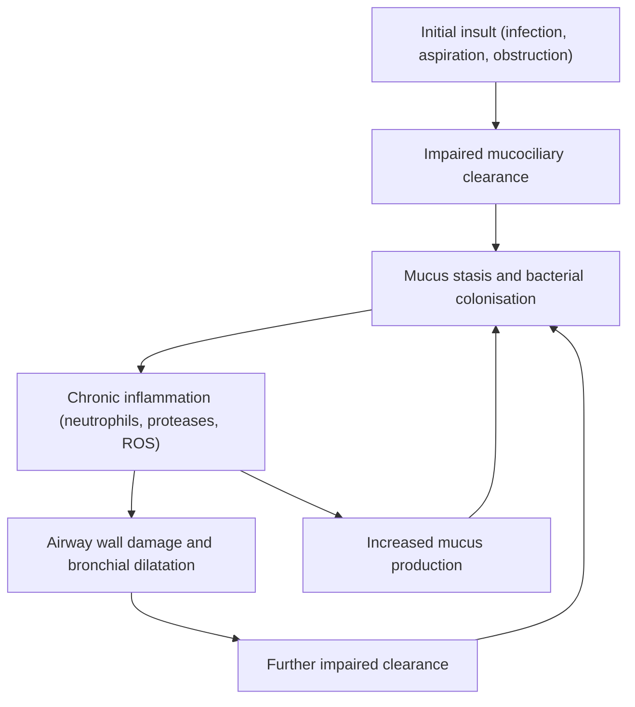
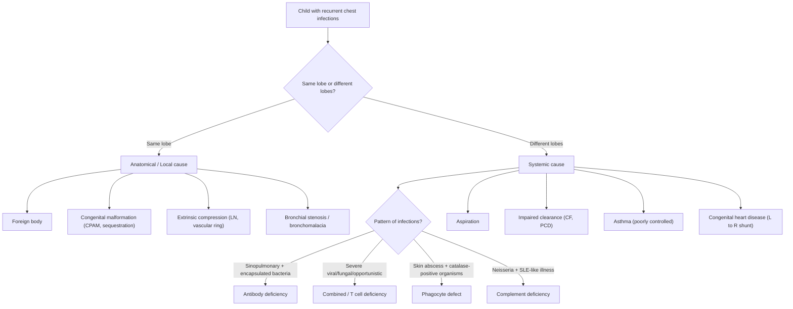

## Definition

**Recurrent chest infections** (also called **recurrent pneumonia** when referring to lower respiratory tract involvement) in paediatrics is defined as **≥2 episodes of pneumonia in a single year, or ≥3 episodes at any time, with radiographic clearing between episodes** [1][2]. This is a critical distinction — the chest X-ray must normalise between episodes to confirm that each is a *new* event rather than a single non-resolving infection.

The term "recurrent chest infections" is broader and may encompass recurrent lower respiratory tract infections (LRTIs) including pneumonia, bronchitis, and bronchiolitis, particularly when a child presents repeatedly with cough, fever, and respiratory distress requiring medical attention.

> **Why does this matter?** A child with "unresolving pneumonia" (persistent CXR changes) has a different differential diagnosis (e.g., foreign body, congenital pulmonary airway malformation, TB) from one with true recurrent infections (where clearing between episodes points towards host susceptibility — immune deficiency, aspiration, structural anomaly, or ciliary dysfunction).

<Callout title="Key Definition" type="idea">
Recurrent pneumonia = ≥2 episodes/year OR ≥3 episodes ever, with **radiographic clearing in between**. If the CXR never clears, think non-resolving pneumonia — a different workup entirely.
</Callout>

---

## Epidemiology

### Normal recurrent infections in childhood

***8 to 10 URTIs per year in young children can be normal, provided there is no end-organ damage*** [3]. This is especially true for children:
- ***Just starting to go to nursery*** [3]
- ***With many siblings at home*** [3]

***Recurrent infections are common in childhood. Infections in healthy children are usually: of short duration, self-limited, uncomplicated, and the child is healthy in between episodes*** [3].

The **majority (~50%) of children** with recurrent infections are **normal and healthy** [1]. Risk factors for frequent but normal infections include daycare/school attendance, older siblings, exposure to passive smoke, and the natural immaturity of the developing immune system.

### Recurrent pneumonia specifically

- Recurrent pneumonia accounts for roughly **6–9%** of all childhood pneumonia cases
- It is more common in children < 5 years (immature immune system, smaller airways, higher exposure)
- In Hong Kong, respiratory infections remain a major cause of paediatric hospitalisation
- Boys are slightly more affected than girls (reflecting the slight male predominance in childhood respiratory disease and asthma)

### Risk Factors

| Category | Examples |
|---|---|
| Age | Young children (< 5y) — immature adaptive immunity, smaller airways |
| Environmental | Daycare attendance, crowded living (HK high-density housing), passive tobacco smoke, air pollution |
| Atopy/Asthma | Underlying asthma with airway inflammation and mucus hypersecretion |
| Nutritional | Malnutrition, micronutrient deficiency (zinc, vitamin A) |
| Anatomical | Congenital lung malformations, vascular rings, tracheo-oesophageal fistula |
| Neurological | Cerebral palsy, bulbar dysfunction → aspiration |
| Immunodeficiency | Primary (inborn errors of immunity) or secondary (HIV, nephrotic syndrome, immunosuppressants) |
| Genetic | Cystic fibrosis, primary ciliary dyskinesia |

---

## Anatomy and Function — Why the Paediatric Airway Is Vulnerable

Understanding *why* children get recurrent chest infections requires appreciating the unique paediatric respiratory anatomy and immune physiology:

### Airway anatomy
1. **Smaller airway calibre**: Poiseuille's law tells us that resistance ∝ 1/r⁴. A 1mm reduction in radius in a child's already-small bronchiole causes a proportionally much greater increase in resistance (and therefore mucus trapping) than the same reduction in an adult.
2. **More compliant chest wall**: The infant's rib cage is more cartilaginous and horizontally oriented → less effective cough generation → poorer secretion clearance.
3. **Relatively large tongue and adenoids**: Contribute to upper airway obstruction and mouth breathing, bypassing the nasal filtering/warming/humidifying function.
4. **Shorter, more horizontal Eustachian tubes**: Predispose to otitis media (relevant because sinopulmonary infections often co-occur).

### Mucociliary clearance
The respiratory epithelium is lined with ciliated pseudostratified columnar epithelium. Cilia beat in a coordinated metachronal wave to propel mucus (with trapped pathogens and debris) upward toward the pharynx ("mucociliary escalator"). Any defect in:
- **Cilia structure/function** (primary ciliary dyskinesia) → stasis of secretions → bacterial colonisation → recurrent infection
- **Mucus composition** (cystic fibrosis — dehydrated, viscous mucus due to CFTR dysfunction) → impaired clearance → chronic infection
- **Mucosal integrity** (post-viral damage, chronic inflammation) → reduced clearance

### Immune system maturation
- **Maternal IgG** crosses the placenta and provides passive protection for the first ~4–6 months of life, then wanes
- **IgA** (the dominant mucosal immunoglobulin) does not reach adult levels until ~6–8 years
- **T cell function** is relatively naive in infancy; thymic output is maximal in early childhood but the repertoire is limited
- This means that the period from **6 months to ~5 years** is a physiological "window of vulnerability" for infections — and this is precisely when primary immunodeficiencies (especially **antibody deficiencies**) tend to declare themselves

### Lung defence mechanisms (layered)
| Level | Mechanism | Failure → |
|---|---|---|
| Mechanical | Cough reflex, epiglottic closure, mucociliary clearance | Aspiration, mucus stasis |
| Innate | Alveolar macrophages, neutrophils, complement, surfactant proteins (SP-A, SP-D) | Phagocyte defects, complement deficiency |
| Adaptive | Secretory IgA, IgG in alveolar lining fluid, T cell surveillance | Antibody deficiency, combined immunodeficiency |

---

## Aetiology (Focus on Hong Kong)

The causes of recurrent chest infections in children can be systematically divided. A useful framework is:

***Causes of recurrent infections:*** [1][3]
1. ***Non-immunologic defects***
2. ***Secondary immunodeficiencies (e.g., HIV, measles, chemo, cancer, malnutrition)*** [3]
3. ***Primary immunodeficiencies (i.e., inborn errors of immunity)*** [3]

### A. Non-Immunologic Defects

These are structural, mechanical, or functional problems that impair local lung defence without affecting the systemic immune system.

#### 1. Obstruction to Airflow

***Obstruction to flow*** [1]:
- ***Bronchial obstruction → recurrent pneumonia of the same lobe*** [1]
- ***Eustachian tube obstruction → recurrent otitis media*** [1]

| Cause | Mechanism | Clinical Clue |
|---|---|---|
| **Foreign body aspiration** | Partial obstruction → ball-valve effect → distal air trapping, atelectasis, post-obstructive pneumonia | Sudden onset cough/wheeze in a toddler, **recurrent pneumonia in same lobe** (classically RLL or RML due to the more vertical right main bronchus) |
| **Congenital pulmonary airway malformation (CPAM)** | Abnormal cystic/solid lung tissue that does not participate in gas exchange; acts as nidus for infection | Recurrent infections in same region; prenatal USS may show lesion |
| **Pulmonary sequestration** | Aberrant lung tissue with systemic arterial supply, no connection to tracheobronchial tree (intralobar) or its own pleural covering (extralobar); acts as "dead space" | Recurrent LLL pneumonia, often with air-fluid levels on imaging |
| **Vascular ring/sling** | Anomalous great vessels compress trachea/bronchi | Stridor, feeding difficulties, recurrent wheeze/infections |
| **Mediastinal lymphadenopathy** | TB (very relevant in HK), lymphoma → extrinsic bronchial compression | Persistent cough, weight loss, contact history |
| **Bronchial stenosis / bronchomalacia** | Congenital narrowing or excessive airway collapse → distal mucus trapping | Persistent wheeze, recurrent infections in same territory |

> **Hong Kong context**: Foreign body aspiration (peanuts, small toy parts) is an important and **treatable** cause — always ask about choking episodes. TB-related mediastinal lymphadenopathy causing bronchial compression is also relatively more common in HK than in many Western countries.

#### 2. Impaired Clearance Mechanisms

***Inadequate clearance*** [1]:
- ***Primary ciliary dyskinesia (PCD) → bronchiectasis*** [1]

***Abnormal mucus production*** [1]

| Cause | Mechanism |
|---|---|
| **Primary ciliary dyskinesia (PCD)** | Autosomal recessive; abnormal ciliary ultrastructure (dynein arm defects) → immotile or dyskinetic cilia → failed mucociliary clearance. ~50% have **Kartagener syndrome** (situs inversus + chronic sinusitis + bronchiectasis) [2] |
| **Cystic fibrosis (CF)** | CFTR mutation → defective Cl⁻ channel → dehydrated, viscous airway surface liquid → impaired mucociliary clearance → chronic infection [2] |

#### 3. Recurrent Aspiration

***CNS abnormalities → recurrent aspiration*** [1]

| Cause | Mechanism | Clinical Clue |
|---|---|---|
| **Neurodevelopmental disorders** (cerebral palsy, global developmental delay) | Poor oromotor coordination, impaired swallow reflex, poor airway protection | Cough/choking with feeds, ***feeding difficulties*** [4], recurrent RLL pneumonia |
| **Gastro-oesophageal reflux disease (GORD)** | Acid + particulate reflux → aspiration, especially during sleep | Vomiting, irritability, poor weight gain in infants; chronic cough, recurrent wheeze |
| **Tracheo-oesophageal fistula (TOF/TEF)** | Abnormal connection between trachea and oesophagus → feeds enter airway | ***Recurrent pneumonia*** [4]; usually diagnosed in neonatal period but H-type fistula may present late |
| **Laryngeal cleft** | Defect in posterior cricoid cartilage → aspiration | Stridor, feeding difficulties, chronic cough |
| **Cleft palate (submucous)** | Impaired velopharyngeal closure → nasopharyngeal reflux and aspiration | Nasal regurgitation, chronic cough |

#### 4. Foreign Bodies (Retained)

***Foreign body*** (including ***VP shunt, prosthetic valve, central line, indwelling catheter***) [1] — these act as nidi for biofilm formation and recurrent infection.

#### 5. Damaged Barriers

***Damaged barrier*** [1]:
- ***Burn, sinus tract, open fracture → pyogenic infection***
- ***Midline/middle ear defect → recurrent meningitis***

In the context of recurrent chest infections, consider **congenital dermal sinuses** communicating with the airway (rare) or **chest wall defects** post-surgery.

### B. Secondary Immunodeficiency

***Secondary immunodeficiencies (e.g., HIV, measles, chemo, cancer, malnutrition)*** [3]

| Cause | Mechanism | HK Relevance |
|---|---|---|
| **Malnutrition** | Impaired cell-mediated immunity, reduced secretory IgA, complement dysfunction | Less common in HK but seen in neglect, chronic illness, eating disorders |
| **HIV** | CD4+ T cell depletion → opportunistic infections | Rare in HK paediatrics but must be considered; vertical transmission possible |
| **Nephrotic syndrome** | Urinary loss of IgG and complement factor B → susceptibility to encapsulated bacteria | Relevant — nephrotic syndrome is not uncommon in HK children |
| **Iatrogenic** | Corticosteroids, immunosuppressants, chemotherapy, post-splenectomy | Children on chronic steroids for asthma/nephrotic syndrome; post-splenectomy for haematological disorders |
| **Post-measles** | Measles virus causes transient but profound immunosuppression ("immune amnesia") for weeks-months | Measles outbreaks still occur; relevant in under-vaccinated children |
| **Malignancy** | Leukaemia/lymphoma → bone marrow infiltration → pancytopenia; solid tumours → cachexia | Always consider if recurrent infections + systemic symptoms (weight loss, pallor, bruising) |

### C. Primary Immunodeficiency (Inborn Errors of Immunity, IEI)

***Primary immunodeficiencies (i.e., inborn errors of immunity)*** [3]

***Now referred to as inborn errors of immunity (IEI)*** [1]. There are ***> 440 different diseases, occurring in ~1/4000 births (i.e., rare disease)*** [1].

The pattern of infections gives a strong clue to which arm of the immune system is defective:

#### Antibody (Humoral) Deficiency — Most Common Category (36.3%)

***Commonly cause sinopulmonary and GI infections*** — ***because (1) sites where most Ig deposits, (2) open to external environment*** [1]

***Timing: present after 4–6 months due to maternal IgG depletion*** [1]

***Common pathogens: encapsulated bacteria, Giardia, enterovirus*** [1]

| Condition | Genetics | Pathophysiology | Key Features |
|---|---|---|---|
| ***X-linked (Bruton) agammaglobulinaemia (XLA)*** | XLR | ***Abnormal Bruton tyrosine kinase (Btk) gene → essential for all stages of B cell development → ↓B cell maturation*** [1] | ***↓B cells, pan-hypo(γ)globulinaemia (hence absent tonsils, and immunisation being useless!)*** [1]; ***recurrent sinopulmonary infections since 6 months of age*** [3]; ***CT showing sinusitis, HRCT showing bronchiectasis*** [3] |
| ***Common variable immunodeficiency (CVID)*** | Variable | ***Impaired B cell differentiation → defective Ig production*** [1] | ***Most common form of severe antibody deficiency*** [1]; ***↓↓↓IgG, ↓IgA/E***; ***recurrent infections, autoimmune disease, malignancy*** [1] |
| ***Hyper IgM syndrome (HIGM)*** | XLR or AR | ***Failure to switch IgM to IgG/A*** [1] | ***↑IgM, ↓IgG/A/E*** [1]; recurrent sinopulmonary infections + opportunistic infections (PJP) if CD40L type |
| ***Selective IgA deficiency*** | Variable | Isolated deficiency of IgA | ***Most common PID; usually asymptomatic, may occasionally present with recurrent infections*** [1] |

> **Why sinopulmonary?** The respiratory and GI tracts are the body's largest mucosal surfaces in direct contact with the outside world. Secretory IgA is the first line of adaptive mucosal defence. When antibody production fails, these surfaces become the primary battleground.

#### Combined (T + B Cell) Deficiency (19.8%)

***Commonly cause severe ± unusual viral and fungal infections*** [1]

***Examples: severe bronchiolitis, oral thrush, PJP, disseminated CMV infection*** [1]

| Condition | Pathophysiology | Key Features |
|---|---|---|
| ***Severe combined immunodeficiency (SCID)*** | ***Heterogeneous group with impaired B and T cell development*** [1] | ***Fatal without treatment***; ***present with FTT, recurrent severe infections***; ***↓ALC, absent thymus shadow on CXR*** [1] |
| ***Wiskott-Aldrich syndrome (WAS)*** | WASp gene mutation → defective actin cytoskeleton in haematopoietic cells | ***Triad: immunodeficiency + thrombocytopenia + eczema*** [1] |
| ***DiGeorge syndrome*** | ***22q11.2 deletion → defective pharyngeal pouch development → hypoplastic thymus*** [1] | ***Triad: conotruncal cardiac anomalies + hypoplastic thymus (T cell deficiency) + hypoplastic parathyroid (hypoCa)*** [1] |
| ***Ataxia telangiectasia*** | ATM gene mutation → defective DNA repair | ***Cerebellar ataxia, developmental delay, ↑risk of lymphoma*** [1] |

#### Phagocyte Defects (14.9%)

***Commonly cause recurrent bacterial infections; common pathogens: skin commensals, fungi*** [1]

| Condition | Pathophysiology | Key Features |
|---|---|---|
| ***Chronic granulomatous disease (CGD)*** | ***Phagocytes fail to produce superoxide → inability to destroy microbes (especially catalase-positive)*** [1] | ***Recurrent pyogenic infections with granuloma formation; common sites: lung, skin, LNs, liver***; ***lymphadenitis, hepatosplenomegaly, skin/perianal abscess, TB/BCG dissemination*** [1] |
| ***Leukocyte adhesion deficiency (LAD)*** | ***Deficiency of neutrophil surface adhesion molecule (CD18) → inability to leave vasculature*** [1] | ***↑neutrophil count (trapped inside vessel); poor wound healing with absent pus formation; omphalitis with delayed umbilical cord separation*** [1] |

> **Why catalase-positive organisms in CGD?** Normal neutrophils use the NADPH oxidase system to generate superoxide → hydrogen peroxide to kill bacteria. Catalase-negative bacteria (e.g., Streptococcus) actually produce their own H₂O₂, which the neutrophil can "borrow" to kill them even without a working oxidative burst. But catalase-positive organisms (Staphylococcus, Aspergillus, Serratia, Nocardia, Burkholderia — mnemonic: **"SANK B"**) destroy their own H₂O₂ with catalase, so CGD neutrophils have no backup mechanism.

#### Complement Deficiency

***Commonly cause recurrent bacterial infections and SLE-like illness; common pathogens: encapsulated bacteria*** [1]

| Deficiency | Consequence |
|---|---|
| Early classical pathway (C1, C2, C4) | SLE-like illness (impaired immune complex clearance) + recurrent infections with encapsulated bacteria |
| C3 | Severe recurrent pyogenic infections (C3 is central to all three complement pathways) |
| Terminal pathway (C5–C9) | Recurrent Neisseria (meningococcal/gonococcal) infections — MAC formation is essential for killing Neisseria |
| Mannose-binding lectin (MBL) | Recurrent infections in early childhood (common, usually mild) |

### D. Other Important Aetiologies in HK

| Cause | Mechanism | Notes |
|---|---|---|
| **Asthma (poorly controlled)** | Chronic airway inflammation, mucus plugging, corticosteroid use (local immunosuppression), airway remodelling | Most common chronic respiratory disease in HK children [2]; ***sometimes "recurrent pneumonia" may merely reflect frequent URTI or asthma*** [3] |
| **Tuberculosis** | Can mimic or cause recurrent pneumonia via endobronchial disease, lymph node compression, cavitation | HK is intermediate-endemic; always consider |
| **Congenital heart disease** | Pulmonary overcirculation (L→R shunts: VSD, ASD, PDA) → pulmonary oedema → impaired gas exchange and clearance → recurrent LRTIs | Very relevant to paediatrics |
| **Bronchiectasis (established)** | Dilated, damaged airways → impaired clearance → chronic colonisation → recurrent exacerbations | End-result of many of the above causes |

---

## Pathophysiology — The Vicious Cycle

Regardless of the underlying aetiology, recurrent chest infections share a common final pathway — Cole's "vicious cycle" hypothesis of bronchiectasis:

This explains why **early identification and treatment of the underlying cause is critical** — once the cycle is established, bronchiectasis becomes irreversible.

---

## Classification

### By Anatomical Pattern of Recurrence

| Pattern | Interpretation | Likely Causes |
|---|---|---|
| **Same lobe every time** | ***Recurrence in the same region → look for anatomical anomalies and RFs for aspiration*** [5] | Foreign body, bronchial stenosis, CPAM, sequestration, extrinsic compression (LN, tumour, vascular ring) |
| **Different lobes each time** | ***Recurrence in different regions → look for underlying systemic factors*** [5] | Immunodeficiency, PCD, CF, aspiration, asthma |

### By Underlying Mechanism

| Mechanism | Examples |
|---|---|
| **Structural/anatomical** | Foreign body, CPAM, sequestration, vascular ring, bronchial stenosis, bronchomalacia |
| **Impaired clearance** | PCD, CF, bronchiectasis |
| **Recurrent aspiration** | GORD, neurodevelopmental disorders, TOF, laryngeal cleft |
| **Immune deficiency** | Primary (IEI) or secondary |
| **Airway inflammation** | Asthma, allergic bronchopulmonary aspergillosis (ABPA) |
| **Increased pulmonary blood flow** | Congenital heart disease with L→R shunt |

### By Immune System Component (for PID)

***IUIS PID classification*** [1]:
1. ***Combined immunodeficiency (CID)***
2. ***CID with associated/syndromic features***
3. ***Humoral (Ab) deficiency***
4. ***Immune dysregulation***
5. ***Phagocyte defect***
6. ***Intrinsic and innate immunity***
7. ***Autoinflammatory disorder***
8. ***Complement deficiency***
9. ***Bone marrow failure***
10. ***Phenocopies of PID***

---

## Clinical Features

### Symptoms

The clinical presentation depends on the underlying cause, but the presenting complaint is almost always **cough** — and the character of that cough is highly informative.

#### Cough Characteristics and Their Pathophysiological Basis

| Symptom | Pathophysiological Basis | Suggests |
|---|---|---|
| ***Daily moist/productive cough*** [4] | Active airway secretion/pus production from chronic bacterial infection of damaged airways | ***Suppurative lung disease*** [4] — bronchiectasis, CF, PCD |
| Paroxysmal cough with whooping | Post-tussive vomiting from forceful cough against closed glottis | Pertussis, post-infectious cough |
| Dry cough worse at night | Vagal-mediated bronchoconstriction in recumbent position; post-nasal drip | Asthma, GORD |
| Cough with feeds/immediately after eating | Aspiration of food/liquid into airway stimulating cough reflex | Aspiration (TOF, GORD, swallowing dysfunction) |
| Barking/croupy cough | Subglottic inflammation/oedema | Recurrent croup (consider subglottic stenosis or haemangioma if truly recurrent) |
| Chronic cough with copious purulent sputum ± haemoptysis | Bronchial wall destruction with erosion into bronchial arteries | Bronchiectasis (CF, PCD, post-infectious) |

#### Respiratory Symptoms

| Symptom | Basis |
|---|---|
| **Recurrent fever** | Inflammatory response to pulmonary infection; cytokine release (IL-1, IL-6, TNF-α) resets hypothalamic set point |
| **Tachypnoea/dyspnoea** | V/Q mismatch from consolidation/atelectasis → hypoxaemia → chemoreceptor-driven respiratory drive |
| ***Wheeze*** [4] | ***Intrathoracic airway lesion (e.g., asthma, foreign body)*** [4]; turbulent airflow through narrowed airways |
| **Chest tightness** | Bronchospasm, pleural inflammation |
| ***Chest pain*** [4] | ***Arrhythmia, asthma, increased respiratory distress (parenchymal disease)*** [4] |
| **Haemoptysis** | Erosion of inflamed/damaged airway wall into hypertrophied bronchial arteries (especially in bronchiectasis) |

#### Systemic Symptoms

| Symptom | Basis |
|---|---|
| ***Failure to thrive / poor weight gain*** [4] | ***Serious systemic including pulmonary illness*** [4]; increased metabolic demand from chronic infection + poor intake + malabsorption (if CF) |
| ***Feeding difficulties*** [4] | ***Serious systemic including pulmonary illness, aspiration*** [4] |
| **Chronic diarrhoea / steatorrhoea** | Pancreatic exocrine insufficiency (CF) or GI infections (antibody deficiency — *Giardia*) |
| **Recurrent otitis media / sinusitis** | Shared mucosal immune deficiency (IgA deficiency, XLA, PCD); Eustachian tube dysfunction |
| ***Persistent thrush after age 1*** [3] | T cell / combined immunodeficiency — Candida is normally controlled by cell-mediated immunity |
| **Recurrent skin abscesses** | Phagocyte defect (CGD, LAD) or Hyper-IgE syndrome |
| **Easy bruising / petechiae** | Wiskott-Aldrich syndrome (thrombocytopenia); leukaemia |

#### Red Flag Symptoms Suggesting Underlying Cause

***10 warning signs of IEI (Jeffrey Modell Foundation)*** [3]:
1. ***Eight or more new ear infections within 1 year***
2. ***Two or more serious sinus infections within 1 year***
3. ***Two or more months on antibiotics with little effect***
4. ***Two or more pneumonias within 1 year***
5. ***Failure of an infant to gain weight or grow normally***
6. ***Recurrent, deep skin or organ abscesses***
7. ***Persistent thrush in mouth or elsewhere on skin, after age 1***
8. ***Need for intravenous antibiotics to clear infections***
9. ***Two or more deep-seated infections***
10. ***A family history of IEI***

***Not a comprehensive list — do not exclude patients based on 10 warning signs. Patients could present with non-infectious phenotypes*** [3].

***Note: Any rare immunological phenomenon can have a monogenic basis (i.e., be an IEI). Some patients may present without a history of recurrent or opportunistic infections*** [3].

<Callout title="Exam Pearl" type="error">
***Sometimes "recurrent pneumonia" may merely reflect frequent URTI or asthma*** [3]. Always confirm with CXR that there was genuine parenchymal disease with clearing between episodes before launching into an extensive immunodeficiency workup.
</Callout>

### Signs

#### Respiratory Examination

| Sign | Pathophysiological Basis | Suggests |
|---|---|---|
| ***Digital clubbing*** [4] | ***Chronic suppurative lung disease*** [4]; mechanism debated but likely involves megakaryocyte fragments bypassing the pulmonary capillary filter (due to R→L shunting or bronchial-pulmonary anastomoses) → platelet-derived growth factor (PDGF) release in nail bed | CF, bronchiectasis, chronic empyema, congenital heart disease |
| ***Chest wall deformity*** (Harrison's sulci, pectus carinatum, hyperinflation) [4] | ***Chronic airway or parenchymal disease*** [4]; chronic air trapping → hyperinflation → outward pressure on compliant paediatric thorax | Chronic asthma, CF, bronchiectasis |
| ***Crepitations (crackles)*** [4] | ***Parenchymal disease*** [4]; opening of collapsed alveoli or air bubbling through secretions/fluid | Consolidation, bronchiectasis, interstitial lung disease |
| **Coarse inspiratory crackles** | Airway secretions in large/medium airways | Bronchiectasis, CF |
| **Fine end-inspiratory crackles** | Alveolar disease (fluid/fibrosis) | Interstitial lung disease, pulmonary oedema |
| **Wheeze (expiratory)** | Narrowed intrathoracic airways oscillating during expiration | Asthma, foreign body (unilateral), CF |
| **Stridor (inspiratory)** | Narrowed extrathoracic/upper airway | Vascular ring, subglottic stenosis, laryngomalacia |
| **Unilateral reduced air entry** | Lobar collapse, effusion, or foreign body | Depends on context |
| ***Hypoxia/cyanosis*** [4] | ***Airway or parenchymal disease, cardiac disease*** [4]; V/Q mismatch or R→L shunt | Severe pneumonia, CHD, chronic lung disease |

#### Extra-Pulmonary Signs — Crucial Clues to the Underlying Cause

| Sign | What It Suggests | Why |
|---|---|---|
| **Absent tonsils / lymph nodes** | XLA (Bruton agammaglobulinaemia) | No B cells → no lymphoid tissue development |
| **Oral thrush (persistent, > 1 year)** | T cell / combined immunodeficiency | Candida clearance depends on T cell immunity |
| **Eczema + petechiae** | Wiskott-Aldrich syndrome | Thrombocytopenia + immune dysregulation + eczema |
| **Situs inversus** (dextrocardia on examination) | Primary ciliary dyskinesia (Kartagener syndrome) | Embryonic ciliary motility determines L-R lateralisation; absent/dysfunctional cilia → 50% chance of situs inversus |
| **Conotruncal cardiac murmur + dysmorphic facies** | DiGeorge syndrome (22q11.2 deletion) | Defective pharyngeal pouch development → cardiac + thymic + parathyroid anomalies |
| ***Neurodevelopmental abnormality*** [4] | ***Aspiration lung disease*** [4] | Poor oromotor coordination → chronic aspiration |
| **Hepatosplenomegaly + lymphadenopathy** | CGD, malignancy, storage disorders | Granuloma formation (CGD) or infiltration (leukaemia/lymphoma) |
| **Delayed umbilical cord separation** | Leukocyte adhesion deficiency | Neutrophils cannot migrate out of vessels → cannot mediate cord separation (which requires local inflammation) |
| **Perianal / skin abscesses** | CGD, Hyper-IgE syndrome | Phagocyte dysfunction → inability to contain catalase-positive organisms |
| **Nasal polyps (in a child)** | CF, PCD | Chronic sinus inflammation; nasal polyps are **unusual** in children and should always prompt investigation |
| **Poor growth / FTT** | CF, immunodeficiency, chronic disease, malignancy | Increased metabolic demand ± malabsorption ± anorexia |

<Callout title="Clinical Pearl">
A child with **recurrent sinopulmonary infections + bronchiectasis + situs inversus** = Primary Ciliary Dyskinesia (Kartagener syndrome) until proven otherwise. A child with **recurrent sinopulmonary infections + steatorrhoea + clubbing** = Cystic Fibrosis until proven otherwise. A child with **recurrent sinopulmonary infections + absent tonsils + panhypogammaglobulinaemia** presenting after 6 months = X-linked agammaglobulinaemia.
</Callout>

### History — What to Ask

***Past medical history: Document in detail any past medical concerns. Note IEIs can affect many different organs*** [3]:
1. ***Infections (recurrent, opportunistic or live vaccine complications)*** [3]
2. ***Autoinflammation, autoimmunity, e.g., IBD, AIHA, arthritis*** [3]
3. ***Non-malignant lymphoproliferation*** [3]
4. ***Atopy*** [3]
5. ***Cancer, e.g., lymphoma*** [3]

Specific history points:

| Domain | Key Questions | Rationale |
|---|---|---|
| **Infection history** | How many episodes? Which lobes? Required IV antibiotics? ICU admissions? Organisms isolated? | Severity and pattern guide differential |
| **Between episodes** | Is the child completely well? Any chronic cough? | Well between → likely structural/intermittent; never fully well → chronic disease (CF, bronchiectasis, immunodeficiency) |
| **Feeding/swallowing** | Coughing/choking with feeds? Nasal regurgitation? Vomiting? | Aspiration aetiology |
| **Growth** | Plot height and weight on growth chart | FTT = red flag for chronic disease |
| **Birth history** | Prematurity (BPD)? Neonatal respiratory distress? Meconium ileus? Delayed cord separation? | CF (meconium ileus), LAD (delayed cord separation), CHD, TOF |
| **Family history** | Consanguinity? Deaths in infancy? Known immunodeficiency? CF carrier status? | AR conditions (CF, PCD, SCID, CGD) |
| **Vaccination history** | Any adverse reaction to live vaccines (BCG, OPV, MMR, varicella)? | Disseminated BCG → CGD or SCID; live vaccine complications = red flag for immunodeficiency |
| **Medications** | Chronic corticosteroids? Immunosuppressants? | Secondary immunodeficiency |
| **Social/environmental** | Daycare? Passive smoke? Pets? Housing conditions? TB contacts? | Environmental exposures |

---

## Approach Summary — Putting It Together

When a child presents with recurrent chest infections, think systematically:

<Callout title="High Yield Summary">

**Recurrent chest infections in paediatrics:**

1. **Definition**: ≥2 pneumonias/year or ≥3 ever, with CXR clearing between episodes.

2. **Normal children can have 8–10 URTIs/year** — this is usually benign if self-limiting and uncomplicated.

3. **Three major categories of causes**: Non-immunologic defects, secondary immunodeficiency, primary immunodeficiency (IEI).

4. **Same-lobe recurrence → local/anatomical cause** (foreign body, CPAM, sequestration, bronchial compression). **Different-lobe recurrence → systemic cause** (immune deficiency, CF, PCD, aspiration).

5. **Antibody deficiencies** are the most common PID (~36%); present after 4–6 months when maternal IgG wanes; cause sinopulmonary infections with encapsulated bacteria.

6. **Combined immunodeficiencies** (SCID) present early with severe, unusual, opportunistic infections and are **fatal without treatment**.

7. **Phagocyte defects** (CGD) → catalase-positive organism infections (Staph, Aspergillus, Serratia, Nocardia, Klebsiella, Burkholderia).

8. **Key clinical clues**: absent tonsils (XLA), situs inversus (PCD/Kartagener), persistent thrush (T cell deficiency), delayed cord separation (LAD), FTT + steatorrhoea (CF), eczema + thrombocytopenia (WAS).

9. **10 Warning Signs of IEI** (Jeffrey Modell Foundation) — not comprehensive but useful screening tool.

10. **Always confirm genuine pneumonia with CXR** — "recurrent pneumonia" may actually be recurrent URTI or poorly controlled asthma.

11. **CF classical triad**: ↑sweat Cl⁻ + recurrent lung infections + pancreatic insufficiency. **PCD**: chronic wet cough + chronic sinusitis ± situs inversus ± bronchiectasis.

12. **Vicious cycle**: Infection → inflammation → airway damage → impaired clearance → more infection → bronchiectasis (irreversible). Early diagnosis and treatment breaks this cycle.

</Callout>

---

<ActiveRecallQuiz
  title="Active Recall - Recurrent Chest Infections in Children"
  items={[
    {
      question: "What is the definition of recurrent pneumonia in children, and what radiological criterion must be met?",
      markscheme: "2 or more episodes in 1 year OR 3 or more episodes ever, WITH radiographic clearing between episodes (confirming each is a new event, not non-resolving pneumonia)."
    },
    {
      question: "A child has recurrent pneumonia always affecting the right lower lobe. What is the most likely category of underlying cause and give three specific examples?",
      markscheme: "Local anatomical cause. Examples: (1) aspirated foreign body, (2) bronchial stenosis/bronchomalacia, (3) extrinsic compression by lymph node (e.g. TB) or tumour, (4) congenital pulmonary airway malformation, (5) pulmonary sequestration. Any three suffices."
    },
    {
      question: "Why do antibody (humoral) deficiencies typically present after 4-6 months of age?",
      markscheme: "Maternal IgG crosses the placenta and provides passive protection. It has a half-life of approximately 21 days and wanes by 4-6 months, after which the infant must rely on their own antibody production. If B cell function is deficient, infections begin when this passive immunity declines."
    },
    {
      question: "Explain why patients with chronic granulomatous disease (CGD) are particularly susceptible to catalase-positive organisms.",
      markscheme: "CGD neutrophils cannot generate superoxide via NADPH oxidase, so they cannot produce H2O2. Catalase-negative organisms produce their own H2O2, which the neutrophil can use. But catalase-positive organisms (e.g. S. aureus, Aspergillus, Serratia, Nocardia, Burkholderia) destroy their own H2O2, leaving CGD neutrophils with no killing mechanism."
    },
    {
      question: "Name three clinical signs that would point towards primary ciliary dyskinesia (PCD) as the cause of recurrent chest infections.",
      markscheme: "Any three of: (1) situs inversus / dextrocardia, (2) chronic productive/wet cough since infancy, (3) chronic rhinosinusitis / nasal polyps, (4) bronchiectasis, (5) neonatal respiratory distress of unclear cause, (6) chronic middle ear disease/otitis media with effusion, (7) male infertility (immotile sperm, if adolescent)."
    },
    {
      question: "List the 10 warning signs of inborn errors of immunity (IEI) as per the Jeffrey Modell Foundation.",
      markscheme: "(1) 8+ new ear infections/year, (2) 2+ serious sinus infections/year, (3) 2+ months on antibiotics with little effect, (4) 2+ pneumonias/year, (5) Failure to gain weight/grow normally, (6) Recurrent deep skin/organ abscesses, (7) Persistent thrush after age 1, (8) Need for IV antibiotics to clear infections, (9) 2+ deep-seated infections, (10) Family history of IEI."
    }
  ]}
/>

## References

[1] Senior notes: Adrian Lui Pediatrics.pdf (p163, p167, p181, p183, p406, p410, p411)
[2] Senior notes: Ryan Ho Respiratory.pdf (p65, p67, p129)
[3] Lecture slides: GC 144. A child with recurrent infections Primary immunodeficiencies.pdf (p3, p4, p6, p12, p28)
[4] Lecture slides: GC 141. A child with cough acute and chronic cough in children.pdf (p20)
[5] Senior notes: Ryan Ho Respiratory.pdf (p67)
