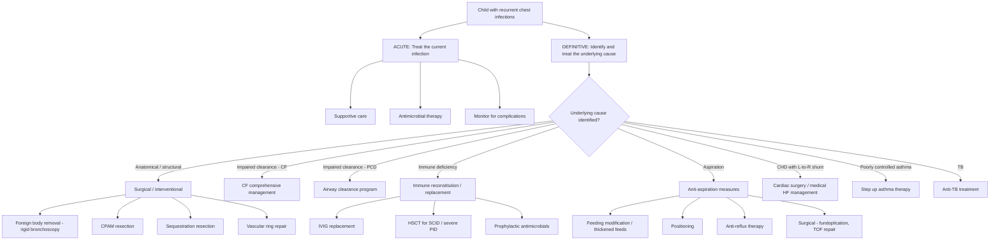

## Management Algorithm — Overview

The management of recurrent chest infections in children has **two fundamental components running in parallel**:

1. **Acute management** — Treating each individual infection episode effectively
2. **Definitive management** — Identifying and treating the underlying cause to *break the vicious cycle*

The key insight is this: **treating the acute infection alone is insufficient**. If you don't find and address the reason *why* the child keeps getting infected, you're treating symptoms while the disease (and lung damage) progresses.

---

## Acute Management of Each Infection Episode

Every episode of pneumonia in a child with recurrent chest infections requires appropriate acute treatment. The principles are the same as for any paediatric community-acquired pneumonia (CAP), with modifications based on the known underlying condition.

### 1. Supportive Care

***Supportive care is the mainstay of treatment*** [1].

| Measure | Rationale | Paediatric Specifics |
|---|---|---|
| ***Fluid support*** [1] | ***Higher fluid requirement due to fever, tachypnoea, reduced oral intake and vomiting*** [1]. Dehydration worsens mucus viscosity and impairs clearance | Oral fluids preferred; NG/IV if unable to maintain oral intake. Use Holliday-Segar for maintenance IV fluids (100 mL/kg/d for first 10 kg, 50 mL/kg/d for next 10 kg, 20 mL/kg/d thereafter). Avoid fluid overload — especially in CHD |
| ***Oxygen support*** [1] | Correct hypoxaemia from V/Q mismatch caused by consolidated lung | ***High flow O₂ ± CPAP, BiPAP*** [1]; target SpO₂ ≥ 92% (or ≥ 94% in infants < 6 months). Use nasal prongs for mild hypoxia, high-flow nasal cannula (HFNC) or CPAP for moderate respiratory distress |
| **Antipyretics** | Fever increases metabolic demand and fluid losses; comfort | Paracetamol 15 mg/kg Q4–6H (max 60 mg/kg/day) OR ibuprofen 5–10 mg/kg Q6–8H (if > 3 months, not dehydrated, no renal impairment) |
| **Nutritional support** | Sick children often eat poorly; malnutrition impairs immune function and respiratory muscle strength (***muscle wasting → respiratory muscle weakness → resp failure and chest infections*** [7]) | Encourage small frequent feeds; NG feeding if needed; monitor weight |
| **Chest physiotherapy** | ***Help expectoration in patient suppressing cough because of pleural pain*** [1]; mobilise secretions | Particularly important in CF, PCD, and bronchiectasis; less evidence in uncomplicated pneumonia |

### 2. Antimicrobial Therapy for Acute Episodes

The choice of antibiotic depends on the child's age, severity, likely pathogen (which is influenced by the underlying condition), and local resistance patterns.

#### Standard Paediatric CAP Empirical Therapy

***LRI pathogens: viral, bacterial (Streptococcus pneumoniae, Haemophilus influenzae, Pseudomonas if immunocompromised, Chlamydia if neonate)*** [4].

| Setting | Empirical Regimen | Paediatric Dosing | Rationale |
|---|---|---|---|
| **Mild CAP, outpatient** | PO amoxicillin (1st line) | 40–90 mg/kg/day in 2–3 divided doses × 5–7 days | Covers S. pneumoniae (most common bacterial cause); high-dose preferred if resistance suspected |
| **Mild CAP, atypical suspected** (school-age child) | PO macrolide (azithromycin or clarithromycin) | Azithromycin: 10 mg/kg Day 1, then 5 mg/kg Days 2–5; Clarithromycin: 7.5 mg/kg BD × 7–10 days | Covers Mycoplasma pneumoniae and Chlamydophila pneumoniae — more common in children > 5 years |
| **Moderate CAP, inpatient** | IV amoxicillin or IV ampicillin; add macrolide if atypical features | IV ampicillin 50 mg/kg Q6H | Step down to oral when clinically improving (afebrile 24–48H, tolerating oral) |
| **Severe CAP, inpatient** | IV co-amoxiclav (Augmentin) or IV ceftriaxone ± macrolide | IV co-amoxiclav 30 mg/kg Q8H; IV ceftriaxone 50 mg/kg once daily (max 2g) | Broader spectrum; ceftriaxone covers resistant pneumococcus and H. influenzae |

#### Modified Empirical Therapy Based on Underlying Condition

| Underlying Condition | Likely Pathogens | Preferred Empirical Therapy | Why |
|---|---|---|---|
| **Cystic fibrosis** | ***S. aureus, H. influenzae (early), P. aeruginosa, Burkholderia cepacia (late)*** [1] | ***Oral/IV antibiotics for respiratory infections*** [1]; anti-staphylococcal (flucloxacillin) + anti-pseudomonal (ciprofloxacin PO or IV piperacillin-tazobactam + tobramycin) based on sputum culture | CF airways are chronically colonised; always send sputum for culture and treat based on sensitivities. Burkholderia requires specialist input |
| **Primary immunodeficiency** | Encapsulated bacteria (Ab deficiency); opportunistic organisms (combined/T cell deficiency) | Broader spectrum + consider IV route; if combined ID → cover for PJP (co-trimoxazole), CMV (ganciclovir), fungi (fluconazole) | ***Need for intravenous antibiotics to clear infections*** [3] is a warning sign; immunocompromised children need more aggressive empirical cover |
| **Aspiration** | Oropharyngeal flora including anaerobes (Bacteroides, Fusobacterium), Streptococci, S. aureus | IV amoxicillin-clavulanate (Augmentin) or IV ampicillin-sulbactam (Unasyn); add metronidazole if suspect anaerobic component | Anaerobic coverage is essential for aspiration pneumonia; chemical pneumonitis from acid also needs treatment of superinfection |
| **Bronchiectasis (established)** | H. influenzae, Moraxella catarrhalis, S. aureus, P. aeruginosa | Sputum-guided therapy; empiric anti-pseudomonal if PsA colonised | ***Antibiotic therapy: generally recommend 10–14 days*** [8] for exacerbations |

<Callout title="Paediatric Antibiotic Prescribing — Key Principles">
1. **Always use weight-based dosing** — children are not small adults.
2. **Use paediatric formulations** — suspensions/syrups for young children who cannot swallow tablets (e.g., amoxicillin suspension 125 mg/5 mL or 250 mg/5 mL).
3. **Step down from IV to oral early** — when afebrile for 24–48H, tolerating oral, and clinically improving.
4. **Send cultures before antibiotics when possible** — sputum (if old enough), nasopharyngeal aspirate, blood culture.
5. **De-escalate** once sensitivities are known.
</Callout>

### 3. Follow-Up After Each Acute Episode

***Arrange clinical review 6 weeks later*** [1]. ***CXR if persistent symptoms or suspect underlying malignancy*** [1].

- **Resolution**: ***Fever resolves in several days but CXR takes weeks to months to resolve*** [1]
- **Delayed recovery** → consider: ***complications (abscess, parapneumonic effusion), alternative diagnosis (ILD, TB), underlying cause (obstruction, recurrent aspiration)*** [1]

---

## Definitive Management — Treating the Underlying Cause

This is where the real impact is made. The specific management depends entirely on the identified aetiology.

### A. Structural / Anatomical Causes

| Condition | Management | Details |
|---|---|---|
| **Foreign body** | **Rigid bronchoscopy — therapeutic removal** | This is a **time-critical intervention**. Rigid bronchoscopy allows both visualisation and extraction using optical forceps. Performed under general anaesthesia. Flexible bronchoscopy can diagnose but rigid is preferred for extraction (better airway control, larger instruments). Post-removal: short course antibiotics if secondary infection present |
| **CPAM** | **Surgical resection (lobectomy/segmentectomy)** | Even asymptomatic CPAMs are usually resected to prevent recurrent infection and (very small) malignancy risk (pleuropulmonary blastoma). Timing: usually elective at 3–6 months if asymptomatic; earlier if symptomatic/infected |
| **Pulmonary sequestration** | **Surgical resection** | Intralobar: lobectomy (shares pleura with normal lung); Extralobar: simple excision (has own pleural covering). Must identify and ligate the anomalous systemic arterial supply (from aorta) to prevent catastrophic haemorrhage |
| **Vascular ring/sling** | **Surgical division/reimplantation** | Division of the ring (e.g., double aortic arch → divide the smaller arch) or reimplantation of the anomalous vessel (e.g., pulmonary artery sling → reimplant LPA to main PA). Often requires cardiothoracic surgical expertise |
| **Bronchial stenosis** | **Balloon bronchoplasty or surgical resection** | Bronchoscopic balloon dilatation for short-segment stenosis; surgical resection and reanastomosis for longer segments; stenting rarely used in children due to growth |
| **Extrinsic compression (TB lymphadenopathy)** | **Anti-TB therapy** ± corticosteroids for airway compression | Standard 4-drug regimen (RHZE) modified for children (see TB section below); corticosteroids reduce inflammatory lymph node bulk |

### B. Cystic Fibrosis — Comprehensive Management

CF management is **multidisciplinary** and requires a dedicated CF centre. The goal is to slow the vicious cycle of infection → inflammation → lung damage.

***Avoid contact between CF patients*** [1] ***to prevent cross-infection.***

#### Respiratory Management

| Modality | Details | Mechanism |
|---|---|---|
| ***Chest physiotherapy twice daily*** [1] | ***Postural drainage, controlled deep breathing exercise*** [1]; active cycle of breathing technique; positive expiratory pressure (PEP) devices; exercise | Gravity-assisted drainage + forced expiratory manoeuvres mobilise viscid mucus from airways |
| ***Nebulised mucolytics*** [1] | ***DNase (dornase alfa), hypertonic saline*** [1] | DNase: cleaves extracellular DNA in sputum (from dead neutrophils) → reduces viscosity. Hypertonic saline: osmotically draws water into airways → hydrates airway surface liquid → improves clearance |
| ***Bronchodilator*** [1] | Salbutamol nebulised before physiotherapy | Opens airways to allow better drainage of secretions; some CF patients have reactive airways |
| ***Oral/IV antibiotics for respiratory infections*** [1] | Culture-guided; anti-pseudomonal if PsA colonised | Treat acute exacerbations aggressively; chronic suppressive antibiotics (e.g., inhaled tobramycin alternating months) to reduce bacterial load |
| ***CFTR modulators*** [1] | ***Can be classified into 3 classes: potentiator, corrector, amplifier*** [1] | |

#### CFTR Modulators — Game-Changing Therapy

***CFTR potentiator, e.g., ivacaftor*** [1]: ***enables CFTR protein at cell surface to function more effectively as chloride channel*** [1]

***CFTR corrector, e.g., lumacaftor, tezacaftor, elexacaftor*** [1]: ***helps CFTR protein fold correctly and get to cell surface*** [1]

***Recent studies show that triple therapy of 2 correctors + 1 potentiator shows excellent results*** [1] — specifically **elexacaftor/tezacaftor/ivacaftor (Trikafta/Kaftrio)**, which is effective for patients with **at least one Phe508del allele** (~90% of CF patients). This is a revolutionary advance — improves FEV₁ by ~14%, reduces pulmonary exacerbations by ~63%, and dramatically improves quality of life.

| Drug | Class | Indication |
|---|---|---|
| Ivacaftor | Potentiator | Gating mutations (e.g., G551D) — ages ≥ 4 months |
| Lumacaftor/ivacaftor | Corrector + potentiator | Phe508del homozygous — ages ≥ 2 years |
| Tezacaftor/ivacaftor | Corrector + potentiator | Phe508del homozygous or certain residual function mutations — ages ≥ 6 years |
| **Elexacaftor/tezacaftor/ivacaftor** | **2 correctors + 1 potentiator** | **At least 1 Phe508del allele — ages ≥ 2 years (extended 2024)** |

#### Nutritional Management

***Assess dietary status regularly*** [1]:

| Modality | Details |
|---|---|
| ***Pancreatic replacement therapy*** [1] | ***Oral enteric-coated (e.g., Creon)*** [1] — taken with all meals and snacks. Dose adjusted to stool output and fat content of meals |
| ***Fat-soluble vitamin supplementation*** [1] | ***Vitamin A/D/E/K*** [1] — because pancreatic insufficiency → fat malabsorption → deficiency of fat-soluble vitamins |
| **High-calorie diet** | CF patients need 120–150% of normal caloric intake due to increased metabolic demand from chronic infection + malabsorption |
| ***± Nutritional supplementation ± gastrostomy feeding if additional calories required*** [1] | PEG/gastrostomy for severe FTT despite oral supplements |

#### CF Complications Screening

| Complication | Screening | Management |
|---|---|---|
| ***CF-related diabetes (CFRD)*** [1] | ***ALL children > 10 years screened annually*** [1] with OGTT | ***Insulin*** [1] (not metformin — CFRD is primarily insulin-deficient) |
| ***Liver disease (33%)*** [1] | LFTs, USS abdomen | ***Ursodeoxycholic acid (↑bile flow)*** [1] |
| ***Infertility (~100% males)*** [1] | Counselling in adolescence | ***Absent vas deferens*** [1]; assisted reproduction may be possible |
| ***Nasal polyps, sinusitis*** [1] | Clinical assessment | Intranasal steroids ± polypectomy |

### C. Primary Ciliary Dyskinesia (PCD)

***Management: as in other causes of bronchiectasis*** [1].

| Modality | Details | Rationale |
|---|---|---|
| **Airway clearance** | Chest physiotherapy ≥ twice daily; positive expiratory pressure devices; regular exercise | Compensate for absent mucociliary clearance with mechanical clearance techniques |
| **Prompt antibiotic treatment** of infections | Culture-guided; treat exacerbations for 10–14 days | Prevent progressive airway damage; PCD patients colonise with similar organisms to CF (H. influenzae, S. pneumoniae, later P. aeruginosa) |
| **Long-term macrolide therapy** | Azithromycin 3×/week for immunomodulatory effect | Reduces airway inflammation and exacerbation frequency (as in bronchiectasis management [8]) |
| **ENT management** | Hearing aids for conductive hearing loss (chronic OME); sinus surgery for refractory sinusitis | Chronic middle ear effusions from impaired mucociliary clearance in Eustachian tube |
| **Avoid smoking / passive smoke** | Environmental control | No cilia to compensate → any additional insult is devastating |

<Callout title="PCD vs CF Management — Similarities and Differences" type="idea">
Both require aggressive airway clearance and prompt antibiotic treatment of infections. Key differences: **CF** has CFTR modulators (game-changing), pancreatic replacement, and high-calorie diet needs. **PCD** has significant ENT disease requiring hearing aids and sinus surgery. Neither should use cough suppressants — the cough is the patient's only effective clearance mechanism.
</Callout>

### D. Primary Immunodeficiency — Immune Reconstitution/Replacement

| Treatment | Indication | Details | Contraindications/Cautions |
|---|---|---|---|
| ***IVIG replacement*** [3] | ***XLA (started on regular IVIG)*** [3]; CVID; Hyper-IgM syndrome; any significant antibody deficiency with recurrent infections | ***IVIG replacement in a group of Chinese boys with XLA*** [3] showed improved growth and reduced infections. Dose: 0.4–0.6 g/kg every 3–4 weeks IV (or subcutaneous Ig weekly as alternative). Target: trough IgG > 5–8 g/L | ***Urticaria after 1st dose IVIG*** [3] — pre-medicate with antihistamine and slow infusion rate; IgA-deficient patients with anti-IgA antibodies → use IgA-depleted products or subcutaneous route; avoid in heart failure (fluid volume) |
| **Haematopoietic stem cell transplant (HSCT)** | **SCID** (curative and urgent — mortality increases with delay); **CGD** (if severe/refractory); **WAS**; **LAD**; other severe PID | Only curative option for most severe PID. Donor: HLA-matched sibling (best), matched unrelated donor, haploidentical parent. Gene therapy now available for some SCID subtypes (ADA-SCID, X-SCID) | Pre-transplant conditioning carries risk of infection, organ toxicity. GvHD is a significant risk with mismatched donors |
| **Prophylactic antimicrobials** | All severe PID until definitive treatment | Co-trimoxazole (PJP prophylaxis); fluconazole/itraconazole (fungal prophylaxis); aciclovir (HSV/VZV prophylaxis in T cell deficiency). **CGD**: itraconazole + co-trimoxazole long-term | Check G6PD before co-trimoxazole; monitor LFTs with azoles |
| **Interferon-gamma** | **CGD** — as adjunct | Subcutaneous IFN-γ 3×/week reduces serious infections in CGD by ~70% | Flu-like symptoms common; not universally available |
| **Avoid live vaccines** | All significant PID (especially SCID, CGD, XLA) | ***BCG → SCID, CGD; OPV → SCID, XLA*** [1]. Live vaccines (BCG, OPV, rotavirus, MMR, varicella) can cause disseminated disease in immunodeficient children | Household contacts should receive inactivated vaccines when possible (IPV instead of OPV) |
| **Gene therapy** | ADA-SCID; X-linked SCID; some forms of CGD | Retroviral/lentiviral vector delivers corrected gene to patient's own stem cells; avoids GvHD risk | Still experimental for many conditions; risk of insertional mutagenesis (leukaemia) with older vectors |

<Callout title="SCID Is a Medical Emergency" type="error">
***SCID is fatal without treatment*** [1]. Once diagnosed (or strongly suspected — e.g., lymphopenic infant with severe infection and absent thymus), the child needs:
1. **Protective isolation** (reverse barrier nursing)
2. **Irradiated, CMV-negative blood products** (to prevent GvHD from donor lymphocytes and CMV transmission)
3. **PJP prophylaxis** (co-trimoxazole)
4. **Antifungal prophylaxis** (fluconazole)
5. **Urgent referral for HSCT** — outcomes are significantly better if transplant occurs before 3.5 months of age or before the first serious infection
6. **Avoid live vaccines** — these can be fatal
</Callout>

### E. Recurrent Aspiration — Anti-Aspiration Measures

| Modality | Indication | Details |
|---|---|---|
| **Feeding modification** | Neurodevelopmental disorders with oropharyngeal dysphagia | Speech and language therapy (SLT) assessment; **thickened feeds** (reduce aspiration risk); **altered positioning** (upright 30–45° during and after feeds); small, frequent feeds |
| **Anti-reflux measures** | GORD-related aspiration | **Positioning**: head-up 30°; **feed thickening**; **proton pump inhibitor** (omeprazole 1 mg/kg/day, max 20 mg; or esomeprazole) to reduce acid injury to larynx/airway. Note: PPI does not reduce reflux *volume*, only acid content |
| **Fundoplication (Nissen)** | Severe GORD refractory to medical therapy; life-threatening aspiration events | Surgical wrap of gastric fundus around lower oesophagus to create a mechanical anti-reflux barrier. Consider if PPI + positioning + thickening fails and aspiration continues. In neurologically impaired children, often combined with gastrostomy |
| **TOF/TEF repair** | Tracheo-oesophageal fistula | Surgical division and closure of the fistula. H-type fistula may require cervical approach. Usually definitive |
| **Laryngeal cleft repair** | Laryngeal cleft (type 1–4) | Endoscopic injection laryngoplasty (type 1) or open surgical repair (types 2–4) |
| **Salivary gland management** | Severe sialorrhoea with aspiration of saliva (e.g., severe cerebral palsy) | Anticholinergics (glycopyrrolate 20–40 mcg/kg TDS); botulinum toxin injection into salivary glands; surgical options (salivary gland excision/duct ligation) |

### F. Congenital Heart Disease with L→R Shunt

***Surgical closure if refractory to maximal medical treatment with refractory HF, FTT, recurrent chest infections*** [10].

| Step | Details |
|---|---|
| **Medical management of heart failure** | Diuretics (furosemide 1–2 mg/kg/day + spironolactone 1–2 mg/kg/day); ACE inhibitor (captopril 0.5–2 mg/kg/day TDS); high-calorie feeds (often concentrated formula or breast milk fortifier); NG feeding if needed |
| **Surgical repair** | ***Indications: refractory HF, FTT, recurrent chest infections; moderate/severe VSD with pulmonary hypertension (PAP > 50% systemic); persistent L-to-R shunt with LV dilatation (Qp:Qs > 2:1)*** [10]. ***Timing: usually at < 6 months*** [10]. ***Direct patch closure (1st line): low mortality ( < 1%)*** [10] |
| **Contraindication to surgical closure** | ***PAP suprasystemic or PVR > 12 WU → risk of precipitating acute RV HF + ↓LV output*** [10] (Eisenmenger physiology — the shunt has reversed) |

> **Why do L→R shunts cause recurrent chest infections?** Excessive pulmonary blood flow → pulmonary vascular congestion → interstitial oedema → compression of small airways → impaired mucociliary clearance → recurrent LRTIs. Additionally, the increased pulmonary blood flow creates a "wet" lung environment that is hospitable to bacterial growth. Medical treatment of heart failure reduces pulmonary overcirculation, but **definitive surgical repair** is the cure.

### G. Poorly Controlled Asthma

***Sometimes "recurrent pneumonia" may merely reflect frequent URTI or asthma*** [3].

| Step | Details |
|---|---|
| **Confirm diagnosis** | Ensure this is truly asthma (variable airflow obstruction, responsiveness to bronchodilators) and not another condition |
| **Check compliance and technique** | The most common cause of "poorly controlled asthma" is poor inhaler technique or non-adherence. **Teach and re-teach** using age-appropriate devices (MDI + spacer ± mask for < 5 years; DPI for older children) |
| **Step up therapy** (GINA stepwise approach for children 6–11 years) | Step 1: as-needed low-dose ICS-formoterol; Step 2: daily low-dose ICS; Step 3: low-dose ICS-LABA or medium-dose ICS; Step 4: medium-dose ICS-LABA ± LTRA; Step 5: high-dose ICS-LABA ± add-on (tiotropium, anti-IgE, anti-IL5) |
| **Address triggers** | Environmental control (house dust mite reduction, avoid tobacco smoke, manage allergic rhinitis) |
| **Follow up** | Regular review (3-monthly when adjusting); monitor with symptom scores (C-ACT), lung function (spirometry/PEF in cooperating children) |

### H. Tuberculosis

| Phase | Regimen (Paediatric) | Duration | Notes |
|---|---|---|---|
| **Intensive** | Isoniazid (H) + Rifampicin (R) + Pyrazinamide (Z) + Ethambutol (E) | 2 months | Dosing: H 10 mg/kg (max 300 mg), R 15 mg/kg (max 600 mg), Z 35 mg/kg (max 2g), E 20 mg/kg (max 1g). Pyridoxine (vitamin B6) supplementation with isoniazid to prevent peripheral neuropathy |
| **Continuation** | Isoniazid + Rifampicin | 4 months | Total: 6 months for drug-susceptible pulmonary TB |
| **Lymph node compression of airway** | Add corticosteroids (prednisolone 1–2 mg/kg/day × 4 weeks, then taper) | With anti-TB therapy | Reduces inflammatory bulk of lymph nodes compressing bronchi |

---

## Ongoing Long-Term Management (All Causes)

Regardless of the specific aetiology, children with recurrent chest infections require:

| Domain | Action |
|---|---|
| **Regular follow-up** | Respiratory clinic review every 3–6 months; more frequent if severe disease |
| **Growth monitoring** | Plot height, weight, BMI on growth charts at every visit — FTT is a red flag for disease progression |
| **Vaccination** | Annual influenza vaccine; pneumococcal vaccine (PCV13 + PPSV23); pertussis booster; **avoid live vaccines in immunodeficiency** |
| **Nutritional optimisation** | Dietitian input; high-calorie diet if needed; supplementation (iron, zinc, vitamin D) |
| **Psychosocial support** | Chronic illness impacts the child and family; school liaison; psychological support; patient support groups (CF Trust, PCD Family Support Group) |
| **Transition planning** | For adolescents with chronic conditions (CF, PCD, PID) — plan transfer to adult services |
| **Lung function monitoring** | Spirometry when cooperating (usually ≥ 6 years); track FEV₁ decline over time |
| **Sputum surveillance** | Regular sputum cultures (especially CF) to detect new colonisation (e.g., P. aeruginosa) early and attempt eradication |

---

## Summary of Management by Aetiology

| Aetiology | Key Definitive Management |
|---|---|
| **Foreign body** | Rigid bronchoscopy for removal |
| **CPAM / Sequestration** | Surgical resection |
| **Vascular ring** | Surgical division/repair |
| **Cystic fibrosis** | CFTR modulators (Trikafta) + chest PT + mucolytics + pancreatic enzyme replacement + antibiotics + nutritional support |
| **Primary ciliary dyskinesia** | Chest PT + prompt antibiotics + macrolide prophylaxis + ENT management |
| **Antibody deficiency (XLA, CVID)** | IVIG replacement + prophylactic antibiotics |
| **SCID** | Urgent HSCT + protective isolation + antimicrobial prophylaxis + avoid live vaccines |
| **CGD** | Prophylactic itraconazole + co-trimoxazole + IFN-γ; HSCT if severe |
| **Aspiration** | Feeding modification + anti-reflux therapy ± fundoplication/surgical repair |
| **CHD with L→R shunt** | Medical HF treatment → surgical closure of defect |
| **Poorly controlled asthma** | Step up asthma therapy + compliance/technique review |
| **TB** | Standard anti-TB regimen (RHZE/RH) ± corticosteroids |

<Callout title="High Yield Summary — Management">

**Dual approach**: Treat each acute infection (supportive care + antibiotics) AND identify and treat the underlying cause.

**Acute management**: Supportive (fluids, O₂, nutrition) + empirical antibiotics (amoxicillin 1st line for uncomplicated paediatric CAP; broader cover for immunocompromised or CF).

**Definitive management by cause**:
- **Structural** → Surgery (FB removal, CPAM resection, vascular ring repair)
- **CF** → CFTR modulators (elexacaftor/tezacaftor/ivacaftor = Trikafta — revolutionary for ≥1 Phe508del allele) + chest PT + DNase + pancreatic enzymes + vitamins ADEK
- **PCD** → Chest PT + prompt antibiotics + macrolide prophylaxis + ENT support
- **Antibody deficiency** → Regular IVIG (XLA, CVID); target trough IgG > 5–8 g/L
- **SCID** → Medical emergency → protective isolation + irradiated blood products + antimicrobial prophylaxis + urgent HSCT. Avoid live vaccines.
- **CGD** → Prophylactic itraconazole + co-trimoxazole + IFN-γ; consider HSCT
- **Aspiration** → SLT assessment + feed thickening + positioning + PPI ± fundoplication
- **CHD** → Medical HF management → surgical repair if refractory HF/FTT/recurrent infections (VSD patch closure at < 6 months)
- **Asthma** → Check compliance/technique first; step up GINA therapy

**Key paediatric points**: Weight-based dosing always. Use paediatric formulations (suspensions). Avoid live vaccines in immunodeficiency. SCID is a medical emergency — transplant before 3.5 months has best outcomes.

</Callout>

---

<ActiveRecallQuiz
  title="Active Recall - Management of Recurrent Chest Infections"
  items={[
    {
      question: "A 3-year-old boy with XLA has been started on regular IVIG. What is the typical dose, route, and frequency? What trough IgG level do you aim for?",
      markscheme: "Dose: 0.4-0.6 g/kg; Route: IV; Frequency: every 3-4 weeks (alternative: subcutaneous immunoglobulin weekly). Aim for trough IgG > 5-8 g/L. Titrate dose upward if infections continue despite treatment."
    },
    {
      question: "Name the three classes of CFTR modulators, give one example of each, and explain the mechanism of action of each class.",
      markscheme: "1. Potentiator (e.g., ivacaftor): enables the CFTR protein already at the cell surface to function more effectively as a chloride channel (increases open probability). 2. Corrector (e.g., lumacaftor, tezacaftor, elexacaftor): helps the misfolded CFTR protein fold correctly and traffic to the cell surface. 3. Amplifier: increases the amount of CFTR protein produced (still in development, e.g., nesolicaftor). Triple therapy (2 correctors + 1 potentiator, e.g., elexacaftor/tezacaftor/ivacaftor) shows excellent results."
    },
    {
      question: "A baby is diagnosed with SCID. List five immediate management steps while awaiting HSCT.",
      markscheme: "(1) Protective isolation (reverse barrier nursing); (2) Irradiated, CMV-negative blood products (prevent transfusion-associated GvHD and CMV); (3) PJP prophylaxis with co-trimoxazole; (4) Antifungal prophylaxis (fluconazole); (5) Avoid all live vaccines (BCG, OPV, rotavirus, MMR, varicella); (6) Urgent referral for HSCT. Any five of these."
    },
    {
      question: "What are the indications for surgical closure of a VSD in a child with recurrent chest infections?",
      markscheme: "Indications: (1) Refractory heart failure despite maximal medical therapy; (2) Failure to thrive; (3) Recurrent chest infections; (4) Moderate/severe VSD with pulmonary hypertension (PAP > 50% systemic); (5) Persistent L-to-R shunt with LV dilatation (Qp:Qs > 2:1); (6) Defect unlikely to close spontaneously (e.g., subarterial). Contraindication: PAP suprasystemic or PVR > 12 WU (Eisenmenger physiology). Timing: usually at < 6 months."
    },
    {
      question: "Explain why cough suppressants should NOT be used in children with cystic fibrosis or primary ciliary dyskinesia.",
      markscheme: "In CF and PCD, mucociliary clearance is severely impaired. Cough is the patient's primary (and in PCD, the only) mechanism for clearing secretions from the airways. Suppressing the cough reflex would lead to mucus retention, worsening airway obstruction, increased bacterial colonisation, and accelerated lung damage. Airway clearance techniques (chest PT, PEP devices, exercise) are used to enhance, not suppress, the cough."
    },
    {
      question: "A child with recurrent aspiration pneumonia due to severe GORD fails medical therapy with PPI and positioning. What surgical option would you consider, and how does it work?",
      markscheme: "Nissen fundoplication. The gastric fundus is wrapped around the lower oesophagus (360-degree wrap) to create a mechanical anti-reflux barrier that increases the pressure at the gastro-oesophageal junction, preventing reflux of gastric contents. In neurologically impaired children, it is often combined with a gastrostomy for feeding. Alternatives include partial wraps (Toupet 270-degree) which have fewer side effects (less gas-bloat)."
    }
  ]}
/>

## References

[1] Senior notes: Adrian Lui Pediatrics.pdf (p163, p167, p181, p182, p183, p406, p407, p410, p411)
[3] Lecture slides: GC 144. A child with recurrent infections Primary immunodeficiencies.pdf (p3, p4, p12, p28)
[4] Lecture slides: GC 141. A child with cough acute and chronic cough in children.pdf (p11, p15)
[7] Senior notes: Ryan Ho Fluids and Nutrition.pdf (p7)
[8] Senior notes: Ryan Ho Respiratory.pdf (p67, p131, p132, p133)
[10] Senior notes: Ryan Ho Cardiology.pdf (p194)
